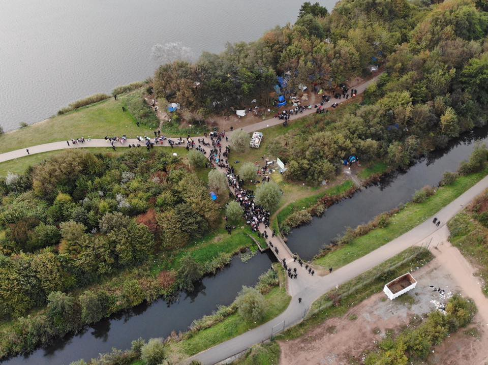
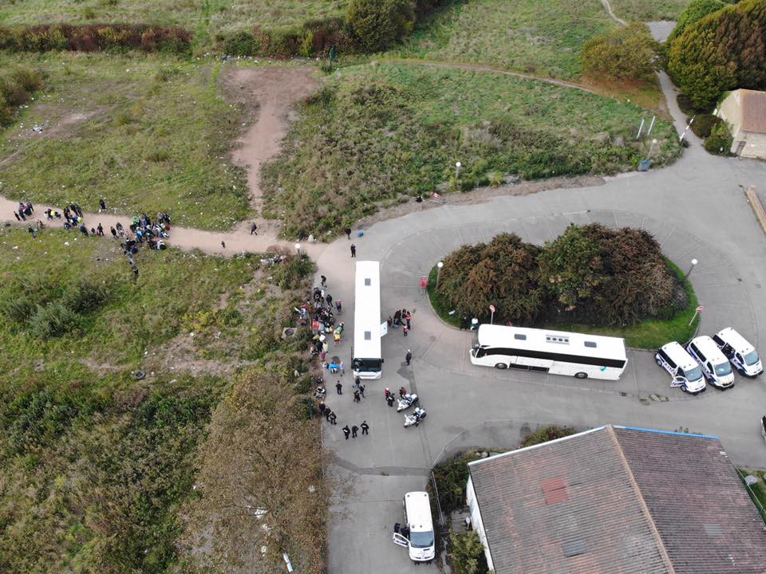
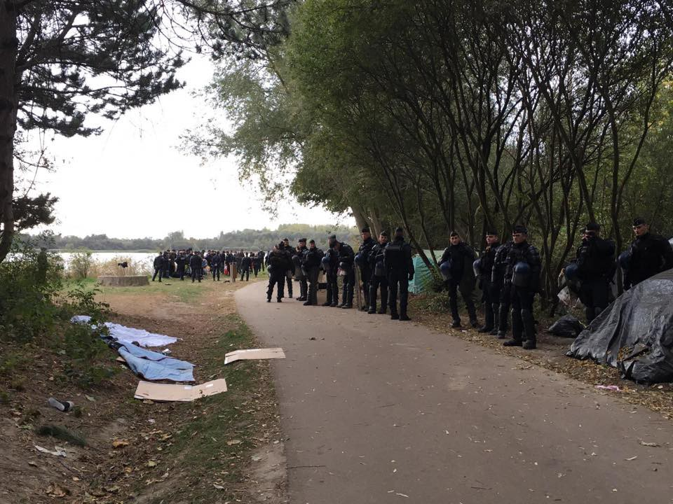
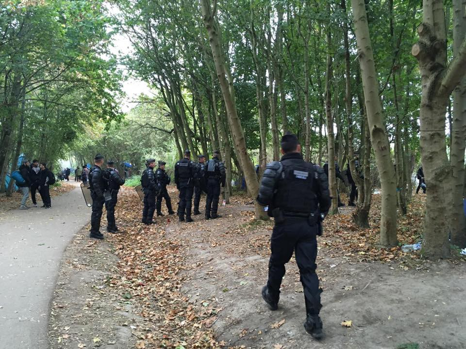
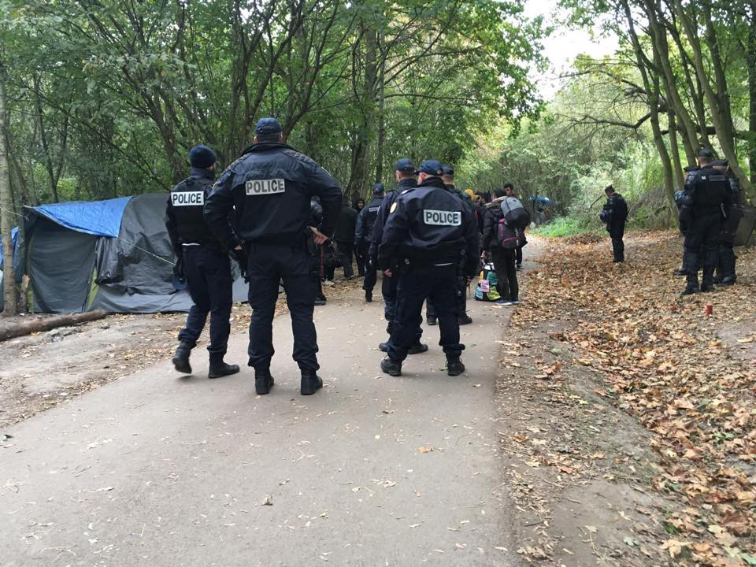
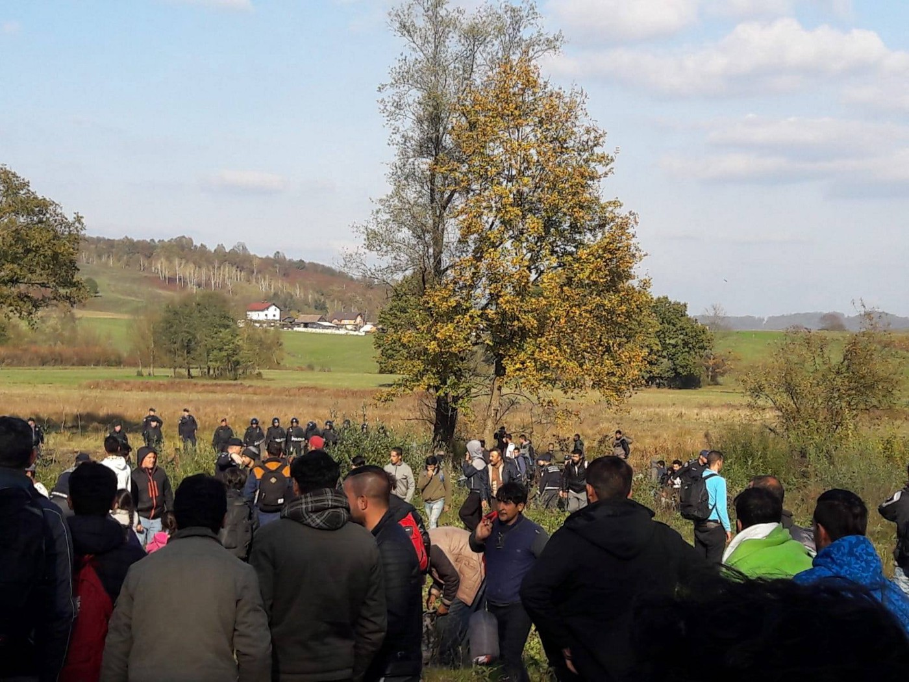
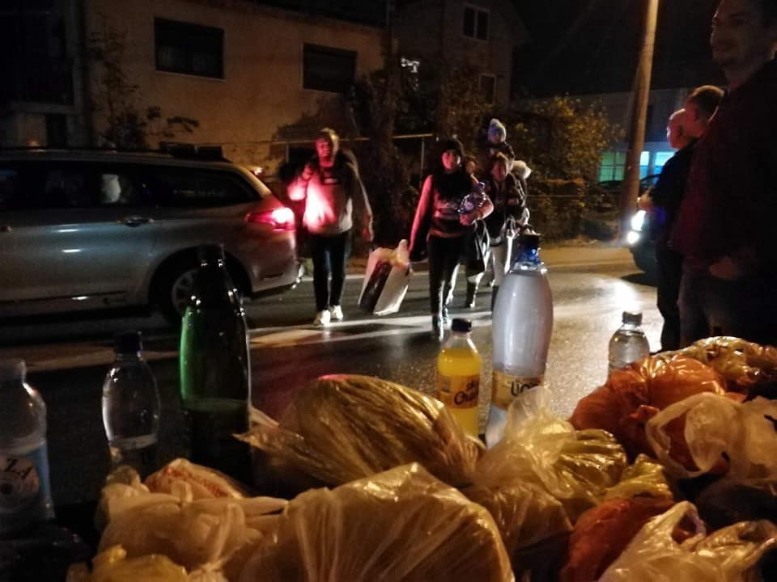
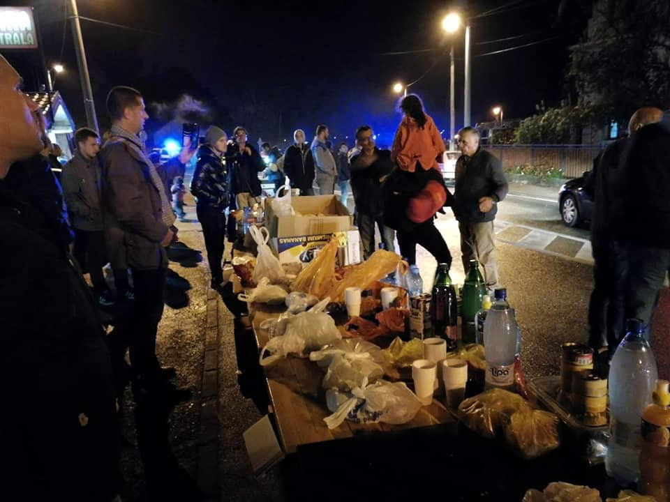

### AYS Daily Digest 23/10/2018: Don’t Believe Rumours, BORDERS ARE CLOSED\.

> **A rumour that borders between Bosnia and Croatia are open has been circulated in the last days\. This rumour is untrue\. Please be warned that all borders across the Balkan route to Europe remain permanently closed and border security will only be intensified\. Rumours like this are harmful and put people under serious risk\. Don’t believe them\.** 

](assets/f26176d4f778/1*PXjefWZK1xKYzPRGd8n3yQ.jpeg)

Source: [Refugee Women’s Centre](https://www.facebook.com/refugeewomenscentre/?__tn__=%2CdkCH-R-R&eid=ARA1PTR5V9SFTTw6b65zo8pWcmcUIMovegej6VGgvaJFbZ5aOfzoZSCE86UInwmtqgR9biL0fAUcgPQa&hc_ref=ARQO2_j_5jDwYbU1XZHhkLIc5yx1ZYpbcE3Oh-fUo1BH1AnYa-xhU8teCtY8_6fy4ZQ&fref=nf)

Feature: French Authorities Evict at least 1500 people from Dunkirk//Two hundred people left without food and water in Libyan Detention Centre// Crackdown on Refugees in Morocco// Protests continue in Bosnia as Police response intensifies// News from Greece// Italy//Portugal// and More…\.
#### FEATURE: French Authorities evict Dunkirk\. At least 1500 people forcibly removed\.

In the early hours of the morning, 500 police officers were deployed to the small town of Grande\-Synthe, just outside Dunkirk\. They surrounded the woodland in which 1500 people were thought to be living with the purpose of forcing their removal from the area\. Where they hope for them to stay instead remains unclear to organisations working within the area\.

It is the largest police operation in the area in over a year according to Mobile Refugee Support\. Authorities estimate that 1800 people were evicted\.

> People were hastily woken and removed from their tents, before being escorted in small groups to buses waiting in the car park and around the perimeter\. As always, the destinations of these buses are unknown and many drive for hours to reach accommodation centres across France\. For many who have never been through an eviction it can be a traumatic and confusing experience\. 

Source: Mobile Refugee Support

Source: Mobile Refugee Support

The eviction yesterday of Grande\-Synthe took place one day before the two\-year anniversary of the 2016 Calais Jungle eviction\.

Safe passage reports that two years on from the eviction of Calais ‘Jungle’ which saw the hasty and forced removal of 8000 people including 1,000 unaccompanied minors, promises by the British and French governments have not been kept\.
- Hundreds of Dubs places for unaccompanied child refugees remain unfilled\.
- Hundreds of children are refused the ability to reunite with their families\.
- Children continue to be forced to make dangerous journey by themselves\.

#### LYBIA

A group of 204 Eritrean Refugees residing in a detention centre in Tripoli, Alfurgha Sebha have been left without food or water for eight days\. The centre is managed by the Libyan Police\. Most of the refugees were moved to the centre three months ago from another centre in Tripoli\. Most have been registered by UNHCR in January\.
#### MOROCCO
#### Arbitary Arrests and Refoulment of Refugees on the rise

[In a widespread crackdown,](https://www.smh.com.au/world/africa/morocco-is-ejecting-sub-saharan-migrants-the-persecuted-blame-europe-20181023-p50bea.html?fbclid=IwAR0jm-McjMYB6XTC6X7FgvIGDNGE4TM5bSY5pUZFPemWw5m6J1CYZJlYGks) migrants of sub\-Saharan origin are facing a number of human rights violations\. These include arbitrary arrests without grounds, banishment to remote areas of the country and now even expulsion and refoulement\.

55 persons who were illegally and forcibly returned by Spanish authorities from European soil to Nador were arrested today\. The Moroccan Ministry of Interior announced that it hopes to expel them from the country and return them to their countries of origin\.

[CEARRefiguado](https://www.facebook.com/CEARefugiado/posts/2002896736437286?__xts__%5B0%5D=68.ARBUdVtqx1sR1tuMmQf3pItj955m_dXX4XlsZsosTfP5GgDONditj8nb2W5vn-gKB65VSoMF0VHrFWuO9Rkly8BjQQHVJ6nZ23svGgNaCcszz-eKk3zkY7QyjChH88ktxh3NL2zCHP-eyGC1KpgJKx4aShAS-4wP4uBN8nl2Aq3KklL4--beHdgrpDJkACPFK6qbpbyS4nlpG5ED1KX4wOODDb4&__tn__=-R) reports that their legal service were not allowed access to provide asylum information of the 55 persons\. Furthermore, considering that most of those returned were from Mali and spoke only Bambara, the organisation raises the question of whether there will be interpreters in their language to assist them in Morocco\.

It must be highlighted that the refoulement of refugees is prohibited under international law\. Morocco cannot be considered a safe third country for people seeking asylum when consistently disobeys laws that prevent the refoulement of refugees to countries which they will be subject to persecution\.

Another group of 30 persons traveling by bus in Nador, of Sub\-Saharan Origin were also arrested and refouled to their countries of origin illegally\.

Despite the consistent [human rights violations](http://---  https://www.facebook.com/AmdhNador/posts/2204886616390268?__xts__%5B0%5D=68.ARB6s-GXld_NRatSHaO4c5MWlwxJc0IJ9wwuRG8iU7YEyYBZhClEyOU961BDY4K4WvaKtAq_ffHabMxDiXwG9OV8Eb3hBdgO6fvEqLyW22ehrjq4aoK30DHzUwxywvW8csy4lHBr4v7At52KcsyPIF40ZPw5zydEXFbM3PFpFJp04G3iDHiUxtQtxdbAwWjjUtqPXRcsjsBwiTN6dxZvq9JdzHM&__tn__=-R   ---) committed by officials toward people attempting to cross from Spain to Morocco, the European Commission has just announced that it will provide a further 140 Million Euros to both countries\. The majority of this money will no doubt go toward further militarising the border between the two countries and continuing the EU’s torturous games with peoples lives\.
#### GENERAL
#### UNICEF Reports of the Troubles facing Refugee Children in Europe

UNICEF reports that between January and September of 2018, 89,000 people arrived to Europe via the Eastern, Central and Western Mediterranean routes\. Among the 89,000 persons were 19,500 children, nearly half of which \(44%\) were registered on the Greek Islands and another 34% in Spain\.

Increases in Arrivals to Greece and Spain over the Summer months led to serious overcrowding in reception centres and poor conditions of protection, health and hygiene\.

The risks for Children attempting to reach Europe are serious and are outlined by UNICEF below:

> Despite notable efforts across Europe, refugee and migrant children in many locations still have insufficient access to services such as health, education, protection \(mental health and psychosocial support, guardianship, case\-management, foster care arrangements, etc\. \) and information\. With the new school year, many governments made significant efforts in enrolling newly arrived children in formal education\. Yet, obstacles persist, especially when it comes to children from pre\-primary and upper secondary ages \(3–5 years old and 15\+ years old\), who often fall out of national compulsory education systems\. 

> Migration continues to occupy and polarize the political and public space across Europe, with persisting restrictions to search and rescue operations in the Central Mediterranean, tightening national asylum legislations \(e\.g\. in Italy, Hungary and France\) and increasing reports of hate crimes, immigration detention and violent push\-backs at borders in both Eastern and Western Europe\. Such practices expose children to significant risks of violence, abuse and exploitation, and lead to long\-term negative effects on their development and wellbeing\. 

#### SEA

IOM has reported that 1,857 people have lost their life in the Mediterranean in 2018\. That equates to on average 45 people per week\.

■■■■■■■■■■■■■■ 
> **[IOM - UN Migration 🇺🇳](https://twitter.com/UNmigration) @ Twitter Says:** 

> > 94,676 #migrants &amp; #refugees arrived by sea to Europe in 2018.

1,857 dead/missing. Learn more ➡️[missingmigrants.iom.int](http://missingmigrants.iom.int) https://t.co/iRoSwz3wyC 

> **Tweeted at [2018-10-23 05:56:00](https://twitter.com/unmigration/status/1054612381404286976).** 

■■■■■■■■■■■■■■ 

[SOS MEDITERRANEE](https://www.facebook.com/SOSMEDITERRANEE/?__tn__=%2CdKH-R-R&eid=ARDOru06HTt3NRXOv7Sn87ito1M64LQpt9_xb50G8JtOqoU0Qn-OpTGW_hxsFdzxy-XDYC8g0YjS29BH&fref=mentions) has announced that it will file lawsuits agains the 22 individuals that attacked its Marseille Head Quarters on Friday October 5\.

The 22 attackers stormed the office and ambushed the building lighting flares and hanging a banner from the office window\. Three employees were trapped within the building during the attack\.
#### SOS MEDITERRANEE statement:

“It is time that the safeguarding of life takes precedence over any political or ideological considerations\. More than ever, citizens are called on to mobilize with us, to defend this fundamental right and to help us resume our life\-saving mission as quickly as possible”

> We stand by SOS MEDITERRANEE\. The perpetrators of this attack would have you believe that it’s wrong to help another human in need, that some people don’t deserve to be helped, that Libya is a safe country, or that to provide aid is to commit a crime\. They are wrong\. — Help Refugees 

#### Rescues Continue

Two boats were rescued today in the Alboran carrying 57 and 37 persons\. They were taken to Motril, Guardamar Polyhymnia\. Another boat carrying 58 people was taken to Malaga and a third carrying 30 people was taken to Arrecife\.

A boat which was sinking this morning was rescued by the Moroccan Coast Guard\. At the moment there is another boat with 56 people in it who have called for help in the Alboran Sea\.

■■■■■■■■■■■■■■ 
> **[Helena Maleno Garzón](https://twitter.com/HelenaMaleno) @ Twitter Says:** 

> > Se hundían esta mañana en el Estrecho y consiguieron ser rescatadas por Marruecos. En estos momentos hay otra patera con 56 personas en #Alborán cuyas vidas corren peligro. https://t.co/ghyxzmAIPU 

> **Tweeted at [2018-10-23 09:40:11](https://twitter.com/helenamaleno/status/1054668800761700352).** 

■■■■■■■■■■■■■■ 

#### GREECE

People living in the Vial detention centre on Chios today gave roses to the workers of the asylum service\. The note reads:

‘We are here since last year and we did not get any response whether it’s positive or negative\. Anyhow, thanks for Greek Government for having us\.’

](assets/f26176d4f778/1*rV-MdhyhyOqk-bXVLSi1qw.jpeg)

Source: [Edie Leon](https://www.facebook.com/profile.php?id=100011080893942&fref=gs&__tn__=%2CdC-R-R&eid=ARA1SfduiijyOJgtpRRGex4GxjlQQeDE0f7Wl1vGhkfxlmBsW_i-A0ayEN3fgnXiswFDquDsfOSittDB&hc_ref=ARQLGRjX3Fj0JjQNUue-dzR8Rhfaq4Ikh1PxL3K3hkdUqIvL3Stc6qqyPmKsREOZcLo&dti=1652972374920129&hc_location=group)

[A woman](http://www.efsyn.gr/arthro/sto-401-afisan-prosfyga-avoithiti-giati-den-dehontai-allodapoys?fbclid=IwAR0LhYCu0xCr7zpUXuMwGzXbD4GQDMU8MGbTLdZ58WXwAfduqBnLdxz353Y) who was waiting in line at the asylum service in Athens experienced a health issue\. Emergency health services required over an hour to arrive to her aid at which point a worker at the asylum service called a military hospital to ask for help\. They replied with ‘Sorry, we do no accept foreigners\.’

A new video outlines the ten steps of the asylum procedure in Greece\. It is available in 8 languages; Greek, English, French, Arabic, Farsi/Dari, Urdu, Amharic and Tigrinian\. For more information and access to the videos please [follow this link\.](https://www.facebook.com/Greekforumofrefugees/posts/2151722178195910?__xts__%5B0%5D=68.ARDofAijZznmSM6-LdA2TlFiExlsEYYx9SK2ewhFdIyNrH_TLebUfpLO4N7upi0njdrh9np7YWaCntQT5NUMrzfyANbgwecWWt5zRSDGcPF-ra5TvL12aP-GUsPy11yRnyNSe0tH2-29m1qqz6BxioFDvKqU-hmuTrooaS830JIozB0pUbFQ3p3mEDbUih_D4rHmz21YzmI9qTzWwfCC3ExtFPE&__tn__=-R)

Great news from Rhodes\. Mohammed is free, after 2,5 months in Rhodes prison\!
#### BOSNIA

Source: No Name Kitchen
#### Protest at Borders Continues — Entering third day\.

Yesterday more than 200 people, approached the town of Izačić where they spent the night protesting the border closures across the Balkan Route\. Locals once again provided food, drinks and blankets\. The hope of the protest was to provide visibility to the situation of thousands who remain trapped at the entrance of the European Union in desperate conditions\.

The protest has remained peaceful\. Despite this the response from police toward any persons attempting to cross into Croatia has been anything but\. This morning No Name Kitchen reports of a man who was violently beaten with batons by police and had to be hospitalised due to a broken arm\.
#### Police are blocking refugees from moving toward Bosnian Border Towns

Today police in Bosnia decided to prevent refugees from moving toward the border, cities of Bihac and Velika Kladusa\. [At the railway station in Bihac this morning](https://www.klix.ba/vijesti/bih/policija-ne-dozvoljava-migrantima-da-se-iskrcaju-iz-talgo-voza-u-bihacu/181024022?utm_medium=Status&utm_source=Facebook&utm_content=181024022&utm_campaign=Klix.ba%20Facebook%20status&fbclid=IwAR0QkhizXIv98LvARP1t0abhE53ENmg4No4VSewiJZuPHMhE-4jNUFt_uds) , police blocked a train carrying 90 people on the move from Sarajevo\. Preventing them from exiting the train\.

The decision was made after the citizens in Bihac went out on the streets demanding from the authorities to find a solution for people who are in this city and do not have place to stay\. They are left to live in inhumane conditions, out in the open, with minimal care provided by the authorities, or any of the big NGOs involved, IOM, UNHCR, Red Cross and DRC\. Previously officials from this part of the country demanded several times that state authorities have to be more active in finding solutions for growing number of people who are arriving in Bosnia\.

So far, there are no solutions\. The IOM has announced several times that new camp near Sarajevi will be open soon, but this is yet to happen\. Again this week they said it will happen, soon\. However, this camp will have capacity of up to 420\. So far, three camps are functional — Salakkovac, near Mostar with about 210 people at the moment, Sedra near Bihac, with about 350 people inside, Delijas near Sarajevo with the capacity of about 120, but it is most of the time almost empty since it is high up in the mountains, has not internet of phone connection\. All other places are just improvised\.

After the police, ministry of security and IOM agreed that people would be prevented from coming to Bihac, tonight the bus from Sarajevo was stopped in one small village and all the refugees were kicked out and left on their own\. People from the the village came out and bring them food, tea and blankets\.

Source: Volim Bihac
#### And What about the Children on the move in Bosnia? No registration, vaccination or education

Children on the move who are in Bosnia at the moment do not get vaccinated, even though by the law they have to\. Local medical institutions are waiting for the instructions from the Ministry of Security, but they do not engage in this way with the people on the move in Bosnia\. Most of them are not even registered, since the Ministry is avoiding registration\. Among those who are not registered are also babies, including new borns\. However, not even the big INGO present in Bosnia are concerned about children's’ wellbeing\. Nobody is willing to discuss the topic of vaccination, registration, or education for the children, so far\. Several hundreds of children, some unaccompanied minors, are at the moment in Bosnia\. Many are forced to sleep out in the open, without care from anybody\.
#### ITALY

[Joel Nafuma Refugee Center](https://www.facebook.com/JoelNafumaRefugeeCenter/?__tn__=%2CdkCH-R-R&eid=ARChTwx7aTmobpz-9f_-cGyDDWIn0KvPa6QONc9YNSojA828iFGQE8H94wsqgTLOqsS-t8zD3PVNJmuT&hc_ref=ARR-JOWzP4Ai8xPwckKK4H6j9G6r-g34RZzNroYjlcEdMmS63KfcBKYLI4gWbsOrR5o&fref=nf&hc_location=group) are opeining a New ‘Safe Space’ Nurcery project in Rome that will provide a calm, safe space where babies and mothers can rest\. The projects is in partnership with MEDU and UNHCR\. They are currently in need of baby clothes, jackets and shoes, good condition strollers and diapers\.

A protest is planned for the 10th of November at 2pm in Rome\. It is titles United and Solidarity against Government, Racism and Decree Salvini\.

To find out more please [follow this link\.](https://www.facebook.com/events/155785395376127/)

[A joint letter](https://www.abuondiritto.it/it/notizie/1976-roma,-sgombero-al-presidio-di-baobab-experience-lettera-alle-istituzioni-della-rete-legale.html?fbclid=IwAR189N9LlAaYdj1010rH8_F8sLZqohga2H1C6TDYHzUx6gwvSEwfmCTA9YQ) has been written by A Buon Diritto, Baobab, CIR and Radicali to the municipal authorities in Rome\. It asks the authorities to please stop the evacuation of the camp were 180 people are residing or to do it in accordance with the needs of the people living there\. They emphasise the point that vulnerable persons with unstable health conditions are present in the camp in addition to unaccompanied minors\.
#### PORTUGAL

Portugal is planning to discuss with Greek Authorities about the transfer of refugees between the two countries\.

> ‘Portugal is willing to establish a mechanism of bilateral cooperation of transference of migrants from Greece to Portugal with support from the European Union\.” — Eduardo Cabrita 

#### SERBIA

In response to the rumours that borders were opened between Bosnia and Croatia, a few hundred refugees residing in Adasevci and Principovac camps in Serbia self organised and gathered around the border crossing at Batrovci — in an attempt to cross from Serbia to Croatia, hoping authorities would let them\. The attempt was unsuccessful\.

**We strive to echo correct news from the ground through collaboration and fairness\.**

**Every effort has been made to credit organizations and individuals with regard to the supply of information, video, and photo material \(in cases where the source wanted to be accredited\) \. Please notify us regarding corrections\.**

**If there’s anything you want to share or comment, contact us through Facebook or write to: areyousyrious@gmail\.com**

_Converted [Medium Post](https://medium.com/are-you-syrious/ays-daily-digest-23-10-2018-dont-believe-rumours-borders-are-closed-f26176d4f778) by [ZMediumToMarkdown](https://github.com/ZhgChgLi/ZMediumToMarkdown)._
