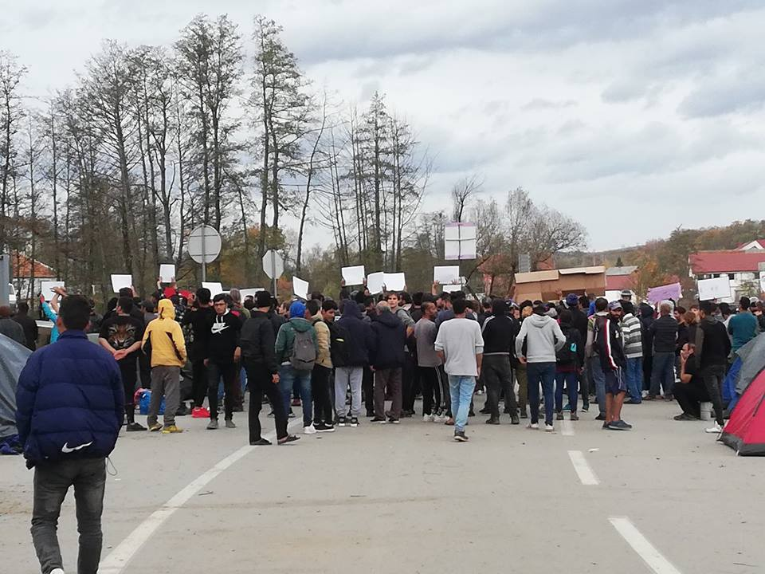
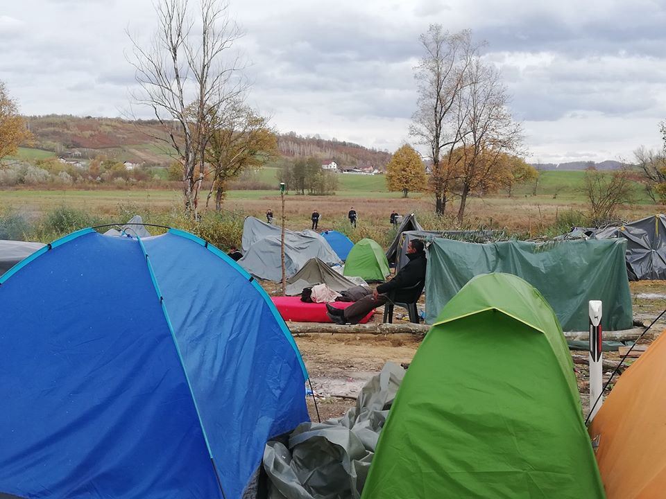
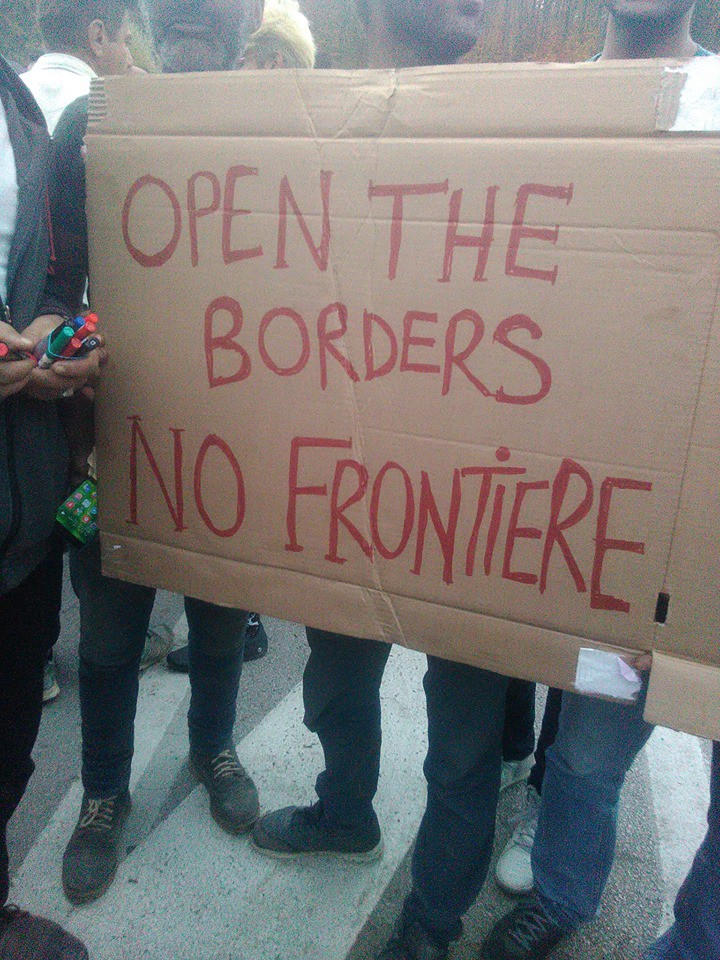
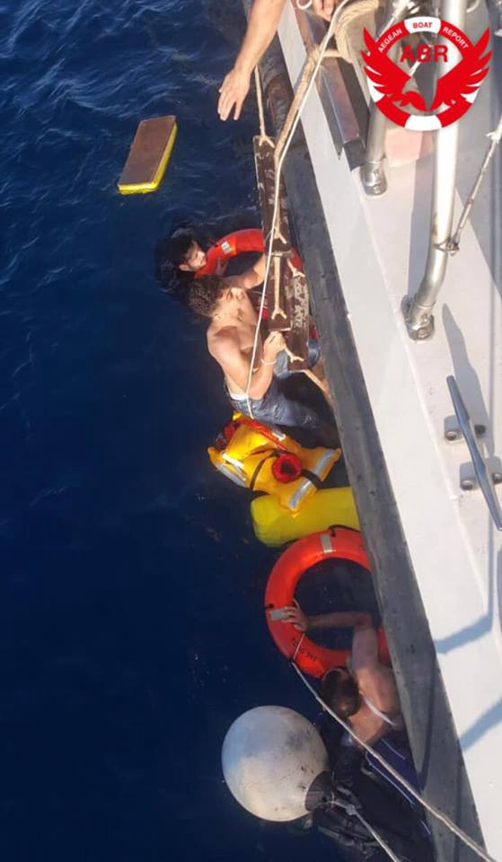
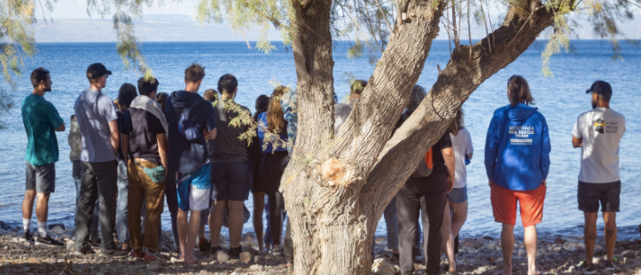
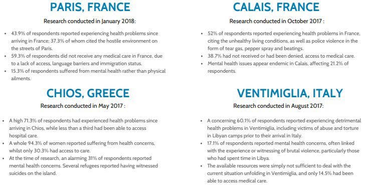

### AYS Weekend Digest 27–28/10/2018 Volunteers report from the Bosnian\-Croatian border

More unnecessary deaths at sea /// Activists face jail in France /// Another reception project set to close in Italy /// EU states free to break their own rules /// Memorial for those lost at sea held in Lesvos…

 \)](assets/4fba554e3845/1*NEr6gji434fc1WXFDMO-pg.jpeg)

No One is Illegal, protests at Bosnian\-Croatian border \(photo by [Chiara Lauvergnac](https://www.facebook.com/chiara.lauvergnac) \)
#### FEATURE: Report from the Bosnian\-Croatian Border

> We ask all the responsible institutions to take necessary measures and to open the border with Croatia\. In this way, we demand that basic rights — right to freedom of movement of people and good, as well as to work — are fulfilled\. 

With this message, people from Velika Kladusa want to reach the local government, the authorities in Croatia, and also organisations like IOM and UNHCR, six days after the border crossing in Maljevac, between Bosnia and Croatia, was closed due to protests\.

Photo by AYS volunteer

The protests started a day after a rumor spread about the opening of the border to the EU\. Several hundred people were on the move that day, but those who arrived to the border crossing were stopped by the police from both sides\.

After about 24 hours, and minor clashes with the police, people were moved and formed a small makeshift camp several hundred meters from the border area\. The camp is guarded by the Bosnian police\. However, Croatia do not intend to allow the border to reopen as long as the camp is there\.

For six days, hardly any international organisation responsible for the well\-being of refugees and migrants visited the camp\. No IOM or UNHCR are visible at the site, even though the head of the IOM claims, as [reported by local media](https://www.klix.ba/vijesti/bih/oprecne-tvrdnje-iom-a-i-gp-bih-zasto-se-migranti-iz-velike-kladuse-ne-prebace-u-biru/181028016) , that they are providing first basic help, including medical aid, food and water\.

While local doctors, supported by MSF, are providing medical help, people in the camp have to provide food for themselves, with the only help arriving from the local community\.

Photo by AYS volunteer

The local population in Velika Kladusa, a small town of about 25,000 people, is providing food, shelter, and most of the help to all those who have arrived to the city since February this year\. Kladusa is one of the cities in Bosnia and Herzegovina that was heavily affected by the war in the Nineties\. Big industry in the city is destroyed, and most people work for small scale businesses, and often with import\-export of goods\.

At the same time, since the prices in Bosnia are much lower than in the neighbouring Croatia, many people come to Kladusa to buy basics\. Over the last six days, due to the closure of the border, all this has been interrupted or diverted to other border crossings that are much further away\.

Additionally, many people from Kladusa left the city due to the lack of jobs, and they live in Croatia, Slovenia, Austria and Italy, coming home for the weekends\. This is now impossible as well\.

The day before the protests, representatives from the city went to negotiate with protesters promising that they will continue supporting them, but in order to do that they need to continue working\. However, they refused which provoked a wave of dissatisfaction\.

“We are not against the people,” many people in Kladusa keep saying, explaining that they understand the difficult situation, but they are afraid that if the blockade continues, they will not be able to support themselves\.

Additionally, negligence by the responsible authorities and big INGOs in Bosnia, left thousands of people on the move — like it is the case in Kladusa — on their own, and only supported by locals\. In Sarajevo, Tuzla, Mostar, Velika Kladusa, Bihac and all other cities where there are refugees, the burden is on citizens\.

Bosnia is very poor country and after 10 months, the situation is becoming really more difficult, especially with another winter on its way\.

Nevertheless, many people in Kladusa are willing to continue offering help, as long as they can and with their own means, aware that this is not the solution\.

The support coming from the big INGOs is risible, and their role in the crisis in Bosnia is generally very murky\. Most of the time, as in Greece, they are playing the blame game with the government\.

**Meanwhile in Sarajevo**

In the last weeks several camps have hastily been opened in the areas of Bihac and Sarajevo\. The recently opened Usivak camp near Sarajevo is already full, not to say overcrowded\. There are already tents put up in the warehouse, which was intended to be a free shop and a place for activities in cooperation with volunteers\.

On Saturday, an estimated 420 meals were served according to official numbers\. It is hard to tell exactly how many people live in the camp and no one was prepared to receive this many people so quickly\. People are more or less just passing in and out, especially given the unclear circumstances with registration\. Funding for 400 meals is secured by the local NGO Pomozi\.ba, but over that number IOM will have to provide extra funds\. The food is cooked by volunteers\. The lack of health screening remains an issue\.

Among the organisations working in the camp are UNHCR, IOM, UNICEF, SFA \(Service for Foreign Affairs\), and the volunteer groups AidBrigade and Collective Aid\. Non\-Food\-Items distributions will hopefully start this week\.

People keep arriving in Sarajevo from both Serbia, Montenegro and from the border with Croatia\. The Bosnian police is stopping refugees from entering the Una\-Sana Canton\. They control cars and buses on the road to the Bihać and Velika Kladuša\. Refugees are forced to leave the buses and are later sent back to Sarajevo even though there are not enough facilities to accommodate them\. Refugees are refusing to leave the border, well aware that being there is their only option\.

\(Photo by Chiara Lauvergnac\)

Moreover, it currently seems that SFA will not register people at their office in Sarajevo any more, but only in the camp\. This means that people arriving in Sarajevo will have to go to the camp, about 45 minutes outside of the city in the town of Hadizici, in order to obtain their mandatory white cards\.

SYRIA
#### Rukban camp on Jordanian/Syrian border still under blockade

A convoy of relief supplies for 45,000 Syrians trapped in the no\-man’s land camp of Rukban, on the closed border between Syria and Jordan, failed to arrive last week as planned, IRIN [report](https://www.irinnews.org/news/2018/10/26/syria-jordan-relief-convoy-fails-reach-desperate-border-camp?utm_source=twitter&utm_medium=irinsocial&utm_campaign=irinupdates&fbclid=IwAR36o5QYxM-6S4A-_hg1o2TpM5pGRM9SxTr8oMO05Hih7-3sOBompXqKbMQ) \.

The area, that has recently been declassified by the UN from “besieged” to “difficult\-to\-reach”, continues to remain cut off from aid, commercial shipments of food, and medical care, and it is reported that hunger, disease, and sexual abuse are on the rise\.

Aid workers in the area describe the conditions of the camp as hell, saying that it is still “de facto besieged” by the Syrian regime and that the situation there has “never been as bad as now: \[…\] prices of basic commodities inside the camp are skyrocketing, food supplies precarious, and reportedly deaths are rising due to the living conditions and lack of health care\.”

Read more [here](https://www.irinnews.org/news/2018/10/26/syria-jordan-relief-convoy-fails-reach-desperate-border-camp?utm_source=twitter&utm_medium=irinsocial&utm_campaign=irinupdates&fbclid=IwAR36o5QYxM-6S4A-_hg1o2TpM5pGRM9SxTr8oMO05Hih7-3sOBompXqKbMQ) \.

MOROCCO
#### The Tragedies of Migration Continue

 \)](assets/4fba554e3845/1*y391wsBcGhsEagTf0mqozQ.jpeg)

The tragedies of migration continue \(photo by [Nardocity](https://www.nadorcity.com/%D9%85%D8%A2%D8%B3%D9%8A-%D8%A7%D9%84%D9%87%D8%AC%D8%B1%D8%A9-%D9%85%D8%B3%D8%AA%D9%85%D8%B1%D8%A9-%D9%81%D9%82%D8%AF%D8%A7%D9%86-%D8%AD%D9%88%D8%A7%D9%84%D9%8A-24-%D9%85%D9%87%D8%A7%D8%AC%D8%B1-%D8%B3%D8%B1%D9%8A-%D9%88%D9%86%D8%AC%D8%A7%D8%A9-4-%D8%A8%D8%A3%D8%B9%D8%AC%D9%88%D8%A8%D8%A9-%D8%A8%D8%B9%D8%AF-%D8%BA%D8%B1%D9%82_a69625.html?fbclid=IwAR1ZtbDoH_b8CBPmELuSkdCLHsI-gLNScw0uLKzK0j6Nk9Ttj3ERY0SJRMo) \)

The [Association Marocaine des Droits Humains](https://www.facebook.com/AmdhNador/posts/2207111336167796?hc_location=ufi) and the [Huffington Post Maghreb](https://www.huffpostmaghreb.com/entry/nador-20-migrants-marocains-retrouves-morts_mg_5bd493e9e4b0d38b58840b67?utm_hp_ref=mg-maroc&fbclid=IwAR22IuAupzplyDgC-PvLHK3nuDkLeHs8kX4H7VvTon9veRHOKI4Zl7LoThg) have been reporting over the weekend on the fate of a boat that capsized on Friday\. The boat carried between 18 and 24 young Moroccans and departed from Charrana beach\. 4 migrants were rescued and 16 others disappeared\. The Rescue Operation was slow due to bad weather\. Survivors report that only half of the passengers had life jackets\. Those who were saved were found by local fishermen\.

> Despite the fact that 2018 was very deadly, the means of relief were not strengthened\. 

> The EU prefers to finance the means of repression and removal of migrants instead of means of relief and rescue of human lives\. _\(AMDH\)_ 

On Saturday it was reported that 20 bodies washed up on the same beach \(photos are available of those who have lost their lives but are not published by us out of respect for their families\) \. In 2018 so far, the morgue in Nador Hospital has received over 100 bodies of sub\-Saharan and Moroccan migrants making this the most deadly year\.

> It is not by chance that this is the same year when European migration policies have hardened in parallel with an earlier repression of the Moroccan authorities\. _\(AMDH\)_ 

Meanwhile [ECRE report](https://www.ecre.org/morocco-plans-to-deport-migrants-arrested-at-the-spanish-border-amid-wider-restriction-of-immigration-policy/) that Morocco is to deport 141 migrants who were arrested on Sunday, following the attempt by up to 300 people to enter Spain by crossing the border fence at the Moroccan enclave of Melilla\. The attempt resulted in the death of one man who suffered a heart attack, while at least twenty\-two others were injured\. Fifty\-five migrants were returned by Spain to Morocco the day after the attempt\.

> In addition, nearly 4,700 migrants have been arrested in Nador since last August, according to the president of the AMDH Nador, who said that they are often released “far from the borders in the regions of Tiznit or Beni Mellal”\. — _\(Huffpost\)_ 

Europe continues to keep irregular immigration into Europe via Morocco high on the agenda in recent EU\-Morocco negotiations\. The EU agreed to award Morocco a $275 million aid package last month\.

> The Moroccan foreign minister Nasser Bourita, however, has denied that EU is dictating its domestic immigration policies\. “Morocco does not play and will never play the role of policeman for the European Union,” he said\. _\(ECRE\)_ 

Given that Moroccans themselves are trying to escape the situation in Morocco, while the EU throws money at a country clearly breaking human rights laws and killing their own citizens — such as the incident only last month when the Moroccan Royal Navy [shot and killed](https://www.aljazeera.com/news/2018/09/moroccan-woman-dead-navy-fires-migrant-boat-180926082732845.html) a young Moroccan woman who was aboard a migrant boat — we cannot help but wonder how many human lives the EU is willing to sacrifice before it grants freedom of movement to all? Instead it keeps this freedom the reserve of ex\-colonial countries who have built their wealth on the backs of the grandparents of those who know die at our borders\. In what version of history is this acceptable, let alone legal?

SEA
#### More people die in the Western Mediterranean

During the weekend two boats carrying 54 people each sent [distress messages](https://www.facebook.com/watchthemed.alarmphone/) from the sea between Morocco and Spain\. A first boat was carrying 10 people and 5 children and was rescued on Saturday\. Tragically two children were found dead\.

A second boat seems to still be missing and the conditions of the sea worsened on Sunday, with high waves and strong winds, hindering SAR operations\.

From Watch The Med — Alarmphone:

> The Spanish search and rescue organisation Salvamento Maritimo told us that they could not search for them tonight due to the adverse weather conditions but we are certain that some assets could be sent out for rescue\. Contact to the boat was last established around 19 hours ago and we fear that the people on the boat might not survive another night out in the open sea\. 

> We demand the immediate deployment of available rescue assets\! 

#### 75 people rescued off the Italian coast

[Mediterranea — Saving Humans](https://www.facebook.com/story.php?story_fbid=283055175649047&id=272928206661744) reports that on Sunday morning the Italian Coast Guard rescued 80 people off the coast of Crotone, in the Calabria region\. All the people, including 8 children and 16 women, came from Iraq, and were onboard a sailing boat that set off from Turkey\. Rescue operations were particularly difficult due to the sea conditions, but all the people were rescued\.

[Media sources](https://www.repubblica.it/cronaca/2018/10/28/news/calabria_migranti_in_mare_in_bali_a_di_onde_di_due_metri_i_presunti_scafisti_si_mettono_in_salvo-210207350/?fbclid=IwAR0Xj1i_cIl2DAyC-xvi8cL_KVnV8yp0ZbTGvE3kH0CmIrlYfVyGfhNMNHE) report that two people, believed to be the smugglers, used the tender to reach the Italian coast and were then stopped by the police\.
#### SEA\-EYE is equipping two new ships and looking for machinists

Sea\-Eye is working on getting ready with their two new missions: the observation vessel Bavaria and the rescue boat SeaEye2\.

A machinist is urgently needed on the SeaEye2\. [Read more here](http://www.saveLives.info/) \.

Help is needed to equip both the new missions:

You can donate [here](http://www.mission-bavaria-one.info) for the \#MissionBavaria and here for [\#SeaEye2](http://www.saveLives.info) \.

For more information on how to donate, visit [here](https://www.facebook.com/seaeyeorg/) \.

GREECE
#### Arrivals

Two boats [arrived](https://www.facebook.com/AegeanBoatReport/posts/465317790657997?hc_location=ufi) on Samos on Saturday\.

The first boat carried 62 people, the second 51 people\.
#### Woman Gives Birth at Sea

[Aegean Boat Report also state](https://www.facebook.com/AegeanBoatReport/videos/vb.285298881993223/338333423628620/?type=2&theater) that a boat, which was stopped outside Bademli, Dikili district at 7\.40 on Friday morning by the Turkish Coast Guard, was carrying a pregnant woman who went into labour after they had apprehended the vessel and moved the passengers onto the TCG boat\. She gave birth at sea to a little girl\.

The boat was carrying 40 people, 20 children, 9 women and 11 men\.
#### Another Death in the Aegean

[Aegean Boat Report](https://www.facebook.com/AegeanBoatReport/posts/465533677303075?hc_location=ufi) recorded the case of another unnecessary death at sea on the 25th of October\. An emergency message was sent at 16\.50 from a speedboat outside Akyarlar as it had already begun to sink\.

> The Turkish Coastguard was immediately notified, but for one woman, they arrived too late\. 5 children and 7 adults was rescued, a woman found drowned\. 

The boat’s destination was Kos\.

Every death is a death too many\. We offer our condolences to her family, and to the families of all of the people who have lost their lives in the Mediterranean this weekend\.

According to the Greek Government there are currently 19,529 people trapped on the islands\.

LESVOS
#### Memorial Held for those Lost at Sea by [Refugee Rescue/’Mo Chara’](https://www.facebook.com/RefugeeRescueUK/?__tn__=%2CdkCH-R-R&eid=ARCQuunE-D_VUiuBCZYsdFGs-Zh_FagBxoHCL6rHZg79egkJFfY7V4RnTnO5fd8enMNsWh7Faar9KNRI&hc_ref=ARRoscFclVYpAPcytxm1vCPt2pKIQnil69o-qpehKfPWBgtIwfHavsFe9K1ccmUsvHc&fref=nf)

Memorial for those lost at sea, Lesvos \(Photo by Refugee Rescue /Mo’Chara\)

> At around 4pm in the afternoon, on the 28th October 2015, this boat — which was carrying an estimated 350 people — sank just off the coast of Molyvos\. The rescue that followed was long: 272 people were recovered due to the valiant efforts of Proactiva Open Arms, Coast Guard vessels, and fishermen from both Greece and Turkey\. 

> It is believed that around 75 people were lost beneath the waves\. But we cannot be sure\. Some of the bodies were never recovered\. 

> \[…\] We must not forget them\. We will not forget them\. 

#### Video Appeal from Moria

Independent volunteers are attempting to get a container of winter supplies to Lesvos but their donor has pulled out at the last minute\.

[https://www\.facebook\.com/sk\.aldeen\.3/videos/1213947558763738/?hc\_location=ufi](https://www.facebook.com/sk.aldeen.3/videos/1213947558763738/?hc_location=ufi)

The deadline to pay for the container is Wednesday 31st of October\.

Support them [here](https://gogetfunding.com/moria-refugee-camp-winter-aid-2018/) \.

CHIOS
#### Chios People’s Warehouse Need Donations

In the middle of all these difficulties, there are some out there who are celebrating our ability to work together\.

They still need 200 jackets\. You can support them through their [fundraising page](https://www.gofundme.com/vc9tw2-resources-for-vial-refugee-camp?fbclid=IwAR2y4nhR-9xcq23LE1huK9OYfgoTyM6jIVIBMMaektiPt-dDnrUbwZaAXDI) or by [contacting their co\-ordinator](https://www.facebook.com/nina.t.mckee?__tn__=K-R&eid=ARBIo-KKiss-rz-1gJ7Du6rgU2sDG0qLp2dDVM6ZLeBPqg-UVPdKydHQ79QqOkDiQCZvUeSnuyVoSWWW&fref=mentions) \.

ATHENS
#### EU Countries Break International Law, Again

[The Greek Council for Refugees](https://www.gcr.gr/en/news/press-releases-announcements/item/995-sovares-paraviaseis-kata-tin-epistrofi-aitoyntos-asylo-sto-plaisio-tis-efarmogis-tis-legomenis-symfonias-dioikitikis-diefthetisis-elladas-germanias?fbclid=IwAR1n1e5zVjsaVU3vnzCrQRvyoMWlihbTHpPqedac0pJ_LxcJPxD871YtkY0) reports on serious violations during the return of an asylum seeker through the implementation of the so\-called “Greece\-Germany Administrative Settlement Agreement”\. The asylum seeker, a Syrian citizen, was identified by the German authorities in early September 2018, but despite having requested asylum, was returned to Greece on the same day\. He was then automatically detained in a detention centre before being returned to Leros as part of the implementation of the EU\-Turkey Joint Declaration for the purpose of his readmission to Turkey\. He has since remained in prison in conditions that constitute inhuman and degrading treatment\.

This results in serious violations of international and EU law, as:

> a\) his application for asylum in Germany has not been recorded 

> b\) he was deprived of his right to appeal against his return to Greece 

> c\) the procedure under the Dublin III Regulation, which is the only legal process for transferring asylum seekers from one Member State to another, has been circumvented\. In this way, any guarantees provided for in the Dublin III Regulation were overlooked, in particular as regards the host authorities’ obligation to provide the applicant with returning reception conditions \(housing\) while the application for returning him to Greece was processed 

> d\) He was deprived of the fundamental rights of a just and effective asylum system\. 

He is now at risk of being returned to Turkey\.

> The SPC stresses that agreements between states attempting to circumvent the requirements of International Law have serious legal and political implications\. 

As usual, it is clear that EU states are free to break as many laws as they wish and suffer few or no consequences\. Yet, if an individual is forced to travel irregularly in order to survive, these same states will detain and abuse them for, ‘breaking the law\.’

Together we are many, our voice is loud, we must use it to bring the real law breakers to justice\!

ITALY
#### “Rights, not privileges” demonstration in Turin for asylum rights

On Saturday the [National network for asylum rights EuropAsilo](http://www.europasilo.org/) held a demonstration against the racist laws approved by the Italian government in the last months\.
#### Udine, Aura reception project to be closed by January 1st

Local news [report](http://messaggeroveneto.gelocal.it/udine/cronaca/2018/10/23/news/fontanini-stop-ai-profughi-negli-appartamenti-in-citta-1.17385427) that the mayor of Udine decided to close the _diffused_ reception project “Aura”\. From January 1, 2019 about 300 asylum seekers, who are now living in apartments, will have to leave and be accommodated in other cities\.

The mayor says that in Udine there are too many refugees \(965\) and this situation creates inconvenience for its citizens\.

Now in the Cavarzerani camp there are about 500 asylum seekers and around 100 in the Friuli camp\.

SPAIN
#### Solidarity from Spanish children to people stuck on the Balkan Route

SWITZERLAND
#### Help Needed in Basel

[Basel hilft mit — Bahm](https://www.facebook.com/baselhilftmit/?__tn__=K-R&eid=ARCzZiOr1Gp_JXawyJ8UWt6jQsFpqBTzJrtfi_UA2hB9YIX_PaqOKZOgjuvmBv7MPGtWe2SO9jGJxNSt&fref=mentions) are currently preparing a transport of winter clothes to a camp near Mostar \(Bosnia\) \. They are in need for people to help them sorting these very important donations\.

> If you are free and would like to spend the first cold weekends doing something good, the people from Bahm are looking forward to receive your mail \(depot@baselhilftmit\.org\) \. 

The next sorting date is on November 4th\.

FRANCE

**Freedom for the 7 of Briançon**

 \)](assets/4fba554e3845/1*Il4CbtEqbyMBkgDV-bcCIg.jpeg)

\( [La Cimade](https://www.lacimade.org) \)

[La Cimade](https://www.lacimade.org/agir/nos-petitions/liberte-et-relaxe-pour-les-7-de-briancon/) and [Statewatch](http://www.statewatch.org/news/2018/oct/7-of-briancon.htm?fbclid=IwAR1O8sC85PL7ZI9KCjXTLnsTO6TYH7Z6YvBJUhwb0Kkoyq2cd2EgxQaVpsU) report that 7 activists are facing potential incarceration for helping migrants in danger in the French Alps\.

> Bastien, Benoit, Eléonora, Juan, Lisa, Mathieu et Théo will face justice on November 8th in Gap, in the Haute\-Alpes department\. They are prosecuted for ‘helping undocumented foreign nationals to enter national territory, in organised gang’\. The envisaged penalty is 10 years in prison and 750\.000 euros fine\. What have they done wrong? Being involved in a march against the small far\-right, group called ‘Bloc identitaire’, which was obstructing the border so as to retaliate against migrants trying to cross it\. 

As already happened in other situations, the notion of an ‘organised gang’, originally meant to tackle organised crime, is now being used against activists and volunteers and more generally as a “tool to intimidate citizens who show solidarity with migrants”\.

> The prosecutor’s office has, hence, chosen to prosecute pacific activists while enabling the far\-right activists of “Bloc Identitaire” to evade punishment, as they didn’t face any charges\. 

La Cimade invites everyone to sign [this petition](https://www.lacimade.org/agir/nos-petitions/liberte-et-relaxe-pour-les-7-de-briancon/) to express solidarity with the 7 of Briançon, asking for all charges to be dropped as a follow\-up of the recent French Constitutional Court’s ruling, which enshrined the principle of fraternity as a constitutional principle\.

> We all stand against the “crime of solidarity”\! 

> We are all criminals for expressing solidarity in “organized band”\! 

#### Rigardu e\.V\. to go to Calais in December

Rigardu e\.V\. are set to go to Calais at the beginning of December\. They are now asking for donations\. Please find the list [here](https://www.facebook.com/rigardu/photos/a.1576891692610709/1950363251930216/?type=3&theater) \.
#### Photo session for document photos in Paris on Tuesday 30/10

[Photos for asylum seekers — refugees](https://www.facebook.com/photos4refugees/posts/2287048428193921?hc_location=ufi) will hold a photo session for people in need of document photos at the tram station Rosa Parks, close to Porte d’Aubervillers, 19th arrondissement on Tuesday 30th of October at 12\.00\.

You can confirm your presence by a simple text message to this phone number: \+33685443425

BELGIUM
#### Updates from Brussels

Care4Calais have been distributing winter clothes in Brussels\. But people are being forced to choose between warm clothes, or a bed to sleep in for the night\. The local authorities, in their great wisdom, have given them a strict distribution time slot which coincides with the time at which people need to register for the hostel\. We can only hope that this is a case of terrible planning and not a blatant attempt to make people’s lives even harder as the weather becomes colder\.

A list of what they need can be found [here](https://goo.gl/jmkx7Aù) \.

EU
#### Serious concerns for physical and mental health of asylum seekers in Europe

[Refugee Rights Europe](https://www.facebook.com/RefugeeRightsEurope/posts/1911325989174237) documented serious physical and mental health concerns among refugees and displaced people, who are often unable to access appropriate medical treatment\.

Health and access to medical care \(Refugee Rights Europe\)

We call on the European Commission to ensure that sufficient resources are made available to front\-line civil society organisations providing emergency care, general health care, sexual and reproductive health services and mental health support to displaced people\.

Read more [here](http://refugeerights.org.uk/wp-content/uploads/2018/07/Health-in-displacement-3.pdf) \(pdf\) \.

US
#### AYS statement on the shooting in Pittsburgh, Pennsylvania

The shooting in a Pittsburgh synagogue that left 11 dead and 6 injured was perpetrated by Robert Bowers, who espoused and repeatedly posted anti\-semitic and anti\-immigrant views on a white supremacist social media site\.
Some weeks before the shooting, he posted: “Why hello there, HIAS\! You like to bring in hostile invaders to dwell among us?”
HIAS \( [https://www\.hias\.org/](https://www.hias.org/?fbclid=IwAR05mE2ACUnbWbg2ZYFaC2HUij4ATGU23J2Hqz922nDvQSDy1efVU1s1WAs) \) stands for the Hebrew Immigrant Aid Society, first founded in 1881 to aid Jewish refugees, but today one of 9 official US resettlement agencies supporting refugees and immigrants of all faiths and nationalities\.

What perhaps set off Bowers’ rampage was last week’s National Refugee Shabbat \( [https://www\.hias\.org/national\-refugee\-shabbat](https://www.hias.org/national-refugee-shabbat?fbclid=IwAR3M556967cUo2uLUuqmq1J8WO8CDdCCJlA5-BSp8168ZNYa2DHHqpUHV3s) \) for which HIAS called on “congregations, organizations, and individuals around the country to create a Shabbat experience dedicated to refugees\.”
On the morning of the attack, Bowers posted: “HIAS likes to bring in invaders that kill our people\. I can’t sit by and watch my people get slaughtered\. Screw your optics, I’m going in\.”

A fundraiser set up in response to the attack \( [https://www\.facebook\.com/donate/1906142926172306/](https://www.facebook.com/donate/1906142926172306/?fundraiser_source=feed&fref=gs&dti=1652972374920129&hc_location=group) \) has so far raised close to $100,000 in support of the organization’s work with refugees\.

**We strive to echo correct news from the ground through collaboration and fairness\. Every effort has been made to credit organizations and individuals with regard to the supply of information, video, and photo material \(in cases where the source wanted to be accredited\) \. Please notify us regarding corrections\.**

**If there’s anything you want to share or comment, contact us through Facebook or write to: areyousyrious@gmail\.com**

_Converted [Medium Post](https://medium.com/are-you-syrious/ays-weekend-digest-27-28-10-2018-volunteers-report-from-the-bosnian-croatian-border-4fba554e3845) by [ZMediumToMarkdown](https://github.com/ZhgChgLi/ZMediumToMarkdown)._
