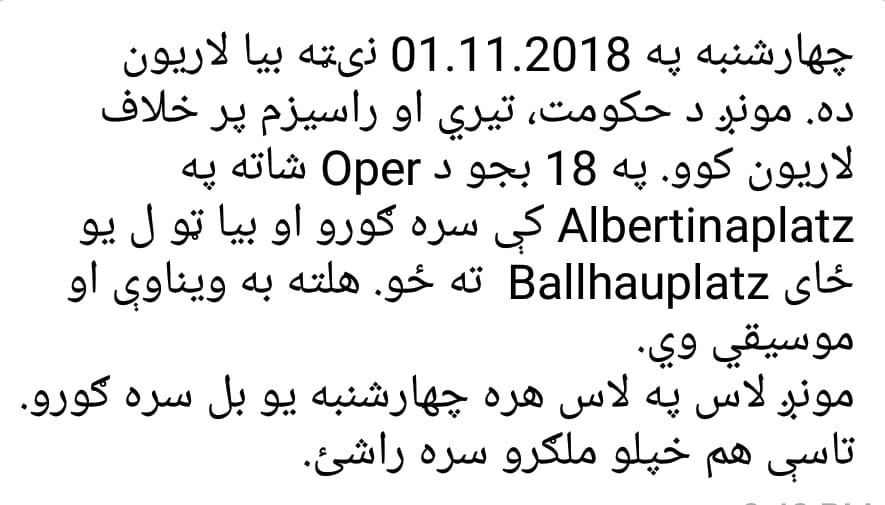
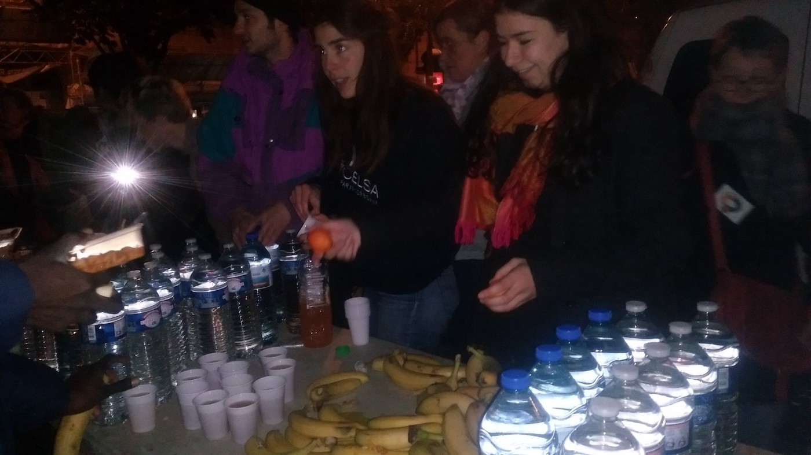
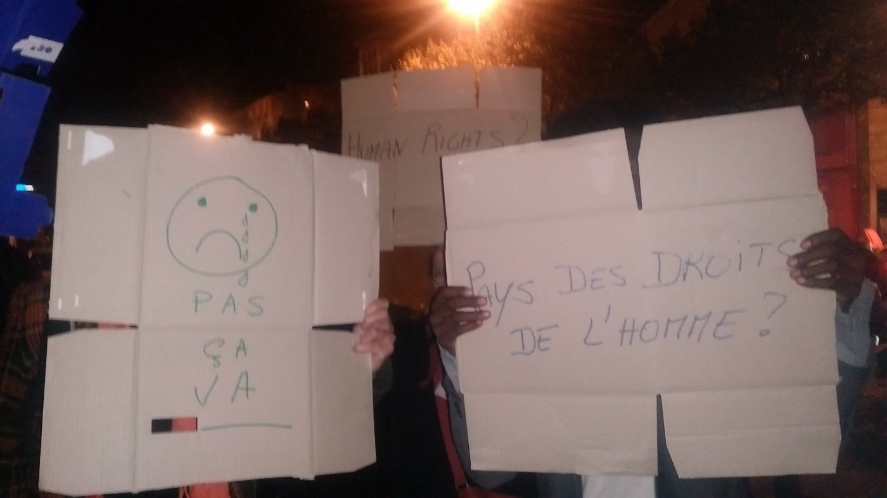
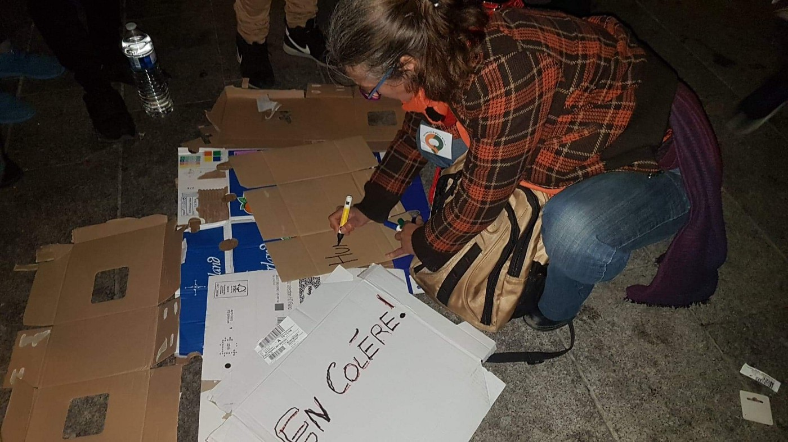
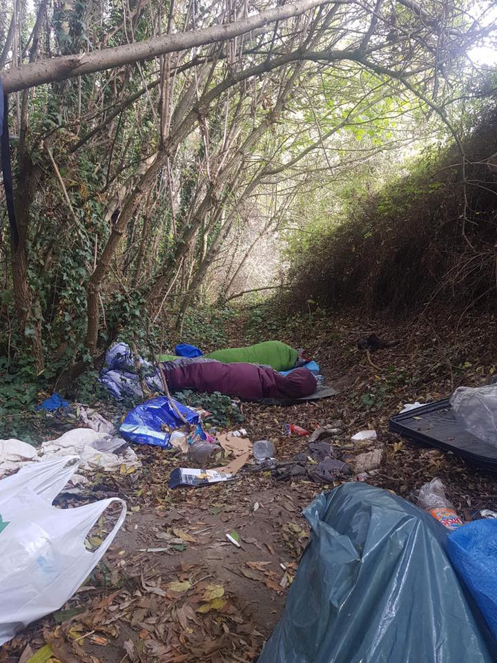
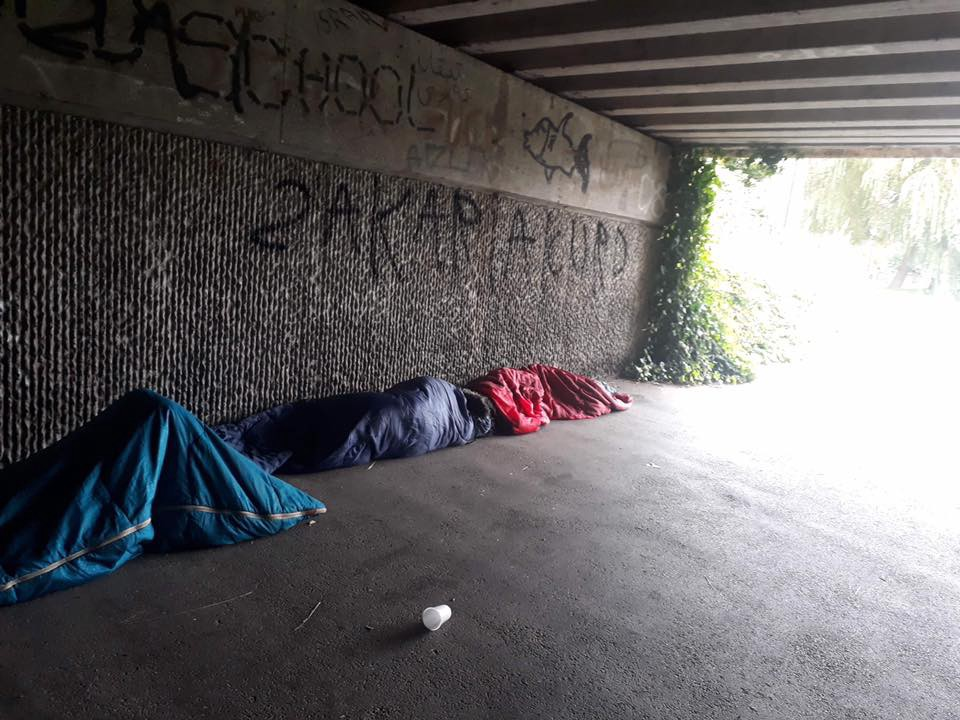

### AYS Daily Digest 31/10/2018: No Policy About Us Without Us\.
#### At Last, Refugees Engage in Political Debate in Europe\.

Calls to lift arms embargo in Libya//Ministry report shows very low rate of crime among Syrian refugees in Turkey//Mass deportation of Syrians from Turkey// Officers working in Moria diagnosed with Tuberculosis// Italy to Criminalise re\-entry of any person previously expelled// More news from Greece//Bosnia//Italy//Hungary//Austria//Spain and UK

By Nunzio Montuori
### Feature: The Final Resolution of the First European Refugee Parliament Discussion\. It Is Important\!

On 17–18 October 2018, one hundred refugees working for organisations across Europe participated for the first time in a European parliamentary session, where their voices could, at last, be prioritised\.

The Refugee and Migrant Parliaments’ aim was to bring together the opinions and ideas of people who have personally faced the consequences of EU border and migration policies\. Although this is a big step in the right direction, why has it taken so long?

The event was hosted by German MEP Cornelia Ernst who commented:

> By hosting this event, we are providing a forum for refugees and migrants to express their demands at a European level, and to put their voices at the centre of the political debate\. We must stop talking about these people, finally let them speak for themselves, and listen to them\. 

The parliament session released a final resolution and it’s important that we listen to what it says\. **Refugee advocates too, because sometimes it easy to forget is not necessary to speak on behalf for someone who has a voice of their own\.**

**The resolution, reviewed and finalized by the RISE members:**

> We are self\-organized migrants and refugees\. 

> We are a diverse group who decided to work together to face the grave situation we are all experiencing: 

> The increased aggression of right\-wing actors; increasing violence against migrants and racism at the individual and institutional levels; death and human rights abuses at the borders of Europe and within Europe\. 

> We are committed to raising our voices, to being the protagonists in our own lives\. 

#### It is important for refugee advocates to prioritise the self\-determination of refugees in Europe

The Resolution highlights a vast array of important issues that are often overlooked in discussions by Institutions and EU Member States\.

Discussion points and demands are being raised concerning: forced deportations, equal rights and access to the labor market, prevention of danger to women, rights to be upheld for LGBT asylum seekers, the externalization and militarization of borders, European arms sales to underdeveloped countries, access to health services and housing and, importantly, PARTICIPATION\!

The Resolution demands that Europe establish the Refugees and Migrants Parliament and finance it\.

> No policy about us without us\. WE demand to be included in policy\-making when it concerns our lives — RISE\. 

#### LIBYA
#### The GNA calls for the lifting of the arms embargo

They contend that the embargo should be lifted as it is necessary for counter\-terrorism defences and migration defences\.

■■■■■■■■■■■■■■ 
> **[Hanan Salah](https://twitter.com/HananMSalah) @ Twitter Says:** 

> > Because all that’s needed right now in #Libya are more weapons channeled to same unaccountable &amp; abusive warlords and their militias who have recently rebranded as ‘army’ and ‘police’ ? I think @[GovernmentLY](https://twitter.com/GovernmentLY) needs a better plan 

> **Tweeted at [2018-10-31 17:10:02](https://twitter.com/hananmsalah/status/1057681112758185987).** 

■■■■■■■■■■■■■■ 

#### TURKEY
#### Interior Ministry report debunks far\-right propaganda that Syrian refugees are criminals

[Figures in the report](http://harekact.bordermonitoring.eu/2018/10/24/report-on-refugee-crimes-debunks-far-right-perception-of-syrians/?fbclid=IwAR3HmtpuFF9Q96-G6lZ3qfe0ApDZbY-390s-D-EI2fX_L-30e4n-RpbpVOE) show that the crime rate amongst Syrians in Turkey was only 1\.46 percent in 2018\. This dropped even further compared to 2017 when the crime rate amongst Syrian refugees was 1\.53 percent\.

Despite the low levels of crime, Turkey is home to 3\.5 million refugees\. The living conditions for the majority remain deplorable and without access to the most basic services\.

> Migration Directorate officials say facts about refugees are distorted and misinformation is prevalent about them\. Indeed, social media are awash with claims that Syrians “receive salaries from the state, have their phone bills paid by the state, can be admitted to universities without exams, are exempt from vehicle taxes, are eligible to vote and will be given free housing and civil servant posts\.” 

[**Mass deportation of Syrians continues in Turkey**](https://www.hrw.org/news/2018/03/22/turkey-mass-deportations-syrians)

Despite Turkey’s open\-door policy for Syrian refugees, it has recently been reported that over 200,000 have been intercepted and prevented from entering the country\. HRW reports that many of them have been sent back to war\-torn Idlib\.

> Turkish border guards have shot at asylum seekers trying to enter Turkey using smuggling routes, killing and wounding them, and have deported to Idlib newly arrived Syrians in the Turkish town of Antakya, 30 kilometers from the Syrian border\. 

■■■■■■■■■■■■■■ 
> **[Gerry Simpson](https://twitter.com/GerrySimpsonHRW) @ Twitter Says:** 

> > Turkey says its border forces have intercepted 200,000+ Syrians so far in 2018 and "referred them to [police] forces for required processes," which @HRW research has shown means unlawful mass summary deportation to Syria [bit.ly/2Sv1Dq4](https://bit.ly/2Sv1Dq4) @HRW [bit.ly/2IFZjr8](https://bit.ly/2IFZjr8) https://t.co/0Ap4ivmXsJ 

> **Tweeted at [2018-10-30 09:29:24](https://twitter.com/gerrysimpsonhrw/status/1057202802429181957).** 

■■■■■■■■■■■■■■ 

#### GREECE
#### Arrivals

A boat landed in Lesvos, on Katavarthra Beach at 7:30 am with 50 people on board\. Twenty\-five children, 13 women, 12 men\.

At 5:30 am four to five boats were picked up by German Frontex near Samos carrying approximately 200 people\.
#### Racist and xenophobic incidents increasing on Greek islands

[The last 6 months have seen an increase](https://l.facebook.com/l.php?u=http%3A%2F%2Frsaegean.org%2Frise-of-xenophobic-and-racist-incidents-in-the-past-6-months-a-timeline%2F%3Ffbclid%3DIwAR2Ly_j4CJhCRbtOl_edFeUUFDyog5iG1ugNSig48gcqVtr23IQmak4dNZY&h=AT1JT9VZEgfOxIMU1Uu7cypWo33p-URTJWT2VgkgCRzofLxBOeDRuOJQal_-Dqu_KvYACHL6vfTpOmmlvIEDOg1-rjwhCSQM1tyzC9d72LhIGPhfmcJ9fkBgYcaE4gI13dzQT_0) in racist and xenophobic incidents on the Greek Islands, specifically Lesvos and Samos\.

Incidents range from police and self\-patrol groups searching houses for the presence of refugees to extremist language used by local politicians\.

In one incident, a monument dedicated to refugees who perished at sea was also destroyed by a far\-right group on Lesvos and local journalists were threatened for their positive coverage of refugee issues\.
#### Anti\-Fascist Protest

#### Winter is coming to the Mediterranean islands, too

[Clothes and shoes are urgently needed](https://movementontheground.com/story/from-sunny-summers-to-snowy-winters-19618) on the Mediterranean islands to prepare large numbers of people for winter\.

> “Just because it’s a Mediterranean island, people tend to think winter is not that harsh, but it really is\.” — MOTG Sports coordinator Tanja 

#### Portugal and Greece reach agreement on refugee transfer

A bilateral agreement has been signed to accept only 100 refugees for relocation from Greece to Portugal\. If the pilot program is successful, it will expand to accept 1,000 refugees throughout 2019\.

> The two countries intend to submit the draft bilateral agreement to the European Commission to receive funding for the program\. 

#### Intervolve is in need of volunteers in northern Greece

To Find out more please [follow this link\.](https://www.facebook.com/InterVolve/photos/a.256091268062602/729005984104459/?type=3&theater&hc_location=ufi)
#### Iranian refugee community protests in Athens

The protest occurred outside the Greek Parliament\. The refugees protested the fact that they are allocated only one hour per week in the Skype Timetable for Cash Applications\. Some families have been waiting for months for applications to be processed and during this time have been left without any money to look after their families\.
#### Tuberculosis in Moria: Greek police undergo blood tests

[Greek police working at Moria Detention Centre](http://www.infomigrants.net/en/post/13028/greek-police-undergo-blood-tests-amid-tuberculosis-scare-at-moria-migrant-camp?fbclid=IwAR2Yt_HIujr_GeVl0di5DfkozKnNDKMFwi4Wt8liyouNW8cwv1Qb5hJ0Azc) on Lesvos have undertaken blood tests after it was discovered that two officers had contracted tuberculosis\. The two officers have been hospitalised and are now receiving treatment for the next 6 months\.

In an anonymous email by a local police officer, he denounces the government for failing to act on important issues concerning the facility\.

> “We at the Police Directorate of Lesvos, as well as the detainees here on the island, are incredibly upset about the news that two colleagues stationed at Moria’s refugee camp have contracted tuberculosis\. The conditions concerning hygiene and safety at the facility are simply unacceptable… \. We can only hope that our publishing of this email will prompt the Ministry of Citizen Protection as well as the Ministry of Health to take action immediately\.” 

#### BOSNIA

Camp Trnova, Velika Kladuša\. People have been living in this camp since May and not even their basic living conditions have been met\. There is no running water, no electricity, and only improvised shelters\. Winter is coming and more than 200 people are left to live here, including many unaccompanied minors\.
#### ITALY
#### New legislation criminalizes the return of anyone who has previously been expelled

[The legislation will r](http://www.infomigrants.net/en/post/13020/italian-government-to-tighten-asylum-and-detention-process-for-migrants?fbclid=IwAR13I9W4E1I_mZPe5nXhpGvNTFDHrKHsQesKiYhqt0VLnk4PN22MIKXUTrg) equire sentences of anywhere between one and four years in prison for anyone who has previously been expelled from Italy and subsequently returns to the country without special authorisation by the Interior Ministry\.

The decree will become operational as of 1 January 2019\.
#### Head of Italian shipbuilding association declares their boats will continue sea rescues

[Mario Mattioli on Wednesday announced](http://www.ansa.it/english/news/general_news/2018/10/31/confitarma-says-ships-will-save-migrants_e73a09d3-01cc-452b-b12e-519c0cf7a626.html?fbclid=IwAR19fEAy0fIu2Vnb0-xkdKmYRJ--jINqRZwmu6mRMIttsKJZY2nqk5tjPOY) that their merchant ships will continue to intervene and rescue migrants at sea\. He announced this in front of Italy’s far right Interior Minister Matteo Salvini who banned the docking of rescue ships on Italian ports in June 2018\.
#### HUNGARY

A woman who was caught on camera physically assaulting refugees has not been charged, after the court announced that this was not a criminal act\.

■■■■■■■■■■■■■■ 
> **[Andrew Stroehlein](https://twitter.com/astroehlein) @ Twitter Says:** 

> > She was literally caught on camera assaulting refugees, but Hungary's top court says it wasn't a criminal act, overturning lower court ruling. 
 
Simply put: Violence against powerless people is encouraged in Hungary. [bit.ly/2JsLdtT](http://bit.ly/2JsLdtT) https://t.co/bAavov6HVr 

> **Tweeted at [2018-10-31 07:23:58](https://twitter.com/astroehlein/status/1057533625363849216).** 

■■■■■■■■■■■■■■ 

#### AUSTRIA
#### Austria joins US and Hungary in backing out of UN Migration Pact

This occurred amongst fears that the pact might blur the lines between legal and illegal immigration\. Austria’s right\-wing government, which argues against granting asylum to refugees coming to Europe via the Mediterranean released the statement on Wednesday\.

> “We view some points of the migration pact very critically, such as the mixing the seeking of protection with labor migration,” said Kurz, who argues that migrants rescued in the Mediterranean should not be brought straight to Europe\. 

Amnesty International criticized Austria’s stance\.

> “Instead of facing global challenges on an international level, the government is increasingly isolating Austria\. That is irresponsible” 

#### Weekly protest resumes again tomorrow in Vienna

> Thursday is another demonstration\! We are demonstrating against the government, against violence and racism\. 

> We meet at 6 pm at the Albertinaplatz \(behind the opera\) and then go to the Ballhaus square together\. There will be talk and music there\. 

#### SPAIN

A recent report puts the total of deaths at 176, with 273 people missing off the coast of Spain\.

■■■■■■■■■■■■■■ 
> **[ACNUR España](https://twitter.com/ACNURspain) @ Twitter Says:** 

> > Llegadas a España (22-28 octubre). Descarga el informe en [ow.ly/y1ZF30mqS9b](http://ow.ly/y1ZF30mqS9b) https://t.co/TzHccqf3fl 

> **Tweeted at [2018-10-30 17:07:57](https://twitter.com/acnurspain/status/1057318197660131328).** 

■■■■■■■■■■■■■■ 

#### FRANCE
#### Numbers at food distribution increasing

[Solidarité migrants Wilson](https://www.facebook.com/Solidarit%C3%A9-migrants-Wilson-598228360377940/?__tn__=%2CdkCH-R-R&eid=ARA9KyFehE_7GteVdiirNzWkfZJlUWFkZ-hXpFyLdhnjxPeUIBZpHRu2ufpsdZVR69rMjTzfGMr64AL2&hc_ref=ARQUP1A4Gp5zacYpVZ6b26MAcFEk36_k3A77HHPAZjMGx5KMw-qFZEmOolFUbQpGigk&hc_location=group) report that the number of refugees at distribution sites on the Avenue of President\-Wilson in Saint Denis is increasing\. 450 meals were distributed last night\. The conditions are getting worse as the temperatures continue to fall\.

Refugees have inadequate clothing to survive the conditions and their stock is limited\. Donations are welcome\.

#### An exhibition of photographs by Abdul Saboor

From 6–29 November, Tues–Sat 2 pm–7 pm
**Location:** Théâtre\-Sénart, National Scene
**Meeting with Artist:** Sat Nov 24th at 5 pm

> After photographing migrants on the way to the Balkans, especially in Serbia, on his own exile path from Afghanistan, and talking to them about painful issues such as their altercations with the police, Abdul Saboor discovers another face for them in Paris\. They talk about partying and their plans\. It is from this angle that the artist proposes a new series of portraits of asylum seekers\. 

#### UNITED KINGDOM
#### Dunkirk after eviction

One week after the Dunkirk eviction, hundreds have already returned to the area and the majority are sleeping rough in the woodland, underpasses and ditches\.

> Volunteers on the ground hear stories daily of police destroying tents and preventing any attempts at creating shelter or settling\.With temperatures now plummeting it is becoming increasingly dangerous to sleep outside\. Regardless, we continue to see new families and individuals arriving each day, willing to endure these inhumane conditions — [Mobile Refugee Support](https://www.facebook.com/MobileRefugeeSupport/?__tn__=%2CdkCH-R-R&eid=ARCN8w7dUeHKArU3hvV_NLwhiJSPHwS4ecKI6CdxX-bBJJK9msugGEZu1us_THi9fhX5AOLszmgul1OD&hc_ref=ARTsjRlTsVvjH8cskG7A2ZDeQVQTUwZO7o0z8Wt9E9aIDirBpiARagduZZti3SlZSh0&fref=nf) 

](assets/24933d8f2db6/1*JcPLIZuxrdYpCpnn6GYlwQ.jpeg)

Source: [Mobile Refugee Support](https://www.facebook.com/MobileRefugeeSupport/?__tn__=%2CdkCH-R-R&eid=ARCN8w7dUeHKArU3hvV_NLwhiJSPHwS4ecKI6CdxX-bBJJK9msugGEZu1us_THi9fhX5AOLszmgul1OD&hc_ref=ARTsjRlTsVvjH8cskG7A2ZDeQVQTUwZO7o0z8Wt9E9aIDirBpiARagduZZti3SlZSh0&fref=nf)
#### People in Motion in need of volunteer trustee
- Finance/Project Management Focus

> People in motion are a very small volunteer\-led charity, we are seeking to grow the trustee board, this is an exciting opportunity to contribute to the governance and development of a fairly new grassroots community project\. 

To find out more please [follow this link\.](https://www.facebook.com/job_opening/493948404455438/?source=post_homepage_stream&__xts__[0]=68.ARA8hMOUuLR6F4MQ_ohFfeH34N7dZao8tNtPkAnqWhE9h1jHWeqHI2PnfQBfs3d8W9p1iZAihLkV2TYwW2rvMYrnTuIkOVuxqNYEWw6s1tnUxr6tvtvGXR4DNGDvjyo2zwfSk_WD-VGmy6bom4dyxfzsGie0c5ymRef80BAhj1HnLZzDvy031EZW2s3ws7_0nOUAQWw72bllyfsIpfWNSaQq42sucr1FXP-FDZwf9EeLy68&__tn__=HH-R)

**We strive to echo correct news from the ground through collaboration and fairness\.**

**Every effort has been made to credit organizations and individuals with regard to the supply of information, video, and photo material \(in cases where the source wanted to be accredited\) \. Please notify us regarding corrections\.**

**If there’s anything you want to share or comment, contact us through Facebook or write to: areyousyrious@gmail\.com**

_Converted [Medium Post](https://medium.com/are-you-syrious/ays-daily-digest-31-10-2018-no-policy-about-us-without-us-24933d8f2db6) by [ZMediumToMarkdown](https://github.com/ZhgChgLi/ZMediumToMarkdown)._
