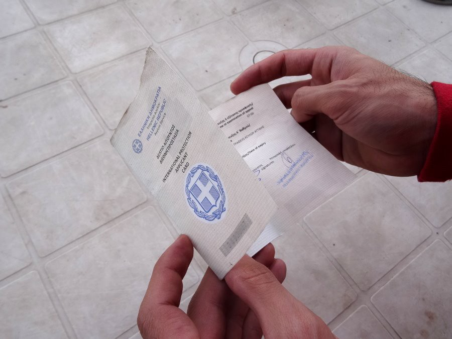
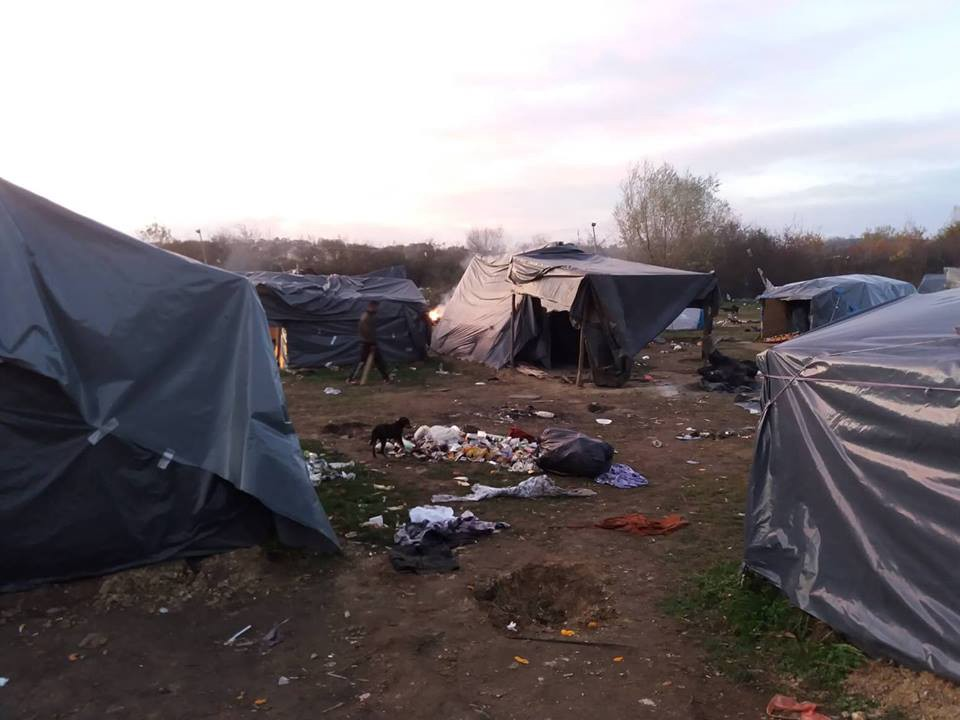
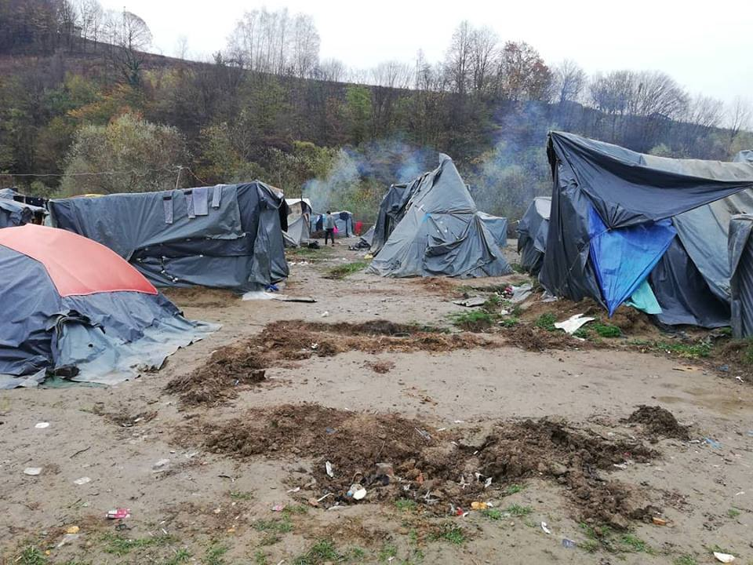
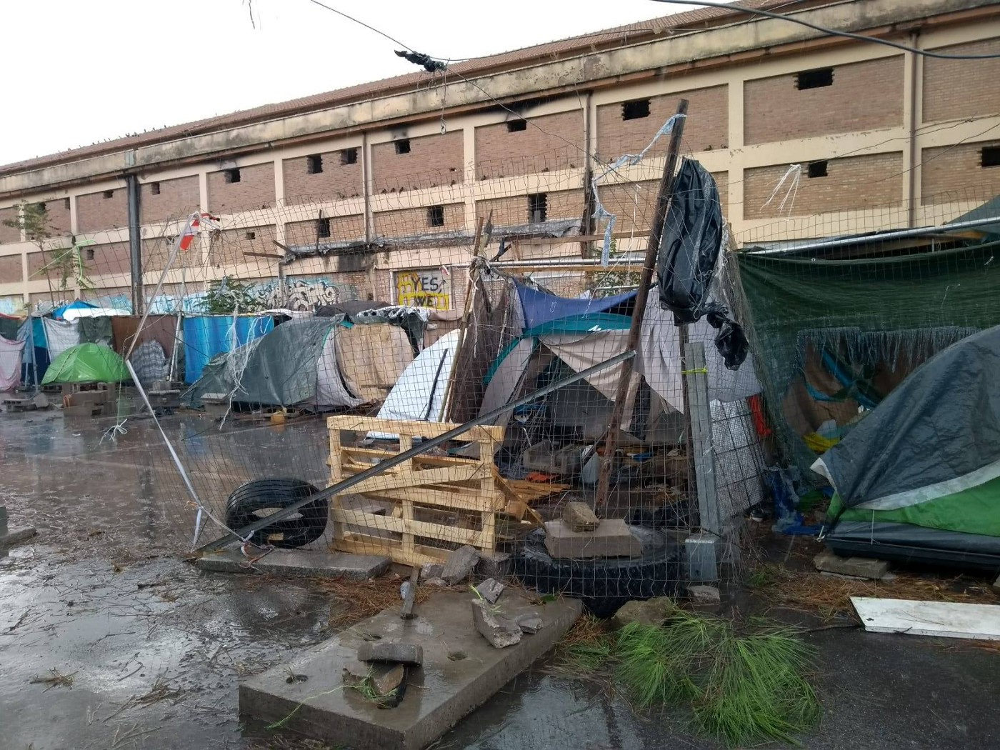
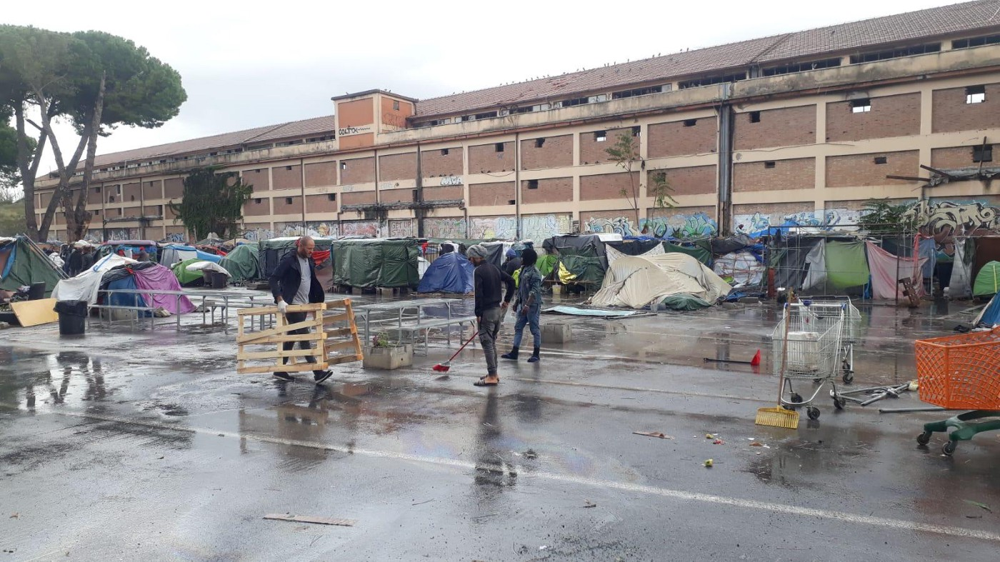
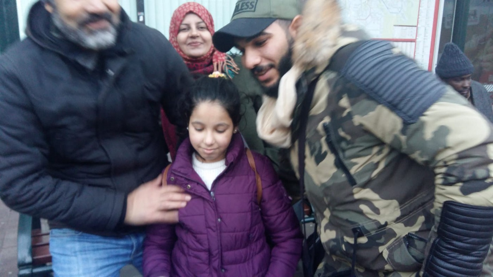

### AYS Daily Digest 02/11/2018: For refugees, mental health care access is crucial

_Chaos in Idlib Province // Nearly 100,000 people have made the crossing to Europe this year // Refugee children’s access to school // Solidarity rally at Petrou Ralli Detention Center // New and informal camps in Bosnia // Storm devastates Roman encampment // Reunited in Belgium, against all odds //_

](assets/138b3b297d31/1*b0yniftivL_8n6tRlQcaqg.jpeg)

La Pietà\. Source: [Gabriel Tizon\.](https://www.facebook.com/gabrieltizonfotografo/photos/a.213760148669815/1957770030935476/?type=3&theater&ifg=1)
### Feature —

There are so many obvious material difficulties associated with being a refugee that it can be easy to forget what a toll the experience takes on one’s mental health\. And yet, it is nearly impossible to imagine a set of circumstances more conducive to psychological distress\.

First, the trauma of leaving one’s homeland, and the circumstances surrounding that departure\. Many refugees have been tortured or seen family members killed\. Next, a long, dangerous, uncertain journey toward safety\. The devastating disappointment of realizing that “safety” might be another country that treats you like dirt\. Months and years in limbo, with no control over your fate\. And the possibility — always — that your reasons for undergoing this whole ordeal will be deemed insufficient\. That you will be sent back to the place that you fled\.

[Anxiety](https://www.psychiatry.org/newsroom/news-releases/new-research-high-levels-of-anxiety-found-among-syrian-refugee-children) \. [Depression](https://www.npr.org/sections/goatsandsoda/2017/03/30/521958505/only-in-sweden-hundreds-of-refugee-children-gave-up-on-life) \. [Schizophrenia](https://www.psychiatryadvisor.com/schizophrenia-and-psychoses/psychosis-risk-of-refugees-three-times-higher-than-other-migrants/article/483640/) \. [Self harm and attempted suicide](https://www.msf.org/child-refugees-lesbos-are-increasingly-self-harming-and-attempting-suicide) \. [Rampant PTSD](http://www.euro.who.int/__data/assets/pdf_file/0006/293271/Policy-Brief-Migration-Health-Mental-Health-Care-Refugees.pdf) \. All well documented among asylum seeking populations\. And refugee children experience these issues at even higher rates\.

Unfortunately, despite this reality, few refugees have access to the mental health care that they deserve\. Essam Daod, a psychiatrist working in Athens, discusses the importance of mental health care for asylum seekers:

■■■■■■■■■■■■■■ 
> **[Essam Daod](https://twitter.com/essamdaod) @ Twitter Says:** 

> > After a long working day in #refugee centres around #Athens, I have one thing to say (again!) as a psychiatrist: #mentalhealth services are critical, and needs to be provided in a systematic and institutionalized way, and if not, a catastrophic results will be seen in all #Europe 

> **Tweeted at [2018-11-02 21:06:23](https://twitter.com/essamdaod/status/1058465367478226945).** 

■■■■■■■■■■■■■■ 

If you’re interested in learning more about the myriad mental health challenges facing refugees or want to know how to support folks you work with on the ground, Daod has a fascinating [TED talk](https://www.ted.com/talks/essam_daod_how_we_can_bring_mental_health_support_to_refugees) on the topic\. As he says: “We need to acknowledge that first aid is not just needed for the body, but it has also to include the mind, the soul\.”
### Syria

The Syria Observatory for Human Rights reports total chaos in the Idlib region as shelling resumes in full force for the first time since an August 15 truce between Russian and Turkish forces\. There has also been intense bombing in the Deir Ezzor Region as International Coalition forces fix their targets on the Islamic State’s last stronghold\. More [here](http://www.syriahr.com/en/?p=105856&fbclid=IwAR2cTaK3AAGDVaPdcEgFxDgr5PkEZG8PoZWOsiPpjX4I_i7fM28N0WQVUU4) \.

There is no exact casualty count as of yet, but at least 10 civilians were killed by artillery fire in the city of Jarjnaz, to the east of Idlib, according to reports from the [White Helmets\.](https://www.facebook.com/SyriaCivilDef/photos/a.1712251465765921/2213749885616074/?type=3&__xts__[0]=68.ARB0JD7O-d6UX7Z3r0WgM25sMlOOvSLzuWLj5-HLGhBG2vwM_XjemZ2hIjTDCFvxlGg4Bw4OcMkUHtt_n4oWHe0vyUg7lPMC_fzhnlAgPKwMom9r5OuMFHosNLwIDK86d0ICp166r0keTCy3haLqU5hGlzxC_LX6DmLikcoDQ2GcZ5nzVvbBbYKcicn3sfxivcwlzAEcqNia2OMboBdTtdrks8M&__tn__=-R&hc_location=ufi) Many more are seriously wounded\.
### Libya

UNHCR Special Envoy Vincent Cochetel reports that a transit & departure center in Tripoli has been empty for more than 4 months while the authorities decline to authorize the transfer of around 1000 asylum seekers\.

He also notes the lack of proper food and registration procedures in the detention centers:

■■■■■■■■■■■■■■ 
> **[vincent cochetel](https://twitter.com/cochetel) @ Twitter Says:** 

> > UNHCR registering asylum seekers in Sabaa detention centre in #Libya. Those detained get a maximum of one meal a day, rice or pasta with nothing else. https://t.co/J7U2FgmLYr 

> **Tweeted at [2018-11-02 04:28:08](https://twitter.com/cochetel/status/1058214150143262720).** 

■■■■■■■■■■■■■■ 

■■■■■■■■■■■■■■ 
> **[vincent cochetel](https://twitter.com/cochetel) @ Twitter Says:** 

> > #Libya, in detention centres, I could witness that UNHCR that can only give   a plastified slip of paper as registration proof. We are not authorised to give anything else to asylum seekers or refugees, as the authorities are opposed to us providing proper documentation https://t.co/Rohg9yEZ3O 

> **Tweeted at [2018-11-02 04:31:00](https://twitter.com/cochetel/status/1058214872536600576).** 

■■■■■■■■■■■■■■ 

### Sea

A map of arrivals to Europe this year, and the dead left behind\. Source: IOM\.

IOM [reports](https://twitter.com/UNmigration/status/1058273136829980672?fbclid=IwAR36USDaDcbAPyob-ItAQDrQ4ypyk9KOIaWWaP4qAK_thCeMuKO0RHaTf5Y) that nearly 100,000 people have arrived to Europe so far in 2018\. 1,987 died in the crossing or are still missing\.

The Missing Migrants Project has more [information](http://missingmigrants.iom.int/) \.

An update from SOS Mediterranée on the fate of the Aquarius:

■■■■■■■■■■■■■■ 
> **[SOS MEDITERRANEE](https://twitter.com/SOSMedIntl) @ Twitter Says:** 

> > UPDATE: We are continuing to carefully examine all long-term solutions that will allow #Aquarius to resume its vital mission. The ship-owner obtained a temporary registration by the Liberian Maritime Authority but this status does not yet allow us to resume SAR duties. 

> **Tweeted at [2018-11-02 16:35:13](https://twitter.com/sosmedintl/status/1058397127347462146).** 

■■■■■■■■■■■■■■ 

### Greece

Two boats, carrying a total of 110 people, arrived on Samos this morning, according to [Aegean Boat Report\.](https://www.facebook.com/AegeanBoatReport/posts/468466797009763?hc_location=ufi) The Samos hotspot is _over seven times_ its official capacity, Refugee Support Aegean [reports](https://twitter.com/rspaegean/status/1058280506712907777) \.

IOM has released a new survey concluding that access to public education helps refugees’ social inclusion\. “Access to regular schooling has enabled migrant and refugee children to make friends with students from other cultures, said 84 per cent of surveyed children in open accommodation centres in Greece,” ReliefWeb [reports](https://reliefweb.int/report/greece/access-school-aids-social-inclusion-migrants-refugees-greece-iom-survey-shows?utm_medium=social&utm_campaign=shared&utm_source=facebook.com&fbclid=IwAR3AeQkzySkoC12mS07ZbcNMRdOIz_ikmHuvnzQQhBgmzNraqpAwRWUw-SY) \. But how many refugee children are actually able to attend school in the first place?

On the Greek islands, the educational situation is particularly dire\. The isolation of the hotspots — combined with a lack of public transportation and [local hostility](http://www.ekathimerini.com/233298/article/ekathimerini/news/chios-parents-oppose-refugee-kids-at-school) to the idea — makes it nearly impossible for refugees to attend school\. Action for Education, the only independent educational organization on Chios and the reason that countless refugee children and young adults have been able to attend school while stuck on the island, has launched its 2019 fundraising campaign\. “For as long as it’s needed, we are fighting day after day to uphold the rights and dignity of youth, as they arrive into terrible conditions and abysmal camps in Europe,” they write\. Find out more about the campaign [here](https://www.facebook.com/ActionforEdu/posts/777141519298566) , and please consider donating if you have the money\.

A man holds his refugee identification, or “white card\.” Source: Mobile Info Team

Mobile Info Team has information in several languages about how to change incorrect information on your white card\. See more [here](https://www.facebook.com/mobileinfoteam/photos/a.1800063030222418/2305974356297947/?type=3&theater) \.

**Solidarity Intervention at Petrou Ralli on November 3**

This Saturday, November 3, there will be a rally held starting at 4pm at the Petrou Ralli detention center in Athens\. Led by syllogikotḗtōn and Individuals Against Detention Centres, the protest will express solidarity with those detained at Petrou Ralli, as well as all immigrants “creating joint communities and trying to tear down every wall, visible or invisible, which lies between us\.”
### Bosnia

As we reported previously, a new camp is open near Sarajevo, in Ušivak\. Even though it opened just last week, there are already over 450 people living inside, which means it is now full capacity\. Many more are still in the streets of Sarajevo\.

](assets/138b3b297d31/1*yc-wDk5cZIOkziFttyQ0IA.jpeg)

Photos from the informal camp in Trnovi\. Source: [Refugees in Velika Kladusa\.](https://www.facebook.com/izbjeglickeprice/photos/pcb.716597715386993/716595695387195/?type=3&theater)

Meanwhile, volunteers estimate that up to 400 people are living in the informal Trnovi camp in Kladusa, which is located on unstable ground and could be entirely washed away during the first heavy rains of the winter\.

Another image of Trnovi\. Source: AYS
### Italy

A storm blew through a temporary encampment in Rome last night, flattening tents and rendering bedding unusable, No Name Kitchen reports\.

](assets/138b3b297d31/1*o7S9e3DC_HGwCgK1eAxQ7A.jpeg)

The aftermath of the storm\. Source: [No Name Kitchen\.](https://www.facebook.com/NoNameKitchenBelgrade/posts/614751052256516)

According to a local Italian news [outlet](https://lacnews24.it/cronaca/migranti-nuovo-sbarco-porto-reggio-calabria_67591/?fbclid=IwAR3Qz_e49t7EeNTw8a-DqPvB5JfXLq_HoWAoHqRIV6fnTyI4a_AvB6zgrVs) , 61 asylum seekers landed at the port of Reggio Calabria — not on a raft or dinghy, but aboard a sailboat flying the Dutch flag\.

The passengers, all Iraqi men, were intercepted off the coast of Palizzi\.

The latest data on government housing for asylum seekers and sea arrivals to Italy is available [here](https://www.facebook.com/groups/1834254390190027/permalink/2226846180930844/?hc_location=ufi) and [here](https://www.facebook.com/groups/1834254390190027/permalink/2226908270924635/?hc_location=ufi) , respectively\.
### Belgium

Nora reunited with her family\. Source: Krishna van Lierde

A volunteer based in Brussels [reports](https://www.facebook.com/photo.php?fbid=2123440454354108&set=a.1121577637873733&type=3&theater) :

> This morning we found little Nora, 11, all alone, in one of the Brussels railway stations\. She left Iraq about 6 weeks ago with her grandmother\. The grandma fell gravely ill in Greece and somehow Nora managed to reach Belgium\. She felt all alone and didn’t have food for 2 days\. On one of her clothes a telephone number was embroidered, which we contacted\. Apparently she had an aunt living near the German border\. After calling the aunt \(and couple of hours by car\) the family was reunited and she could contact her mother in Iraq\. A happy and very emotional moment after weeks of no news…
 

> This girl made it with a lot of luck\.
 

> We wonder how many don’t make it?
 

> Europe 2018\. Is this the light of civilisation? 

### Denmark

After helping over 200 children reunite with their families in Denmark, Refugees Welcome Denmark have just reopened their application process for airfare support — find out more [here](http://refugeeswelcome.dk/stoet-os/flybilletter/?fbclid=IwAR2fx6EecEoPPSOoo_DUT9V5Y_M7fRwRI9K5lH9VUevRZ4VmKT0rSduVugI) \(note: in Danish\) \.

### Sweden

About 30 newly arrived asylum seekers have built a tent camp in Solna, just outside of Stockholm, Dagens Nyheter [reports](https://www.dn.se/sthlm/efter-tva-ar-tvingas-josef-bo-i-talt-far-inte-forlangt-kontrakt/?fbclid=IwAR37sNwSnZ0Ak7GNfq6qiOSKRQN5oelJ8DsHsF_io9-Af8xFT-Vos7V1Dho) \.

The first two years after a refugee arrives in Sweden are known as the “establishment phase\.” There has been a court decision regarding this phase, which states that municipalities have the right to cancel contracts with newly arrived people\. The responsible officials in Solna have decided to interpret the legislation to mean that they could terminate rental contracts for the newly arrived asylum seekers living there\. Those who have lost their accommodations will get help to try and find new homes, but several have now started a small tent camp in the area, determined to stay\.

**We strive to echo correct news from the ground through collaboration and fairness\.**

**Every effort has been made to credit organizations and individuals with regard to the supply of information, video, and photo material \(in cases where the source wanted to be accredited\) \. Please notify us regarding corrections\.**

**If there’s anything you want to share or comment, contact us through Facebook or write to: areyousyrious@gmail\.com**

_Converted [Medium Post](https://medium.com/are-you-syrious/ays-daily-digest-02-11-2018-for-refugees-mental-health-care-access-is-crucial-138b3b297d31) by [ZMediumToMarkdown](https://github.com/ZhgChgLi/ZMediumToMarkdown)._
