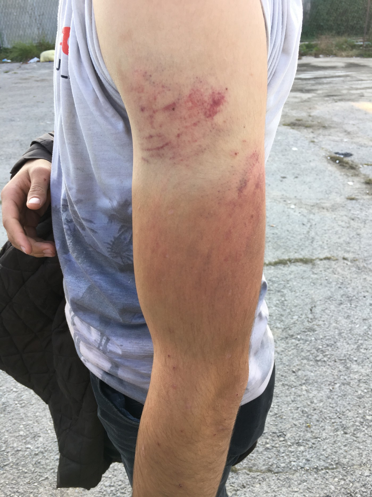

### ILLEGAL PUSH\-BACKS AND BORDER VIOLENCE REPORT

_The following document presents testimonies of illegal push\-backs where displaced people are expelled into the Bosnian territory from the borderlands and interior of Croatia and Slovenia\. All testimonies are gathered from oral interviews via a standardised framework used by the grassroots organisations working in Velika Kladuša\._

Camp Trnovi, Velika Kladuša\. Photo AYS
### **REPORT \[1\]**

_Type of Incident_ : PUSH\-BACK — DENIED ACCESS TO THE ASYLUM PROCEDURES — DEPORTATION — VERBALLY THREATENED — ROBBED — PHYSICAL VIOLENCE — DAMAGE OF PHONES

_Location_ : The group was caught by the police in the inner Croatian land, close to the village Stara\. The violent incident happened by the Croatian border with Bosnia, nearby Velika Kladusa official border check\-point\.

_Number of victims_ : 3\.

Interview was conducted with all group members with the help of a translator from Arabic to English\.

_Names:_ Farhan, Hussein, Ahmad

_Country of origin_ : Algeria and Morocco

_Age_ : All are between 30–40 years old\.

_Sex:_ Males

The men were caught by the Croatian police 02/10/2018, around 10 pm\. Pushed\-back and violently attacked by the Croatian police 03/10, around 4 am\.

_Expressed intention to seek asylum in the country_ : Yes

_Documents signed_ : No

**DESCRIPTION OF INDICENT**

Farhan, Hussein and Ahmad walked from Velika Kladuša \(Bosnia and Herzegovina\) and crossed to the Croatian territory and wanted to continue further to Europe, with the intention to reach Italy and seek asylum there\. After three days of walking, the men almost reached Slovenia\. They were walking in a forest, close to the village Stara, but were detected by the police\.

A Croatian female police officer, who caught them, asked them for their identification and questioned the men about their intentions in Slovenia\. According to Farhan, this officer treated them with respect and they did not have any problem with her\. Following the short verbal investigation by a female officer, all of them were then transported by a police car to the police station by the Bosnian border where they were handed over to the Croatian border police\.

When the men were handed to around 10 border police officers, Ahmad recalled that they started to be treated like animals\. The border police firstly frisked their bodies and then, took all their phones and money\. The men were told that once they were going to be deported, all their possessions would be returned to them, but they received back only their phones that were fully damaged\. Hussein told that one police officer, a bald man between 40–50 years with blue eyes, was particularly rude and aggressive towards them\. When the men tried to ask the police whether it was possible to apply for asylum in Croatia, this bold man shouted at them something in the Croatian language they did not understand and hit them with a baton\. According to Hussein, this man was probably the one who later during their deportation back to Bosnia was attacking them the most\.

After the body frisk, the men were then transported by a van to a forest location at the Croatian\- Bosnian border, where they were pushed back from the Croatian side to Bosnia and physically attacked:

_“They \[police\] put us into a big car and were driving us very fast, so we were falling from one side to another inside\. They \[police\] kept turning on the heater, really high, and after switched on air conditioning on very high, so we had a problem to breath and felt sick\. The car stopped in some abandoned place\. We were sitting and waiting inside of the car very long time\. I think the police was waiting till it got very dark outside, so no one could see how they were attacking us\. When it could be around 4 in the morning, they \[police\] told us to get out of the car\. It was really dark; the lights of the police car were also switched off\. We started feeling the hits by batons from all sites and could hear the scream of the police attacking us\. I think all of them, 10, were beating us and shouting at us to go back to Bosnia\. I did even not know from where the hits were coming from, we could just feel them, everywhere, on our back, legs, head, face…\. This is racism”_ \(Hussein\) \.

After the attack and push\-back to Bosnian territory, the men had several injuries, and had to walk back to the makeshift camp in Velika Kladuša, where their violent journey started\.

**INFORMATION ABOUT THE PERPETRATORS**

Ten Croatian border police officers, wearing black uniforms\. The one who was particularly rude and aggressive towards the men was a bald man between 40–50 years old, with blue eyes\.

**INJURIES AND MEDICAL TREATMENT**

All men had bruises and scratches on their body caused by the attack with the police batons –Hussein had scratches on his face and back, Farhan had bruised legs, and Ahmad had pain in his back\. The men were treated by a No Name Kitchen nurse but refused to visit a Medicines Sans Frontiers medical team as they felt they were not seriously injured\.
### **REPORT \[2\]**

_Type of incident:_ PUSH\-BACK — DENIED ACCESS TO THE ASYLUM PROCEDURES — DEPORTATION — VERBALLY THREATENED — ROBBED — PHYSICAL VIOLENCE — DAMAGE OF PHONES — SEXUAL HARRASMENT

_Location:_ The group was caught in the car by the police in the inner Croatian land, 10–15 km away from Bihac \(exact location unknown\)

_Number of victims_ : 6\.

Interview was conducted with one group member in English\.

_Names_ : Fajsan \(interviewed\)

_Country of origin_ : Iran and Iraq

_Age_ : Fajsan is 29 years old and his wife is 31 years old\. A man from Iraq is 54 years old\.

_Minors in the group_ : Yes, Fajsn’s daughter is 3 years old girl\. Two more children involved — 12 years old boy and 16 years old girl\.

_Sex:_ 3 males and 3 females

_Date and time:_ The group was caught by the Croatian police and deported back to Bosnia 01/10/2018\.

_Details_

_Expressed intention to seek asylum in the country:_ Yes

_Documents signed:_ No

**DESCRIPTION OF INCIDENT**

Fajsan with wife and three years old daughter, and one more family from Iraq \(father and two children\), walked from Bihac \(Bosnia and Herzegovina\) into the Croatian territory, around 5km in the inner Croatian land, from where they were picked up a car organised by a smuggler\. Fajsan told that they paid to a smuggler 1000 euros per one person to be transported from Croatia to Slovenia, where they wanted to apply for asylum\. Fajsan explained that he had been violently pushed back from Croatia several times\. He wanted to initially apply for asylum with his family, and for this reason he wanted to go to Slovenia to apply for asylum there\. Fajsan believed that without help of a smuggler, it would be impossible for his family to reach Slovenia by foot with his small daughter and wife\.

After around 10 km of driving with a smuggler inside of Croatia, their car was detected and began to be chased by five police cars who were simultaneously firing guns to make the driver stop\. When the driver \(smuggler\) stopped, around seven police officers told the families and the driver to get out off the car\. Fajsan told that the driver got arrested for an illegal transport of undocumented persons\.

Then, the officers \(all males\) told the families to lay on the ground and frisked their bodies, including women and children\.

_“They told us to lay on the ground, all of us, also my baby\. They did not speak nice to my baby\. My friend, the man from Iraq, was telling the police: “I am a Muslim, please help me\.” And the police said: “The Muslims killed my father during the war, I don’t want to help you\.” I told them that the one man who killed his was not my friend and asked them why they don’t speak good to me\. He \[police\] said to me: “Shut up” and kept speaking to me in very bad way, calling saying “pička ti materina” \(mother fucker\) … They \[police\] searched our bodies, also my wife and my daughter\. They \[police\] were touching them and kept touching them\. You know, they were touching me wife everywhere\. I said to them: “Please, brother, don’t touch my wife and daughter, please, don’t touch them”\. I kept asking them, “please, don’t touch them”\. But they told me: “Shut up\!” and kicked into my legs \[covering his eyes with hands\] \. I asked them what happened because I am not a terrorist, I am a refugee\. This is not good behaviour to us”_ \(Fajsan\) \.

Fajsan asked the police whether him and his family could apply for asylum in Croatia and access the formal accommodation asylum centre there\. The police told him, “ok, we will take you to the camp”\. But instead transporting them to a formal camp, the families were driven directly to the Bosnian border for their deportation\. According to Fajsan, they were transported to the border by a big van that was driving very fast and turning from right to left, so that everyone inside of the van was falling from one side to another\. The car stopped at the Bosnian border, in an abandoned forest location, around 20 km away from Velika Kladuša\.

At the border, the police told Fajsan and others to give them all their possessions, such as cigarettes, money, phones\. They stole Fajsan’s 200 euros and from others around 100 euros per each\. Then, the officers told the families to go back to Bosnia, pushing them and attacking them by batons:

_“By the border, after they robbed us, they pushed to my wife and shouted at her to go back to Bosnia\. They kept telling my wife bad things\. They \[police\] also pushed my friend, who is fifty years old, now he has a problem with his knee\. My friend told me: “Don’t worry, come and we will come to Croatia later”\. The police could hear it and said: “After you go to Croatia?” and took a baton and hit this man into his legs\. They were acting to us like we were terrorists\. …There was another Pakistani man who was being deported with us and I could see how the police was hitting him by a baton”_ \(Fajsan\) \.

After the attack, the families walked back to Velika Kladuša\. Fajsan told that he was very frustrated by the asylum and border system in Europe, that gives him no options to find a peaceful life for him and his family:

_“I just want to find a safe place, not too much money or big house\. I just want a peaceful life\. Look \[showing the photo of his destroyed car after an explosion by the Iranian Government\], I had problem with the Government in Iran\. I just want a safe place in Europe and peace”_ \(Fajsan\) \.

**INFORMATION ABOUT THE PERPETRATORS**

The group was being deported by twenty Croatian border officers, wearing blue uniforms\.

**INJURIES AND MEDICAL TREATMENT**

Fajsan’s friend had a pain in his knee after the attack by a baton\. Fajsan’s wife was traumatised by the sexual harassment by the male Croatian police officers, when they were frisking her body, and since then, she is concerned to move around the camp unaccompanied\.
### **REPORT \[3\]**

_Type of incident:_ PUSH\-BACK — DENIED ACCESS TO THE ASYLUM PROCEDURES — DEPORTATION — VERBALLY THREATENED — ROBBED — PHYSICAL VIOLENCE — DAMAGE OF PHONES — THREATENED BY GUN

_Location:_ The group was caught in a forest in the inner Croatian land, unknown location\.

_Victims:_ Number of victims: 34\.

Interview was conducted with one group member in English\.

_Names:_ Amin \(interviewed\)
_Country of origin_ : Bangladesh and Afghanistan\.

_Age_ : Amin is 21 years old and others from his group are between 16 and 40 years old\.

_Minors in the group:_ Yes, two \(16 and 17 years old\)

_Sex_ : Males

_Date and time:_ The group was caught by the Croatian police 03/10/2018 around 11 am\. They were deported back to Bosnia and attacked the same day around 3 pm\.

**Details**

_Expressed intention to seek asylum in the country_ : Yes

_Documents signed_ : No

**DESCRIPTION OF INDICENT**

The group of 34 people from Bangladesh, walked from Velika Kladuša \(Bosnia and Herzegovina\) to Croatia\. Amin told that they did not have a GPS, but they were led by two Afghani young boys, whom Amin called “leaders” and whom the group paid for showing them the way to Italy\. Amin told me that they wanted to reach Italy and apply for asylum there\.

The second day of walking around 11 am, the group was caught by seven men in a civil car, who had guns and claimed to be the Croatian police although they did not wear uniforms\. Some men tried to run and hide themselves in bushes, but the “police” pulled their guns out and started shouting at everyone to come out of the bushes otherwise they were going to kill them\. Since everyone was scared, they came out of bushes\. The police men were acting aggressively towards Amin and others from his group\. Amin told that the police was pointing pistols against them and threatening them:

_“I was really scared as when the police caught us, they pointed the gun against me, and told me to not to move\. I was very scared\. They told us: “If anyone runs from here, we will shoot them”_ \(Amin\) \.

After, the police told everyone to sit down in the line and give the police all their possessions\. Amin told that the police stole his bag where he had had his phone and 165 euros:

_“All of us had to sit down in the line, and police said to us to put our bags in front of us\. After, the police told us to put all our staff out of our bags, one by one\. All people had to give everything they had to the police; mobile, money, wallets\. They \[police\] took everything we had\. They also checked our body, and if they did not find anything, they told us to go inside of the car\. And, they took all of our bags, mobiles, power banks_ ” \(Amin\) \.

Following the frisk of the men’s bodies, this group of police men in civil clothes called other police officers some in blue uniforms and others in black clothes, who arrived at the place of their detention in a police white van\. Then, this new police group transported the men to the Bosnian border\. On the way to the border, the car stopped two time to pick up more people for their deportation back to Bosnia\. The journey to the border took around one hour and half\. Amin told that they arrived at the Bosnian border, abandoned road location, around 3 pm\. Amin asked the police whether he could apply for asylum in Croatia but got no response from hem\.

At the border, the police deported all the men, one by one, back to Bosnia and physically attacked them:

_“The police told on man to come out of the car, and they closed the door\. We could hear how they \[police\] were hitting him so much\. And after, they said other people to come out by one\. There was one wall by the road, there were standing the police men with sticks, and after there was another wall, where there were other police men also with sticks\. So, two police were hitting us before that wall and when we crossed this wall, another two police men, who had masks, were again hitting us\. We could see only their eyes\. They hit all people and after when we were walking down, they were kicking us\. And when we were walking away from Bosnia, they run and again hit us from the back to tell us to go fast”_ \(Amin\) \.

The men walked from the hill where they were pushed back by the police officers, where they found the first man from their group who was attacked\. He had few of the men’s bags, as one of the police officers gave it to him after the attack, but when they opened the bags, they were either empty or full of broken phones and cut cable chargers and empty wallets:

_“They also broke our chargers, took my phone and my official registration paper in Bosnia\._ \(Amin\) \.

**INFORMATION ABOUT THE PERPETRATORS**

The group was caught by six men who claimed to be the Croatian police, who had no uniforms, civil car and were equipped by pistols\. This group called police officers, 6 men, who deported the men back to Bosnia\. Amin told that the police who deported them were two drivers, two police officers in blue uniforms, and two men in black clothes with masks\.

**INJURIES AND MEDICAL TREATMENT**

Amin’s friend had fractured arm caused by the attack by the police baton, having his arm in plaster\. Other, 36 years old man from Bangladesh, had fractured toe and pain in a leg muscle, so that he walks with the support of a walking stick\. Other men had scratches around their body \(back, neck, legs, arms\) and pain caused by the attack by batons and kicks\.
### **REPORT \[4\]**

_Type of incident:_ PUSH\-BACK — DENIED ACCESS TO THE ASYLUM PROCEDURES — DEPORTATION — VERBALLY THREATENED — ROBBED\-PHYSICAL VIOLENCE — DAMAGE OF PHONES

_Location:_ The group was caught in the car by the police in the inner Croatian land, in a small forest\.

_Victims:_ Number of victims: 8\.

Interview was conducted with one group member in English\.

_Names:_ Mohammad
_Country of origin:_ Afghanistan

_Age:_ Mohammad is 22 years old and other group members are between 20 and 30 years old\.

_Minors in the group:_ No

_Sex:_ Males

_Date and time:_ The group was deported back to Bosnia and attacked by the Bosnian border 05/10/2018, in the late night\.

**Details**

_Expressed intention to seek asylum in the country:_ Yes

_Documents signed_ : No

**DESCRIPTION OF INDICENT**

The group of 8 men, all from Afghanistan, walked for three days from Velika Kladuša \(Bosnia and Herzegovina\) into Croatia\. They wanted to continue to Slovenia, where they wanted to apply for asylum\. Mohammad told that two days before reaching Slovenia, four Croatian police officers detected them in a small forest inside of the Croatian territory\.

When the police caught the group, they sprayed an irritant spray into the men’s faces and eyes\. After that, the police questioned the men about their nationality and intentions in Croatia\. Mohammad asked the officers whether he could apply for asylum in Croatia, but they just smiled at each other and did not respond to him\.

Mohammad told me that it was afternoon when they were caught\. The police men were acting aggressively towards the men and kept shouting at them\. The police then locked the men into a container of a police van, where they were detained for several hours\. When it got dark outside, other ten police men arrived and deported Mohammad and other group members to the Bosnian border\.

At the Bosnian border, the police told the men to get off the van\. Firstly, the officers broke the men’s phones and robbed them, taking all their money:

_“They \[police\] took my money and stole everything and broke my phone\. No money\. From home, they sent us money, we bought new phones and power banks, but everything we bought, they stole and broke again”_ \(Mohammad\) \.

Then, the officers attacked Mohammad and others from his group by batons, pushed them into a river, and shouted at them to go back to Bosnia:

_“When they were deporting me, they were beating me very hard\. They were beating other people\. Two people beating us, they also threw us to river, and kept pushing us to the river\. They were behaving like animals”_ \(Mohammad\) \.

Mohammad showed his back where he had a red mark from the attack by the police baton and told that he is feels a big pain:

_“I cannot sleep, I sleep like on other site, on my belly because my back is too big pain\. And this is the problem with the Croatian police because this is not only one time, more time they actlike this and with more people, not only with me\. People have broken hands, fingers, legs”_ \(Mohammad\) \.

After the attack and push\-back Mohammad and his friends walked back to the makeshift camp in Velika Kladuša\.

**INFORMATION ABOUT THE PERPETRATORS**

Mohammad described the police officers in the following way:

_“We were caught by four police men\. One of the police who caught us was fat, some could be forty years old, others thirty years old\. After, they brought the car and 10 police coming for our deportations in blue uniforms”_ \(Mohammad\) \.

**INJURIES AND MEDICAL TREATMENT**

Pain and red mark on the back caused by the attack by a police baton\.

### **REPORT \[5\]**

_Type of incident:_ PUSH\-BACK — DENIED ACCESS TO THE ASYLUM PROCEDURES — DEPORTATION — VERBALLY THREATENED — PHYSICAL VIOLENCE –DAMAGE OF PHONES

_Location:_ The group was caught by the police in the inner Croatian land, in a forest around 50 km away from Zagreb \(exact location unknown\) \. The physical attack took place at the Croatian border with Bosnia, near by the official border check\-point in Maljevac\.

**Victims**

_Number of victims_ : 10\.

Interview was conducted with one group member in English\.

_Names:_ Aazar \(interviewed\)
_Country of origin:_ Afghanistan \(7\), Iran \(3\) \.

_Age:_ Aazar is 19 years old and other group members are between 20 and 30 years old\.

_Minors in the group:_ No

_Sex_ : Males

_Date and time:_ The men were caught by the Croatian police 08/10/2018, in the afternoon\. They were deported back to Bosnia and attacked at the Bosnian border the same day \(08/10\), around 8 pm\.

**Details**

_Expressed intention to seek asylum in the country_ : Yes

_Documents signed_ : No

**DESCRIPTION OF INCIDENT**

Aazar and other nine young men walked from Velika Kladuša \(Bosnia and Herzegovina\) to Croatia with the intention to reach Zagreb and apply for asylum there\. The men walked for two days in a rainy weather\. When they were approximately 50 km away from Zagreb, walking through an unmarked forest location, they got detected by the Croatian police\. Aazar told that the police who caught them wore civil clothes, and later called other 7 officers who were clothed in police uniforms and whom the men were handed over to\.

The police, who arrived at the place of detention, questioned Aazar and his friends about their identities and intentions in Croatia\. Aazar explained to the police that he was from Afghanistan and wanted to apply for asylum in Zagreb:

_“I told them that I wanted to stay there \[Croatia\] if they would allow me\. They just asked me from where I was, my age, what was my name, but no finger print\. If they take fingerprint no problem, I give my fingerprint to take asylum\. But they don’t give us asylum, for us\. My friend also told them: “I go to Zagreb and I will stay there\.” But the police just said to him: “Zagreb is not good for you, Zagreb is full, very bad condition\. Camp is full\.” But that time my other friend also said: “No problem, I want to stay in Zagreb\.” Another police man told us: “Why you don’t want to go to Germany, France?” like this”_ \(Aazar\) \.

The police did not allow Aazar and others to access the asylum procedures\. Instead, they directly deported them to the Bosnian border\. Before they were deported, the police had taken all their phones\. Aazar told that they were transported to the border by a van, which was driven very fast, so that everyone inside was falling from one side to another and some of them got sick:

_“Three persons were vomiting\. They are vomiting inside of the car because they \[police\] were driving fast and swinging the car like this”_ \(Aazar\) \.

When the men arrived at the border, they were given their phones back, but all destroyed\. Then, the officers told the men to come out of the car, one by one, followed by physical attacks by batons and kicks\. Aazar told me that when they were coming out of the car, three police officers were standing on the left side and other three on the right side, creating a line, through which Aazar and other men had to walk through while they were being beaten:

_“When we went out from the car, they beat us very much, very badly\. They were kicking me\.One was a woman, taking a stick into her hand\. I fell down, and they continued kicking me into here, here and here \[pointing at his neck, hip, and groin\] … I am very tired, very confused about everything\. When we out from car, they just beat us\. Two days not good food not water, two days in rainy jungle, rainy night, up to morning we woke up in the jungle\. When police catch,they behave like this\. … I think it is not fair to beat refugees and not right\. We are not criminals\. Just we want to go out of here”_ \(Aazar\) \.

**INFORMATION ABOUT THE PERPETRATORS**

Aazar told that they were deported and attacked by 7 police officer\. All of them wore police uniforms, and one of the aggressors was a woman\.

**INJURIES AND MEDICAL TREATMENT**

Aazar had pain in his body \(neck, hip and groin\), but refused to go to see a doctor as he did not consider his injuries serious\.
### **REPORT \[6\]**

_Type of incident:_ PUSH\-BACK — DENIED ACCESS TO THE ASYLUM PROCEDURES — DEPORTATION — ROBBED — PHYSICAL VIOLENCE — DAMAGE OF PHONES

_Location:_ The group was caught by the police in Slovenia, in a forest location near by the village Rupa and Susak\. They were deported to Croatia and then to the Bosnian border \(a forest location about 10 km away from Velika Kladuša\), where they were physically attacked\.

**Victims**

_Number of victims:_ 3\.

Interview was conducted with all group members\.

_Names_ : Abdula, Mehdi, Anas
_Country of origin_ : Morocco
_Age_ : 27–29 years old\.

_Minors in the group_ : No

_Sex_ : Males

_Date and time:_ The men were caught by the police in Slovenia 07/10/2018\. They were deported back to Bosnia and attacked by the Bosnian border 09/10, around 2 am\.

**Details**

_Expressed intention to seek asylum in the country:_ Yes

_Documents signed_ : No

**DESCRIPTION OF INCIDENT**

Abdula, Mehdi and Anas were walking together from Velika Kladuša \(Bosnia and Herzegovina\) to Croatia, and further to Slovenia, where they wanted to apply for asylum in Ljubjana\. The fifth day, they were walking in a forest between the villages Susak and Rupa, where they were detected by two Slovenian police officers, one woman and one man, wearing police uniforms\. Mehdi told that thepolice was treating them like they were criminals, giving them orders: “Stay\! Sit\! Move\!”\.

The men told the officers that they wanted to apply for asylum in Slovenia, but the police responded to them: _“You are Muslim man, living in good country, here no asyl\. You are not Catholic, you are Muslim, go back to your country\. What are you doing here? You are not regular, this is the big problem here”_ \(Anas\) \.

Then, all of them were transported by a car to the police station in Lisac — Susak \(Slovenia\), where they were detained for one day\. At the polices station, they were provided a translator, an older man from Palestine, who refused to help them to ask for asylum procedure:

_“He \[translator\] was just sitting there and did not speak\. Just sit\. Just asked us for our names and country and where from we crossed the border and what time\. I asked him for asyl\. He told me: “Just silent”\. When I asked him to translate that I needed asylum, he told me: “No asylum here\. Not talk about this\. No asylum in Slovenia, you go back to Bosnia”_ \(Mehdi\) \.

The following day, before the men were transported to Croatia, the men were given a paper document to sing, which they did not understand because it was written in the Slovenian language\. They were told by the police to sign this paper\. Later they found out that they were made to sing the paper where was written that they had to pay a fee 200 euros each for irregular entry to Slovenia:

_“They gave me all these papers, but not in English, Arabic or French\. I did not understand\. I asked the police man: Can I ask you, can you get me this paper in Arabic? He told me: “You can’t, just sign”_ \(Mehdi\) \.

The men were then transported to a police station close to the Croatian border, where they were detained for two days\. Abdula told that they were detained in a small room, cell, which was full of people\. The police gave them only one food during the whole time of their detention\.

After two days, they were handed over to the Croatian border police, who transported them together with other 7 men to the Bosnian border for their deportation\. Mehdi and Anas told me that they were driven only for few hours to some location, where they were detained inside of the car for ten hours\. All of them had a problem to breath inside of the car because there was no ventilation, resulting in lack of oxygen\. Around 2 am, the car started moving and transported the men to an unmarked forest location at the Bosnian border where was a river, around 10 km away from Velika Kladuša \(Bosnia and Herzegovina\) \.

When the men arrived at the border, they were told to come out of the car, where police men in black uniforms and masks and equipped with batons and guns were waiting for them\. These police officers firstly broke the men’s phones and stole their money:

_“There were police men with masks\. They said to us: “Five persons come out, who can speak English?”\. Me and my friend we could speak English\. I told him, I need my phone and my money\. He gave me give plastic bag and said that this was my phone\. I opened the plastic bag and my and the others’ phones broken\. All person phone broken\. And no money\. One man had 1\.300 euros”_ \(Abdula\) \.

Then, the police physically attacked all of them by batons and kicks, shouted at them to go back to Bosnia, and started shooting around them by guns:

_“They had masks, I don’t understand\. They had guns and ta ta ta ta ta, for maybe just telling me to move\. But where I could move? There was just a forest\. They shot around me maybe twenty times\. Maybe for making me move\. But where I move? I did not see anything” \(Abdula\) \._

_“They were acting like animal\. They hit you, no respect, in the night, not able to see anything\. But I am not a criminal, not a terrorist, just an immigrant\. They twisted with my finger”_ \(Mehdi\) \.

All men then slept outside and then walked back to the camp in Velika Kladuša\. Abdula told that the men from whom the police stole 1\.300 euros was crying because he had no money left\.

**INFORMATION ABOUT THE PERPETRATORS**

Croatian police officers, wearing black uniforms and masks\.

**INJURIES AND MEDICAL TREATMENT**

Mehdi had swollen finger and scratches on his chest\. Abdula and Anas had pain in back and legs\.
### **REPORT \[7\]**

_Type of incident:_ PUSH\-BACK — DENIED ACCESS TO THE ASYLUM PROCEDURES — DEPORTATION — VERBALLY THREATENED — ROBBED — PHYSICAL VIOLENCE — DAMAGE OF PHONES

_Location:_ The group was caught in the inner Croatian land, in a forest road close to the village Brezovac\. They were deported back to Bosnia close to the official border check\- point in Velika Kladuša

**Victims**

_Number of victims_ : 17 \(12 men and one family with three children\) \.

Interview was conducted in English firstly, with one male group member and later, with other four men\.

_Names_ : Saad, Abu, Mahmoud, Salah and Khalil

_Country of origin_ : Palestine, Syria, Iraq

_Age_ : The youngest adult was 19 years old and the oldest was 64 years old\.

_Minors in the group_ : Yes, three children involved — 9, 10 and 13 years old\.

_Sex:_ Males and females

_Date and time:_ The group was caught by the Croatian police 11/10/2018, around 1 am\. They were attacked at the Croatian\-Bosnian border and deported back to Bosnia the same day \(11/10/2018\), around 3 am\.

**Details**

_Expressed intention to seek asylum in the country_ : No

_Documents signed:_ No

**DESCRIPTION OF INDICENT**

In the morning, Saad, 36 years old man from Palestine came to the showers close to the informal camp in Velika Kladuša, where the No Name Kitchen provides showers\. Saad could barely walk and looked disoriented and tired\. He sat down on a chair and explained that he was brutally attacked by the Croatian police at the Bosnian border the previous night, when him and other 16 persons were being deported back to Bosnia:

_“They made a half circle in front of the car and one by one called out of the car and beating him\. There were children and woman\. They also beat the woman because she tried to hide her phone under her clothes and they found out, so they hit her by a baton\. Her children and we could see it\. Children were crying\. But the police did not care\. They kept telling me: “Fuck you, fuck your mother”, and after shouting at us, “Hajde, go back to Bosnia\!”\. It was horrible, they were deporting us around 3 am and for three or four hours after, we were searching for each other in a forest\. They were beating also an old man who was there with us and now has broken finger\. … Do you have a cigarette? I have money \[pulling ten marks out of his pocket\], but I cannot go to the supermarket because I feel so dizzy and tired\. I keep vomiting blood\. I can’t eat anything as I vomit it out\. I think I may have maybe internal bleeding from so many kicks into my body”_ \(Saad\) \.

Later in the afternoon, another four men who were together with Saad deported back to Bosnia, came\. Mahmoud, 35 years old Syrian who could speak fluent English, explained to me what happened to him and his friends the previous night at the Croatian\-Bosnian border\. According to Mahmoud, him and 16 people, including one family with three children, walked from Sturlic \(Bosnia and Herzegovina\) and crossed the border to Croatia, with the intention to apply for asylum in the EU\. Mahmoud explained to me that all of them have difficult situations in their homelands, escaping war and violent governments, and for this reason they have searching for safety in Europe:

_“We have very bad situation in our countries\. Especially in my case, I have my brother in a prison in Palestine because of political reasons\. My mother, they shot her on the way home in Syria\. I have no way to go, only to Europe\. His \[Khalid\] family is for three years lives in Austria\. He triesto go with them, he is 64 years old and was kidnapped in Iraq\. Abu’s family is in England, the same case\. We don’t need European money, we need European safety”_ \(Mahmoud\) \.

Mahmoud then told me that when they were walking in Croatia, a forest road around 1 am, they could hear voices of police men and could see the light of torches in the dark\. Soon after that, a police car with three officers arrived at the road where they were walking:

_“The car was driving so fast that they almost crashed the family with kids who were on the road\. We \[the men\] were hiding at first, but we came out because we did not want to causeany problems and did not want to leave the family there”_ \(Mahmoud\) \.

Few minutes later, other three police cars arrived with other ten officers who wore dark blue uniforms\. Abu remembered the registration number of one of the cars: HR \(CROATIAN FLAG\) ZG 156\. The police told all people to put their bags in front of them and remove their phones, which the officers took from them\. A woman, mother of three children, said to the police that she did not have a phone, but when the officers frisked her body, they found a phone hidden under her clothes\. Mahmoud told that when the police discovered that she hid her phone, they physically attacked her by a baton in front of her children, who were crying:

_“It was very hard for us because we saw our woman being beaten by the Croatian police and we could do nothing\. They beat her so much by baton”_ \(Mahmoud\) \.

The police did not ask the people any questions, police apparently even did not know their names, and directly drove them to the Bosnian border for their deportation\. The police told all 17 people to enter a small van, where was a lack of oxygen and people had problem to breath inside during their transportation:

_“They put us in car\. We are 17 persons with the children, they put us into very small car, van, into a boot\. They were driving very fast, like on purpose\. Salah and others started vomiting inside and children started crying\. It was really awful\. It was harder than the beating”_ \(Mahmoud\) \.

After 30 minutes of journey, the car stopped at the Bosnian border\. The police opened the van and said to all people to come out either individually or in pairs\. Then, the officers physically attacked them by batons and kicks while pushing them back to Bosnia, including Khalid, who is 64 years old:

_“They told us to go one by one or two by two, and they beat us\. When they opened the car, Salah was still vomiting, and they saw him vomiting and they started beating him\. They hit him into his arm … when they told me to come out of the car, they asked me: “Where are you from?”, and I said to them: “I am from Syria”\. He answered: “What is the matter with Syria?\!” and started beating, beating, beating and after, he told me: “Go\!”\. Ok, so when I started walking I had pass all of them, 9 police men, while they were all attacking me by batons_ ”\(Mahmoud\) \.

_“They \[the police\] threw a water on me and Salah, with bottle of the water on our heads and after, they beat us with sticks \[batons\] \. They put my shoes on my chest and head and said very hard words to me\. I fell, and they kept beating me although I was on the ground\. I was rolling, and they kept beating me”_ \(Abu\) \.

All were trying to run away while they were being beaten, but in a remote forest location in the dark night, they struggled to find the way out\. Abu told that they lost their bags when they were trying to escape\. When the police finished beating all of them and they could hear them driving away from the point of their deportation, all started searching for each other and for their bags\. Mahmoud told me that later, when they were walking from the place where they got deported, they found many broken phones and cut chargers on the way from the previous deportations of other people in the same place\. Abu also said to me that that they could hear scream of other people from far away who were also being deported and attacked by the police in the same night:

_“When we found each other, they \[police\] brought other persons to the same point and we could hear their voices\. We could hear screaming like a hell\. We were very afraid because we could hear lots of crying from far away\. The kids were very afraid\. We could hear lots of crying noises”_ \(Mahmoud\) \.

**INFORMATION ABOUT THE PERPETRATORS**

Abu remembered the registration number of the police car in which they were deported to the Bosnian border: **HR \(CROATIAN FLAG\) ZG 156** \.

The men described the police officers in the following way:

_“In total, there were 9 police officers\. There was one big, 1,95 meters or something\. One fat guy, he could be forty years old, he was the boss\. There was also a young female police officer\. They had metal sticks that they used for beating us”_

**INJURIES AND MEDICAL TREATMENT**

Khalil, a 64\-years old man, has broken finger caused by the attack, push and kicks, by the police officers\. Others have scratches and bruises around their body \(back, arms, legs\) caused by the physical attack by kicks and batons\. Saad keeps vomiting blood and is currently waiting for a medical investigation in the hospital as to whether he has an internal injury caused by the kicks into his body\.
### **REPORT \[8\]**

_Type of incident:_ PUSH\-BACK — PHYSICAL VIOLENCE — DAMAGE OF PHONES –THREATENED BY SHOOTING

_Location:_ The group was caught in the inner Croatian land, in a forest close to the village Lapovac\. They were deported back to Bosnia close to the official border check\- point in Maljevac\.

**Victims**

_Number of victims_ : 10\.

Interview was conducted in English with one group member\.

_Names_ : Siraj \(interviewed\)

_Country of origin_ : Siraj is from Palestine and other men from his group are from Syria

_Age:_ 18–35 years old\.

_Minors in the group_ : No

_Sex:_ Males

_Date and time:_ The group was caught by the Croatian police 08/10/2018, around midnight\. They were attacked at the Croatian\-Bosnian border and deported back to Bosnia the same day \(08/10/2018\), around 2:30 am\.

**Details**

_Expressed intention to seek asylum in the country_ : No

_Documents signed_ : No

**DESCRIPTION OF INDICENT**

The group of ten young men walked from Velika Kladuša \(BiH\) to Croatia, from where they wanted to continue via Slovenia to Italy to seek asylum\. The fourth day of their journey, around midnight, Siraj and his friends were walking in a forest close to the village Lapovac\. It was in this location they were caught by the Croatian police who were shouting at them to stop and started shooting in the air with pistols:

_“The police were shooting to the air when they saw us and shouting: “Sit down, sit down, sit down, sit down\!”, bum, bum \[shooting\] \. They took our mobiles into the pockets: “Give me your mobile\!”\. And power banks, they destroyed our power banks”_ \(Siraj\) \.

According to Siraj, the police officers frisked their bodies and questioned them about their nationalities, names, and after checked their identification cards and passports\. The officers took the Syrian passport of his friend and threw it away, so that now, he has no document of his identification\.Besides stealing the men’s phones, the police also took from the men around 300 euros they had in their pockets\. The officers were asking the men what the names of their parents were\. After the short verbal investigation, all men were directly deported to the Bosnian border by a van\.

The journey to the border took around 30 minutes\. Siraj told me that the car was driving very fast and all of them were falling form one side to another\. At the border, the police told the men to get out of the car and physically attacked them while pushing them to the Bosnian land:

_“By the border, four police men were beating one person\. And the police was shouting: “Go Bosna\!”\. They took us one by one\. They close the door of a car, and after beating one\. After, they opened the door, took another person and beating him\. There was a big hill, and they pushed my friend from that hill, so he was rolling down from that hill … They kept shouting: “Go, go, go Bosna\!”\. They hit one by baton to head \(photo\) \. My head is problem now”_ \(Siraj\) \.

At the end of the interview, Siraj told that he has been trying to reach Europe to find the place where he can claim asylum, live in peace and study, which was impossible in his homeland, Palestine:

_“All of us have big problems in life\. In Syria is war\. In Palestine, my two brothers were shot in Gaza by the Israeli army\. I have one brother, twins, who also got shot a bullet into his knee, buthe survived”_ \(Siraj\) \.

**INFORMATION ABOUT THE PERPETRATORS**

The men described the police officers in the following way: _“Four police officers, wearing masks and black clothes, police commandos”_ \(Siraj\) \.

**INJURIES AND MEDICAL TREATMENT**

Siraj had a bump on his forehead and bruise on his knee caused by the attack by a baton into his head\. Siraj’s friend had scratches on his right part of face \(from his forehead till his chin\) caused by the push by the officers, followed by his fall on the ground into bushes\. Others had bruises and pain in their back and legs as the result of the physical attack by kicks, punches and batons from the police\.
### **REPORT \[9\]**

_Type of incident:_ PUSH\-BACK — DENIED ACCESS TO ASULUM — VERBALLY THREATENED — PHYSICAL VIOLENCE — DAMAGE OF PHONES — THREATENED BY SHOOTING

_Location:_ The group was caught in the inner Croatian land, in a forest close to the village Brezovac\. They were attacked and deported back to Bosnia in a remote area close to the official border check\-point in Maljevac\.

**Victims**

_Number of victims_ : 4\.

Interview was conducted in English with one group member\.

_Names_ : Darius \(interviewed\)

_Country of origin_ : Darius and his two friends are from Iran and one man, who was together with them deported, was from Tunisia\.

_Age:_ 30–40 years old\.

_Minors in the group_ : No

_Sex_ : Males

_Date and time:_ The group was caught by the Croatian police 09/10/2018, around 7 pm\. They were attacked at the Croatian\-Bosnian border and deported back to Bosnia the same day \(09/10/2018\), around 11 pm\.

**Details**

_Expressed intention to seek asylum in the country_ : No

_Documents signed_ : No

**DESCRIPTION OF INDICENT**

Darius and his other two friends from Iran walked from Bihac \(BiH\) to Croatia\. Darius told that they wanted to go to Europe \(Croatia\) to find a safe place where they could apply for asylum and found work, which has not been possible back in Iran due to the totalitarian government\.

After few days of walking, the police detected them and started shooting around them by pistols\. Darius told me that he could hear around six bullets\. The men stopped and all of them feared the police officers who were acting aggressively towards them since the beginning while verbally and physically attacking them\. The police questioned the men about their intentions in Croatia, but when they wanted to explain to the officers their situation, they did not let them to say anything and attacked them at every occasion the men wanted to speak out:

_“When I saw the police, they asked us what we were doing here\. I said that I wanted safe country, save my life\. And he did not listen to me, only kick\. He did not let me to speak … they were very bad, beating us by baton, kicking my friend, many kicks, many kicks, only kicking us, no speaking to us\. One person was very, very, very bad and he kept calling us mother fuckers\. He was very rude”_ \(Darius\) \.

Then, one officer asked the men where they were from and after told them to enter the police van\. According to Darius, the police turned off the light inside of the van and there were no windows, so him and others were sitting in the dark\. Darius told that they did not know whether they were going to be transported to a police station in Croatia or back to Bosnia or what was going to happen to them\.

The car was driving very fast and stopped once on the journey to pick up one more man from Tunisia\. After one hour and half, the driver stopped in a remote area close to the official border check\-point in Maljevac \(BiH\), close to Velika Kladuša\. The police officer, a woman, opened the door of the car and started shouting at the men to get out of the car:

_“One police officer was very bad, it was she, woman who kept shouting: “Go, go, go\!”\. It was very cold, and I did not have warm clothes\. They were shouting at us: “Go, only go\!” It was in a forest, it was foggy, very cold, it was very bad \[pffff\]”_ \(Darius\) \.

After they got off the van, the police searched through their bags and stole everything they had inside, including their money, taking from Darius around 60 euros\. According to Darius, the police took all their phones and destroyed them by placing them on the ground and kicking into them and smashing them by their boots\. Following the robbery and damage of their phones, the police started again physically attacking all men by batons and kicks and shouting at them to go back to Bosnia:

_“I was scared when I was going back\. They kept kicking me with legs and pushed me into the jungle \[forest\] \. I fell and scratched my face and my body\. My friend was attacked by a baton\. My friend’s legs hurt, and he has a headache\. This one \[showing a bruise on his belly\] is from a kick and push_ \(Darius\) \.

After the push\-back, all four men walked to the makeshift camp in Velika Kladuša\.

**INFORMATION ABOUT THE PERPETRATORS**

Three Croatian police officers, one woman and two men, equipped by pistols, batons and driving alarge van\. Darius did not call the officers “commando”, how people who experienced deportations from Croatia often described the special unit in black uniforms\.

**INJURIES AND MEDICAL TREATMENT**

Darius showed his bruise on belly caused by the attack by a kick and baton, and scratches on his face that resulted from the push by the officer and following fall on the ground\. Darius told that his friend had a pain in his legs caused by the police attack, using kicks and batons\.

### **REPORT \[10\]**

_Type of incident:_ PUSH\-BACK — DENIED ACCESS TO ASULUM — VERBALLY THREATENED — PHYSICAL VIOLENCE — DAMAGE OF PHONES — THREATENED BY SHOOTING

_Location:_ The group was caught in the inner Croatian land, unknown location\. They were attacked and deported back to Bosnia from a remote area close to the official border check\-point in Maljevac\.

**Victims**

_Number of victims_ : 8\.

Interview was conducted with one group member in Spanish, with help of a translator\.

_Names_ : Youssef \(interviewed\)

_Country of origin_ : Morocco

_Age_ : 19–30 years old\.

_Minors in the group_ : No

_Sex_ : 7 males and 1 female

_Date and time:_ The group was caught by the Croatian police 14/10/2018, around 11pm\. They were attacked at the Croatian\-Bosnian border and deported back to Bosnia the following day \(15/10/2018\), around 3 am\.

**Details**

_Expressed intention to seek asylum in the country_ : No

_Documents signed_ : No

**DESCRIPTION OF INDICENT**

Youssef, and other 7 people, including one woman, travelled by foot from Velika Kladuša \(Bosnia\) to Croatia, from where they wanted to continue to Italy to seek asylum there\. The third day of walking through unmarked forest pathway, where was a big river, they got detected by 12 Croatian police officers in black uniforms\. When the police detected the group, they did not ask any question, just started shooting around them by guns:

_“They only shouted at us: “We are police, we are police\!”, and after started shooting around us”_ \(Youssef\) \.

Youssef told that when the police caught them, they attacked all men by batons and were acting aggressively towards them\. After that, all were directly transported to the Bosnian border\. According, to Youssef, when they arrived at the border with Bosnia, 5 police officers stayed inside of the car and others were waiting for them outside\. The police told all of them to get off the van and sit on the ground in the line\. After that, the officers started attacking all men by batons\. A young woman, who was also being deported together with the men, were not physically attacked, but was made to sit next to the line and silently watched the attack of the men\. Youssef told that he tried to speak out and negotiate with the police, and possibly to ask to access the asylum procedure in Croatia, but he was silenced by the hit by a baton:

_“I did not have a chance to say anything … pfffff … if you speak, they beat you\. They took our all money, phones, everything we had”_ \(Youssef\) \.

When the police were attacking the group, they were shouting at them to go back to Bosnia\. Youssef and his friends then walked back to the makeshift camp in Velika Kladuša\. Youssef told that the whole deportation, since their detention and attack by the border, took about 2 hours\.

**INFORMATION ABOUT THE PERPETRATORS**

Twelve Croatian police officers, wearing black uniforms, but no masks\.

**INJURIES AND MEDICAL TREATMENT**

Youssef had a wound on his forehead caused by the physical attack by a baton\.
### **REPORT \[11\]**

_Type of incident:_ PUSH\-BACK — DENIED ACCESS TO ASULUM — PHYSICAL VIOLENCE –DAMAGE OF PHONES — ROBBED — TRANSPORT IN A VAN WITH LACK OF OXYGEN — THREATENED BY SHOOTING

_Location:_ The group was caught in the inner Croatian land, around 30 km from the Bosnian border \(exact location unknown\) \. They were attacked and deported back to Bosnia from a remote area close to the official border check\-point in Maljevac\.

**Victims**

_Number of victims_ : 9\.

Interview was conducted in English with one group member\.

_Names_ : Farshid \(interviewed\)
_Country of origin_ : Iran \(3\) and Morocco \(6\)

_Age_ : 30–40 years old\.
_Minors in the group_ : No
_Sex_ : Males

_Date and time:_ The group was caught by the Croatian police 18/10/2018, 4 pm\. They were attacked at the Croatian\-Bosnian border and deported back to Bosnia the same day \(18/10/2018\), around 5 am\.

**Details**

_Expressed intention to seek asylum in the country_ : Yes

_Documents signed_ : No

**DESCRIPTION OF INDICENT**

Farshid and his two friends, all from Iran, travelled by foot from Velika Kladuša \(Bosnia and Herzegovina\) to Croatia\. According to Farshid, they walked 30 km away from the Bosnian border for about 6 hours\. When they were in a forest, inside of the Croatian territory, they were detected by 6 police officers in dark blue uniforms\. Farshid could hear their shouting and shooting of their guns:

_“We were in the jungle and could hear police coming\. They shoot three four times\. When theycatch me, they broke my phone and three power banks”_ \(Farshid\) \.

The police officers questioned the men about their nationality but did not ask them any further questions identifying their intentions in Croatia\. Farshid tried to explain the police officers that he wanted to stay in Croatia and seek asylum there, but the police refused his request without any formal investigation of his case and access to the asylum procedure:

_“I said to them \[police\] that I wanted to stay here \[in Croatia\] \. They said: “No, no, no\. It does have space for you, go back\. I don’t have camp here, here, it is full, it is full,” this is what police said to me”_ \(Farshid\) \.

Following that, the men were taken to a police van and deported straight to the Bosnian border\. The journey to the border took about one hour\. Farshid told me that here were other six men from Morocco inside of the van, who had been caught by the police while crossing the Croatian land before Farshid and his friends\. The journey to the border was difficult for the men because the van did not have any windows and there was a lack of oxygen:

_“The oxygen was not good, the person from Morocco was not feeling really well\. The car wasdriving very fast”_ \(Farshid\) \.

The van stopped in a remote area close to the official border check\-point in Maljevac, where was a steep hill and a small river\. When they arrived at the Bosnian border, the police robbed the men and destroyed their possessions\. While some police officers were initiating robbery, one officer refused to participate in the humiliation of the men and decided to return them their money that others from his team wanted to steal:

_“At the border, they stole two telephones\. I had 1,500 euros\. The police wanted to Alibaba it, but one person \(police officer\) was very good and gave me the money back”_ \(Farshid\) \.

Following the robbery, the men were told to get off the car one by one\. The police officers were waiting for them outside of the car\. Once they individually exited the car, all officers \(6\) started physically attacking them by batons and shouting at them to go back to Bosnia:

_“Three times or four times, they hit me by baton, into my head and they also hit my friend\. Five or six times beat me under my back and legs\. They could not beat me in the upper part of back because I had my bag on\. And after, they pushed me into the river\. After, I run away …actually, it was hard night, hard night”_ \(Farshid\) \.

This incident was just another episode of violence in Farshid’s life\. Farshid attempted to reach asylum in the EU territory four times and it always ended by his violent deportations by the Croatian police back to Bosnia and financial exploitation by people smugglers\. Farshid told that he had previously decided to pay 2\.300 euros to a people smuggler to be transported from Bosnia to Italy, but he got caught by the police in Slovenia, from where he was deported to Croatia, followed by his violent push\-back to Bosnia\. He lost smuggler’s contact and his money\.

**INFORMATION ABOUT THE PERPETRATORS**

Farshid described the perpetrators in the following way:

_“Six police officers\. All men, no women\. All of them were white, shaved, maybe they could maximum 40 years old\. They did not have masks\. They had three cars, one big van for deporting and two normal cars”\._

**INJURIES AND MEDICAL TREATMENT**

Farshid described that he felt several pains in his body, particularly in his legs, caused by the attack by batons:

_“I have pain in my leg, my muscle hurts, just here \[showing me his leg\] \. Three or four times,they hit me by baton into my leg”\._
### **REPORT \[12\]**

_Type of incident:_ PUSH\-BACK — DENIED ACCESS TO ASULUM — PHYSICAL VIOLENCE –ROBBED — VERBALLY THREATENED — TRANSPORT IN A VAN WITH LACK OF OXYGEN

_Location:_ Boys were caught by the police in the inner Croatian land, in a forest close to the village Bogovolja\. They were attacked and deported back to Bosnia from a remote area close to Sturlic\.

**Victims**

_Number of victims_ : 2\.

Interview was conducted in English with both boys\.

_Names_ : Akram and Samer \(interviewed\)
_Country of origin_ : Iraq
_Age_ : Akram is 16 years old and Samer 18 years old\.

_Minors in the group_ : Yes
_Sex_ : Males

_Date and time:_ The group was caught by the Croatian police 21/10/2018, 6 pm\.They were attacked at the Croatian\-Bosnian border and deported back to Bosnia the same day \(21/10/2018\), around 7 pm\.

**Details**

_Expressed intention to seek asylum in the country_ : No

_Documents signed:_ No

**DESCRIPTION OF INDICENT**

Akram and Samer walked from Velika Kladuša \(Bosnia\) to a remote forest in Croatia, about 10 km far away from the Bosnian border, from where they supposed to by picked up by a people smuggler\. Smuggler promised the boys to take them to Slovenia, from where they would have continued in a different car to Italy\. Samer told that there was no legal chance for them to reach asylum in Europe, and for this reason they decided to pay 2\.500 euros to a “taxi driver” who would help them\. They reached the arranged point around 6 pm, and were waiting for a taxi, but were detected by 2 police officers in dark blue uniforms\. When the police saw them, they started verbally and physically attacking them:

_“They were just saying to us: “Fuck you Muslim, fuck your brother, fuck your mother, just shouting at us and after beating us”_ \(Akram\) \.

Arkam told the police that he was 16 years old, but the officers did not pay attention to this and kept beating him by kicks and punches\. Then, the police stole two phones from the boys that they had bought before their journey, one for 200 euros\. Akram asked the officers, whether they could apply for asylum in Croatia, but the police responded to them that in Croatia there was no asylum for them and kicked into Arkam’s legs\.

Following the physical attack, the boys were transported by a car directly to the Bosnian border for their deportation\. The journey took about 30 minutes, and there were the only ones inside\. Arkam told that the car was driving very fast and was breaking occasionally, so that they were falling from one side to another\. When they arrived at the border of Croatia with Bosnia, close to Sturlic \(BiH\), the police told them to get off the car, one by one, and again, physically attacked them while shouting at them to go back to Bosnia:

_“They hit me into my head by a baton\. They also hit me into the scar on my leg although I told them that I had scar there\. They were then hitting me into my neck and my hand \[showing swollen hand and bruise on the neck\] \. They also kicked into Arkam’s mouth”_ \(Samer\) \.

The boys then walked by foot to the makeshift camp in Velika Kladuša and arrived there around 4 am\. They lost their last money that they had paid to a people smuggler and got stranded for longer time in the Bosnian transit, with no legal way forward and no adequate accommodation before the winter in Bosnia starts\.

**INFORMATION ABOUT THE PERPETRATORS**

Two Croatian police officers in dark blue uniforms\. Akram told that they were both large, one had grey hair\. They had batons and pistols\.

**INJURIES AND MEDICAL TREATMENT**

Particularly Samer had several bruises around his body and swollen right hand caused by kicks, pushes and attacks by batons\. Akram, who is underaged, had swollen mouth caused by several kicks into his face\.
### **REPORT \[13\]**

_Type of incident:_ PUSH\-BACK — PHYSICAL VIOLENCE — ROBBED

_Location:_ The group was caught in the inner Croatian land, in a forest around 10 km from the Bosnian border \(exact location unknown\) \. They were attacked and deported back to Bosnia in a remote area close to the official border check\-point in Maljevac\.

**Victims**

_Number of victims:_ 20\.

Interview was conducted with one group member in English\.

_Names_ : Adnan \(interviewed\)

_Country of origin_ : Pakistan

_Age_ : Adnan is 22 years old and other men are between 19 and 30 years old\.

_Minors in the group_ : No

_Sex_ : Males

_Date and time:_ The group was caught by the Slovenian police 24/10/2018\. They were attacked by the Croatian police at the Croatian\-Bosnian border and deported back to Bosnia 26/10/2018, around 12 am\.

**Details**

_Expressed intention to seek asylum in the country_ : No

_Documents signed_ : Yes \(fee for irregular entry to Slovenia\)

**DESCRIPTION OF INDICENT**

Adnan and other 40 men travelled by foot from Bihac \(Bosnia\), crossed Croatia, and continued to Slovenia\. After seven days of walking, they reached Slovenia, from where they supposed to be picked up by two taxis that were organise by people smugglers\. They were waiting for five days in a forest in Slovenia for a car transport, at the prearranged point with a smuggler\. Adnan told that the smuggler did not specify the time when he would meet them, so they were waiting there for five days\. They ran out of food and water and Adnan did not feel well\. The fifth day, two vans picked them up\. Adnan was being transported in a boot of one van with another 19 men\. When they were driving around 4 km close to the border with Italy, they were stopped by the Slovenian police\.

Adnan told that the driver ran away and left them inside of the car\. The Slovenian police was treating the men with respect when they caught them and transported them to a police station\. At the police station, the Slovenian officers questioned them about their nationality and their intentions in Slovenia\.

_“The Slovenian police were asking us where we are from and etc\. I have the paper from Slovenia \[the fine\] \. They said that I have a fine that I have crossed the border illegally, but if you can’t pay it, it is ok, we will not request it from you\. The behaviour of Slovenian police was very good”_ \(Adnan\) \.

Adnan also told me that they were provided with the help of a translator from Pakistan at the police station\. They spent one day in custody, and after they were transported to Croatia and handed over to the Croatian police officers, who were also treating the men with respect\.

In the end, the men were finally taken to the Bosnian border, where they were told to change the car, which was driven by a different group of policemen; the Croatian border police that was in the charge of their deportation back to Bosnia\. This Croatian border police unit drove the men to a remote area close to the official border check\-point in Maljevac \(the border between Croatia and Bosnia\) \.

Once they arrived at the border, the police opened a door of the van and started pointing a torch to the men’s faces\. The officer told them to come outside of the van, one by one, and always before they exited the van, they had pointed a torch into their eyes so that they could not see anything when they were outside of the van\. When they exited the van, the police physically attacked them\. Adnan told that he struggled to see from where the officers were attacking him, as he had got blinded by a torch and the police men wore black uniforms, so he could not see them in the dark\. Adnan described the attack in the following way:

_“We were 20 in one van\. They \[Croatian border police\] said to us to come one by one\. They opened the door, one guy came out, they closed the door, and we just hear the voices “ooouu”\.They were in the shape of groups in five or six \[police\] \. One group was standing near the van, one group little far from the van, one group also far from the van\. Two police men hold one guy, put him down on the ground, then after, they started beating him\. After three or four minutes, they said to him: “Go Italia\! If you want to go to Italia, go to Italia\! Now go Bosnia, there is Bosnia\!” But after when he was walking away, the other group \[of police men\] caught him and they beat him again\. After that when the second group of police let us go, the third group caught us and started beating us again …\. I could not run anywhere, they were everywhere in front of us … One guy was telling them: “My arm is broken, my arm is broken\!” but they did not leave him\. They were laughing at us\. When they were beating us, they were laughing … You can see on my back I have lines after hit\.”_ \(Adnan\) \.

The Croatian border police also stole the men’s bags, where they had all their phones, money, and power banks\. Adnan then walked from the place of the deportation to the makeshift camp in Velika Kladuša, but struggled to walk as he was injured on his chest and legs:

_“I was on a hill, and I fell from the top on my chest\. I also had pain in my back and front and could see that the blood is coming from outside\. I felt like I was drunk\. I fell, and I was alone, I had no phone, and was thinking how to contact my friends now and take some taxi? My legs were shaking, so I could not walk\. When I came down, no one was on the road\. I needed a water\. Nothing was in my pocket\. One guy came to that road, and I begged him to give me water, and he gave me water\. After, he went inside of a bar and I walked\. I never forget this moment of my life\. That was the first time, I am 22, but this night was very dark night for me\. My chest hurt me like somebody shoot me on my chest\. And I can’t tell you the feelings of that night”_ \(Adnan\) \.

At the end of the interview, Adnan told that during this attempt to reach asylum in the EU, he lost his last money\. Now, he struggles to move forward from the Bosnian transit, where he lives under a plastic sheet shelter in the “camp” in Velika Kladuša, but he can’t go to Pakistan, back to the life in poverty:

_“They \[Croatian border police\] took everything from us\. They did not give us our bags and I had everything in my bag\. If we belong to the strong family, we would not have to come here\. But we are not financially strong, so that is why we came here\. You know, in Pakistan, you work for 5 to 6 euros per day\. In Europe, maybe it is 50 euros\. You need — 3 euros for your food\. What do you give to your family? How much money my family can send me \[now\]? I have already lost 2\.300 euros in Bosnia because I paid to agent \[smuggler\] and he did not give me back”_ \(Adnan\) \.

**INFORMATION ABOUT THE PERPETRATORS**

Adnan described the Croatian border police officers who attacked them in the following way:

_“They were young guys in black uniforms\. One had moustache and beard\. One was shaved\. These two guys I remember\. They had black uniforms\. They were in total 25 to 30 people,they all had masks\. They had batons”\._

**INJURIES AND MEDICAL TREATMENT**

One of the men had broken arm caused by the attack by a baton\. Adnan told that he felt pain in his chest, legs and back after the attack by batons and push:

_“I have lot of pain\. I can’t put my arms normally”_ \(Adnan\) \.
### **REPORT \[14\]**

_Type of incident:_ PUSH\-BACK — PHYSICAL VIOLENCE — ROBBED — TRANSPORT IN A VAN WITH LACK OF OXYGEN

_Location:_ The place of detection and the first attack: Croatian inner land, a forest around 15 km from the Bosnian border, close to the village Baici\.
The place of the second attack and deportation: remote area close to the official border check\-point in Maljevac\.

**Victims**

_Number of victims:_ 4\.

Interview was conducted with one group member in English\.

_Names_ : Rokan \(interviewed\)
_Country of origin_ : Iraq
_Age_ : Adults 25–30 years old\.
_Minors in the group_ : Yes, two children — 5 and 7 years old\.

_Sex_ : 1 female and 3 males \(1 adult male and 2 small boys\) \.

_Date and time:_ The group was caught by the Croatian police 19/10/2018, 4 am\. They were attacked by the Croatian police at the Croatian\-Bosnian border and deported back to Bosnia the same day \(19/10/2018\), around 5 am\.

**Details**

_Expressed intention to seek asylum in the country_ : No

_Documents signed_ : No

**DESCRIPTION OF INDICENT**

Rokan and his family, sister and her two children, walked from Velika Kladuša \(Bosnia and Herzegovina\) to Croatia, from where they wanted to continue to Slovenia, the place where they wanted to seek asylum\. Rokan told that they have been searching for a safe place in Europe and they chose Slovenia as they considered this as the first country in the EU that was safe for them\. They did not want to apply for asylum in Croatia as they had experienced there several episodes of violence at the border\.

The fourth day of their journey, when they were walking inside of Croatia, around 35 km from the Bosnian border, they were detected by 12 Croatian police officers\. The police officers were acting aggressively towards the family and questioned them whether they were led by a smuggler, where they were from and what their intentions in Croatia were\. The police then frisked their all bodies, including the woman and children, and stole all their possessions\. Following that, the officers physically attacked Rokan by hands, in front of the children:

_“They \[Croatian police\] were asking me: “Who is with you?\! Tell us\!” I told them just this family\. “Are you sure?” I said to them, “Yes, I am sure\.” It was just me, my sister, and her two kids, one child is 5 years old and one 7 years old\. … They broke phone that belonged to my sister and hit me into my back and my leg also, something horrible\. The kids were crying, and they did not care\. They did not care\. The children should not see something like this, maybe they will never forget this”_ \(Rokan\) \.

After the physical attack, the whole family was transported straight to the Bosnian border for their deportation\. Inside of the van, there were other people who were also caught by the police while walking through Croatia\. The journey to the border took around 40 minutes\. The car was driving very fast and Rokan felt sick inside\.

When they arrived at the border it could be 5 am\. Everyone was told to get off the van, one by one\. After that, the police again attacked everyone, accept women and children, and told them to go back to Bosnia:

_“They took us one by one from the car and beating us\. Children were crying and screaming and they did not care”_ \(Rokan\) \.

At the end of the interview, Rokan told that he had never experienced worse treatment than by the Croatian police through his journey to Europe:

_“I came from my country, from Iraq, walking in the mountains, I saw Turkish army, I saw Greek army, Albanian, Montenegro, Bosnian army, they are all different, but Croatian police and army are so bad, why? In the end, we are all human\. Why do they do this? Why do they hit me? Why you do this to my sister with kids crying? I don’t know\. Maybe they hate Muslims, I don’t know”_ \(Rokan\) \.

**INFORMATION ABOUT THE PERPETRATORS**

Rokan described the Croatian police officers the following way: _“There were three cars, they had night vision, they had guns, maybe twelve police men\. They had dark blue uniforms\. Some had gun but he wore sports, jeans, like a civilian man”\._

**INJURIES AND MEDICAL TREATMENT**

Rokan had a bruise on his leg caused by the attack by a police baton and pain in his back due to a physical attack by hands\.
### **REPORT \[15\]**

_Type of incident:_ PUSH\-BACK — PHYSICAL VIOLENCE — ROBBED — THREATENED BY GUNS –DAMAGE OF PHONES — TRANSPORAT IN A VAN WITH LACK OF OXYGEN

_Location:_ The place of detection: remote area in Croatia, close to the Slovenian border, exact location unknown\. The place of the attack and deportation: remote area close to the official border check\-point in Maljevac\.

**Victims**

_Number of victims_ : 10\.

Interview was conducted with one group member in English\.

_Names_ : Ali \(interviewed\)

_Country of origin_ : Ali is Syrian\-Iraqi, 3 men were from Pakistan, two from Syria, four from Palestine

_Age_ : Ali is 22 years old, and others are between 16 and 30 years old\.

_Minors in the group_ : Yes, one 16 years old boy\.
_Sex_ : Males

_Date and time:_ The group was caught by the Croatian police 23/10/2018\. They were attacked by the Croatian police at the Croatian\-Bosnian border and deported back to Bosnia the same day \(23/10/2018\), around 5 am\.

**Details**

_Expressed intention to seek asylum in the country:_ No

_Documents signed_ : No

**DESCRIPTION OF INDICENT**

Ali walked alone from Velika Kladuša \(Bosnia and Herzegovina\) to Croatia\. He wanted to continue to Slovenia and then to Italy, where we wanted to seek asylum\. When he was walking still in Croatia, but close to the Slovenian border, he got detected by three Croatian police officers\. When the police stopped him, they started frisking his body and threatening him with guns:

“ _They had guns\. They opened their guns and placed it to my head\. They were asking me: “Where are you friends?, while they were putting the gun into my head and telling me to sit down\. They asked me: “You need cigarette?” and took my cigarettes and threw them away”_ \(Ali\) \.

Following the search of Ali’s body, he was then transported by these officers to a police station in Rijeka \(Croatia\) \. Ali told me that at the police station, he got through a short investigation procedure while he was questioned about his nationality, his intentions of crossing from Croatia to Slovenia\. At the end, the police took a photo of him and made him fill document about his identifying features \(name, country of origin, age and etc\. \) \. Ali told that the Slovenian police treated him with respect at the police station and provided him food and water\.

After several hours, he was transported from Slovenia to Croatia together with other people \(all men\) \. Ali said that the van stopped once on a way to the Bosnian border, picking up more people for their deportation back to Bosnia, who were from Syria, Pakistan and Palestine\. One of the males who was being together with Ali deported was 16 years old\. The journey was difficult for all 10 men because they lacked oxygen inside of the car:

_“It was closed car where was no air, jut a little bit air\. So, we had problem to breath”_ \(Ali\) \.

When the men arrived at the border between Croatia and Bosnia, still in the Croatian land, the police gave them the order to get off the car in the groups of four people\. The police firstly stole the men’s money, phones and power banks while searching through their bodies\. Ali told that if the police found a good phone, they put it into their pockets, and damaged the old phones by batons\. Then, the men were physically attacked by two officers wearing black uniforms and masks while they were outside of the van in groups of four:

_“They were beating us at the border close to Velika Kladuša\. … They took us four by four out of the car and were beating us … They finished with 2 people, me and my friend were the last\. We were running after\. They were shouting at us to move and run\. I tried to ask them to give me back my money and phone, but they said to me no question and kept beating me … There was a hill and pushed me from that hill\. One guy was 16 years old, he told them that\. Other man was 22 years old, but both got beaten by the police\. They did not care if you were youngor child, or old, no problem, they \[Croatian police\] beat everyone” \(_ Ali\) \.

Ali then walked back with other men to the makeshift camp in Velika Kladuša\.

**INFORMATION ABOUT THE PERPETRATORS**

Ali was firstly threatened by guns by three Croatian police officers in blue uniforms\. Later on, Ali and other men were attacked at the border between Croatia and Bosnia by two Croatian police officers, wearing black clothes and masks\.

**INJURIES AND MEDICAL TREATMENT**

Ali felt pain in his back, legs, hands and had a headache\. One of his friends, who was 16 years old, had pain around his body after the attack by the police officers who attacked him by batons\.
### **REPORT \[16\]**

_Type of incident:_ PUSH\-BACK — PHYSICAL VIOLENCE — THREATENED BY GUNS — DAMAGE OF PHONES

**_Location:_** The place of detection: Croatian inner land, road A1 \(exact location unknown\) \. The place of the attack and deportation: remote area in the Croatian\- Bosnian border zone, around 5 hours by walk from Velika Kladuša\.

**Victims**

_Number of victims_ : 3\.

Interview was conducted with one group member in English\.

_Names_ : Ibrahim \(interviewed\)
_Country of origin_ : Pakistan
_Age:_ 17; 22 and 23 years old\.
_Minors in the group:_ Yes, one 17 years old boy\.

_Sex_ : Males

_Date and time:_ The group was caught by the Croatian police 24/10/2018, 4 am\. They were attacked by the Croatian police at the Croatian\-Bosnian border and deported back to Bosnia the same day \(24/10/2018\), around 5–6 am\.

**Details**

_Expressed intention to seek asylum in the country_ : No

_Documents signed_ : No

**DESCRIPTION OF INCIDENT**

Ibrahim and his two friends from Pakistan, including one minor, travelled by foot from Velika Kladuša\(BiH\) to Croatia\. They were walking to Slovenia, where they wanted to apply for asylum\. The second day of walking around 4 am, they were crossing the road A1, but were detected by a police helicopter\. Following that, eight police officers, six men and two women, arrived at the road by two cars, one small white police Skoda car and one white van\. Ibrahim told that four officers were waiting inside of the car while other four, who wore black uniforms and masks, were communicating with them\.

The police only asked Ibrahim and his friends whether they had a knife but did not ask them any other questions about their names, nationality, age, or why they were walking through the Croatian territory\. After that, the officers frisked the men’s bodies\. They did not find any money but took the men’s phones and crashed them by batons in front of them\. Then, all three were directly transported by a van to the Croatian border with Bosnia, where they were attacked by batons and pushed back to Bosnia:

_“When we came to the border, he \[police officer\] entered the van and beat three people inside of the van, and after also outside\. And when we crossed \[the border\], there was even more punishment, three other people beating us\. … They \[police\] had_ torches, _and they were pointing into my eyes\. They were on both sides and I was in the middle and I could not see from which side they were beating me\. … My friend fell and injured his leg\. He fell when four people were beating him, he was crying very much\. He was very crying but they did not let him to go\. … Onewho is 17 got seven or eight sticks, but he was running fast and he fell, and more people were beating him\. He was saying that he was 17, but they did not leave him”_ \(Ibrahim\) \.

Ibrahim also told that when they were running away from the place of their deportation, the police was shooting by a gun around them and shouting: “Go, go, go to Bosnia\!” After the attack, the men walked towards Velika Kladuša where they temporarily stay under a plastic sheet tent in a makeshift camp\. On the way back, a local Bosnian school bus driver stopped and offered the men free ride to Velika Kladuša:

_“We were walking from the border 5 hours and after we saw a student van\. The driver asked us to come inside of the van but no money\. No problem, you sit\. And the Bosnian driver took us\. Bosnian people are very good, very help”_ \(Ibrahim\) \.

**INFORMATION ABOUT THE PERPETRATORS**

Six men and two women, four of them wearing black uniforms and masks\. The police had one white Skoda small car and one white van, in which the men were deported to the Bosnian border\.

**INJURIES AND MEDICAL TREATMENT**

Ibrahim had pain around his whole body because the police hit him into his legs, neck, and also into the area of his groin\. He told that has taken pain killers but did not go to a doctor\.

### **REPORT \[17\]**

_Type of incident:_ PUSH\-BACK — DENIED ACCESS TO THE ASYLUM PROCEDURES — PHYSICAL VIOLENCE

_Location:_ The place of detection: Slovenia, road A1 \(exact location unknown\) \. The place of the attack and deportation: remote area in the Croatian\- Bosnian border zone, around 5 hours by walk from Velika Kladuša

**Victims**

_Number of victims_ : 32\.

Interview was conducted with one group member in Urdu with a translator to English\.

_Country of origin_ : Bangladesh 
_Sex_ : Males

_Date and time:_ The group was caught by the Croatian police 22/10/2018, 11:30 pm\. They were attacked by the Croatian police at the Croatian\-Bosnian border and deported back to Bosnia the following day \(23/10/2018\), around 5 am\.

**Details**

_Expressed intention to seek asylum in the country:_ Yes

_Documents signed_ : Yes

**DESCRIPTION OF INDICENT**

Heidar walked in a group of 32 men, all from Bangladesh, from Velika Kladuša \(BiH\) to Croatia, and from there to Slovenia\. When the group was crossing the road A1, they were caught by three Slovenian police men\. The police asked the men to show their identification documents, but they did not have any\. The officers firstly searched through the men’s bags and frisked their bodies but did not take any of theirs possessions\. According to Heidar, he told the police that he wanted to stay in Slovenia, apply for asylum and work there\. But the police only responded to him: “No, no, no”\. Following that, all men were transported to a police station, where they stayed detained in a cell for one night\.

Heidar told that the Slovenian police officers were treating them with respect, gave them new clothes, water and food\. The police took the men’s fingerprints and photographed them\. This was the second time that Heider has been arrested in Slovenia while crossing through the country, so once the police took his fingerprints, they could find the information from his previous detention\. The police asked the men to sign paper documents \(8 of them\), but they did not understand what was written there as these documents were written in the Slovenian language and the men were not provided a translator\. Only two boys from their group, who were 18 years old, were accessed the asylum procedures and transported to an asylum accommodation in Slovenia\.

The following day, the rest, including Heider, were transported to the Croatian border, where they were handed over to the Croatian police\. From this point, they were picked up by two vans and driven to the Bosnian border for their deportation back to Bosnia\. Heider told that they the van did not have any lights inside, so they were sitting in the darkness\. They were twenty people squeezed in a boot of one van during their transportation to the border\.

Once they arrived at the border, close to the official border check\-point in Maljevac, they were told to get off the van, one by one, and run back to Bosnia\. When the men started running away, they fell over ropes, that the police had set as a trap, and then severally attacked by batons\. Heider described the violent incident in the following way:

_“When we came to the border, they \[police officers\] took different position, standing in several lines\. When people came outside, one by one, they made a trap; they put a rope in the way and when people were running outside of the hill, they fell because there was a rope\. And when we fell, from jungle, the police came with big sticks and started beating us\. When we crossed the trap \[the rope\], they were beating us again\. … The police officer who was beating me broke his stick \[baton\] on me\. They were big men with masks”_ \(Heider\) \.

The men then walked to Velika Kladus to a makeshift camp, where they temporarily live\.

**INFORMATION ABOUT THE PERPETRATORS**

Croatian police officers in black uniforms and masks\.

**INJURIES AND MEDICAL TREATMENT**

The men had scratches around their body caused by falls and physical attack by batons\.
### **REPORT \[18\]**

**_Type of incident:_** PUSH BACK — DEPORTATION — VERBALLY THREATENED — ROBBED — PHYSICAL VIOLENCE — CONFINEMENT IN COMBI \+ PEPPER SPRAYED

_Location:_ The group were caught by Croatian police beside the E65 motorway around 25/30km east of Rijeka\. Border violence and pushback occurred on the Croatian border \(near to Glinica/Poljana\.

Approximate coordinates: 45°12'48\.8"N 15°55'44\.5"E

**Victims**

_Number of victims_ : 8 \(interview conducted with one member with the aid of an urdu translator\)

_Country of origin_ : Pakistan

_Age_ : 19–27
_Minors in the group_ : No

_Sex_ : Male

_Date and time:_ 04:00 on 11/10/2018

**Details**

_Expressed intention to seek asylum in the country:_ No

_Documents signed_ : No

**DESCRIPTION OF INCIDENT**

The eight people concerned in this case had been moving on foot for nine days through the Croatian interior when this incident occurred\. The victim described how they were crossing a stretch of uninhabited countryside, with no nearby villages\. The men were walking alongside the E65 motorway, following it east — west towards Rijeka\.

From a side\-track they were approached by several police\. The victim describes there being 4/5 in the initial capture\. The officers were dressed in black Croatian uniforms and stopped the group by shouting and surrounding them\. The police ordered them to hand over their possessions and then they were each searched\. Along with the frisk the victim’s bags and mobiles were removed\.

The group were then walked a short distance to police two vans that were waiting\. The officers loaded them into the vans and drove them to a nearby station\. The victim recalls that they arrived to the station at around midnight\.

The group were not processed, photographed, or made to sign any paperwork\. At the station two officers in blue Croatian uniforms kept them in a group cell\. After about an hour \(01:00\) the eight men were taken outside and loaded into a combi vehicle\. They were not the only passengers, as the rear hold area already contained fourteen men\. The men were from another group of refugees, also in the process of being pushed back\. The van was cramped and made them feel sick because there were too many people inside\. The combi left the station and began its journey \(now containing 24 people in total\) \. The victim describes how: _“one person was vomiting”_ \(respondent gestures to show that the man was pressed prone to the ground of the vehicle\) _“first time in AC, more in heater and one perfume, red color”_

This sequence describes how the Croatian police use a thermostat to raise the temperature of the holding cell in the back of the combi\. The victim shared how the heater was switched on around thirty minutes into the journey and after this the men in the back became sick\. To this the police responded by putting pepper spray into the passenger area\. The journey lasted around three hours, and by the end all of the passengers were suffering from the pepper spray and motion sickness\. The combi stopped and the men were unloaded at a rural border site where a track lead down to a steep ravine/small river\.

The men were unloaded in pairs and beaten by the six police that had come in the van \(dressed in black Croatian uniforms\) \. The victim describes being punched and kicked, as well as receiving blows from their batons\. One member of the group was also assaulted with an electronic baton which was put to the back of the young man’s knees, causing him to shout and jump away with pain\. Meanwhile one member of the group was given back a bag containing their broken phones, all irreparably damaged\.

The police effected a corridor around the back of the van and beat all 24 men, this including the eight from the Pakistani group and the other fourteen men already in the combi\. The police chased them down into the steep river valley, shouting at them and raising the batons\.

The men fled and entered back into Bosnia\. The sun was only just coming up and they had to walk half a day to arrive back to Velika Kladuša camp\. They were sick an exhausted\. The group quickly left back to Bihac, as they had no money or space to stay\. In Bihac two of the members went to the camp in Borici to access medical assistance\.

**INFORMATION ABOUT THE PERPETRATORS**

The initial captors were five Croatian police officers, all male, dressed in black uniforms\. They drove two vans and engaged in the theft of belongings from the group\. These perpetrators delivered the men to the station and the group were then handled by two custody officers, dressed in blue uniforms\. The final pushback and violence \(including the confinement in the combi\) was again enacted by the initial captors\.

**INJURIES AND MEDICAL TREATMENT**

The men sustained bruising and skin trauma from the assault at the border\. They also suffered from motion sickness induced by the cramped transport via combi and use of pepper spray\. The interview was conducted with one group member\. The others had already returned to Bihac where two sought medical assistance at the field clinic in Borici camp\.
### **REPORT \[19\]**

_Type of incident:_ PUSH BACK — DEPORTATION — VERBALLY THREATENED– ROBBED — PHYSICAL VIOLENCE — THREATENED WITH GUN — CONFINEMENT IN COMBI

_Location:_ The group were caught near the M1 road between Slunj and Karlovac by Croatian police\. Border violence and pushback occurred on the small road border crossing to the west of Velika Kladuša\.

Approximate coordinates: 45°10'09\.9"N 15°45'58\.5"E

**Victims**

_Number of victims_ : 15
_Names_ : Anonymous
_Country of origin_ : Iranian Kurdish

_Age_ : All \+18
_Sex_ : Male

_Date and time:_ 12:30 on 15/10/2018

**Details**

_Expressed intention to seek asylum in the country_ : No

_Documents signed_ : No

**DESCRIPTION OF INCIDENT**

The group of fifteen Kurdish people \(from the Iranian region\) had been walking on foot through the wooded hills of the Croatian interior\. After four days of travelling the group were apprehended by Croatian police\. The interaction with the police began near the roadside of the M1, approximately 30km north of the town of Slunj\. The men were walking in close woodland when they were observed at a short distance by two Croatian police officer dressed in blue uniforms\.

They were ordered by the police to stop and sit down\. The group complied and waited while the police checked their possessions and frisked them\. The police told them that if they co\-operated now, they would be treated fairly\. They also told the group; _“If you give your cell phone now you will get it back at border”\._ After their seizure in the woods, the men were led by the two officers to the road where a police patrol car was parked\. After some minutes a combi van arrived at the location and the men were immediately loaded into the back\-passenger area\. The van was cramped and they drove in this condition for over an hour\.

When the van stopped they were unloaded from the vehicle in a semi\-rural area\. It was hilly farmland, with some small houses in the distance\. Six or seven more officers were waiting for them, all dressed in blue, one being female\. The officer \(male\) stood closest to the back of the combi was wearing a face mask, so only his eyes could be seen\. He had a large gun that was attacked to a shoulder harness\. The men described it as similar to a Kalashnikov\. As the group began to exit the back of the van the police officer fired three rounds into the air, just over their heads\.

He then withdrew a black baton from the holster on his waist and began to attack every man as they exited the van\. The officer used severe force, hitting the victims in the face, on the torso, arms and legs\. One victim was struck heavily across the eye socket and nose, causing bruising and bleeding\. The other officers stood back an laughed as the main perpetrator in the mask attacked people\. The respondent describes how; _“the police sit more back and laugh”\._

When the beating had finished one of the other officers approached the group and gave back a handful of phones that had been broken by the officers in the van\. The victim shared that the police had tricked them because when they’d been caught in the woods the officers had told them that co\-operating would earn them fair treatment\. _“If you \(refugees\) be good, we police be good with you, but they lie to us, they hit us and stole our phones”\._

The group fled back into Bosnia to escape further violence, because once again the officer with the baton began to threaten, and even chase them\. It was just after midday and they walked for an hour in order to return to the camp in Velika Kladuša\.

**INFORMATION ABOUT THE PERPETRATORS**

The initial captors were two Croatian police officers dressed in blue who participated in the theft of belongings and loaded the men into the cramped conditions of the combi\. The other set of perpetrators were the officers dressed in blue uniforms who enacted the violent pushback\. They were all male, apart from one woman, and the primary offending officer used a gun to threaten the group\. This officer wore a facemask to disguise his identity and beat the men harshly with a police issue baton\.

**INJURIES AND MEDICAL TREATMENT**

One of the group sought medical treatment from the MSF field clinic for severe contusions and internal bleeding \(blood blister\) below the right eye socket \(see patient document and medication\) \. The other members also suffered superficial injuries to the arms and legs\.
### **REPORT \[20\]**

_Type of incident:_ PUSH BACK — DEPORTATION — VERBALLY THREATENED– ROBBED — DAMAGE OF PROPERTY — PHYSICAL VIOLENCE

**_Location: T_** he group were caughton the Croatian frontier with Slovenia\. Border violence and pushback occurred near the western road border crossing leading into Velika Kladuša on the Croat side\.

Approximate coordinates: 45°10'04\.7"N 15°45'51\.2"E

**Victims**

_Number of victims_ : 7 \(interview with three group members\)

_Country of origin_ : Bangladesh
_Age_ : 32–37

_Minors in the group:_ No Sex: Males

Date and time: 04:20 on 16/10/2018

**Details**

_Expressed intention to seek asylum in the country_ : No

_Documents signed_ : No

**DESCRIPTION OF INCIDENT**

The seven people walked together through the Croatian interior on foot before their capture near the Slovenian border\. The men describe how they saw lights \(either from a torch, or a camera fixed on the Slovenian side of the river which marks the border\) \. Soon after seeing this flashing, police arrived to thier position on the Croatian side\. There were six officers in total, all dressed in black Croatian uniforms\. They shouted at the men to “sit down” and kicked them in the back of the legs to force them to the ground\. The police had two large german sheperds and the dogs were barking and jumping at the men\.

Then the group were frisked and had their possessions taken, including 300 euros worth of cash\. The men were loaded into a combi which was parked a short walk away from the river\. None of the group were asked for their details, nor did they sign any documents, or receive any form of processing\. They were driven in the cramped conditions of the combi for four hours until theyarrivedon the western side of V\. Kladuša\.

When the combi stopped and they were unloaded they were faced by six new officersin black\. The victims described how the perpetrators at the border had their faces covered to hide their identities; _“no face, \(they were wearing\) masks”\._

At once, all six officers set to beating the men\. They beckoned the victims out in pairs and then attacked from all sides, at some point using some officers to restrain the victims while the others used regular and electric batons to brutalise them\. It was during these assaults that one of the men interviewed suffered severe ligament damage and muscular contusion to his wrist\.

As they crouched, suffering from nausea and the shock of the assault the officers took the phones they had stolen from them and used their batons to smash the screens in front of the men\. They did not return the broken phones\. The men were then told to“go back” by the Croatian police, who gestured towards the Bosnian territory\.

They walked back to Velika Kladuša with severe wounds\.

**INFORMATION ABOUT THE PERPETRATORS**

The initial captors were made up of six male officers dressed in black Croatian police uniforms\. They responded to a detection made from the Slovenian border side and participated in the assault and theft of the victims at the first point of contact in the woods\.

The second set of perpetrators were a further set of six Croatian officers wearing black uniforms and face masks\. They enacted the damage of property and extreme physical violence against the victims\.

**INJURIES AND MEDICAL TREATMENT**

The group sustained impact injuries and trauma from the assault with batons\. The pictures below outline the injury to one victims wrists which was severely bruised and sprained\. This man was forced to attend the local A&E department at the hospital in VK in order to have the arm splinted\.
### **REPORT \[21\]**

_Type of incident:_ PUSH BACK — DENIED ACCESS TO ASYLUM PROCEDURE — STRIP SEARCHED — DEPORTATION — VERBALLY THREATENED — ROBBED — PHYSICAL VIOLENCE — CONFINEMENT IN COMBI

_Location:_ The group were caught to the north west of Rijeka by Croatian police\. Border violence and pushback occurred near the Maljevac road crossing on Croatias border with Bosnia\.

Approximatecoordinates: 45°12'06\.3"N15°47'56\.4"E

**Victims**

_Number of victims_ : 22

_Country of origin:_ Pakistan Age: 15–38

_Minors in the group_ : 2 \(15 and 17\)

_Sex_ : Males

_Date and time:_ 23/ 10/2018 at 03:00

**Details**

_Expressed intention to seek asylum in the country_ : Yes

_Documents signed_ : No

**DESCRIPTION OF INCIDENT**

The group of men and two boys were first seen by police after seven days of walking through the Croatian interior\. They had just passed near to a village and were crossing a small road around twenty minutes later\. Two police officers arrived in blue and shouted at them to stop\.

It was dusk, but the group saw that the men were dressed in blue Croatian uniforms, and as they approached, they were ordered to sit down\. All twenty\-two people were ordered to stay still as they were searched and had their possessions removed by the officers\. A combi was brought along the road and from the verge, the twenty men and two minors were loaded into the rear passenger area\. It was a tight and uncomfortable squeeze\.

The combi brought the men to a police station where they were led inside and in a anti\- room\. Each person, including the two minors, were strip searched, which including having their trousers pulled down and shows taken off\.

Then they were ordered to give their details for processing\. The men did not sign any documents or give fingerprints\. The police just asked for their name, nationality, DOB and fathers name\. This was put onto a board which they were made to hold in front of themselves as the officers made photographs \(facing forward and both profiles\) \. The minors were registered as over 18s by the custody sergeant, meaning neither accessed the legal protection owed to them\.

When the photographs were being taken, members of the group asked for the opportunity to make an asylum claim\. The respondent shared with me that: _“stay no, Croatia stay no”\._

Added to this, the police even searched through their possessions and ripped up their Bosnian white papers\. During their ordeal they were offered no refreshment, despite being in police custody for eight hours\.

After the police station they were loaded back into a combi, again in severely cramped conditions\. The journey from the station took around four hours and was sickening for the whole group\. At 3am the group arrived to a rural border location next to a small river\. The car was parked at the top of the steep slope\.

As the doors were opened the police present were waiting at the back\. There were six dressed in black and wearing face masks to protect their identity\. The group of 22 victims were beckoned out one by one and beaten by the Croatian police\. The officers attacked at a ratio of 4:1, using two to restrain and two to beat with their batons\.

The men received bruising, and skin trauma from the severe assault\. During the attack the victim had his knee struck severely with a baton, causing a major sprain and swelling\. And also suffered a sprained ankle\. He received scratch marks and bruising across his body and head\.

As the assault continued, the officers chased the men down into the steep ravine where the Glina river runs\. The officers struck the men and boys over the head with their batons as they scrambled and fell down into the ditch\.

The final remarks from the police shouted in English to the men as they fled were: _“go Bosnia\!”_

**INFORMATION ABOUT THE PERPETRATORS**

The arresting officers were two Croatian police dressed in blue who participated in the theft of the group’s belongings\. At the station the processing officers participated in the strip search and doctoring of information \(signing the minors as \+18\) \.

The final set of perpetrators were the six officers dressed in black and wearing face masks at the Maljevac border\.

**INJURIES AND MEDICAL TREATMENT**

The victim suffered damage to knee and foot, as well as bruising across his entire body\. He attended the emergency department in VK for treatment upon arrival\. The hospital put his right ankle in a cast because of the severity of the wound and bandaged the other injuries to his arm and knee\.
### **REPORT \[22\]**

_Type of incident:_ PUSH BACK — VERBALLY THREATENED — ROBBED
\- EXTREME PHYSICAL VIOLENCE — CONFINEMENT IN COMBI

_Location:_ The group were caught to the west of Zagreb by Croatian police\. Border violence and pushback occurred near to the Hadzin Potok border crossing on the Croatian frontier with Bosnia \.

Approximate coordinates: 45°04'07\.9"N 15°45'04\.0"E

**Victims**

_Number of victims_ : 15 \(interview with 1 Palestinian man, aged 29\)

_Country of origin_ : Palestine and Syria Age: 22–29
_Minors in the group_ : No
_Sex_ : Males

_Date and time:_ 24:00 on 28/10/2018

**Details**

_Expressed intention to seek asylum in the country_ : No

_Documents signed_ : No

**DESCRIPTION OF INCIDENT**

The group of fifteen men travelled on foot in the Croatian interior\. They first interacted with police to the west of Zagreb\. They had been walking for three days when they were flashed in the dark by the headlights of the car\.

They couldn’t see the car, but it drove towards them and arrived at their location\. It was a semi\-rural spot and very dark\. The group were approached by four Croatian officers dressed in blue\. The police forcibly made the men hand over their possessions including money and phones\. The respondent describes how he appealed to them, telling them he just wanted to pass\. The police replied: _“you will go back”\._

The respondent was held in custody for approximately 24hrs while they were questioned about their means of travel\. After being in the station the men were separated into different vehicles\. The interviewee was gathered into a combi with one other Syrian man \(aged 22\) and driven for around 2\.5 hours until they reached a farmland area\. The time was approximately midnight\. The doors of the van were opened and the respondent shared how; _“I only walk one minute \(before they started to beat him” “my hand, my head, my leg”\._

The victims were attacked from all sides\. There were 5 officers dressed in blue Croatian uniforms, but wearing face masks so as to hide their identities\. The victim was asked by one officers, _“where are you from?” “I am from Palestine”\._

The officer replied by beating him more with his baton\. They spoke to him only with curse words, insulting and jibbing the two victims as they were beaten on the ground\. Eventually the attack finished\. The resulting injuries are pictured below, but include severe contusions to the head, hands, arms and legs\. After the assualt the victim could barely walk\.

But with no money and phone the men were forced to walk the 30km from the point of pushback all the way to Velika Kladuša\.

**INFORMATION ABOUT THE PERPETRATORS**

The arresting officers were four Croatian police officials dressed in blue\. They participated in the theft of belongings\. The offending officers at the border were five men dressed in black Croatian uniforms, wearing face masks and holstered pistols\. They participated in the illegal pushback and violence\.

**INJURIES AND MEDICAL TREATMENT**

The victim pictured below received treatment at the emergency department of the hospital in Velika Kladuša\. He had his wounds bandaged but received no pain relief\. The doctors recommended he go the larger hospital in Bihac, but the man was concerned about being forced to stay in the official camp during his recovery, and thus had to decline the offer\.
### **REPORT \[23\]**

_Type of incident:_ PUSH\-BACK — TRANSPORAT IN A VAN WITH LACK OF OXYGEN

_Location:_ Croatia, Rijeka\.

**Victims**

_Number of victims_ : 8\.
_Country of origin_ : Afghanistan and Pakistan

_Minors in the group_ : No\.
_Sex:_ Males

_Date and time:_ 02/10/2018\.

**Details**

_Expressed intention to seek asylum in the country_ : No

_Documents signed:_ No

**DESCRIPTION OF INDICENT**

The group of 8 people started from Bihac the day September 19th\. One of them felt bad while they were walking in the woods in Croatia about 20 km from the Slovenian border\. His fellows have called the police to rescue him and then they went away, leaving him alone\. The police have arrived soon and called the ambulance because of his serious health conditions\. He has been taken to the Rijeka \(HR\) hospital where he has been operated for an intestinal ulcer the day September 21st\. He spent there 12 days\. The medical staff have been very thoughtful\.

The doctors have told him that he would need to rest for a few days more, but the day 24th October two policemen came and picked him up and took him to the barracks\. He has been locked up for a whole day in a van and during the night three policemen have driven the vehicle in a dangerous way for someone who would has supposed to rest\. It was October 2nd when they have left him and other 7 people around Poljana, area next to Velika Kladuša\.

**INFORMATION ABOUT THE PERPETRATORS**

Croatian police officers\.
### **REPORT \[24\]**

_Type of incident:_ PUSH\-BACK — DENIED ACCESS TO THE ASYLUM PROCEDURES –PHYSICAL ATTACK — DAMAGE OF IDENTIFICATION DOCUMENTS

_Location:_ Croatia, E71\.

**Victims**

_Number of victims:_ 15\.
_Country of origin:_ Afghanistan, Pakistan, Iran, Iraq

_Age:_ 13 adults and two children
_Minors in the group:_ Yes, two girls under age of 5

_Sex:_ Males and females

_Date and time:_ 21/10/2018\.

**Details**

_Expressed intention to seek asylum in the country:_ Yes

_Documents signed:_ No

**DESCRIPTION OF INDICENT**

The group of 15 people started from Bihac the day October 16th\. They were walking along “E 71”highway next to Ostarije, it was around 10 am when the police arrived with a white van and has taken everybody to a police station\. There were 3 families with two little girls under 5\. The police beat two men with a stick and rip off all the documents everybody signed at the police station before arrived at the border, also the medical papers of a man we interviewed who suffered a huge problem with the leg caused by an explosion in Afghanistan\. This is the fourth pushback for this guy, other times the police left him next to Bihac at Lohovo\.

Around 9 pm of the same day, all the people were pushed back at the Bosnian border inside a wood next to Poljana, 20 km from Velika Kladuša\.

**INFORMATION ABOUT THE PERPETRATORS**

Croatian police officers\.
### **REPORT \[25\]**

_Type of incident:_ PUSH\-BACK — DENIED ACCESS TO THE ASYLUM PROCEDURES — PHYSICAL ATTACK

_Location:_ Italy, Gorizia\.

**Victims**

_Number of victims_ : 15\.
_Country of origin:_ Afghanistan
_Age:_ 17–30 years old\.
_Minors in the group:_ Yes, two 17 years old boys\.

_Sex:_ Males

_Date and time:_ 05/10/2018, 6 pm\.

**Details**

_Expressed intention to seek asylum in the country:_ Yes

_Documents signed:_ No

**DESCRIPTION OF INDICENT**

The group started from Velika Kladusa the day October 1st and walked through Croatia and Slovenian to Italy\. One described that they passed under a gallery and the city centre of Gorizia \(It\) that is 200 metres after the border\. He said that two policemen stopped him and others from Afghanistan in his group\. The police told them to go back to Slovenia or otherwise they would had been arrested\. The officers did not let the boys ask for asylum\. They used no physical violence\.

After this, inside the Slovenian territory, the Slovenian police called by Italian colleagues took them to a centre \(he did not remember the name of the city\) \. They left the fingerprints there together withother 4 persons from Afghanistan\. They didn’t release them any documents\. They have been takeninside a van to the Croatian border\. At the border, one of the Croatian policemen apparently recognized one of them and he beat him on the back and on the arms with a stick\. He screamed it was the third time he stopped him trying to pass the borders\. The same day everybody was taken with another van to a police station and there they slept on the ground\. The day after they have been deported next to Bosnian border inside a wood\. It was 10\.00 when they left them there next to Johovica\.

The 17 years old guy interviewed declared the Italian police didn’t accept the request, the Slovenianstaken them the fingerprints but they didn’t accept the request too\. No request to the Croatian police\.He declared that 3 members of the original group who started from Bosnia, arrived inside Italian territory but they have been sent back by the police\.

**INFORMATION ABOUT THE PERPETRATORS**

Police involved in the push\-back: 2 Italian, 3 Slovenian and 5 Croatian police officers\. 86

**NOTE: All names have been changed with the respect to anonymity of those who have been interviewed\.**

**_No Name Kitchen, SOS Ljuta Krajina and Balkan Info Van\._**

_Converted [Medium Post](https://medium.com/are-you-syrious/illegal-push-backs-and-border-violence-report-e5741e95f835) by [ZMediumToMarkdown](https://github.com/ZhgChgLi/ZMediumToMarkdown)._
