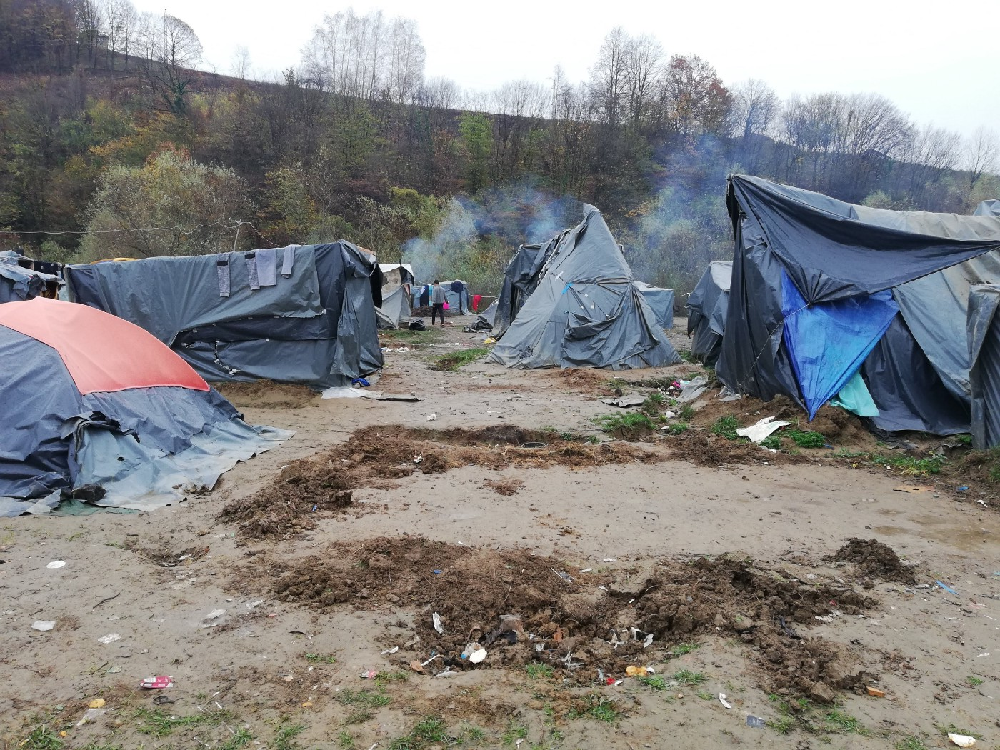
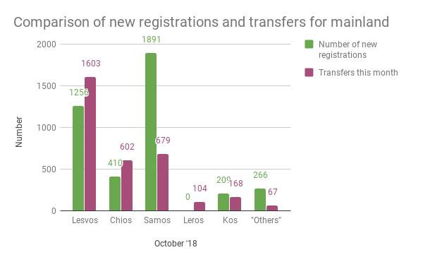
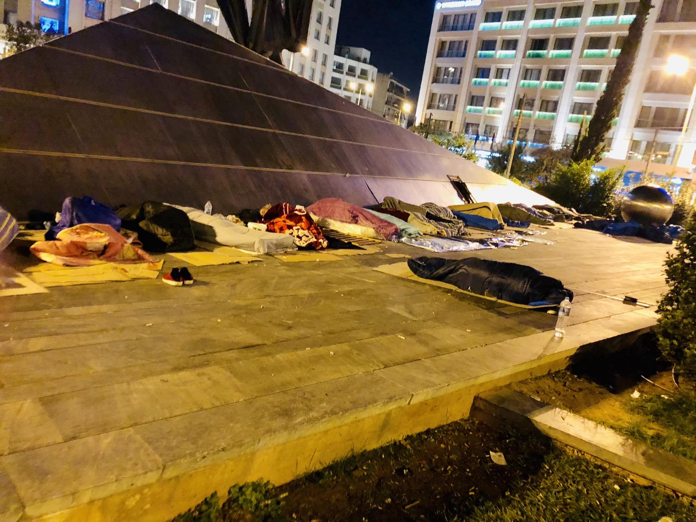
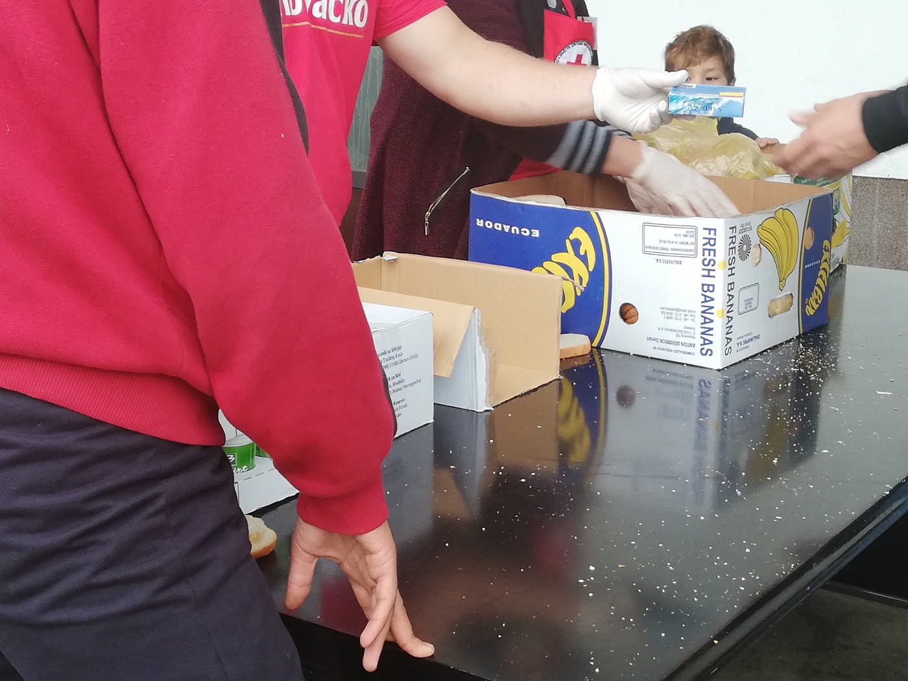
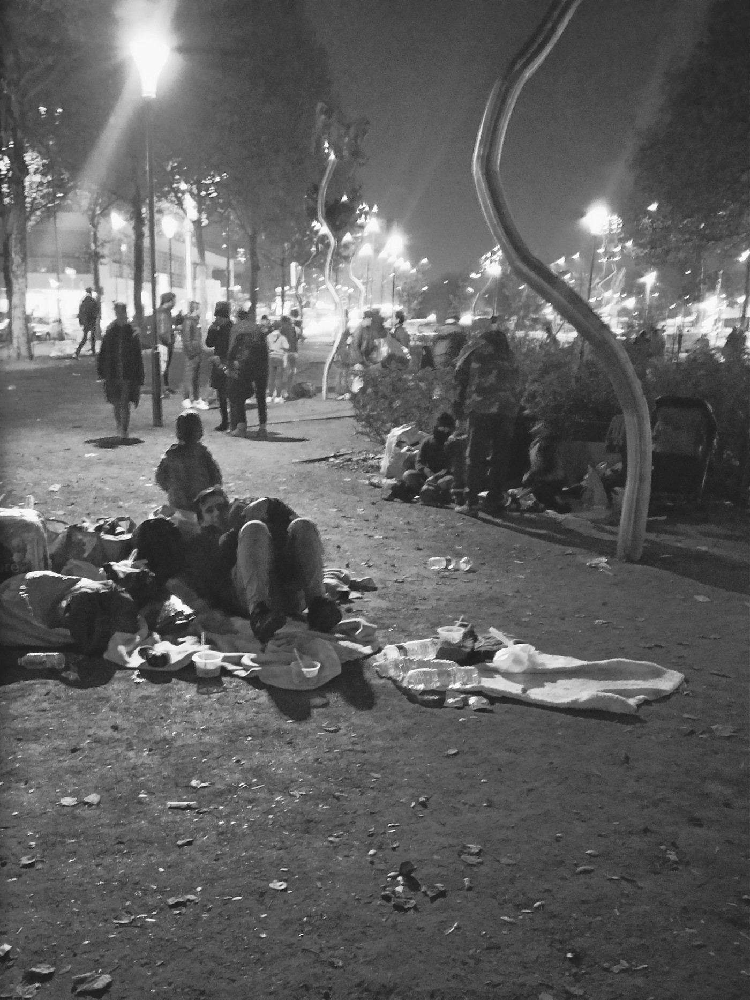
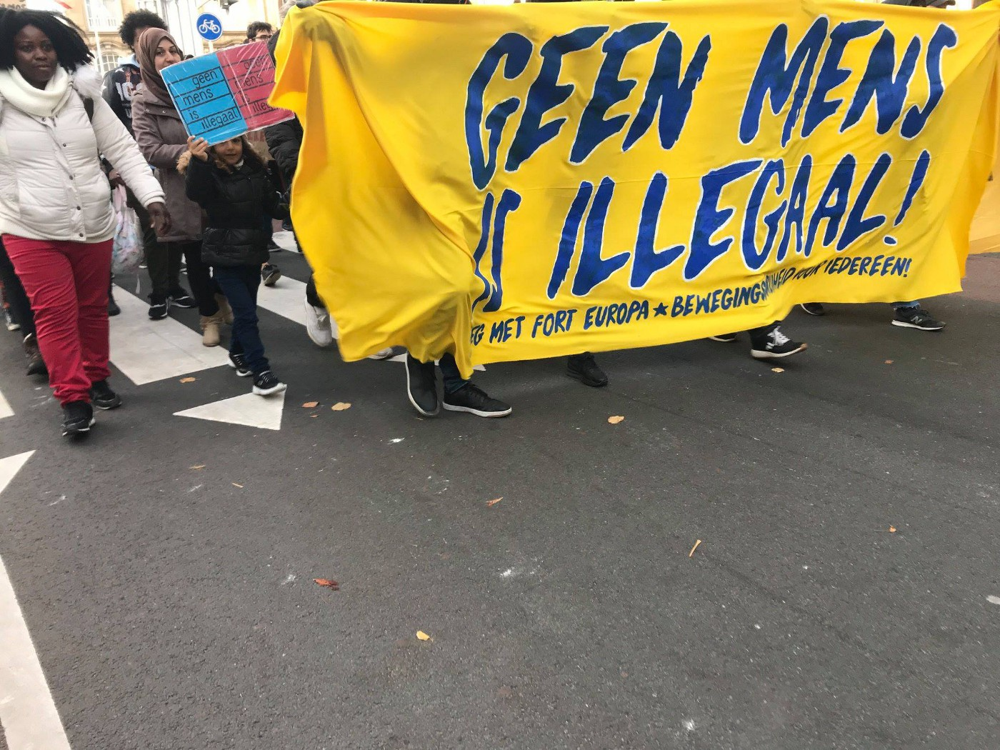

### AYS Weekend Digest 3–4/11/2018: Fake news and hate propaganda in Austrian media

_France deport minors to Morocco // Police violence in the streets of Paris // Report about the border violence in Croatia // Calls for solidarity and resistance // and more…_

](assets/3ffb8e1413f6/1*zDyudy3yKDpuV1MIUh4OtQ.jpeg)

Antiracist protest in The Hague\. Photo by [Deeez action and documentary photography](https://www.facebook.com/deeezactionandocumentaryphotography/?tn-str=k%2AF)
### Feature

“At the border to Croatia — only 224km from Austria — more than 20,000 people hope to break through on their way to Central Europe\. An analysis from “Group III \(migration\)” in the interior ministry says the rush could happen soon\.”

This is what fake news and hate propaganda looks like\. The article, and this is only part of it, was published on Sunday by one of the most influentially daily newspapers in Austria — [Kronen](https://mobil.krone.at/1801367) \.

The newspaper also writes that among people in Bosnia, 95 percent are male, “mainly from Pakistan, Algeria, Iran and Morocco\. Many armed with knives\. One border police officer has already been attacked,” and none of this is true\.

Additionally, they write about “a storm at the border,” whatever that means\.

On the other side of the border, thousands \(but far from 20,000\) of people who are looking for asylum in a safe country, or just dreaming about a better life, are deprived of their basic rights, left to live in mud with their children and families\. Many of them are from war torn countries like Yemen, Palestine, Syria, Afghanistan, Eritrea, Somalia, while some are coming from unstable states, where poverty, corruption and insecurity are preventing them to even hope for a better life\.

Camp in Bosnia where about 400 people live, many unaccompanied minors\. Photo AYS\.

Among people who are now in Bosnia, there are hundreds of unaccompanied minors and nobody takes care of them\.

The government of Bosnia is weak and inefficient, and not able \(or willing\) to take care of asylum seekers or its own citizens who are leaving the country in large numbers\. Over the last eight years, it is estimated that more than 150,000 people left Bosnia and Herzegovina, one of the poorest countries in Europe, and among the poorest in the world\.

Claims about crimes committed by asylum seekers in Bosnia are nothing but myth\. The [facts show](http://www.balkaninsight.com/en/article/low-offense-rate-among-migrants-and-refugees-in-bosnia-data-reveal-10-29-2018) that in the Una Sana Canton, in northern Bosnia, close to the border with Croatia, 53 criminal offences have been committed by asylum seekers out of a total of 998 offences recorded from January until September this year\.

In Sarajevo, during the first nine months of this year, a total of 3,125 criminal offences were recorded, but asylum seekers were reported as potential suspects in only 19 of them\.

Closed borders and unpunished violence by the EU border police is preventing people from claiming asylum\. This is the attitude that puts all of Europe in a very dangerous situation, leading to possible restrictions of freedom of movement for all\. If we permit this, basic human rights will soon be lost for all of us\.
### Morocco

Independent sources are [reporting](https://www.facebook.com/…/a.16931257808…/2210795765799353/…) that France deported five minors from Paris to Morocco contrary to all conventions that protect children\.

In the meantime, despite all the reports, [arrests and refoulement](https://www.facebook.com/.../a.16931.../2210835245795405/...) of people continues\.
### Libya

For days now, alarming calls for help are coming from the detention centre of Al Furaji Sebha in Tripoli where over 320 Eritreans \(including about 56 minors\) are left with no food for days\.

During the weekend, [Giulia Tranchina](https://twitter.com/GiuliaRastajuly) , a human rights lawyer, reported that the police denied them any food at all except half a piece of bread\.

The violation of basic human rights of people in this, and other prisons in Libya has been going on for months now\. In October, a young Somali man set himself on fire out of despair\. He tried several times to cross the Mediterranean but was intercepted by Libyan coastguards\.

[According to the UNHCR](https://reliefweb.int/sites/reliefweb.int/files/resources/UNHCR%20Libya%20Flash%20Update%202%20November%202018.pdf) , “as of 29 October, the LCG intercepted 14,249 people during 109 operations\. Majority of people were from Sudan, Bangladesh, South Sudan, Somalia and Mali\.

Hope that this degrading treatment could at least be sanctioned is coming from the International Criminal Court prosecution which [announced](https://www.un.org/press/en/2018/sc13562.doc.htm) that they continue to “receive evidence of alleged crimes committed against migrants transiting through Libya, including killings, sexual violence, torture and enslavement\.”
### Turkey

Harekact [reports](http://harekact.bordermonitoring.eu/2018/11/03/turkey-empties-syrian-border-refugee-camp/?fbclid=IwAR2KAczxT6eKO_3qWI3FkRyxhrzVmdRBsioA4vz-X38Gytt4-tdMCbL1K6g) about the situation in the Süleyman Shah Accommodation Facility, close to the Syrian border, saying that a number of people were kicked out without receiving promised payments and alternative housing\.

“Some of the refugees said they had been made to sign a form saying they had left the camp of their own volition\. Many said they wanted to go to a camp in the nearby town of Suruç\. Syrian refugees, though provided with temporary protection by Turkey, have limited freedom of movement within the country\. They are required to register an address in one municipality, and then forbidden from leaving that municipality without official permission\.”
### Sea

Over 100,000 arrivals are [recorded](http://bit.ly/2CXtn0V) so far in 2018, with almost 2,000 people dead or missing\.

According to the UNHCR data, most of the people who arrived this year over the sea are from Guinea, Syria, Morocco and Mali\.
### Fortress Europe

A number of media outlets in Europe are reporting about the possibility that a controversial system of an artificial intelligence powered “lie detector” will be used at some borders in Greece, Hungary and Latvia “to identify illegal migrants”\.

The system is sponsored by the European Commission, and it is supposed to test people by analysing their micro\-expressions\. Apparently, the system “will analyse the micro\-expressions of the those seeking to enter EU territory to see if they are being truthful about their personal background and intentions”\.

Bruno Verschuere, a senior lecturer in forensic psychology at the University of Amsterdam, told the Dutch newspaper De Volskrant that he believed the system would deliver unfair outcomes\.

“Non\-verbal signals, such as micro\-expressions, really do not say anything about whether someone is lying or not,” he said\. “This is the embodiment of everything that can go wrong with lie detection\. There is no scientific foundation for the methods that are going to be used now\.

“Once these systems are put into use, they will not go away\. The public will only hear the success stories and not the stories about those who have been wrongly stopped\.”
### Italy

Matteo Salvini [announced](http://stranieriinitalia.it/attualita/attualita/attualita-sp-754/accoglienza-migranti-salvini-taglia-i-costi-da-35-a-19-euro-al-giorno.html?fbclid=IwAR0lU5g5eolyjGDhyd0lq3SrlfE9sTGarPZm-i375rdga6TEs_lG2L5blIE) the possibility that Italy will decrease material help given to asylum seekers from 35 euros a day, to as low as 19\.33\. The figure will vary depending on the number of migrants hosted in the centers\. The document will be presented on November 7\.

In the mean time, resistance has been [organized](https://www.facebook.com/meltingpoteuropa/posts/2144970462201336?__xts__%5B0%5D=68.ARCxNRCROms1e5d3EXOSjPfVMc3OO0ibBsj7N9TACcaLqoHztK8rhn9il6O7cu2SY1a5PvDlSp8da6gZ36oXXnPfd7MOeIRrFR631zXedCarjHLTSvc6sdAdrbbFWLoA2HUcbYb8wgY3Mwgq6RUUOAUfJ0Vfc8WcN1OUEOM0WxMpXp4bRE3ZFRsuVmX_1bcI4LVwbwLgjQ97Eyk1oun0qqDl584&__tn__=-R) against Salvinis’s policies in 51 cities from where people plan to depart on November 10 towards Rome for big protests\.

Resistance is already strong and the protests are taking place almost daily\. On Sunday, thousands went out on the streets of Trieste at the antifascist and antiracist protests\.

Trieste\. Antifa
### Greece

People keep arriving into Greece, via land and the sea\. On Saturday, [four boats landed](https://www.facebook.com/AegeanBoatReport/posts/468898300299946?__xts__%5B0%5D=68.ARBg6E2mAoacWGrdk9QNzoBbiMAPBbcS2l-HNAYs1pmJWEXOsFRz8Eudapj4QCKX0xPgOy0kB287MgdroClJpmq0VKQIDt40F7YECtaXV-F2oM2W_bUzZNsWkGu2cM23PG43JsQaeVa39-QHdf1zUm8RXv71_23kojkXGnwJLC0GdwaF-KPjXkcg4-JqisA2TtfSYffabhJetucgTOAq2oKv&__tn__=-R) on the islands\.

Among those who are arriving across the land border there are many vulnerable people, including families and unaccompanied children\. According to the official data, a third of the people who are placed in the camp near the border are unaccompanied minors from Syria, Afghanistan, Iraq\.

For the first time since last October, more than 4000 people \(4032\) were registered in Greece as new arrivals this past month\. Compared to September, almost 1000 more people are stuck on the Aegean islands\!

Although the Greek government transferred more people from Lesvos \(1603\) than registered there \(1256\), the situation remains tense in the camps as they are still overcrowded by more than twice the official capacity\.

AYS

However, we should have a look at Samos, where the situation gets worse and worse\. In October, three times more people were registered \(1891\) than transferred \(679\) \. This lead to a dramatic increase of almost 5000 people \(4996\) in the hotspot on 31\.10 \(compared to 3845 on 30\.09\) \! The hotspot has a capacity of only 648\.

From the other hotspots the following data is available from 31\.10: Chios — 2373 \(1014 official capacity, 2423 by end of September\); Leros — 796 \(860, 730\); Kos — 1109 \(816, 1185\); total — 16,890 \(6438, 15,904\)

Less people were transferred \(3223\) than registered and 17 deported \(271 in total in 2018\) in three runs according to Greek data\. The EU Commission reports more deported people, but I will rely on the Greek statements\.

Based on the past few years, we can assume that in November a few less people will try to make their way to Greece as winter is approaching and the sea gets rougher\. However, it strongly depends on the weather and the situation in Turkey and other countries\.

_\(Notes: New registrations do not necessarily equal the factual number of arrivals\._

_The numbers do not include all departures from the islands\. There is a voluntary Return Program of IOM and another readmission agreement between the EU and Turkey as well as a bilateral agreement between Greece and Turkey\. They are not covered in these statistics\. \)_

Once they leave islands, the situation for many people remains precarious\. Long term volunteer [**Rando Wagner**](https://www.facebook.com/rando.wagner?__tn__=%2CdlCH-R-R&eid=ARAIXlxt4yPeaaV3aKDQkbF1Jcglj_aRR8SE_J-snt7GtFQYMiNllDJSRvwZsk9qrtt4vpMCP7H8YJqq&hc_ref=ARQULgtpfmjY0Z-_1WSZ7FNNkOkMHsRme4rkM1x6zDAkiVYUpfUwdCyZkBmmIZKsgmI) reports about on “shocking examples” of how people are treated in Europe today\.

One example is from Argos where people from Afghanistan and Pakistan are living, as they work on farms

“The guys work for an agent as day labourers and get paid ‘on commission’ — 1000kg of Oranges nets them €15 \( max amount possible in a day\) — roughly €1\.25 per hour\. A kg of oranges sells for around £2\.50 in the UK or £2500 for 1000kg\. The farm workers receive less than 1% of the retail price\. Wholesale oranges sell for £660/1000kg @2\.5% for the workers\.”

The second scene is from Athens, in Metaxourghio Square, where 33 Kurdish, Iraqi and Iranian men \(some looked no older than 16\) are sleeping\.

[IHA — InterEuropean Human Aid Association](https://www.facebook.com/iha.help/?__tn__=%2CdkCH-R-R&eid=ARC1z8hw508IDw1FfeIZZg_t7KCsZRUHCKVXNLi9Oixy69uDOhefcGrQHcQz2UNAAdrz5Pomnc6ZwHJW&hc_ref=ARSNATyoD3-GZ8uQ-GUR-uIVh2qaWmOFsQUXBcK0zlBPA_UpFqVW5MKNS8Yy3nAyr9w&fref=nf) are still present in Northern Greece\. They are trying to provide help in the remote village of Lagadikia where they run a small free shop, providing essential aid from food and hygiene articles to tents and sleeping bags\.

“Most camps in Greece are overcrowded and access is often denied to new arrivals\. Lagadikia is one of the few places for them to go\. However, with all the caravans and communal spaces fully occupied, around 200 people are forced to sleep outside, while the nights are getting longer and colder\.”

The team is working extremely hard to cover the most urgent needs, but the situation is becoming more and more challenging, and they need help\.
### Bosnia

On Saturday afternoon, a fight broke out in a new place where about 300 people are housed after leaving the border area where they protested for eight days asking for the borders to reopen\. The place was given by the people of Velika Kladusa, the city at the border, but nobody has taken over responsibility to provide basic help for those inside\.

Food distribution by Red Cross and IOM in Kladusa\. Photo AYS\.

The Red Cross and IOM are providing food, or at least they say they do when they bring sardines and bread three times a day\.

In the fight, which is to be expected when people are left to live in degrading conditions with little food, six people have been injured, while two were arrested\.

After the fight, feeling unprotected, many left the place and went back to the city where they are sleeping in squats or in a makeshift camp in the open field\.

A journalist from German TV entered the new place recently before the fight to record living conditions but also stories of the border violence\. \(Report only in German\)

You can find more about border violence in our [special report](illegal-push-backs-and-border-violence-report-e5741e95f835) , prepared as a group effort by the volunteers in Kladusa\.
### Serbia

The number of people in Serbia is changing all the time\. At the moment, there are 3,919 people in the country\. Some 450 are living out in the open, including 160 close to the borders with Croatia or Hungary, and up to 70 in Loznica, close to the border with Bosnia and Herzegovina\.

UNHCR is still recording pushbacks, mainly based on the reports from the NGOs and grassroots organizations\. In October, they received 678 reports of collective expulsions: 324 from Croatia, 278 from BiH, 11 from Hungary and 12 from Romania\.

On 17 October, the decision of the Serbian Government to reintroduce visas for Iranian nationals came into effect\.
### Austria

[Activists are warning](https://www.facebook.com/ecada2017/posts/2178648569017804?__xts__%5B0%5D=68.ARBaQV0TwmEpMDI4p5mRTykZWqq4KJmn6NRJC0d60R8A0d9UXSMe7u9LD_VmdnKImn_6SvwMKxs3E7z8X8qKV4YCZUrX4rEGebJI749tfe8zVZ4fz7RJVp-JUNev7ql3quByZ9kj5b4GPdEPYfI3TyvT4zhzHuprNd6wVww8kF4X3FPYeNPt8TpB_i-zXU1Zd-wqXgo4clazMyAfqVqz7KM&__tn__=-R) about a new deportation from Vienna to Kabul which is apparently scheduled on Tuesday 6, and involves at least 3 people\.
### France

There is an alarming [report](https://m.facebook.com/story.php?story_fbid=1987915581507892&id=1948001065499344) from Paris about police harassment\.

“In Paris, asylum seekers families wait in the street for a harboring\. This Thursday, police came at Porte d’Aubervilliers, in the north of Paris\. They forced them to leave the park were they were waiting for the NGOs to come\. Migrant women and children received tear gas and blows by police who also sprayed their blankets with tear gas, so they wouldn’t be able to use them anymore\. This 10 year old child from Afghanistan testifies\.”

More reports about the violence from [Faces Before Numbers](https://www.facebook.com/FacesBeforeNumbers/?__tn__=%2CdkCH-R-R&eid=ARBCzLYvDhBJSZqSAggIkAiTZri1z2U6z8TRQ8ngjkoq72UdKHkQMhsCwUh-yMgp18K4tXgSlv-guHm0&hc_ref=ARSplxFRw2t6CmNVWBAipIX2Jj8WvnvaQlvDQ4ky_LTcy8Za-U-TJNy1zdP2Hm2wYYU&fref=nf) :

“This is the message I got Thursday morning from a friend sleeping rough in Paris, along with dozens of other people\. On the phone he explained that the police came early in the morning and told everyone to leave the place without giving them the opportunity to collect their stuff\.

They destroyed the tents and put personal belongings to the garbage\. This includes blankets, clothes, bags but also & more dramatically people’s papers and documents\.

They left them with nothing and the police was still there during the night, preventing them from sleeping where they’re used to and where they had a precarious but tiny little establishment\.

This in the exact same place that the police itself had indicated when they had forcibly moved people in the summer, ordering them to cross the highway so they’d be outside Paris\.

This forcing them to go back on the other side of the highway, in the very same place they were kicked out of in the summer\.

Paris’ needless & cruel violence & harassment\.”

Longterm volunteer [Danika Jurisic](https://www.facebook.com/profile.php?id=100009499466124&__tn__=%2CdCH-R-R&eid=ARCto4GFxz-2OjSmNzVu_Lvkf8884d39qqHJvgq2gFRRvH-9qPL1WPd48nSEFW5kK3yX9n3RvOk_A6UU&hc_ref=ARToEyIh3MKPEy9r_neNGB_fhDrMNFRyL5qA5DQVwmU1YblO0r9OouGbLET7ZjOxpHo&fref=nf) also send alarming reports from Paris\.

By Danika Jurisic\.

“I’ve been on the Paris camps for over three years now and morning has changed, actually, it seems things are getting worse\. We had a good warm weather almost through entire October, but now temperatures have dropped to 7 ℃ and the treatment or care for refugees has not met the needs, not even with this cold\. There are so many families on the street , families who have been through so much, vulnerable families with very small children, babies… They are waiting every night at Porte de Aubervilliers for a miracle, for someone, some association to find them a shelter for the night\. Their clothes are wet and covered in mud because they have spent entire day in the patch of muddy land, a small park located in between highways\. There are Afghan families, Kurdish ones, Chechens, but unlike before, even Syrian families are now there, forgotten in the cold\.”
### Netherlands

A big ‘No One Is Illegal’ demonstration was held on Sunday in The Hague with over 700 taking part\.
### Sweden

The people who are camping outside of the barracks they used to live in before they were evicted, were not removed during the weekend, [according](https://www.dn.se/sthlm/vi-kommer-inte-att-erbjuda-dem-nagra-bostader/?fbclid=IwAR3v8gj7viczNoh-1mFHS8Z9tkGXR0c6AQhU2EGPkpEq-kczXaHcO2CKeaY) to the police in Solna, Stockholm\. \(They are all fairly newly arrived, but the two year phase during which they have to be provided with accommodation has just expired\. \)

However, the municipality says that they won’t provide any accommodation and that the people will not be able to move back into their former homes\. The accommodation they used to live in is, according to the municipality, needed for more newly arrivals, which they have the responsibility to give housing for two years\. In general, a lack of accommodation is a big issue in Sweden and especially the big cities\.

It is not clear what will happen with those who are currently camping in Solna\. They are, as it is stated in the article, referred to social services and private solutions just as any other Swedish people \(but as still new in the country, their network is likely to be much more limited\. \)

**We strive to echo correct news from the ground through collaboration and fairness\. Every effort has been made to credit organizations and individuals with regard to the supply of information, video, and photo material \(in cases where the source wanted to be accredited\) \.** 
**Please notify us regarding corrections\.** 
**If there’s anything you want to share or comment, contact us through Facebook or write to: areyousyrious@gmail\.com**

_Converted [Medium Post](https://medium.com/are-you-syrious/ays-weekend-digest-3-4-11-2018-fake-news-and-hate-propaganda-in-austrian-media-3ffb8e1413f6) by [ZMediumToMarkdown](https://github.com/ZhgChgLi/ZMediumToMarkdown)._
