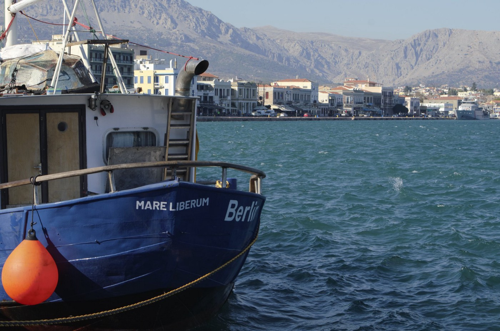
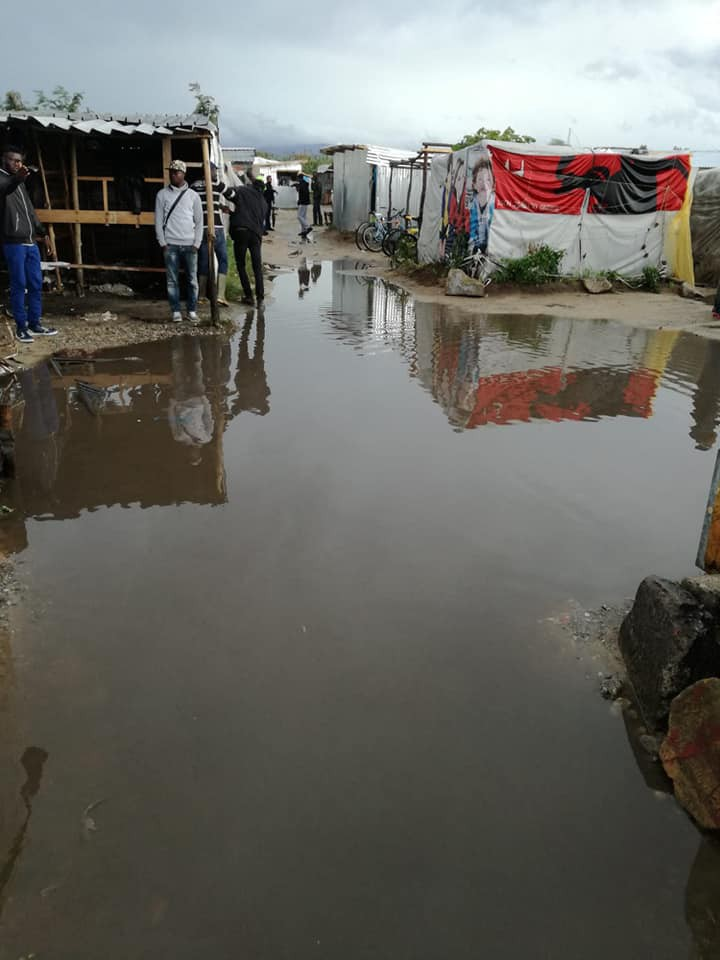
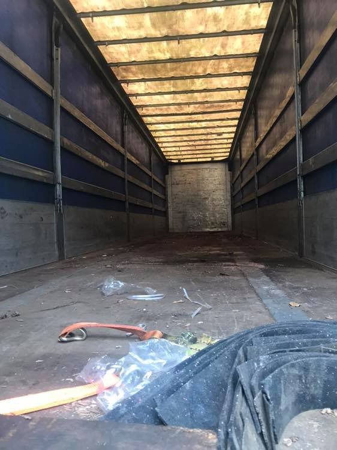
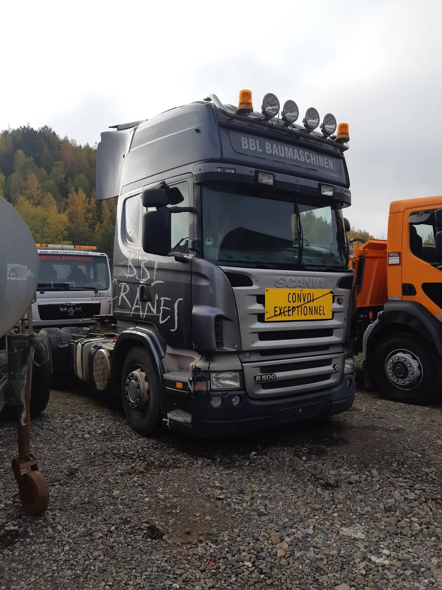
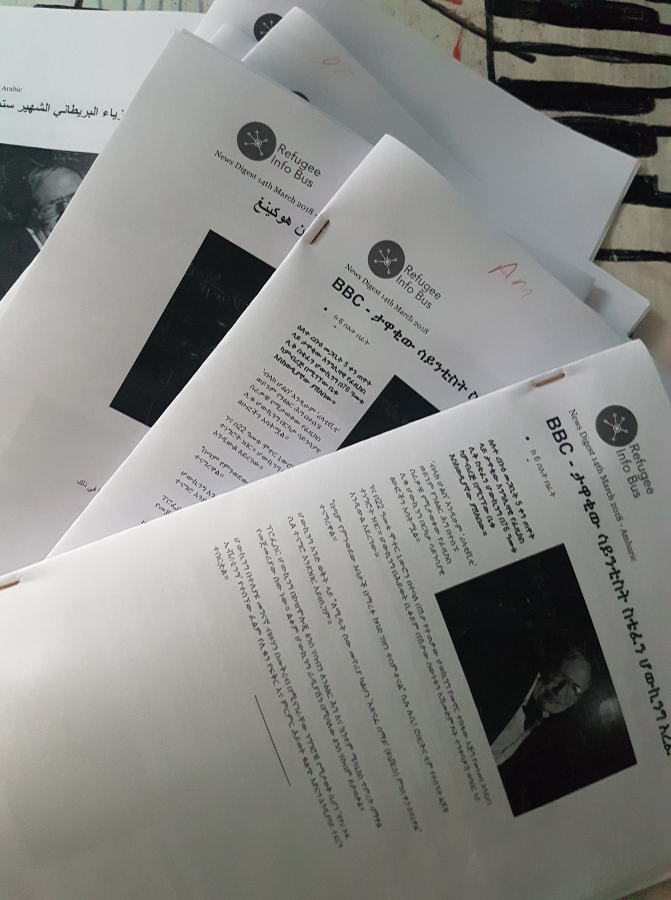

### AYS DAILY DIGEST 06/11/18: After latest tragedy, death toll in Mediterranean reaches 2000 this year

_Deplorable hotspot conditions denounced // Artists in Moria // San Ferdinando Camp completely flooded // 24 tons of aid to Bosnia // Deportations continue in Austria // Donauwörth trials beginning soon // In Iceland, winter is here // Refugee Info Bus looking for new team members //_

](assets/2bc994b09e44/1*OEa_R2rYjlSjPRb04sLk-g.jpeg)

Looking out to sea\. Source: [Watch the Med](https://www.facebook.com/watchthemed.alarmphone/photos/a.1526182797655958/2249199658687598/?type=3&theater)
### Feature —

Another dark day in the Mediterranean\. The bodies of at least 17 refugees were recovered off the Spanish Coast, according to [IOL](https://www.iol.co.za/news/world/spanish-coast-guard-finds-17-dead-migrants-100-survivors-in-mediterranean-17790080?fbclid=IwAR1qyWbxiLPGJJttRL8F988xe3tJdaWG_3EIZFNh-20gU1p68jmMvn2T2fI) \. Watch the Med [reports](https://www.facebook.com/watchthemed.alarmphone/photos/a.1526182797655958/2249199658687598/?type=3&theater) that up to 31 people may have died\.

This fresh tragedy makes over 2000 people who have died attempting to cross the Mediterranean in 2018\. 2000 sacrificial victims of Fortress Europe\.

**Stopping these senseless, unnecessary and quotidian deaths will require a complete overhaul of E\.U\. policy toward refugees at its borders\.** In the absence of such change, allowing independent humanitarian organizations to carry out their mission — saving lives — is absolutely the least that European governments can do\.

Please sign this [petition](https://www.change.org/p/dejad-zarpar-nuestro-barco-de-rescate-ni-una-muerte-m%C3%A1s-en-el-mediterr%C3%A1neo?fbclid=IwAR0dOBAA8yK_npjs1Wi3N2cctJZiQx5WkPdHQ25DzS_uEQGPzlM_KXkQsG8&recruiter=906030780&utm_campaign=psf_combo_share_initial.pacific_abi_select_all_contacts.select_all.pacific_email_copy_en_us_3.control.pacific_email_copy_en_gb_4.v1.pacific_post_sap_share_gmail_abi.gmail_abi.pacific_email_copy_en_us_5.v1.lightning_share_by_medium_message.control.lightning_2primary_share_options_more.fake_control&utm_content=okt_psf_wa_shlinks%3Areal_control&utm_medium=whatsapp&utm_source=share_petition) urging the Spanish ministry of development to allow rescue boat Aita Mari into the Central Mediterranean, and continue to advocate for the [Aquarius](https://twitter.com/SOSMedIntl/status/1058397127347462146) and other vital rescue operations\. And please — continue to hold the E\.U\. responsible for its complicity in these deaths\.

Heading toward Chios port\. Source: Mare Liberum Facebook

The Mare Liberum, a rescue boat in the Mediterranean, has docked in Chios\. It will spend the next ten days on the island brainstorming better forms of aid and activism with local NGOs\.

The organization posted on Facebook: “So far in 2018, 3,290 people have made it across the Aegean to Chios \(UNHCR as of 28 October\) \. This is just over half the number of arrivals in 2017, which stood at 6,294 \(23% of all Aegean arrivals\) \. Despite this drop, conditions in Vial, the only camp left on the island, remain dire, due to chronic overcrowding and lack of adequate shelter\. NGOs and civil society organisations work hard to fill gaps in official service provision for the refugee population, which is currently at double the island’s capacity\.”

Meanwhile, the Council of Europe has released a new report denouncing the poor conditions in Moria, according to the [Greek Reporter\.](https://greece.greekreporter.com/2018/11/06/council-of-europe-blasts-greece-on-lesvos-migrants-camp/?fbclid=IwAR06yFd5rZITX_1b_iCeR9EOSRqG4fRXD2ZDxNWE-8u_y611g8Fs_4P5WDg) Human Rights Commissioner Dunja Mijatović focused particularly on the long wait times for residents to access drinking water, as well as the shocking rates of sexual violence in the camp\.

And then there’s Samos, where living conditions just might be the worst of all the hotspots at the moment\. The Vathy reception center is currently seven times over capacity, and the UNHCR today [called on](http://www.unhcr.org/news/briefing/2018/11/5be15c454/unhcr-urges-greece-accelerate-emergency-measures-address-conditions-samos.html?fbclid=IwAR0f_7agSdnApIcfoNxxP9U9W1X8zxTjHSQlgbOYgrYBcgPI1aP931uS6LM) Greek authorities to take “urgent steps” to improve the situation for refugees on the island\.

You can register your dissent to hotspots conditions by writing a complaint to the Greek Ministry of Health [here](http://www.moh.gov.gr/contact) \. Volunteer Philip Glader invites people to copy and paste his message, displayed below\.

> Dear Greek Ministry of Health, 

> As a former visitor, I find this article very disturbing: 
 

> [http://www\.unhcr\.org/…/unhcr\-urges\-greece\-accelerate\-emerge…](http://www.unhcr.org/news/briefing/2018/11/5be15c454/unhcr-urges-greece-accelerate-emergency-measures-address-conditions-samos.html?fbclid=IwAR0DW_42dva9YNdr_8OL0dVTFOfOnZul60cg2j9vsaRjXmLhk46VYKls9g8) 

> This is 100% not the way to treat people who are fleeing persecution and conflict\. I will be boycotting and encourage boycotting Greek health products and tourism to your mainland until you provide greater assistance to address inhumane conditions for the asylum seekers on the Greek islands, particularly Samos at this time\. 

> \- a deeply concerned former volunteer, 

Of course, camp conditions on the Greek mainland, though less publicized, are also awful\. In a bitterly ironic twist, many of their residents are refugees who were transferred from the island hotspots because of their vulnerability — only to end up back in a horribly familiar situation\.

■■■■■■■■■■■■■■ 
> **[RSA](https://twitter.com/rspaegean) @ Twitter Says:** 

> > Out of the 64,900 refugees currently living in Greece, a significant percentage (around 16,500 persons) live in 26 camps in mainland. Only 3 of these camps have a legal status and living conditions are often very poor.
[rsaegean.org/a-map-of-prote…](http://rsaegean.org/a-map-of-protests-on-the-refugee-camps/)
#Close_Camps_Open_Homes #refugeesGR 

> **Tweeted at [2018-11-06 11:39:08](https://twitter.com/rspaegean/status/1059772165883682816).** 

■■■■■■■■■■■■■■ 

And yet, despite the dismal reality for refugees in camps across Greece, many people respond by creating art\.

The Hope Project Arts on Lesvos focuses on refugees’ health and well being, providing a space for refugees and the local community to work together through music, theater, poetry, dance and art\.

As Lesvos activist Phillipa Kempson reports, “There is always in danger of seeing these people as just refugees” — but “this is only what they happened to be\. We have always seen that they are a diverse group of people with incredible ideas and abilities\.”

Spend a moment looking through some of the participants’ artwork at the link below\.

This Saturday, November 10, the Regional Asylum office of Attica \(Katechaki\) will [ONLY](https://www.facebook.com/481351218685655/photos/a.578873295600113/1156138637873573/?type=3&theater) be issuing travel documents to beneficiaries of international protection\. 7am\-10am only\.

The [Greek Forum for Refugees](https://www.facebook.com/Greekforumofrefugees/posts/2175142195853908?hc_location=ufi) is looking for Volunteer Language Editors to teach refugees and help promote integration in Athens\. You can send them your CV at humanresources@refugees\.gr if you’re interested \(subject: “Volunteer Language Educators”\) \.

](assets/2bc994b09e44/1*IzSF_v7biXAsniwm7lPALg.jpeg)

Asylum applications to Greece have increased 200% in the past decade\. \(the Greek Asylum Service didn’t even exist until 2011…\) Source: [Open Cultural Center](https://www.facebook.com/OpenCulturalCenter/photos/a.1304076196287462/2402120543149683/?type=3&theater&hc_location=ufi)
### Italy

](assets/2bc994b09e44/1*BvmTbn-WjXTOHzhQhlC2Kw.jpeg)

Flooding at San Ferdinando Camp\. Source: [Comitato Lavatori della Campagne](https://www.facebook.com/comitatolavoratoridellecampagne/posts/2184624771603636)

The makeshift camp of San Ferdinando, in Calabria, has been completely flooded, and conditions are miserable\. The greater part of camp residents do necessary work in the nearby fields and are in Italy legally: most of them have residence permits, a smaller number are on seasonal work visas\. Despite this, Italian authorities don’t want them in the camp and aren’t willing to provide more suitable accommodation\. Police are on the scene constantly, harassing and intimidating residents\. Meanwhile, harvest season is about to start again in the fields, meaning that more and more workers will be arriving in the area with no real solution to accommodate them\.

“A new season of exploitation and repression is about to start, but the fight of those living in the ghetto will never be over,” writes the Comitato\. Read the full post, in Italian, [here](https://www.facebook.com/comitatolavoratoridellecampagne/?__tn__=kC-R&eid=ARDHX9Ce8TCBQMaPn6OKeL4DdJF0INovx62nzanwwTyUBciaNKlbYZecbplB1W5SzgtEXBaow1T3PAIX&hc_ref=ARRWkM5vqbh3MsLb6glOIPmIK2BBazJKts9yDw5cI83B4Jh97PgRlvJYi6R9AGk-eGc&fref=nf&__xts__[0]=68.ARC0nQrktdObJDsMFsrzqSyBmM0Fld8wFQzx7DMURpSrIFxWm-uKKBJxuJOwPSMuphDq_Rnv6uti0uFTyXwIm-y1IuaRzpgMSu-LPqlekYFI60RCw69MJZD43QZtOWVcbgfSjzHD6gan5ZXDF67dW4wlhcmsOqN4SleB0Ya78q-SCjV-UyB_sRSIT1tQtkQsVNKJZi7VWW5Ieua465_o4wG7PDA) \.
### Bosnia

](assets/2bc994b09e44/1*X74tTdW0ETg3_wo7Hs_Jvg.jpeg)

Aiming to fill this truck with supplies for refugees in Bosnia\. Source: [Fabienne Dimmer](https://www.facebook.com/groups/catchasmile/)

Bosnian solidarity organizations are hoping to fill the truck depicted above by **November 25th,** when it will set off on its journey to Bosnia — with **up to 24 tons of supplies\.** The organization is especially looking for Non Food Items — Winter blankets, duvets, winter clothing for men sizes S to L, Practical men’s shoes sizes 37–44, warm underwear, socks, gloves, scarfs, men’s hats, sanitary packs — and dry food such as Basmati rice, spices \(Indian and Middle Eastern\), red lentils, and black tea\. Note: NO tents or sleeping bags, due to border restrictions\. It’s very important that all items be counted, with a rough idea of their spatial dimensions if possible\.

If you want to help, which is very needed, you can also donate to local charity pomozi\.ba which provides help since January\. They will buy locally and distribute to those in need, including local population that is in big need since Bosnia is one of the poorest countries in the world\.

**Update from an AYS volunteer in Sarajevo:**

“Temperature has dropped a bit in Sarajevo\. It has been unusually warm for a bit\. Tonight we have fleece blankets instead of emergency blankets \(thin survival thingys\. \) Therefore it was a lot of people at distro\.”

Additonally, the local police contiues preventing people from going from Sarajevo to Bihac and Velika Kladusa\. They are checking busses and trains looking for refugees\. The searches are racist since they check people based on their skin color\. It is illigal to do this\. Big international organization responsible for refugees and migrant present in Bosnia, that should be taking care of human right too, are silente about this obvious violation of the law and the international conventions\. Apparently, as one AYS volunteer witnessed, even Red Cross is at one of the places where busses are stopped providing assistance to those who are taken off and sent back\.

Additonally, an independent volunteer in Bihac informed us that makeshift camp in Borici is finally removed\. All the people are moved to new camp BIRA, run by the IOM\. At the same times in Djacki dom conditions are being improved\.
### France

Phillipe Caro has published a video [report](https://www.facebook.com/philippe.caro.7/videos/vb.100002023895875/1870272086383570/?type=2&theater) \(in French\) on the situation for refugees in Saint Denis\. There are at least 300 people sleeping rough on the Avenue Président\-Wilson currently\.

](assets/2bc994b09e44/1*6_bVCivDh6uJq5od1AQBFw.jpeg)

Source: [F\.A\.S\.T\.](https://www.facebook.com/groups/FASTCalais/permalink/2229193584027146/)

Urgent first aid needs for winter\. If you can, donate [here](http://www.f-a-s-t.eu/donate/?fbclid=IwAR3qNB_e57emvzPLrtRWU1sOP5uawOEbAlcFva7mVrjs2ATSWykA4g66elA) and help F\.A\.S\.T continue their lifesaving work in Calais\.

Posting again ahead of the beginning of the Gap 7 trial on November 8 — there will be a protest in front of the Gap courthouse beginning at 8:30, in solidarity with the seven activists on trial and against borders everywhere\. More [here](https://www.facebook.com/briserlesfeontieres/posts/1930068953751886?hc_location=ufi) \.
### Austria

We’ve said it before and we’ll say it again: [**Afghanistan**](https://www.bbc.com/news/world-asia-42863116) **is [not](https://reliefweb.int/report/afghanistan/afghan-paradox-chaos-and-violence-safe-returns-europe) a [safe](https://helprefugees.org/news/afghanistan-unlawful-deportations/) [country](https://www.emergencyusa.org/2018/08/afghanistan-heres-what-happens-in-a-safe-country/) \.** The U\.S\. state department [advises](https://travel.state.gov/content/travel/en/traveladvisories/traveladvisories/afghanistan-advisory.html) Americans to “draft a will” and “discuss a plan with loved ones” regarding “funeral wishes” before visiting\. If the U\.S\. and E\.U think that it’s too risky for their citizens to set foot in the country, why would the situation be any different for Afghan people?

And yet, across Europe, the deportations continue\. According to Refugee Camp Vienna, [at least seven](https://www.facebook.com/RefugeeCampVienna/posts/2083933578325891?hc_location=ufi) Afghan asylum seekers are due to be deported from Vienna to Kabul today\. Other reports [indicate](https://www.facebook.com/ecada2017/posts/2179356638946997?hc_location=ufi) that more than 10 Afghans will be deported\.

It’s too late to help prevent these folks’ deportation \(here’s some [advice](https://www.facebook.com/RefugeeCampVienna/posts/2084187121633870?hc_location=ufi) for deportees who’ve just landed back in Kabul\) but if you have a moment, please consider writing to the Austrian authorities to protest the pending deportation of a nine\-member Somali family\. Below is a sample email\.

> Contact: **post@bmi\.gv\.at, buergerservice@bmi\.gv\.at, kabhbk@bka\.gv\.at, service@bka\.gv\.at, reinhard\.pickl\-herk@hofburg\.at** 

> Subject: Stop the deportation\! 

> Dear Ladies and Gentlemen\! 

> A 9\-member family \(a mother, her 6 children, grandmother & aunt\) from Somalia, currently in the container camp in Schwechat, are due to be deported\. Due to legal errors, the family received a leave of absence in late summer, followed by a mandate notice regarding their relocation to Schwechat\.
 

> Hawa
 

> Aisha
 

> Aisha
 

> Zenab
 

> Somaya
 

> Sara
 

> Abdul Rahman
 

> Abdullah
 

> Samia
 

> are to be deported to Somalia, where they face threats of war and violence as well as female genital mutilation\. 

> Before their transfer, the family lived in Pasching in Upper Austria, where they were well integrated\. Their supporters wish that they could return and continue their lives there, together with friends, supporters, and neighbors\. 

> Please stop this inhumanity, let the family stay\!
 

> Sincerely, 

You can find the German text [here](https://www.facebook.com/plattform.refugees.welcome/posts/2117374918525590) \.
### Germany

[")](https://vimeo.com/296717141)

This past march, the German police brutally raided the Donauwörth refugee camp\. Two of the residents will defending themselves against accusations of halting a deportation — which police claimed triggered their raid — in court tomorrow\.

[Culture of Deportation II](https://vimeo.com/296717141?fbclid=IwAR1T0Q_qnI3OANCH1BLA_8kKLQUvzBUdwTIiNrSwk682gmlnHG8QZBbxb5k) ’s statement on the raid below:

> “Around 200 fully armed officers, including riot police, invaded the camp with dogs\. 32 Gambian refugees were taken into custody with massive brutality\. Two were released on the same day while the other 30 were isolated in pre\-trial custody for about two months\. Police stigmatised then as “rioters” and “ringleaders”, accusing them of having stopped a deportation of a camp resident to Italy in the night before the raid\. Two Gambian refugees will be challenging these absurd accusations at the Augsburg local court on November 7 at 1 pm\. We are calling on activists and friends to show their solidarity and come to observe this state legitimation of police violence against refugees\. Stop the politically motivated criminalisation of refugees in Bavaria\! 

> Donate to support the victims of the Donauwörth police attack, including lawyer costs: 

> Bayerischer Flüchtlingsrat
 

> Bank für Sozialwirtschaft
 

> IBAN: DE89 7002 0500 0008 8326 02
 

> BIC: BFSWDE33MUE \(München\)
 

> Verwendungszweck “Donauwoerth” 

### Iceland

In Iceland, winter is…here\. If you are a refugee or asylum seeker in need of warm winter clothing or other items to help you and your family withstand the cold weather, Solaris can help\! Contact the organization on Facebook [here](https://www.facebook.com/solarishjalparsamtok/?__tn__=kCH-R&eid=ARBoLvmBe32wbfLdpZSxdvjilGcO_9vxKS40n8ARPKpsDxZnqC1X0oCGUykldI_rVhP-BYfM6rXtM2tl&hc_ref=ARQswOCMdCpcmokPfjWtBaDVwazQPusWln1ts8dr1ESACiPv5-VokcqQrgBHH4ccMz4&fref=nf&__xts__%5B0%5D=68.ARCsfiOSgIJvQPzJnPoBX-eB7tOYnV5tyw3PzudpXwAnyM0fQbC9rX6gdBCj3mQeutRc5ZIo-7ituObDg573TErOpnTxwhGrIDWr3zWYoH6V2slpdkhh7FN8MgMgiFNFC8cBcYWLrbAhOX63zY9w4gr0gsNpn062-sJxZQ-3vvwE7c9Z9dcU4LBCMtye4a09yP7QTpeNO2A_XdrWX0yM8Yjrbjs) \.
### General

Brochures in a number of languages\. Source: Refugee Info Bus

For refugees, access to accurate legal information is both incredibly crucial and — far too often — structurally withheld\. The [Refugee Info Bus](https://www.facebook.com/pg/RefugeeInfoBus/about/?ref=page_internal) works to combat rumors and misinformation with reliable info in a variety of languages\.

The team is currently searching for an online team member and/or Facebook moderator who speaks English and either Oromo, Tigrinya, or Ahmaric\. If you fit the bill, please email them at **mail@refugeeinfobus\.com** or send them a message on Facebook\.

**We strive to echo correct news from the ground through collaboration and fairness\.**

**Every effort has been made to credit organizations and individuals with regard to the supply of information, video, and photo material \(in cases where the source wanted to be accredited\) \. Please notify us regarding corrections\.**

**If there’s anything you want to share or comment, contact us through Facebook or write to: areyousyrious@gmail\.com**

_Converted [Medium Post](https://medium.com/are-you-syrious/ays-daily-digest-06-11-18-after-latest-tragedy-death-toll-in-mediterranean-reaches-2000-this-year-2bc994b09e44) by [ZMediumToMarkdown](https://github.com/ZhgChgLi/ZMediumToMarkdown)._
