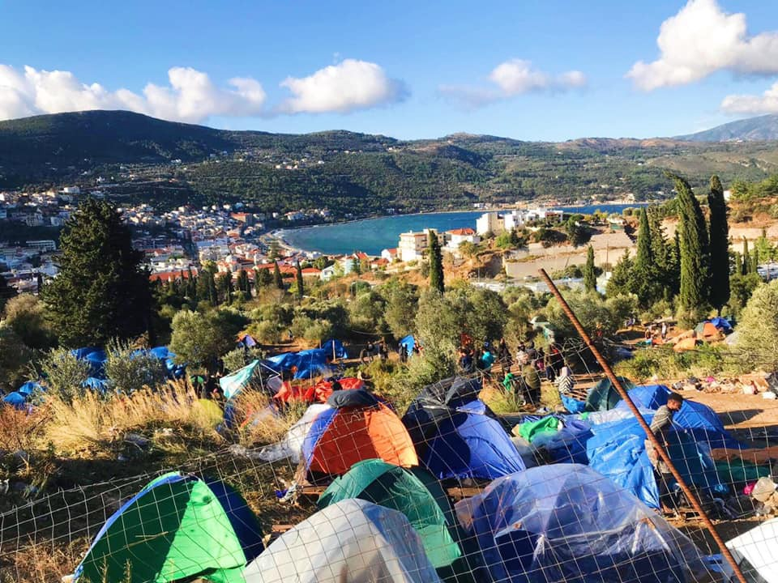
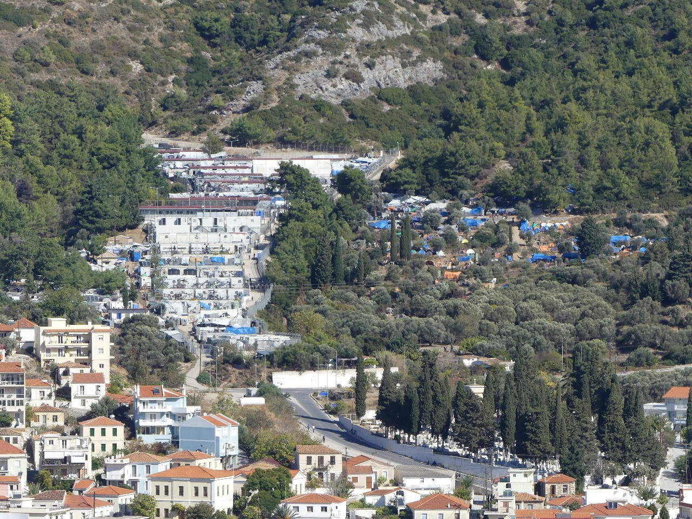
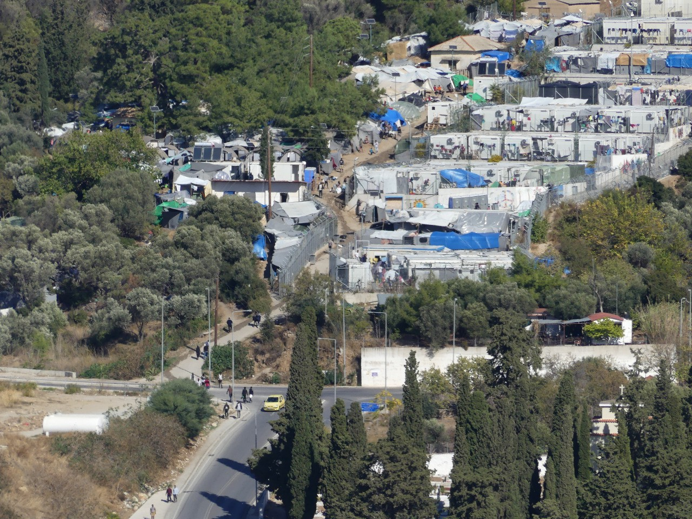
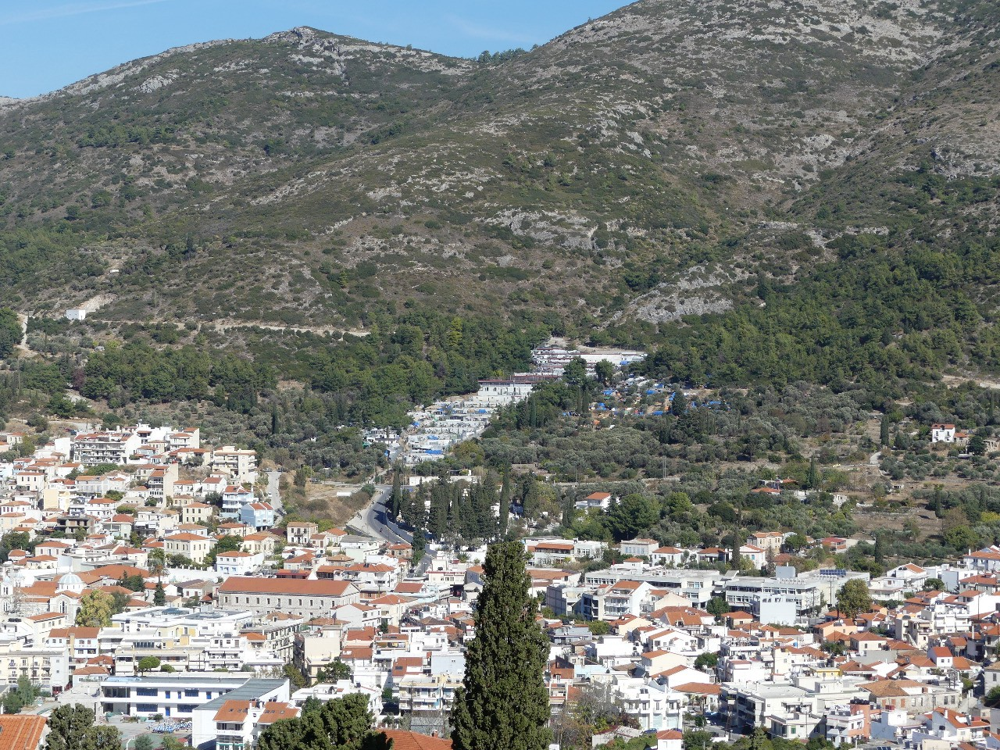
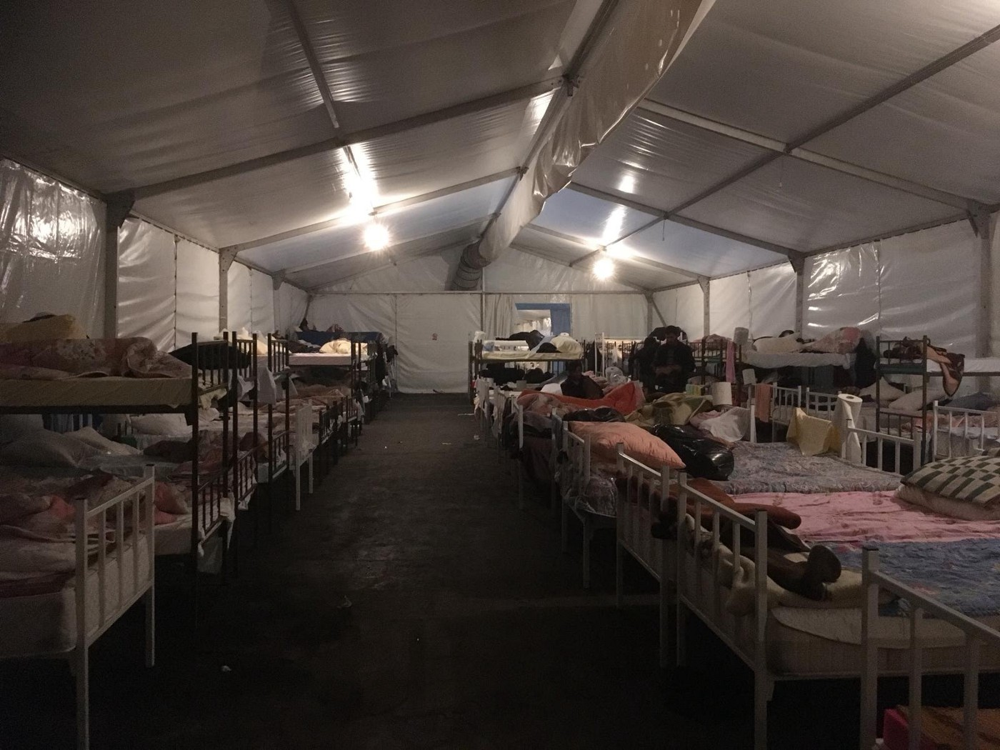
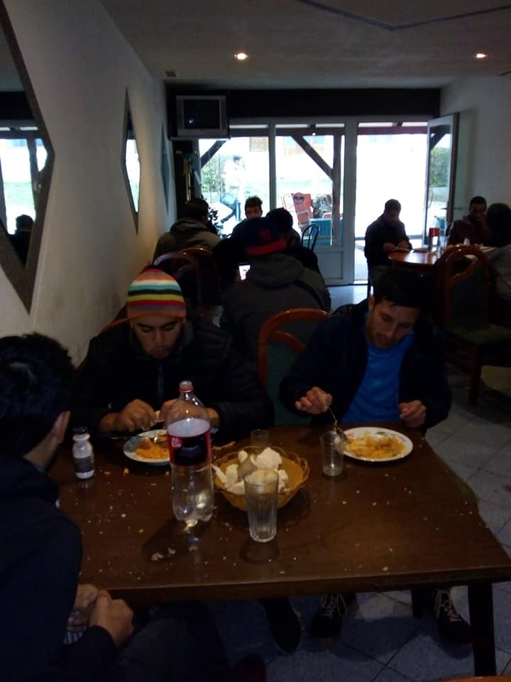
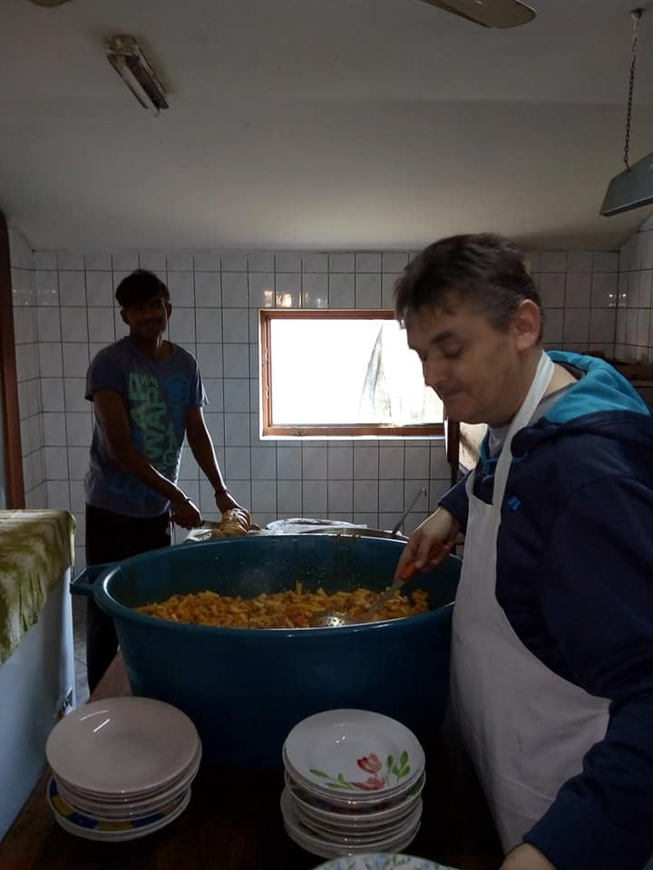
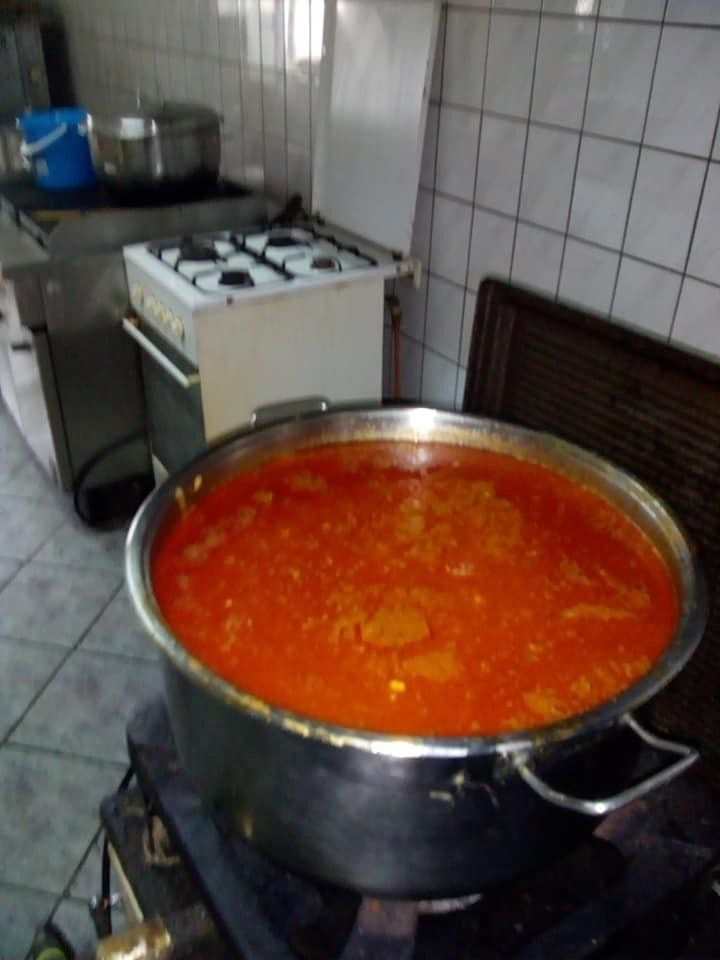

### AYS Daily Digest 09\.11\.18: Crisis on Samos

Detentions in Edirne//Italian authorities delay rescue//New arrivals on the Aegean Islands// 14,000 pushed back from Bosnia this year //Deportations in Austria// and more…

People set up tents outside of the overcrowded detention camp on Samos\. Photo Credit: AYS
#### Feature

In recent months the situation has worsened significantly in the detention camps on Samos and Chios\. [Refugee Support Aegean](http://rsaegean.org/the-hotspots-experiment/) released a report earlier this month that details increasing xenophobic violence on Chios and Samos, alongside many other human rights abuses\.

As refugees continue to flood into the Aegean camps, the UNHCR insists it is doing all it can to improve conditions, but the evidence speaks otherwise\. As RSA wrote in the report,

> “It is extremely problematic that these breaches \[of human rights\] continue despite the fact that a number of international organizations supervise and contribute to the hotspot operations\.” 

The xenophobic violence described in RSA’s report is appalling\. Yet this violence does not come out of nowhere\. By keeping so many people trapped in inhumane conditions for so long, Greek and EU authorities have created a recipe for hatred\.

In the camp on Samos, for example, there are currently no working toilets\. As a result, human waste is often seen around town and in the hills around the camp\. This has led to increased hostility from locals, and accusations that refugees are “animals” by those with no understanding of the conditions people are living in\.

The most recent report by the UNHCR states that there are approximately 4,310 people living in the camp on the island\. According to figures from the Greek interior ministry, the number is over 5,000\. Because the UNHCR bases their figures on their cash assistance program, and not everyone gets cash assistance, it is likely that the Greek interior ministry numbers are more accurate\.

However you split it, there are thousands of people crammed into the tiny hill\-side camp, and more people are seeking shelter in the woods every day\. The camp now has almost the same population as the surrounding Greek town of Vathy\.

The Samos camp is far over official capacity of 700\. On the upper right, many tents can be seen that people have set up outside the camp\. Photo Credit: AYS

The trailers seen on the right hand side in this photo are the safest housing in the camp\. However, the vast majority of the camp residents live in tents\.

For perspective, the camp on the top has nearly the same population as the town below\.

Additionally, access to health services is very poor; worse than in Moria, according to some sources\. Only one medical NGO is still present, after MSF left in March\. At the moment, there is no psychological support at all\.

If you are looking to volunteer on Samos, the organization Samos Volunteers is looking for volunteers to carry on their much needed work\. They are especially in need of people with teaching experience, those who can make a longer commitment, and people with previous volunteering experience\. You can contact them via their [website](https://samosvolunteers.org) or [facebook page](https://www.facebook.com/samosvolunteers/) \.
### Turkey
#### People on the move detained in Edirne

In the first 10 months of this year, 59,675 “irregular migrants” were apprehended in Edirne, according to numbers published by the pro\-government Milliyet outlet\. If arrests continue at this rate, the number is likely to reach 70,000 by the end of the year\. This represents a large upswing in the number of migrants and refugees being detained in the province, compared to previous years\.

That such a large portion of the 222,920 people apprehended within Turkey were processed in Edirne points to the high number of people moving through this area, and increased patrols\.

The top four nationalities of people apprehended are Pakistani, Syrian, Iraqi and Afghani\. The largest numbers of people seem to be apprehended in the months of August, September and October; the number tends to drop in the winter months\.
### Sea
#### Italian authorities delay sea rescue for nine hours

According to information from the Watch the Med NGO, Italian and Maltese maritime authorities failed to coordinate a rescue for a dinghy in distress until nine hours after they had received the call\. While all of the people who contacted Watch the Med were eventually safely rescued, the long delay could have had fatal consequences\. The dinghy in question had been on the high seas for over 30 hours by the time it was rescued\.

■■■■■■■■■■■■■■ 
> **[Alarm Phone](https://twitter.com/alarm_phone) @ Twitter Says:** 

> > Last night we were alerted by a boat with 27ppl, who departed from #Zuwarah. Finally they arrived safely on #Lampedusa. But according to #MareJonio 
@[RescueMed](https://twitter.com/RescueMed), the authorities reacted to the distress call with a delay of 9 hours. Our detailed comment:  
[facebook.com/watchthemed.al…](https://www.facebook.com/watchthemed.alarmphone/photos/a.1526182797655958/2250799631860934/?type=3&theater) https://t.co/jn3craUyjp 

> **Tweeted at [2018-11-09 15:45:01](https://twitter.com/alarm_phone/status/1060921206692610049).** 

■■■■■■■■■■■■■■ 

[SMH](https://twitter.com/salvamentogob/status/1060919559690043392?fbclid=IwAR0K7QVdCCViX8cz75BiCga4wKgyIHQUm6S2is2n84XMawgeM7CNFN7-ohg) rescued 11 people off a dinghy in Spanish waters this morning\.
### Greece
#### New Arrivals \(numbers from Aegean Boat Report\)

The first boat arrived on Leros, carrying 21 people \(no breakdown available\) \.

The second boat was picked up by the HCG on the south shore of Lesvos, carrying 18 people \(no breakdown\) \.

The third boat arrived on Samos early in the morning, carrying 60 people \(no breakdown\) \.
#### Population on Aegean Island Camps, Greek Interior Ministry

Photo Credit: Aegean Boat Report

Intervolve in Northern Greece is looing for volunteers to manage their kids activities, free shop, and informal education projects\. More info [here](https://www.facebook.com/InterVolve/videos/1858839010895828/) \.

Update on CASH CARDS in Athens: The Greece Cash Alliance helpline is now accepting new applications from people in Athens\.

See [here](https://goo.gl/Kzjyx8) what you need in order to apply for cash\.

Find out [here](https://goo.gl/qQCYkW) how to use the Greek Cash Alliance helpline\.

“ [Children of Moria](https://www.youtube.com/watch?v=oxp_hajbyMs) ” is a movie by Javad Mousavi and Said Reza Hossini Adib, two refugees awaiting their asylum papers on Lesvos\. The movie created as part of our ReFOCUS media labs has been qualified as one of the 51 best international movies of the Mobile Film Festival\.

The challenge of the festival was to create a one minute movie with a cell phone on an important human rights issue\. Now Reza and Javad are eligible for 20,000 Euros to make another movie\. If on November 15th their film is among the top 10 most viewed festival movies on YouTube, they will be invited to Paris for the award gala\.

While it is uncertain if they will be able to go we want to show the support by watching the movie on YouTube as many times as possible\. No other filmmaker qualified for the festival had to overcome as many obstacles as Reza and Javad\. They are competing against filmmakers with access, tools and resources\. Wouldn’t it be great if two former journalists from Afghanistan, now refugees living in Lesvos, could be celebrated for their work in Paris and get a chance to network with the best European filmmakers?

Please [watch the movie](https://www.youtube.com/watch?v=oxp_hajbyMs) \.
### Bosnia

Bosnian border police pushed back about 14,000 people this year, the head of the state government announced in public\. The government seems proud of this number, being completely ignorant of the fact that it is illegal to “prevent entrance to the country”, as they describe it, to people who are asylum seekers\.

At the same time, through the process of readmission, 899 people were sent back to neighbouring countries, Montenegro and Serbia\.

The government also announced that FRONTEX could be soon at the border with these two countries and Bosnia\.

According to the official figures, over 21,000 people entered to Bosnia this year, and 19,988 expressed the intention to seek asylum\. The government claims that out of this number, only 1,315 really applied for asylum\. Nevertheless, access to asylum remains a problem in Bosnia\. In May this year, High Commissioner for Human Rights Dunja Mijatovic warned about it in an [open letter](https://rm.coe.int/commdh-2018-12-letter-to-the-authorities-regarding-the-migration-situa/1680870e4d) to government officials, but little has changed so far\. It has become even more problematic considering the recent increase in people arriving in Bosnia at the moment\.

An additional problem is that, due to the lack of accommodation, many people are forced to stay outside\. Winters in Bosnia are long and harsh, and it would be impossible to survive outside\. Not even blankets or sleeping bags will help, and all the efforts have to be directed toward finding a solution to accommodate people in need\. Hopefully, in dignified and human conditions, which is not the case so far\.

BIRA camp, hundreds of people sleep together, with no possibility for privicy\. Phot AYS\.

Using the model which has already been proven to be ineffective, the IOM, which took over all the responsibility for the asylum seekers in Bosnia, is building ugly camps, with little to no privacy for people, and questionable safety\. One of them is open inside of the former factory BIRA near Bihac\. The agreement is made with the local private business owner, and the public has no access to more information about the contract or the amount of money spent here\. \(IOM as the international agency is not often transparent about their work, and the public has no way of checking anything about their work\. \)

At the same time, the police in Bihac area continues to prevent people from arriving to the Bihac area\. They stop busses on their way from Sarajevo, and leave people on the side by the road, and IOM cames to pick them up later\. Or, they prevent them from leaving trains once they arrive to Bihac\. Usually, they keep them inside for hours, and then the IOM sends busses to take them beck to Sarajevo\.

The given explanation is that there is not enough capacity in this area to accommodate people\. This practice is highly problematic since it represents restriction of freedom of movement\. Additionally, the police is very selective in their actions, particularly targeting non\-white people\.

So far, none of the international organizations present in Bosnia have objected to this rasism and restriction of the freedom of movement for asylum seekers\.

Meanwhile, hundreds of people are still out in the open\. The biggest number of people are in Velika Kladusa area\. Big NGOs present in Bosnia and in\-charge to help with what is going on, do not want to work with the government in this small municipality, making the problem even worse\.

But, volunteers are there to help, as well as people of Kladusa who are a great example of how solidarity works\.

Refugee kitchen in Velika Kladusa is back, and safe, thanks to [Lemon Foundation,](https://www.facebook.com/lemonfoundation/?__tn__=kCH-R...) but in order to continue they need your help\. Since February this year, four war veterans from Bosnia are cooking for refugees\. Every day they serve about 400 to 500 people\. Until several months ago, they were supported by the small donations, mostly from the locals, but also from the Bosnian diaspora, and the local charity based in Sarajevo pomozi\.ba\. In the summer, IOM came and promised they will support them in the future, but they abondoned them — with no explanation — after 3 months and they were recently forced to close\.

Many people in Kladusa, locals and refugees, were really unhappy\. However, thanks to the Lemon foundation, about 500 people can now eat there again, and locals will continue providing good nutritious meals, and host their guests in the restaurant, offering to each single one a table and seat, food served on a real plate, with cutlery and a napkin, and when there is enough even some juice\. The food is served as long as there are people who need it\.

Lemon foundation provided support for the whole month of November, and they are starting to work hard to ensure that in December the restaurant can also continue to run\. Help if you can\.

Photos by SOS Team Kladusa\.
### Austria
#### Why are Chechen refugees being fast\-tracked for deportation?

There has been an surge in the arrest and deportation of Chechen refugees living in Austria, according to activists from [Border Crossing Spielfeld](https://www.facebook.com/RefugeesSpielfeld/posts/2151591131768031) \. The flurry of deportations came shortly after a meeting between the Russian and Austrian interior ministers\.

Many people, including families with small children who have been living in the country, have been arrested in the middle of the night and taken to deportation centers\. Some Chechen people are being deported as quickly as within a day or two of their arrest\.

**We strive to echo correct news from the ground through collaboration and fairness\.**

**Every effort has been made to credit organizations and individuals with regard to the supply of information, video, and photo material \(in cases where the source wanted to be accredited\) \. Please notify us regarding corrections\.**

**If there’s anything you want to share or comment, contact us through Facebook or write to: areyousyrious@gmail\.com**

_Converted [Medium Post](https://medium.com/are-you-syrious/ays-daily-digest-09-11-18-crisis-on-samos-930f63c8252d) by [ZMediumToMarkdown](https://github.com/ZhgChgLi/ZMediumToMarkdown)._
