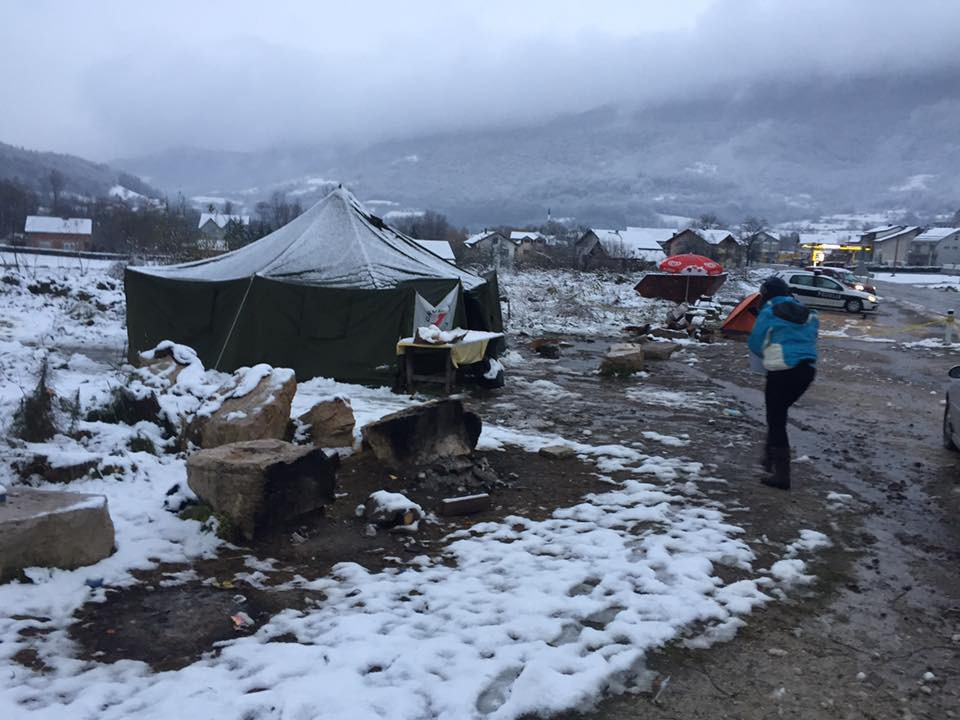

### AYS Daily Digest 19/11/18: “Human rights in the trash\.”

_First snow in the Balkans // Despite bad weather people still arriving on Greek islands // Another daemon has spread his wings above the most vulnerable in France — drugs // Germany is looking for the way to deport more people…_

Camp Trnovi in Velika Kladusa, about 300 people are living here\. Photo SOS Team Kladusa\.

During the night of Monday to Tuesday, all over the Balkans, but also in a big part of Europe, people who are forced to stay outside woke up in snow and heavy rain\. The situation on the Greek islands is threatening and everybody should be worried what will happen with those trapped in camps like Moria, Vial, Samos… The living conditions are unbearable, due to the lack of care from the governments and big organizations who are supposed to take care of people in need\.

 , SHAME on you\! \!”](assets/17d087db8712/1*evnaVaIFib9jS-oe4hk3ZA.jpeg)

Photo by Fotomovimento 15M\. “FUCK governments, FUCK borders\. [\#EU](https://www.facebook.com/hashtag/eu?source=feed_text&__xts__%5B0%5D=68.ARB58i3-pLkjjLy6wJMCEnb38rkq0nC7B2knrrD-G81-Hyz-3RaUWJdUAC2qHLDAG3vZaBcHrqaSHPYenllwUEPtJQLdVnJHiiEmfsK6KXLwzNQU9Ua8QNUUmYgd1GZvRU3SqeJiGkU3Wn3CZyhEetzqZQS9ZZAFipypsguomPlH18Fz8bfbRr-vHWeqnbbl35ILwb3Mm4dLsW39EkuP0TV-FHjWW9e3DnJcAGtsGkY7cpzkGT5K1Ypwsfvc7Jf6OB6hD9RbVCwsg24s9D-VdgplLKi3xLblCrJuh4ahQuPrX3fh1kmTAGfW-seNYUrM3N77XX2Cj24plorLBJ2cL8mHee77hEo8LyIUk89PLj-uwqPKUuMmUw&__tn__=%2ANK-R) , SHAME on you\! \!”

Vial Chios, Photo by Ruhi Loren, an independent volunteer\.

The situation in Bosnia is catastrophic\. The IOM, the organization that is supposed to take care of people in Bosnia and which is running the newly opened camps in this country, as well as their partners in the UNHCR, are not doing enough to help to all the people and there are many sleeping in the streets of Sarajevo and other cities\. Volunteers in Kladusa are trying to keep offering some kind of help\.

Photo by No Name Kitchen, shower place in Velika Kladusa\.

SOS Team Kladusa is in camp Trnovi camp\.

**Help is desperately needed\. Above all, pressure on the IOM and the UNHCR to accommodate people in decent places\.** In the case of Bosnia, this is fully their responsibility since so far they have received over 10 million Euros from the European funds to help the fewer than 10,000 people in this country\. It is absurd that anybody is left outside with that amount of money\.

Additionally, the Red Cross of Kljuc Municipality \( [Crveni Križ Općine Ključ](https://www.facebook.com/profile.php?id=100009318317491&ref=br_rs&__tn__=%2CdlCH-R-R&eid=ARBMkynnHQsWDPT8DfsgvTwmcUOMznl1xL9_Ev6tdwOrLTuhvHq6We0GypMTZTznm9oIMCxLMB1PfsmL&hc_ref=ARQpVQDubwxUMXRKgAiEogtdXAzue7WlmC5FYlk_op3gmoHdyrsQeRErG3V0Fo_J4Tc) \), a town in Bosnia half way between Sarajevo and Bihać, has published pictures from this morning\. A directive, agreed at a meeting between the state Minister of Security \(in charge of asylum seekers\) and the IOM \(who, in an unclear procedure, have taken over the responsibility to take care of these people from the state institutions\), has been issued by the police in the Bihac area to the effect that no more people are allowed to travel there\. For over a month now, the police have been stopping buses and trains and sending people back\.

People who are taken off the buses are left to stay overnight in Ključ, in a tent provided by the local Red Cross and guarded by the police\.

“This is not a migrant crisis,” the Red Cross wrote on Tuesday morning\. “Simply put, this is becoming a human catastrophe\.”

During the night, 64 people slept in water, under the tent provided by the Red Cross\. “We tried to contact those who are responsible to bring the bus and transfer people, but with no success… Despite all our efforts to help migrants, we can only provide a lunch packet and first aid, while everything else is not our responsibility\.”

Photos by Red Cross Ključ

BALKAN WEATHER REPORT for Tuesday 20\.11\.

MONTENEGRO

Mostly cloudy and rainy, with occasional showers, and possibly thunder in the south\. Locally more heavy precipitation is expected\. The southern wind will be moderate to strong, in the north and alongside the coast occasionally very strong\. Morning air temperature from 4 to 14, highest daily from 7 to 19 degrees\.

SERBIA

Cloudy, rainy and windy\. In the morning and before noon locally rain freezing on the ground\. Snow changing into rain in the mountains\. The southern wind will be moderate to strong, locally stormy\. The lowest temperature from \-3 to 1, the highest daily from 1 to 10 degrees\. 
 Weather warning: Very high probability of strong wind gusts and freezing rain\.

BiH

Cloudy and rainy\. In the morning snow and sleet in Krajina and in the mountains\. More precipitation is expected in Herzegovina and South\-eastern Bosnia; between 50 and 100 liters of rain per square meter, in central Bosnia between 30 and 60 liters of rain per square meter\. In other parts less rain is expected\. The wind will be mostly from the southeast, and in the north of the country there will be a northern wind\. Lowest morning temperature from 0 to 11, highest daily from 6 to 18 degrees\.

CROATIA

Mostly cloudy, rain along the coast, heavy rainfall in Dalmatia with local thunder\. Inland there will be snow transiting into rain and decreasing in intensity during the morning and around noon\. Most precipitation in Gorski Kotar and Lika, where rain will occasionally freeze upon contact with the ground\. Inland the wind will be moderate with strong gusts locally, blowing from northeast and east\. Along the coast a strong and stormy Bura, in Dalmatia a southern wind which will decrease as the day progresses\. The lowest morning temperature from \-2 to 13 and the highest daily from 1 to 15 degrees\.
### Morocco

The Morocco state news agency MAP reported that on Sunday, 22 people went missing in the waters off the Atlantic coast after their boat capsized\. Three people managed to swim to the shore and call for help\. The media are reporting that the people were trying to reach the Canary Islands, about 100 kilometres \(62 miles\) west of the Moroccan coast\.
### Libya

At least 79 people are still refusing to leave the ship anchored in the port of Misrata which rescued them on November 8th close to Libya\. They say they are afraid for their lives and refuse to leave\. Some, like a boy on the [video published by Mediterranean Rescue](https://mediterranearescue.org/.../salviamo-i-profughi.../) , has been in Libya for a couple of years and was tortured and sold as a slave more than once\. They are asking for a solution\.
### Turkey

A total of 44 people were rescued by the Turkish coast guard from a boat which set off from Gömeç towards Lesvos, according to the [Aegean Boat Report](https://www.facebook.com/AegeanBoatReport/?__tn__=%2CdkCH-R-R&eid=ARCoRu5v3oPUdI4xJJoJHbw6KUObCup9gPfvrEcokYHXC7J7MIP0N0TR25MNBIqJrTMJMzwaKpVFlbvN&hc_ref=ARRqaxF1r5ZUkMnCz9mLWvTqdJnneeKIFb60T0Ewiz7iKhIOBt1IjjKvTkS2cPtgi-U&fref=nf) \. Due to bad weather, the boat ended up on Yumurta Island, Ayvalik\. The people were transported to port Ayvalik, back to Turkey\.

### Greece

The weather in Greece is getting very bad, but people continue arriving\. On Monday, 56 people arrived on Samos and 36 on Kos island, according to the [Aegean Boat Report](https://www.facebook.com/AegeanBoatReport/?__tn__=%2CdkCH-R-R&eid=ARDJTXeJcZOBtLwdJZZlXIRu_nSdKp5fqbOSgVchNC6vvj0fZUAbc93I4q5oVdsBbTGJXhAdZoodsh7v&hc_ref=ARSbjztj3VkhKV7ny_H6QZzVIR6ZanReAw021ht7Dmm72vB2uErtk2aTOHjxNPqPyaU&fref=nf) \.

Volunteers working in Lesvos need help\.

“As you read these words, there are about 2,500 refugee children living in Moria, a refugee camp built to serve only as a temporary processing centre on Lesvos, but which hosts families for months, sometimes years, in dirty and overcrowded facilities\. Only half of these children are able to access any education\.”

If you want to join this team, please see [their post](https://medium.com/.../we-believe-in-the-power-of..) \.

[**The Hope Project**](https://www.facebook.com/HopeProjectKempsons/?__tn__=%2CdkCH-R-R&eid=ARAO12Z1SwXUZDc1X4QkwmfYbxYQlDqbXRHqvkT4ArvN7XKHjth1pjCsa0meaydWORO0ngTzr6xnrlka&hc_ref=ARSKNc4aRp4MduM-WcLQ9jiDotdc71g0_ihUBVOXxuuYCQPiA7621gKi-ZwWcZQZtA4&fref=nf)

“In the last week the weather in Lesvos has turned dramatically\! \!

A week of cold weather and bitterly cold winds has turned to torrential rain and storms, it has been raining solidly since this time yesterday\!
 The need for suitable warm clothing is now more urgent than ever\.
 We are desperate for coats and jackets for all
 Sleeping bags, blankets or anything warm
 Hats gloves and socks
 Shoes
 Trousers\.”

To help, and for more details, see FB page by the Hope Project\.

The Greek Forum of Refugees is launching its [new campaign \#RefugeesVoice](https://www.facebook.com/Greekforumofrefugees/posts/2192841607417300?hc_location=ufi) \.

“Refugee’s voice” campaign discloses daily life reality in Greece from their perspective\.
### Italy

So far this year, 22,450 people have arrived\. Only in November, 495 new people were registered, which means 28 daily arrivals on average, according to the UNHCR\.
### Bosnia

Photo by Elio Germani, No Name Kitchen Velika Kladusa\.

> “Now that winter has already fallen over Velika Kladuša, every time children and girls arrive in our showers, our hears shrink a little more\. Yesterday, two Afghan families, ethnic Hazara \(a group persecuted for centuries in the country\) turned up\. Three years on the way\. They arrived in Macedonia in 2015, just one day before the closure of borders between Serbia and Hungary, a closure that has left thousands of people trapped in the Balkans\. Since then they have lived on the street and in several refugee camps\. 

> Yesterday they appeared in our showers, exhausted\. The adults talked very little\. The boys and girls were playing\. They had come back from ‘the game’, that sinister game that consists of crossing Croatia and Slovenia hidden by forests to reach Italy in order to aspire to asylum protection\. When winter comes, this game will be even more sinister because snow and cold kill\. So people have been rushing desperately in these past weeks to cross\. 

> These two families lost ‘the game’\. The police caught them and deported them illegally, after days and days of walking through the forest sleeping in the open\. The policeman didn’t beat them as usual, but he did push them and shoot with an air gun near their heads to scare them\. The little ones cried a lot, according to the little their parents told us\. 

> “If it wasn’t for my mother’s leg, we’d try it again tonight”, one of the boys said\. The mother fell down in ‘the game’ but still kept walking for two more days\. Judging by the swelling of her leg and the pain she has, she could have a fractured bone\. 

> Before yesterday, another Afghan family turned up\. Almost all the family members were women\. The story was similar\. 

> Europe, when are you planning to respect the rule of law and human rights?” 

**_No Name Kitchen\._**

Solidarity — [Care4Calais](https://www.facebook.com/care4calais/?__tn__=%2CdkCH-R-R&eid=ARBNZARXTX5ZBSUWi93zPjPOwI3e0LNwparvPRlvyvvirvWdISDEH5bMcedGcErxBhFEzJOt0iJCIUKF&hc_ref=ARQl24t2GSyOYVwbxh2LG_OGSjU99KeZgik9RzRIdXhkJH_KCx2leab4yNgdjUUC6cY&fref=nf) is sending half of their blankets to Bosnia with the Catch a Smile team\!

As you can imagine, their supply of blankets is distributed faster than they are coming in, so any blankets you can donate at this critical time will be hugely appreciated\!

France

[Rastplatz](https://www.facebook.com/rastplatz/?__tn__=%2CdkCH-R-R&eid=ARBJtHgoq8x5B32n7MMDcKV1Jlfo0c9kCIldcO7ekih3tznOQk2E587ivKsI8Bfr13qg3GMGe86VvCDX&hc_ref=ART-lBiqMl5itK5LwwCRCv3W3g3Q4Z-d5jdoKzZuGn9fLnDpnU14ae2_erchVx2PC0Y&fref=nf&hc_location=group) report about “another demon” in the streets of Paris\.

“It is the third winter we have been active in Paris\. The situation hasn’t changed much — we counted 1,122 people a few days ago, and many more are hidden in unknown places\.
 Besides cold, rain and the dangers of living in the streets, another daemon has spread his wings above the most vulnerable\. We see people openly using crack, and some places are littered with IV needles\.

Living in the streets for so long, left to their own devices and trapped in the European asylum system, it is hardly surprising that some lose all they had left: Hope\.

It is shocking and sad for us to see this development\.”
### Germany

Germany is looking for a way to deport more people, according to the local media\. The officials are also considering deportation of “criminals” back to Syria\.

New measures, proposed by the Interior Ministry, will give state authorities tools to monitor and deport failed asylum\-seekers\. They would also give local authorities the ability to arrest and hold failed asylum\-seekers in jail if they are deemed flight risks\.

One of the measures submitted to the state authorities is bolstering asylum\-seekers’ night\-time reporting requirements\. Another would implement a chip system to record when asylum\-seekers pick up their mail to ensure they have received a deportation order\. Such systems are already in use in the states of Hesse and Lower Saxony\.

Others include securing “no\-name bookings” on flights so that a seat can still be used by a potential deportee if the original failed asylum\-seeker is unable to make the flight\. It provides authorities with more flexibility to use reserved seats on flights, according to the ministry\.

**We strive to echo correct news from the ground through collaboration and fairness\.**

**Every effort has been made to credit organizations and individuals with regard to the supply of information, video, and photo material \(in cases where the source wanted to be accredited\) \. Please notify us regarding corrections\.**

**If there’s anything you want to share or comment, contact us through Facebook or write to: areyousyrious@gmail\.com**

_Converted [Medium Post](https://medium.com/are-you-syrious/ays-daily-digest-20-11-2018-human-rights-in-the-trash-17d087db8712) by [ZMediumToMarkdown](https://github.com/ZhgChgLi/ZMediumToMarkdown)._
