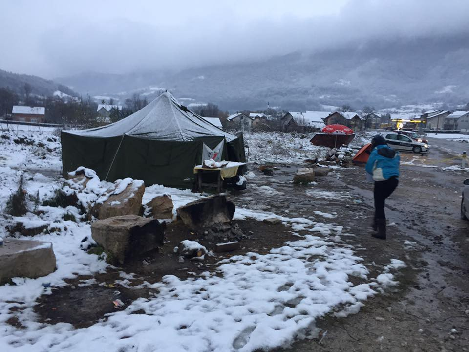

### AYS SPECIAL: From the heart to those who walk the path of hope and pain

> من القلب إلى من يسير على درب الأمل والألم 

Ali Ahmad, is Syrian who left his home in Al\-Salamiyah in December 2015\. His journey took him through Turkey, Greece \(8 months\), where he was in Idomeni, later in Softex camp near Thessaloniki, and then about three months on the Balkan route — Macedonia and Serbia, and continued to Hungary, Austria and finally he arrived in Berlin, where he lives today

علي أحمد، سوري غادر سوريا في كانون الأول ٢٠١٥، ولد في مدينة السلمية، طريقه مر عبر تركيا، اليونان \(ثمانية أشهر\) حيث كان في إيدوميني ومن ثم مخيم سوفتكس بالقرب مدينة سالونيك، وثم لاحقا كان على طريق البلقان\. حيث عبر دول مقدونيا ثم صربيا وهنغاريا والنمسا وأخيرا وصل إلى برلين، حيث يعيش الآن\.

Balkan route 2018, Ključ, Bosnia and Herzegovina

_To all who walk along the road of exile, all who live in exile in their countries, all who have left seeking a homeland, for a homeland is a dream which we believe in, and peace is a goal which we aim towards, and dignity is a right which we want to recover\._

إلى كلِّ من يسير على طرقات المنفى، كلِّ من يعيش منفيّا في وطنه، كلِّ من جافاه هذا العالم وأُخرج كي يبحث عن وطن، إنّ الوطن هو الحلم الّذي نؤمن به، والسّلام هو الهدف الّذي نسعى إليه، والكرامة هي حقّنا الّذي نريد أن نسترده\.

_I sit here between the walls of Berlin, waiting for the onset of the winter snow, and my heart is with those who are fearing the wind of the north from behind the walls of a tent; all my hope is that they arrive safely, to a place from where there is no departure, where there is a beginning, where they can grasp the rays of light that belong to the future\._

أجلس هنا بين جدران برلين، منتظرا قدوم ثلوج الشتاء، وقلبي مع كلِّ من يتّقي ريح الشَّمال خلف جدران خيمة، وكلّي أملٌ أن يصلو بسلام، إلى حيث لا رحيل، إلى حيث تكون البداية، إلى حيث يمسكون أشعة نُورِ المستقبل\.

_To all those who walk along paths of exile, paths cut across by borders, barbed wire and check points, paths guarded by dogs and soldiers, under the gaze of hateful eyes: do not let yourselves be discouraged by fear and do not allow despair to find a way into your hearts\. Use patience and hope, and build towards your dreams until you mend the wounds that time has left\._

إلى كلّ من يسير على طرقات المنفى، تلك الطّرقات المقطّعة بالحدود، بالأسلاك الشائكة ونقاط التفتيش، تلك الطّرقات المحروسة بالكلاب وبالجنود، والمترقًّبة بكلّ العيون الحاقدة، لا توهنوا عزائمكم بالخوف، ولا يسلكنّ اليأس إلى قلوبكم سبيلا، استعينوا بالصّبر والأمل، واركنوا إلى الأحلام حتى ترمّموا الجراح الّتي تركها الزّمان\.

_Take your homeland with you wherever you go, and understand that the road may be long or short, but there must inevitably be an end, so make this end the happiness that you desire and enjoy every moment ………\. \.for happiness is nothing more than a smile, …\. \.all the pain and hunger and cold to the past, forgotten, left behind\._

خذوا وطنكم معكم أين ما ذهبتم، واعلموا أن الطّريق طال أو قصر، لا بد سيُفضي إلى نهاية، فاجعلوا هذه النّهاية السعادة التي تتمنّونها، واستمتعوا بكل لحظة حتى تحطّوا الرِّحال، فالسّعادة ليست سوى ابتسامة، تحيل كل الألم والجُّوع والبرد إلى ماضٍ منسيٍّ خلف ظهورنا\.

_More than two years ago from now, one of my friends said to me, in all sorrow, that she was able to return by plane to her country and I had to stay waiting on the edge of the borders, feeling the brunt of the cold and heat, the torment and all the misery of the world in a tent, being determined in that tent, dreaming in that tent\. She returned to Germany and I stayed in Greece, because she said to me, do not think where you will be tomorrow, rather where you will be ten years from now\._

قبل أكثر من سنتين من الآن، قالت لي إحدى الصّديقات وكلّها أسى، إذا كانت ستعود بالطّائرة إلى بلدها، وكنت سأبقى منتظراً قرب الحدود، متّقياً البرد والحر والقهر وكلّ بؤس العالم بخيمةٍ وعزيمة، بخيمةٍ وأحلام، عادت إلى ألمانيا وبقيت في اليونان، لكنّها قالت لي لا تفكر أين ستصبِح في الغد، فكّر أين ستصبح بعد عشر سنوات\.

_I want to build the future with hope and dreams, I want to be ready for responsibility and for work, I shall refuse to give up, I shall stand shoulder to shoulder with you, work to hold up your high standards and nurture love in your hearts\._

_I am standing in solidarity with you with all my love and hope, your companion until the end\._

رجائي أن تبنوا المستقبل بالأماني والأزهار، رجائي أن تستعدوا للجد والعمل، رجائي أن تنبذوا الاستسلام، رجائي أن تصونوا بعضكم، وتحافظوا على همّتكم عالية، وتنمّوا المحبّة في قلوبكم\.

متضامنا معكم بكل محبتي وأملي، رافقتكم السلامة حتى تصلوا\.

**_Kindest regards, Ali Ahmad, Syrian refugee_**

**_مع خالص محبتي، علي أحمد “لاجئ سوري_**

**\(The story was written in Arabic and translated by Becka Wolf, an independent volunteer\)**

**We strive to echo correct news from the ground through collaboration and fairness\.**

**Every effort has been made to credit organizations and individuals with regard to the supply of information, video, and photo material \(in cases where the source wanted to be accredited\) \. Please notify us regarding corrections\.**

**If there’s anything you want to share or comment, contact us through Facebook or write to: areyousyrious@gmail\.com**

_Converted [Medium Post](https://medium.com/are-you-syrious/ays-special-from-the-heart-to-those-who-walk-the-path-of-hope-and-pain-25ebcac7ff41) by [ZMediumToMarkdown](https://github.com/ZhgChgLi/ZMediumToMarkdown)._
