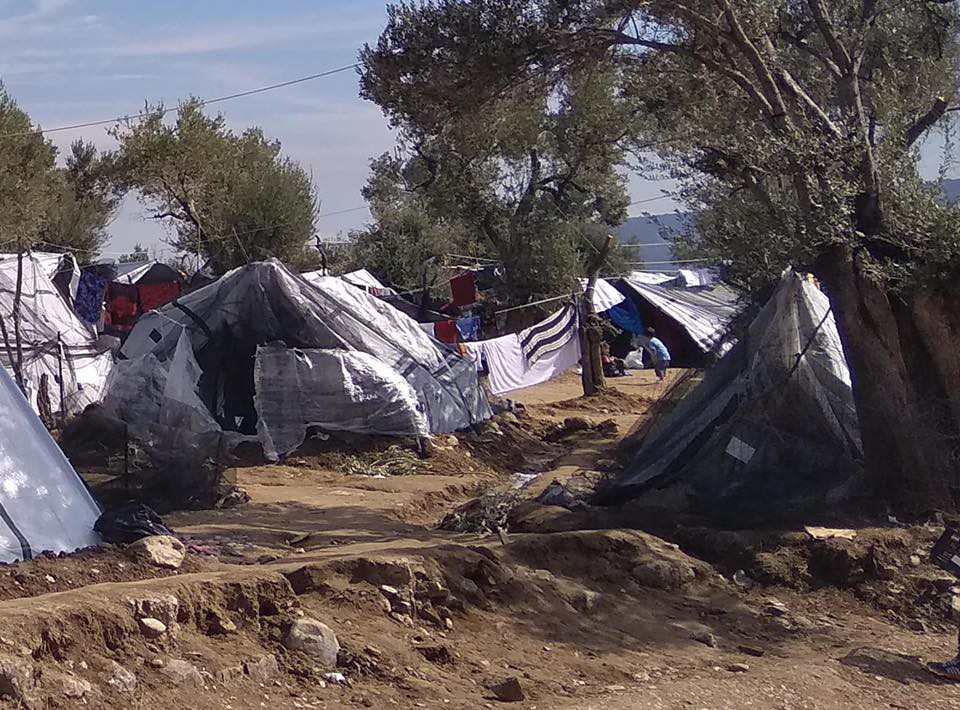

### AYS Daily Digest 29/11/18: Every day proaction needs are great…

_FEATURE: …but what can we do? // Little change for any good in Greece // Fishermen remain stalwart in refusing to return people to Libya // Austria using linguistic discrimination to justify cutting benefits to immigrants // Volunteers needed in Italy // Funding needed and more police action in France // Disturbing and shady Dublin deportation from Hamburg // And more news…_

### FEATURE
#### …but what can we do?

Burn out, burn out, burn out\! We hear those words all the time\. Many of us sit across dinner tables or are at a beer with friends, feeling a bit awry… “Why do you still care so much,” or “I appreciate you care, but it’s really quite depressing, the news is scary and we can’t really do much about it\.” “It’s all organized by the governments\! We have no power\!”

I think I’m not the only one who has felt a bit on the outside — like I’m the one who is making problems simply by bringing up uncomfortable truths\. And what’s the point anyway? It feels like every new day sees a new hope attacked\.

It can and should be disturbing to see the every day efforts of people to help their fellow man choked out, whether through bureaucratic strangulation, direct pressure, or simply expiration of strength, this is where we must be creative\. There is a creeping feeling where we need to be always on the back foot — in response\. This is the time to be creative, and determined\.

Ordinary fishermen in the Mediterranean saw the distress of humans and have taken twelve on board their own boats\. Despite being ordered by European officials to return them to Libya, they refuse\. There may be very dire consequences for them when this is all over \(read more about who is supporting them later\), but this is the sort of strength and fortitude we need to hold on to\. We too often fixate on stories of heroism from history, knowing the ending\. We do not stop to think that from their perspective — they didn’t know if it would work\. They did not assume their stories would be told or that anyone would know\. And how many of these stories of heroism end in failure\. We cannot presume a happy end\. However, resilience and conviction will keep our eyes open to new opportunities\.

One such case of plucky resilience and creativity, documented in the broader mainstream media, is that of a Dutch Protestant Church\. An Armenian family who has been in The Netherlands for nine years is facing deportation to Armenia, having seen their asylum claim rejected\. The family took shelter in the church, fearing that the political activism of the father in Armenia leaves them vulnerable to death threats\. Fortunately for them, Dutch law prohibits church services from being interrupted by official action, so thus begins the longest church service in the country: five weeks long, so far\. The family is using the bought time to appeal to the Dutch populace to intervene on their behalf\. Over 450 ministers have participated in what the New York Times called the “pious filibuster\.” Read the full story at The [New York Times here](https://www.nytimes.com/2018/11/29/world/europe/bethel-church-netherlands-deportation.html?smid=fb-nytimes&smtyp=cur&fbclid=IwAR0oSNvMX7fCwnOor8W1DXbImQqWxWl_R13us8FspZsj3kbfsOJ79qhwg3U) \.
### GREECE

Calls to make changes to the deplorable conditions in the Greek camps have fallen largely on deaf ears\. Despite continued warnings about how the dangerously inadequate camp facilities, which are overcrowded and being destroyed by the elements, will result in the loss of human life, much less to say about the loss of dignity and stolen humanity of the thousands of people, camps continue to be overcrowded\. This is criminal negligence\. This video is from Moria on Lesvos from earlier:

According to new reports, after a great storm, the situation on Lesvos is even more catastrophic:

■■■■■■■■■■■■■■ 
> **[MSF Sea](https://twitter.com/MSF_Sea) @ Twitter Says:** 

> > After #Lesvos was hit by torrential storms last night, thousands of people, including hundreds of vulnerable children, suffered another sleepless night in #Moria, huddled together in flimsy summer tents. This is no place for any human being #letthemout https://t.co/N8nKJDScCn 

> **Tweeted at [2018-11-29 18:41:32](https://twitter.com/msf_sea/status/1068213386788462595).** 

■■■■■■■■■■■■■■ 

Christian Peacemaker Teams reports horrific conditions on Samos, as 4,000 people are crammed where only 700 should be staying:

■■■■■■■■■■■■■■ 
> **[Community Peacemaker Teams](https://twitter.com/cpt_intl) @ Twitter Says:** 

> > RT @Sol2Refugees Conditions for refugees and migrants on the Greek island of Samos are critical. There are currently 4000 people living in a camp for 700 people - many have set up tents on the surrounding streets
#Greece #Refugeesgr

Photos: InfoMigrants/N.Ahmadi https://t.co/aSbntKHV5y 

> **Tweeted at [2018-11-29 19:43:34](https://twitter.com/cpt_intl/status/1068228999011319814).** 

■■■■■■■■■■■■■■ 

Iris Centre on Chios is looking for volunteers\! The centre supports 1,200 refugees per month and is in need of volunteers to keep going through the holiday season\.

> “If you’re interested in volunteering send us an email at iriscentervolunteers@gmail\.com and I’ll send you more information\. 

> Please let us know:
 

> x Why you want to join the Iris team
 

> x Dates available
 

> x Language spoken
 

> x Whether you have a valid drivers license and if you would rent a car
 

> x Previous volunteer experience
 

> x Please attach either a CV or a short summary of your education and employment history\. 

> Please note that the minimum commitment is 7 days and the trip needs to be self\-funded\. \*By submitting your application information to Iris by email, you are confirming all information is valid\.” 

### BALKAN WEATHER REPORT

Winter is here, temperatures have dropped significantly\.
#### Montenegro

Lightly to moderately cloudy with sunny intervals, towards the end of the day or during the night cloudy in the south and centre, predominately dry\. During the morning in the basins there will be fog, in the north strong frost, in the rest of the continental territory weak to moderate frost\. The wind will be weak to moderate from changeable directions, before noon in the far southwest an amplified northeastern wind\. The lowest temperature will be from \-14 to 5 and highest daily from 0 to 14 degrees\.
#### Serbia

Very cold in the morning whit moderate and at places strong frost, in the basins and highlands short periods of fog\. During the day it will be predominantly clear in most parts of the country\. The wind will be weak to moderate, locally strong from time to time, blowing from the southwest\.The lowest temperatures will be from \-10 to \-6 and the highest daily from \-3 to 0 degrees\.
#### BiH

In the morning, cloudy in most parts of the country and predominantly sunny in the rest\. As the day progresses a gradual increase in cloudiness is expected form the west\. The wind will be weak form changeable directions\. The lowest temperatures will be from — 8 to \-2, in the mountains till \-12 degrees, and the highest daily from \-2 to 11 degrees\.
#### Croatia

Partly sunny and cold, with a gradual increase in cloudiness\. Some rain could fall in the south part of the coast\. Some light snow might fall in Lika during the morning and in the rest of the interior there will be fog\. The wind will be mostly weak, blowing from the southeast\. Along the coast a moderate Bura, locally strong in the morning, and during the day an eastern and southern wind\. The lowest temperature will be from — 9 to 6 and the highest daily from \-2 to 13 degrees\.
### SERBIA

Info Park notes there were seven new arrivals that they observed in Belgrade, with around 193 people visible in the area of Belgrade where they work\. Additionally, 35 people were returned from Hungary, with an overwhelming majority of them \(28\) having been intercepted and returned from inside Hungarian territory\.
### BOSNIA

Police in the Bihac area continue with the unlawful practice of pushbacks, stopping people on the streets of Bihac and sending them by force to the Kljuc area, towards Sarajevo\. A group of people were stuck on the street for eight days and local people helped them to get to Sarajevo, but new groups of people are being stopped and left by the roadside, often kicked off buses\. Help is coming mostly from locals and some volunteers\. People sleep by the roadside, on the ground, and it is very cold in Bosnia \( \-10\) \.

Photo: Red Cross Kljuc
### SEA

Today Proactiva Open Arms sailed to assist the _Nuestra Madre Loreto_ , a fishing vessel that has taken on 12 people and refused to return them to Libya, thereby being blocked from landing in Europe\. There are many cases of exhaustion and POA declared they will sail alongside the Nuestra Madre Loreto in the event they require emergency medical evacuation\.

Photo Credit: Proactiva Open Arms

POA also notes that UNHCR, the Italian Senate, and other official entities have openly stated that Libya is not a safe place to return people\. Therefore holding fishermen hostage for standing up for human rights is another example of disgusting hypocrisy\. Hundreds were rescued from the Alboran Sea by the Spanish Coast Guard, why attack the goodwill of ordinary civilians?

For more, watch this video by Sea\-Watch here\!

■■■■■■■■■■■■■■ 
> **[Sea-Watch International](https://twitter.com/seawatch_intl) @ Twitter Says:** 

> > 12 people blocked for days on the #NuestraMadreLoreto, brave fishermen who refuse to take them back to #Libya. Spanish government is silent, European Union is sitting and watching. Our hope is in the strength of common citizens who decide to resist. #united4med via @[openarms_fund](https://twitter.com/openarms_fund) https://t.co/ndKtUghDy3 

> **Tweeted at [2018-11-29 16:24:09](https://twitter.com/seawatch_intl/status/1068178814302384133).** 

■■■■■■■■■■■■■■ 

A total of 103 people were “rescued” by the Moroccan Navy and presumably returned to Morocco\. These people will most likely share the same sad fate of those before\. According to [Association Marocaine des Droits Humains — Section Nador](https://www.facebook.com/AmdhNador/?__tn__=%2CdkCH-R-R&eid=ARDZd-uuJrAeSZ6d2rEdh8Cmzvvu7aEsCfsz4tWxsN6XoAPDTHNdFylzqMIRRvJKValyWXDslpq8F780&hc_ref=ARSHlfiARCOKtbSky63N4Yqu2BrNtTtNQEwAuE95ynXUNcH7pMCepYR9HlHy7VzVsQA&fref=nf&hc_location=group) , nearly 300 people were arrested from refugee houses and taken to a detention centre, facing return to unsafe circumstances\. Another 60 were arrested from another location and taken to be processed for return\.
### ITALY
#### Kesha Niya looking for volunteers

Kesha Niya is in need of volunteers in Ventimiglia for December and January\!

> “We are settling into our new places as we continue working every day, distributing hot meals, blankets, clothes, etc\. to people in need in Ventimiglia\. We might be a little short on volunteers in the upcoming winter months, between December and January\. 

> What we are looking for: motivated people to work with us, cooking, building, cleaning, etc\. 

> It is a PLUS if you can drive, a bigger plus if you can drive larger vehicles, and A HUGE BONUS if you come with your own vehicle\. 

> The primary language is English but it is a help if you speak French, Italian, Arabic, Urdu, Pashto, Kurdish, etc\. 

> If you have experience with construction, or if \(in a perfect world\) you can bring your own power drill we will be very happy, but maybe this is wishful thinking\. ;\) 

> Something to keep in mind: we are living and working high in the mountains and it is COLD — there is already frost\. We have blankets and things to accommodate you, but it is better if you have good shoes and warm clothes\.” 

Contact them [here](https://www.facebook.com/KeshaNiyaProject/posts/787992461545623) \.

Additionally, around 70 more people will arrive in Rome from Lebanon via the Humanitarian Corridor — a safe legal form of passage for refugees\. Since February 2016, a total of 2,200 people have come to Europe this way\.
### SWITZERLAND

■■■■■■■■■■■■■■ 
> **[Meron Estefanos](https://twitter.com/meronina) @ Twitter Says:** 

> > Switzerland: Child dies of wounds by fire that killed 6 more [strib.mn/2KGU6AS](http://strib.mn/2KGU6AS) #Eritrea #Ethiopia 

> **Tweeted at [2018-11-29 14:05:04](https://twitter.com/meronina/status/1068143811082289152).** 

■■■■■■■■■■■■■■ 

### AUSTRIA

Austria will be cutting welfare support for immigrants it deems “unwilling” to work in Austria or whose German or English skills are not considered up to par\. Benefits will be cut by nearly one third \(down from 863 Euro to 563 Euro per month\) for these cases\. Anti\-poverty activists state that this will do little besides push the poor into more humiliating circumstances, punishing them for their lack of ability to access education\. The inclusion of these language requirements is an attempt to dodge accusations that this legislation is targeting strictly refugees and asylum\-seekers, but the parties behind the legislation have openly stated that immigrants should not enjoy the same benefits as Austrians\. \( [Source](http://www.digitaljournal.com/news/world/austria-agrees-benefit-cuts-aimed-at-foreigners/article/537844?fbclid=IwAR262h0LgT9bLqUukTapjyDd9si8vuf-F5SNnG-aB2-7W_WuQdHniSNqN9w#ixzz5YFnTu36v) \)
### FRANCE

Solidarity Migrants, Wilson has released a new video documenting a police “evacuation” of the people squatting on Avenue Wilson\.

#### Call for donations

Additionally, Refugee Community Kitchen in Calais is in need of donations and particularly money to spend on RICE\!

They only have the funding to continue their activities for three more weeks, so [help them out](https://mydonate.bt.com/donation/v4/chooseAmount.html?charity=147727&currentMonth=10) \!
### GERMANY

On November 22, a Dublin deportation to Rome from Hamburg was carried out\. The deportation was harrowing and does not appear to be in accordance with procedure\. If the authorities are so concerned about the following of procedure by civilians, why is the same meticulous regard not given to deportations?

> “On the morning of 22 November, after reports from refugees, it came to Italy, probably organized by the federal police, with great brutality, of some 30–40 people to Italy: when they were picked up, officials were violent\. The persons concerned had been moved to Hamburg to the airport where a plane without marking was already ready\. Many of the refugees were tied to hands and feet\. A 20\-year\-old woman from Liberia cried and screamed, so a security guard threw her over his shoulder and carried her onto the plane\. Those who fought back were taken from two to three security\. The guards would have represented themselves as cops, but were not wearing uniforms, but only a vest with the inscription ‘escort\.’ ” 

For the original post, go [here](https://www.facebook.com/Fluechtlingsrat.Niedersachsen/photos/a.229267433832757/2006709566088526/?type=3&theater) \.
### BELGIUM

There will be a protest in December demanding justice for Mawda, the girl who was shot last year by the Belgian police as they attempted to intercept a smuggling van in which she was riding\. Please click the link below for more information\!

Debating Europe is releasing a helpful series [debunking myths](https://www.debatingeurope.eu/2018/11/29/do-refugees-want-to-integrate/?fbclid=IwAR23aMcjGiur06KHfjUXL5kH1_P4Uwrf_j_3qsCRoNYYNd4C2YseL-uwckM#.XAEBCX4o_PD) about refugees and migrants — this episode is in Belgium\. In addition to an at\-a\-glance infographic, the episode includes valuable statistics and replies from experts highlighting that the vast majority of those who have received asylum or subsidiary protection have a high motivation to integrate, although they face complicated barriers\. Perhaps the reason why some people do not wish to integrate is they do not feel confident about their place in their new home\.

**We strive to echo correct news from the ground through collaboration and fairness\.**

**Every effort has been made to credit organizations and individuals with regard to the supply of information, video, and photo material \(in cases where the source wanted to be accredited\) \. Please notify us regarding corrections\.**

**If there’s anything you want to share or comment, contact us through Facebook or write to: [areyousyrious@gmail\.com](mailto:areyousyrious@gmail.com)**

_Converted [Medium Post](https://medium.com/are-you-syrious/ays-daily-digest-29-11-18-every-day-proaction-needs-are-great-2b3272400c23) by [ZMediumToMarkdown](https://github.com/ZhgChgLi/ZMediumToMarkdown)._
