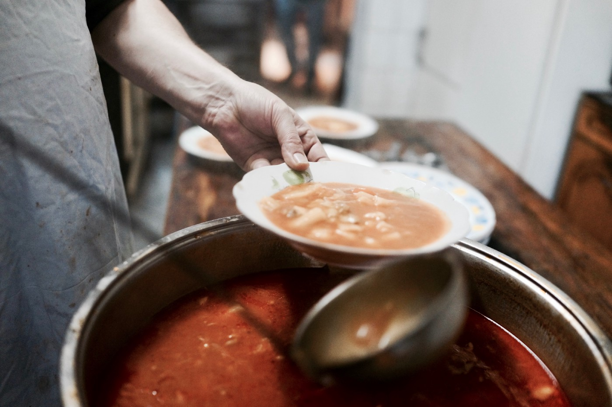
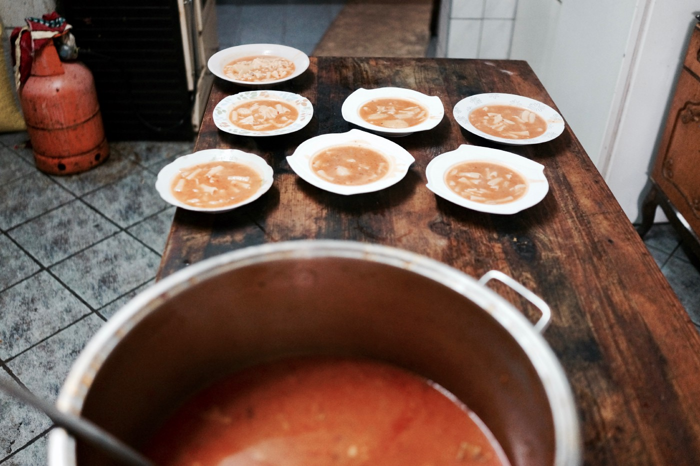
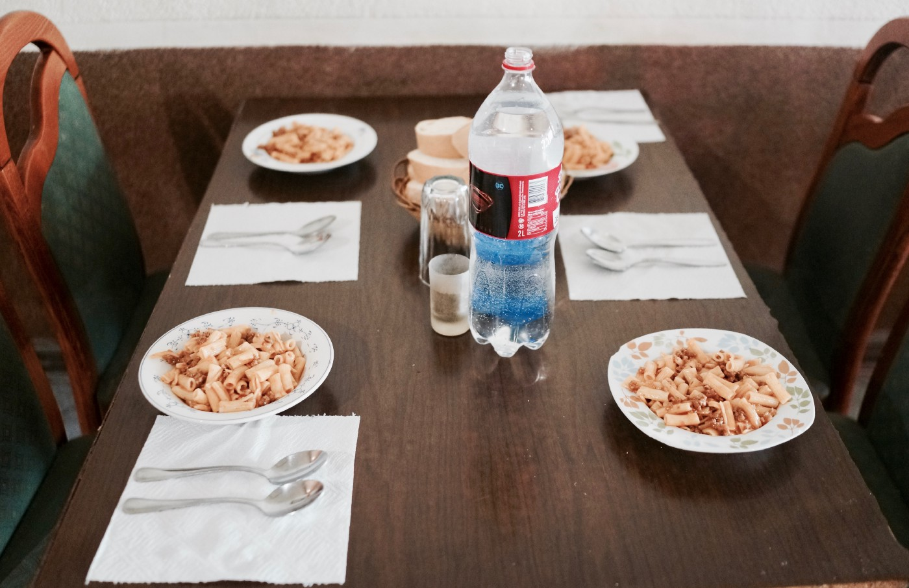
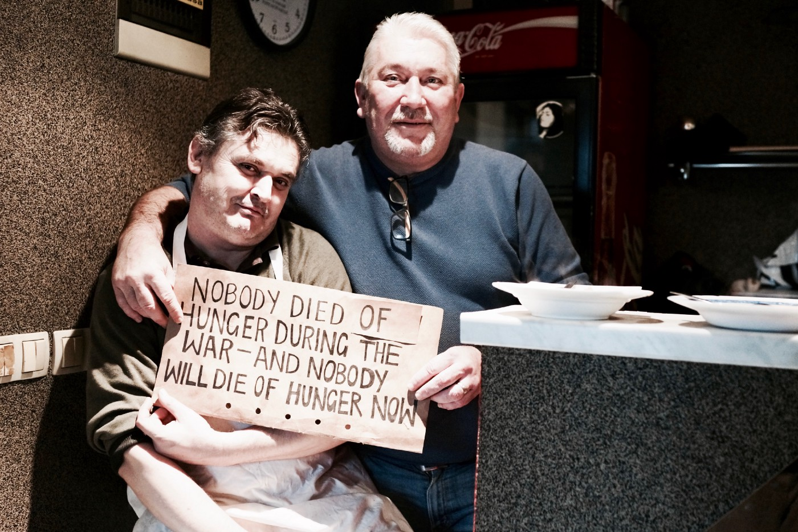

### AYS SPECIAL: Locals of Velika Kladuša Put International Organisations To Shame

](assets/55be90734ab9/1*RrmE1D7Gakjgw4V57DTyBQ.jpeg)

Asim Latić Latan, the owner of the former pizzeria turned community kitchen\. All photos by Nevia Elezovic from [No Borders Photography](https://www.facebook.com/NoBordersPh/)

At6am, before the break of dawn, in what once used to be a pizzeria, a group of war veterans begin their working day providing warm meals for refugees stranded in their hometown\.

In this small town at the border of Bosnia and Croatia, where human rights violations persist, and dignity is withheld from hundreds of people searching for a better life, locals are at the forefront of humanitarian initiatives\. Earning themselves infinitely more respect among refugees than any of the international organisations working in the locality\.

_‘We started the project in February,’_ Asim Latić Latan, the owner of the restaurant, tells me as he recalls the time when people on the move started arriving to this small town\.

According to available data, over 22\.000 people entered Bosnia and Herzegovina since February of this year, most of them coming in an attempt to reach the EU\. Velika Kladuša and Bihać, two small cities close to the border, have received the most of these new arrivals\. At the moment, it is estimated, that there could be up to 4\.000 people residing in these areas\.

So far, help was mostly — and most efficiently provided by the local residents themselves, with the help of small groups of international volunteers\. Locals in particular, who at the beginning of the 90s survived one of the bloodiest wars since WW2, are tireless in showing their support and humanity\.

_‘The weather was the same as it is now; cold with snow and rain,’_ Latan continues, ‘ _I saw a man waiting outside with his clothes wet\. I walked over to him and spoke two words, not even a full sentence\. “Du manjare?” I asked him\. He looked at me and said, “yes manjare, no money”\.’_

At this point Latan explains to me how he led the young wet man into his restaurant, which at the time was a functioning pizzeria, and asked the chef to prepare something for him to eat\. The man pulled out his telephone and called his friend to join him\.

_‘Once they were finished eating I told them, tomorrow at the same time, you come again\. Later that day, I went to the mosque where I met another two guys\. I told them to come too\. The following day, some more people came and the next day even more\. And that’s how we started\.’_

For a month and a half, Latan operated the pizzeria turned community kitchen on his own\. With only the help of his friends and neighbours, it’s doors were opened to all refugees in Velika Kladuša\.

_‘I owed money for electricity, water, food, everything\. At the beginning, neighbours helped me out, they would bring food and give me any money they could spare\. In Bosnia we say your neighbour is more important to you than your brother\. We call our neighbours when we need something here, not our family\.’_

In the restaurant all meals are served warm, on fine china plates and with metal cutlery, salt, pepper, water and napkins on the tables\. Latan serves his new patrons the same way he would serve any patron that comes in, only they are allowed to eat for free\.

How food is served and tables are prepared every morning, awaiting patrons \.

By 10\.30 am every morning, the food which is cooked by Lejla is ready, and by 11\.00 am, the restaurant’s doors are open\. People flood inside in groups\. Although only five people officially work in the restaurant, friends from the town come in to lend a hand, or just sit inside and drink a coffee\. The restaurant oozes an overwhelming sense of community, its’ doors don’t discriminate\.

Refik serves up the plates in the kitchen, Kum brings the plates over to the bar, Hako sits behind the bar and keeps count of how many people enter, and from the bar Latan serves the meals to his loyal patrons\. A young man from Pakistan and two from India help the small team with whatever is needed, while two young men from Tunisia take control of washing the dishes with the help of volunteers\.

I ask Ali why he chooses to work here, and he tells me, ‘ _I do this because it gives me routine and purpose to my day\. Without work my thoughts wander too far\. It’s better for me to keep busy\. I feel good here\._ ’

It continues like this for two and a half hours\. The local team and their helpers diligently working to serve those who come for food\. Despite the fast pace of the operation, it runs smoothly and the atmosphere remains exceptionally calm throughout\. It’s kept this way by the warm\-spirited and playful nature of team, who joke around with all who enter and refer to everyone by the Bosnian term ‘kolega,’ which means colleague\. They do this as a sign of respect, to show their patrons that they consider them as equals despite their current circumstances\. A nuance small, but too often missed by aid workers\.

Refik \(left\) and Hako \(right\) jokingly posing for a photo

_‘We have to joke around with them to keep their morals up’_ — Hako, who each day brings with him from home, either a jacket or a pair of shoes to give away to someone who needs it, tells me\.

I asked one of the young men eating at the restaurant how he likes the food\. _‘The food is very good, but food is food’_ — he tells me\. _I’ll eat anything if I am hungry, but the difference here is that I feel like I am a human when I eat\.’_

Unlike in the restaurant, in the temporary ‘accomodation’ in Velika Kladuša known as Camp Miral, run by the IOM, people are forced to wait in line for anywhere between one and three hours to receive food\. In addition to the dehumanisation that comes with waiting in long lines each day for food, which sometimes consists only of bread and a can of sardines, the INGO forces residents to sign off their names, to indicate that they have received their meal\.

_‘IOM, Red Cross, UNHCR, they are all making money with us’_ a young guy from Afghanistan complains\. ‘ _Yesterday they wouldn’t let me enter the camp until I signed my name\. I told them I didn’t take your food, I don’t need it, why should I sign my name?’_

In the beginning, IOM, who has until now received 8 million € of funding from the European Commission to use in Bosnia, agreed to cover some of Latan’s expenses to run the restaurant\. However, this lasted only for three months, before they pulled away funding with only a days’ warning\. During the time that they funded the project, Latan too was forced to ask people to sign their names to indicate whether they received food\. ‘ _I didn’t like this’_ Latan told me _‘I would tell them, write whatever you want; Napoleon, Ronaldo, Putin\. You should have seen the lists we gave to IOM,’_ he laughed ‘ _Nobody used their real names and we don’t make them do this anymore\.’_

Latan, like many refugees I spoke with, was totally disillusioned by IOM’s efforts in Velika Kladuša\. _‘IOM really surprised me\.’_ he explained\. ‘ _but they don’t understand that in Bosnia we have already been through this\. I know what it’s like to be hungry\. To go five days without trying even a bite of food\. And especially in Velika Kladuša, it was really one of the hardest hit places during the war\. We were fighting brother against brother\. You can’t understand what that means\. We all carry injuries from the war, each one of us working here is missing an arm, a leg, a family member\. Providing food is nothing for us\. IOM don’t understand\.’_

But it’s not just IOM that failed to provide consistent financial support to this sustainable and effective, locally run project\. ‘ _UNHCR also came in the first months to take down details of what we need and how much money we spend_ ,’ Latan tells me ‘ _And you If you believe me, I have not heard a word from them since\.’_

I ask him whether he would like their financial support\. ‘ _No way, not anymore_ ’ he told me ‘ _We don’t need them\. We didn’t let people die of hunger during the war, and we won’t let people die of hunger now\. I just wish them luck trying to find employees from European countries that will be happy to do my job for 250 euros a month\.’_

Latan’s restaurant is now financed by [Lemon Foundation](https://www.facebook.com/lemonfoundation/) , a small NGO from the Netherlands and is supported locally by volunteers from [SOS Team Kladuša](https://www.facebook.com/SOSTeamKladusa/) \. _‘If we had the money we would serve two meals a day\!_ ’ Latan tells me\.

By 2\.00 pm the chairs and tables are packed up, and the kitchen is cleaned\. On one of the days I was there, a man came after service hours, only to be regretfully turned away by a volunteer who explained that there was no food left\. Latan heard the what had happened and ran outside after the man ‘ _kolega_ \!’ he yelled\. _‘dođi ovamo\!_ ’ which in Bosnian means ‘Colleague\! Come here\!’ They walked back into the restaurant together\. Latan then proceeded into the kitchen and served the man a plate of food that was meant for himself\.

It seems that no matter how cold and miserable the weather is outside, inside this small former pizzeria, the mood is somehow, despite all the odds, kept warm and jubilant\. Inside the restaurant’s doors you hear laughter along with the sound of metal cutlery clattering on the fine china plates\. It functions not only as a restaurant, but also as a moments escape from the harsh and bitter reality of what it means to be living on the doorstep of the European Union during winter\.

**_\(Manja Petrovska, AYS Info Team volunteer\)_**

**We strive to echo correct news from the ground through collaboration and fairness\.**

**Every effort has been made to credit organizations and individuals with regard to the supply of information, video, and photo material \(in cases where the source wanted to be accredited\) \. Please notify us regarding corrections\.**

**If there’s anything you want to share or comment, contact us through Facebook or write to: areyousyrious@gmail\.com**

_Converted [Medium Post](https://medium.com/are-you-syrious/ays-special-locals-of-velika-kladu%C5%A1a-put-international-organisations-to-shame-55be90734ab9) by [ZMediumToMarkdown](https://github.com/ZhgChgLi/ZMediumToMarkdown)._
