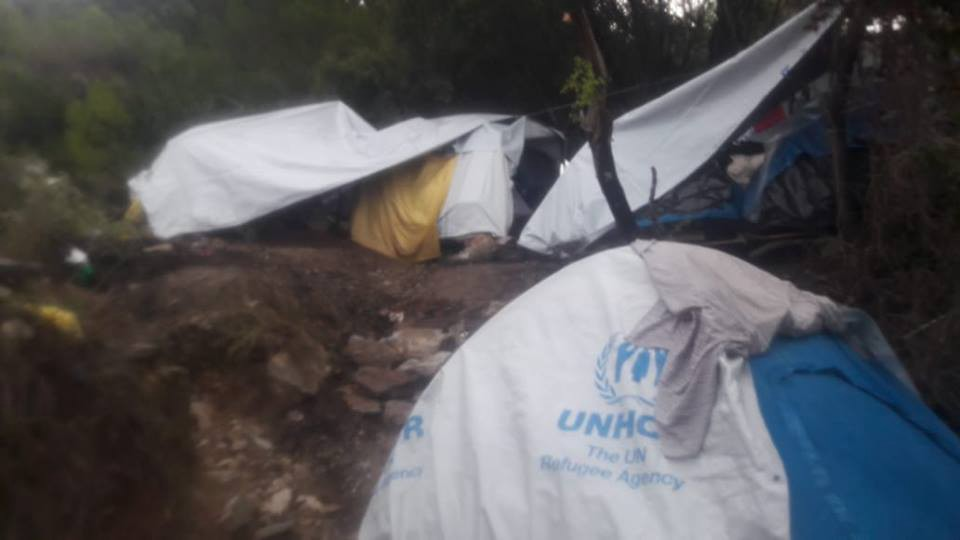
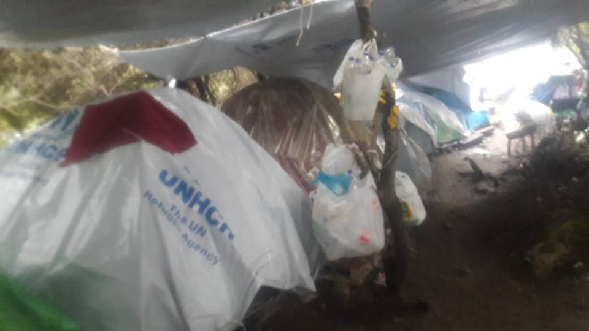
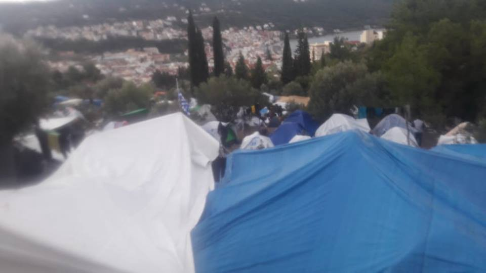
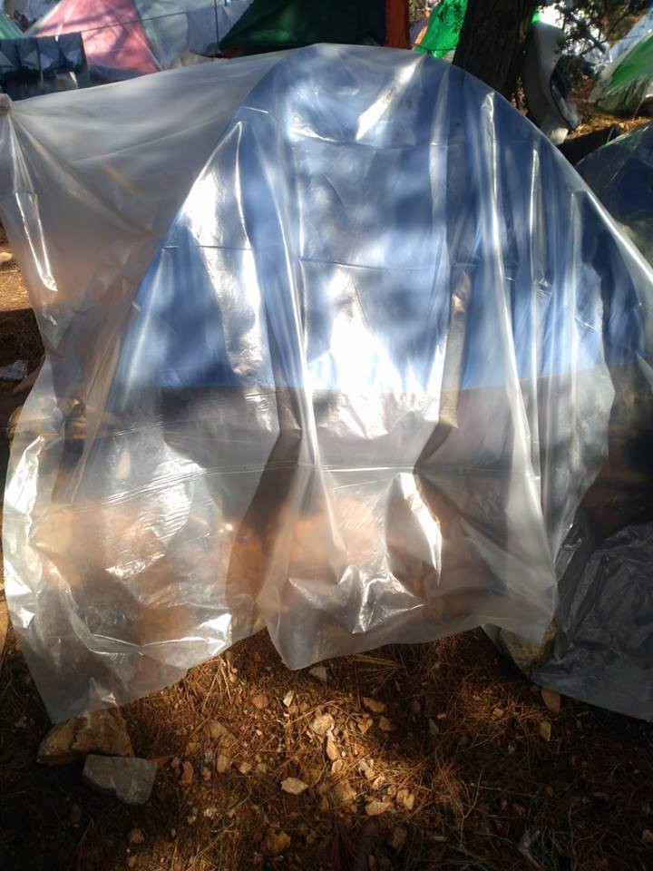
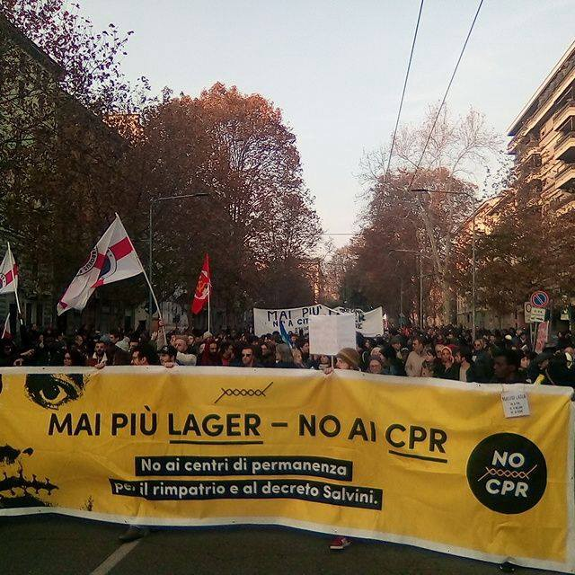
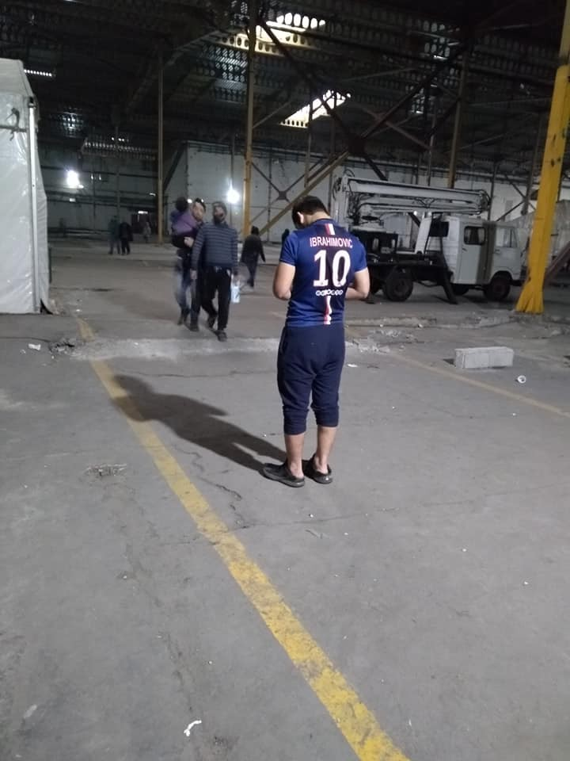
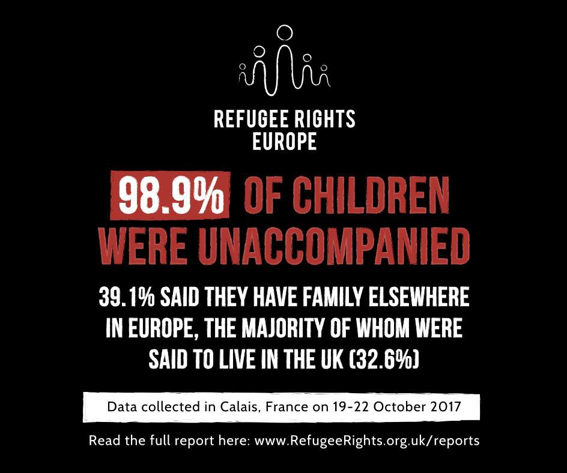
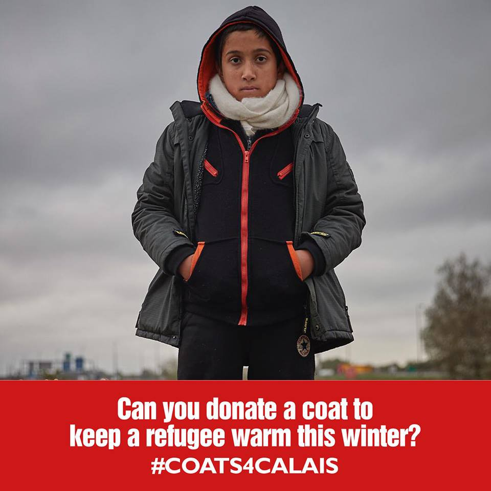
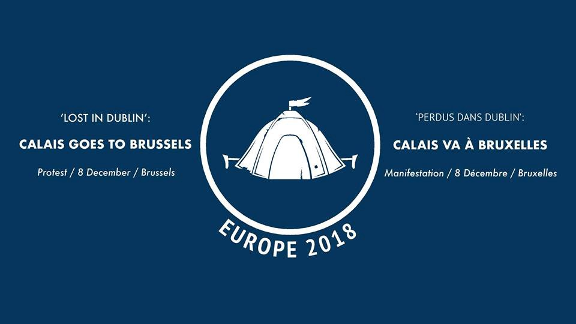

### AYS Weekend Digest 1–2/12/2018 — More Talk but No Action over Situation in Greece’s Hotspots

The odyssey of the Nuestra Madre de Loreto finally ends /// Young man dies in the San Ferdinando ghetto, Italy /// UK recognise fewer LGBT refugees /// New details on provisions for asylum seekers in Denmark /// Updates from inside Bosnian camps /// Guinean man deported from Paris /// Reports of increased police harassment in Calais /// More civilian casualties in Northern Syria

 / [Art Against](https://www.facebook.com/artagainstproject/) \)](assets/66d08b1333a/1*ieZ6qLMKaBkYj9nYk-FOgg.jpeg)

Lesvos, Greece 29 November 2018
After heavy rains in the Olive Grove camp next to Moria camp in Lesvos island\. 
\(Photograph by [Anna Pantelia](http://annapantelia.com/) / [Art Against](https://www.facebook.com/artagainstproject/) \)
#### FEATURE — MORE TALK BUT NO ACTION OVER SITUATION IN GREECE’S HOTSPOTS

Samos, last weekend

The Greek government could face sanctions if conditions in hotspots do not improve by September 2019 [says local media](http://www.ekathimerini.com/235274/article/ekathimerini/news/refugee-situation-in-samos-worse-than-moria-says-top-eu-official?fbclid=IwAR2eHN7-IsPcVQw5zTR1-qZ-VhYtZJvc6XqymNxJl8VRRvsBi8WVMD6R2p8) \. Vivi Michou, Director\-General of the European Commission’s Migration and Home Affairs department, also stated that she believes the situation on Samos to be even worse than that of Moria, in Lesvos\. This is not the first time they have been asked to improve conditions\. In October this year, the North Aegean regional government [issued a statement](https://refugeeobservatory.aegean.gr/en/nowhere-go-refugees-fear-closure-greek-camp-has-river-sewage-and-12-hour-waits-meals) calling upon the Greek Ministry of Migration Policy to either address the numerous health and safety issues they found in Moria, or close down the camp\. They gave a 30\-day ultimatum, yet months have passed\.

■■■■■■■■■■■■■■ 
> **[NoBorders](https://twitter.com/Refugees_Gr) @ Twitter Says:** 

> > Στρατόπεδο προσφύγων, Μόρια, Λέσβος, Ευρώπη, Δεκέμβρης 2018 

#refugeesgr  
Φωτογραφίες: 
@[rspaegean](https://twitter.com/rspaegean) / @msf_sea https://t.co/5x2pLZj0Wx 

> **Tweeted at [2018-12-01 09:31:40](https://twitter.com/refugees_gr/status/1068799783555514369).** 

■■■■■■■■■■■■■■ 

Let’s be clear, both camps are unlivable\. The changes that are needed are very basic and involve calling a team of plumbers, some builders, some doctors, fixing the bathrooms, improving access to water in general, at the very least putting tents on platforms, purchasing some adequate heating with that 1\.6 billion Euro funding we hear so much about, building a kitchen to let people cook in safety, making sure people have blankets, clothes, sanitary products etc\. It is so frustrating to watch authorities and INGOs with so much money fail to do what volunteers have managed to do with virtually nothing\.

We know these things are possible because they have been done in self organised camps and housing spaces, in solidarity with the people that live there, in a matter of days, time and time again, for the last three years\.

A volunteer in Samos describes the current conditions and asks for help\.

Samos, last weekend

> What makes the situation especially bad here is that there are only 4 NGOs active on the island\. By contrast, Moria on Lesbos has 46 NGOs present\. Largely because of issues with camp authorities, there is \*no one\* distributing essential NFIs like tents or tarpaulins, so the situation is getting really dangerous\. 

> \[…\] do you know of anyone who might be able to come to Samos to help address this? We have a community centre, informal school, and small warehouse, so neither we nor anyone currently here can begin to address the needs\. We wouldn’t be able to take the job on, but we would be able to help with getting them set up here\. 

You can contact them on the [Samos Volunteers](https://www.google.com/url?sa=t&rct=j&q=&esrc=s&source=web&cd=1&cad=rja&uact=8&ved=2ahUKEwjJ_oP2kYPfAhUH3iwKHfRcDRoQFjAAegQIBBAC&url=https%3A%2F%2Fsamosvolunteers.org%2F&usg=AOvVaw0Wx9XFOqtSTeixY09m89mj) page or through AYS\.

Another independent volunteer puts the current number of residents at around 6000 people and describes in more detail what they are being forced to survive\.

> Last time it rained, the whole wild camp area was slippery mud, with streams going through the tents and people trying to dig drains with anything they could use as a tool\. The ground is not stable, an African man I know put his tent near a gap \( he actually put it where he could find some room…\), during the night, under a very heavy rain, the mud flood pushed his tent\-palettes house and flipped it over the gap\. He just had the time to grab a branch of a tree nearby and people came to help him\. The situation gets more and more dangerous every day, because of the cold, because the residents of the camp are not given anything to protect themselves against it, and because of the insecure ground where they try to shelter\. I don’t know about the inside of the camp itself for I am not allowed to go there myself, but three isolated foreign minors I met decided to leave the minors container they had been given for a tent because it was too bad; crowded container, very dirty, mattress on the floor, used waters water pipe broke and flooded the mattresses, and it remained like that until they left\. Another isolated minor has been told to find a place in the wild camp by himself because there wasn’t any place left in the minors section\. I met him in the wild camp, with adults, no tent, no sleeping bag, …\. \. 

Samos, last weekend

> I want media to bring attention on this situation, not only because it is terrible and inhuman but also because it is getting very dangerous\. We are at the entry of the winter, if nothing changes, people will die in the following weeks\. At some point we were giving a bag of clothes and dry things to a sick man staying in the wild camp\. It was 11h15 pm, he was the last one on our list\. So we drove up on the camp road to get closer to him because he was so weak\. We stopped on the road, close to the wild camp but still far from the entry of the official camp, and on a public road\. Bad luck, it was the end of the manager shift, she saw us on the road, stopped , asked for ID, asked if we were journalists and left\. Less than 5min later there was the police of the camp\. They said they had been told to control us\. We’ve been brought to the security area of the camp, they went through our bags and all, then we’ve been brought to the town police station, where they went through all the car\. All with the man from the camp we wanted to help\. They asked lot of questions\. They kept saying we were not allowed to go in the camp, we kept saying we were not going in the camp\. They finally released us with no consequences, at 2h30 am\! or an example, a palette has a caution, it is usually around 5euros\. I think people buy them to shops when they have a bit of money, and inside the camp, they sell it for 20 euros\! \! \! \! 

[Salam Aldeen](https://www.facebook.com/photo.php?fbid=1240335726124921&set=p.1240335726124921&type=3&hc_location=ufi) , who has also had to deal with the authorities [attempting to criminalize his work](https://www.dw.com/en/salam-aldeen-cleared-of-people-smuggling/av-43693454) with Team Humanity, published a statement asking for continued support\.

> People ask me all the time why I continue helping refugees, that I done enough, why I don’t go back to my safe life in Denmark\. 

> \[…\] 

> How can I as a human go and live my normal life and forget all what is happening in this world, I can’t because this is my happiness, this is what makes me live and if I have to struggle day and night just so we can make some smile on people who lost everything in their lives then it’s all worth it\. We should never forget that one day it can be us running and we will wish that someone came to help us\. 

> I see this world is crying for help, and we should not forget that we are humans no matter religion or colour of our skin\. 

You can support Team Humanity [here](https://l.facebook.com/l.php?u=https%3A%2F%2Fgogetfunding.com%2Fwarm-and-safe-place-for-refugee-children-moria-lesvos-greece%2F%3Ffbclid%3DIwAR0RsRY7mqzfysrbE0tqLtrs_xzn1KUNnIKFZKK-Hh5ZWeYYJ5nsBjyoBek&h=AT3cwLmPSc1BncBs6vYoKBINvQIpPQ7L_MmLD3pPsJR6rwPiTpSqZ_L2nDUJi-cWxKjMDNntQUWTE8DxrPbrcx7QvF62W-NMCX-gMs3pckxsYDaaGRbk2I6PgyW79UI1sgvbyDgg3xH13X1-7VYOl3Bhvk_aDQ) \.

SYRIA
#### More civilian casualities in Deir al\-Zour

[Reports from the ground](http://nedaa-sy.com/en/news/10065?fbclid=IwAR1Cq47ALmEsjRS-rQpjbbChfPMEABAcV0oMT0a_SOMEt0IqHmUwLEPtVro) state that the United States\-led International Coalition against the “Islamic State” organisation has targeted a women’s hospital in the eastern countryside of Deir al\-Zour, which has claimed the lives of more than 30 civilians, mostly women and children\. Other targets have included mosques, homes, hospitals and military headquarters\.

> It is noteworthy that the coalition yesterday killed more than 100 victims in the bombing of a prison run by ISIS group in Al\-Kamsha near Shifa, also leaders of the organization and elements of the Kurdish protection militias were killed\. 

[The White Helmets also report](https://www.facebook.com/SyriaCivilDef/videos/vb.1711905565800511/348869792544882/?type=2&theater) intense bombardment with land\-to\-land missiles targeting the towns of AlTah and Jarjnaz in the eastern countryside of Idlib forcing more people from their homes\.

LIBYA

Meanwhile in Libya [Sally Hayden reports](https://twitter.com/sallyhayd/status/1068977513295212547?fbclid=IwAR0oVXkm2E0B0jpa2qrTlGj4L6TGaQwzN-HMqHeXjbO7lphsRp2hvMwsGiM) that some of the detained refugees she is in contact with are telling her that they’re now being taken from the detention centres and working 14 hour days in exchange for food\. Those who don’t work don’t get fed or can only eat when their families send money\.

**What exactly is the definition of slavery again?**

Others in detention are giving up on evacuation and getting [smuggled to Tunisia](https://twitter.com/sallyhayd/status/1069355127646113793?fbclid=IwAR337__dyxjkMvR7EPOlfGj0qUmBNgee6AwnV-CZ8dy31utmbUfCfay-SvM) \.

> The cost has doubled in the last month or so because of demand, from $400 to $800\. Reports of some kidnapped en route or sold back to militias instead of arriving safely\. 

Today, Sunday the 2nd of December, is the [International Day for the Abolition of Slavery](https://news.un.org/en/story/2018/12/1027271) \. To refresh the memory of the EU governments currently in negotiations with Libya and other countries with poor human rights records, modern slavery includes human trafficking, sexual exploitation, child labour, forced marriage, and the forced recruitment of children for use in armed conflict\. Over 40 million people are contained within this definition, including those forcibly detained in Libya, and men, women and children in forced labour in [Morocco](https://viacampesina.org/en/morocco-women-agricultural-workers-organising-resist-slavery/) and [Turkey](http://stopchildlabor.org/?p=4506) \.

MOROCCO
#### Member of Alarm Phone arrested in Morocco

 \)](assets/66d08b1333a/1*1HSHgWk1hYMaNn99ACEbdQ.jpeg)

\(Photo by [Watch the Med — Alarm Phone](https://www.facebook.com/watchthemed.alarmphone/photos/pcb.2265325070408390/2265323990408498/?type=3&theater&ifg=1) \)

Continuing the trend of criminalising those working in solidarity, an [Alarm Phone member has been arrested](https://www.facebook.com/watchthemed.alarmphone/photos/pcb.2265325070408390/2265323990408498/?type=3&theater&ifg=1) and deported in Morocco\.

> Several Alarm Phone members and thousands of others have experienced this form of violent assault following arrests by the police that were based entirely on racial profiling\. We condemn this cynical practice and stand in solidarity with all those who continue to fight for a dignified life while facing these brutal measures by the Moroccan authorities\. These measures continue while Morocco seeks to present itself as a good host of the Global Compact for ‘Safe, Orderly and Regular Migration’ in Marrakesh in a few days\. 

SEA
#### 113 people died trying to reach the Spanish coasts in November 2018

According to [IOM data](https://missingmigrants.iom.int/region/mediterranean?migrant_route%5B%5D=1378) , at least 113 lost their lives or disappeared at sea while trying to reach the Spanish coast in November\. This is the highest figure ever\.

After the actions against humanitarian rescues and the activation of criminal policies by countries such as Italy and Malta, more people started to use the Western Med route this year\. In total 52,678 arrived on the Spanish coasts so far in 2018 \(22,414 in 2017\) \. At least 678 people died this year \(212 in 2017\) \.

According to Spanish official data, 199 people were rescued from 4 boats \( [1](https://twitter.com/salvamentogob/status/1069332927845228546) , [2](https://twitter.com/salvamentogob/status/1068857289380106240) \) while trying to reach Spain in the first weekend of December\.

As [Europapress](https://www.europapress.es/epsocial/migracion/noticia-mes-mas-tragico-frontera-sur-113-migrantes-mueren-noviembre-intentando-alcanzar-espana-patera-20181201130235.html) remind us, 30 years ago, on the 1st of November 1988 the first documented death of a migrant in the strait of Gibraltar was recorded, when a body was found on the beach of Los Lances in Cadiz\.
#### The 12 people rescued by The Nuestra Madre de Loreto are finally allowed to disembark\.

■■■■■■■■■■■■■■ 
> **[Sea-Watch International](https://twitter.com/seawatch_intl) @ Twitter Says:** 

> > The desperate radio message from the captain of the #NuestraMadreLoreto. Europe must finally take responsibility for the rescued who have been on the fishing boat for over a week and assign them a safe port! #United4Med https://t.co/gJ5q1ofSZB 

> **Tweeted at [2018-12-01 17:54:17](https://twitter.com/seawatch_intl/status/1068926272838033408).** 

■■■■■■■■■■■■■■ 

> “We can not sail North then South, East or West avoiding bad weather\. Without having an answer\. I can not go on not having a shelter for these people\.”

After an odyssey lasting for 10 days, the Nuestra Madre de Loreto was finally allowed a safe port in Malta\. During the weekend one of the rescued passengers fell unconscious and had to be evacuated to Malta via helicopter\.

 \)](assets/66d08b1333a/1*PVC-2oRvmx1bKRnZcrptbw.jpeg)

Emergency evactuation from the Nuestra Madre de Loreto on Friday night \(photo by [Sea\-Watch International](https://twitter.com/seawatch_intl) \)

According to the media [report](https://www.timesofmalta.com/articles/view/20181202/world/spanish-fishing-boat-carrying-rescued-migrants-heads-to-malta.695717) , the 11 people disembarked in Malta were immediately transferred to Spain\.

**“Bad, late and unscrupulous”**

While we are glad that these people arrived to a safe port in Europe, this episode is only further proof of the barbarism of European policies\. The Spanish government took 10 days to allow the fishing boat a safe port in Europe, after insisting for days that the 12 people on board had to be taken back to Libya, Malta took just as long to offer one\. The lives of 12 people have been at stake since the 23rd of November, while European governments negotiated over political stances and electoral opportunities\. One of the people on the fishing boat could have died without the support of humanitarian rescue organisations\.

■■■■■■■■■■■■■■ 
> **[MISSION LIFELINE](https://twitter.com/SEENOTRETTUNG) @ Twitter Says:** 

> > +++ NEWS +++
#NuestraMadreLoreto – Health status of those affected:
One reported case of scabies, and typical symptoms of dehydration, fatigue and discomfort. No serious exposure or long-term medical concerns were highlighted. 

> **Tweeted at [2018-12-02 13:48:37](https://twitter.com/seenotrettung/status/1069226836620652544).** 

■■■■■■■■■■■■■■ 

This is no time to thank Malta or Spain or any other country for saving these people, but to remind them how small they look when compared to the fishermen of the Nuestra Madre de Loreto\.

GREECE
#### Arrivals

[Aegean Boat Report Update](https://www.facebook.com/AegeanBoatReport/posts/484253845431058?hc_location=ufi) :

Since Friday night five boats have arrived on the Greek islands, carrying a total of 197 people:

The first boat landed on Saturday night 23\.30 in the airport area, Lesvos South\. It carried 37 people \(17 children, 9 women, 12 men\) \. The second boat was picked up outside Farmakonisi before first light and transported to Leros\. 39 people were on board\. The third boat was picked up by Frontex outside Chios, transported to port Chios at 09\.00 on Sunday\. 23 people were on board \(14 children, 4 women, 5 men\) \. A fourth boat landed on Karfas beach, Chios south east, around 11\.00, with 44 people \(9 children, 5 men, 30 men\) \. The fifth boat arrived on Samos, with 54 people\. Also a boat reportedly arrived on Rhodes, but this is not confirmed\.
#### Albanian Man Killed

On Sunday 25th November a 63 year old man from Albania was chased and murdered by a Golden Dawn supporter after an argument in a cafeteria regarding the Macedonia name and nationalism\. The individual is now facing charges\.
#### Cash Card Update

Refugee\.info [have published an update](https://www.facebook.com/refugee.info/posts/2033443736715763?hc_location=ufi) on the December payment of the Cash Card\.

> If you receive cash assistance in Athens, you can expect to get your December payment earlier than usual\. The Athens cash office staff told Refugee\.Info that they will transfer money before Christmas Day \(December 25\) due to the end of the fiscal year\. The payment schedule will return back to normal in January, meaning you will receive cash at the end of the month\. 

> “I heard a rumor that we get extra cash in December\. Is it true?”

> No, it’s not true 

> If you need support with your cash card, you can always call the Greek Cash Alliance Helpline here👇 

> [https://goo\.gl/qQCYkW](https://goo.gl/qQCYkW) 

> Note: Refugee\.Info doesn’t work with the cash assistance program — we can only provide information 

#### Job in AMURTEL

[AMURTEL Greece](https://www.facebook.com/groups/1652972374920129/?sorting_setting=CHRONOLOGICAL) is looking for a new finance officer as soon as possible\. Send your CV to didi\.gr@amurtel\.org

> The Finance Officer is in charge of a range of tasks related to project finances and donor relations\. The Finance Officer oversees all financial transactions and procedures\. Further, she works closely with the Project Manager on reporting and general relations with private and institutional donors\. 

ITALY
#### One man died in a fire at the San Ferdinando makeshift camp

On Saturday night a fire \(the last of many\) broke out in the makeshift camp in San Ferdinando \(in the Rosarno area, Calabria, Southern Italy\) killing one person\.

As Aboubakar Soumahoro [states](https://www.facebook.com/AboubakarS/?__tn__=kCH-R&eid=ARCI5KYTHRgmX-JoRSRkfh75j_U5wyMiPNp6WgrOd_hdcMzmt1Gt2Q__BgicQy1JTD4_QHNE_aG0K46I&hc_ref=ARQBVRGq1E6j7xDu23z9JjZ5D2kz_y4vuXQx02ex8g5tQUiEYviDQIkV9kkrG8qKSVc&fref=nf) “the death of Suruwa Jaithe is the last tragedy in a community of invisible people\. Instead of giving solutions in terms of housing and work rights, ghettoisation was the only answer for the last year\.”

As [reported](https://www.facebook.com/comitatolavoratoridellecampagne/?__tn__=%2CdkCH-R-R&eid=ARBBOiK9ZH108p6d7XNi1LPda8WnJPqZj08FtDYzveIDTzR9W6ZlfmRssRPXv2sQucUqrvvYqIRhludo&hc_ref=ARQWL85YkkoEtVybA2_PcWV5hqh0pbXP4RaZ2I35Y8m1NXcrEIzvIPW2247LEbQvFnY&fref=nf) by the Comitato Lavoratori delle Campagne, Suruwa Jaithe was from Gambia\. The fire had to be extinguished by the residents of the camp, because fire fighters arrived late and without adequate equipment\.
#### NO CPR demonstration in Milan

 \)](assets/66d08b1333a/1*ORHdzq_fu_XkRCHxU-CM7g.jpeg)

Minniti\-Salvini, the two\-headed monster \(Image from [Melting Pot Europa](https://www.facebook.com/meltingpoteuropa) \)

Around 20, 000 people participated in the march No CPR/No Salvini Decree on Saturday\. This was a protest against the conversion of the CAS at the outskirts of Milan into a detention structure for people waiting repatriation\.

](assets/66d08b1333a/1*fZAh8yuwkZl-CW-sfXN2_A.jpeg)

\(Photos by [Melting Pot Europa\)](https://www.facebook.com/meltingpoteuropa)

**First bleak consequences of the new law on immigration**

Late last week the Salvini Decree was approved by the Parliament and turned into law\.

Already, government offices sent out first [communications](https://www.facebook.com/refugeeswelcomeitalia/photos/a.1644175432520667/2292995880971949/?type=3&__tn__=-R&hc_location=ufi) about the changes to be implemented\. Among them:
- The limitation of the SPRAR system to the holder of international protection and to unaccompanied minors;
- The exclusion of all people who don’t hold subsidiary protection or refugee status from SPRAR centres
- The expulsions from these centres of all holders of humanitarian protection \(now abolished\)
- The request to the centres to communicate the identity of all humanitarian protection holders who reside in the centres\.

Humanitarian and civic liberties organisations [calculate](https://refugees-welcome.it/decreto-immigrazione-legge-cambiera-peggio-la-vita-migliaia-persone/?fbclid=IwAR37PsKK0uRTX9B1dhRrb2cNW7fpnb6xHezXUbMFg_bq0gsK2pBD0XKDeZ4) that tens of thousands of people will be homeless as a consequence of this law within the next two years, regular holders of humanitarian protection who will automatically become irregulars as soon as this expires\.
#### Ragazzi Harraga, new project for young men and women in Palermo, Sicily

InfoMigrants [report](http://www.infomigrants.net/en/webdoc/158/burning-up-the-frontiers?fbclid=IwAR3GH8BqX_qL3QK7neEbwVsrhZJG7FlXsTjr1w4LSFQWQsYpbDEy4rH4Kww&ref=tw) that a new project started in Palermo, “providing a springboard for those recently turned 18 before they launch into adulthood”\.

> There are currently more than 10,000 unaccompanied migrant children in Italy\. The majority of them arrive as 16 or 17 year\-olds, which leaves them little time to integrate into the school system and Italy as a whole before they become adults\. 

> \[…\] 

> Ragazzi Harraga tries to nurture the talents that these young people already have, harnessing the experiences they have undergone, and help them to use those skills to build a future in Italy\. It offers courses, internships, social housing and a protective wing to replace the parents and guidance that these people are lacking in Italy\. 

Read more [HERE](http://www.infomigrants.net/en/webdoc/158/burning-up-the-frontiers?fbclid=IwAR3GH8BqX_qL3QK7neEbwVsrhZJG7FlXsTjr1w4LSFQWQsYpbDEy4rH4Kww&ref=tw)

BALKANS
#### Balkan weather forecast for Monday 3/12

MONTENEGRO

Moderately to entirely cloudy, during the day some rain could fall in the south\. In the north fog in the basins\. The wind will be weak to moderate from changeable directions\. The lowest temperatures will be from \-3 to 10 and highest daily from 4 to 16 degrees\.

SERBIA

In the morning light frost, during the day it will be warmer with a gradual increase in cloudiness with locally possibly some rain\. The wind will be light to moderate from the south and southeast\. The lowest temperatures will be from \-7 to 3 and highest daily from 7 to 12 degrees\.

BOSNIA AND HERZEGOVINA

Predominantly cloudy throughout the day\. Before noon locally light rain to fall whereas in other areas it will stay dry\. In the afternoon gradually precipitation will cease\. The wind will be weak blowing from the south and southwest\. The lowest temperatures will be from 0 to 11 and highest daily from 12 to 15 degrees\.

CROATIA

Moderately to predominately cloudy, locally with rain and warmer\. More chance of rain in the coastal areas\. The wind will be weak to moderate blowing from the south and alongside the coast a southern wind\. The lowest temperatures will be from 0 to 12 and highest daily from 8 to 15 degrees\.

BOSNIA
#### People leaving temporary accommodation in Miral due to unacceptable conditions

IOM has recently opened a temporary accommodation facility in a factory in Miral, near Velika Kladusa\. It hosts about 500 people\. People are reportedly leaving, going back to makeshift camps or even back to Serbia or Greece, due to persistent fights and due to the lack of even the most basic safety\.
#### Updates from Bira camp, Bihac area

Bira camp \(photos by Silvia Maraone, NVO IPSIA Italia\)

Bira camp, near Bihac\. Former factory\. Several hundreds of people sleep there\. Nobody has even a second of privacy\. The capacity is 2,000\. The plan is to put into this type of camps all the people who are currently stranded in Bosnia\. Not much more than 6,000, according to different estimates\.

Human and decent accommodation should be the obligation for the state and the UN agencies dealing with refugees and asylum seekers\.

AYS received a statement from a resident of the camp:

> The camp was opened one month ago inside a former factory of electrical appliances\. At the moment, there are about 1\.500 people inside, including families with children, unaccompanied minors and single men\. Most of the people who are in Bira came from the semi official camp in Bihac, Borici, where hundreds of people lived outside, under the tents, for months\. With the arrival of the cold weather, they were finally moved in this factory, that still looks like a factory inside: just tents and containers have been put up\. There are several containers and tents with heating system, and bunk beds\. Up to 6 people live together inside the containers, mostly families and minors\. Each tents can accommodate 100 to 120 people, and there is not space for privacy here\. People sleep back to back\. Food is provided by the local Red Cross, and it is the same for adults and children\. Supposedly, soon the camp will have laundry which will make significant change for the residents\. The number of people inside is growing almost daily\. At the moment, there are not activities or efficient psichololgical help provided\. Since recently there is WIFI inside, too\. The camp is run by the IOM, like all the others, while the UNHCR, DRC, Caritas Banja Luka and Ipsia Italy, as well as JRC from Croatia are present inside\. The security is provided through the private security company paid by the IOM\. 

#### First frostbite as people keep sleeping rough in Velika Kladusa

■■■■■■■■■■■■■■ 
> **[Lenka Sam](https://twitter.com/Mrs_Lenka_Sam) @ Twitter Says:** 

> > Vrijeme migracija
Ovo vam je priča koju sam jutros pričala. https://t.co/J25BcQSSM4 

> **Tweeted at [2018-12-01 18:23:09](https://twitter.com/mrs_lenka_sam/status/1068933536219103232).** 

■■■■■■■■■■■■■■ 

From a [General practitioner and health specialist](https://www.facebook.com/notes/dimitar-anakiev/in-velika-kladu%C5%A1a-first-frostbites-and-first-seekers-of-psychological-help/10212600352062323/) volunteering in Velika Kladusa:

_Last night temperature in Velika Kladuša officially went down to \-6 degrees C\. In wetlands by river Kladušnica given by the municipality to refugees and migrants for living it went even to \-8\. Volunteer Medical Team \(VMT\) of [SOS Team Kladuša](https://www.facebook.com/SOSTeamKladusa/?eid=ARAt7QUtjIZM592kKzUVrn_4YCkQqHNseR0RGh2K6BSSzefLP1-AuyHYY8LVPABARemGWU1kl8yJwsdW) report about 50 new patients treated today for different medical cases\._

It was the first time that VMT treated frostbites\. Because of the unhygienic conditions in Trnovi camp, such wounds are very hard to treat regularly\.

> In a country where UN agencies work in the field more than 20 years we have situation that more than 2/3 of refugees and migrants are facing winter without proper \(or any\) shelter, without WASH infrastructure and without primary healthcare\. What does it it mean? It clearly speaks that political will of responsible politics acts in a direction of massive violation of numerous human rights… 

> I heard today that a group of international lawyers are preparing a lawsuit against those responsible for human rights violations to refugees and migrants in BiH\. That means also against many actors of “international community” and EU bureaucrats\. I think it is not bad idea\. We can learn many interesting things from such lawsuit\. 

> _\( [Dimitar Anakiev](https://www.facebook.com/notes/dimitar-anakiev/in-velika-kladu%C5%A1a-first-frostbites-and-first-seekers-of-psychological-help/10212600352062323/) , MD GP and Global Health spec\. \)_ 

SERBIA
#### An Iranian Man has lost his life in Serbia

[City Plaza reports](https://www.facebook.com/sol2refugeesen/videos/vb.1568287556796915/2432038143476541/?type=2&theater) that an Iranian refugee has been found dead in Serbia\. He was an undocumented homeless refugee trapped by the closed borders\. The weather is extremely cold and as we have [repeatedly shown](ays-daily-digest-1-11-18-winter-is-coming-conditions-are-only-going-to-get-worse-on-greek-islands-83f46dfd36e3) refugees have to survive in desperate conditions\.

Again we ask, how many people have to die?
#### Situation in Serbia continues to deteriorate

 \)](assets/66d08b1333a/1*kdnA4Lil0za0VDZ-ZdYZBA.jpeg)

Šid \(Photo by [No Name Kitchen](https://www.facebook.com/NoNameKitchenBelgrade/photos/pcb.630823170649304/630821567316131/?type=3&theater) \)

[No Name Kitchen](https://www.facebook.com/NoNameKitchenBelgrade/) highlight what people are going through now that snow has arrived to Šid while police harassment, poor access to food, showers and a lack of safety continue\. They work in solidarity with people on the move every day, creating equality and freedom in the moments they spend together\.

> As we do not deny that privileges do exist for some of us, we also refuse to fall in paternalism\. From Šid and Serbia, we send a message of support, fight and solidarity while EU and Croatian Police keep on pushing back, stealing and beating up people who are struggling every day to find a better life at the other side of the borders\. 

AUSTRIA
#### Children housed in prison\-like camp in Mistelbach

[Local media report](https://mobil.derstandard.at/2000092720531/Asylkoordination-Unterkunft-in-Drasenhofen-ein-Straflager?fbclid=IwAR1_lIEp8ItdRnwPx2G1MR13KBsZAHdI7sLvnLNVCfoofQVn2tDwrd_w1xU) that Drasenhofen in the district of Mistelbach houses child refugees in the conditions of a “prison camp”\. The internment of refugee children is against international law\.
#### Protest against asylum policies in Hohenems

 \)](assets/66d08b1333a/1*K6RwVH71ZKl1ecBdbJSQmg.jpeg)

Protest in Hohenems \(photo by [Marie — Die Vorarlberger Straßenzeitung](https://www.facebook.com/marie.strassenzeitung/photos/a.1744425632516136/2042524599372903/?type=3&theater) \)

Hundreds of people have demonstrated against the Austrian asylum policy as a whole before the city hall in Hohenems\.

Solidarity\!

GERMANY
#### Points system proposed for asylum seekers who break the law

[InfoMigrants report](http://www.infomigrants.net/en/post/13666/germany-considering-points-system-to-deport-asylum-seekers) that Germany’s national criminal police agency the BKA has proposed a points system for asylum seekers who break the law\. Under the proposal, those who accumulate 60 points would be deported\. To clarify that this is in no way a racist policy one state interior minister, Boris Pistorius, from the Social Democrat party, stated that:

> it wouldn’t stigmatize refugees but would help to highlight the distinction between those who are law\-abiding and those who are “really dangerous\.”

If only a similar system could be applied to politicians\.
#### Police clear makeshift encampments in Munich

As the [Refugee struggle for freedom](https://www.facebook.com/refugeestruggle/) group report, during the weekend local authorities, supported by police forces, cleared encampments under several bridges in Munich\.

> We, the refugees of ‘Refugees struggle for freedom’ express solidarity with the homeless in Munich, whose beds were forcefully cleared by the police yesterday\. We are forced to live in camps\. You are forced to live on the streets\. \[…\] In Germany, two million apartments are empty and yet we do not get one\. 

Read the full statement [HERE](https://www.facebook.com/refugeestruggle/?ref=nf&hc_ref=ARS2F3ix9UN1jJ006PUfiItx6-46z9z6LX4O7-GbTknzsMHzI4RVLEiqiRzW5NvarRM) \.

FRANCE

#### Increased police harassment in Calais

](assets/66d08b1333a/1*CX7Sx4EOo1ZyReGRI_Fe-g.jpeg)

Photo by [Salam — Nord Pas De Calais](https://www.facebook.com/salamnordpasdecalais/photos/pcb.2083411821726474/2083408078393515/?type=3&theater)

[Calais Migrant Solidarity reports](https://calaismigrantsolidarity.wordpress.com/about/) on increasing instances of police harassment and the constant eviction of spaces used by people for sleeping\. [A report has also been published](https://helprefugees.org/wp-content/uploads/2018/08/Police-Harrassment-of-Volunteers-in-Calais-1.pdf) on the intimidation and surveillance of volunteers\. [According to British media](https://www.theguardian.com/world/2018/dec/01/french-police-step-up-calais-refugee-evictions?fbclid=IwAR0VogaLTEG16-sDZCS6y58O5NtahniWEr-xaGsU5MF4KJKkh2Wh9HhE41c) it is thought that this ‘hostile environment’, being unable to sleep, eat or even think in peace, is having a direct impact on the rise of channel crossings from France to the UK\. Weird\.
#### Refugee Community Kitchen Turns 3\!

More info on how to get [involved here](https://www.facebook.com/AubergeMigrantsInternational/posts/1925342807761786?hc_location=ufi) \.
#### Appeals for winter clothes in Calais

More info on how to [help here](https://www.facebook.com/care4calais/photos/a.1046164975416459/2204826029550342/?type=3&theater) \.

Calderdale for Calais Refugee Aid are also making a collection of winter clothes this week and will drive to Calais on the 7th of December\. More info [here](https://www.facebook.com/notes/calais-refugee-aid/urgent-appeal-for-items-for-northern-france/1978282968903892/?hc_location=ufi) \.
#### Video from a deportation in Paris

A young boy from Guinea was deported on Saturday from a Paris airport while someone tries to explain to the flight attendant that he is a human being\.
#### Volunteers needed in Paris

Solidarité migrants Wilson has [asked for support](https://www.facebook.com/permalink.php?story_fbid=1032063610327744&id=598228360377940&hc_location=ufi) \. They are organizing a collection point at Decathlon Rosa Parks 203 Boulevard Macdonald, 75019 Paris on Friday 7th and Saturday 8th of December 2018 from 10am to 6pm and need volunteers to help\.
#### A Solemn Appeal to house people in Paris

[According to local media](http://www.leparisien.fr/paris-75/paris-un-appel-solennel-pour-l-hebergement-des-migrants-02-12-2018-7959177.php?fbclid=IwAR3OgkdLSl__eOn1wo8fAgu4owJFL1S1RxEX7ZQ1kN_Gbrzu47AS8bc-X4o) the borough councils eighteenth and nineteenth arrondissements of Paris have launched a solemn appeal to the state to resume shelters for migrants in order to avoid another large camp being built\. We hope that the French state listens and finally provides adequate housing solutions for people during their asylum process and while they are looking for work, but we have been hoping for this for over 10 years…

BELGIUM
#### “No people on the street” demonstration in Brussels planned on the 5th of December

[Netwerk Tegen Armoede](http://www.netwerktegenarmoede.be/) will join human rights and poverty organizations, concerned citizens and volunteers in a wake up call in Brussels under the slogan \#GeenMensenOpStraat on December the 5th\.

> Last week Belgium government introduced a limit on asylum application \(50 per day\) \. This means that in the past few days dozens of people were not allowed to apply for asylum, Fedasil could not give them shelter and so they ended up on the street\. Even unaccompanied refugees, children who are alone here, end up on the streets, for whom even a separate winter plan was not activated\.
 

> In addition, you have the so\-called ‘transit migrants’ who are also left to their fate on the streets and only find a place to stay for the night with citizens\. Add to this the approximately 3,386 homeless people who were counted in the Brussels\-Capital Region “for” opening the annual winter plan and we have a crisis\. Too many people have to survive on the streets\. 

Read the full statement [HERE](http://www.netwerktegenarmoede.be/nieuws/overheid-zet-mensen-op-straat-ook-kinderen)
#### Lost in Dublin — Calais goes to Brussels, 8/12/2018

Refugee Infobus [inform](https://www.facebook.com/RefugeeInfoBus/posts/2289927711242644?hc_location=ufi) that [L’Auberge des Migrants](https://www.facebook.com/AubergeMigrants/?__tn__=K-R&eid=ARCLfYER-PbhRMFmDbLOP_kx_w1cVaDlTvFHzeFnR_5XH0hHXbAgyhDjfmYjxoLgy287IF1_2PJ9n5zW&fref=mentions&__xts__[0]=68.ARBDph6H4kpjMRXtOIr6WuBi71LPKGvhepzmrLcuQlokt4HzHYUDa4h67TeKpEKumDX_0EpO6_bEOZfK9f58wtpA3KKyu2HhfgUoBH-VWC6Q0YsysU3gxcuE16ZbetFkWyO6dc04zK09YUoHyTgY3qQY3awyoKxm46UuMcbeVZV6D1Fx4L84kuuMYrlFuBaGFIOW2NytNwzFbJRO5b1NRE2IWjhXc-KwM6XEMpPZMtM8NWBDJoXM0pkGClWC4-5QSDohF7udHn2FWZlAQ4eRzRafWW-iu8XD_hRY8Ak0V3AeQNIV_wFAFwmMI649oArEYAI3iC2-EjUlvssmcf7yn21xg6py) are holding a protest on December 8th, in front of the European Commission in Brussels, in anticipation of the International Day of Human Rights\. The protest aims to hold European decision\-makers accountable for the appalling situation for displaced communities in Northern France, and across Europe\.

Read more [HERE](https://www.facebook.com/events/2261888010711062/) \.

DENMARK

From [Anemone Samy](https://www.facebook.com/anemone.samy?fref=gs&__tn__=%2CdK-R-R&eid=ARAa17A_UHdlcG4PewCbq40XU-zjzkNJU_pAwM1brLV6txo2BPuYVsa5vsLRzFG1k4pfANIgmR0IyHLU&dti=119648878605821&hc_location=group)

As we reported on Friday, under the new budget agreement between Denmark’s conservative tripartite coalition government and anti\-immigration ally the Danish People’s Party \(DF\), new provisions against migrants were approved and they will be vaild from the 1st of January 2019\.

According to a [local volunteer](https://www.facebook.com/groups/119648878605821/permalink/361621337741906/) with this new provisions:

> \- NOBODY will be able to obtain permanent permission to stay\. EVER\! 

> \- The first 8 years of a child’s life DOES NOT count, when the Migration assess whether the child belong more to Denmark or the parents home country\. 

> \- There will be a max on the annual amount of people coming in on family reunification \(probably around 70/year\) \. 

> \- All refugees will be forced to sign a paper from day 1, saying that they will cooperate being send back , when the authorities decide it is safe \(at this point there are politicians thinking Syria is safe…\) \. 

> \- “Integration money” will change name to “take care of yourself and go home money” , at the same time the amount will be \[reduced\] \. 

> \- When assessing if the permission to stay should be prolonged, it will no longer count \[if applicants\]: \- are working; \- are active in associations; \- are speaking Danish\.
 

> \[…\] 

UK
#### **Drop in approval of LGBQ asylum claims**

As [UKLGIG \(UK Lesbian & Gay Immigration Group\) report](https://uklgig.org.uk/?p=2751) , new [Home Office statistics](https://www.gov.uk/government/publications/immigration-statistics-year-ending-september-2018/experimental-statistics-asylum-claims-on-the-basis-of-sexual-orientation) reveal that the approval rate for people claiming asylum on the basis of their sexual orientation fell from 39% in 2015 to 22% in 2017\. While this follows a general decrease in approvals for all asylum claims \(40% in 2015 to 32% in 2017\), data shows that LGBTQ\-related claims had lower than average rates of approval\.

> The decline in the proportion of sexual orientation\-based asylum claims is extremely worrying\. Our [research](https://uklgig.org.uk/?page_id=1225) has shown that the Home Office routinely disbelieves LGBTQI\+ asylum claimants and disregard statements from friends, partners and LGBTQI\+ organisations testifying to a claimant’s sexual orientation or gender identity\. 

> The Home Office is setting the bar too high for LGBTQI\+ people\. They are not applying the correct legal standard of proof that it is ‘reasonably likely’ that someone will be persecuted\. 

> It is imperative that the Home Secretary agrees to an independent public audit into asylum decision\-making\. 

> _\(Leila Zadeh, Executive Director of the UKLGIG\)_ 

EU
#### Declaration of Human Rights 70th Anniversary: Refugees in Europe

On the 13th of December Refugee Rights Europe and Hummingbird Project — Refugee Aid and Solidarity will be [hosting an event](https://www.facebook.com/events/304189837098035/) to highlight the situation for people on the move in Europe\. We’ve had 70 years to get it right and yet every year it seems we have less rights that the year before\.
#### VISEGRAD countries need higher immigration

An interesting [report has been published](https://euobserver.com/opinion/143497?fbclid=IwAR2w5heWitZNyrFlbDR8LWBFMqv6-QitRnN-IFQgH2VvFYmOxsSZyi3dy5s) on the labour markets of the Visegrad states of The Czech Republic, Hungary, Poland and Slovakia, where anti\-immigration rhetoric is becoming increasingly common\. Their economies are growing above the EU average yet their populations continue to decrease\. To sustain growth they should actually be encouraging immigration to their countries or they will face dire economic problems in the future\. But this truth will not get the right\-wing parties vying for control as many votes\.
#### To Dublin or not to Dublin

ECRE [Publishes recommendations](https://www.ecre.org/to-dublin-or-not-to-dublin-ecre-publishes-policy-note-on-policy-choices-and-the-dublin-system/?fbclid=IwAR3Je0Smz-HROLCwtvn1YeXHlmpxcN7FnP5Aw9myVqxMQhiWOArXBfb2bgQ) for implementation of Dublin

> To break out of this cycle, ECRE recommends Member States to adopt clear instructions precluding the transfer of asylum seekers to Member States in which they would be at risk of direct or indirect refoulement, on the basis of objective evidence\. Where a Member State is deemed to raise risks of refoulement, Dublin Units should promptly make use of the Regulation’s “sovereignty clause”\. 

We are publishing a **weekly overview in Arabic and in Persian** of some of the most important stories we covered during the previous week\. 
Please, share it with your Arabic and Persian speaking friends\. 
Here is last week’s **Arabic version: [خلاصة الأسبوع \(ا\.ي\.س\) عمليات الاحتجاز والترحيل في المانيا](%D8%AE%D9%84%D8%A7%D8%B5%D8%A9-%D8%A7%D9%84%D8%A3%D8%B3%D8%A8%D9%88%D8%B9-%D8%A7-%D9%8A-%D8%B3-%D8%B9%D9%85%D9%84%D9%8A%D8%A7%D8%AA-%D8%A7%D9%84%D8%A7%D8%AD%D8%AA%D8%AC%D8%A7%D8%B2-%D9%88%D8%A7%D9%84%D8%AA%D8%B1%D8%AD%D9%8A%D9%84-%D9%81%D9%8A-%D8%A7%D9%84%D9%85%D8%A7%D9%86%D9%8A%D8%A7-6804834bae5b)** 
and **Persian: [خبرهای هفتگیه آر\.یو\.س : بازداشتگاه‌ها در سه منطقه ی آلمان](%D8%AE%D8%A8%D8%B1%D9%87%D8%A7%DB%8C-%D9%87%D9%81%D8%AA%DA%AF%DB%8C-%D8%A2%D8%B1-%DB%8C%D9%88-%D8%B3-%D8%A8%D8%A7%D8%B2%D8%AF%D8%A7%D8%B4%D8%AA%DA%AF%D8%A7%D9%87-%D9%87%D8%A7-%D8%AF%D8%B1-%D8%B3%D9%87-%D9%85%D9%86%D8%B7%D9%82%D9%87-%DB%8C-%D8%A2%D9%84%D9%85%D8%A7%D9%86-eff619e8ee0d)**

**We strive to echo correct news from the ground through collaboration and fairness\.**

**Every effort has been made to credit organizations and individuals with regard to the supply of information, video, and photo material \(in cases where the source wanted to be accredited\) \. Please notify us regarding corrections\.**

**If there’s anything you want to share or comment, contact us through Facebook or write to: areyousyrious@gmail\.com**

_Converted [Medium Post](https://medium.com/are-you-syrious/ays-weekend-digest-1-2-12-2018-more-talk-but-no-action-over-situation-in-greeces-hotspots-66d08b1333a) by [ZMediumToMarkdown](https://github.com/ZhgChgLi/ZMediumToMarkdown)._
