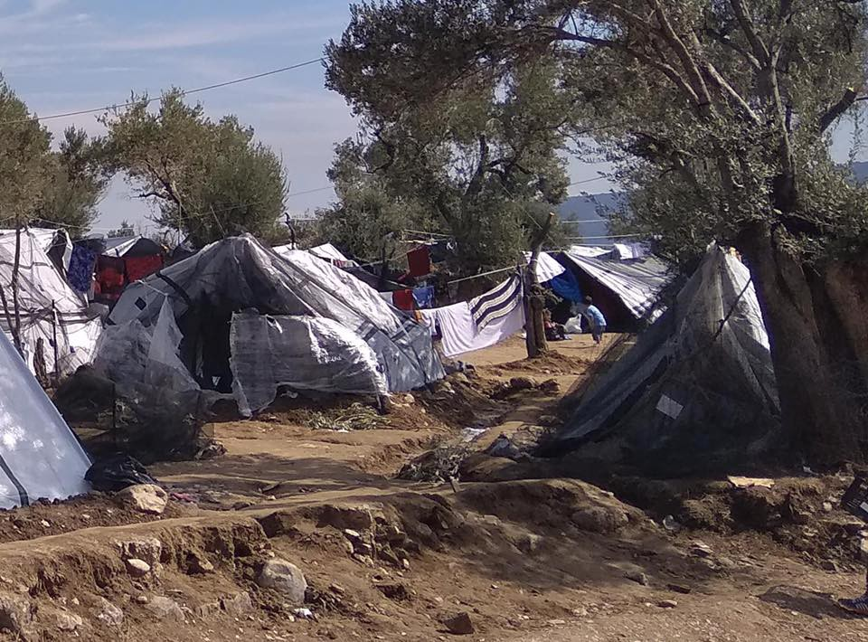
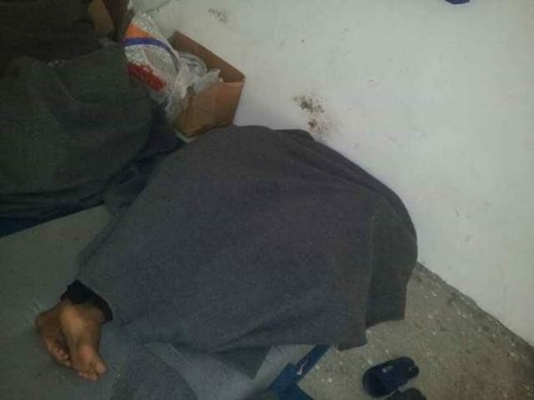
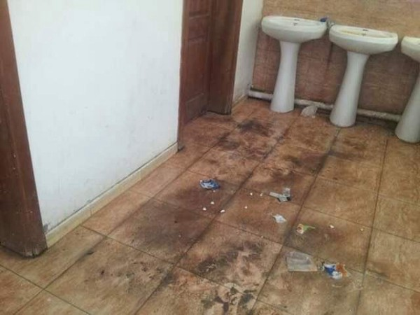
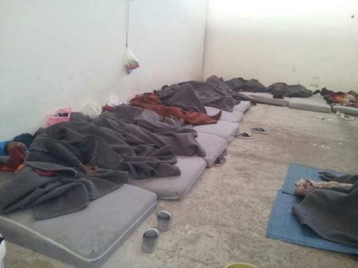

### خبرهای هفتگی آر\. یو\. س: بازداشتگاه‌ ها در سه منطقه ی آلمان
#### AYS Weekly News Digest in Persian, 26/11–02/12/18

### **لیبی**

بر طبق تعداد افراد سازمان یو اِن ،با آغاز این هفته حدود پنجاه و چهار هزار و سیصد و پنجاه و چهار نفر پناهنده و پناهجو در لیبی به ثبت رسیده اند

■■■■■■■■■■■■■■ 
> **[Xchange.org](https://twitter.com/xchange_org) @ Twitter Says:** 

> > #Irregular #migrants, economic migrants, #refugees and #asylum seekers are indistinguishable in #Libyan law, and are all considered “illegal migrants” thus are placed in detention centers regardless of their #immigration status and abused. Read more here: [ow.ly/cQdF50jLhF3](http://ow.ly/cQdF50jLhF3) https://t.co/8NhB7SMAJJ 

> **Tweeted at [2018-11-22 10:45:04](https://twitter.com/xchange_org/status/1065556766883307522).** 

■■■■■■■■■■■■■■ 

به غیر از این تعداد ،حدود سه هزار و پانصد و هفتاد و دو نفر هم در زندان‌های مرکزیه لیبی قرار [دارند](ays-daily-news-digest-26-11-18-night-deportations-detention-push-backs-and-denial-of-the-police-d7aad96985c)

سه شنبه معادل بیست و هفتم نوامبر ، جلسه کمیته ی آزادی های مدنی پارلمان اروپا به لیبی اختصاص داشت

وکیلان ،تلاش دارند برای ارائه ی تجزیه و تحلیل دقیق از اینکه آیا برنامه اتحادیه اروپا برای متوقف کردن نجات مهاجران در شمال آفریقا قانونی است یا خیر ،اما مفهوم حمایت آنها کاملا بحث برانگیز است

[بیشتر بخوانید\.](ays-daily-news-digest-26-11-18-night-deportations-detention-push-backs-and-denial-of-the-police-d7aad96985c)

### دریا

حدود صد و شش هزار و دویست و شست و نه نفر در سال جاری از طریق دریا وارد اروپا شده اند

همزمان ،سه هزار و سی صد و هشت نفر هم در فکر رویای رسید نشان به کشورهای امن و شروع زندگی جدید در این را جان باختند ،بر طبق اطلاعات داده شده توسط آی اُ اِم

در ماه نوامبر صد وده نفر شناخته شده در دریای مدیترانه غربی جان

■■■■■■■■■■■■■■ 
> **[vincent cochetel](https://twitter.com/cochetel) @ Twitter Says:** 

> > The return of these 12 persons to #Libya would be against international law. Let’s find a port to disembark, process each case quickly &amp; share responsibility for different solutions. The fate of 12 persons should not be a source of tensions among States [repubblica.it/cronaca/2018/1…](https://www.repubblica.it/cronaca/2018/11/27/news/migranti_il_comandante_del_peschereccio_che_ha_soccorso_12_naufraghi_rischiamo_di_morire_tutti_-212781530/) 

> **Tweeted at [2018-11-30 09:52:09](https://twitter.com/cochetel/status/1068442550560788481).** 

■■■■■■■■■■■■■■ 

### **یونان**
#### یونان از مرگ افراد در موریا شکایت کرد

حدودا نزدیک دوسال بعد از مرگ مهاجران مصری در مرکز موریا و مرکز شناسایی در شرق جزیره ی آیگن در لیسووس ،خانواده ی او رد شدند از دعوت به دادگاه برای شکایتش در مورد مقامات یونان که باعث مرگ او شدند ،که گفته میشود دلیل اصلی آن سهل انگاری مقامات مسئول بوده است ،از این گزارش بیشتر بخوانید در رسانه های گزارشیه یونان

■■■■■■■■■■■■■■ 
> **[Mobile Info Team](https://twitter.com/mobileinfoteam) @ Twitter Says:** 

> > Statistics and graphics about Dublin procedures from Greece to other countries. Vast majority of them are under the family reunification criteria. Available in English, Arabic and Farsi:
[mobileinfoteam.org/family-reunifi…](http://www.mobileinfoteam.org/family-reunification-statistic) https://t.co/uXFZ3AjeOk 

> **Tweeted at [2018-11-26 09:52:28](https://twitter.com/mobileinfoteam/status/1066993081113817088).** 

■■■■■■■■■■■■■■ 

### **صربستان**
#### همچنین افراد بیشتری وارد صربستان شده اند

بعضی از آنها از مقدونیه و بعضی هم از بلغارستان وارد صربستان شده‌اند

بعد زمان‌های مختلف که آنها سعی به ادامه راه خود داشتند ،چندین بار توسط پلیس به عقب فرستاده شدند و متأسفانه هیج کمپی در بوسنی برای ماندن پیدا نکرده‌اند، و بسیاری از مردم به عقب برگشتند تا بتوانند از بوسنی راه های دیگری را امتحان کنند

حتی بعضی از آنها به یونان برگشتند
### **بوسنی وهرزگویین**
#### آنفولانزا در بین پناهندگان و مهاجران در ولیکا کلادوشا

یک دکتر که در این منطقه کار می‌کند ،چندین متن اخطار دهنده به مرکز پزشکی پناهندگان ارسال کرده است که در حال حاصر حدود صد پناهنده در آنجا هستند

اگر چه ،این تنها گزارشی است که ما دریافت کردیم درباره ی وجود آنفولانزا بین پناهندگان در ولیکا کلادوشا

[بیشتر بخوانید\.](https://medium.com/are-you-syrious/ays-daily-news-digest-26-11-18-night-deportations-detention-push-backs-and-denial-of-the-police-d7aad96985c?fbclid=IwAR0IXUFSLU4_qEPUCBxuerd6AsNGlq1ztcd27OYp8McSM9rU0oFfF0eDIcY)

### **آلمان**
#### ”ورود ،تصمیم و بازگشت به وطن”

مرکزهایی در منطقه باواریا گزارشهایی داده اند که در حال حاضر مشغول به جابجایی مراکز کار هستند ،این گزارش ها را افراد جوانی که در آنجا زندگی میکنند و رسانه های آلمانی داده‌ اند و نوشته اند

در مدتی که منتظر هستند تا این تصمیم گرفته شود

،افراد در مرکز پناهندگی به هیچ عنوان حق ملاقات با کسی را ندارند و همچنین ترس آنها بر این است که پلیس معمولا مردم را در شب حدود ساعت چهار صبح دیپورت میکند

این پروژه ای است که در حال حاظر حتی در منطقه های دیگر هم در حال اجراست

\. [بیشتر بخوانید](ays-daily-news-digest-26-11-18-night-deportations-detention-push-backs-and-denial-of-the-police-d7aad96985c)

### فرانسه

](assets/eff619e8ee0d/1*80SICaW3UOm2HtBItOSs3Q.jpeg)

[Refugee Rights Europe](https://www.facebook.com/RefugeeRightsEurope/?tn-str=k%2AF&hc_location=group_dialog)
### **دانمارک**

به عنوان بخشی از بودجه سالانه خود ،دولت دانمارک از طرح جدید خود پرده برداری کرد ،ظاهرا این مدل از مراکز بازداشت فلات قاره استرالیا برداشت شده است ،که خانه ی پناهندگی ساخته شده در جزیره ی دور از دسترسی به نام لیندهولم

این مرکز در طی سه سال آینده به بهره‌ برداری خواهد رسید و در نهایت مرکز پناهندگی بحث برانگیزی به نام کارشودگارد ساخته میشود

](assets/eff619e8ee0d/1*3vTqy_2LygF4UvtLyqneTg.jpeg)

[Nyheder](http://nyheder.tv2.dk/politik/2018-11-30-udviste-kriminelle-udlaendinge-skal-ud-paa-en-oe?fbclid=IwAR1sbruDMM5xmiwdcz8l7tEM2x6WIFnvYFhlAYQV-5FbkuMBIxIayukitrE)

**We strive to echo correct news from** **the ground through collaboration and fairness\.**

**Every effort has been made to credit organizations and individuals with regard to the supply of information, video, and photo material \(in cases where the source wanted to be accredited\) \. Please notify us regarding corrections\.**

**If there’s anything you want to share or comment, contact us through Facebook or write to: areyousyrious@gmail\.com**

_Converted [Medium Post](https://medium.com/are-you-syrious/%D8%AE%D8%A8%D8%B1%D9%87%D8%A7%DB%8C-%D9%87%D9%81%D8%AA%DA%AF%DB%8C-%D8%A2%D8%B1-%DB%8C%D9%88-%D8%B3-%D8%A8%D8%A7%D8%B2%D8%AF%D8%A7%D8%B4%D8%AA%DA%AF%D8%A7%D9%87-%D9%87%D8%A7-%D8%AF%D8%B1-%D8%B3%D9%87-%D9%85%D9%86%D8%B7%D9%82%D9%87-%DB%8C-%D8%A2%D9%84%D9%85%D8%A7%D9%86-eff619e8ee0d) by [ZMediumToMarkdown](https://github.com/ZhgChgLi/ZMediumToMarkdown)._
