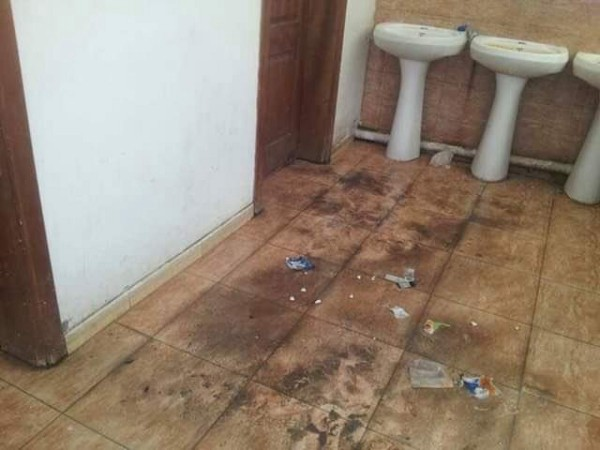

### خلاصة الأسبوع \(ا\.ي\.س\) عمليات الاحتجاز والترحيل في المانيا
#### AYS Weekly News Digest in Arabic, 26/11–02/12/18

](assets/6804834bae5b/1*afsklI1lIoAmNmjuB_-U9g.jpeg)

**اليونان:** Moria camp, Lesvos — صورة: [FOTOMOVIMIENTO 15M](https://www.facebook.com/Fotomovimiento.org/?tn-str=k%2AF&hc_location=group_dialog)
### ليبيا

ووفقاً لرقم المفوضية السامية للأمم المتحدة لشؤون اللاجئين ، بلغ عدد طالبي اللجوء واللاجئين المسجلين في ليبيا في بداية هذا الأسبوع 57،354\.

■■■■■■■■■■■■■■ 
> **[Xchange.org](https://twitter.com/xchange_org) @ Twitter Says:** 

> > #Irregular #migrants, economic migrants, #refugees and #asylum seekers are indistinguishable in #Libyan law, and are all considered “illegal migrants” thus are placed in detention centers regardless of their #immigration status and abused. Read more here: [ow.ly/cQdF50jLhF3](http://ow.ly/cQdF50jLhF3) https://t.co/8NhB7SMAJJ 

> **Tweeted at [2018-11-22 10:45:04](https://twitter.com/xchange_org/status/1065556766883307522).** 

■■■■■■■■■■■■■■ 

من أصل هذا العدد ، يوجد 3،572 شخصًا في أحد مراكز الاحتجاز [الليبية](ays-daily-news-digest-26-11-18-night-deportations-detention-push-backs-and-denial-of-the-police-d7aad96985c) \. الثلاثاء 27 نوفمبر ، في جلسة “لجان الحريات المدنية” بالبرلمان الأوروبي خصصت لليبيا\. كافح المحامين لتقديم تحليل مفصل عن ما إذا كانت خطط الاتحاد الاوروبي المتوقفة لافراغ المهاجرين انقاذ وشمال أفريقيا القانونية — ولكن في نهاية المطاف أيد كمفهوم مثير للجدل\.

](assets/6804834bae5b/1*xUVAkrI0ylzbkYtujZUd6g.jpeg)

صورة via [**Sally Hayden**](https://twitter.com/sallyhayd)
### البحر

دخل 106،269 شخصا أوروبا عن طريق البحر حتى هذا العام\. وفي الوقت نفسه قد مات 3\.308 بينما كانو يحلمون بالوصول إلى البلد الذي سيكون فيه آمناً وقادريين على بدء حياة جديدة ، وفقاً لبيانات المنظمة الدولية للهجرة\.خلال شهر نوفمبر ، من المعروف أن 110 أشخاص قد فقدوا حياتهم في غرب البحر الأبيض المتوسط\.مع حلول فصل الشتاء ، يمكن زيادة عدد الأشخاص الذين سيموتون على طريق الحدود المغلقة

■■■■■■■■■■■■■■ 
> **[vincent cochetel](https://twitter.com/cochetel) @ Twitter Says:** 

> > The return of these 12 persons to #Libya would be against international law. Let’s find a port to disembark, process each case quickly &amp; share responsibility for different solutions. The fate of 12 persons should not be a source of tensions among States [repubblica.it/cronaca/2018/1…](https://www.repubblica.it/cronaca/2018/11/27/news/migranti_il_comandante_del_peschereccio_che_ha_soccorso_12_naufraghi_rischiamo_di_morire_tutti_-212781530/) 

> **Tweeted at [2018-11-30 09:52:09](https://twitter.com/cochetel/status/1068442550560788481).** 

■■■■■■■■■■■■■■ 

### اليونان
#### دعوى قضائية ضد اليونان

تقريب السنتين من وفاة لمهاجر المصري في موريا في مركز الاستقبال في جزيرة ليسفوس شرقي بحر إيجة ، رفعت عائلتة دعوى قضائية ضد السلطات اليونانية بسبب وفاته ، قائلة إن سبب ذلك هو إهمال المسؤولين ، حسبما أفاد الإعلام اليوناني بتفاصيل اكثر

■■■■■■■■■■■■■■ 
> **[Mobile Info Team](https://twitter.com/mobileinfoteam) @ Twitter Says:** 

> > Statistics and graphics about Dublin procedures from Greece to other countries. Vast majority of them are under the family reunification criteria. Available in English, Arabic and Farsi:
[mobileinfoteam.org/family-reunifi…](http://www.mobileinfoteam.org/family-reunification-statistic) https://t.co/uXFZ3AjeOk 

> **Tweeted at [2018-11-26 09:52:28](https://twitter.com/mobileinfoteam/status/1066993081113817088).** 

■■■■■■■■■■■■■■ 

### صربيا

وصول المزيد من الناس الى صربيا \. بعضهم قادمين من بلغاريا أو مقدونيا ، ولكن العديد من البوسنة\. بعد أن حاولوا مواصلة رحلتهم، تم صدهم، وتعذر العثور حتى مخيم لائق في البوسنة، فقرر العديد من الناس العودة إلى صربيا ومحاولة ايجاد طريقة أخرى\. وايضا البعض قد عاد إلى اليونان
### البوسنة و الهرسك
#### انفلونزا بين اللاجئين والمهاجرين في [فيليكا كلادوشا](ays-daily-news-digest-26-11-18-night-deportations-detention-push-backs-and-denial-of-the-police-df87a8d965ac)

قام طبيب يعمل في المنطقة المذكورة بنشر نص تحذيري يشرح الوضع الطبي الحاد الذي يعيشه مئات اللاجئين حالياً\. حتى الآن ، هذا هو المصدر الوحيد الذي وجدنا أنه يبلِّغ عن وباء إنفلونزا بين الناس في فيليكا كلادوشا

### ألمانيا

أفادت الأنباء أن مراكز “الوصول والقرار والإعادة إلى الوطن” في منطقة بافاريا يعمل الآن كمراكز احتجاز وترحيل ، والشباب الذين كانوا هناك قد صرحوا ذلك، [وكتبت وسائل الإعلام الألمانية عن ذلك](http://taz.de/Ankerzentren-in-Bayern/!5548527/?fbclid=IwAR3342jpHJd7tpD76G1ghw8kU84wo81oHBie51gKE-QYSOe2-QPAtmcjD5M) \. أثناء انتظار اتخاذ القرار ، لا يستطيع الأشخاص في المركز استقبال تلقي الزيارات ويخشون عمليات الترحيل التي تتم عادة في الليل ، في حوالي الساعة الرابعة ، من قبل الشرطة\. هذا هو المشروع الذي من المخطط تنفيذه في مناطق أخرى كذلك
### فرنسا

](assets/6804834bae5b/1*80SICaW3UOm2HtBItOSs3Q.jpeg)

[Refugee Rights Europe](https://www.facebook.com/RefugeeRightsEurope/?tn-str=k%2AF&hc_location=group_dialog)
### الدانمارك

كجزء من ميزانيتها السنوية ، كشفت الحكومة الدنماركية عن خطة جديدة ، على ما يبدو على غرار مراكز الاعتقال في أستراليا ، لإيواء طالبي اللجوء في إجراءات الترحيل في جزيرة ليندهولم المنعزلة\. سيتم إنشاء المركز على مدار السنوات الثلاث المقبلة ، وسيضم في النهاية طالبي اللجوء الذين تم ترحيلهم من كرشوفركارد

](assets/6804834bae5b/1*3vTqy_2LygF4UvtLyqneTg.jpeg)

صورة: [Nyheder](http://nyheder.tv2.dk/politik/2018-11-30-udviste-kriminelle-udlaendinge-skal-ud-paa-en-oe?fbclid=IwAR1sbruDMM5xmiwdcz8l7tEM2x6WIFnvYFhlAYQV-5FbkuMBIxIayukitrE)

**We strive to echo correct news from** **the ground through collaboration and fairness\.**

**Every effort has been made to credit organizations and individuals with regard to the supply of information, video, and photo material \(in cases where the source wanted to be accredited\) \. Please notify us regarding corrections\.**

**If there’s anything you want to share or comment, contact us through Facebook or write to: areyousyrious@gmail\.com**

_Converted [Medium Post](https://medium.com/are-you-syrious/%D8%AE%D9%84%D8%A7%D8%B5%D8%A9-%D8%A7%D9%84%D8%A3%D8%B3%D8%A8%D9%88%D8%B9-%D8%A7-%D9%8A-%D8%B3-%D8%B9%D9%85%D9%84%D9%8A%D8%A7%D8%AA-%D8%A7%D9%84%D8%A7%D8%AD%D8%AA%D8%AC%D8%A7%D8%B2-%D9%88%D8%A7%D9%84%D8%AA%D8%B1%D8%AD%D9%8A%D9%84-%D9%81%D9%8A-%D8%A7%D9%84%D9%85%D8%A7%D9%86%D9%8A%D8%A7-6804834bae5b) by [ZMediumToMarkdown](https://github.com/ZhgChgLi/ZMediumToMarkdown)._
