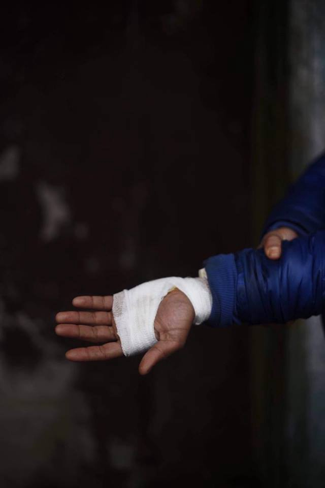
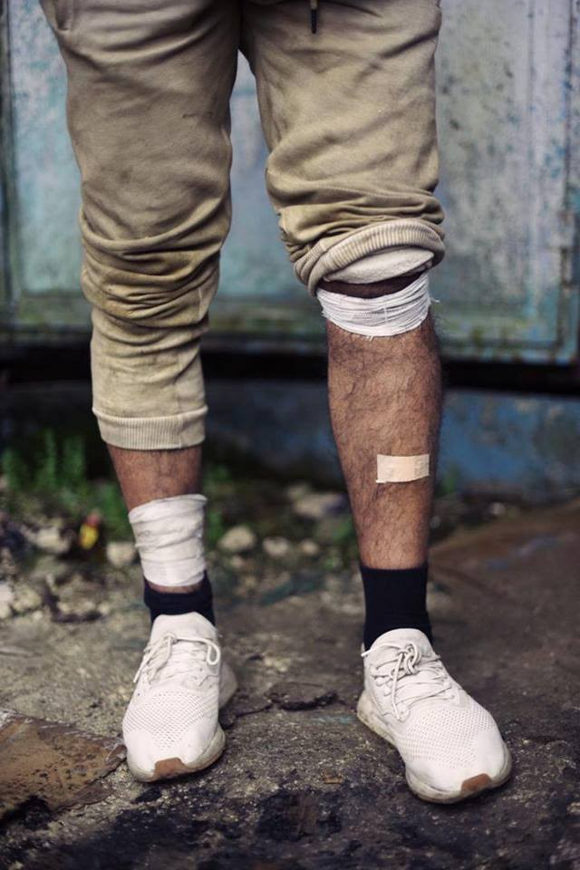
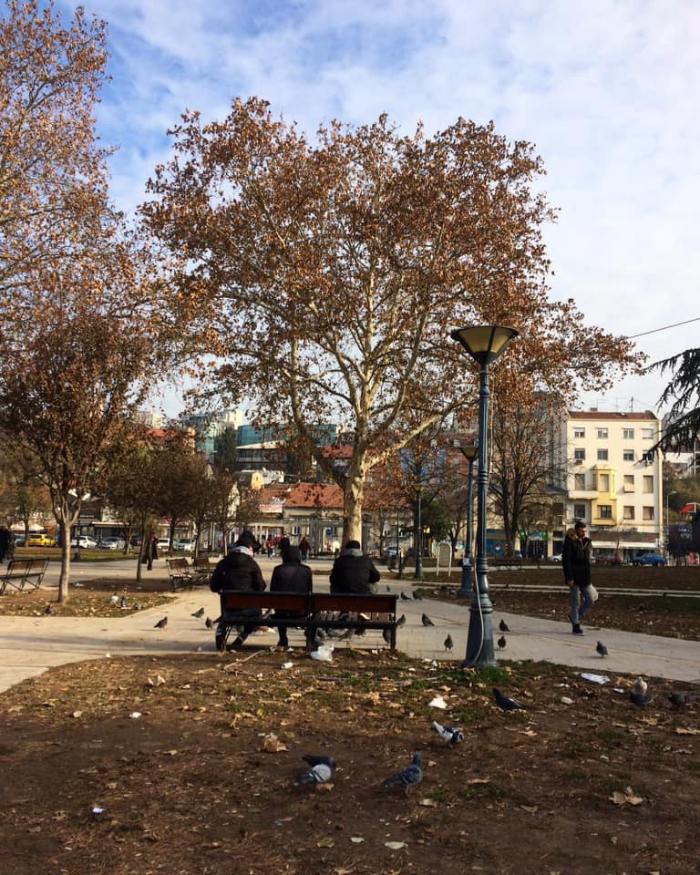

### AYS Daily Digest 03/12/2018: 26 migrants expelled from their centre and 1,000 more to face the same, as first results of Salvini’s new decree

[Are You Syrious?](https://medium.com/@AreYouSyrious?source=post_header_lockup)

Dec 4

_Fire in Lebanon kills two Syrian refugees//Switzerland denies flag to Aquarium//Donations and volunteers needed in Greece//New testimonies of violence on the Balkan route//Protest against deportation to Afghanistan to be held in Frankfurt//…_

](assets/2d2111eddb3c/1*-FEyHOBejp2gqUioL3clbw.jpeg)

Credit: [Danilo Balducci](https://www.facebook.com/danilobalducciphotography/?__tn__=%2CdK*F-R&eid=ARCIItfG05mto3hk_i--Vt10U0XFhpdTn6re445HEGLy--i0DSUoxGuaW8zZsno-QPhajC3e93zvUQ5v)
### FEATURE

A total of [26 migrants with regular humanitarian protection have been expelled](https://www.repubblica.it/cronaca/2018/12/01/news/crotone_il_richiedente_asilo_cacciato_dal_cara_non_hanno_avuto_pieta_neanche_per_mia_moglie_incinta_e_la_mia_bimba_di_sei-213143464/) from the structure where they were living at the Cara of Isola Capo Rizzuto \(Crotone, Calabria\), as a result of the “Decreto Sicurezza”, the new law regulating the migration and asylum system in Italy, the catastrophic consequences of which have been mentioned in our [weekend digest](https://medium.com/are-you-syrious/ays-weekend-digest-1-2-12-2018-more-talk-but-no-action-over-situation-in-greeces-hotspots-66d08b1333a?fbclid=IwAR3O5uaz5E-1ft_E2e3FQayr-It1Nm7xoAYbLhVZzUcFdxLvSoK8q-eqqkA) recently\.

Among them, a six\-month\-old baby and her parents, the mother pregnant again, are being left out on the streets with no alternative shelter\. When they tried to ask why they had to collect their stuff and leave the centre, they were told that “this is the law”\.

Together with 23 other people, they were loaded onto a bus and taken to the central train station, under heavy rain; when asked about them, the people responsible for the structure replied that “they are not under our care anymore”\.

Volunteers of the local Red Cross have coped with the emergency by offering the family temporary shelter, which is obviously not sustainable as a long\-term solution, as asylum seekers and refugees should be taken care of by public authorities and not have to rely on the solidarity of local volunteers and good\-hearted people\. The structure where the people are hosted now is an emergency shelter with beds and a bathroom, but there is no kitchen inside the building\.

Solidarity was shown also by the local Caritas section and individual citizens who offered help to try and find a solution, but it was not possible to accommodate all the 26 people left on the streets\.

Meanwhile, the Prefettura announced that this week around 200 more people will be released from the structure; a total of around 1,000 migrants are estimated to have been left out on the streets in Calabria alone as a result of this new discriminatory decree, which is de facto deleting humanitarian protection as an option when applying for asylum, thus increasing the number of those who will be considered “illegal migrants” by the fascist political caste ruling the country\.

In Bari, at the CPR \(Centri di Permanenza per il Rimpatrio, basically deportation centres\) of Bari Palese, a group of five [people tried to break free](https://hurriya.noblogs.org/post/2018/12/03/bari-tentata-evasione-dal-cpr/?fbclid=IwAR0-DsXNNHlQ7kbovYbcmDc6hoXjArFbg5HhfzkpyaDif9CBHlBvm97Ayrs) on Saturday\.

At the moment, the centre is hosting 90 people waiting for deportation; the five people wanted to steal the keys from the guards and set their fellow inmates free, but the intervention of policemen impeded their break out\.

The measures taken against the people are still unknown, but the police staff working in the centre have asked for increased militarisation of the place\.

According to the guards, the building is run down and the people detained often protest and try to break free, damaging the structure even more\.

There is a shortage of medicines and syringes and the medical staff have to use toilet paper to dress wounds\. Food and hot water are frequently not available, there are cockroaches everywhere and larvae in the milk, and there are numerous cases of scabies, hepatitis and general infections due to the living conditions\.

Another CPR in the area, Brindisi Restinco seems to be in the same condition\.
### LEBANON

A [fire developed](https://www.alaraby.co.uk/english/news/2018/12/3/two-dead-after-fire-rips-through-syrian-refugee-camp?utm_source=twitter&utm_medium=sf&fbclid=IwAR1cIs3baU59hAsfykUsMr9Y3wfnKqe6_RBB6yq0lwfqMLiRubJIRgaf3Mg) in one of the refugee camps around the area of Yammouneh, in the Beqaa Valley, killing two Syrian refugees \(one 46\-year\-old man and a 7\-year\-old boy\) and destroying almost two dozen tents and belongings\.

The fire developed at 3 AM and after the initial spark, it came into contact with a fuel container, causing it to spread\.
### TURKEY

Around 7,000 people who crossed the Evros border between Greece and Turkey from January to September are Turkish citizens\. According to [Greek figures](http://asylo.gov.gr/en/wp-content/uploads/2018/11/Greek_Asylum_Service_Statistical_Data_EN.pdf) , up to 31 October, a total of 3,807 Turkish citizens applied for asylum in Greece, the other half deciding not to proceed with their asylum process in the country in order to continue further north to other European countries\.

The people fleeing Erdogan’s regime are mainly judges, military personnel, business professionals or academics and civil society agents, persecuted for their apparent affiliation with the Gülen movement, and choosing to escape the country illegally because of their passports being withdrawn\.

> Nearly 4,000 Turks have applied for asylum in Greece so far this year\. But most Turkish arrivals don’t register their presence in Greece, planning instead to head deeper into Europe and further from Turkey\. 

Read more [here](https://ahvalnews.com/greece-turkey/soaring-number-turks-fleeing-erdogan-arrive-greece-wsj?amp&__twitter_impression=true&fbclid=IwAR2EGwcz8FCoG2ZbjvIIzcNHozmy9YOdtGTasPqmqWXOtNUuXYCfKor-q3g) \.
### SEA

A total of 236 people were rescued today in the Mediterranean\.

■■■■■■■■■■■■■■ 
> **[SALVAMENTO MARÍTIMO](https://twitter.com/salvamentogob) @ Twitter Says:** 

> > Balance pateras: Mar de Alborán. SAR Mastelero ha rescatado 223 personas de 4 pateras y las está trasladando a #Málaga. Salvamar Spica rescató a 11 de una patera y los desembarcó en #Almería. 
Estrecho: Salvamar Arcturus rescató a 2 hombres de neumática. Trasladados a Tarifa. https://t.co/u63oTiQYAF 

> **Tweeted at [2018-12-03 19:56:22](https://twitter.com/salvamentogob/status/1069681770042404865).** 

■■■■■■■■■■■■■■ 

[Switzerland denied its flag to the Aquarius](https://www.bfmtv.com/international/berne-refuse-que-l-aquarius-obtienne-un-pavillon-suisse-1580642.html) after Panama’s decision to withdraw its registration at the end of September\.

> Bern believes that “it is not enough to conduct ad hoc negotiations for each ship carrying people in distress” and advocates that a “viable European solution must be found, which respects the rules of sea rescue and guarantees safe landing ports \[…\]”\. 

### GREECE

_Arrivals_

_Islands_

_Mainland_

Donations and support are needed for the squat in Athens\.

_Call for volunteers_

Refugee Language Initiative is looking for volunteers willing to work as Volunteer Coordinators and English and Greek language teachers\. Please, follow the [link](https://www.facebook.com/TheRefugeeLanguageInitiative/posts/767390793597867) to apply\.

Also, Light Without Borders Org is looking for ophthalmologists and optometrists to volunteer in their ophthalmology clinic in Moria\. You can find more information [here](https://www.facebook.com/lightwithoutbordersorg/posts/504322116742787?hc_location=ufi) \.
### BALKAN WEATHER REPORT for Tuesday 04/12

MONTENEGRO

Changeably cloudy with sunny intervals\. Towards the end of the day cloudy with local rain and snow in the northern mountains\. More chance of rain in the north, where fog is also expected during the morning\. The wind will be weak to moderate blowing from changeable directions, while during the night a moderate northern and northwestern wind will be blowing\. The lowest temperatures will be from 0 to 10 and the highest daily from 6 to 18 degrees\.

SERBIA

Cloudy locally with rain which will cease during the afternoon first in the north and west\. The wind weak to moderate blowing from the southeast and turning into a northwester in the afternoon\. Lowest temperatures from \-4 to 6 and the highest daily from 8 to 12 degrees\.

BiH

Before noon predominantly cloudy with light rain and drizzle in the west and southwest\. As the day progresses rain is expected throughout the country and in the evening the precipitation will gradually come to an end\. The lowest temperatures wil be from 2 to 11 and the highest daily from 7 to 15 degrees\.

CROATIA

During the morning changeable and predominantly cloudy with local fog in the interior\. Locally it will rain, mostly in the coastal regions\. In the afternoon it will start clearing up, but in some areas it will still rain\. The wind will be moderate, blowing from the southwest and towards the end of the day from the north and northwest\. Along the coast the wind will be strong in the evening\. The lowest temperatures will be between 2 and 13 and the highest daily between 8 and 18 degrees\.
### BALKAN ROUTE

As [reported](ays-daily-news-digest-28-11-18-eu-countries-reject-trawvler-with-12-refugees-39b1e3f46034) a few days ago, Nasim, a 25\-year\-old Algerian asylum seeker who was travelling along the route, died while trying to cross a river between Slovenia and Italy\.

No Name Kitchen reports having collected [first hand testimonies](https://www.facebook.com/NoNameKitchenBelgrade/posts/631323180599303) from the friends who were with him that day and were illegally deported back to Croatia, prevented even from seeing their friend’s body one last time\.

> \[…\] it seems that Croatian police considered that the situation wasn’t traumatic enough and, when they took the migrants to the border with Bosnia, at night, they made these young people leave the car one by one, beating each of them\. The boy bearing the brunt of this extreme situation was the one who hours before had been taken to hospital after collapsing due to the death of Nasim\. One of the policemen, wearing — as all of them do — a ski\-mask, took the boy’s head using both hands and hit his face with his knee\. 

Credit: No Name Kitchen
### SERBIA

> Came back to Belgrade for the first time since spring 2017, before the barracks were evicted\. About 1000–2000 men spent a whole winter in an abandoned and ugly warehouse\. They burnt basically everything to stay warm\. It smelled of shit, stale food, fire… whatever\. Now there is a fancy hotel there instead\. 

> Coming back here from Sarajevo made me think… In Sarajevo, the numbers of people on move are lower than they were in Belgrade, but the cold will be the same\. The lack of care is the same\. There are not enough camps and many people are squatting\. It’s been two winters since Belgrade made headlines in big papers — but still, the same shit is ongoing in the western Balkans\. In the “Afghan park” in Belgrade, people are still hanging out\. Met a couple of guys in there this morning\. They hoped to reach Croatia before the winter and told me that they’d heard that Bosnia is a big problem now, meanwhile they kept on feeding the pigeons with old bread\. Like, what does “good luck, brother” really mean in 2018… 

Credit: AYS’ collaborator
### GERMANY

Demo against a deportation to Afghanistan will take place on Tuesday at 18\.30 at the airport in Frankfurt\.

■■■■■■■■■■■■■■ 
> **[Network against Deportation Hessen / Mainz](https://twitter.com/VgA_HessenMainz) @ Twitter Says:** 

> > Das Afghan Refugees Movement ruft für Morgen zur Demonstration gegen die Sammelabschiebung nach Afghanistan auf.
Wann: Dienstag, den 04.Dezember 2018 um 18:30Uhr
Wo: Flughafen Frankfurt,Terminal 1 Abflug B
Kommt zahlreich! #AfghanistanIsNotSafe 

> **Tweeted at [2018-12-03 11:34:05](https://twitter.com/vga_hessenmainz/status/1069555366546034689).** 

■■■■■■■■■■■■■■ 

### FRANCE

Volunteers operating around Calais warn that on Wednesday evening “the sea will still be breaking with a brisk onshore wind on the day and any engine failure would be extremely dangerous even if rescue was prompt\. It’s much colder than when two people nearly died of hypothermia last week”\.

Please, find more information in this [group](https://www.facebook.com/groups/calaismigrantssolidarity/permalink/10155962817989562/?hc_location=ufi) \.

### BELGIUM

A new group of Syrian refugees arrived at Brussels airport today through [humanitarian corridors](https://www.santegidio.org/pageID/30284/langID/it/itemID/28456/Nuovo-arrivo-di-profughi-siriani-in-Belgio-con-i-corridoi-umanitari.html) \. On 28 November and 3 December, a total of 16 families \(150 people\) reached the country from Lebanon\.
### UK

The over forty women at Yarl’s Wood detention centre, who were on hunger strike since Sunday, have stopped their action, given that the deportation process of eight Nigerian women has been halted\.

Four of the women were not deported back, but, unfortunately, two of them with severe walking disabilities were forced on to the plane with wheelchairs and flown to Nigeria\.

> We are suspending the hunger strike but will continue to protest and speak out\. \. \. the pressure has not stopped — another charter flight is being planned to remove our Latina sisters from tomorrow \. \. \. the Home Office tell us nothing, they just come for us in the night \. \. \. they have many ways to torture us \. \. \. the system is wrecking our health\. \. \. they are trying to break us down and isolate us from our support networks and lawyer \. \. \. We know people are with us and we thank everyone for their tremendous support\. Every message helps us to keep our spirits up\. 

Read more on their action [here](https://www.facebook.com/noborders.leeds/posts/2263877563899279) and [here](https://detainedvoices.com/2018/12/02/the-hunger-strike-is-still-on/) \.
### DENMARK

Local sources [reports](https://www.dr.dk/nyheder/politik/danmark-forhandler-om-splinternyt-faengsel-i-litauen-til-udvisningsdoemte-kriminelle?fbclid=IwAR3RrufiiN5WoOOrnYXDqWmGVROX1lgrINa5Ui6nh3LZma0-D_zbNl459JM) that a deal with Lithuania is in progress about building a new prison on Lithuanian soil\. The deal includes the “benefit” for Denmark to send all criminal foreigners into this prison\.

The Danish people party states “we want a prison in a Eastern European country because their standards are lower than in Denmark”\.
### MOROCCO

Forty young people from Morocco were arrested yesterday while trying to reach Europe; among them, five suspected smugglers\.

We also publish a **weekly overview in Arabic and in Persian** of some of the most important stories we covered during the previous week\. 
Please, share it with your Arabic and Persian speaking friends\. 
Here is last week’s **Arabic version: [خلاصة الأسبوع \(ا\.ي\.س\) عمليات الاحتجاز والترحيل في المانيا](%D8%AE%D9%84%D8%A7%D8%B5%D8%A9-%D8%A7%D9%84%D8%A3%D8%B3%D8%A8%D9%88%D8%B9-%D8%A7-%D9%8A-%D8%B3-%D8%B9%D9%85%D9%84%D9%8A%D8%A7%D8%AA-%D8%A7%D9%84%D8%A7%D8%AD%D8%AA%D8%AC%D8%A7%D8%B2-%D9%88%D8%A7%D9%84%D8%AA%D8%B1%D8%AD%D9%8A%D9%84-%D9%81%D9%8A-%D8%A7%D9%84%D9%85%D8%A7%D9%86%D9%8A%D8%A7-6804834bae5b)** 
and **Persian: : [خبرهای هفتگی آر\. یو\. س: بازداشتگاه‌ ها در سه منطقه ی آلمان](%D8%AE%D8%A8%D8%B1%D9%87%D8%A7%DB%8C-%D9%87%D9%81%D8%AA%DA%AF%DB%8C-%D8%A2%D8%B1-%DB%8C%D9%88-%D8%B3-%D8%A8%D8%A7%D8%B2%D8%AF%D8%A7%D8%B4%D8%AA%DA%AF%D8%A7%D9%87-%D9%87%D8%A7-%D8%AF%D8%B1-%D8%B3%D9%87-%D9%85%D9%86%D8%B7%D9%82%D9%87-%DB%8C-%D8%A2%D9%84%D9%85%D8%A7%D9%86-eff619e8ee0d)**

**We strive to echo correct news from the ground through collaboration and fairness\.**

**Every effort has been made to credit organizations and individuals with regard to the supply of information, video, and photo material \(in cases where the source wanted to be accredited\) \. Please notify us regarding corrections\.**

**If there’s anything you want to share or comment, contact us through Facebook or write to: areyousyrious@gmail\.com**

_Converted [Medium Post](https://medium.com/are-you-syrious/ays-daily-digest-03-12-2018-26-migrants-expelled-from-their-centre-and-1-000-more-to-face-the-2d2111eddb3c) by [ZMediumToMarkdown](https://github.com/ZhgChgLi/ZMediumToMarkdown)._
