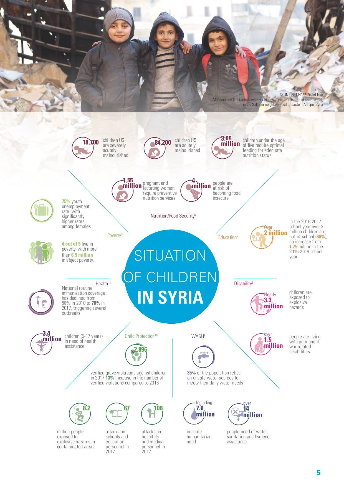
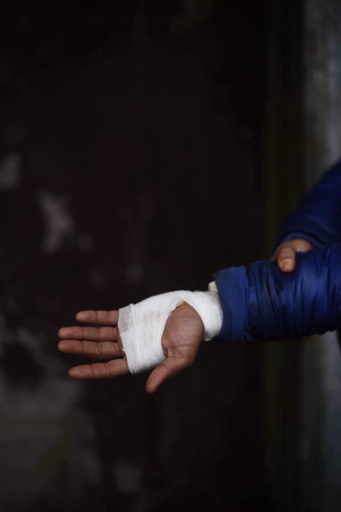
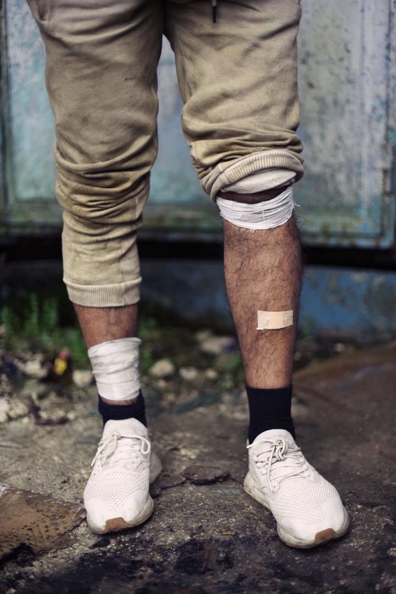
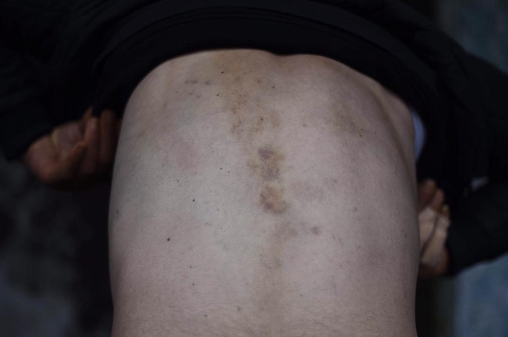
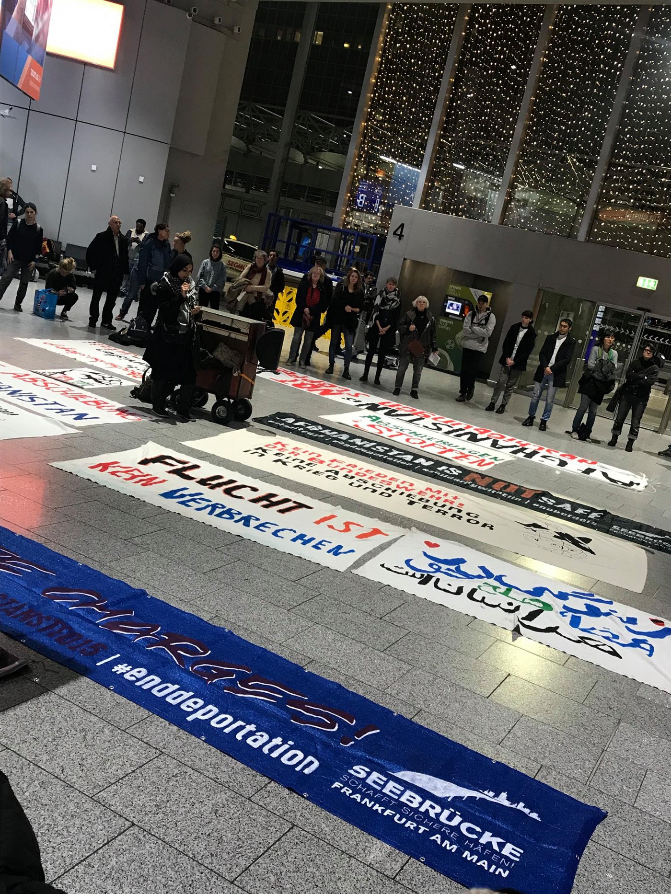
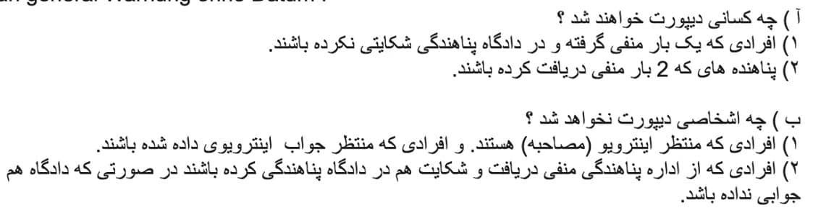
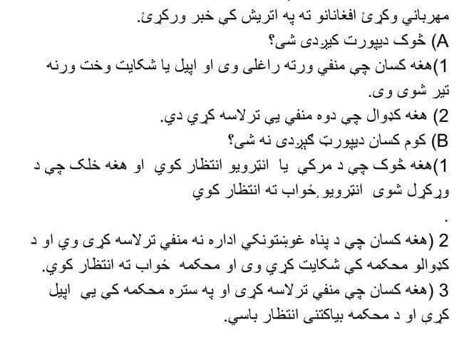

### خلاصه هفتگی خبریه آر\.یو\.س : تبعیض، خشونت پلیس و قوانین ضد مهاجرتی
#### AYS Weekly News Digest in Persian, 03–09/12/18

### **سوریه**

هجده هزار و هفتصد کودک زیر پنج سال دچار سوء تغذیه هستند

یک میلیون و پانصد و پنجاه هزار زن باردار و شیرده نیاز به خدمات تغذیه دارند

چهار میلیون نفر در خطر کمبود غذا مواجه هستند

دو میلیون کودک بدون هیچ تحصیلی به سر می‌برند

سه میلیون و سه هزار نفر در معرض خطرات انفجاری قرار دارند

یک میلیون و پنجاه هزار نفر در جنگ دائم زندگی میکنند

صد و هشتاد حمله به بیمارستان ها و مکان‌های پزشکی در سال دوهزار و هفده صورت گرفته است

سه میلیون و چهارصد هزار نفر کودک بین پنج تا هفده سال نیازمند کمک های بهداشتی هستند

### **لبنان**

یک کمپ پناهندگی در منطقه یاموونه در آتش سوخت ،در خیابان بکا ،در این آتش سوزی دو پناهنده ی سوریه ای جان باختند ،یکی از آنها چهل و شش سال داشت و دیگری هفت سال ،همچنین دو تا از چادرهای پناهندگی در آتش سوخت \.

این آتش سوزی از ساعت سه صبح شروع شد و بعد از جرقه ی اول ،این آتش به یک کانتینر حامل بنزین رسید ،به همین دلیل آتش شیوع پیدا کرد \.
### **لیبی**

گزارش داده شده است که پانزده مهاجر در مسیر جزیره ی لیبی در قایق بعد از گذشت دوازده روز در دریا جان خود را به دلیل نبود غذا و آب از دست داده‌اند ،یکی فرد مصری گفته است که در روز سه شنبه اتفاق افتاده است \.

■■■■■■■■■■■■■■ 
> **[Mireille Girard](https://twitter.com/UNHCRGirard) @ Twitter Says:** 

> > Deeply hurt by the death of 2 #refugees, including a 6 year old boy, in a fire that mercilessly blazed through an informal settlement in the Bekaa, burning down 24 tents. Families lost all they had, on the eve of winter. We're standing by them at this very difficult time. https://t.co/wYj4FJjjCc 

> **Tweeted at [2018-12-04 21:23:10](https://twitter.com/unhcrgirard/status/1070066004519280642).** 

■■■■■■■■■■■■■■ 

فقط ده نفر از بازماندگان از کمبود آب شدید رنج میبردند که آنها را به بازداشتگاه برده اند ،سازمان آی\.ا\.ام در لیبی این گزارش ها را به دست آورده :

هشدار می‌دهیم که هنوز قدمهای جدی برای حل حرکات نا امن در دریای مدیترانه نمیبینیم

هر کس دیگری تعجب می‌کند : چه راهی به طور منظم برای این افراد ارائه می‌شود ،به این ترتیب آنها مجبور نیستند که به این حرکات نا امن برای عبور از دریای مدیترانه دست یابند و جان و خود را به خطر بیندازند

■■■■■■■■■■■■■■ 
> **[Missing Migrants Project](https://twitter.com/MissingMigrants) @ Twitter Says:** 

> > At least 114 people lost their lives in the Western Mediterranean during the month of November, the month in which the most deaths have been recorded by @[MissingMigrants](https://twitter.com/MissingMigrants) since we started documenting deaths in 2014: [bit.ly/2BQWzG7](https://bit.ly/2BQWzG7) #[MissingMigrants](https://twitter.com/MissingMigrants) https://t.co/Koo4535k0s 

> **Tweeted at [2018-12-04 16:08:49](https://twitter.com/missingmigrants/status/1069986894480588800).** 

■■■■■■■■■■■■■■ 

### **ترکیه**

حدود هفت هزار نفر که از مرز شهر اورس بین یونان و ترکیه از ماه ژانویه تا سپتامبر گذشتند ،همگی از شهروندان ترکیه هستند \.

بر طبق اطلاعات به دست آمده از یونان ،تا پایان ماه دسامبر ،کلا سه هزار و هشت صد و هفت نفر ترکیه ای درخواست پناهندگی در یونان را داده‌اند و بقیه ی آنها قصد عبور به کشورهای دیگر اروپای شمالی را دارند\.

این افراد از ترس قضاوت رژیم اردوغان و افراد پلیس فرار کرده اند و تنها دلیل آن به خاطر اعتراض آزاد آنها با جنبش گولن که موجب آزار و شکنجه قرار خواهند گرفت و آنها مجبور به ترک کشور شده اند و به دلیل از بردن پاسپورت هایشان مجبور به خروج غیر قانونی از کشور شده اند

حدود چهار هزار نفر ترکیه ای در سال جاری درخواست پناهندگی در یونان را داده‌اند و بیشتر ترکیه ای ها هنوز حضور خودشان را در یونان اعلام و ثبت نکرده اند و قصد ادامه به کشورهای اروپای شمالی را دارند

[در این لینک بیشتر بخوانید](https://ahvalnews.com/greece-turkey/soaring-number-turks-fleeing-erdogan-arrive-greece-wsj?amp&__twitter_impression=true&fbclid=IwAR2EGwcz8FCoG2ZbjvIIzcNHozmy9YOdtGTasPqmqWXOtNUuXYCfKor-q3g)
### **جزیره**
#### هیچ کمک قانونی برای افراد در جزیره وجود ندارد

گزارش آمده است که کمیته های تجدید نظر یونان اخیرا درخواست تجدیدنظر در جزایر را تصویب کرده و در عرض چند روز یا دو هفته تصمیم گیری می کنند، به رغم ناتوانی دولت در انتخاب یک نماینده قانونی به متقاضیان این اتفاق افتاده است \. به دلیل کمبود مداوم و شدید در طرح حمایت از حقوق قانونی دولت برای درخواست تجدید نظر در پناهندگی، افرادی که در آنجا حضور داشتند، به مدت چند ماه به نمایندگی قانونی، دسترسی نداشتند \.

■■■■■■■■■■■■■■ 
> **[Tdh Europe](https://twitter.com/TdhEurope) @ Twitter Says:** 

> > On Greek islands, over 12,500 people still live in tents &amp; containers unsuitable for winter. 

We urge the Greek gov't &amp; #EU to move to dignified shelter or relocate to other countries all #AsylumSeekers. 

👉[tdh-europe.org/news/greece-eu…](http://tdh-europe.org/news/greece-eu-move-asylum-seekers-to-safety/7403) 👈 #OpenTheIslands #RefugeesGr #HumanRightsDay https://t.co/VDamyQqs2N 

> **Tweeted at [2018-12-06 12:21:05](https://twitter.com/tdheurope/status/1070654359871152128).** 

■■■■■■■■■■■■■■ 

### **بوسنی و هرزگووین**

محل سکونت غیر رسمی تخریب شده و پاکسازی شده است و ساکنان آن در اردوگاه های رسمی در مناطق اطراف بازداشت شده اند\. “علی رغم این واقعیت که حل و فصل در Kladusa تبدیل به یک مکان سخت برای زندگی بود، بسیاری از مردم در پناهگاه های خود خوشحال بودند، به احتمال زیاد امنیت ، آزادی آنها زیاد شده ،” گزارش ن\.ن\.ک ، که عملیات دوش اب گرم و چای و توزیع لباس گرم را ادامه خواهد داد\.

Velika Kladuša
### **مسیر بالکان**

طبق گزارش های چند روز اخیر ،نسیم ،شخصی بیست و پنج ساله از الجزیره ،به دلیل تلاش از عبور دریای بین اسلوونی و ایتالیا جان خورد را از دست داد

سازمان ن\.ن\.ک گزارش داده است که هنوز در حال جمع کردن اطلاعات و شهادت هایی از دوستان این شخص جان باخته هستند و متأسفانه پلیس دوستان این شخص را دیپورت غیر قانونی کرده و به کروواسی بازگردانده است و حتی از آنها جلوگیری شده برای دیدن آخر بار جسد دوستشان

به نظر میرسد که پلیس کرواسی در نظر گرفته است که این وضعیت و اتفاق حقیقی نبوده‌است و به همین دلیل این پناهجویان را به نزدیکی مرز بوسنی برده و آنها را یک به یک از ماشین پیاده کرده اند و تک تک آنها را مورد ضرب و شتم قرار داده اند \.یک پسر با طاقت آوردن از فشار زیاد از این شرایط بد، کسی رو که قبل از پیدا کردن جسد نسیم به بیمارستان انتقال یافت \.یکی از مردان پلیس ،با پشش صورت به وسیله نقاب اسکی ،این شخص را به دستانش مورد ضرب و شتم قرار داده و با زانو به صورت این پناهجو کوبیده است

Photo NNK
### **ایتالیا**
#### **پلیس شورش از پناهندگان می خواهد تا صبحانه بخورند**

داوطلبان از تجربه Baobab صبحانه در ایستگاه متروی Tiburtina در رم صبح زود هنگام پلیس ضد شورش را نشان دادند\. در نزدیک کریسمس، پلیس تصمیم گرفت که توزیع غذای گرم را متوقف کند و پناهندگان در آنجا مورد آزار و اذیت قرار گرفتند و شش نفر آنها را دستگیر کردند\. طبق بیانیه گروه، برخی از افراد خطرناک را نیز به دستگیر کرده اند \. همانطور که Baobab اشاره کرد، بسیاری از افرادی که منتظر صبحانه بودند، پناهندگانی هستند که اکنون پس از اخراج از “اردوگاه باباب” که در پایتخت خالی شده اند، اکنون بی خانمان هستند\.

### **فرانسه**

اتوبوس اطلاعات پناهجو گزارش جدیدی را منتشر کرده است که استفاده از نیروی پلیس علیه مهاجرین در کاله را نشان می دهد\. داوطلبان در سال گذشته حدود 1000 حادثه سوء استفاده از حقوق بشر را ثبت کرده اند، از جمله موارد خشونت فیزیکی علیه کودکان زیر 13 سال\. گزارش کامل در وب سایت اتوبوس اطلاعات را بخوانید، و دراگر که شما در آنجا هستید، از جانب خود برای تماس با وزیر کشور فرانسه انجام دهید این خشونت را محکوم کرده اند \.
### **آلمان**
#### مخالفت با دیپورت کردن

یک تظارهات در فرودگاه فرانکفورت برای جلوگیری از تصمیمات مشکوک درباره ی دیپورت کردن به افغانستان صورت گرفت ،جایی که تا آنجایی که همه میدانند همیشه همیشه در آن جنگ بوده است و روز به روز شرایط بد و بدتر میشود

### **انگلیس**
#### دادگاه انگلیس تصمیم می گیرد که برخی از پناهندگان در کشور ممکن است برای اخراج به ایتالیا واجد شرایط باشند \.

در انگلستان، تحت پروسه های دوبلین، اگر قبلا شواهد نشان داده شده است که پناهندگان قبلا می توانند بلافاصله به هر کشور اتحادیه اروپا اخراج شوند\. با این وجود، بخشی از این قانون اکنون به دلیل تصمیم قانونی اخیر مطرح شده است\. در موردی که توسط گروه حقوقی بریتانیا ارائه شد، دادگاه تصریح کرد که دو تن از سه پناهنده که برای اخراج برنامه ریزی شده بودند، نمی توانستند به ایتالیا فرستاده شوند\. حکم آنها بر اساس ماده 3 کنوانسیون اروپایی حقوق بشر است که از افراد تحت شکنجه، رفتار غیر انسانی و رفتارهای محرک برخوردار است\.

به عنوان یکی از وکلای حق باقی ماندن، اشاره شده است “شواهد در دادگاه در این بررسی قضایی قبل از آخرین سیاست های دولت ایتالیا ضد مهاجرین است\. با این توسعه

ناراضی، و با یافته ها در این مورد آزمون، وکلا در یک موضع قوی برای استدلال در برابر حذف دوبلین به ایتالیا در مورد افراد آسیب پذیر است\. “ این حکم را تایید می کند که چه کسی برای هر کسی که با وضعیت پناهندگان در ایتالیا آشنا است آشکار است — فقط به این دلیل که پرچم اتحادیه اروپا آن را انتقال میدهد ، به این معنی نیست که “امن” است\! در حالی که این پرونده ممکن است بر تعداد زیادی از مردم تأثیر نگذارد، این یک گام در مسیر درستی است تا از اخراج از انگلستان کنترل شود\. جزئیات افراد ممکن است برای دیگران مفید باشد تا ببینند وضعیت شان مشابه است و بنابراین ممکن است از این مورد بهره مند شوند\. شما می توانید این مورد کامل را بخوانید\.
### **داستان**
#### ماه دیگری از وحشی گری در مرزهای بالکان

یک الگوی نگران کننده برای این فشارها وجود دارد\. پناهندگان به طور معمول در شب به مرز در وانت منتقل می شوند \. پس از آنکه آنها در بوسنی یا سمت راست در حاشیه مرز رها شدند، توسط افسران پلیس مورد ضرب و شتم قرار می گیرند\. در اغلب حوادث پلیس ماسک اسکی سیاه پوشانده بود و یا در صورت لزوم با استفاده از چراغ قوه در چهره قربانیان، چهره هایشان را پوشانده بودند\. در اکثر موارد قربانیان گفته اند که مجبور به رفتن از طریق نوعی دستکش هستند که در آن آنها با ضربه زدن، لگد زدن و لگد زدن توسط پلیس ایستاده اند\. بسیاری از افرادی که پلیس آنها را مورد حمله قرار دادند، از پلیس فریب خورده اند\. یک مرد جوان سوریه به نام حمود توضیح داد که چگونه پلیس کرواتی با ضرب و شتم او و همراهانش خندید:

> “بدترین چیز این است که آنها ما را توهین می کنند، وقتی شروع به ضرب و شتم ما می کنند، می خندند و جوک می زنند … در این لحظه احساس می کنید که شما حتی انسان نیستید\. شما فقط سعی می کنید فرار کنید، فقط برای اجرای و رفتن، و سپس آنها را دوباره سقوط و شروع به ضرب و شتم شما\. “ 

### اتریش

### **سوئد**
#### دیپورت کردن توده ای از پناهندگان به افغانستان در روز سه شنبه یازده دسامبر برنامه ریزی شده است \.

هنوز دیپورت کردن تعدادی از پناهجویان به تثبیت نرسیده است \.در حال حاضر کشور سوئد جزء کشورهایی است که تعداد زیادی از پناهجویان افغان را به افغانستان دیپورت کرده است \.برای اطلاعات بیشتر به این سایت مراجعه کنید \.
### **دانمارک**
#### هدف موقت

به پناهجویان در دانمارک گفته شده که این به بعد انتظار ماندن در این کشور را نداشته باشند و خودشان را برای برگشت آماده کنند \.

فقط در مورد وضعیت امنیتی در کشور و وابستگی خانوادگی در هنگام رسیدگی به درخواست شخصی برای حفاظت از بین المللی ارزیابی می شود و دولت به طور مستقیم اعلام می کند که “در حد کنوانسیون ها” اعلام خواهد شد\.

با توجه به اقدامات جدید، پناهندگان برای تحصیلات آزاد واجد شرایط نیستند\. این در توافقنامه ذکر نشده است، بنابراین مشخص نیست که آیا تمام پناهندگان دسترسی به آموزش رایگان را در آینده از دست خواهند داد\.

اگر شما یک داوطلب پناهندگی در دانمارک هستید، لطفا این اطلاعات را بخوانید تا درباره تغییرات جدیدی که بر شما تاثیر می گذارد اطلاع دهید\. این در اینجا منتشر شده است:

**Every effort has been made to credit organizations and individuals**

**Please notify us regarding corrections**

**If there’s anything you want to share or comment, contact us through Facebook or write to: areyousyrious@gmail\.com**

_Converted [Medium Post](https://medium.com/are-you-syrious/%D8%AE%D9%84%D8%A7%D8%B5%D9%87-%D9%87%D9%81%D8%AA%DA%AF%DB%8C-%D8%AE%D8%A8%D8%B1%DB%8C%D9%87-%D8%A2%D8%B1-%DB%8C%D9%88-%D8%B3-%D8%AA%D8%A8%D8%B9%DB%8C%D8%B6-%D8%AE%D8%B4%D9%88%D9%86%D8%AA-%D9%BE%D9%84%DB%8C%D8%B3-%D9%88-%D9%82%D9%88%D8%A7%D9%86%DB%8C%D9%86-%D8%B6%D8%AF-%D9%85%D9%87%D8%A7%D8%AC%D8%B1%D8%AA%DB%8C-1a44a0e29978) by [ZMediumToMarkdown](https://github.com/ZhgChgLi/ZMediumToMarkdown)._
