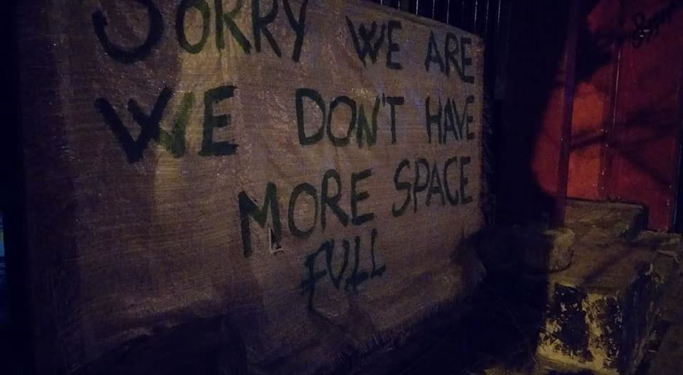
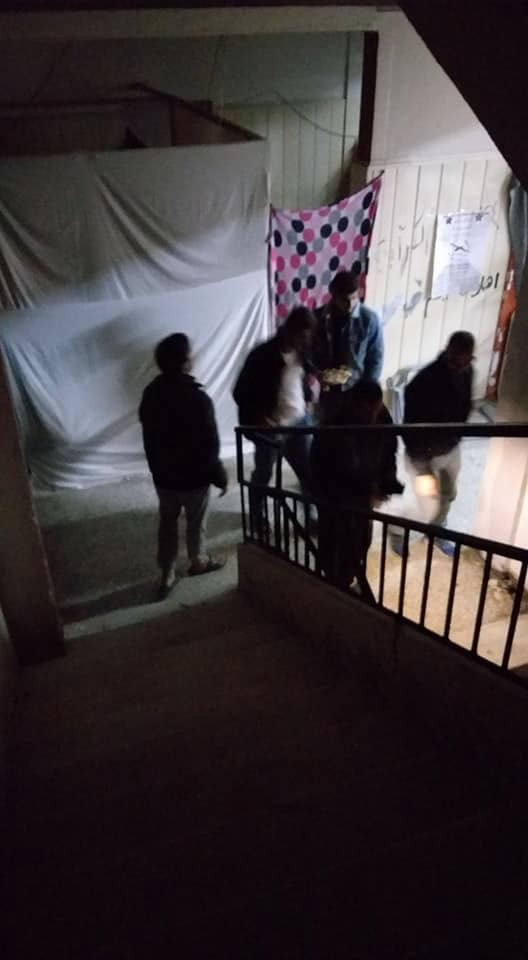

### AYS Daily Digest 14/12/2018 Italy not safe for Vulnerable Dublin Returnees

Housing shortage in Athens /// Demonstrations in Greece /// Detailed report on push\-backs on the Greek\-Turkish border /// Snow on the Bosnian\-Croatian border /// Turkey bombs refugee camp in Iraq…

 \)](assets/dbd81f816f64/1*erSoF4C3HeCqvgyDf2lf4Q.jpeg)

Currently, there are around 1,550 refugees and migrants on the Greek island of Chios\. Though the island’s camp is not as overcrowded as on neighboring Lesbos and Samos, conditions in the camp are dire\. \(Photo by Naser Ahmadi — More info and photos [HERE](https://www.facebook.com/pg/InfoMigrants/photos/?tab=album&album_id=1825814077540369) \)
#### FEATURE — Italy not safe for Vulnerable Dublin Returnees

A new [report](https://ecre.us1.list-manage.com/track/click?u=8e3ebd297b1510becc6d6d690&id=311acb52b0&e=20da37180f) has been published by the Danish Refugee Council and the Swiss Refugee Council stating that Italy is not a suitable destination for vulnerable Dublin Returns\. The Italian Government is not fulfilling the guarantees it made after the decision in [Tarakhel v\. Switzerland](http://www.asylumlawdatabase.eu/en/content/ecthr-tarakhel-v-switzerland-application-no-2921712?utm_source=ECRE+Newsletters&utm_campaign=450e15c4e0-EMAIL_CAMPAIGN_2018_12_14_12_01&utm_medium=email&utm_term=0_3ec9497afd-450e15c4e0-422318649) in 2014 which should ensure that families with minor children will be accommodated in a SPRAR centre upon return to Italy under the Dublin III Regulation\. However, none of the six families with minor children interviewed for the report had been given access to SPRAR centres when they arrived\.

> The Danish Refugee Council and the Swiss Refugee Council find that it is clear, that there is a real risk of vulnerable Dublin returnees not being provided with adequate reception conditions upon arrival in Italy, exposing them to a risk of ill\-treatment contrary to Article 3 of the ECHR and Article 4 of the EU Charter of fundamental rights\. 

The likelihood of ill\-treatment has only increased since the ‘Salvini Decree’, which has immediately resulted in the [expulsion of 26 individuals](ays-daily-digest-03-12-2018-26-migrants-expelled-from-their-centre-and-1-000-more-to-face-the-2d2111eddb3c) with Humanitarian Protection from their housing, and has put thousands more people at risk\.

In total the report contains 13 case studies of people returned under Dublin with different vulnerabilities, including single\-parent families, individuals suffering from mental disorders and victims of violence\.

> Most of the monitored vulnerable Dublin returnees had to sleep on the streets upon arrival in Italy and gained access to reception centres or other shelters only as a result of their participation in the DRMP, as the DRMP’s interviewers often intervened on their behalf\. Upon gaining access to reception conditions, these were often far from adequate to meet their special reception needs, in some cases due to the lack of access to specialised health care\. 

Some countries are now [reviewing](http://www.asylumlawdatabase.eu/en/content/netherlands-no-dublin-transfer-person-disabilities-italy) their Dublin Returns policy to Italy\. It seems clear that in an increasingly right wing environment, even those who are most vulnerable will not be cared for by the state\. All Dublin Returns to Italy should be halted until the authorities can provide adequate reception, but this is unlikely to happen under the current government\.

IRAQ
#### Refugee camp bombed in Northern Iraq

Several local and international sources report that the Turkish army attacked alleged PKK positions in Northern Iraq on the night between Wednesday and Thursday\. A UN refugee camp in Maxmur was bombed in the action, killing three civilian women\.

■■■■■■■■■■■■■■ 
> **[Frederike Geerdink](https://twitter.com/fgeerdink) @ Twitter Says:** 

> > reports of turkish F16s #bombing surroundings of #maxmur camp, a camp of kurdish refugees who fled from #turkey to #iraq in the 1990s, situated outside kurdistan region. saddam placed them there to die but they turned out to be survivors. turkey considers maxmur a pkk camp. 

> **Tweeted at [2018-12-13 18:48:22](https://twitter.com/fgeerdink/status/1073288537322209281).** 

■■■■■■■■■■■■■■ 

Protests were held during the past few days in front of Turkish embassies throughout Europe\.

MOROCCO
#### 50 migrants get legal residence

[Nador New](https://www.facebook.com/Nador.new2019/posts/363625304399532) reports that Morocco has granted legal residence documents to 50 migrants according to Ahmed Sikkim, an official of the Ministry for Moroccans Residing Abroad and Immigration\. The Ministry has also received 56 requests for settlement\. It is five years since Morocco launched the national policy on migration and asylum, which aims to grant residence cards to irregular migrants, mostly from sub\-Saharan Africa\. We ask, why are the numbers still so low?

SEA
#### SOS Mediterranee calls for donations for a new ship

SOS Mediterraneè and MSF are unloading the Aquarius, after being forced to shut the mission down due to the criminalisation of sea rescue\.

■■■■■■■■■■■■■■ 
> **[MSF Sea](https://twitter.com/MSF_Sea) @ Twitter Says:** 

> > "The stories we started to get toward the end were more and more disturbing…the smugglers would just pick someone and shoot them." - @[MSF](https://twitter.com/MSF) Logistician Shaun Cornelius is on board the #Aquarius as teams offload supplies and recount past experiences. https://t.co/LOaxFpTm2X 

> **Tweeted at [2018-12-14 12:36:51](https://twitter.com/msf_sea/status/1073557429860921345).** 

■■■■■■■■■■■■■■ 

They have launched a donation campaign for a new boat\. Participate [HERE](https://sosmediterranee.de/spendemenschlichkeit/) \.

GREECE
#### The new normality: continuous push\-backs on the Evros river

The Greek Council for Refugees, ARSIS\-Association for the Social Support of Youth and HumanRights360 [published](https://www.gcr.gr/en/news/press-releases-announcements/item/1028-the-new-normality-continuous-push-backs-of-third-country-nationals-on-the-evros-river?fbclid=IwAR2YAxXoRoxZlzplZ_gVAaeJXdokzhT_qC_SzYDoLs7_h0P0_ZByMugbDYI) a new report containing 39 testimonies of people who attempted to enter Greece from the Evros border with Turkey\.

The report is a confirmation of what AYS has reported several times in the last few months: the widespread and extensive use of illegal push\-backs, the frequent use of violence, continuous humiliation, and the requisition or destruction of personal belongings\.

Push\-backs are in violation of national, EU and international law, but are used anyway as a constant means of deterrence throughout the EU\. The report also highlights the participation of foreign officials in the implementation of push\-backs on the Greek\-Turkish border\.

As EIN [report](http://IwAR1KUTQVoLHhOHPekUlz7WnI1FR6rEEYglmnE5OSlRcU87DgyIckGktXL7g) , these testimonies come at the same time as the EU’s Committee of Ministers decision to investigate allegations of the impunity of Greek security forces when using potentially lethal force\. The allegations include: ill\-treatment sometimes amounting to torture; absence of effective administrative and criminal investigations; inadequate criminal proceedings and penalties, and in some cases a failure to investigate possible racist motives\.

> “\[…\] I’ve heard of a lot of incidents where people drowned in the river\. We were 3 people travelling together\. We crossed the river at night, around 22\.00\. We were arrested by people wearing masks\. They beat us up and took all our belongings, including our clothes\. When they pushed us back to Turkey, I stayed there for about 17 days and then attempted to cross again\. The pushback was conducted by Greeks and Germans\. In Turkey we were stopped by the mafia, who beat us too\. I know that lots of people pay them money so as to leave unharmed\.”

> \[…\] “The people that caught us were wearing blue uniforms and had guns\. They treated us very badly, swearing at us in English\. Some of them even hit the children\. They drove us to an old room close to the river\. It was a stable\. It didn’t have a proper floor, but dirt\. It didn’t have a lock, and only one window with bars\. All 70 of us were in that space, some people fainted as the space was extremely confined\. They took our clothes, our shoes, and our mobile phones\. They left us our passports and IDs\.”

Read the full report in [English](file:///home/acquacheta/Downloads/REPORT_EN.pdf) and [Greek](https://www.gcr.gr/en/news/press-releases-announcements/item/download/493_f4336ae0c8b3fe2e835de4938495946f) \.
#### How many more deaths?

 , Lesvos](assets/dbd81f816f64/1*42Dfts_3YpC9Jdah22YM3w.jpeg)

[No border Kitchen](https://noborderkitchenlesvos.noblogs.org/post/2018/12/13/how-many-more-deaths-in-europe/) , Lesvos

2216 deaths in the Mediterranean so far in 2018\. The count keeps rising\. No Border Kitchen published a statement demanding the EU to:
- Stop spending millions to kill people
- Stop supporting dictatorial governments
- Stop Dublin Regulations — Stop deportation
- Stop concentrating people in hotspots

> Right in front of our door, people are dying:
 

> just some examples…
 

> – On the 12th of November, a boat on the way to Lesvos capsized, two men managed to swim to shore in Dikili but 6 people died and 4 are missing\.
 

> – Two months ago \(08/10/2018\) nine dead bodies were found and dozens of people are missing\. The boat was trying to reach Lesvos\.
 

> – Also on the way to Lesvos, 6 people, including three babies, drowned on the 29/06/18\. — May 14, Babakale
 

> – Turkey \(just up north of Lesvos\): 7 people died in a shipwreck\. 

> This tragedy isn’t an accident, this is the result of European migration policies, set up since the Schengen deal in 1985\. Strengthening borders and tracking and deporting people stops them from entering Europe legally, and forces them to use perilous routes instead\. 

Read the whole statement [HERE](https://noborderkitchenlesvos.noblogs.org/post/2018/12/13/how-many-more-deaths-in-europe/)
#### New equipment for the Light Without Borders clinic in Moria camp

[Light Without Borders](https://www.facebook.com/lightwithoutborders.org.es/?__tn__=%2CdkCH-R-R&eid=ARAGzjlFeZ36ar046fP_B4shPPFmtnj7UMqNCWwE-LXx_BsDbN0hzpvRzQU4jWUbrzd5W3PkBeCkKd0i&hc_ref=ARR5ILeYC-WnoJrydnlzF0Es-0CknlIuVED_ng4J-zBMJPxCM0CO0ZQcOkMuw0moAKo&fref=nf&hc_location=group) report that new optometry and ophtalmology equipment arrived to the LWB clinic in Moria camp\. The Light to Your Eyes Project will be able to re\-start visits soon\.
#### Antifascist demonstration launched in Mytilene, Lesvos, for next Wednesday

](assets/dbd81f816f64/1*rGncZ9A9NU3BMhryV34Nbw.jpeg)

[Protest against racism and xenophobia — Wednesday 19, 5PM, Central Lyceums, Mytilene](https://twitter.com/_Wiesenthal_S_/status/1073525642568916993?s=19&fbclid=IwAR1KUTQVoLHhOHPekUlz7WnI1FR6rEEYglmnE5OSlRcU87DgyIckGktXL7g)
#### Feminist Demonstration in Athens

On Friday hundreds of people took the streets in Athens\.

■■■■■■■■■■■■■■ 
> **[City Plaza Squat](https://twitter.com/sol2refugees) @ Twitter Says:** 

> > Καμία Ελένη λιγότερη!
——-
Massive demonstration today in #Athens for the murder of #Eleni, a young girl in #Rodos Island, #Greece! She was murdered by 2 men after they rape her! 

No more violence against women! 
Smush sexism and patriarchy! https://t.co/Qws8p0y1nb 

> **Tweeted at [2018-12-14 19:45:11](https://twitter.com/sol2refugees/status/1073665223737991173).** 

■■■■■■■■■■■■■■ 

The march was organised after the rape and murder of a woman on Rhodes island, but also to protest against the conditions that refugee women suffer in refugee camps and detention centre\.

In October three women were found on the Evros river, “a mother and two daughters, and no one ever learned their names, what happened, who murdered them, no investigation was ordered on the military knife that slaughtered them and that was found right next to their bodies\.”

As NoBorder Network [state](https://www.facebook.com/nobordersnetwork/photos/p.2045304645537417/2045304645537417/?type=1&theater&__tn__=-UK-R) :

> Thousands of women are raped, abused and eliminated daily behind the “ consecrated “ doors of the family institution, in the workplaces, on dark roads, in inhumane refugee camps like “ Moria “, in detention centres and prisons\. 

> \[…\] Because not all lives have the same value\. 

#### Homelessness increasing as winter comes close in Athens

As Our House reports, most of the shelters in Athens are full\. Squats are full as well\. As the temperature drops, more and more people are seeking a warm place to stay\.

#### In Solidarity with Lola Gutierrez, Athens, 18 December 2018

#### Help needed at “Single men” squat, Athens

 \)](assets/dbd81f816f64/1*-RkXpxuDjF7g-R8_xh0k1A.jpeg)

“Single Men” squat, Exarchia, Athens \(photo by [SOS Refugiados](https://www.facebook.com/sosrefugiados/posts/2396275273747124?hc_location=ufi) \)

[SOS Refugiados](https://www.facebook.com/sosrefugiados/posts/2396275273747124?hc_location=ufi) is supporting “Single Men” squat in Exarchia with blankets, food, hygiene, repairs, appliances, clothing shoes\. This squat has been active for almost 3 years now and hosts young men with no family, all coming from different countries\. Young single asylum seeking men are too often excluded from accessing basic services, and are not generally prioritised, so places such as this squat are essential\.

> \[…\] in the “single men” squat currently live 80 men [\#refugees](https://www.facebook.com/hashtag/refugees?source=feed_text&epa=HASHTAG&__xts__%5B0%5D=68.ARA9ZxZD3l70qS0ikjLwWvFyEP2LOvI3OH7R2uFRRqyLypGHTrwx7bZT46__4Ct9ZPdf0KFCpzF3dVAhDY1NmK1w4QGppmroZOjIYdyzW1FZlAJYYU2uS2p3Nyq1xacqr3T5Jh3Fw_fk37NJi8-TQnMem2ptt-4cIuXYMBlsOcrvLoitAN7Uo6_OzefZM1PUeC38tnshDTGJJ-PL&__tn__=%2ANK-R-R) alone\.
 

> 80 stories, each one sadder than the last\. It’s tremendously cold in the squat\. 

> If you want to help them you can do it through our account or our
 

> Paypal: Redsosrefugiados@Gmail\.Com
 

> We would need about 1\.500 euros right now for urgent repairs and heating\. Thank you all in advance\. 

Read AYS special: [https://medium\.com/are\-you\-syrious/ays\-special\-greece\-single\-men\-one\-of\-the\-most\-vulnerable\-groups\-38eac963f58e](ays-special-greece-single-men-one-of-the-most-vulnerable-groups-38eac963f58e)

ITALY
#### Demonstration in Rome, Saturday 2pm

A large coalition of organisations launched “ [Get Up\! Stand Up\! Stand up for your rights](https://www.facebook.com/events/365924487547928/) ” demonstration in Rome for Saturday 15th\.

> For social justice — Freedom — No Exploitation —No Racism — Residence permit for everyone 

We ask:
• to regularise everyone’s situation through the release of residence permits;
• to break the link between residence permits and work contracts;
• access to basic income and housing regardless of nationality;
• to repeal article 5 of Lupi law;
• no to the criminalisation of solidarity and those who practice it;
• dignified reception, and respect for residents and workers;
• no to deportations and deportation agreements; 
• basic income for everyone\.

MACEDONIA

Suhel Ahmet and Ahmet Shakir from Bangladesh, have finally been [buried in Macedonia](http://www.legis.mk/news/2688/today-was-the-burial-of-two-migrants-who-died-in-macedonia?fbclid=IwAR2Yff2OFGsrVhuKfwQOm4uxAgtYzt79ismzqPBjfwwk4e6g6yuRL7-uPCw) \. They died on the 25th of June in car accident on the highway near city of Radovish, but it has taken 6 months to get permission for the funeral\. Our thoughts are with their families\.

BOSNIA/CROATIA
#### The Situation is Deteriorating as the Temperature plummets

 \)](assets/dbd81f816f64/1*k8wiMnWzQiPP2_4YJssNmw.jpeg)

Kljuc, at the border between Bosnia and Croatia \(photo by [Crveni Križ Općine Ključ](https://www.facebook.com/profile.php?id=100009318317491&__tn__=%2Cd%2AF%2AF-R&eid=ARD6q87dJ4t0nf9GUmYQ0F6l1cRj2Mii0mR6wh_pJgJtfiFWEf_u1EJnOZlW6TC4Y8Oz0mjF_DSbAYfG&tn-str=%2AF) \)

 \)](assets/dbd81f816f64/1*Vzyn3EszODYj83YPEFVozQ.jpeg)

Kljuc, at the border between Bosnia and Croatia \(photo by [Crveni Križ Općine Ključ](https://www.facebook.com/profile.php?id=100009318317491&__tn__=%2Cd%2AF%2AF-R&eid=ARD6q87dJ4t0nf9GUmYQ0F6l1cRj2Mii0mR6wh_pJgJtfiFWEf_u1EJnOZlW6TC4Y8Oz0mjF_DSbAYfG&tn-str=%2AF) \)

FRANCE

[Solidarité Migrants Wilson](https://www.facebook.com/permalink.php?story_fbid=1040678469466258&id=598228360377940) need volunteers for the distribution of winter clothes in Paris on Monday at 8pm\. For the exact address of where to meet please PM them\.

They are also still distributing breakfast and report that the police continue to confiscate the belongings of homeless refugees, often items they have only received the day before\.

BELGIUM
#### Single men turned away from asylum offices

Local [media report](https://www.vrt.be/vrtnws/en/2018/12/13/asylum-crisis-_emergency-measures-are-urgently-needed/?fbclid=IwAR0xRJDTKASIgKrTnLsfCaIC8GkI9OUiYt_3Ez6hmO7_j24drv7IzWLm-qg) that single men are again being turned away from the asylum office where they are supposed to register\. Local groups are calling for urgent action\. There have been continuing problems since a [quota of 50 asylum claims](http://www.lalibre.be/actu/belgique/des-ong-manifestent-contre-le-quota-reduit-de-demandes-d-asile-par-jour-5c07b7a7cd70e3d2f7150911?utm_source=ECRE+Newsletters&utm_campaign=450e15c4e0-EMAIL_CAMPAIGN_2018_12_14_12_01&utm_medium=email&utm_term=0_3ec9497afd-450e15c4e0-422318649) a day was introduced, which gives priority to women and children\.

THE NETHERLANDS
#### We gaan ze halen — Let’s bring them here

A group of Dutch organisations has set up “Let’s Bring Them Here”, a campaign to bring and welcome asylum seekers into The Netherlands, pressuring the country to respect the relocation quota agreed upon in 2015\.

> In September 2015 the Member States of the European Union agreed to take in a total of 160\.000 refugees from the Greek and Italian refugee camps\. Our country, the Netherlands, promised at the time to grant asylum to 8\.712 refugees\. To date, the Netherlands has taken in a mere 1\.755 of them; a fraction of the promised number\. As of December 2018 the capacity problems in your country and in Italy have not been resolved\. 

As a consequence, a group of citizens and organisations decided to take the matter into their own hands, driving to Greece between the 21st and the 24th of December\. Their intention is to return to The Netherlands with at least 150 asylum seekers\. They ask the Greek PM to make this happen, preparing necessary paperwork and travel document for the selected asylum seekers\.

> We realise the exceptional nature of this request, but hope you will consider it in view of the equally exceptional character of the plight of refugees in Europe\. 

> It is our hope that these 150 people will be the first beneficiaries of a bilateral, humane agreement between our country and yours which intends to bring thousand refugees to the Netherlands for an asylum request\. 

You can read more on [their website](http://wegaanzehalen.nl/) \(in Dutch\) or read the about the convoy in [Arabic](https://gallery.mailchimp.com/8d81f4ffa9beca7e468324daa/images/2781a37f-d236-4fdc-8fa8-df395a805278.jpg?fbclid=IwAR0ETLbDdjHhHjcvChSZuPMp8cgAoMENJB4rtoTix18lz3nNBbamxs9WPm8) , [English](https://gallery.mailchimp.com/8d81f4ffa9beca7e468324daa/files/4a7af522-0358-48cc-b432-74366540e31a/English_Introduction_for_refugees_Solidarity_Convoy_Let_s_Bring_Them_Here.pdf?fbclid=IwAR257EkNHvmJaV5qoWOgsHSZGLtCSDNi9cqcfw7PhSQ2MjjO4jX2C4vkUSA) and [Farsi](https://gallery.mailchimp.com/8d81f4ffa9beca7e468324daa/files/f05c9165-ba74-4475-93a4-d0a4140f034b/%DA%A9%D8%A7%D8%B1%D9%88%D8%A7%D9%86_%D9%87%D9%85%D8%A8%D8%B3%D8%AA%DA%AF%DB%8C_Uitleg_WGZH_vluchtelingen_Farsi.pdf?fbclid=IwAR14zkQH3-fV6EzZKL6Dl7JrLYG-n6mbllCZIpM7t-JRxD5e4RTZcyQ6nhc) \.

You can also participate to their [crowdfunding](https://actie.degoedezaak.org/petitions/haal-1000-mensen-weg-van-de-griekse-eilanden) \.

UK
#### Campsfield Detention Centre has been Closed\!

■■■■■■■■■■■■■■ 
> **[Asylum Welcome 🧡](https://twitter.com/AsylumWelcome) @ Twitter Says:** 

> > Campsfield has closed.
Here is a statement from @[AsylumWelcome](https://twitter.com/AsylumWelcome) 
& a picture from one of our many visits to its detainees. https://t.co/CXZtdDOaSv 

> **Tweeted at [2018-12-14 11:59:01](https://twitter.com/asylumwelcome/status/1073547908925063170).** 

■■■■■■■■■■■■■■ 

#### [Care4Calais](https://www.facebook.com/care4calais/posts/2222869307746014) have a new collection point in Bristol

To contact Bristol drop off please email: fmc@thresholds\.co\.uk

They urgently need donations of:
- winter coats
- warm clothes
- sleeping bags and blankets
- coffee, sugar, chocolate and nuts

We also publish a **weekly overview in Arabic and in Persian** of some of the most important stories we covered during the previous week\.

Here is the [Arabic Weekly News Summary for the week of December 3–9](%D8%AE%D9%84%D8%A7%D8%B5%D9%80%D9%80%D9%80%D9%80%D9%80%D9%80%D9%80%D9%80%D9%80%D9%80%D9%80%D8%A9-%D8%A7%D9%84%D8%A7%D8%B3%D8%A8%D9%80%D9%80%D9%80%D9%80%D9%80%D9%80%D9%80%D9%80%D9%80%D9%80%D9%80%D9%80%D9%80%D9%80%D9%80%D9%80%D9%80%D9%80%D9%80%D9%80%D9%80%D9%80%D9%80%D9%80%D9%80%D9%80%D9%80%D9%80%D9%80%D9%88%D8%B9-%D8%A7-%D9%8A-%D8%B3-30ad27d6325a) \. 
Find here the [Persian Weekly News Summary](%D8%AE%D9%84%D8%A7%D8%B5%D9%87-%D9%87%D9%81%D8%AA%DA%AF%DB%8C-%D8%AE%D8%A8%D8%B1%DB%8C%D9%87-%D8%A2%D8%B1-%DB%8C%D9%88-%D8%B3-%D8%AA%D8%A8%D8%B9%DB%8C%D8%B6-%D8%AE%D8%B4%D9%88%D9%86%D8%AA-%D9%BE%D9%84%DB%8C%D8%B3-%D9%88-%D9%82%D9%88%D8%A7%D9%86%DB%8C%D9%86-%D8%B6%D8%AF-%D9%85%D9%87%D8%A7%D8%AC%D8%B1%D8%AA%DB%8C-1a44a0e29978) for the same week\.
Please, share it with your Arabic and Persian speaking friends\.

**We strive to echo correct news from the ground through collaboration and fairness\.**

**Every effort has been made to credit organizations and individuals with regard to the supply of information, video, and photo material \(in cases where the source wanted to be accredited\) \. Please notify us regarding corrections\.**

_Converted [Medium Post](https://medium.com/are-you-syrious/ays-daily-digest-14-12-2018-italy-not-safe-for-vulnerable-dublin-returnees-dbd81f816f64) by [ZMediumToMarkdown](https://github.com/ZhgChgLi/ZMediumToMarkdown)._
