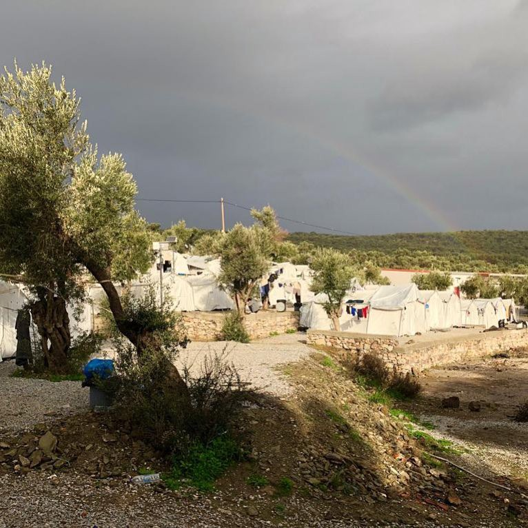
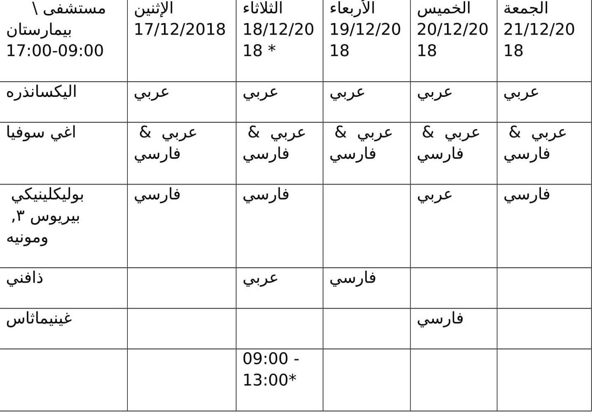

### AYS WEEKEND DIGEST 15–16/12/2018: Croatian Police “Facing the Facts”, but what now?

_Eye\-opening video evidence has been published about collective expulsions from Croatia, but what does this mean in a world of “fake news”? // Italy braces for new punishment against those with humanitarian protection // Belgian authorities force families to queue repeatedly, in a humiliating fashion // Actions in The Netherlands and Sweden\._

Photo Credit: Adil Izemrane, Olive Grove, Moria, Greece…is this hope?

Feature: Camera footage documents mass expulsions from Croatia to Bosnia — now what?

The release of camera footage documenting over 50 collective expulsions from Croatia to Bosnia has made a significant splash in the headlines in Croatia\. Although the EU and Bosnia have had a readmission agreement since 2007, this agreement stipulates that any and all readmissions \(individuals are readmitted if they do not wish to request asylum\) must occur at designated points\. The location of the camera, which is confirmed using metadata, indicates that these returns are not happening at the required border points, furthermore, there are not any officials from Bosnia and Herzegovina present\. The footage was carefully analysed to establish its location\. The group that shared the footage remains anonymous but they will release further footage that made use of thermal imaging cameras \(as most pushbacks occur at night\) in order to better document what is happening\.

Women, children, and unaccompanied minors are also videoed as part of these groups\. Police often wield what appear to be automatic or semi\-automatic weapons as well as batons, occasionally making use of them\. Read the full report and see selected video clips by going to [borderviolence\.eu](https://www.borderviolence.eu/proof-of-push-backs/?fbclid=IwAR1XJJKMWKs7Y8edQOoqGm9xxfzI2Fvyn14zil1YrNp7cuOkaTgGYn0LshY) \.

The ministry of the interior of the republic of Croatia was quick to respond stating that [they work according to the law](https://www.index.hr/vijesti/clanak/mup-o-tajnim-snimkama-radimo-po-zakonu-optuzbe-o-primjeni-sile-cemo-istraziti/2050363.aspx) , and that those seen applying excessive force will be investigated and punished\. The fact that the police can respond in such a nonchalant manner to a meticulously collected mountain of evidence should not be surprising\. The pattern of “doubt and deny” is one that prevails throughout the world\. Question the evidence until it’s undeniable, then blame “a few bad apples” and wait for the attention to pass, meanwhile putting pressure on those who are collecting the evidence\.

We need not remind the readers of the truly shameful treatment of the family of Madina Husseiny, who, after her death resulting from a expulsion to Serbia in November of last year, reported being expelled several more times\. In response to their expulsion being interrupted through the appearance of a citizen of Croatia, who informed police about their presence and who first approached police rather than the family, they were finally prevented from expulsion\. This was followed by them being held in detention, sometimes separated, for weeks\. The citizen of Croatia was charged with facilitating their crossing, on groundless charges, and is appealing the ruling of the court\.

“But do you have any _evidence?”_

The media circus abounds, with, in the case of Madina’s family, internet commenters musing about how careless her parents were, to take her so far from home\. If men leave their families at home and come alone, _“then surely they are either cowards to leave their family in danger\!”_ Or, _“It’s not that dangerous at all back there\!”_ And if people bring their families, _“then they are irresponsible for putting them into a dangerous situation\.”_

Although the care and concern invested into this project, and documenting and countering the smoke and mirrors promulgated by governments is laudable \(the exhaustive details and analysis of the released videos can be found [here](https://www.borderviolence.eu/file-directory/) \), we must be wise and cautious to recognize that even with undeniable evidence, people committed to seeing violence enacted upon those people on the move will find their way\. When backed into a corner, these people and the institutions they inhabit will show their true teeth, betraying the “just wondering” for what it really was all along — a farce\.

Although “we want evidence” is a normal and respectable demand, this must be asked in good faith in order for it to be worth engaging with\. After all, how many condemnations of camps in Greece have been verified and raised? How much of the mountain of evidence that Libya is not a safe country for returns has been ignored in order to pursue a policy of externalizing Europe’s borders? Hungarian officials openly admit to enacting violence upon those found on their territory, and what has been done besides breathless condemnations?

If “where is the evidence” is not asked in good faith, then it is simply a stall for time or a way to try and entrap those raising the concern\.

Now this seems all bleak and quite contradictory, however, it is not with that intention\. Rather, the reminder is that although we should collect evidence, we also must examine the systems that result in evidence being rejected\. Until we take time to examine those systems and ideologies, which go beyond policy initiatives and into the cesspool of the comments section, we will continue to be caught on the back foot\. No amount of evidence is sufficient to those who will just argue that it’s false\. This project is a fantastic start for segments of the population, policy\-makers, and members of law enforcement who are asking questions in good faith\. However, we must also not ignore those who engage in bad faith and dismiss them as “well the haters will hate\.” Engagement does not mean giving them a fair shake, for this is folly\. But rather we must interrogate these ideas and pick apart the mechanisms that make them tick\.

Until we do that, no amount of reports on horrific conditions in Greece, which [we covered here earlier in the week](ays-daily-digest-11-12-2018-at-least-30-000-people-have-died-at-eu-borders-since-year-2000-1b5fe79007d) , or tallies of those who have died attempting to reach safety, or photos of children, lying lifeless on beaches will achieve much\.
### MOROCCO

As an internet personality has quipped “facts don’t care about your feelings” but apparently feelings do prevail when it comes to funnelling money into projects that stop migration\. [Migration researchers have demonstrated that ‘development’ projects do little](https://www.newsdeeply.com/refugees/community/2016/10/31/development-aid-to-deter-migration-will-do-nothing-of-the-kind?utm_source=Refugees%20Deeply&utm_campaign=c64142ab00-EMAIL_CAMPAIGN_2018_12_14_11_24&utm_medium=email&utm_term=0_8b056c90e2-c64142ab00-117452221&fbclid=IwAR2gzXh4ek4subL3ihyR4zpWtssSHH60qXK52Tm0sx9Ac3wTczBnXTkRcIw) , and often encourage, migration\. In a piece analysing European policies for engaging in development in migration\-source countries, researchers summarized that in the face of mass migration, policy\-makers have three choices: to militarize borders, to attempt counterproductive development programs, or to innovate the current visa and immigration scheme to accommodate an increase of migration and truly develop\.

In this context the EU announced [148 million Euros to go into programs](https://www.moroccoworldnews.com/2018/12/260579/eu-e-148-million-support-moroccos-migration-policy/?fbclid=IwAR0veZEiWlLu0Qf9J9YuuW6h6o_CsuLg0qDEu5SukZzbtrRLosKMJvrAuUY) in Morocco in order to attempt to militarize borders and “develop away” migration\. This is one in a long line of “investments” in countries guarding Europe’s fringes, with European money primarily being blown on militarization, returns, and development\. With the death toll at European borders climbing to over 5,000 this year alone, it is unsettling to see that Europe continues the active pursuit of deadly and ineffective attempts to manage migration, rather than to invest in an actual sustainable option\.
### GREECE

Aegean Boat Report posted a weekly retrospective — 13 boats arrived to Greece, carrying 509 people\. 15 boats were stopped and the 594 people onboard were arrested by the Turkish Coast Guard\. Read the full story [here](https://www.facebook.com/AegeanBoatReport/posts/491889451334164?__xts__[0]=68.ARCxkXFbPDBJH7dnG1yFkfOqmrU9Luy6Z6T5XU_ny33oRYH6FVI-QVOX3lqBrDsDOsCvGG48Zj6uX1ubtQyqBKbuL4RCVXA744jL5pCx4p8PwBqNfHP_W2BPN6gHWHu_vR79_9AdTeDV_GKNpj1WF9bVAReRO0R-OiNXo9zNwDJ8eKWAxR_7E1IdJGvrtL8KTRVuXWeZij8Ory8I4t9s4z8CYK4ViLd8InxAmWcw3Q1diJouLj52KfYuT5mYlKnzSYgtCTcxvSSrsA4r4kdbG9VhRxDzRJcOIqr50d71teMXZ2O7cnrIiOqgMUi1zLzR_xAOI_M6zD5ZTMCBgQ7aDmI&__tn__=-R) \.

Below can be found a schedule of interpreters for hospitals in Greece\.

Courtesy of Greek Forum for Refugees
### BOSNIA

According to the UNHCR, there are an estimated 5,300 refugees and migrants in Bosnia and Herzegovina\. The overwhelming majority of them \(4,000\) are in Una\-Sana Canton\. Since the beginning of 2018, there have been 23,000 arrivals recorded\. More individuals are interested in pursuing an asylum claim, but this system is overloaded and inefficient due to contradictory requirements for many asylum seekers who have to register an address in order to gain admission to a reception centre, but require some kind of immigration status in order to properly register\.

Furthermore organizations and volunteers are speaking out against the reports on restrictions of freedom of movement within BiH\. There are now prevalent reports of individuals being barred from boarding trains and busses or even being removed from them partway through the journey\.
### Balkan Weather Report

MONTENEGRO

Predominantly cloudy alongside the coast and in the lower regions, rain with at places thunder in the south and in the rest of the country sleet and snow\. Most precipitation during the afternoon and night\. The wind will be weak to moderate from the south and southeast, in the afternoon or towards the end of the day amplified to strong northern and northeastern wind\. The lowest temperatures are from \-10 to 5 and highest daily from \-1 to 12 degrees\.

SERBIA

Cold and dry in the morning and moderate frost in most places\. Cloudy throughout the day with local snow in the evening and possibly a mix of rain and snow accompanied by frost in the far southwest\. Wind will be mostly weak, changeable in the morning, changing into a northern and northwestern wind\. The lowest temperatures will be from \-9 to \-2 and highest daily from \-2 to 2 degrees\.

BiH

Cloudy with light snow and some rain in the south of Herzegovina\. The wind in Bosnia will be weak from the north and northwest and moderate Bura in Herzegovina\. The lowest temperatures will be from \-6 to 6 and highest daily from \-3 to 8 degrees\.

CROATIA

Mostly cloudy with occasional thunderstorms mostly in the Adriatic and in the mountains\. Along the coast there will be rain, in the interior of Dalmatia, and snow, which can sparsely be in the rest of the interior\. On land, the wind is weak to moderate northeast; in the Adriatic the Bura is strengthening, and in the extreme south is still in the beginning of the southern winds\. Lowest morning temperature of \-6 to \-2, in Slavonia and lower, in the Adriatic from 1 to 6\. The highest daily is between \-2 and 2, in the Adriatic from 6 to 10 ° C\.
### ITALY

After reports that Italy is [not considered safe for Dublin returnees](ays-daily-digest-14-12-2018-italy-not-safe-for-vulnerable-dublin-returnees-dbd81f816f64) and the news that SAR helpers will most likely be charged with facilitating illegal migration, the conditions continue to get worse\. The security decree likely to go into effect in early 2019 will effectively push thousands of people onto the street\. Last Monday, December 10th, there was a meeting of officials who wish to continue these projects that prevent people who have received humanitarian protection from sleeping rough in order to anticipate what will happen\.

> “The Security Decree will no longer allow the reception and the possibility of integration and will remove essential services such as, for example, that of literacy\. 

> In the previous law the holders of humanitarian protection at the exit of the extraordinary reception centers were transferred to the Sprar system to support these people in the process of social integration\. With the Security Decree, the humanitarian protection holders no longer have the right to access the Sprar and therefore from Cad they end up directly on the street\. Among them there are women, children, sick people, victims of violence\. There are about 25–30 thousand people who in the next few months will end up in the street without any assistance and which will fuel insecurity and social conflict, thus achieving the true objective of the law desired by Salvini\.” 

More [here](https://www.facebook.com/L-ALTRA-VOCE-1245970425495921/) \.

As we reported on earlier this week, Italy has already been criticized as not being safe for Dublin returnees by multiple human rights organizations\. This, however, does not seem to matter much to those concerned with the “rule of law” as Afghanistan is also considered safe for deprotations\. Unless we act, it’s unlikely that even this draconian act of aggression against people that is now looming in 2019 will make a dent on whether or not people will be delivered into the waiting arms of the government\.
### FRANCE

A video of hundreds of people attempting to claim their spot to register for humanitarian protection was posted by Solidarity Migrants Wilson\. In the background of the video can be heard commotion from the ongoing protests\.

In the ongoing protests against the French government, it is important to remember those who have long been harassed by French authorities and trapped in an inhumane system that encourages resorting to illegal measures\.

SMW is also in need of donations\!

### BELGIUM

The Belgian office that accepts asylum applications has put a cap on applications at 50 a day\. This queue restarts daily, meaning that some people are repeatedly denied access to asylum and have to continually re\-queue\. Read the full details in the [ECRE](https://www.ecre.org/belgium-barriers-to-registration-of-asylum-applications/) report here\.
### NETHERLANDS

Wij Zijn Hier is organizing a protest today in order to advocate on behalf of people stuck in detention\.

> “Some of our brothers are in detention already for months and we want them to be released\. That’s why we organize a protest in front of the IND office on Monday the 17th of December \(tomorrow\! \) from noon til 3 pm\. You are very welcome to join us and your support will be very much appreciated\. 

> Address: Pieter Calandlaan 1, Amsterdam” 

### SWEDEN

A campaign to stop deportations from Sweden to Afghanistan is launched and underway\. Please follow the [link](https://www.mittskifte.org/petitions/nu-ar-det-nog-sverige-mot-tvangsdeportationer-till-krig?fbclid=IwAR3mqx-dUTMceGYQkI_7AZOK5hP7SP_1KONOvsBOkqUNDN6pHE3eaN6NakE) \(with information in Swedish\) to sign the petition and get involved\!

**We strive to echo correct news from the ground through collaboration and fairness\.**

**Every effort has been made to credit organizations and individuals with regard to the supply of information, video, and photo material \(in cases where the source wanted to be accredited\) \. Please notify us regarding corrections\.**

_Converted [Medium Post](https://medium.com/are-you-syrious/ays-weekend-digest-15-16-12-2018-croatian-police-facing-the-facts-but-what-now-1209e907ff5e) by [ZMediumToMarkdown](https://github.com/ZhgChgLi/ZMediumToMarkdown)._
