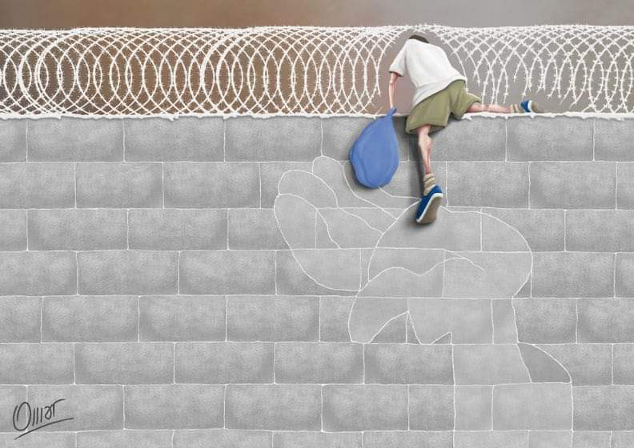
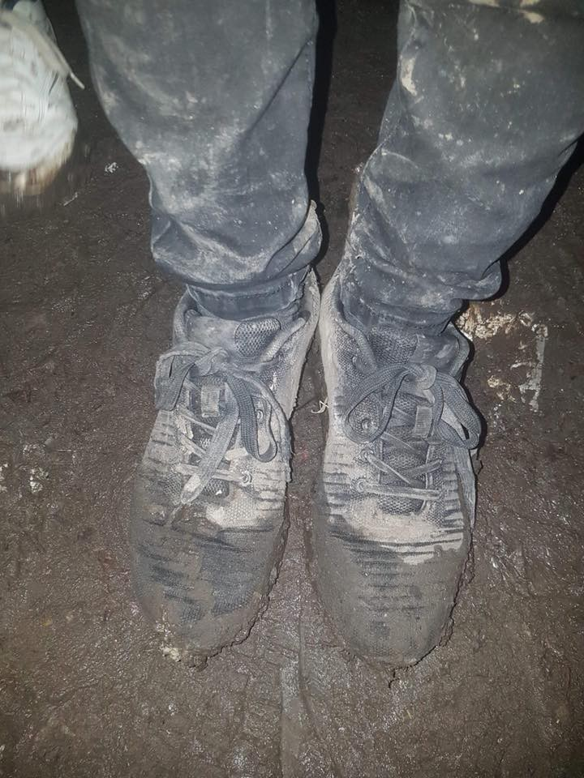
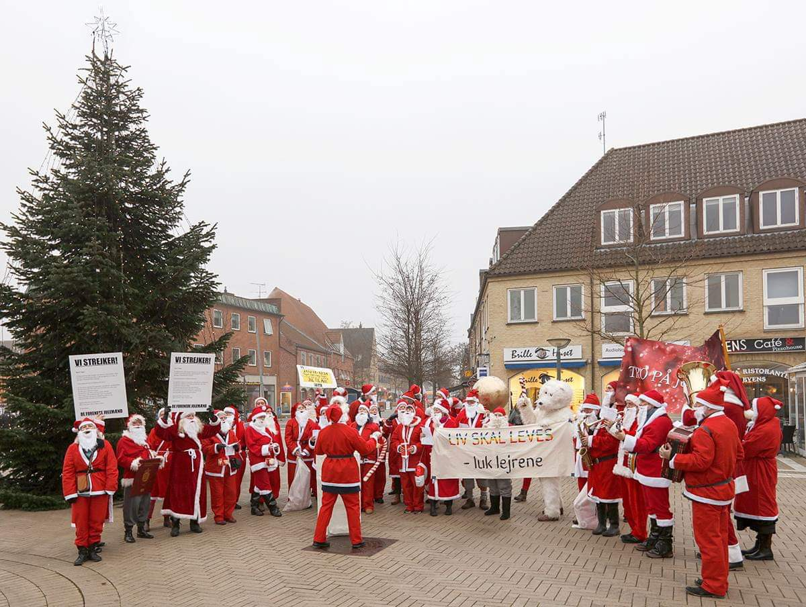

### AYS Weekend Digest 22–23/12/2018 Italy and Malta = “Pure Cruelty”

Eritrean man dies in Libyan detention centre /// Santa Action in Denmark /// Updates and info on Let’s Bring Them Home initiative /// Police keep harrassing people on the move in Bihac area, Bosnia /// Press Release from Sea Watch 3

\(drawing by [Omar Perez / Art Against](https://www.facebook.com/artagainstproject/) \)

FEATURE — Italy and Malta = “Pure Cruelty”

 \)](assets/753359434d7e/1*DOv94NnuLYzrc7YTr3lzIQ.jpeg)

\(Photo by [Pilotes Voluntaires](https://www.facebook.com/pilotesvolontaires/) \)

A two day old baby was rescued along with its young mother from a boat carrying 311 people 57 nautical miles from Malta\. As Malta refused to allow a safe port to the other people at risk, as did Italy, they are now bound for Spain on the Open Arms vessel which has enough food for two days and is on a journey which will take 4–5 days\. Malta stated that they rescued the baby for humanitarian reasons, but then refused to provide the provisions needed to keep the hundreds they had refused safe from hunger, including pregnant women, children and other small babies\. Hypocrisy doesn’t cover it\.

Luckily another rescue vessel, the Astral, will bring them supplies of medicines, blankets and food, but the situation remains difficult and neither boat will reach Spain until the 28th of December\.

■■■■■■■■■■■■■■ 
> **[Open Arms IT](https://twitter.com/openarms_it) @ Twitter Says:** 

> > #OpenArms ha un porto di sbarco: Algeciras. Abbiamo davanti 5 giorni di traversata #Med.
Domani, la #NottedellaVigilia,  si incontrerà con #Astral che porterà cibo, coperte e medicine. 
Quest'anno #Natale lo trascorriamo in mare. 
#United4Med https://t.co/63PnbHrDIS 

> **Tweeted at [2018-12-23 18:47:17](https://twitter.com/openarms_it/status/1076912140538335235).** 

■■■■■■■■■■■■■■ 

The Italian and Maltese governments have recently been criticised by [Amnesty International](https://www.amnesty.org/en/latest/news/2018/08/italy-malta-stop-playing-with-refugee-and-migrants-lives-by-closing-ports/) for closing ports to NGO boats:

> European governments must stop playing with human lives\. Italy and Malta’s disgraceful refusal to allow refugees and migrants to disembark in their ports is pure cruelty\. These individuals have braved dangerous journeys and inhumane conditions in Libya only to be stranded at sea as governments shamelessly abdicate their responsibility to protect\. 

Yet both did so again this weekend, [Italy more than once](http://“AYS Daily Digest 21/12/18 — Italian authorities leave refugees to drown or be returned to Libyan…” by Are You Syrious? https://link.medium.com/i87uEojlUS) \.

After Salvini had engaged in his usual bout of hate speech \(if only there was a law against it…\) on Twitter, the most important political platform for the most intelligent politicians, Oscar Camps of Open Arms replied:

■■■■■■■■■■■■■■ 
> **[Oscar Camps](https://twitter.com/campsoscar) @ Twitter Says:** 

> > 🕥Matteo Salvini, la tua retorica e il tuo messaggio, come tutto in questa vita finirà. Però sappi che tra qualche decennio i tuoi discendenti si vergogneranno di ciò che fai e che dici. 

> **Tweeted at [2018-12-22 12:15:14](https://twitter.com/campsoscar/status/1076451093385789440).** 

■■■■■■■■■■■■■■ 

What a nice way of saying something we are all thinking…

LIBYA
#### A detainee dies after being sent back to Libya

■■■■■■■■■■■■■■ 
> **[Sally Hayden](https://twitter.com/sallyhayd) @ Twitter Says:** 

> > Here’s a picture of the latest refugee to die in an “official” Libyan detention centre, after being forced back to Libya under EU policy. Friends tell me Haftom was a “quiet, smart” man. He tried to get to Italy earlier this year &amp; died this week, apparently of a heart problem.1/ https://t.co/0gJAU4aVha 

> **Tweeted at [2018-12-23 19:20:42](https://twitter.com/sallyhayd/status/1076920553078996992).** 

■■■■■■■■■■■■■■ 

As Sally Hayden [reports](https://twitter.com/sallyhayd/status/1076920553078996992?fbclid=IwAR3T8tt2_j6e_A9dFqycOtRZQlee9QHyW6towZJr0ZQYkKpjjnXV6NEUBR4) , it is the sixth death in Libyan detention centres since mid\-September\. Haftom was detained in the DCIM \(Department of Combating Illegal Migration\) \-run Zintan detention centre\. He was a dental doctor who had fled the Eritrean dictatorship\.

He was one of the many people arbitrarily and indefinitely detained in the 26 detention centres controlled by the DCIM\. UNSMIL \(UN Support Mission in Libya\) staff, authors of a recent [report](https://unsmil.unmissions.org/sites/default/files/libya-migration-report-18dec2018.pdf) , “have consistently observed severe overcrowding, lack of proper ventilation and lighting, inadequate access to washing facilities and latrines, constant confinement, denial of contact with the outside world, and malnutrition \[…\] torture and other ill\-treatment, forced labour, rape and other forms of sexual violence perpetrated by DCIM guards with impunity\.”

Read more about the report in our feature for last Thursday’s [digest](http://“AYS DAILY DIGEST 20/12/2018: European union connection with unimaginable horrors in Libyan…” by Are You Syrious? https://link.medium.com/GChET3mkUS) \.

Shamelessly, Libyan Naval Spokesman Ayoub Qasim criticised the report, media outlets [report](https://www.libyaobserver.ly/inbrief/libyan-naval-spokesman-criticises-un-report-migrant-situation-libya) :

> “All international organizations and others are applying double standards in implementing their plans, aimed at settling migrants in Libya, by playing the human rights card, from time to time,” Qasim said in a press statement\. 

…This speaks for itself:

■■■■■■■■■■■■■■ 
> **[Sally Hayden](https://twitter.com/sallyhayd) @ Twitter Says:** 

> > More on the really bizarre &amp; distressing #migrantsday events in Libyan dcs today - in Tajoura, refugees were reportedly forced to reenact a boat sinking so the Libyan authorities could act out how they claim to come to their rescue, in front of visitors. 1/ https://t.co/n6pvGIopXN 

> **Tweeted at [2018-12-18 22:42:01](https://twitter.com/sallyhayd/status/1075159275301937152).** 

■■■■■■■■■■■■■■ 

MOROCCO
#### Moroccan authorities ban AMDH event

The Nador authorities have prohibited AMDH Nador from organizing a public conference on the violations of the rights of migrants and refugees in Nador\.

> They want to shut us up\. 
 

>  They want no one to mention these serious violations\. 
 

>  They want to hide truth and reality\. 
 

>  That’s the state of rights\! \! \! \! \! \! 

More info and original statement in Arabic [here](https://www.facebook.com/AmdhNador/?__tn__=%2CdkCH-R-R&eid=ARDHTXAmb6HyS3jZahNoChZkNrR5y_nbCRbRs6IKMF5yhrDKV5XwZFsVeRCtuZ77-p0_H9wqH3pelUNO&hc_ref=ARSi4zNKXVQL_hKxm89F_b7fwn8TXx-Eql9iKtk7_7swCJi6YLPiU-2WixEuMVIj3sQ&fref=nf&hc_location=group) \.
#### Video of the unhygienic conditions in Arekmane detention centre for sub\-Saharan people

SEA
#### Updates from rescues in the Western Med

Following what was reported in the digest of December 20th, last Thursday six boats were rescued off the Spanish coasts\. According to the UNHCR, “at least 25 people are believed to be dead or missing, including a pregnant woman”\. On one boat 33 people were rescued, but 12 dead bodies were found onboard and 12 more were missing; on a scecond boat one dead body was found while rescuing 56 people\.
#### Sea Watch 3 press release

Berlin, 23\.12\.2018 
Christmas at sea: 344 people rescued within 24 hours — no safe port for the rescued people on Sea\-Watch 3

Since Friday, 344 people have been rescued within 24 hours by the fleet of the \#United4med Alliance, which also includes Sea\-Watch\. While the Open Arms with 311 people on board is on her way to Spain, the Sea\-Watch 3 is still denied a safe port\. A simple solution is possible, as more than 30 cities and several federal states in Germany alone have agreed to accept people rescued from distress at sea\. Sea\-Watch calls on the federal government to find a solution before Christmas\. Those who invoke Christian values are now obliged to act\.

On Saturday, Sea\-Watch 3 saved 33 people from drowning, including several children\. They are now safely on board the Sea\-Watch 3 where they can receive medical care\. Less than 24 hours earlier the Open Arms had already taken in over 300 rescued people\.

> To escape torture, slavery and death in Libya, these people have no choice but to take on the dangerous route across the central Mediterranean Sea at Christmas\. At these temperatures, the chance of survival in the event of a shipwreck is well under 24 hours, we are incredibly glad that we found them in time\. 

> \[…\] At the moment, the situation on board is stable, some of the rescued people help us to keep an eye out in case more people are in distress at sea\. \[…\] To avoid risks for the rescued, we call on the German government to find a solution before Christmas\. If Seehofer wants to defend Christian values, he now has the opportunity to do so\. _\(Philipp Hahn, Head of Operations of Sea\-Watch 3\)_ 

Read the full press release [HERE](https://sea-watch.org/en/news/)
#### Mission Lifeline Have some Unexpected New Friends

■■■■■■■■■■■■■■ 
> **[MISSION LIFELINE](https://twitter.com/SEENOTRETTUNG) @ Twitter Says:** 

> > For reasons beyond our understanding, @[Armed_Forces_MT](https://twitter.com/Armed_Forces_MT) have become very intimate with our ship recently. Maybe it's the Christmas spirit or the start of a long, beautiful friendship... We look forward to finding out. P22, you can always contact us on Channel 16 if you get lonely! https://t.co/H5IWX1vTQQ 

> **Tweeted at [2018-12-23 11:34:58](https://twitter.com/seenotrettung/status/1076803346693001216).** 

■■■■■■■■■■■■■■ 

GREECE
#### Arrivals

Figures from the [Aegean Boat Report](https://m.facebook.com/AegeanBoatReport/posts/495388010984308?hc_location=ufi) : 
Four boats arrived on the morning of Saturday 22nd to the Greek Islands\.

The first boat was picked up outside Farmakonisi 07\.30 by Frontex\. People are being transported to Leros port\. 56 people\. No breakdown available\.

The second boat was picked up outside the airport, Lesvos south 08\.00\. 50 people\. No further information available\.

The third boat landed on Thermi beach, Lesvos south east, 08\.30\. 20 people\. No breakdown available\.

The fourth boat arrived on Chios this morning 04\.00, picked up by HCG outside Chios\. 28 people — 10 children, 5 women, 13 men\. 
 
On Sunday 23rd another six boats arrived\. 
The five boats that arrived on Samos: 
1\# 64 people; 2\# 31 people; 3\# 35 people; 4\#61 people; 5\# 6 people 
No further information available\. 
Also one boat was picked up outside Farmakonisi by Frontex 03\.30, transported to port Leros\. 37 people\. No breakdown available\.

The Aegean Boat Report are also doing a [fundraiser](https://www.facebook.com/donate/220832525460104/?fundraiser_source=external_url) to raise money for toys for the children detained on the Greek islands\.
#### Locals distribute food to people in Thessaloniki

■■■■■■■■■■■■■■ 
> **[Giannis Papanikos](https://twitter.com/JohnPapanikos) @ Twitter Says:** 

> > A #refugee girl receives mandarins distributed by volunteers, at the city of #Thessaloniki, Dec. 21, 2018. The local food market organized a surplus food distribution event with volunteers distributing food.
Photo : @[JohnPapanikos](https://twitter.com/JohnPapanikos)
#refugeecrisis #migrants #refugees #photography https://t.co/OsqvMaf7Pr 

> **Tweeted at [2018-12-22 07:31:59](https://twitter.com/johnpapanikos/status/1076379808647561216).** 

■■■■■■■■■■■■■■ 

ITALY
#### November updates from UNHCR

New data has been published by the UNHCR about [arrivals](https://reliefweb.int/report/italy/italy-sea-arrivals-dashboard-november-2018) and [situation](https://data2.unhcr.org/en/documents/details/67396) in the country:
- 23,011 people arrived between 1 January and 30 November 2018, an 80% decrease from last year \(117,042\) \. 3,485 are children\.
- 2,137 people died or are missing at sea\.
- 56% of people arriving departed from Libya \(91% in 2017\); other embarkation points are in Tunisia, Turkey, Greece and Algeria\.
- People registered at landing sites are mainly from Tunisia, Eritrea, Iraq, Sudan, Pakistan, Nigeria, Cote d’Ivoire, Mali and Guinea\.
- 48,339 new asylum applications were lodged in the country in 2018\.

Criminalisation of sea rescue, refusal to offer safe ports, empowerment of Libyan coast guards — these effects of Italian migration criminal policies started with minister Minniti and continued by Salvini can be seen in the drastic reduction of arrivals, and in the increase in the death risk connected to the crossing\.

■■■■■■■■■■■■■■ 
> **[Filippo Grandi](https://twitter.com/FilippoGrandi) @ Twitter Says:** 

> > The fact that less refugees and migrants arrive in Europe across the Mediterranean should not make us forget that many of those stranded in Libya continue to suffer terrible abuses. Rule of law however will not be possible without solving the conflict in Libya. 

> **Tweeted at [2018-12-23 07:25:20](https://twitter.com/refugeeschief/status/1076740523313057792).** 

■■■■■■■■■■■■■■ 

Also this data doesn’t take into account the effects of the conversion into law of the Salvini decree\.

BALKANS
#### Balkan Weather Forecast for 24/12

MONTENEGRO

Moderately to entirely cloudy, rain from time to time, during the afternoon or towards the end of the day rain transiting into snow in the north\. More precipitation during the afternoon and night\. The wind will be moderate to strong blowing from the south\. In the late afternoon the wind will turn to a northern and northwestern and become stronger, during the night strong\. The lowest temperatures will be from \-1 and 10 and the highest daily from 4 to 16 degrees\.

SERBIA 
More cloudy wiht rain, in the mountains sleet and snow, in the morning first in the north and west and later the rest of the country\. Later the rain will stop and it will clear up in the north\. The wind will be moderate, from time to time strong, in the morning southwestern and during the day turning into a northwestern\. The lowest temperatures from 0 to 7 and highest daily from 8 to 13 degrees\.

BOSNIA

More clouds coming from the north and spreading fast throughout the country as the day progresses with rain in the lower parts\. Snow is expected in the regions higher than 800 meters above sea level\. Before noon the wind will be weak to moderate blowing from the south\. As the precipitation starts the wind will turn to a northern one\. The lowest temperatures from 2 to 8 and highest daily from 6 to 12 degrees\.

CROATIA

Moderately to entirely cloudy with local rain\. In the afternoon the rain will stop beginning in the north\. The wind will be weak to moderate from the southwest, turning to a northwestern and northern during the afternoon\. Alongside the coast a weakening southern wind, and during the afternoon moderate to strong Bura with stormy gusts\. The lowest temperature from 1 to 13 and highest daily from 8 to 15 degrees\.

BOSNIA AND HERZEGOVINA
#### Police carry on moving people out of Bihac canton

 \)](assets/753359434d7e/1*vaMZ9xrhgtRy642mmQ4Q2A.jpeg)

Velecevu \(Photo by [Crveni Križ Općine Ključ](https://www.facebook.com/profile.php?id=100009318317491&__tn__=%2CdlC-R-R&eid=ARBbe9mDKPUWXZoYy0FKYcUY3L-E7d5rahUNqwaitPuEb3aHxZS5ynTYlG8r39F4eAnXMLZXMCvSnNZd&hc_ref=ARSuHNg-SW1LCO056dicb_n8x-Xq7zn7bO4hdBtoSqc15IJm6E8qgiTi89Ey3jQM0Hc) \)

The Red Cross of Kljuc [report](https://www.facebook.com/permalink.php?story_fbid=2243466815973907&id=100009318317491&hc_location=ufi) that Bosnian police continue stopping people on their way from Sarajevo to Bihac\. People are left by the road sometimes for over 24 hours\. Local residents and the local Red Cross are helping\. On Sunday, 9 people were found in Velecevo where they had been left by the police\. In the group there were 2 minors and some were injured\. In the evening, after IOM and Bosnian authorities found an agreement, the whole group was taken to Bihac to the newly established centre in Bira\.
#### Severe lack of heating in Usivak camp

Over the weekend, AidBrigade delivered winter clothes in Usivak camp, near Sarajevo\. From their [report](https://www.facebook.com/aidbrigade/videos/2225491157729916/?fref=gs&dti=1652972374920129&hc_location=group) :

> \[…\] From the moment Usivak camp opened, there was insufficient heated space for refugees, and people have been sleeping in tents in a container ever since\. There is also a heartbreaking shortage of shoes \(imagine wearing flipflops in the snow and being forced to wait outside hours every day just to get food\), blankets and jackets\. 

FRANCE
#### Calais Action is asking for donations

The situation in Calais remains desperate and dire\. Forgotten by the media, the government and by most of the public, people on the move walk around with freezing wet feet and nowhere to turn for warmth\.

 \)](assets/753359434d7e/1*6W42RNhdm4tEcAP1ILbXRw.jpeg)

Calais \(Photo by [Calais Action](https://www.facebook.com/aidbrigade/videos/2225491157729916/?fref=gs&dti=1652972374920129&hc_location=group) \)

Last week Action Calais [distributed](https://www.facebook.com/aidbrigade/videos/2225491157729916/?fref=gs&dti=1652972374920129&hc_location=group) waterproof boots\. There will be another aid run in the next few days\. If you would like to contribute you can do so here: [https://mydonate\.bt\.com/charities/calaisaction](https://l.facebook.com/l.php?u=https%3A%2F%2Fmydonate.bt.com%2Fcharities%2Fcalaisaction%3Ffbclid%3DIwAR1vIVA32y2Hmqg2Y_pCg6c_dvy9xM0j9CriN1fqUEwGo5cOiZEAn6dL6pM&h=AT0343ucdtuSxd6ruAhsbYX8GLF6iQm21EXxEBJ_Gm0c6MBKDr3I7qtIfFd5kMiy3Dwuv0KtNkrzK87mhQw91uYQ6IjJHJY9ZFEEOXjaLnlVbUSkJXQ5eATo2OYyC4_WnzBqurqM3BJDrBj8mMh-RUQ0BR_Rhbna1RVUNFA034IzFPDMpb3O8nTQMfLWB2Fm1ZntLA2IyEgjfyYDd3uZa8gTV8R6rlwo5ZFg6wywVPxgdoYgRSfINJofWa-NSNooq6x7BLPaYHIQIiNejxVNnJ5zyap3KSDNSqvF69aGSa_Szqsuzk5dfzcexWVdGEnMmC-Ca5T6USnMNpAZbrzazzxmGYKQP8Mi5SJ9o4waZk3OkNhVLC0S_9bkNqrp9FJ_n5sAupL15GMq809OvIZUHpHLtN5A46Bywwhoc6O_I4ciW78Un3Y-UMsq2D61PcPSfMxjBbnUOPXuqXj3Kgaj3Ligizc35HFxGzoQfZfsVuV1lYBLwEo-LkJSaV3HTBEQG77zPPaMHYRzjywZ7WwudTOm1GSzMJsY5QbVZSUUo-oYqjynHd5S8Id2Rp29S-idEGuCeLukvIQL8TO9mgAdhAD_FgVOs7dwY6miKiW_WdhLt-Lgbz1d11JLNMYjNw)

GERMANY

Local media [report](http://www.ekathimerini.com/235982/article/ekathimerini/news/only-7-migrants-returned-from-germany?fbclid=IwAR36tGV1r7DXfl0hZfcGPXBbY4XNOEK1K8Ff8vSK30DW82FJdhUY4iFqwZU) that only seven of 1,500 refugees that Greece agreed to take back from Germany as part of a bilateral agreement in August have been returned, according to data from the German Interior Ministry\. The deal concerned refugees in Germany who had originally applied for asylum in Greece\. In return, Berlin agreed to receive 2,900 refugees from Greece as a part of efforts to reunify families, but so far only 345 have been sent to Germany\.
#### Fundarising for Jugend Rettet legal expenses

[Jugend Rettet](https://www.facebook.com/JugendRettet/posts/985834928292407) is having a [fundraiser](https://www.facebook.com/events/418536515345722/?acontext=%7B%22source%22%3A3%2C%22source_newsfeed_story_type%22%3A%22regular%22%2C%22action_history%22%3A%22%5B%7B%5C%22surface%5C%22%3A%5C%22newsfeed%5C%22%2C%5C%22mechanism%5C%22%3A%5C%22feed_story%5C%22%2C%5C%22extra_data%5C%22%3A%5B%5D%7D%5D%22%2C%22has_source%22%3Atrue%7D&source=3&source_newsfeed_story_type=regular&action_history=%5B%7B%22surface%22%3A%22newsfeed%22%2C%22mechanism%22%3A%22feed_story%22%2C%22extra_data%22%3A%5B%5D%7D%5D&has_source=1&__tn__=K-R&eid=ARBUwaU1hIMETVeqkDTJpeMwQZLjnNzpx7PJPn1eobpN2VgldqQPGpQMxTBM_Pp1O1w4R2ZtiJGv4V3Y&__xts__%5B0%5D=68.ARDG40SnMqAP42f3mUJolg0pdlgztHGsPAmFvvrNAYj8djKSSP4fyUxl3kaiqENkWzoq0hifUC98qjGHWgDcvv5EJEy-FSgKpNLLm0F30Zt6ANWnpG5avXvdfkjtzapjAMGQ0KMgtwWjPdLljF9Guw9xZXD9IQGWlfYY4M2z_SG1A9KystzGpg_x7wMC_zemLDSOeDx9Jit3B0t2VqZziD-pkJ1ChGvLcwrGVp2_H0PqGR_q670fId7IIhdIlktYTpTqlJmCljSZjhFGpIuDmxrgDcnGMscukMaj3OBsidpQChM-TqQC_MALr2NTRp7a65KJGB7SvTbxpjnvJ1F0lGA) at the Limes Music Café in Bonn\. The money will cover legal fees for our former crew members who are currently under investigation by Italian authorities, in their attempt to criminalise sea rescue\. For donations: [www\.jugendrettet\.org/spenden](https://l.facebook.com/l.php?u=http%3A%2F%2Fwww.jugendrettet.org%2Fspenden%3Ffbclid%3DIwAR0_kGrSStfihqUhUOE2UPtVGqYBgitAHjV4miFXgrk1D36oW5VD7ypCwGY&h=AT1OU9fyOI_Kae-lPsCrqulDFgvZZ9Agp1piD4qun0oGw_k-LJBI8IL-YzCK-_Ko8HzYmo697up191RllemyvIl3lSA1lZXP9JNStHX6Ka8fpWHWlIHA2x14Bfmk6wQfO6vvlv9ACzB50ZkqS0ag7uhcSM6AGNoi4aldJiVFVSFT6Ihx8CQFp1d8hHHzjS7faW5oKM8VKgOHw3LIS-SlsVvfv2vfq3mFLjKUag14RBDz9Ga6oEdDkUU0M3a1rVXG73zuVidJAyqzAw4_Q9FS7PkBoS-ew6D041wFzN4JWTbW4QGfcuS46_Ixk0P_QT2RtuIuC4vzQ7U1qEl0xH7gXZ-gc05QG62LEo1KSC5VIVmr7jxOle7HUdPK4Z4bruQfzDfffMoYG-oB7i0VIH0ATYzMxzPvY6tvuWp4FyjeT4lRoy7fkW1S7dYe9U0NZr-aXKqnDO4eNaTGm5Nv_AeUpuDhl8sPWAcQkTS73JM5RTAYWS-130b0w9Q8qTOpGbecm2kmL_GjWhu-sS-njIqch99v_Trs6wybkO5WXtX0qr-cEfsJyxq8rR1nQRZtAMGvfyUqpX2A9ojQ_qWgsxRBORX8f8I48UusH6ilzrjfQHXY)

THE NETHERLANDS
#### Let’s bring them home updates

As reported last week, [Let’s Bring Them Home](https://www.facebook.com/WeGaanZeHalen/) organised a convoy of vehicles to drive from Amsterdam to Athens\.

At the moment of writing they have arrived in Athens and are driving to the Greek Parliament\.

This initiative has created a lot of noise and discussion\. Let’s Bring Them Home stated that their intention is to bring 150 people back to The Netherlands with them, and for this reason they published an open letter addressed to A\. Tsipras, the Greek Prime Minister\. As reported by media, they were warned by authorities that their plan could amount to human trafficking\. We stand in solidarity with initiatives shining a light on conditions of people living in camps throughout Greece and it is important that these Dutch activists have decided to take the matter in their own hands, pressuring governments to live up to their promises\. We also need to stress the symbolic character of this initiative, and the risk to raise false hopes in the asylum seekers community in Greece\.

Follow LBTH [here](https://www.facebook.com/WeGaanZeHalen/) for more info; they will have a pot\-luck public meal and a series of events on Monday\!

DENMARK
#### Santa will Strike until all these Humans get Passports

Local media [report](https://politiken.dk/kultur/art6921907/100-julemænd-vælter-ud-af-propfuld-bus-i-værdigheds-aktion-ved-hegnet-til-Sjælsmark?fbclid=IwAR3N17suFLRH6_p3-QpTXHWVHrVnTBBwb0OZYPe0ysPyZPuE7z-hjroGCQ4) that the Santa Action by art activist group [De femten](https://www.defemten.dk/?fbclid=IwAR3at3gSxUC4V18Tbxa2nILFOWmUUXf8UjmR2uu9AgAEjZm6BJ4YZxujVQs) \(The Fifteens\), during which hundreds of Santas climbed the fence of Sjælsmark deportation centre to play with the kids and cheer up the people there, went well\. The action was allowed to remain peaceful, no police or guards intervened\.

> No children behind the fence\. 
 

> Santa will strike until all these humans gets passports\. 

At the same time some Santas went to visit the integration minister with a wish list for Christmas, which included a humane asylum politics, a full stop on discriminatory rhetoric and a humane life for all\. 
There have been ongoing protests against the conditions in Sjælsmark for the last few weeks\.

Read our previous report [here](http://“AYS Daily News Digest 17/12/18: What is a signed agreement for people freezing in&out of the camps?” by Are You Syrious? https://link.medium.com/WwXkEMBjUS) \.

In solidarity with the Danish Santas\! \(Something we never thought we’d write in an AYS Daily Digest…\)

**We strive to echo correct news from the ground through collaboration and fairness\.**

**Every effort has been made to credit organizations and individuals with regard to the supply of information, video, and photo material \(in cases where the source wanted to be accredited\) \. Please notify us regarding corrections\.**

**If there’s anything you want to share or comment, contact us through Facebook or write to: areyousyrious@gmail\.com**

_Converted [Medium Post](https://medium.com/are-you-syrious/ays-weekend-digest-22-23-12-2018-italy-and-malta-pure-cruelty-753359434d7e) by [ZMediumToMarkdown](https://github.com/ZhgChgLi/ZMediumToMarkdown)._
