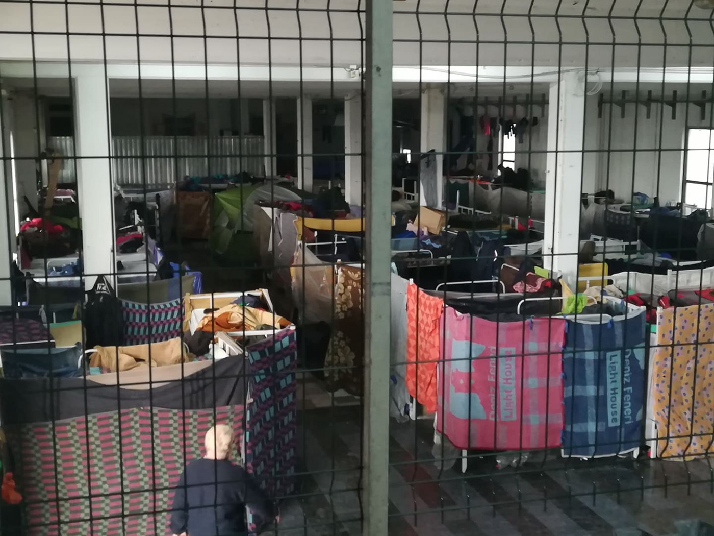
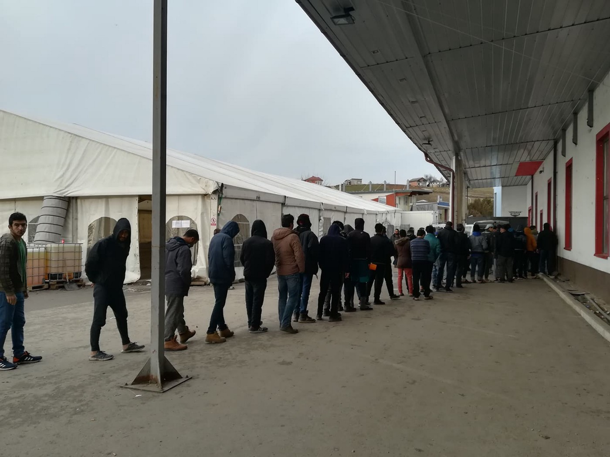
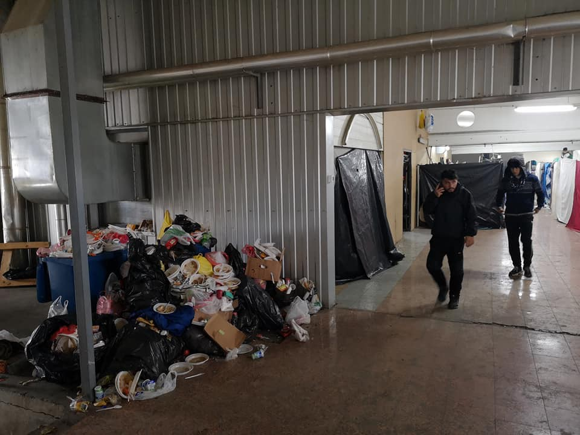
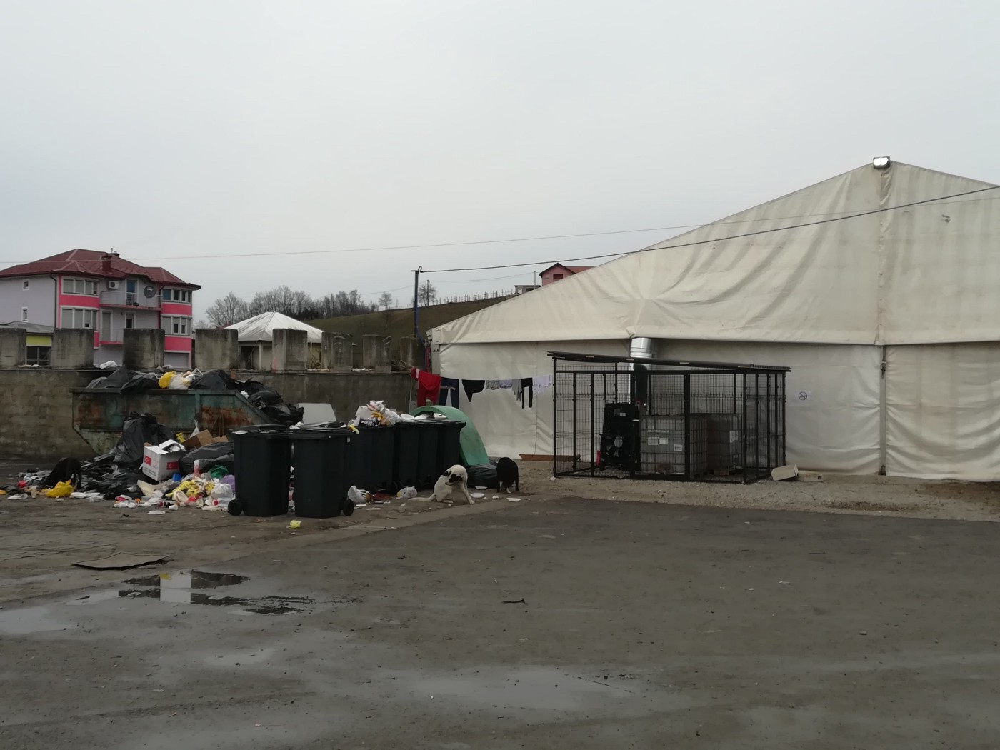
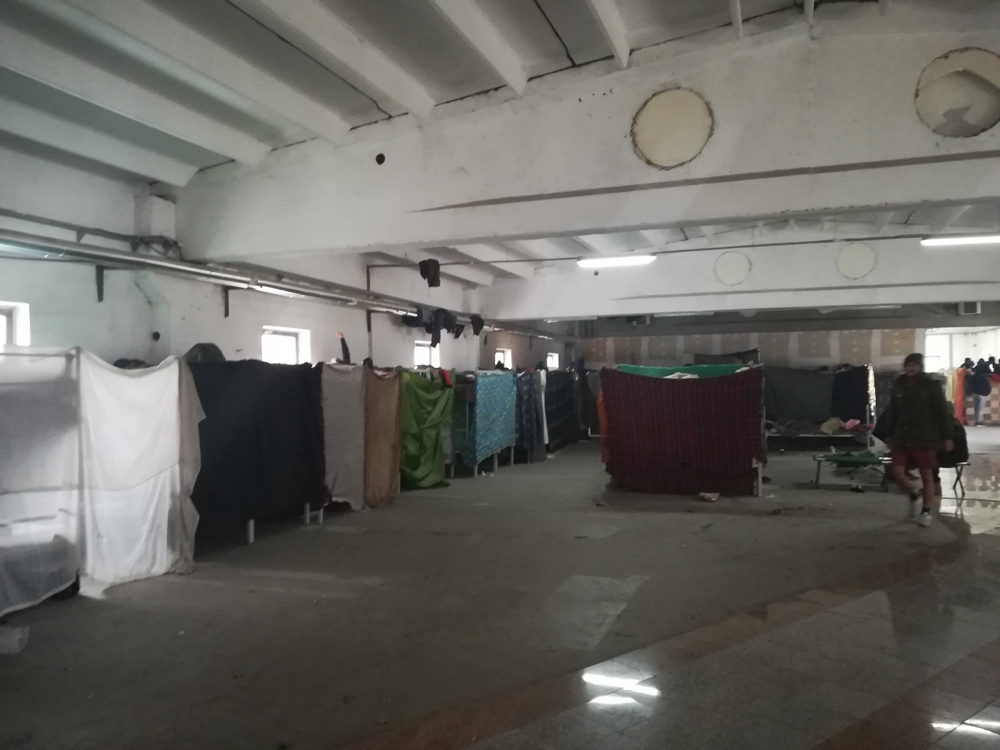
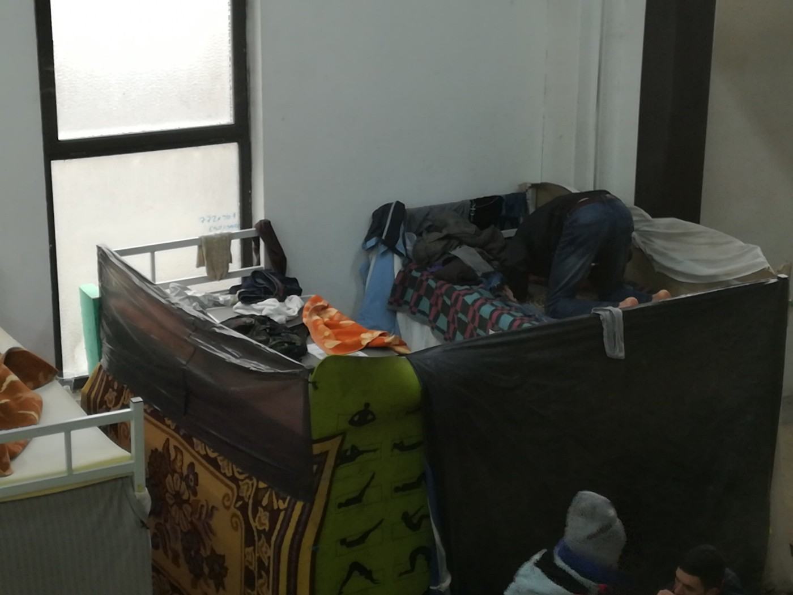
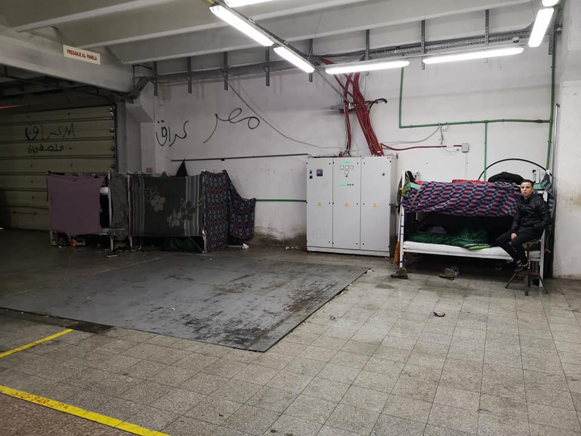

### AYS DAILY DIGEST 26/12/2018: Humiliating living conditions in IOM\-run centre in Bosnia

_Ugly and dangerous, are two words to describe Miral temporary reception centre in Velika Kladuša // We bring you pictures from this place // 57,273 asylum seekers and refugees are registered in Libya // Since 22 December, a boat with 22 people is missing // Desperate situation in Chios // Predictions for 2019 from Info Park, Belgrade_

Miral factory where about 700 people are living\. Photo Zarka Radoja\.

Temporary accommodation centre Miral in Velika Kladuša is the ugliest and most frightening place where asylum seekers stack in Bosnia and Herzegovina are living\. Not that other newly open centers in Bosnia are good, but this one is the worst\.

The place, like many others in this country, is run by the International Organization for Migrations \( [IOM \- UN Migration](https://medium.com/u/664cb26312d4) \), but many other big international organizations are present inside\.

Due to the lack of basic living conditions, or any privacy, people live under extreme stress, and high tensions are almost palpable for anybody who approaches it\.

Foot line in Miral\. By Zarka Radoja

Simply put — UN agencies and state agencies in Bosnia are running the place below any living standards\.

The centre was created in October, after big protests at the border with the EU\. For 10 days, about 300 people protested at the Maljevac border crossing, demanding that the borders be opened for a safe passage\. The border remained closed, while the exhausted and deeply disappointed group was transferred to Miral, a former PVC factory\. In addition, with the first snow people who were living in the Trnovi make\-shift camp were transferred to Miral, and the number of residents more than doubled over the next several hours\. People were moved in even though there were not even minimal conditions for them at the time\.

According to the information available, IOM “Camp Coordination” and “Camp Manager” and “Migrant Assistants” are present at the Miral facility 24 hours a day, and IOM staff facilitate the daily operations of the site, including food distribution, cleaning and coordination with partners providing other services\.

IOM provides cleaning and maintenance staff\. Photo by Zarka Radoja\.

IOM further provides cleaning and maintenance staff, as well as security personnel \(a local private security agency\) 24/7\. The UNHCR is present inside, and their partners, while MSF maintains a mobile medical team\.

The place has three showers and 32 toilets for about 700 people\.

Many people have left Miral, and those who have stayed are desperate\. Some try to spend a day in the town of Kladuša where they go for the showers \(run by [No name Kitchen](https://www.facebook.com/NoNameKitchenBelgrade/) volunteers\), and for food or NFI at the solidarity kitchen and free shop run by both locals and volunteers from [SoS team Kladuša](https://www.facebook.com/SOSTeamKladusa/) \(most of the people complain about the quality of the food in Miral and prefer the food at [Latan’s restaurant](ays-special-locals-of-velika-kladuša-put-international-organisations-to-shame-5d4ba6b8eb2b) \) \.

In general, the atmosphere is becoming more hostile to people on the move, but also to the locals who are helping and the international volunteers\. Places owned by locals are often visited by inspectors or the police, while international volunteers are more often stopped and their documents checked\.

No privacy at all in Miral\. Photo by Zarka Radoja\.

Since the beginning of this year, over 23,000 people were registered in Bosnia and Herzegovina\. A vast majority managed to find a way out and to continue on their journeys, but many have decided to stop in Bosnia, or even return back to Serbia or Greece after the many violent push\-backs from the EU border police, or due to the fact that a majority of the reception centres in Bosnia are not even decent\.

The European Commission allocated over €7,000,000 this year for assistance to people on the move through Bosnia\. All the money is being distributed by the IOM, UNHCR and UNICEF\.

At the moment, there are about 5,000 people in Bosnia, but the exact number is almost impossible to count\.
### Libya

According to [UNHCR figures](https://data2.unhcr.org/en/documents/download/67423) , 57,273 asylum seekers and refugees are registered in Libya\. Out of this number, 3,591 individuals are in one of the accessible Libyan detention centres\.

A programme for evacuation has been going on since late 2017, but so far only 
2,879 persons were transferred to Niger \(2,202\), Italy \(415\) and the ETC Romania \(262\) \.
### Sea

Since Saturday, 22 December, a number of rescue teams are looking for 11 men and one woman who disappeared in the sea\. The [Alarm Phone](https://www.facebook.com/watchthemed.alarmphone/posts/2282177888723108?__tn__=K-R) was alerted that the rubber boat left from Tangier/Morocco \(Cap Spartel\) in the early hours of Sunday, 23 December\. They informed the Spanish Search and Rescue organisation Salvamento Maritimo \(SM\) at 4:50 am CET about the situation and provided them with the GPS coordinates of the boat\. Alarm Phone claims that SM rejected responsibility and shifted it to the Moroccan authorities, but also the Moroccan Navy did not rescue the people\.

_“The situation on board deteriorated and grew more dangerous but at least we were able to remain in contact and receive new GPS coordinates which we passed on to both the Spanish and Moroccan authorities so that they could launch a Search and Rescue \(SAR\) operation\. We were able to receive the last GPS coordinates at 1 pm but still, at that point, no SAR operation had been launched\. At 2\.35 pm, SM sent a helicopter to search for the vessel but they were not able to find it though they searched throughout the afternoon\. If they had taken such action without delay \(more than nine hours after they were first alerted by us\), the 12 people might have been already found\.”_

Before the Alarm Phone lost the touch with people on the boat, they were somewhere at sea, in urgent distress, with waves of more than 1 meter high and water entering their vessel\.

Sea rescue teams are rays of hope for people who are taking this very dangerous journey, dreaming about a better life\. We must never forget that, among other rights, we all have a right to dream\.

### Greece

Since 2015, the [European Commission has awarded](https://reliefweb.int/sites/reliefweb.int/files/resources/20181219_managing-migration-eu-financial-support-to-greece_en.pdf) over €816\.4 million in emergency assistance to Greece\. The emergency funding comes on top of the €613\.5 million already allocated to Greece under the national programmes for 2014–2020 \(€328\.3 million from AMIF and €285\.2 million from ISF\) \.

The story that aroused many comments is now over\. [Dutch campaigners](https://www.dutchnews.nl/news/2018/12/asylum-campaign-group-returns-from-greece-without-refugees/?fbclid=IwAR1_-Ks8cdLOGMc32gXgz4eo21jGtp11hE46hBd1AHdbvU_RjQcQcL-28dg) from the initiative “We will bring them back” who drove overland to Greece to pick up 150 refugees are returning to the Netherlands empty\-handed\.

After they arrived in Greece, none of the officials they tried to meet with responded to their requests\. Their idea was to bring the refugees to the Netherlands in a fleet of some 30 cars\. It remained solely a symbolic action by a group of EU citizens\.

In the meantime, two Romanians were arrested on 24 December in Thessaloniki and have been charged for smuggling\.

[According to police](http://www.ekathimerini.com/236032/article/ekathimerini/news/two-arrested-on-migrant-smuggling-charges?fbclid=IwAR3AqptDFMykHHX2jgZrkQIzxI1z3EP-9yQTqUyoObfwh1Gzy8HvQvNFPho) , a 34\-year\-old man and a 27\-year\-old woman were arrested while they were leaving a warehouse on the city’s outskirts where 44 people are living\. Each of them, allegedly, paid €1,700 to reach Thessaloniki\.
### THE BALKAN WEATHER forecast for 27 December

MONTENEGRO
In the south, mainly sunny and slightly overcast\. In the north, fog and low clouds in the morning, during the day changeably cloudy with sunny intervals\. Winds weak to moderate, locally gusting for short periods of time, mostly from the north\. Low temperatures from \-10° to 4°C and the highs from 0° to 14°C\.

SERBIA
Light local morning frost, intermittent fog in the lowlands and along the rivers\. Moderately cloudy to overcast during the day, with rising temperatures\. The wind will be weak to moderate from the northwest\. Low temperatures from \-4° to 2°C and highs from 4° to 9°C\.

BH

In the north, east and centre of Bosnia, cloudy during the morning and slightly to moderately cloudy in the rest of the country\. Fog or low clouds in the centre and east of the country during the morning\. As the day progresses it will gradually clear up throughout the whole country\. A weak wind, in Bosnia from the northeast and in Herzegovina from the north\. Low temperatures from \-4° to 4°C and highs from 1° to 10°C\.

CROATIA

Inland partially to predominately sunny\. Local morning fog\. Winds mostly weak, locally moderate, from the northwest\. Low temperatures from \-5° to 7°C and highs 4° to 14°C\.
### Montenegro

Police arrested two men suspected of the human trafficking of refugees/migrants, both citizens of Montenegro\. Both are suspected of illegally transporting six migrants from Serbia to Montenegro and then taking a large amount of money from them and keeping them locked in a building on the outskirts of Bar, reports news agency SRNA \.
### Serbia

The international smuggling network is completely controlling the migrant situation, and a new wave of refugees arriving at the Balkans may be expected already next March when a large number of families will start moving from Turkey, reports Gordan Paunović, executive director of Info Park for the local media\.

“ _There is no geopolitical game by the major powers or by the countries on the migrant route, there are only the interests of a fantastically organized smugglers’ network that is pulling the strings all the way along the route by corrupting police and customs services, even in those countries with the most “steady” border, such as Hungary or Croatia,”_ said Paunović\.
### France
#### Marseille

According to a press release issued by L’équipe d’animation du groupe local Cimade de Marseille, the building at 59 Avenue of St\. Just 13013 Marseille has been requisitioned to provide shelter for unaccompanied minors and families\. This occurred on 18 and 19 December\.

Although the numbers are still small, they are expected to increase\. A partial motivation for the requisitioning of this location is to highlight to the authorities their failure to fulfill their promise, which was to ensure that no unaccompanied minor or family would be on the street by the end of 2018\. The property belongs to the diocese of Marseille and the archbishop has not, as of yet, requested any expulsion\. Instead they have been taking the opportunity to contact the relevant authorities and urge them to fulfill their obligations to these needy people\. In the meantime, one can support those here through the following donations:

Needs are important:
\- Sheets, pillowcases, and especially blankets
\- children’s clothing \(ESPECIALLY 0—a woman is ready to give birth—up to three years\)
\- food
\- hygiene products
\- financial participation to contribute to water, electricity and heating costs
And, of course, it’s important to come here for a night or a few hours in the day\.

For more information, please call 07 53 42 32\.
#### Paris

The Paris Refugee Ground Support reported on a terrifying attack against people sleeping rough\. It appears that a group came in the night, slashing open tents and attacking sleeping people, robbing them and forcing them to abandon their location in fear of losing their lives\. It appears that the perpetrators were in search of resources in order to feed their addiction\. Where there is misery, addiction thrives, and where addiction thrives, violence is close on its heels\. PRGS was able to help people return and clean up during the day, and recovered a few belongings which are now in the hands of their rightful owners\.

Solidarity Migrants Wilson is in desperate need of volunteers\!

If you are ready to help serve dinner \(or dessert, or simply tea and coffee\), please come to 139 avenues du Président\-Wilson\! \!
### UK/Channel

Around forty people were intercepted while attempting to cross the English Channel on Christmas Day\. Four boats were found by the UK authorities, and one was rescued by the French Coast Guard — this boat held two children\. Those rescued by the French maritime authorities were transferred to English custody\. There has been an increase of boats attempting to make the dangerous journey across the channel, and the holiday season often sees an increased push of people attempting to move\.

**We strive to echo correct news from the ground through collaboration and fairness\.**

**Every effort has been made to credit organizations and individuals with regard to the supply of information, video, and photo material \(in cases where the source wanted to be accredited\) \. Please notify us regarding corrections\.**

**If there’s anything you want to share or comment, contact us through Facebook or write to: areyousyrious@gmail\.com**

_Converted [Medium Post](https://medium.com/are-you-syrious/ays-daily-digest-26-12-2018-humiliating-living-conditions-in-iom-run-centre-in-bosnia-174c30250862) by [ZMediumToMarkdown](https://github.com/ZhgChgLi/ZMediumToMarkdown)._
