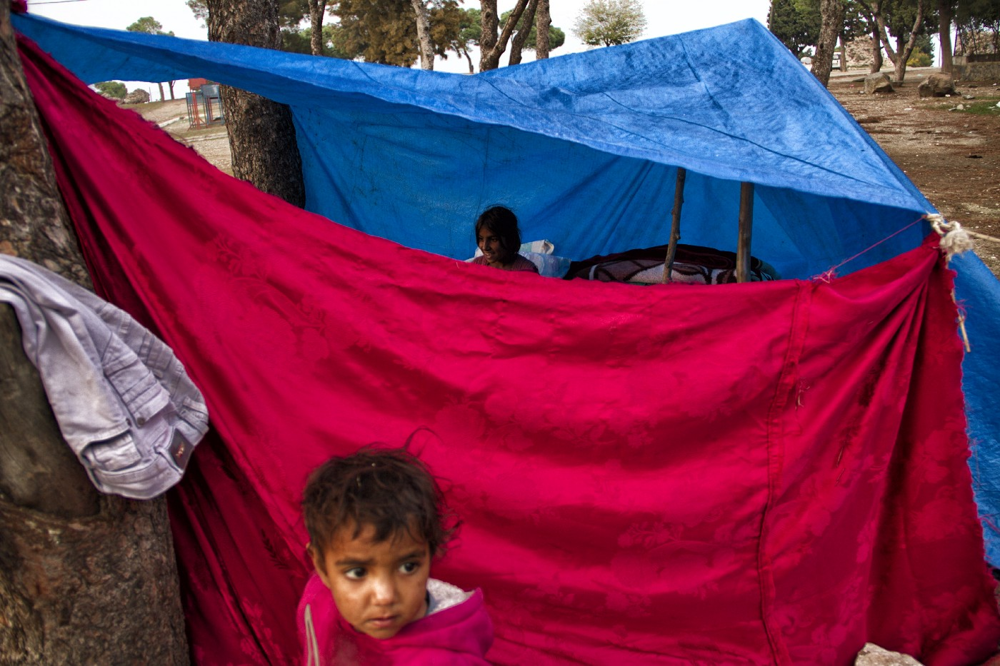

### AYS SPECIAL: **2018 Panorama of Refugee Rights in Turkey**

_Once known as a country that itself produced immigrants, Turkey has become the largest recipient / destination for refugees in the seven years since the inception of the war in Syria, the country with which it shares the longest land border\. According to official counts, 4 million refugees, of which 3\.6 million are Syrians under temporary protection status, currently reside in Turkey\. The largest numbers live in border towns such as Şanlıurfa, Kilis, Gaziantep and Hatay and, due to better employment opportunities, in large western metropolises such as İstanbul and İzmir\. A total of 144,000 Syrians live in Temporary Shelter Facilities \(ie\. camps\. \) After this brief and statistic\-heavy information easily available through the UNHCR website, let us turn to the realities of refugee and refugee rights issues in 2018 Turkey\._

Photo by Sinan Kılıç\. Family from Kobane, Syria living in a tent in Kadifekale, İzmir\.
### **Integration**

Following an initial approach best characterized as a mercurial “everyone is our brother; our doors are open to all” attitude that only two years ago led to discussions about offering citizenship to Syrian refugees, the current need to legitimize Turkey’s military forays into Syria have in turn brought about a new phase of promises to “send 3\.5 million Syrians back home\.”

The Turkish government, which in the past seven years has shown no signs of implementing or of following an official policy of integration, has recently introduced a new policy: “they came, they stayed, they will leave \(ie\. they will be forced to leave when we provide the right circumstances\. \)”\. Such statements are most often made by President Recep Tayyip Erdoğan\. One danger is that once assurances are made that protected zones have been implemented, the possibility of mass returns becomes very real\.

There have practically been no changes in terms of integration policies between 2011 and 2018\. Employment opportunities continue to be dominated by cheap labour and exploitation\. Rates of child labour are extraordinarily high\.

**Of the total number of refugees, 1\.7 million are women and 1\.74 million are children\. While 640,000 school\-aged children appear to be officially registered in school, 400,000 are not\.**
### **The Issue of Naturalization**

The transience and lack of official status, which by all accounts is one of the most vexing issues for refugees in Turkey, has been turned by the government into a political argument used for any and all occasions\. At the same time for these four million people, leading an existence utterly deprived of the most basic rights and governmental responsibilities opens a path towards a future of insecurity\.

While following the 1951 Geneva convention in not granting official refugee status to those coming from any countries outside of Europe, Turkey granted citizenship to 55,000 Syrians in the calendar year 2018\. Under normal circumstances, citizenship is granted after 5 years of residency in Turkey to those satisfying certain criteria such as fluency in the language\. However these conditions were suspended, and with no transparency as to who, how or within what criteria, citizenship was granted to Syrians\.

Soon after his recent announcement that all Syrian children born in Turkey would be granted citizenship, Interior Minister Süleyman Soylu retracted his statement with no further explanation\.

A significant development in 2018 has been the fact that, in order to be the sole arbiter and decision maker in all refugee\-related affairs, the government transferred registration and determination of eligibility for all refugees from the UNHCR to the General Directorate of Migration Affairs \(Göç İdaresi Genel Müdürlüğü\. \) This transfer brought with it the question as to how and within what mechanism administrative procedures affecting hundreds of thousands of people would be conducted\.
### **Hate Speech**

Certainly, the context in which refugees are most visible within Turkish media is that of hate speech\. In a country in which elections have routinely been taking place every six months, politicians have opened the gate to a climate of xenophobia by plying the electorate with rhetoric amounting to the message: “They are our brothers and we have opened our doors to them\. They will therefore do whatever we ask of them, and we retain the right to send them back at our will; do not fear”\.

Throughout their election campaigns, all opposition parties other than the pro\-Kurdish HDP heightened the anger and hatred of the electorate by repeating the mantra “Refugees must leave\! We cannot care for them”\. Following Turkey’s military forays into Syria, the government and opposition parties supported a view among Turkish citizens that “our soldiers fight on their behalf while they live the good life in our country\.”

This view in turn led to unprecedented numbers of street fights between Syrians and Turkish citizens in 2018\. **In Turkey, which ranks high in the global list of intolerance, a man was killed in the western city of Sakarya on December 22 only because he responded in the affirmative to the question “are you a Kurd?”** In a country that has not learned to live in peace with its own citizenry of Kurdish descent since its inception in 1923, it is easy to imagine how unforgiving the attitude can be towards Syrians\.
### **Turkey and the European Union**

Following the 2016 Turkey — EU agreement, the European Union and Turkey, which has been eagerly awaiting membership, became equal partners in a strategic solution to the issue\. Thanks to this suddenly re\-imagined balance, the government has taken to rejecting any involvement or even constructive suggestions on the part of Europe\.

For this reason, it is insufficient to view the agreement as a scandal only within the context of the refugee issue that it addresses\. What has in fact been torn down is nothing less than the world Europe had prided itself on constructing with a human rights\-inflected perspective\.

**In the year 2018, we can see the consequences of the EU\-Turkey agreement with clarity:**

> 1\. Closed borders 

> 2\. 4 million refugees imprisoned in Turkey and forced to work in conditions akin to enslavement, with complete deprivation of rights and freedoms, subjected almost every day to hate speech, and lacking in any hope for the future 

> 3\. A government able to both uninhibitedly do all that it wants, and then use the agreement as a trump card whenever Europe criticizes its rampant human rights abuses 

> 4\. Thousands left unable to tolerate this system and in search of any way out; 167 deaths by drowning within Turkish waters 

> 5\. Tens of thousands of people lucky enough to make it alive to the Greek islands, who are then trapped for years in absolutely inhumane conditions 

Despite all this, the only statement made by European officials in November 2018 concerned the lack of transparency as it pertains to spending the 3 Billion euros given to the Turkish government for this purpose\.

There could have been no better solution to the problem…\!

In conclusion, the 2018 calendar year has been one of equality in terms of human rights within Turkey\. It has been a year in which existing rights were lost, a year in which anyone whether citizen or refugee could be arrested, and a year in which opposition could be voiced under no conditions\.

**\( _By Dilan Taşdemir, Refugee rights activist_ \)**

**We strive to echo correct news from the ground through collaboration and fairness\.**

**Every effort has been made to credit organizations and individuals with regard to the supply of information, video, and photo material \(in cases where the source wanted to be accredited\) \. Please notify us regarding corrections\.**

**If there’s anything you want to share or comment, contact us through Facebook or write to: areyousyrious@gmail\.com**

_Converted [Medium Post](https://medium.com/are-you-syrious/ays-special-2018-panorama-of-refugee-rights-in-turkey-f8ab3da2a69) by [ZMediumToMarkdown](https://github.com/ZhgChgLi/ZMediumToMarkdown)._
