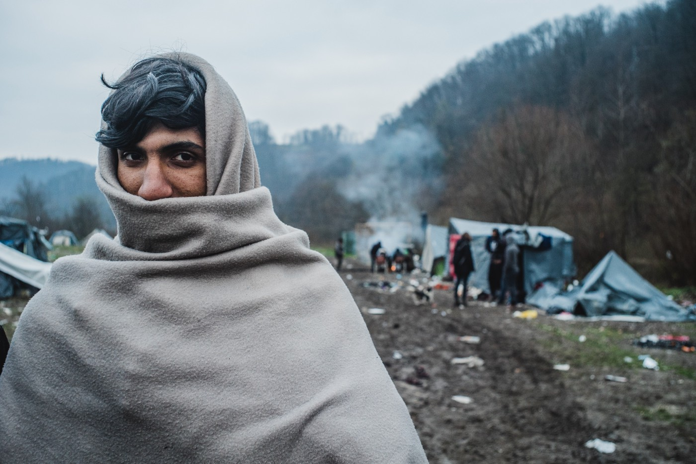
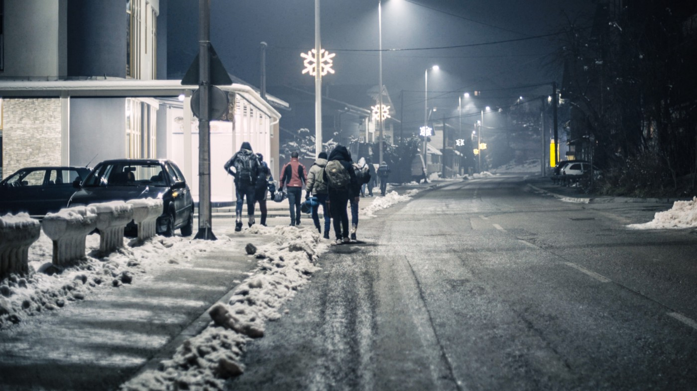
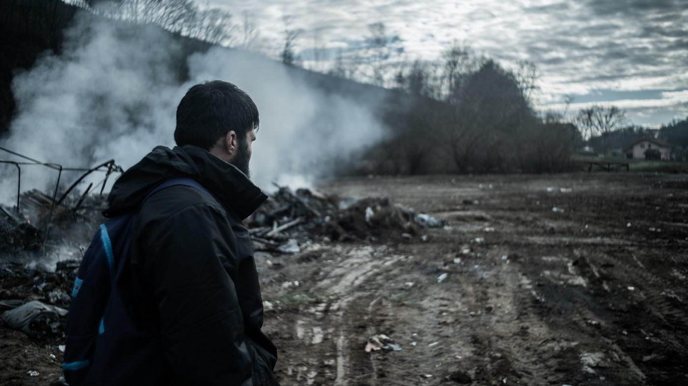

### AYS SPECIAL: **Violent year for refugees at the EU borders**

A man wrapping himself into a blanket to keep warm in the makeshift Trnovi camp that lies just on the northern Bosnian border with Croatia\. Photo by Luca Bonaventura

**Velika Kladuša, Bosnia and Herzegovina** — Hundreds of people passed through 2018 sleeping under plastic sheet shelters in north\-western Bosnia\-Herzegovina\. Living amongst the cries of street dogs and the smell of human excrement, they gathered their strength before attempting to cross\. The nightly sounds of a helicopter and gunshots pulsing out from the nearby Croatian border provided an ominous reminder of the violence waiting for those trying to step into the European Union\.

_“I hate this sound,”_ said Farhan \(27, Algeria\), pointing at a helicopter flying under the spring sky above the camp\. “ _My heartbeat always speeds up and I get flashbacks of the “game”; walking in a forest in Croatia and trying to cross to Italy\. I never reached, just got beaten and robbed by Croatian police and ended up back here\. But they can beat me again, I will never stop trying because I have no other choice; walk or die\.”_

For many, border crossing games ended up deadly while they drown in a river or froze to death\. Most deaths remain undetected or ignored by authorities\. Those detected are often buried without names along the Balkan route, like a 19 years old Chakib from Algeria who was buried in Zvornik\. Photo by Luca Bonaventura

Farhan is like the other 23,000 people who entered Bosnia\-Herzegovina since the beginning of 2018 with the intention of moving through the country in pursuit of safety and asylum in European countries\. Left with no legal options of transit towards Europe, these individuals play the border “ [game](ays-special-from-bosnia-the-game-5a56eb2e9a6e) ,” a term by refugees and migrants to refer to irregular border crossing attempts\. Crossing from Bosnia through Croatia and Slovenia towards Italy is the final step towards safety for many people who have been on their journeys for months and even years, escaping wars, climate change and poverty in North Africa, the Middle East and South Asia\.

While playing the game, most are detected by Croatian or Slovenian border authorities and violently pushed back to Bosnia without the opportunity to access asylum procedures\. The voluntary aid organisations \( [No Name Kitchen](https://www.facebook.com/NoNameKitchenBelgrade/) , Balkan Info Van, [S\.O\.S\. Velika Kladuša](https://www.facebook.com/SOSTeamKladusa/) \) register between 50 to 100 people being pushed back from Croatia to north\-western Bosnia each week\. In some ways, this violence appears to have intensified over time\. According to the reports about violent push\-backs complied by No Name Kitchen over two years, during this year, 84% of people pushed back from Croatia experienced physical violence from authorities, in contrast to 40% in 2017\.

Violent push\-backs are the product of a border doctrine which systematically denies the rights of individuals to claim asylum\. All are unwelcome after they cross the border, including women and children\. _“One \[Croatian\] policeman hit me that I fall on the ground, and after he kept hitting me by a baton,”_ Fatima \(47, Iran\) told us while holding the hand of her teenage son and trying to hide from the summer heat under the plastic tarp of her tent\.

_“After every hit he was laughing\. I was begging them, please, I am alone woman, just with my son\. I need your country to help me\!”_ she said while showing the bruises and scratches around her body and crying\.

Fatima sitting in her tent in the Bosnian makeshift camp Trnovi, after she and her son were push\-back from Croatia\. Her 15 years old son lying next to her is what kept her walking towards Europe\. Photo by Enzo Tomasiello

As 2018 progressed, push\-backs became more systematic and organised\. In the spring, people on the move reported that Croatian police officers in blue uniforms damaged their phones, hit them with batons, and occasionally stole their possessions while pushing them back to Bosnia\. During the summertime, push\-backs began to be carried out by special police units which are referred to by camp residents as “ _commandos_ ” — groups of officers dressed in black uniforms, wearing black ski masks\. With the introduction of these units to the field, reports began to stream in of increasingly brutal practices\. People described to be handed over to these units after initially being captured in Slovenia or Croatia and then driven to secluded areas of the Bosnian\-Croatian border and beaten\.

_“They \[Croatian police\] put all 40 people into one van\. There was no oxygen inside\. They were driving so fast that all people were vomiting,”_ Oman \(64, Iraq\) described us his third push\-back this autumn\. _“When we got to the border, they opened the door and pointed torch into our eyes that we got blind\. After, they took us one by one and were hitting us by batons and kicking us\. They were shouting at us to go back to Bosnia\. I was running away and could hear the sound of a pistol in the air\.”_

After the first snow fell, people also described to be taken their shoes and clothes off, and made to walk in snow back to Bosnia\.

After each violent episode at the border, people return with new bruises, fractured bones, and open wounds to marginal living conditions in refugee camps around northern Bosnia\-Herzegovina\. Sleeping in abandoned houses and underneath plastic shelters, people rest before they leave for their next border game\.

Some have reported being pushed twenty or thirty times in 2018 alone\.

Men leaving for their next game after the first snow fell in Velika Kladuša\. Photo by Luca Bonaventura

Davor Božinović, Croatian Minister of Interior, has [routinely denied](https://rm.coe.int/letter-croatia-interior-minister-2018-10-en-and-hr-versions/16808e3b09) and discredited accusations of violent treatment towards people in transit\. No investigations have been completed and no perpetrators have been punished until the end of the year\. This apathy has been echoed by figures within the EU as well — German Chancellor [Angela Merkel has praised](http://www.balkaninsight.com/en/article/croatian-pm-talks-with-german-chancellor-about-future-of-croatia-western-balkan-08-28-2018) the Croatian border authorities for an “excellent and professional job of border protection,” in line with EU standards\.

Few in the EU institutions, including [Elly Schlein](http://www.infomigrants.net/en/post/11895/eu-parliament-members-demand-interrogation-of-croatia-s-treatment-of-migrants) \(Italian MEP\), or and [Dunja Mijatović](https://www.rferl.org/a/council-of-europe-urges-croatia-to-probe-reports-of-police-violence-against-migrants/29528115.html) \(Council of Europe Commissioner\), raised their voices to investigate the violations of human rights at the EU borders\. But this is not enough to stand against the majority in Brussels allowing Croatia to continue brutal border enforcements for the whole Europe\.

So far, the EU spent from its Internal Security Funds €18 million for technical equipment and training for more heavily controlled border\. In September, the European Commission president Jean\-Claude Juncker, [said to feed up the border Agency’s](http://hr.n1info.com/English/NEWS/a329994/Croatia-receives-strong-support-for-its-Schengen-area-bid.html) budget to €11\.3 billion by 2021\.

EU support has also arrived on the other side of the border, in Bosnia\. In 2018, the [EU allocated](http://ba.n1info.com/English/NEWS/a293586/IOM-assists-Bosnia-s-authorities-in-solving-migrant-crisis.html) over €7 million to the International Organisation for Migration \(IOM\), whose main work in Bosnia has been centred on assisted voluntary returns of people to their home countries and building new provisional accommodation centres\.

In December, the makeshift Trnovi camp was demolished and its residents were given the option to move to the newly opened [Miral accommodation centre\.](ays-daily-digest-26-12-2018-humiliating-living-conditions-in-iom-run-centre-in-bosnia-174c30250862) Many viewed this camp with apprehension, given its reputation for no privacy and lack of autonomy, leading to inter\-communal violence\. Instead, around 200 moved to abandoned houses in town\.

The makeshift camp in Trnovi has been fully demolished 5 December 2018 and its last inhabitants have been encouraged to leave to newly opened accommodation centre Miral\. Photo by Luca Bonaventura

The EU continues to support the violence towards people on the wrong side of its borders\. The implicit message from Brussels is written on the walls of the newly opened Miral camp; when people cannot cope anymore with dismal camp conditions, they will be assisted by IOM to return to their home countries\. _“I want to go back to Afghanistan\. I have never been so humiliated in my life like here at this border,”_ told us Musra \(21, Afghanistan\) \.

No effort has been put into legal and safe transit of people to reach asylum in Europe\.

The plan of violent Fortress Europe started already in 2016 when Hungary and Bulgaria resorted to violent push\-backs and Greece started abandoning thousands of people to drown in the sea\. Human abuses at the borders of “EU democratic states” have not stopped with the end of the year 2018\. The new year comes, and people continue to be daily humiliated at the EU’s bottlenecks under the excuse of border “protection” against potential “threat”\.

But Europe should ask now, whether the real threat is an asylum seeker in need of help or brutal and militarised border?

Group of men from Algeria remain living in privacy of abandoned house in Velika Kladuš\. They want to have a rest before they try to walk again to reach their destination in Europe\. Photo by Luca Bonaventura

**\* All names have been changed to protect anonymity of people on the move stranded in Bosnia\.**

**_\(Article compiled by Karolina Augustova and Jack Sapoch, photos by Luca Bonaventura and Enzo Tomasiello\)_**

**We strive to echo correct news from the ground through collaboration and fairness\.**

**Every effort has been made to credit organizations and individuals with regard to the supply of information, video, and photo material \(in cases where the source wanted to be accredited\) \. Please notify us regarding corrections\.**

**If there’s anything you want to share or comment, contact us through Facebook or write to: areyousyrious@gmail\.com**

_Converted [Medium Post](https://medium.com/are-you-syrious/ays-special-violent-year-for-refugees-at-the-eu-borders-c1def23f7173) by [ZMediumToMarkdown](https://github.com/ZhgChgLi/ZMediumToMarkdown)._
