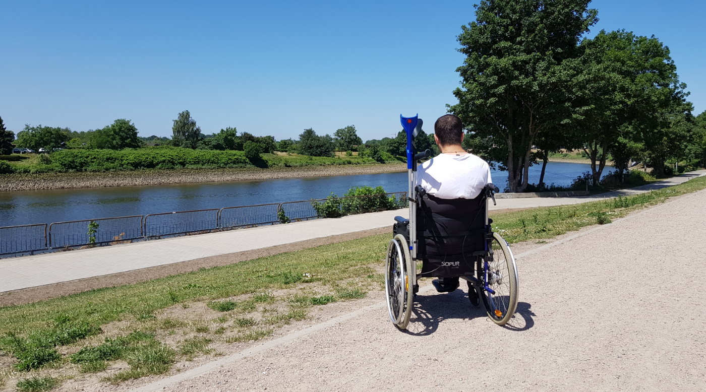

### AYS Special from Germany: Life in limbo — the story of Navid

Navid is back in Germany\. For the 25\-year\-old Afghan citizen it is the last hope of finding refuge in Europe — although the Federal Office for Migration and Refugees \(BAMF\) in Bremen has rejected his asylum application for the second time\.

But officially, [Bremen](https://www.euractiv.com/section/global-europe/news/german-regions-stop-sending-rejected-asylum-seekers-back-to-afghanistan/) [does not](https://www.weser-kurier.de/bremen/bremen-stadt_artikel,-bremen-sagt-nein-zur-abschiebung-_arid,1702093.html) participate in deportations to Afghanistan\. What is Navid’s problem? The Dublin III agreement\. Or, to be more precise: his fingerprints in Denmark\. Because his first asylum application was made in Germany’s neighbouring country\. When he came to Europe in the autumn of 2015, he first ended up in Germany, as he “did not know much about the other countries,” he explains\.

Once he was there, in chaotic times, rumours spread: rumours that the Afghan president Ashraf Ghani would soon visit Germany — and young Afghans would be deported back to Kabul soon\. In fact, [this visit](https://afghanistan.diplo.de/af-en/themen/politik/bilaterale-beziehungen-unterbereich/1968202) [became real](https://www.bundeskanzlerin.de/bkin-en/news/germany-will-remain-a-partner-in-afghanistan-438902) ity, as did deportations\.

In October 2016, a repatriation deal was signed, and since December 2016, [more than 420 people have been deported from Germany to Kabul](https://rp-online.de/politik/ausland/abschiebung-nach-afghanistan-flug-mit-14-afghanen-in-kabul-gelandet_aid-34917849) \. Nevertheless, it is unlikely that Navid would have been one of them\. With his past and his disabilities — it is assumed — he would have had good chances for at least tolerance\. But he did not know it back then…

> _Navid recalls:_ “All the people that arrived in Hamburg in the camp, left it saying they didn’t want stay there because it was too dangerous\. We followed them and went to Denmark, and the police there asked us for passports\. We told them we just wanted to go to Sweden, but they said we couldn’t\.” 

His options were to be imprisoned for two months and sent back to Germany, or to ask for asylum in Denmark\. So he decided to submit the application\. But what he did not know back then is that for Afghans, the chances of receiving status were, and still are, far worse in Denmark than in Germany\. This leads to the next systematic problem of the Dublin system: every country has its own asylum system\. But with the Dublin III agreement, they are connected\.

So, when Navid’s case was rejected in Denmark and he faced deportation to Kabul in 2017, he decided to come back to Germany and ask for protection\. Although he had been in Germany before Denmark, by law Denmark is responsible for his case now\. Therefore, the BAMF does not take into consideration the circumstances for him in Afghanistan, but only the ones in Denmark\.

Part of the Dublin III agreement is that the signatory countries trust each other to guarantee a fair process for applicants\. So, while Bremen would rather not deport Navid back to Kabul, they want to send him back to Denmark\. But Copenhagen wants to send him back to Kabul\. And this — a chain deportation — has almost happened once already\.

In the spring of 2018, he found himself sitting in a plane from Bremen to Copenhagen\. It only happened after Navid had an operation due to his medical condition — it is assumed that he was born with a polio infection\.

Despite a suicide attempt, the deportation was conducted and after his arrival in Copenhagen he was imprisoned immediately\. He says that no doctor was present at the deportation, the wound was not treated and he was not transferred to a psychiatric ward\. Back in Denmark, he spent more than a month in a Danish prison, but was then released due to his medical condition\. In the prison, he was left with pain killers for one week only and did not see a doctor\.

However, after this one month he was released because his medical condition worsened and the conditions were not bearable for him anymore\. It was even harder for him to walk than before, and nowadays he is practicing with his crutches again\.

But the deportation order was still valid\. As Navid did not see any opportunity of starting a new life in Denmark, he decided to try his luck in Germany a second time and came back to Bremen\. Although he was rejected again, he still hopes there is a chance that his case will be taken into consideration by the German authorities without his being deported to Copenhagen and therefore to Kabul\.

After having spent several weeks in a psychiatric ward, because his mental condition had worsened again, he had a second operation and is now in hospital for rehabilitation once more\. While he cannot be deported during this time, he hopes that the deadlines for deportation under the Dublin agreement will expire\.

> “I want to stay here for a new life,” Navid says\. “I have a lot of plans, if they let me stay\. But it is so hopeless\.” 

He would like to study IT or electrotechnics and make a normal life like everyone else\. Cure his physical damage and mental issues, find a job, work every day\.

> “Time helps to focus on life and not the bad things from the past,” he is sure\. 

Afghanistan is not an option for him, he says\. He has already tried it\. Despite a lot of rejections, as most employers expect healthy and hardworking people, he found small jobs\. But as criminals tried to exploit his situation, which was the only possibility open to him at some point, he got into trouble\.

“I made a mistake and had to run,” he recalls\. Besides the serious threats he would face by returning to Afghanistan, he has no connections or relations there\. He would be in danger “from anyone who recognizes me\. I cannot live with this fear”\.

In fact, Navid did not spend much of his time in Afghanistan\. He grew up in Iran from the age of five — the war in Afghanistan forced his family to leave their home back in the 90’s\. But the situation for Afghan refugees is not easy\. And this is why he ended up in this difficult situation in Afghanistan, before he tried his luck in Europe: when he was studying and working in the steel industry in Iran, after a police control he was deported to Meshad at the Afghan\-Iranian border due to missing legal papers\. As he had been kicked out of the family home because of problems with his father, it was almost impossible for him to renew them\.

With nowhere to go and nowhere to stay, Navid became desperate over the years\. “For four years, nobody wanted to help with this,” he states\. His last hope for a life in peace is that Germany will allow him to stay\.

**We strive to echo correct news from the ground through collaboration and fairness\.**

**Every effort has been made to credit organizations and individuals with regard to the supply of information, video, and photo material \(in cases where the source wanted to be accredited\) \. Please notify us regarding corrections\.**

**If there’s anything you want to share or comment, contact us through Facebook or write to: areyousyrious@gmail\.com**

_Converted [Medium Post](https://medium.com/are-you-syrious/ays-special-from-germany-life-in-a-limbo-the-story-of-navid-7469c0c1859d) by [ZMediumToMarkdown](https://github.com/ZhgChgLi/ZMediumToMarkdown)._
