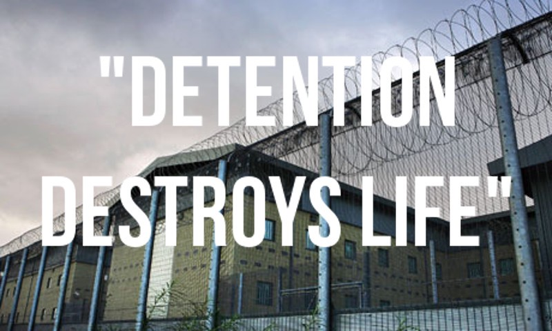

### AYS SPECIAL: Detention and Deportation — The UK’s Hostile Environment

_Earlier this year a group of activists known as [the Stanstead 15](http://enddeportations.com/2018/12/the-home-office-is-guilty-of-harm-not-us-stansted-15-respond-to-guilty-verdict/) were charged under terror related law for peacefully stopping a deportation flight in March 2017\. They were convicted under the Aviation and Maritime Security Act 1990 of “endangering an aerodrome” by locking themselves around a Titan Airways plane that was deporting people back to Ghana and Nigeria\. Since the flight was stopped several of the people who were being deported have been given leave to remain in the UK\._

> _“We are guilty of nothing more than intervening to prevent harm\. The real crime is the government’s cowardly, inhumane and barely legal deportation flights and the unprecedented use of terror law to crack down on peaceful protest\. We must challenge this shocking use of draconian legislation, and continue to demand an immediate end to these secretive deportation charter flights and a full independent public inquiry into the government’s ‘hostile environment’\._ 

> _Justice will not be done until we are exonerated and the Home Office is held to account for the danger it puts people in every single day\. It endangers people in dawn raids on their homes, at detention centres and on these brutal flights\. The system is out of control\. It is unfair, unjust and unlawful and it must be stopped\.”_ 

Many [statement](http://enddeportations.com/2018/12/the-uks-approach-to-stansted-protestors-has-been-shameful-it-should-inspire-us-all-to-action/) s in support of the group have also called for an end to the UKs draconian asylum practices and the imprisonment of human rights defenders, a current trend throughout Europe\. This case, along with the [Windrush Scandal](https://www.amnesty.org.uk/blogs/yes-minister-it-human-rights-issue/seventy-years-after-windrush?&gclid=Cj0KCQiA05zhBRCMARIsACKDWjepE6HkAk7E7_Jv_-Sn7UB6ws1PPn6wk02fBQjCHxna2DP7Ga05tDEaAra9EALw_wcB) earlier in the year, has highlighted many worrying aspects of the UK’s ‘Hostile Environment Policy’ including the Home Office’s ability to hold people in detention centres for an indefinite amount of time\.

> “The worst thing is the indefinite detention, which Home Office lies about\. People are in here for 8–9 months\. I have been here for almost 6 months\. This is my third time in detention\. Even prisoners know when they will be released\. Here, if you don’t do anything, that’s a problem\. If you do something, that becomes a problem as well\. Time is taken away from our lives\. I want to study and want to do my nursing\. But I can’t do that\. Months are taken away from us, we can’t get that back\. It’s not fair\.” — Participant in [Detained Voices](https://detainedvoices.com/page/2/) 

It is not surprising that an [investigation carried out by British media](https://www.theguardian.com/uk-news/2018/dec/26/ten-ambulance-callouts-a-week-to-detention-centres) and published this week has discovered that ambulances are being called to detention centres in England 10 times a week, often for problems such as overdoses, suicide attempts, fainting and chest pain\. This figure has risen over the last three years despite there being fewer people held in detention\.

Even though there have been positive moves this year, such as the planned closure of the 282\-bed Campsfield House in Kidlington by May 2019 \-which is part of Home Secretary Sajid Javid’s promise to reduce people held in centres by up to 40% \- as Bill MacKeith, joint organiser of the long\-standing Campaign to Close Campsfield, [states](http://www.statewatch.org/news/2018/oct/uk-campsfield-closure.htm) , it is not enough:

> The announcement that Campsfield is to close is long overdue\. 

> We think soberly of all the harm done, the lives damaged or destroyed, and those lost — 18\-year\-old Kurd Ramazan Kamluca in June 2005 and Moldovan Ianos Dragotan in August 2011 — at Campsfield over the past twenty\-five years\. 

> The name of our campaign is Campaign to Close Campsfield and End All Immigration Detention\. 

> With Campsfield next May, four detention centres will have closed in four years\. The number of people in detention is currently down some 20 per cent from the peak in 2015\. 

> But the misery and injustice of immigration detention continues at Yarl’s Wood, Colnbrook and Harmondsworth, Brook and Tinsley, Morton Hall, and Dungavel\. These too have to go\. We shall work for that\. 

Bristol Council is the latest to have passed the [These Walls Must Fall motion](https://detention.org.uk/category/local-campaigns/bristol/) to end indefinite detention and to dedicate themselves to supporting the campaign\. But many of these steps forward have come from continued pressure from activists\.

There have been protests outside Campsfield every Saturday since it opened, and it took 25 years for anyone to listen\. If our right to protest is taken from us, as with the Stanstead 15 case, and even peaceful direct action can no longer be carried out without the potential of life in prison as a result, then people will be less likely to get involved\. We can’t let that happen\. We must continue to fight, for however long it takes\.

**These walls must fall\!**

If you or someone you know needs support with UK Asylum, there are lots of groups in the UK working to ensure that people’s voices are heard\. Right to Remain have also [published an overview](https://righttoremain.org.uk/2018-a-year-in-review/?fbclid=IwAR2Li4MoOffcpIvjZ16ADiF8dul2MH3vBntMc4GCpuq98YbVVi-CJKQ0j1A) of 2018 and a [guide to the UK immigration and asylum system](https://righttoremain.org.uk/toolkit/) \.

In the words of a member of Right to Remain:

> _Take courage and keep working, there are more of us than you think\._ 

**_\(My Emma Musty, AYS Info Team\)_**

**We strive to echo correct news from the ground through collaboration and fairness\.**

**Every effort has been made to credit organizations and individuals with regard to the supply of information, video, and photo material \(in cases where the source wanted to be accredited\) \. Please notify us regarding corrections\.**

**If there’s anything you want to share or comment, contact us through Facebook or write to: areyousyrious@gmail\.com**

_Converted [Medium Post](https://medium.com/are-you-syrious/ays-special-detention-and-deportation-the-uks-hostile-environment-de07c9a28d8d) by [ZMediumToMarkdown](https://github.com/ZhgChgLi/ZMediumToMarkdown)._
