### AYS SPECIAL — Prison Island: surviving another winter on Samos

_As Greek and UNHCR authorities ignore their responsibilities, Samos is rapidly becoming one of the worst refugee camps in Greece_

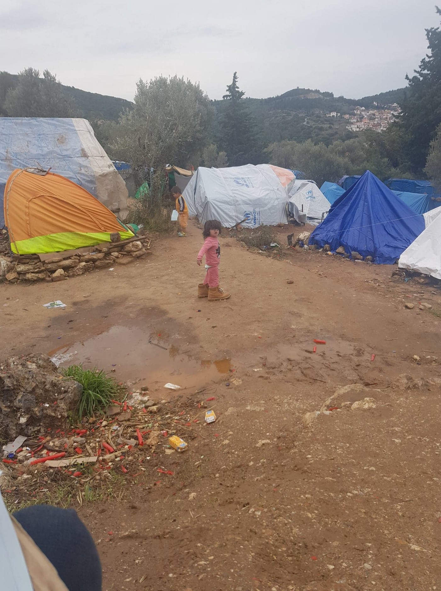

A child stands in the “extended area” of the Samos refugee camp, referred to by some residents as the “jungle”\. Photo Credit: AYS\.

_“I used to believe the worst camp in the world was Moria, but then I came here,”_ explained M\., a volunteer who has worked in a number of the Aegean Island camps\. \(We are keeping both the name of the volunteer and their group anonymous, because groups on the island have faced retaliation from the Greek authorities for sharing information\. \) _“I cannot believe the weather here, it’s crazy\. In Moria \[the camp on Lesvos\] people also live outside the camp in the olive grove, but the rain is not the same\. People are getting flooded out of their tents all the time here\. People are losing their shelter\.”_

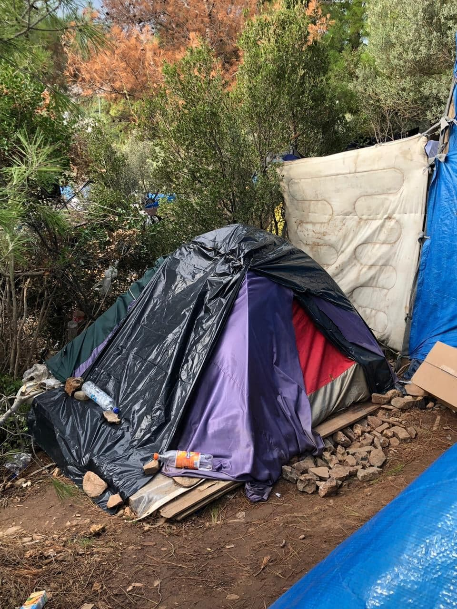

People have tried to protect their tents by raising them with pallets and making make\-shift tarps, but with the constant heavy rains, it is almost impossible to stay dry\. Photo Credit: AYS\.

There is no contest between the Greek detention camps to prove which is the worst, there are no world records for suffering\. While Lesvos has generally been the focus of most reports on the refugee crisis in Greece, this has been changing somewhat, with recent reports and articles by the [New York Times](https://www.nytimes.com/2018/11/14/travel/samos-greece-migrants-refugees-tourists.html) , [Al Jazeera](https://www.aljazeera.com/news/2018/12/greece-thousands-asylum-seekers-enduring-winter-tents-181225102418725.html) , [The Boston Globe](https://www.bostonglobe.com/opinion/2018/11/15/refugees-pushed-edge-survival-greek-island-samos/8UvQngBU5cKuavGNbXli0N/story.html#comments) , and the [London Times](https://www.thetimes.co.uk/article/sorry-the-article-you-were-trying-to-read-was-free-only-for-a-limited-time-b70qpw2kj?region=global) , among others\. Yet the name Samos still remains relatively unknown to those outside the island, and conditions have been steadily worsening\.

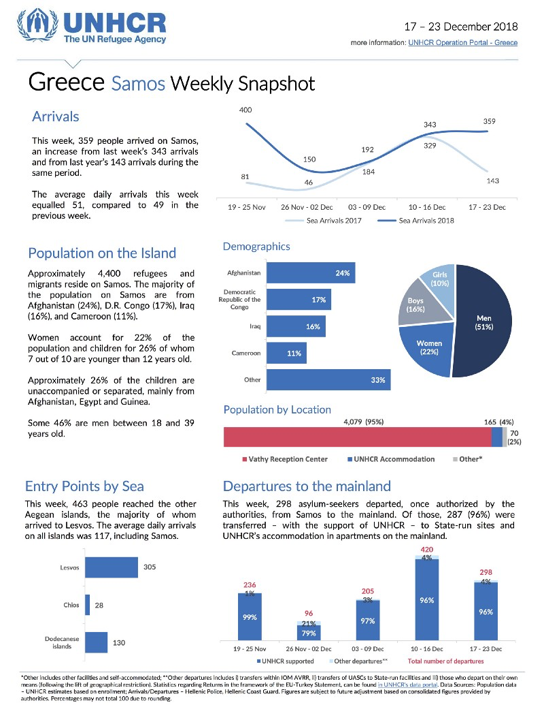

According to the most recent UNHCR report, there were 4,400 people living in the camp on 23 December\. Yet according to all of the volunteers and people AYS has spoken to, there are well over 5,000 living inside the camp\. To say “inside the camp” is not entirely accurate however, because at least half of the refugees on Samos are living outside of the confines of the camp — perched on pallets or in tents between trees on the steep hill\. Some people who live in this area call it “the jungle”\.

A [report from earlier this week](https://www.aljazeera.com/news/2018/12/greece-thousands-asylum-seekers-enduring-winter-tents-181225102418725.html) stated that there were nearly 3,000 people living in this area\.

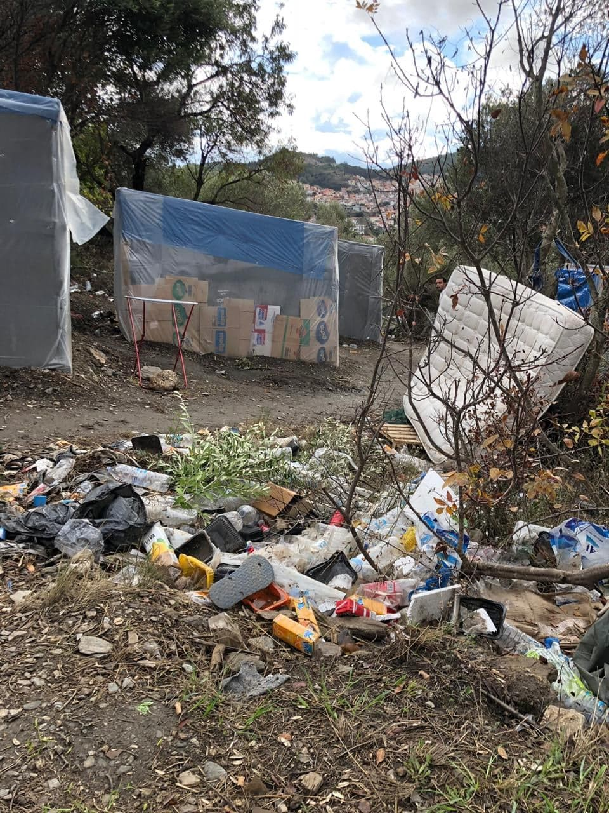

The “jungle” area outside the camp, where people have set up makeshift shelters on the steep hill\. Photo Credit: AYS\.

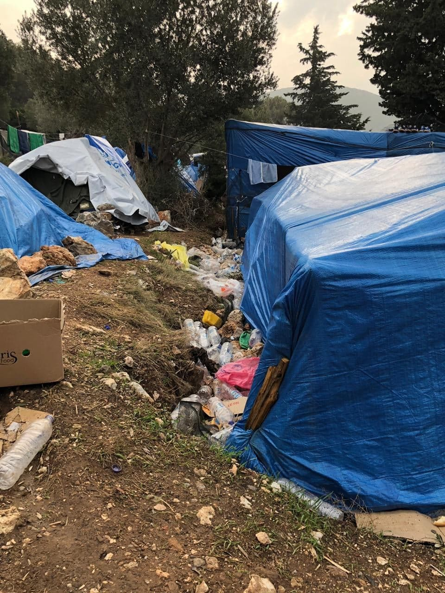

More tents outside the camp\. Photo Credit: AYS\.

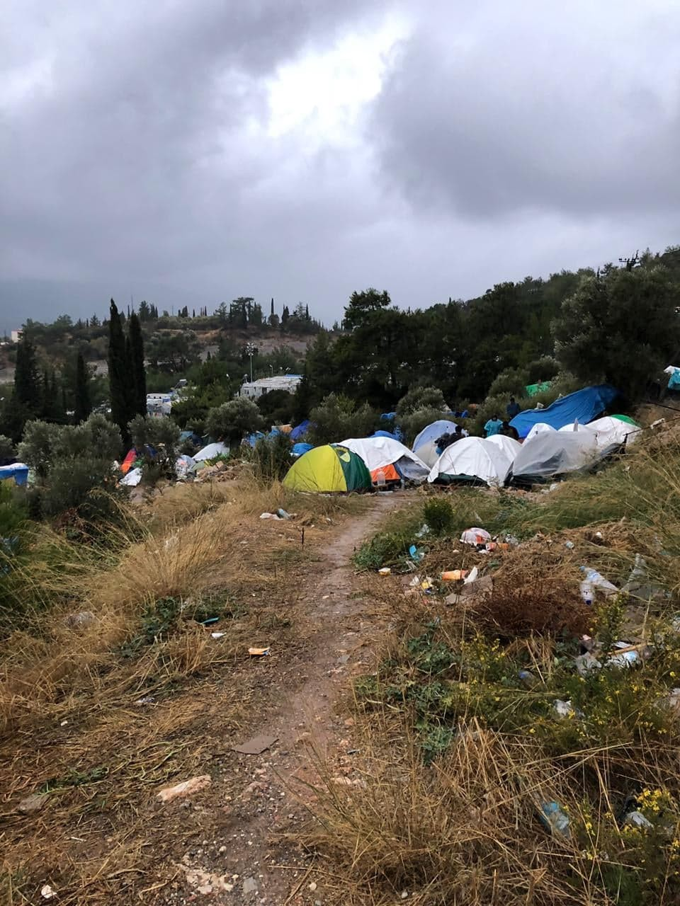

Tents outside of the camp\. Photo Credit: AYS

Asked if the authorities or UNHCR were doing anything to help these people prepare for the cold weather and heavy rains, M\. told AYS _“no one is doing anything\.”_ Most people arriving on the island in the last few months are not even receiving tents or sleeping bags\. This was confirmed by multiple sources on the island\.

_“I know of one woman who arrived on the island this week,”_ said M\. _“She has seven children, six girls and a boy\. After staying first at reception for three days \(this is a concrete space next to the police cabin at the camp\), the police told her she had to go and find a space to set up\. She had no tent, nothing\. She had to go into town and buy a tent for €150\. But it is not safe\. She is very scared for her children, especially for her daughters\.”_

The filthy and overcrowded Samos detention camp is not safe for anyone, but it is especially unsafe for women and children\. Rape and sexual assault are major issues within the camp\. Many women are too afraid to leave their tents at night\. Instead, they pee into empty water bottles, which you find scattered around the camp\. Many do not use the “bathrooms” even during the day, because they are too disgusting or dangerous\. There have been reports of women being cornered and attacked in the camp bathrooms\.

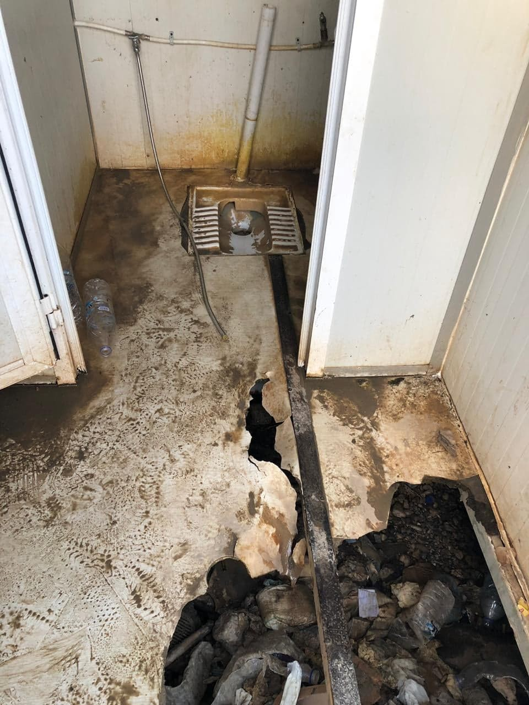

The “bathroom” in the Samos camp\. Would you use such a facility? Would you let your children use it? Photo Credit: AYS

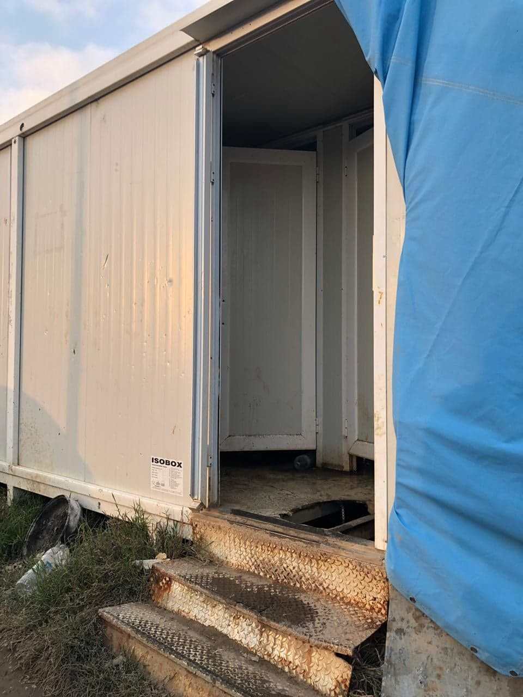

The outside of the “bathroom” facilities\.

AYS has also learned of two allegations of rape and one of sexual assault by the police within the last two years\.

And where is the UNHCR amidst this mess? As usual, they are more concerned with their statistics than with people\. \(And yet they don’t seem able to get their statistics right either…\)

The UNHCR cabin in the camp is, in many ways, a physical manifestation of their arrogant attitude towards the camp residents\. While the 5,000\+ camp residents live exposed to the elements, without any safety or protection, the UNHCR has ensured that they have warm containers for themselves to work in, surrounded by barbed wire, and with a constant security presence during their working hours\.

The UNHCR has a mandate to protect refugees, and a particular obligation towards children and vulnerable people\. Yet there are over 100 unaccompanied minors living in the camp — including girls\. How can the UNHCR’s child protection officers turn a blind eye to this?

At the beginning of this year, while there were many unaccompanied minors living in the camp, unaccompanied girls were not left on their own\. Now this is the norm, and there are far more unaccompanied minors living in the camp than in the shelters in town\. AYS has learned of a case of a ten\-year\-old boy living at the camp accompanied only by his brother who is a few years older\.

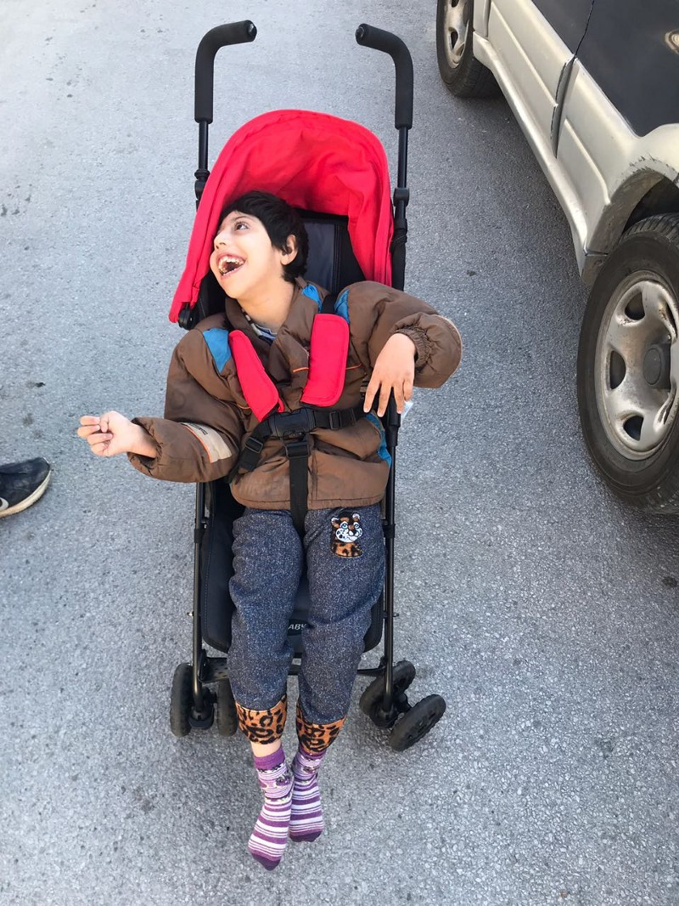

The photo is published with the family’s permission\. AYS

People with disabilities are similarly disregarded\.

M\. informed AYS of a family with a child with serious disabilities who cannot walk on his own\. The camp authorities provided the family with nothing — no wheelchair, no help\. They were simply told to go find a place to pitch a tent, like everyone else\.

M\.’s volunteer team assisted the family in getting a stroller for the child, but they need medical help and safe accommodation\.

Medical neglect is a daily reality for refugees on Samos\. With only one doctor working for the entire camp, there is almost no chance of being seen\. Because the camp doctor is typically overwhelmed with performing medical checks on people who have just arrived on the island, even people with serious conditions are never seen\.

Furthermore, there have been reports of racism amongst the nursing staff in the camp\. One refugee described nurses walking down the medical line and telling black men to leave because they were “strong,” and would be fine\.

When the doctor is not in the camp, there have been many instances when camp residents have gone to the police to ask for an ambulance and the police refused to call it\. When refugees call the ambulance themselves, it often takes hours to arrive, if it comes at all\.

Often the only option for very sick people is to walk to the hospital themselves\. Yet the hospital nearest to the camp, in the town of Vathy, has a history of giving sub\-par treatment to refugees\. Even for the Greek residents of the island the treatment at the hospital may not be much better, as it lacks the staff and equipment to care for people properly\.

If conditions do not change, it is very possible that people will die on Samos this winter, either from exposure to the elements or from asphyxiation while trying to warm themselves\.

It is common for people to burn plastics in a desperate attempt to get warm\. However, the true death count in this camp will never be fully known — as people are being denied medical treatment, and once\-treatable conditions worsen and eventually become fatal\.

There are documented cases of both HIV and tuberculosis at the Samos camp\. There are also more people with cancer, chronic asthma, long\-term illnesses, and injuries from wars that are going untreated, and being exacerbated by the conditions in the camp\. These, of course, are just the physical problems — the mental trauma of living in such a place is a subject for another article\.

People suffering from these illnesses may not die on Samos, but they may die later due to lack of treatment on the island\.

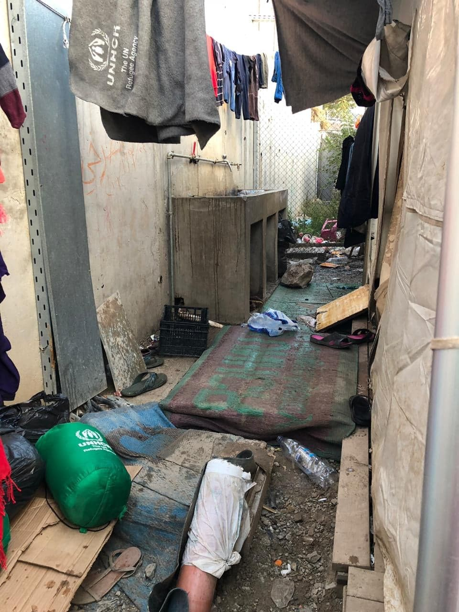

A walkway between two containers in the Samos detention camp\. Photo Credit: AYS

M\. described how surprised they were by the failure of the authorities to transfer seriously ill and disabled people out of the detention camp\. _“On Lesvos, there were many people who had to wait at the camp for a very long time,”_ he explained\. _“But the really sick people, and the people with bad problems \[disabilities\], they were transferred\. This is not happening on Samos\.”_

As refugees on the island are struggling through another winter, the authorities on the island are doing little to assist them\. As in previous years, the UNHCR and Greek plans for “winterization” have come to nothing\. It seems that the authorities are more concerned with keeping conditions as miserable as possible, and keeping prying eyes away from the Samos camp\.

All of the volunteer groups on the island have been banned from entering the camp in the past year, with only a few narrow exceptions for special circumstances\. Last month, a Dutch journalist was arrested and detained overnight for entering the camp\.

While journalists may be locked up for a night, the people residing at the camp are serving an indefinite sentence\. Despite having committed no crimes, they live as prisoners\. A collective of students at the Alpha adult education center on the island wrote a series of haiku poems describing life on the island\. One of them read,

> Spiral roads wrap island’s body\. 

> Prisoner island\. 

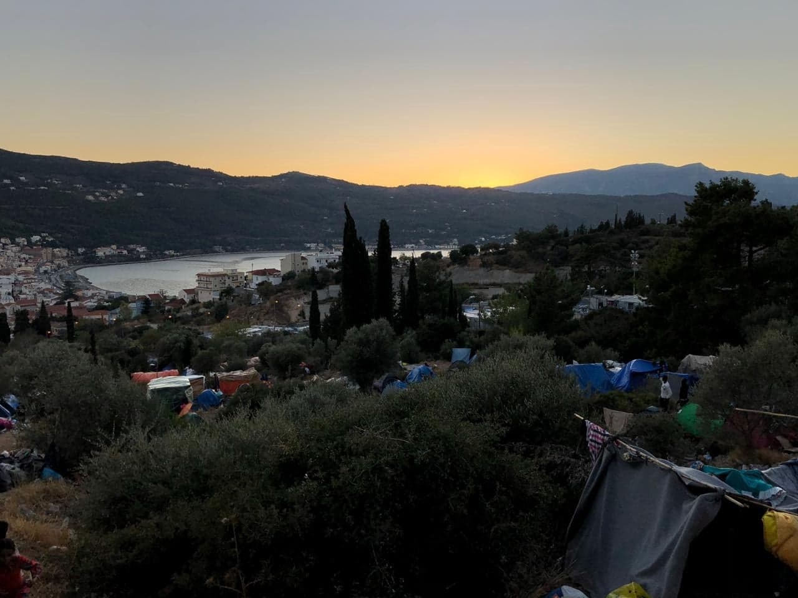

The natural beauty of the island at dusk contrasts strongly with the overcrowded detention camp\.

The new year is not looking any more promising than the last for refugees on Samos\. Yet there are groups on the island who are working hard to help people stuck there\. If you would like to support these efforts, you can either donate or volunteer with the following groups working on Samos:

**_Samos Volunteers_** provide basic aid and focus on adult education for refugees on the island\. You can donate or apply to volunteer through their [website](https://samosvolunteers.org) \.

**_Med’EqualiTeam_** is the only medical volunteer team working on the island\. With the above\-mentioned lack of medical care and doctors, their work is vital\. You can donate, or those with medical/ nursing experience or translating skills can apply to [volunteer here](https://medequali.team) \.

**_Still I Rise_** is a children’s education center operating on the island, working to provide refugee children with a regular school curriculum\. You can find them [here](https://www.stillirisengo.org/about_us) \.

**_Refugees 4 Refugees_** , a refugee\-founded NGO that supports asylum seekers in Greece, has also begun work on the island\. You can find out more and support them through their [facebook page](https://www.facebook.com/pg/Refugee4Refugees/about/?ref=page_internal) \.

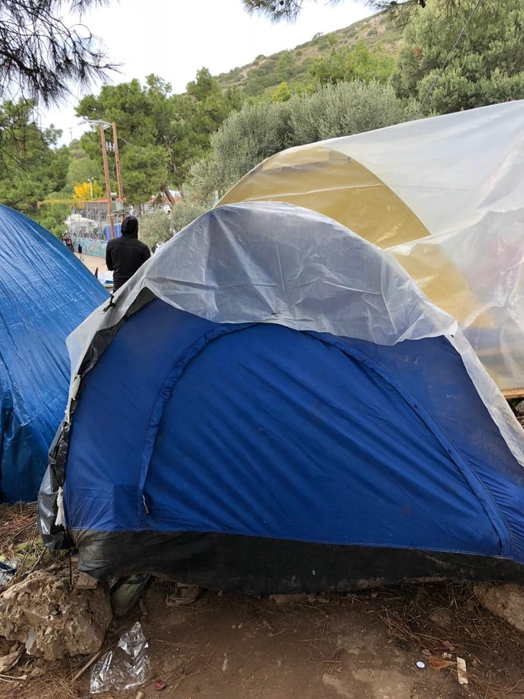

A tent perched on pallets\. The entrance of the camp can be seen, top left\. Photo Credit: AYS

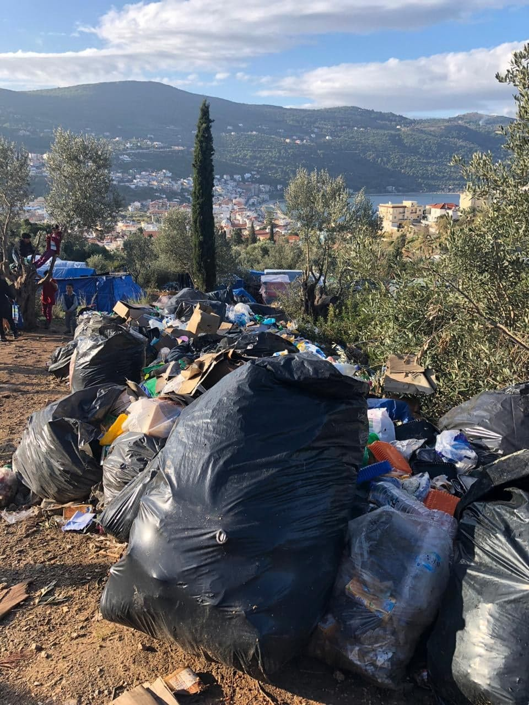

Trash accumulates inside the camp\. Photo Credit: AYS

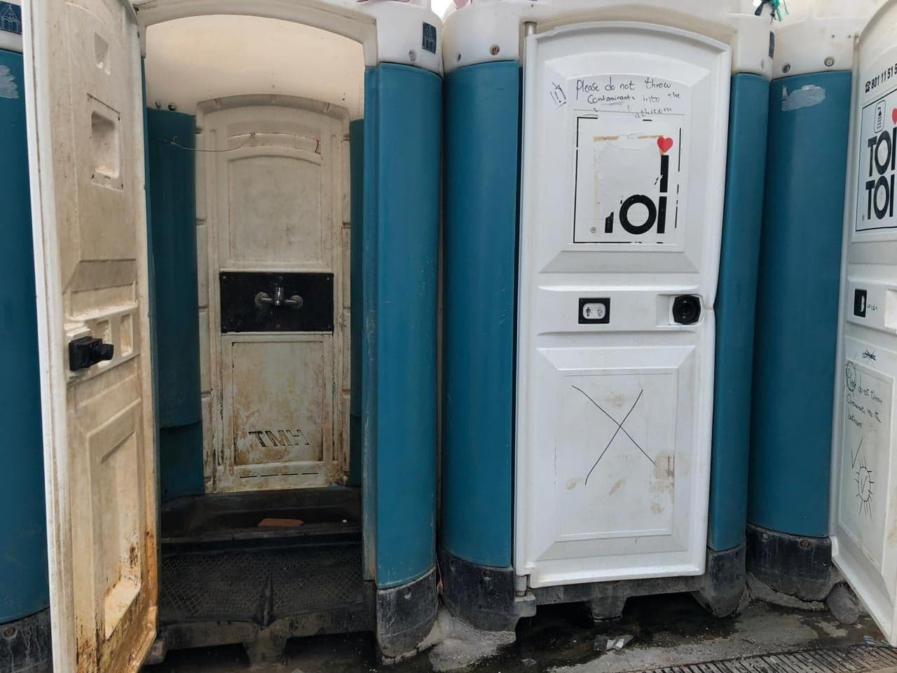

Port\-o\-potties in the camp are never cleaned\. Most are unusable\. Photo Credit: AYS

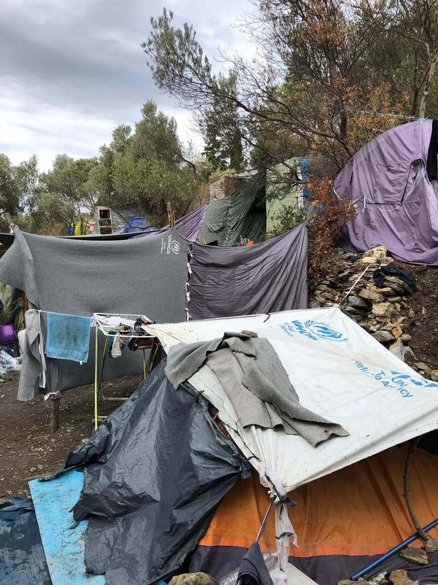

Tarps are rarely enough to keep out the rainwater\. Photo Credit: AYS\.

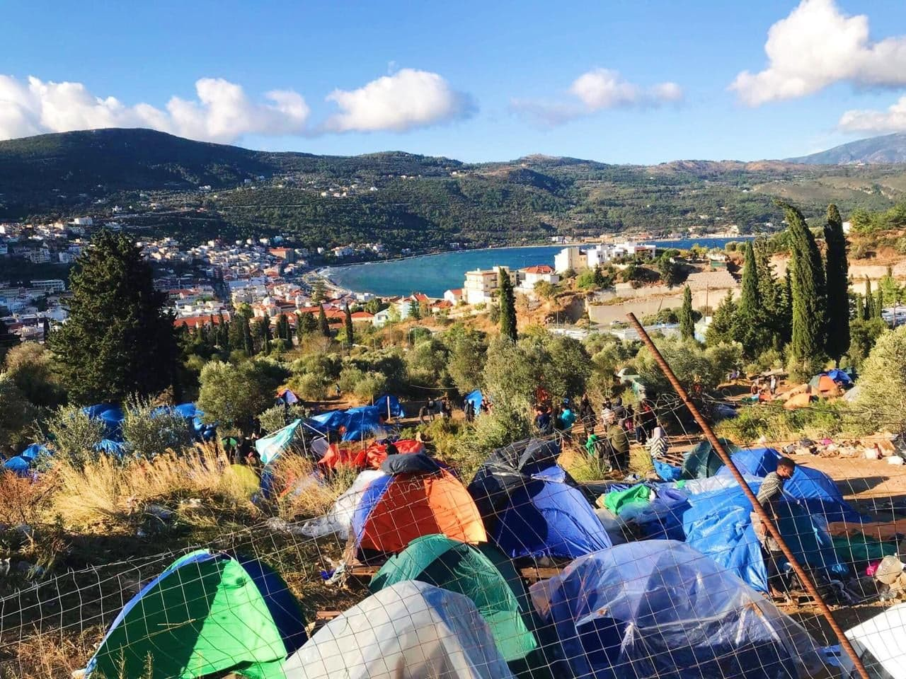

Tents set up outside the camp\. Photo Credit: AYS\.

**_\(This article was written by a former volunteer on Samos and AYS team\-member\. \)_**

**We strive to echo correct news from the ground through collaboration and fairness\.**

**Every effort has been made to credit organizations and individuals with regard to the supply of information, video, and photo material \(in cases where the source wanted to be accredited\) \. Please notify us regarding corrections\.**

**If there’s anything you want to share or comment, contact us through Facebook or write to: areyousyrious@gmail\.com**

_Converted [Medium Post](https://medium.com/are-you-syrious/ays-special-prison-island-surviving-another-winter-on-samos-72ead10d5096) by [ZMediumToMarkdown](https://github.com/ZhgChgLi/ZMediumToMarkdown)._
