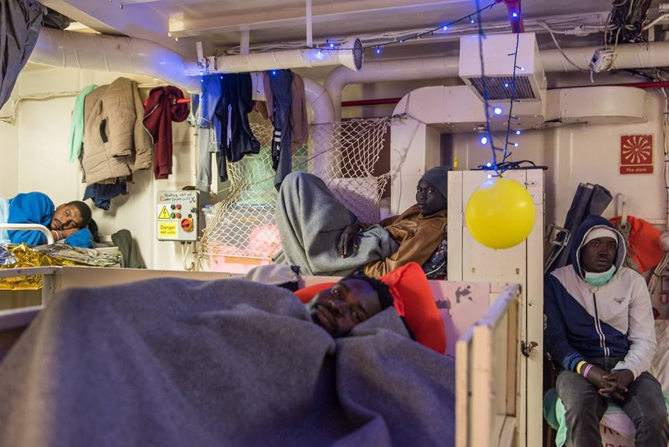
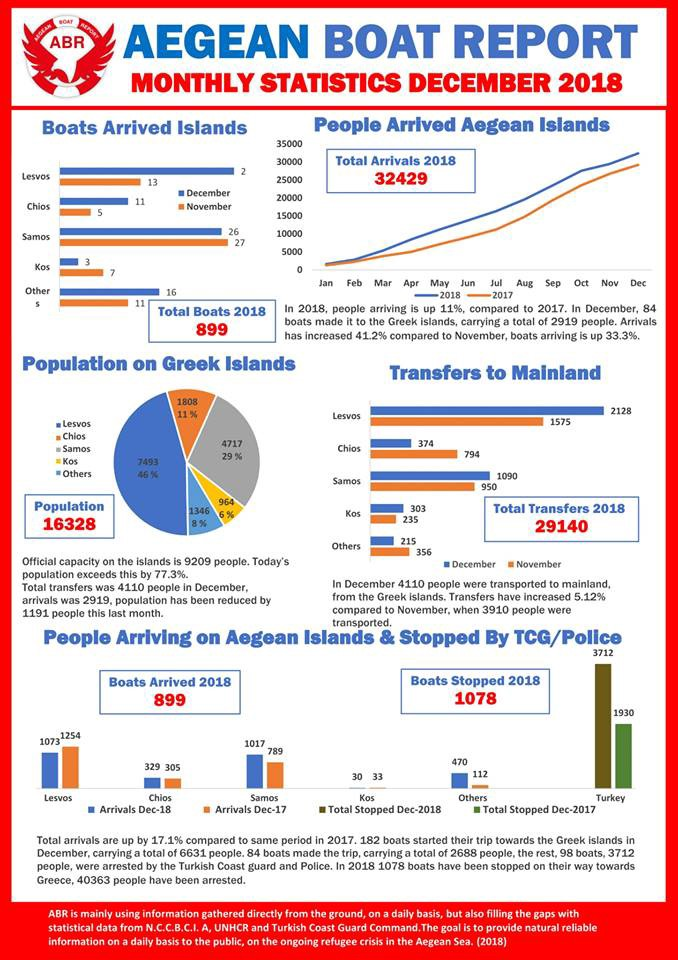
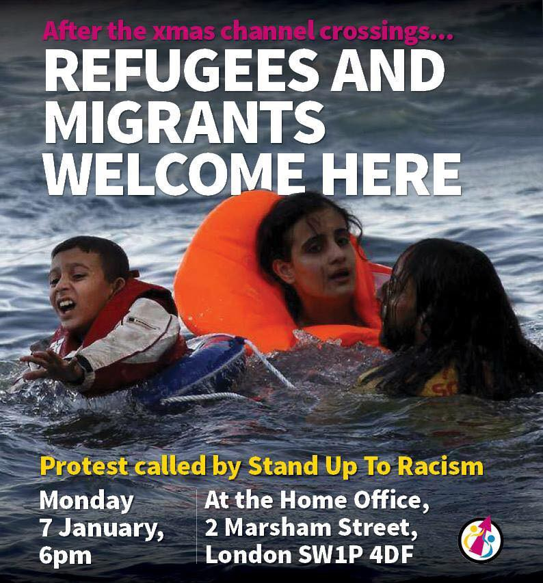

### AYS Daily Digest 03/01/2019: Italian mayors are defying Salvini

_New report released by No Name Kitchen on illegal pushbacks and violence in the Balkans // Pushbacks happening between Morocco and Spain // Missing and deaths in Libya // New classes available in Lesvos and Athens // A tragic death in Corfu // Donations needed for people in Calais and Dunkirk // And more news from Turkey, Morocco, Serbia, Italy, France, and the UK…_

Credit: Sea Watch
### FEATURE

Entered into force at the end of November 2018, Law n\. 132/2018, the so\-called Security Decree or Salvini Decree, has already forced hundreds of migrants outside of second level reception centres, giving them no option but to sleep rough or rely on Caritas, Red Cross, and other volunter\-based NGOs, if not on the individual solidarity of locals\.

The first example of such brutal application of the law regards 24 people, with regular humanitarian protection, who were [expelled from the CARA](https://www.ilfattoquotidiano.it/2018/12/01/dl-sicurezza-migranti-via-dal-cara-e-portati-a-crotone-croce-rossa-alcuni-hanno-dormito-in-strada-lunedi-sara-sos/4805832/) of Isola di Caporizzuto \(Crotone\) a few days after the official publication of the law\. Among them was a five months old baby\. In the same structure alone, 90 more people were threatened with the same treatment, as were hundreds of migrants with **regular** permit across the country\.

So what does the actual Decree really mean for people’s lives? In what ways does it change things?

As reported by [ASGI](https://www.asgi.it/asilo-e-protezione-internazionale/le-nuove-norme-su-immigrazione-e-sicurezza-punire-i-poveri/?fbclid=IwAR24KXRmsV7er04g9h4dRMcDYEYZSxnNt67K3BDIsd1QICDlphe3zpbP95k) , the main points of this new Decree are:
- the elimination of humanitarian protection;
- the maximum amount of time people could spend in administrative detention, before being deported back, has raised from 90 to 180 days; also the time migrants could spend in hotspots has raised to 30 days;
- the elimination of the second level reception network \(SPRAR system\); the only level of reception that was rooted in the territory and that could guarantee a decent amount of services to the people hosted;
- for those who got their asylum application denied and are facing a trial for penal crimes, even if they have a pending appeal, there is the obligation to leave the territory;
- if a migrant does not apply immediately for asylum, once in the territory, his/her request could be discarded for “groundless reasons;”
- Ministries of Interior, Foreign Affairs and Justice are the ones responsible to create a list of “safe third countries” of which their citizens can receive asylum in Italy, just in case of severe circumstances\.

In particular, the elimination of the SPRAR network and humanitarian protection are the most worrying points of the whole Decree — the ones that are affecting an average, potentially of 30,000 people residing in second level reception centres throughout the territory and holders of humanitarian protection\.

Read the full report on the SPRAR system and the services available [here](https://www.sprar.it/wp-content/uploads/2018/11/Atlante-Sprar-2017_Light.pdf?fbclid=IwAR2mGLe9o4zZAHXjYPPnI0oGLP2fdNWhyL7CYS4Nw8oRED781kMP7S8kwBQ) \(just in Italian\) \.

But, hope and solidarity have been shining across the country as mayors in different areas are defying the new law\. First among them is Leoluca Orlando, mayor of Palermo \(Sicily\), the first one to speak up against the inhumanity of the Decree\. In particular, [the mayor has suspended the application of the law](https://www.facebook.com/meltingpoteuropa/posts/2231632043535177?hc_location=ufi) in the territories under his administration, as they clearly attack human rights and principles enshrined in the Italian Constitution\. Orlando has blocked, in particular, new procedures regarding changes in the “iscrizione anagrafica” — residency and data registration — of the migrants targeted by the law\.

Mayors of Napoli, Luigi De Magistris, and Reggio Calabria, Giuseppe Falcomatà, together with the one of Parma, Federico Pizzarotti, and Firenze, Dario Nardella, have clearly expressed their position against the Decree and especially against the closure of the SPRAR system\. Others around the country — in Cerveteri, Bari, and Pescara — have raised their voices against the “values” of the new law\.

Another mayor, Domenico Lucano — now former mayor of Riace, as he was expelled from his own territory — faced consequences for his solidarity with migrants; therefore, we hope that this unanimous voice, this resistance, will stay strong and united against fascist and discriminatory regulations\.

■■■■■■■■■■■■■■ 
> **[Sea-Watch International](https://twitter.com/seawatch_intl) @ Twitter Says:** 

> > On #SeaWatch3, we received a letter from @[demagistris](https://twitter.com/demagistris), Mayor of Naples. We're deeply moved and happy to see that European solidarity still means something, if not to the ministers of interior, then to the mayors and people of a growing movement of #SolidarityCities. Thank you! 👇 https://t.co/PzkJsh6jGm 

> **Tweeted at [2019-01-03 14:56:18](https://twitter.com/seawatch_intl/status/1080840281409372162).** 

■■■■■■■■■■■■■■ 

### SEA

After 13 days at sea, Sea Watch is still struggling to find a safe port where to disembark the 32 people on board\. In addition, a storm hit the vessel in Maltese waters\. A similar destiny is reserved to Sea Eye, at sea with 17 people since December 29th\.

[Negotiations](https://twitter.com/TilleyMarc/status/1080819158949023744?fbclid=IwAR1_-fr_ZepL7vFUQ1fQ3r5tjwL0ip4rtTkaSq_2be5-eYMmVEv0jHLDI1Q) are ongoing as the Netherlands, Germany, and France have offered to welcome those at sea\.

■■■■■■■■■■■■■■ 
> **[Sea-Watch Italy](https://twitter.com/SeaWatchItaly) @ Twitter Says:** 

> > Il 13° giorno con i nostri ospiti a bordo di #SeaWatch3 inizia a poche miglia dalle coste di #Malta (dove ci è stato permesso di cercare riparo dalla tempesta), mentre i ministri dell'UE continuano a contrattare per 32 esseri umani.

#ApriteIPorti https://t.co/myXSFni4jO 

> **Tweeted at [2019-01-03 10:33:17](https://twitter.com/seawatchitaly/status/1080774090049376256).** 

■■■■■■■■■■■■■■ 

You can read the full report from the vessel [here](https://www.facebook.com/thomas.theke/posts/1232280476947889) \.

Meanwhile, [UNHCR reports](https://data2.unhcr.org/en/situations/mediterranean#_ga=2.66945326.1824805573.1546595673-1686088211.1540501178) that 2,262 people lost their lives while trying to cross the Mediterranean in 2018\. Compared to 2017, when 3,139 people drowned, or 2016, when 5,096 people lost their lives, it can be seen as a success, but if we take a closer look at the inhumane agreements with Libya and the infamous decision taken by Italy to close its ports, it is a still\-high death toll for an even higher shame\.
### TURKEY

The largest number of “illegal immigrants” caught by Turkish police forces between the years 2013–2018 have been in the Edirne region along the land border between Greece and Turkey\. 126,108 asylum seekers have been apprehended here during this six\-year period\. This was followed by the regions of Çanakkale \(92,097\) and İzmir \(71,105\) \.

Forces in Edirne monitor the highways electronically 24/7 in order to stop people before they reach the border region\. In the 2018 calendar year, 5,500 were arrested on the road as a result of such surveillance, and 15,000 through cooperation with border patrols\.

See the original source [here](http://m.milliyet.com.tr/jandarma-en-cok-duzensiz-gocmeni-edirne-edirne-yerelhaber-3222465/?fbclid=IwAR3WJgz4Akx2ibwZM9NBnpRlWiLxEDdc7n8C6iKdIRXwAbxjYwuDtUE18ec) \.
### MOROCCO

49 people from the Sub\-Sahara region were arrested this morning in Tazaghine, together with two Bengalese, one Yemeni, and one Moroccan citizen as they were trying to cross to Spain\.

■■■■■■■■■■■■■■ 
> **[Ali Zoubeidi](https://twitter.com/DrAZoubeidi) @ Twitter Says:** 

> > 49 migrants subsahariens , 2 bengalais , 1 yéménite  et 1 marocain ont été arrêtés à la plage de tazaghine (60km à l’ouest de nador) .
#migration #migrantsmuggling #maroc #UE https://t.co/D83wV85zlK 

> **Tweeted at [2019-01-02 22:37:45](https://twitter.com/alzoubeidi/status/1080594018059329537).** 

■■■■■■■■■■■■■■ 

Meanwhile, the Spanish authorities have apparently [sent back](https://www.facebook.com/AmdhNador/photos/a.1693125780899690/2248383405373922/?type=3&theater) all the migrant men to Morocco, allowing just six women and their babies to seek shelter in Melilla\.

Illegal pushbacks are happening on a regular basis in every area of this Europe\.
### LIBYA

[Three corpses were found](https://twitter.com/AngiKappa/status/1080939896712368128?fbclid=IwAR2AqVoRijahSZe_0h7wuZ1tdfEIwFghHu-WBTox47rAd1wj4pe7DULaMTk) on the beach of Al\-Sawawa in the morning, while at least three boats have disappeared in the past 10 days\. 90 people from Eritrea are also missing after they were been put at sea by smugglers on December 21st\.

■■■■■■■■■■■■■■ 
> **[Zakariya El Zaidy](https://twitter.com/zakariyatz) @ Twitter Says:** 

> > #Libya-n Red Crescent retrieves bodies of 3 migrants washed up on the shores of #Sirte, near Al-Sawawa area. 
Strange shift to the east in terms of #migration routes towards Europe. @[LibyaRC](https://twitter.com/LibyaRC) https://t.co/89rY1bKGzu 

> **Tweeted at [2019-01-03 21:04:06](https://twitter.com/zakariyatz/status/1080932840945143808).** 

■■■■■■■■■■■■■■ 

### GREECE
#### Arrivals

Credit: Aegean Boat Report
#### Islands

Tragic news is reaching us from Corfu\. A father killed his daughter by stabbing her several times because she was having an affair with an Afghan man who he did not approve of\.

Read more of the news [here](http://www.ekathimerini.com/236226/article/ekathimerini/news/corfu-father-said-to-admit-killing-daughter-29) \.

[Registration for new classes](https://www.facebook.com/pikpalesvos/posts/2251061301835955?hc_location=ufi) \(English, Greek, computer literacy, and activities for children\) will start on Monday January 7th, between 10:00 and 14:00, at Mosaik Support Centre\.

Teachers, social workers, and psychologists are needed in Lesvos from mid\-January\. If you can help, please, [get in touch](https://twitter.com/joelhdz/status/1080920946247192578?fbclid=IwAR0zti1fYyQM-T35J5MiETEyVqIpDBoJJ9DPpWPuzw0667av5sDbT26wEUQ) \.
#### Mainland

More [classes are available in Athens](https://www.facebook.com/groups/AthensVolunteersInformation/permalink/1587149818083976/?hc_location=ufi) \.

■■■■■■■■■■■■■■ 
> **[Apostolis Fotiadis](https://twitter.com/Balkanizator) @ Twitter Says:** 

> > Very serious allegations by Arsis, NGO working on protection of UAMS, which issued yesterday a press release regarding the push back of a 16yo residing in one of its shelters in Alexandroupolis, close to Evros. #Refugees 

> **Tweeted at [2019-01-03 09:13:20](https://twitter.com/balkanizator/status/1080753970719744000).** 

■■■■■■■■■■■■■■ 

Please, find the press release \(just in Greek\) [here](http://www.arsis.gr/deltio-typoy-paramones-protochronias-anilikoys-prosfyges-ston-evro/?fbclid=IwAR1Yt_YO6j57HS1sNrxZduCTrECbXyC7sS1sbl-gxj3BAKvk_v8aOJXV7yw) \. Additional news will follow\.
### WEATHER FORECAST: 01/04
#### MONTENEGRO

Cloudy with sunny intervals and cold in the south\. In the north, predominantly cloudy and very cold with possibility of light snow\. The wind weak to moderate, at places with very strong gusts, blowing from the north and northeast\. The lowest temperatures from \-14 to 2 and highest daily from \-11 to 6 degrees\.
#### SERBIA

Cold, moderately to entirely cloudy, with some snow mainly in the north\-west and south\-west alongside an increase of the snow covers\. The wind weak to moderate blowing from the north\-west\. The lowest temperatures from \-9 to \-3 and highest daily from \-4 to 2 degrees\.
#### BiH

In Bosnia, cloudy with light snow\. Towards the end of the day precipitation will gradually cease\. In the north, mostly dry\. Lightly to moderately cloudy in Herzegovina, cloudy in the north\. Wind moderate blowing from the north , in north\-west and in the west amplified at times\. The lowest temperatures from \-10 to \-1 and highest daily from \-6 to 4 degrees\.
#### CROATIA

At some places predominately cloudy, locally with some snow\. Alongside the coast, sunnier and mostly dry, some snow possible in the north part of the coast\. Land inwards moderate northern, northeastern, and northwestern winds, locally with strong gusts\. Alongside the coast, moderate to strong aura with strong gusts which will gradually calm down\. The lowest temperatures from \-7 to 2 and digest daily from \-2 to 5 degrees\.
### BOSNIA

> As we progress into 2019, the violent pushback of refugees, migrants, and asylum seekers from Croatia to the border regions of Serbia and Bosnia\-Herzegovina continues to be an issue of daily occurrence\. In the last month, volunteers based in Velika Kladuša have received a number of reports of shoes being taken from people\-in\-transit by police officers and then thrown away, forcing these individuals to walk barefoot in subzero temperatures through forests and streams\. 

No Name Kitchen has released a report regarding the abuses and violence suffered by people on the move in 2018 along the Balkan route, with in\-depth testimonies and details of pushbacks and violent practices used by border agents\.

> The three men running away angered the police officers and they approached the remaining group\-members and began to shine bright flashlights into their eyes\. According to one of the respondents, an officer said to them: 

> _“‘Don’t enter Croatia’ and then \[they\] started to beat \[us\] \.”_ 

> The respondents described being hit by several of the police officers with kicks and punches\. After the group experienced this violence, they had their coats check for money and their bags checked for mobile phones\. According to the respondents, one person had 80€ taken from them, another 100€, someone else 300€, and one other person had 5€ taken from them which amounted to a total of 485€ stolen from the group\. In addition, they had eleven mobile phones and eight power banks taken from them\. 

\[…\]

> _One police officer beat on the leg, one police officer beat on the head, one police officer beat on the foot, one police officer beat on the head\._ 

> In addition to this, the respondents described officers intentionally destroying their personal belongings: “​ _\[There were\] eleven sleeping bags cut with a knife by police officers”\._ 

Read the full report [here](http://www.nonamekitchen.org/wp-content/uploads/2019/01/December-Border-Violence-Reports.pdf?fbclid=IwAR3D1EJNx21MPLExHuiaR4jkOI6bMXySQvpuFybEgyiR8jnX8MDBnxNQXes) \.

Finally, one of the ugliest semi\-official camps in Bosnia, [Djacki dom or Borici in Bihac](http://www.rtvusk.ba/vijest/dacki-dom-u-boricima-stvoreni-pristojni-uslovi-za-zivot-migranata-i-izbjeglica/26796?fbclid=IwAR36A3m28CBr4plKNtJkjFAWuWptUHWCXGAqi2ciC5aGDS0SM-VmaAkxYoE) , was renovated\. For months, over 1,000 people lived in the most precarious conditions, in a building that was only half constructed and surrounded by parks\. The reconstruction began this summer and, late in the fall, all the people were moved to other locations, being hostels, hotels, or other camps\. Now, the place will recieve about 430 people, mostly families\. The reconstruction was paid for with EU donations, distributed by the IOM BiH\. The place will be run by the IOM and UNHCR, while Red Cross Bihac provides food\. Local media are reporting that IOM predicts more people will be coming through Bosnia this year, in spring, and they are planning to install additional containers for about 100 people\.
### SERBIA

[According to UNHCR](https://reliefweb.int/sites/reliefweb.int/files/resources/67469.pdf?fbclid=IwAR1hao-Uub6pgj87fg4kcBWQ4rs3eaK7e216CTDtEQHQsNWPYoJJWDuPKAE) , 4,468 people on the move were present in Serbia at the end of December 2018, 122 additional people registered since mid\-December, mainly from Afghanistan, Iraq, and Pakistan\. 94% of them have been accommodated in transit or asylum centres, while 260, mainly male, were reported living outside the governmental reception system\.

Among them are 92 unaccompanied minors\.

Incidents where people lose their lives are also happening on a regular basis:

> In the night between 18 and 19 December, a young man from Tunisia was electrocuted and subsequently died while he was trying to climb the train wagon at the Sid train station\. On 21 December, three foreign men locked in a cargo train who could hardly breathe were found by the authorities in Sid train and provided medical assistance\. 

Nevertheless, collective expulsions are still a reality\. In particular, 164 operations were executed during the year, from Croatia, Romania, BiH, and Hungary \(which admitted **only four** asylum seekers into its territory from Serbia\! \) \.
### ITALY

[There is a cold emergency in](https://www.facebook.com/cristina.mantis/posts/10215073987340673?hc_location=ufi)  Rome\. The municipality has opened these centres, where people can find shelter:
- Ferrovie Laziali
Stazione Tiburtina 
Casa di Riposo in Via Gioacchino Ventura, 60 \(Pineta Sacchetti\)
- Tube stations of Piramide and Flaminio will also stay open\.

You can also call the Sala Operativa Sociale in case of urgent need: \+39800440022\.
### FRANCE

France has recently seen a change in the duration of the administrative detention period migrants can be subjected to, which was extended up to 90 days \(previously it was 45 days\) \.

On average, France is forcing around 100,000 migrants in administrative detention every year, with the final goal of deporting them back to their country of origin\.

Get more information [here](https://www.lacimade.org/3-mois-denfermement-en-retention-2019-marque-un-tournant-dans-la-repression-des-personnes-etrangeres/?fbclid=IwAR3xWuhbFS9gQ3GJ8x1hd27HUVqLlIIgu7I0BjsIJ9m21CXgaRZl1RDpKIw) \.
#### Paris

During the morning, toilets and urinals were finally installed in Saint Denis, representing an improvement in the life conditions of the migrants living there, even though the request was originally filed up to three months ago\.

On the other hand, [Solidarité migrants Wilson reports](https://www.facebook.com/permalink.php?story_fbid=1053075718226533&id=598228360377940&hc_location=ufi) that it has been more than a month that area where migrants live has not been cleaned by the municipality, meaning that garbage is overflowing; people on the move had to clean roughly the area themselves with whatever tools they could find\.
#### Grande Synthe

FAST is looking for a volunteer social media coordinator; if you’re interested in the vacancy, please, read more [here](https://www.facebook.com/groups/FASTCalais/permalink/2268175280128976/?hc_location=ufi) \.

The emergency centre has finally opened for winter, with a hosting capacity of around 200 people\. Given the need, the space filled up very quickly, leaving 100 people still outside in the cold; therefore, tents and sleeping bags are in high demand\. If you can donate, please, get in touch with [Mobile Refugee Support](https://www.facebook.com/MobileRefugeeSupport/posts/899307640274848?hc_location=ufi) \.
### GERMANY

Demonstrations in solidarity with the people at sea have been held in different areas of the country\.

■■■■■■■■■■■■■■ 
> **[Hakan Demir](https://twitter.com/HakanDemirNK) @ Twitter Says:** 

> > "49 Menschen in Not. Horst, Tu was!" Heute haben wir in Berlin auf der Demo #Seehofer dazu aufgefordert, endlich zu handeln, sodass die aus Seenot geretteten Menschen in Sicherheit kommen und Asyl beantragen können. #seenotrettung https://t.co/kws8xeKYM4 

> **Tweeted at [2019-01-03 16:00:19](https://twitter.com/demir_hakan_/status/1080856392364445696).** 

■■■■■■■■■■■■■■ 

■■■■■■■■■■■■■■ 
> **[Seebrücke Karlsruhe](https://twitter.com/seebrueckeka) @ Twitter Says:** 

> > #Solidarität mit @[seawatchcrew](https://twitter.com/seawatchcrew) und @[seaeyeorg](https://twitter.com/seaeyeorg) auch in #Karlsruhe! @[BMI_Bund](https://twitter.com/BMI_Bund) und @[realSeehoferIM](https://twitter.com/realSeehoferIM) wir fordern die sofortige Aufnahme aller Gelfüchteten damit die Schiffe endlich an einem sicheren Hafen anlegen können! #seebruecke #seebrücke #schafftsicherehäfen https://t.co/Wwa6W25lO1 

> **Tweeted at [2019-01-03 19:54:17](https://twitter.com/seebrueckeka/status/1080915268455620608).** 

■■■■■■■■■■■■■■ 

■■■■■■■■■■■■■■ 
> **[Seebrücke Frankfurt](https://twitter.com/SeebrueckeFfm) @ Twitter Says:** 

> > #𝑫𝒐𝒏𝒕𝑭𝒐𝒓𝒈𝒆𝒕𝑻𝒉𝒆𝒎𝑨𝒕𝑺𝒆𝒂 
ＳＥＥＢＲＵＥＣＫＥＮ ｊｅｔｚｔ！ 

Zum Schluß haben wir noch an der Hauptwache auf der Zeil versucht, den Menschen nahe zu bringen, wie dringend ein paar andere Menschen gerade einen sicheren Platz brauchen!

@[seawatchcrew](https://twitter.com/seawatchcrew) @[seaeyeorg](https://twitter.com/seaeyeorg) https://t.co/szEJFfMt5D 

> **Tweeted at [2019-01-03 17:15:30](https://twitter.com/seebrueckeffm/status/1080875311103950848).** 

■■■■■■■■■■■■■■ 

### UK

Credit: Stand Up To Racism

**We strive to echo correct news from the ground through collaboration and fairness\.**

**Every effort has been made to credit organizations and individuals with regard to the supply of information, video, and photo material \(in cases where the source wanted to be accredited\) \. Please notify us regarding corrections\.**

**If there’s anything you want to share or comment, contact us through Facebook or write to: areyousyrious@gmail\.com**

_Converted [Medium Post](https://medium.com/are-you-syrious/ays-daily-digest-03-01-2019-italian-mayors-are-defying-salvini-70c698efe603) by [ZMediumToMarkdown](https://github.com/ZhgChgLi/ZMediumToMarkdown)._
