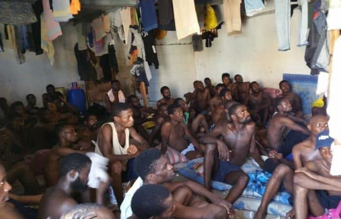
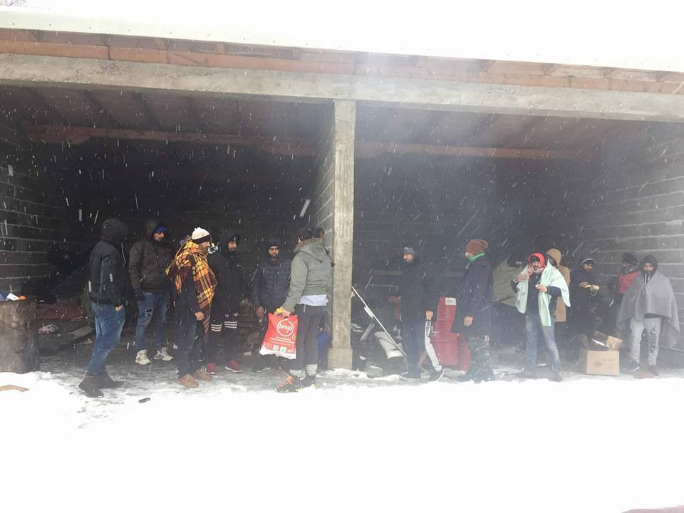

### AYS Weekend Digest 5–6\.01\.19: The Abuse of the Powerless
#### Summary of our recently published specials and updates from all over Europe

](assets/348362745171/1*KhasZZ4kJwL1OSH8oKpzkQ.jpeg)

Photo: [Mohammad Alkaseem](https://www.facebook.com/mohammad.alkaseem.77?__tn__=%2Cd%2AF%2AF-R&eid=ARC-xE98qj_S6ORkjEi5tbPWFhY7G7mqTYPav14jX_iEUA3h0z21E8LZmlQzQU-r1RWFDP7J8okV6phE&tn-str=%2AF&hc_location=group_dialog)
### Feature: The Abuse of the Powerless

This week, volunteers for AYS continued our tradition of ending the old year and kicking off the new year with a series of in\-depth specials from across the Balkan route\. Throughout the entirety of 2018 we heard endless talk about how to reduce “pull factors” that are apparently encouraging people towards a better life in Europe\. The idea is that if the trip can be showcased as being dangerous enough and that what lies on the other side is hopeless enough, that people will stop and leave the “overburdened” system in Europe in peace\. News networks crowed the finding from UNHCR that the number of people who died crossing the Mediterranean in 2018 dropped significantly, to 2,262; however as coverage from Quartz indicates, [this is only masking the reality\.](https://qz.com/1514244/the-disturbing-reality-behind-the-drop-in-mediterranean-migrant-deaths/) The number of people attempting to cross dropped by far more than this number, meaning that the death rate of those attempting to cross nearly doubled since 2015\. And for those that land, the lucky ones, more barriers and hell await them\.

People trapped in [Greece, now largely forgotten about](ays-special-from-chios-a-story-from-one-of-the-forgotten-islands-9e7885b49702) , are now facing waits of between one to five years for their asylum hearings\. Conditions on Samos and Chios are abysmal, with people being either kept in camps or being told to fend for themselves on their own\. There is massive lack of access to sanitary facilities, and [sexual violence within and around camps](ays-special-prison-island-surviving-another-winter-on-samos-72ead10d5096) , including from those who represent the law, is rampant\. Even on the mainland, in Oinofyta, [pregnant women are abandoned to fend for themselves](ays-special-the-case-of-oinofyta-from-one-hell-to-another-island-to-mainland-5e7fcf3d190e) , while volunteer projects are pushed out, in the name of maintaining order and ensuring that proper qualifications are present\. This process of ghettoization and neglect is one that is not new to Europe, and in a predictable way, it encourages violence, desperation and crime\. These natural outcomes are then used to further stigmatize and justify violence and persecution of the victims of the system\. Nevertheless, the point that few politicians will ever accept is that in spite of the humiliation and desire to escape it, people have little to no choice in this matter — [they will continue until they succeed or perish\.](ays-special-afghanistan-is-not-safe-but-neither-is-europe-for-afghan-refugees-ae37cf83fcd9)

With a significant number of volunteers in Bosnia, AYS has been able to closely monitor the horror unfolding at the Bosnian\-Croatian border zones\. Here, too, the pattern of neglect, feeding black markets, and then using the desperate measures undertaken by people in unimaginable circumstances as justification of further abuse repeats and repeats and repeats\. In order to raise money or gain a ticket to freedom, [refugees are pressured into becoming links in smuggling networks](ays-special-being-recruted-by-smugglers-144b3cb2cf7e) , putting more distance between those who coordinate these networks and the teeth of the law\. People who have nothing to lose will live on hope, will do the work that they are told to, and will face the repercussions\.

People are beaten and traumatized on a regular basis by the Croatian police, and those volunteers and locals who assist in giving what meager help that can be offered insofar as food, clothing, basic medical care, and other necessities are being harassed by authorities\. Many find [the conditions so humiliating that they simply wish to go back](ays-special-violent-year-for-refugees-at-the-eu-borders-c1def23f7173) , to face death at home, but at least gain some dignity rather than be buried in a foreign land, in a barely marked grave\. As the winter got underway, [Croatian police seem to be taking a cue from Hungarian police](border-violence-report-winter-in-velika-kladu%C5%A1a-c15423c6e4fe) , taking people’s shoes and forcing them to get wet in order to let the brutal cold weather take its toll\. All these happenings are denied by the official authorities, yet the media climate in Croatia, as documented in [our special here](ays-special-when-governments-turn-against-volunteers-the-case-of-ays-81fcfe0e80e7) , has taken a decisive turn against those who try to reveal the truth and help the powerless\. If authorities really had nothing to hide, why is there so much attention paid on stopping people? Nevertheless, the line of “if they say something, they are lying, and even if they weren’t lying, they deserved it” \(a common two\-pronged approach to help institutions justify actions that will eventually be revealed\) is being towed again and again\. Across Europe, solidarity and support are continuing to be criminalized in order to pump up the platforms and invest in institutional legitimacy\. The [persecution of volunteers in the UK presented as another case study](ays-special-detention-and-deportation-the-uks-hostile-environment-de07c9a28d8d) \.

Finally, for those who make it to the promised land, for those lucky enough to have crossed before this manmade, perverse hell was created, there is little comfort\. The threat of deportation as people caught in the crossfire of chaotic systems and misinformation has sapped the mental energy of people who are waiting to hear when their lives can actually start\. And what happens once they can, if they can? Will they have the energy, the hope after years of persecution, neglect and harrassment from all sides? We have [one story of a man facing this crisis](ays-special-from-germany-life-in-a-limbo-the-story-of-navid-7469c0c1859d) , the life in limbo faced by so many\.

Finally, [we also wrote a letter](letter-to-citizens-of-the-eu-from-the-periphery-politics-of-the-closed-borders-are-bringing-us-5e0f7012436e) , summarizing our perspectives and calling for those in power to step away from their cowardly complicity with inhumane actions\. Please read and share as you so desire\. Although numbers have dropped, the work and support given is more important than ever, as the teeth behind the smiles are continuing to bite harder and harder\. Take these snippets from across the world and use them to engage with your friends and family as we look forward to the new year\.
### TURKEY

The family of Sayyid Soltan Hussaini, a 41\-year old Afghan refugee who died due to lack of medical treatment on 12 December, have asked for those responsible to be tried in a court of law\.

Hussaini and his sibling had crossed into Turkey from Iran and been given a temporary pass to make their way to Afyon\. However the document was in Turkish and the siblings were not made aware of the 10\-day deadline\. Hussaini, a kidney dialysis patient, attempted to get medical care in Afyon but was denied care due to lack of papers, and the siblings were threatened with deportation\. They then went to Izmir where they had relatives\. On 11 November, Hussaini went to the hospital in Izmir but was once again denied care for lack of ID number\. The siblings tried to obtain papers but were unable to do so\. The next day Hussaini was taken to the emergency room by ambulance, but could not be saved and passed away\. An autopsy was not performed and his remains were repatriated to Afghanistan the following week\.

In a statement, his family demanded for those responsible to be punished so that other refugees would not meet the same fate\.

Translated from [here](https://www.gazeteduvar.com.tr/gundem/2019/01/04/afgan-multeci-kimligi-yok-diye-tedavi-edilmedi-hayatini-kaybetti/?fbclid=IwAR20kZEpBzfm92OC-KBvZqTaYiK6XcISmMt2Wb3vSx3MNblVP5uv7jHREmQ) \.

Additionally, a volunteer organization İmece İnisiyatifi Çeşme is searching for a volunteer coordinator\. Go [here](https://www.facebook.com/groups/211227759210944/permalink/887664931567220/) for more details\.
### LIBYA

The EU pays a pretty penny to use Libya to keep people from crossing the Mediterranean; however it is a cost paid for in the lives and dignity of those suffering\. We received horrible news from a detention centre in Libya, where almost 600 people languish in deplorable, horrifying conditions\.

“\- This time we are going to die, a friend from Eritrea tells me this morning on Messenger\.

As Eritrean refugees they are all under protection of UNHCR, but the organization has not been in the center for the last two months, my friend is writing:

\-We are all sick\. We only get spaghetti every day\. Two times a day\. Spaghetti\. No proteins, no fresh air and no sunlight\.

Since October 2017 he has been locked up in one of the many Libyan detention centers with no access to get outside\.

And once again he tells me about his friends and inmates with TB, who get no treatment or medicine\. He tells me how people are dying of TB, and that he too might have the deathly illness\.”

There is an urgent appeal campaign going on to write to [UNHCR authorities in Libya](https://www.facebook.com/groups/30614536012/permalink/10156659415356013/?hc_location=ufi) , who are standing idly by as people sell humans into slavery, straight from detention, as they are not being registered by UNHCR and therefore do not exist\. This horrific practice is being encouraged and financed by the EU, who is talking tough about their desire to crack down on human trafficking\! Repulsive…

“Urgent appeal for serious emergency in Al Khoms detention centre in Libya\! Please help us to send emails to [\#UNHCR](https://www.facebook.com/hashtag/unhcr?source=feed_text&epa=HASHTAG) Libya at lbytr@unhcr\.org”
### ITALY

[Pope Francis spoke out in support of the 49 people saved](https://www.newsbook.com.mt/artikli/2019/01/06/watch-pope-francis-appeals-for-solidarity-with-stranded-migrants/?lang=en) , but stranded onboard two SAR boats, who are being prohibited from being received to port in Italy under instructions by minister Salvini\. However the Pope’s calls for pity and care for those people, now entering their 16th day onboard, are falling on deaf ears\. Watch the Med, Alarmphone, posted a kind message of support from the Mayor of Naples who is standing in opposition to Salvini: “My citizens and I are very concerned about the conditions of the people you have saved in the sea and we sincerely thank you and your crew for the extraordinary work you do and for the great humanity and love that you concretely show\. Because of our concern regarding the conditions of the people you saved, in the name of the entire city of Naples I ask you formally to come to our city where you will be welcomed in our port\. And if the minister \(Salvini\) should go so far as to prevent you entering, you have to know that we have already 20 boats available that will reach safely the SeaWatch3 to bring to the mainland the people you are hosting\.”
### Sea

For 16 days, the Sea Watch 3 and Sea Eye’s Professor Albrecht Penck are waiting for a safe haven to disembark the rescued people\. Especially because of the bad weather situation and sea sickness, the stress levels of those onboard is at a worrying level, a medic on board the boat has said\. On Friday, the first crew change and stockpiling happened on the open sea for the NGO\.

Salvamento Maritimo rescued more than 230 people from six boats on 6 January\. 185 of them were transferred to the port of Malaga\.
### Greece

Aegean Boat Report [highlights](https://www.facebook.com/AegeanBoatReport/posts/503571240165985) the worsening conditions in Moria camp on Lesvos as winter is hitting — and authorities try to shut down reports about them\. “Even people writing about the conditions inside Moria, has been approached by police, and told to remove posts on social media,” ABR says\. Meanwhile one volunteer showed what the showers in the so\-called hotspot look like\. City plaza [added](https://www.facebook.com/watch/?v=767871393606083) that for the last four days there was no electrcity in the camp\. People needed to light campfires in front of their shelters in order to keep warm\.

The Spanish NGO Light Without Borders is asking for funds to send ship containers from Barcelona to Lesvos\. As of today, 600 out of 4000 Euros are still needed\. To support the mission, check this fund link: [https://www\.gofundme\.com/lesbos\-operacion\-calcetin](https://www.gofundme.com/lesbos-operacion-calcetin?fbclid=IwAR2ZFShIICM6WpKkR-_LDNU500a0qW2CBx9d2NfHjCV_noFA-fyQIoVdPBM) \.

Unfortunately, the situation on the other islands is not much better than on Lesvos\. The Italian journalist Francesca Mannocchi [states](https://twitter.com/mannocchia/status/1081810652505796608?fbclid=IwAR1La1Gv8qIfZ96dSwOp_dQdgsgO2JgaSpRzRNtQ1DVlWiKV7lI8eXAvglU) that more than 1000 underage people are stuck on Samos\.

■■■■■■■■■■■■■■ 
> **[francesca mannocchi](https://twitter.com/mannocchia) @ Twitter Says:** 

> > Thousands of people are living in tents like these outside the official camp in Samos. They have to buy tents and plastic to get out of the rain. 
Imagine to have children and live with them here. 
No bathroom, no hot water. No blankets enough. #samos https://t.co/gBOlmvBiGL 

> **Tweeted at [2019-01-06 11:57:16](https://twitter.com/mannocchia/status/1081882389100617729).** 

■■■■■■■■■■■■■■ 

### BOSNIA

Over 30 people slept out in the open by the road on the way from Sarajevo to Bihac after police took them off a bus\. IOM claims there is no place in Bihac for more people, and they do not help\. The police quotes IOM\. Good people are there to provide basics, but so far there is no solution\. The entire process is not legal, but looks like nobody cares what is happening to people on the move\.

Photo Credit: Sanella Lepirica
### BALKAN WEATHER REPORT
#### MONTENEGRO

In the south and centre predominately sunny, in the north predominately cloudy and from time to time snow\. Wind moderate to strong blowing from the north\. The lowest temperatures from \-12 to 1 and highest daily from \-10 to 7 degrees\.
#### SERBIA

In the course of the morning it will gradually clear up in the north, during the day predominately sunny\. In the rest of the country cloudy locally with some snow and locally dry\. After noon precipitation will come to a halt and it will partially clear up\. The wind weak to moderate from the north\-west, in the mountains and in the east strong from time to time, decreasing in strength during the afternoon\. The lowest temperatures from \-8 to 4 and the highest daily from \-6 to 0 degrees\.
#### BiH

Predominately clear weather in Herzegovina and southwest Bosnia, in the rest of the country predominately cloudy with partial clearing up as the day progresses\. Possibly occasionally weak snow at some places in the centre and east of Bosnia\. The wind in Bosnia weak to moderate from the north and northwest, and in Herzegovina moderate Bura\. The lowest temperatures from \-16 to \-3 and highest daily from \-4 to 4 degrees\.
#### CROATIA

Changeably to predominately cloudy with possibility of snow land inwards, partially sunny with changeable cloudiness in the rest of the country\. Wind weak, before noon moderate, locally strong northern and northeastern\. Alongside the coast stormy Bura\. Lowest temperatures from \-7 to 3 and highest daily from \-3 to 7 degrees\.
### Germany

After a work accident, Salekhan Z\. is facing deportation, the [Passauer Neue Presse](https://www.pnp.de/lokales/stadt_und_landkreis_passau/passau_stadt/3188547_Nach-Arbeitsunfall-droht-Salekhan-Z.-die-Abschiebung.html?fbclid=IwAR3-VR9h4fibm0op4TIzpDkiAFC9PVz_Sh39lca5t8BiRxvjdizSgznGQnY) reports, referring to the [Refugee Council in Bavaria](https://www.fluechtlingsrat-bayern.de/beitrag/items/erneut-sammelabschiebung-nach-afghanistan.html?) \.

Another deportation flight to Afghanistan is scheduled for Monday 7 January\. Salekhan Z\. is one of the deportees\. The Bavarian Refugee Council denounces that he had crushed his hand on a construction site in Passau, and has since been unable to work\.

This week Salekhan Z\. was arrested in his accommodation in Passau, currently he is in a deportation detention in Eichstätt\. In its press release, the Bavarian Refugee Council criticizes: “It seems that more and more people are being targeted for deportation, who for various reasons fail to get into skilled employment\.” However, the idea that Salekhan Z\. could keep his life as a day laborer in Kabul is indeed ignorant and unscrupulous\. The Bavarian Refugee Council calls for the stop of deportation\.

Furthermore it is [reported](https://www.pressenza.com/de/2018/01/deutschland-hat-ein-problem-mit-menschenrechten/) , that in Abensberg, Taher R\., an Afghan citizen has committed suicide as he faced to be deported\.
### DENMARK

There have been ongoing protests against the restriction and mistreatment of a five\-year\-old boy in Sjælsmark deportation centre\. There was a video that circulated of the boy, who was denied a piece of potato\. There will be a protest on January 15th in support of these children\. Go [here](https://www.facebook.com/events/1331581123650352/) for more information\.

Below is a full translation of some citizens’ statement on the issue: 
“You have vegetables enough\! It’s your laws which are the problem\!

Today we have given vegetables to the integration minister\. Because the problem in our society is not the lack of vegetables\. The problem is that children in the deportation center Sjælsmark are living in conditions, denied by politicians, designed to be as intolerable and inhumane as possible\. We demands the rules to be changed\!

When a small group of human beings in Denmark, whom we can’t legally deport, are on endurable or temporary stay, we should treat them as humans and give them the possibility to contribute and participate in society\. It creates frustration, ruins lives and is deeply damaging for the children who live in it\.

In no other law\-departments in Denmark children are punished for their parent’s decisions, and these children are — no matter what their parents choose — covered by The Service law \(a law for children and other vulnerable people in Denmark\) principals and goals\. The children on Sjælsmark are not hostages of the parents\. They are hostages of Inger Støjbergs symbolic\-regime which rather want to see children suffer irreparable damage then choose a solution which is better and cheaper for all of society\.

Deportationcenter Sjælsmark is driven by a politically conscious desire that the residents must experience the non\-perspective of their situation and the service provided is intended to satisfy just that and nothing else\. We believe this is an expression of a thinking and a pressure which isn’t worthy in a decent society\. In many way this is just sick\. The right to a family life is a right for all humans on endurable stay no matter where they stay\. To be able to take care of a child and provide for its basic needs is an inviolable part of family life\. A modest wish to be allowed to make your own food for your family must be a minimum\.

\#Sjælsmark \#derergrøntsagernok \#IngersAnsvar

With this action we also support the citizen proposal made by Folkebevægelsen For Asylbørns Fremtids \(The People’s movement for the future of asylum children\) \. There is 2 main demands:
\- all rejected families, who haven’t been deported after 18 months after the rejection, will be granted temporary stay for a minimum of 2 years at a time\.
\- All rejected children will be guaranteed a place in Danish public schools and the right to eat food which their parents have prepared until deportation or residence permit is possible\.
You can sign the citizen proposal here:
[https://goo\.gl/K3hpxf](https://goo.gl/K3hpxf) ”

For nearly 63 weeks, a group called Friends of Sjælsmark have been delivering fresh vegetables and other needs to the residents of the deportation centre\. One of their deliveries was extra special, as they delivered to the boy so famous in the video potatoes, broccoli and some candy\. They know him well\. If you wish to donate to Friends of Sjælsmark, go [here](https://www.facebook.com/502380140272964/photos/a.502385333605778/531884000655911/?type=3) \.

**We strive to echo correct news from the ground through collaboration and fairness\.**

**Every effort has been made to credit organizations and individuals with regard to the supply of information, video, and photo material \(in cases where the source wanted to be accredited\) \. Please notify us regarding corrections\.**

**If there’s anything you want to share or comment, contact us through Facebook or write to: areyousyrious@gmail\.com**

_Converted [Medium Post](https://medium.com/are-you-syrious/ays-weekend-digest-5-6-01-19-the-abuse-of-the-powerless-348362745171) by [ZMediumToMarkdown](https://github.com/ZhgChgLi/ZMediumToMarkdown)._
