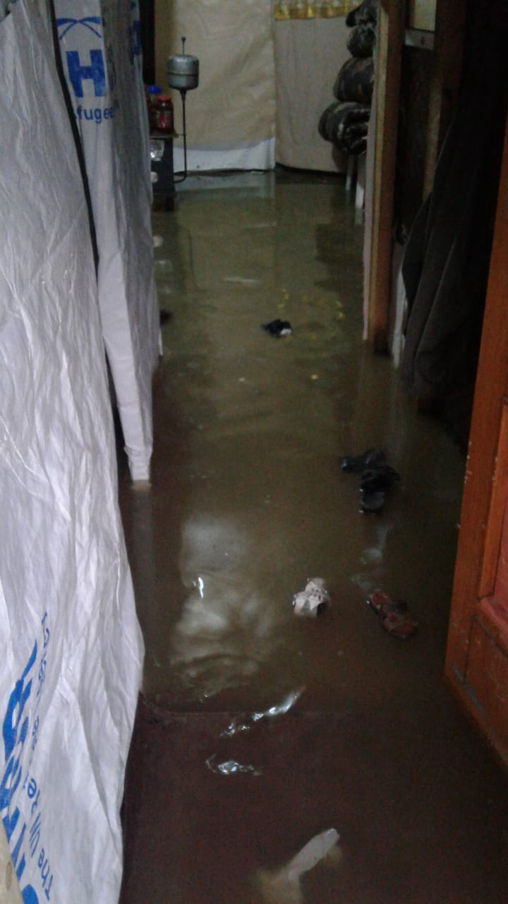
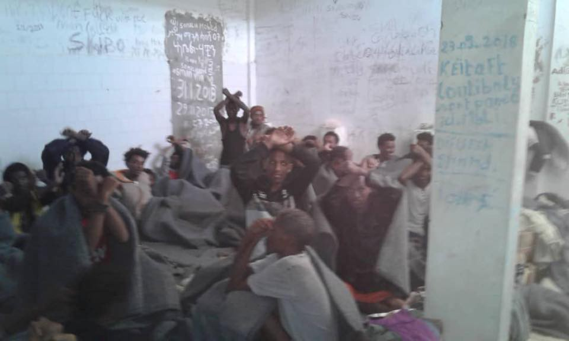
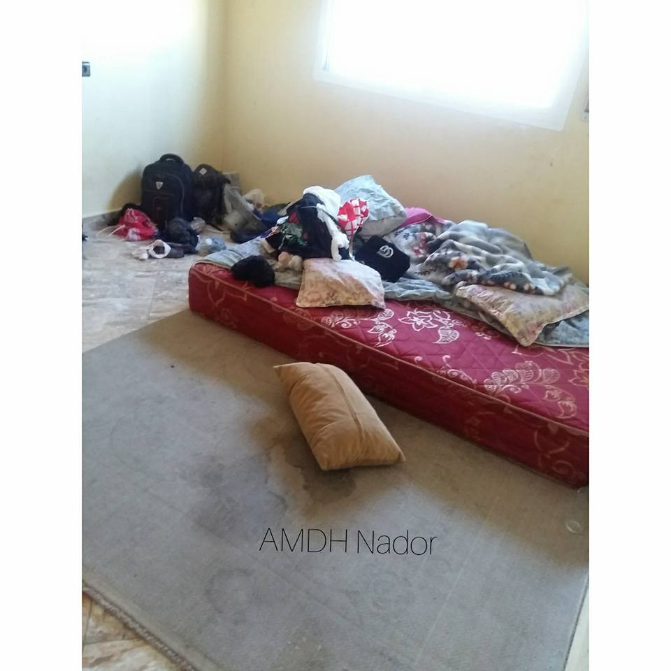
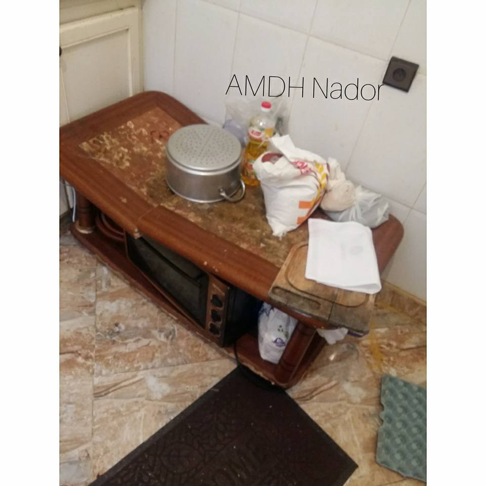
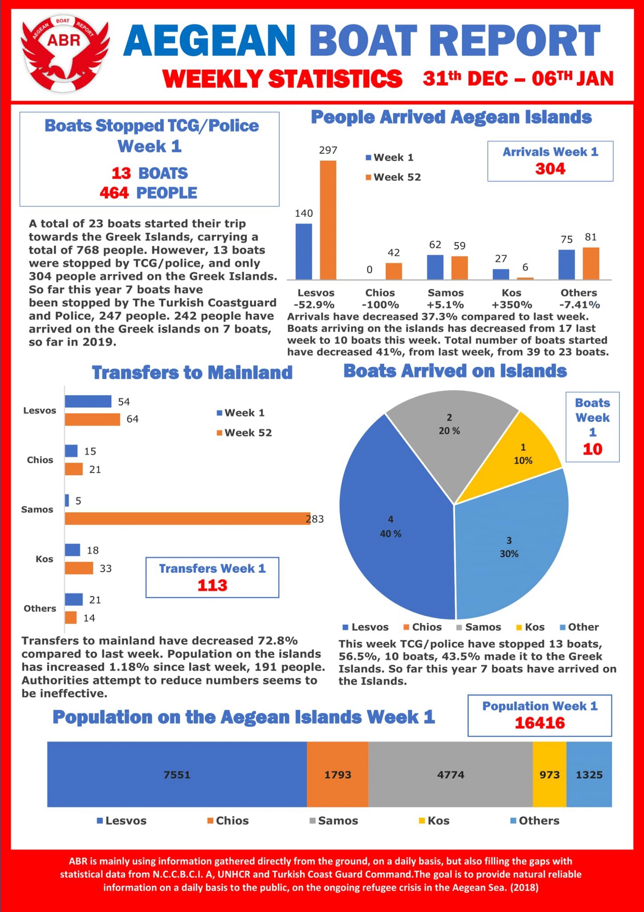
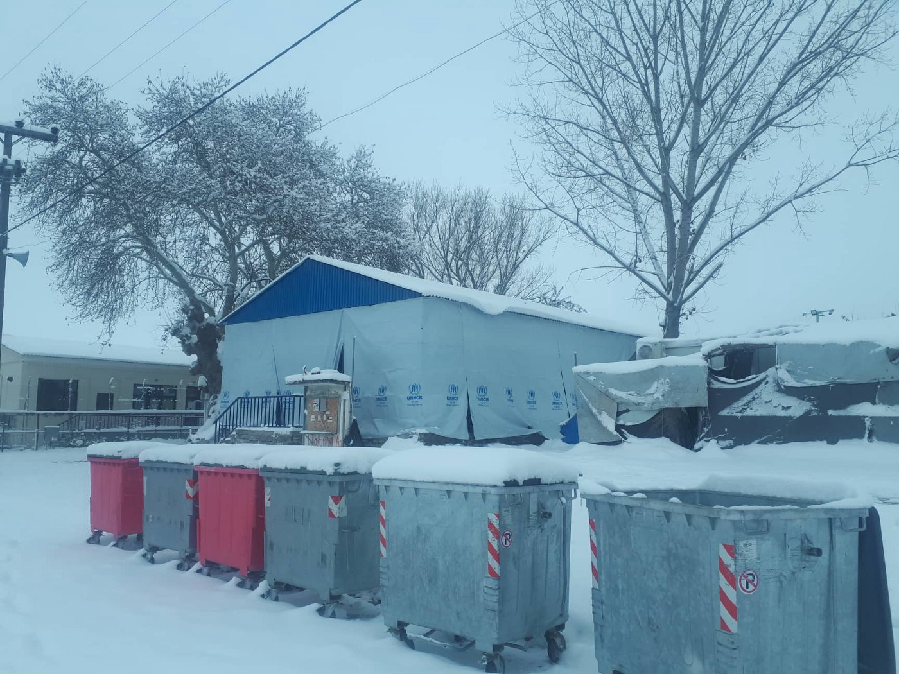

### AYS News Digest 9/1/19: Sea Watch finally disembarks, permanent solution indispensable for the future
#### Lebanon — Syrian refugees have already been affected by storm / Greece — Reports: from camps where people are transferred from the islands; on returned refugees from other European countries to Greece; OXFAM on Moria and Greek system / Spain — more than 400 people saved off the coast / France — report on the human rights situation in the area / more news

](assets/5cb0830f2d0/1*ybcl0bUjNQBuQJT5s6jYVA.jpeg)

Photo: [Sea\-Watch](https://www.facebook.com/seawatchprojekt/?tn-str=k%2AF)
#### FEATURE — Finally disembarked

The refugees on two rescue vessels of the Sea Watch team have received permission to disembark\. Germany has agreed to accept 60 refugees in total amidst ongoing political ‘ping pong’ in the EU\. This has been the prominent news of today\.

After pleas and \(too\) many days stranded in the middle of Europe, yet with no ground to land on, a decision was finally made regarding disembarkation of the Sea Watch 3\. Today, Wednesday the 9th, around noon it was announced that Malta would let the vessels finally land in their port\.

■■■■■■■■■■■■■■ 
> **[Amnesty EU](https://twitter.com/AmnestyEU) @ Twitter Says:** 

> > "After nearly three weeks of being tossed around in stormy seas these women, men &amp; children are now safely on dry land, but the fact that it took so long is shameful."

@[amnesty](https://twitter.com/amnesty)'s reaction to decision to allow the #SeaWatch3 &amp; #SeaEye to dock after 19 days
[amnesty.eu/news/eu-danger…](https://www.amnesty.eu/news/eu-dangerous-and-unseemly-spectacle-must-spur-action-to-save-lives-at-sea/) https://t.co/suH37cDqtV 

> **Tweeted at [2019-01-09 15:18:50](https://twitter.com/amnestyeu/status/1083020278668689408).** 

■■■■■■■■■■■■■■ 

Here’s what one of the crew members Brendan Woodhouse wrote afterwards:

Still, even after the decision, their efforts are not awarded with a push to political change…

■■■■■■■■■■■■■■ 
> **[Mediterranea Saving Humans](https://twitter.com/RescueMed) @ Twitter Says:** 

> > Malta impone a @[seawatchcrew](https://twitter.com/seawatchcrew) e @[seaeyeorg](https://twitter.com/seaeyeorg) di abbandonare subito le acque territoriali e tornare nel mare in tempesta. Chi salva vite umane è trattato da criminale mentre chi viola i diritti umani è considerato uno statista. Benvenuti nella loro Europa. #SavingHumans #United4Med 

> **Tweeted at [2019-01-09 15:22:25](https://twitter.com/rescuemed/status/1083021178405642240).** 

■■■■■■■■■■■■■■ 

■■■■■■■■■■■■■■ 
> **[Dimitris Avramopoulos](https://twitter.com/Avramopoulos) @ Twitter Says:** 

> > We are ready to work with Member States to set up temporary arrangements for disembarkation until until the new Dublin Regulation is adopted. To be effective, we need a critical mass of Member States ready to show solidarity by participating. https://t.co/sYvK43qmxL 

> **Tweeted at [2019-01-09 11:51:17](https://twitter.com/avramopoulos/status/1082968048259293184).** 

■■■■■■■■■■■■■■ 

[Remarks by Commissioner Dimitris Avramopoulos on the solution found with regards to the disembarkation of NGO vessels and progress under the European Agenda on Migration](http://europa.eu/rapid/press-release_SPEECH-19-304_en.htm?fbclid=IwAR2rYDFc8yEq-C1D8n7Q7WKF-yXFuZlnmRKZRlM1OdnmmCpiJikcSWRsbUE)
#### JORDAN
### Concern among refugees with aid drop in the country

> _Increasing pressure due to the presence of some 1\.3 million Syrian refugees on various sectors in Jordan, including education, health, municipal services, energy and others, has also been felt by projects relying on foreign aid and state budget contributions\._ 

> _With the decline in aid, members of local communities as well as Syrian refugees in Jordan have voiced grave concern as the situation has not changed and only a few thousand Syrians have returned home\. Read more [here](https://7dnews.com/news/concern-among-refugees-as-jordan-aid-funding-slumps) \._ 

#### LEBANON
### Aftermath of the storm

More than 11,000 Syrian refugees have already been affected by storm Norma hitting the country over the past days\. Thousands more are reportedly at risk\.

It is [reported](https://www.alaraby.co.uk/english/news/2019/1/8/hundreds-of-syrian-refugees-rescued-as-storms-hit-lebanon) that camps in Arsal have been blanketed with snow, while in the Bekaa Valley tents were engulfed in water with NGOs and charities appealing for aid to help families without shelter and warm clothing\.

](assets/5cb0830f2d0/1*RzkHLC7wIdEoHfTfwboV_A.jpeg)

Photo: [Basmeh & Zeitooneh](https://www.facebook.com/basmehzeitooneh/?__tn__=%2CdkCH-R-R&eid=ARDfu-uiShM68FWCDY-eFHuw1-hLjetr5MNas_MLddez_RZn3HokXs56ysln169atDS_KTRLEQxV9TqU&hc_ref=ARSC5W0C369UL8ITZykpOt5Q1bD5qH7ecRYYmoa3SzQVIPL8ju2RJWm7_1uIMzxnwyg&fref=nf)

Lebanon hosts an estimated 1\.5 million Syrian refugees, many of whom are in provisional accommodation and for many of those people it’s the 8th winter out in the cold in extreme conditions\.

](assets/5cb0830f2d0/1*kKHjgsj9VhqAu_GQcKdNmw.jpeg)

Bekaa camp photos by: [Basmeh & Zeitooneh](https://www.facebook.com/basmehzeitooneh/?__tn__=%2CdkCH-R-R&eid=ARDfu-uiShM68FWCDY-eFHuw1-hLjetr5MNas_MLddez_RZn3HokXs56ysln169atDS_KTRLEQxV9TqU&hc_ref=ARSC5W0C369UL8ITZykpOt5Q1bD5qH7ecRYYmoa3SzQVIPL8ju2RJWm7_1uIMzxnwyg&fref=nf)

The [Basmeh & Zeitooneh](https://www.facebook.com/basmehzeitooneh/?__tn__=%2CdkCH-R-R&eid=ARDfu-uiShM68FWCDY-eFHuw1-hLjetr5MNas_MLddez_RZn3HokXs56ysln169atDS_KTRLEQxV9TqU&hc_ref=ARSC5W0C369UL8ITZykpOt5Q1bD5qH7ecRYYmoa3SzQVIPL8ju2RJWm7_1uIMzxnwyg&fref=nf) team reported on the situation on Tuesday, 8 January:

> It’s devastating, people have either left their tents with nowhere to hide, or remained standing up the whole night inside of them\. 
 

> The storm is to peak today, and there is no way to fix the tents now\. We are trying to rent a place to move the families into it and provide those who are already in collective shelters with blankets and heat as soon as possible\. 

You can help the group by donating or otherwise — contact them at:
contact@basmeh\-zeitooneh\.org

](assets/5cb0830f2d0/1*jNbW-KmHMoZFiMg0VKwlDg.jpeg)

Bekaa camp photos by: [Basmeh & Zeitooneh](https://www.facebook.com/basmehzeitooneh/?__tn__=%2CdkCH-R-R&eid=ARDfu-uiShM68FWCDY-eFHuw1-hLjetr5MNas_MLddez_RZn3HokXs56ysln169atDS_KTRLEQxV9TqU&hc_ref=ARSC5W0C369UL8ITZykpOt5Q1bD5qH7ecRYYmoa3SzQVIPL8ju2RJWm7_1uIMzxnwyg&fref=nf)

For more information, you can also read the latest press release by Save the Children: [Syrian refugees in desperate fight to keep warm as snowstorm hits hard](https://lebanon.savethechildren.net/news/press-release-syrian-refugees-desperate-fight-keep-warm-snowstorm-hits-hard) \.

■■■■■■■■■■■■■■ 
> **[Aya Isleem 🇵🇸 #Gaza](https://twitter.com/AyaIsleemEn) @ Twitter Says:** 

> > 🔴  #Syrian refugees camp in Ersal, #Lebanon.
People are suffering from harsh cold and no heating at all. This is not the first time this happens , almost every year they suffer from cold, heavy rains and snow. . https://t.co/5UWW4CjSDo 

> **Tweeted at [2019-01-09 10:16:26](https://twitter.com/ayaisleemen/status/1082944177296601088).** 

■■■■■■■■■■■■■■ 

#### LIBYA

[Care4Calais](https://www.facebook.com/care4calais/?__tn__=kC-R&eid=ARB0mzplMEnD4fm4lhltobG1cheNS85uUZ3qKSGhVDnVGfgszGClUTBpwXWm79OUIr56qEoBi2aUY4po&hc_ref=ARTlJmt1W38M895994nhJubKzCiBDUJHEALnCcfyjJwcdVRc9amlOZGLVMGwuC5maQg&fref=nf&__xts__%5B0%5D=68.ARA0sIP9IEW1yyqwwIRsaRcqZU28IKs4lqyEqoAlEc_B6TAFbShsv2BnZQGHtj9iHSntBklqHBZWwAympk8aZXt3pGOVRYAOO1VdI6tRMCFq0CrMkZba5j-LuKxjDh8Jm18xM78ynRqLlmmJwkPzo3AUPF6I5MwUAmN6O2PwIXQEw_Aen3XWNqN0NDgaTtwT0VBfvDGYd75riIFG9zI3IOTt9N7t0QglIaIiwDwFG3PP3xgL2DQsEdLZT3k7FVWws7L40WeJXmEeYXYNLnHG44Ay3WQNBVMUi1e01aw1RYOsTlvh6xHi1aq17QfOa2dqABlXJJ32A6OLN2eB7IgKLJVJbtzH) team reports:
300 Eritreans have been caught at sea by the Libyan coast guard and brought to the centre, already overcrowded\. They are not registered with UNHCR and every day the Libyan authorities are trying to force them out of the centre to sell them to a group of traffickers and slave masters waiting outside\.

They face months, years of horrific torture for extortion and slavery if sold again\. Every day the Eritrean refugees are trying to unite and resist being taken out, but they are being beaten\. The Libyans tell them UNHCR will not come and they should obey\. They are at serious risk\.

](assets/5cb0830f2d0/1*J6dhREgUas_16pmsKnPKwA.jpeg)

Photos via: [Care4Calais](https://www.facebook.com/care4calais/?__tn__=kC-R&eid=ARB0mzplMEnD4fm4lhltobG1cheNS85uUZ3qKSGhVDnVGfgszGClUTBpwXWm79OUIr56qEoBi2aUY4po&hc_ref=ARTlJmt1W38M895994nhJubKzCiBDUJHEALnCcfyjJwcdVRc9amlOZGLVMGwuC5maQg&fref=nf&__xts__%5B0%5D=68.ARA0sIP9IEW1yyqwwIRsaRcqZU28IKs4lqyEqoAlEc_B6TAFbShsv2BnZQGHtj9iHSntBklqHBZWwAympk8aZXt3pGOVRYAOO1VdI6tRMCFq0CrMkZba5j-LuKxjDh8Jm18xM78ynRqLlmmJwkPzo3AUPF6I5MwUAmN6O2PwIXQEw_Aen3XWNqN0NDgaTtwT0VBfvDGYd75riIFG9zI3IOTt9N7t0QglIaIiwDwFG3PP3xgL2DQsEdLZT3k7FVWws7L40WeJXmEeYXYNLnHG44Ay3WQNBVMUi1e01aw1RYOsTlvh6xHi1aq17QfOa2dqABlXJJ32A6OLN2eB7IgKLJVJbtzH)

Please UNHCR LIBYA UNHCR, the UN Refugee Agency UNHCR Italia — Agenzia ONU per i Rifugiati go to register them immediately so they can no longer be sold on to further torture and slavery\!
#### MOROCCO

As before, complaints over the treatment and behavior of officials in Morocco towards refugees and asylum seekers still arrive from the Nador volunteers team\. Without any legal procedure, the authorities of Nador are allowed to break down the doors of others and enter houses, as they reportedly did with a family home, while taking belongings and money from the woman with children who lived in the house:

[Association Marocaine des Droits Humains — Section Nador](https://www.facebook.com/AmdhNador/?__tn__=%2CdkCH-R-R&eid=ARCaGJ_I1mZp1Nvh6rD8NJw0utgLfI39aQovP2wSUHnmYHUNRcZgLi5bv9V_TMbXttA_udamZFRAGtxL&hc_ref=ARSEHCiqLK2h5BFHqwxSyUNSP6MTmp046hfcOZekwlswhwSfHlvZcTjy9WuChiqwK-c&fref=nf) denounces these violations and calls for the cessation of these acts and the prosecution of those responsible\.

Nador authorities say they have arrested a high rank of the gendarmerie suspected of being involved in migration trafficking with mafia networks\.
#### GREECE

In the meantime, in Europe, during the past year that saw a radical shift in political will to act properly and even more radical rhetoric by the governing politicians across Europe, having passed through the appalling experience of fleeing their homes, a rather small number of refugees managed to arrive in Europe\. The number corresponds to about 0\.02% of the total EU population, and most of the people are stuck in limbo\.

Hundreds of pregnant women, unaccompanied children and survivors of torture are being abandoned to refugee camps on the Greek islands\.
In spite of the official reports and all the hands shaken over a windfall handed over to the supposedly responsible figures and supposedly professional experts in the field, actions speak louder than words\. 
Transfers to the mainland thus don’t solve many problems for the people, especially if they end up staying in one of the remote mainland camps\.

Transferring people into such conditions is an unlawful solution\.
Please, read our [**AYS SPECIAL — THE CASE OF OINOFYTA: From one hell to another — island to mainland**](ays-special-the-case-of-oinofyta-from-one-hell-to-another-island-to-mainland-ae38893f9cbc) to find out more on the reality of the situation many people are faced with, deprived of any legitimate voice that would speak on their behalf and actually DO something to CHANGE\.

 \)](assets/5cb0830f2d0/1*x0pVQ_AlduQxbc7HXRYO1w.jpeg)

Katsikas camp, Greece \(Photo: [Refugee Support Europe](https://www.facebook.com/RefugeeSupportEurope/?tn-str=k%2AF) \)

“Despite [E](https://twitter.com/hashtag/EU?src=hash) [U](https://twitter.com/hashtag/EU?src=hash) members committing to better protection and support in the [r](https://twitter.com/hashtag/refugeecompact?src=hash) [efugee](https://twitter.com/hashtag/refugeecompact?src=hash) compact, refugees are being abandoned in desolate conditions within European borders\.” 
Read below yet another report documenting the real situation\. 
It details how the system to identify and protect the most vulnerable people has broken down due to flawed processes and being chronically understaffed\.

■■■■■■■■■■■■■■ 
> **[Oxfam EU](https://twitter.com/OxfamEU) @ Twitter Says:** 

> > Greece’s asylum system is broken – the most vulnerable #refugees are being abandoned in horrific conditions, Oxfam exposes in new report:  [oxf.am/moria-abandoned](https://oxf.am/moria-abandoned)  #humanrights #migrationEU #OpenTheIslands https://t.co/qCafkuWfFw 

> **Tweeted at [2019-01-09 07:15:04](https://twitter.com/oxfameu/status/1082898533345300480).** 

■■■■■■■■■■■■■■ 

> In practice, refugees still have no secure and effective access to shelter, food, the labour market and health care including mental health care\. International protection status in Greece cannot guarantee a dignified life for beneficiaries of protection and is no more than protection “on paper”\. 

Read more on the horrible situation the returned refugees face in Greece: [**here**](https://rsaegean.org/en/returned-recognized-refugees-face-a-dead-end-in-greece/?fbclid=IwAR2Ml3rmHQWBK3h-L_MmEsDFZx5NOSUpmJUtlgri1IHXNFqj8NE62ZL35Cs) \. — RSA/ PRO ASYL have followed up cases of returned refugees from other European countries to Greece and documented how they live homeless or in precarious conditions in occupied buildings in Athens or in abandoned buildings without access to electricity or water\.
### Athens housing teams need help and support

> Often a situation can come with complications and as we collect medication for two of the children in this homeless family we seek further medical advice in order to arrive at the safest solution for housing\.
 

> Conditions of poverty, wounds too badly infected to be certain of their original form but considered too risky for the family to be housed in a squat situation with other children until we are sure the contagion has passed\. Certainly fungal infections are not uncommon in homeless conditions but we want to be sure this is contained\. Many squats have inadequate or inconsistent shower facilities\. 

> Today we are housing the family in a hotel where they can be safe and able to start the regime of medication and treatment to bring the situation under control for the children and not put others at risk\. 

Get in contact with [**Our house**](https://www.facebook.com/ourhousegr/?__tn__=%2CdkCH-R-R&eid=ARD0YfsTgC8i0St0Ei8ATtWmvXG8pUVcg8i7jhpuXs0q1ccXbEIMFCUXaMWfeIdnYayoBbxnzoIhdwzg&hc_ref=ARQZf4i5mvE2iDgpUe0WM7R4cPCf5C4mCVjTJ_WnthskZFFcHuEDbZ_NUwKE4V8rUxQ&fref=nf&hc_location=group) in Athens if you want to help people in these kinds of situations across the Greek capital\.

[**Amurtel Greece for Refugee Mothers and Babies**](https://www.facebook.com/AmurtelHellasforRefugeeMothersandBabies/?__xts__%5B0%5D=68.ARA08Bx0Thc-Gwse2Tl4R8RwXXO7vBURMQj9P-RyRzyl5c-2x_T-rpwt898RAdPpsNrfOpHYj3iwJJcqVKsDXstMivQvh8WIkkdZ3mQac1gpU_L9gSK-XR-gQWrnk5_DuTP_x1sh-qEiDvZq28PfZ_w3vh_4YqcCcMMVOrKP1wqCXV6A4SbBqP4e1bKgDXfgp86H4SdwoWwCfxAaRo1_Z9xyOSfDQknYqj_0dzh_KMPNCpiI5JXqs8G_JEIfka0UTQoy4d2uTKznEPFEwe8dD0UyusWadNFgOshpivVwfWHn6TtNboTpVT5Z81wlW5KtZU4FkkuNvV3-HL9C42tJzS2RX6y5ycJm5ylFfJa3QQ13vtRtz9E) assures refugee women a quiet, safe and self\-paced space\. They trained a first group of four refugee and migrant women to become peer\-to\-peer breastfeeding counselors\. Recently, a second group has begun training as well\. The main goal of this program is so that migrant women can facilitate the support groups organised by the NGO on a weekly basis\.

> “We want the centre to be run by migrant women, with the support of locals” 

AMURTEL’s funding comes mainly from private donations, such as the ones they hope to get next Wednesday through the Charidy platform\. Under the “Mama2Mama” motto, they call on women and mothers around the world to support their peers with a small amount\. Support them if you can\.
#### BALKAN WEATHER FORECAST for Thursday, 10 January

**Montenegro**

Changeable to predominant cloud cover in the south with changing precipitation, rain along the coast and sleet and snow in the lowlands in the south\. In the north predominant cloud cover with light to moderate snow\. North and northeastern winds locally moderate to strong and at times with very strong gusts\. Low temperatures from \-8 to 4 C° and highs from \-5 to 8 C°\.

**Serbia**

Cloudy with snow, in most parts of the country heavy snowfall and and significant increase of a snow cover of 10 to 20 cm\. The wind light to moderate from the north and northwest\. Low temperatures from \-5 to \-1 C° and highs from \-3 to 1 C°\.

**BH**

Predominant cloud cover\. Sleet and snow in most of Bosnia, possibly rain in the northwest\. No precipitation in Herzegovina\. The new snow cover is expected to be 2 to 8 cm, with 10 cm in some places\. Wind light to moderate, in the south sometimes gusting from the north\. Low temperatures from \-7 to 3 C° and highs from \-3 to 6 C°\.

**Croatia**

Inland mostly cloudy with light precipitation, mostly snow, during the first part of the day\. Along the coast partly sunny, changeable cloud cover and mostly dry\. Wind light to moderate from the north and northeast, while northwest winds in the east\. Along the coast a strong Bura with stormy gusts\. Low temperatures from \-5 to 5 C° and highs from 0 to 10 C°\.
#### SPAIN
### Primary gateway to Europe?

The Spanish coast guard saved more than 400 migrants in the first two days of 2019 alone\. On the first day of the new year 111 people [were rescued](https://www.liberties.eu/en/short-news/22324/22324?fbclid=IwAR0AFvyxW-O5td6X7pl6gfONyO72GeZzpryN8NQFj6eaCtj4jEiidyBM7B0) , a spokeswoman said, and 290 more people were rescued the next day\.
#### FRANCE
### Calais

“On the occasion of the two\-year milestone since the demolition of the Calais ‘Jungle’ camp, this brief summary report was compiled by Refugee Rights Europe in order to highlight the human rights situation which has been unfolding in northern France over the past few decades\. 
In addition to a desk review of news items and a number of academic articles, the report draws heavily from on\-the\-ground updates by Help Refugees, l’Auberge des Migrants and other organisations operating in Calais and Dunkirk, as well as several Refugee Rights Europe research reports published in 2016–2018\. 
This summary report also makes a number of recommendations in its final section\. We believe that our recommendations have the potential of contributing to the transformation of a cyclical and unsustainable state approach to the situation in northern France, characterised by violence, closed communication channels and widespread human rights infringements\. We believe that a different reality can and must be possible\.” — Volunteer groups from the area, supported by [Help Refugees](https://www.facebook.com/HelpRefugeesUK/?__tn__=K-R&eid=ARDKcRUcWRFL7rGy_5fIKG3hEg5sZdDRgCMpddBVXmnHmsVBZrGD4wzIk8OEisWjlxiEqyjvS_6QqFTX&fref=mentions&__xts__%5B0%5D=68.ARCjzYKn4VniOeV0MdxTOLSdiK8vbO1sHxe58Lmxhwf9Dcip26OMUw3_yHgSUPafbceUYZz9mvhVw7pZhZ1MxIKJeUs77v8pvuivvZ2UiFN1_X7SKuSMcyzMuleakmu1b-Kx27_vt7SCp7i-n4vB1PDDfQmv-jjCG2Bth7hfyqNSq85S4WRZF7AlKAIDx9Skadz4HNR3q12Qs9ghd193oZvN4sxwsbcNAmVyFH8yWqq_rB5OiuZkVHHTSZm45O0u5tC9Ea8WDxRNtE6mRjUJ_TMhLsbNNYEp38jH52CnVOICSCHy1v-Xxci1c85gGWJzPkVl5ravXVeSI-HitThuXRAs2wOOi9Vh5ifYM9NJTJPHZm2bz0GDgTukc38)

#### AUSTRALIA
### Hunger strike

The shocking treatment of refugees by the Australian Government continues, with most people either oblivious of it or ignorantly supporting, warn Australians across the social networks\.

Hundreds of people being held at an immigrant detention centre in Melbourne have reportedly gone on a hunger strike to protest their living conditions\. [Reportedly](https://www.sbs.com.au/news/hundreds-go-on-hunger-strike-at-melbourne-detention-centre) , the government denies mistreatment, but has pledged a “ramping\-down” of the country’s “onshore immigration detention network\.”

**We are an entirely volunteer run media team, and we rely on our supporters to share our news\. So please share, and never forget to ACT\!**

**We strive to echo correct news from the ground through collaboration and fairness\.**

**Every effort has been made to credit organizations and individuals with regard to the supply of information, video, and photo material \(in cases where the source wanted to be accredited\) \. Please notify us regarding corrections\.**

**If there’s anything you want to share or comment, contact us through Facebook or write to: areyousyrious@gmail\.com**

_Converted [Medium Post](https://medium.com/are-you-syrious/ays-news-digest-9-1-19-sea-watch-finally-disembarks-permanent-solution-indispensable-for-th-5cb0830f2d0) by [ZMediumToMarkdown](https://github.com/ZhgChgLi/ZMediumToMarkdown)._
