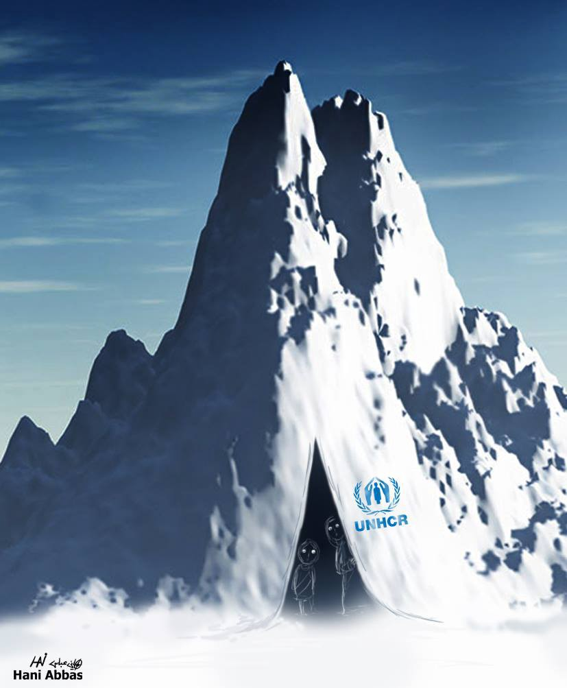

### یک زمستان سخت دیگر برای پناهندگان در اروپا
#### **AYS Weekly News Summary in Persian, January 7–13**

خاص

گروه نظارت بر اخراج و [دیپورت](https://dm-aegean.bordermonitoring.eu/2019/01/10/severely-injured-individual-deported-directly-from-hospital-on-18th-october-2018/?fbclid=IwAR24ovZGBdfISg71Vo2SpfnnaM5dpLsa6kOosW5uQOMPtP1JBB-enCTTsR8) اژه ، اخبار نگران ‌کننده‌ای در رابطه با دیپورت ، در ماه اکتبر ، از یک مرد مریض در بیمارستان ، که به طور مستقیم از ترکیه پذیرفته شده‌ بود ، منتشر کرد\.

مرد در موریا زندگی می‌کرد و در هفدهم اکتبر سال ۲۰۱۸ این خبر را دریافت کرد که قرار است روز بعد به ترکیه دیپورت شود \. او پس از آن سعی کرد که از طریق تلفن به دوستش اطلاع دهد ، اما نتوانست کمکی از اطرافیان دریافت کند \. او که ناامید شده بود، سعی کرد با خوردن شامپو خودکشی کند و صبح روز بعد که برای دیپورتش از کشور برنامه‌ریزی شده بود معده‌اش را به طور ساقط کند\.

پلیس او را به بیمارستانی در میتیلینی برد و به تازگی کشف شده که این مرد مستقیما ً به پاسگاه پلیس برده شده و او را دیپورت کرده اند ، اوبه همراه چهار نفر دیگر به ترکیه دیپورت شده است\.

این خبر پس از انتشار یک گزارش جدید از سوی اوکسفام ، نشان می‌دهد که اتحادیه اروپا چگونه چشم کور به وضعیت پناهندگان گرفتار شده در اروپا ، و در یونان به طور خاص ۷۵۵۱ نفر در موریا دارد \.

از آنجا که این گزارش تمام ناکامی‌های سیستم و عدم کمک به مردم را لیست می‌کند ، باور کردنی نیست که به عنوان آخرین پزشک اردوگاه که در جزیره لیسووس در یونان در نوامبر ۲۰۱۸ کناره‌گیری کرده‌است ، ارزیابی‌های بیماری و پذیرش بیماران حداقل یک ماه است که انجام نگرفته اند \.

روند ارزیابی بیماریه تازه واردان ، سه بار در طول سال گذشته تغییر کرده است و باعث ایجاد سردرگمی و یأس در بین مردم و کارکنان و همچنین تأخیری طولانی و آشکار در اجرای رسمی ارزیابیه بیماری شده است\.

کمبود پرسنل مثل پزشک و مترجم و عدم صلاحیت آن‌ها ، [باعث می‌شود که کل روند بیشتر طولانی شود\.](https://d1tn3vj7xz9fdh.cloudfront.net/s3fs-public/file_attachments/2019-01_greece_media_briefing_final.pdf)
### **مراکش**

حملات نژادپرستانه در طنجه : یک عضو گروه آلارم\.فن و بسیاری دیگر به شدت دستگیر شدند \.

دوست ما و عضو گروه آلارم\.فن\.الف ، صبح امروز در طنجه ی مراکش دستگیر شد \. او در آپارتمان خودش ، با دو نفر دیگر در آپارتمان او و سه نفر دیگر از آپارتمان یکی از دوستانش ، بازداشت شدند \. در سراسر محله شان ، و همچنین در بخش‌های دیگر شهر ، آفریقایی‌ها در یورش‌های نژادپرستانه توسط پلیس مراکش مورد حمله قرار می‌گیرند \. ما شنیده ایم که در حال حاضر ۵۶ نفر در پاسگاه پلیس در زندان هستند که در این یورش‌ها دستگیر شده‌اند \. آن‌ها همچنین گفته‌اند که برخی از اموال آن‌ها در این یورش‌ها به سرقت رفته ‌است \. افراد زندانی معتقدند که آن‌ها به جنوب مراکش تبعید خواهند شد ، که این یک استراتژی مشترک سرکوب و ترس در مراکش است\.

یک‌ بار دیگر به این حملات وحشیانه و نژادپرستانه علیه آفریقایی های سیاه در مراکش اعتراض کردیم و خواستار آزادی تمام زندانیان شدیم \.
### **لیبی**

بنا بر گزارش‌ها حاکی از آن است که یک سومالیاییه دیگر خود را در تیریپولی به آتش کشیده‌ است \. او به مدت نه ماه ، قبل از فرار امسال در بازداشتگاه بوده است، او سعی کرد به سازمان ملل برود تا درخواست خود را ابلاغ کند ، اما می‌گوید که او را برگردانده اند\.

■■■■■■■■■■■■■■ 
> **[Sally Hayden](https://twitter.com/sallyhayd) @ Twitter Says:** 

> > Another Somali reportedly set himself on fire in Tripoli, according to refugees I'm in touch with. He was in a detention centre for nine months before escaping this year, &amp; tried to go to the UN to ask for evacuation but says he was turned away. 1/ https://t.co/B5TamfX9zD 

> **Tweeted at [2019-01-10 16:33:11](https://twitter.com/sallyhayd/status/1083401374841389056).** 

■■■■■■■■■■■■■■ 

### **یونان**

در سال ۲۰۱۸ در مجموع ۴۷۹۲۹ نفر به یونان رسیدند ، در حالی که گزارش شده که تنها ۶۵۸۸ نفر از این کشور در همان دوره از کشور خارج شده‌اند\.

■■■■■■■■■■■■■■ 
> **[Oxfam EU](https://twitter.com/OxfamEU) @ Twitter Says:** 

> > Greece’s asylum system is broken – the most vulnerable #refugees are being abandoned in horrific conditions, Oxfam exposes in new report:  [oxf.am/moria-abandoned](https://oxf.am/moria-abandoned)  #humanrights #migrationEU #OpenTheIslands https://t.co/qCafkuWfFw 

> **Tweeted at [2019-01-09 07:15:04](https://twitter.com/oxfameu/status/1082898533345300480).** 

■■■■■■■■■■■■■■ 

از حدود ۷۰۰۰۰ پناهنده که در این کشور حضور دارند ، در حدود ۱۱۰۰۰ نفر در پنج جزیره در این کشور گرفتار شده‌اند\.

همچنین تعداد دریافتی از مرز زمینی بین یونان و ترکیه نیز افزایش ‌یافته است ، جایی که ۱۵۸۱۴ نفر از مرز عبور کرده‌اند ، که در مقایسه با سال گذشته این مقدار سه برابر بیشتر شده است\.

تصاویر وحشتناک از تسالونیکی به دست ما ‌رسیده است ، جایی که برف به شدت بر مردم بی‌خانمان شهر میبارد\.

■■■■■■■■■■■■■■ 
> **[Mobile Info Team](https://twitter.com/mobileinfoteam) @ Twitter Says:** 

> > This week the snow came to Thessaloniki. This has meant that life as a homeless asylum seeker has become ten times harder. These images are from a street camp in the city center where people have huddled together trying to keep warm through the freezing nights. #RefugeesWelcome https://t.co/7crfhKR2IZ 

> **Tweeted at [2019-01-10 08:13:48](https://twitter.com/mobileinfoteam/status/1083275701355270145).** 

■■■■■■■■■■■■■■ 

### **گريوينا**

در گريوينا ، در شمال غربی کشور یونان ، حدود ۱۰۰ نفر از جمله ۳۰ کودک که در یک مرکز هستند ، از کمبود غذا و دارو رنج می‌برند و به کمک سریعی نیاز دارند \. حمل و نقل عمومی به دلیل شرایط آب و هوایی کار نمی‌کند ؛ هر داوطلب یا گروه و سازمان محلی ، لطفا ً هر چه زودتر تماس بگیرید\.

### **مدیترانه**

ما خوشحال هستیم که ۴۹ نفر سوار کشتی توسط گروه های سی\.واچ و سی\.آی بالاخره توانستند پس از سفری که تقریبا ً ۲۰ روز طول کشید ، از کشتی پیاده شوند و به مقصدی برسند \. خبرهای دیگر از بخش دیگری از مرز جنوبی اروپا می‌آیند \.

[اسپانیا ، دیروز ۱۶۹ نفر](https://twitter.com/walkingborders/status/1083286261685776384?fbclid=IwAR0GtwxSCrhlwXl9YjuvdF8YD4oF6Er3RtwvipwyPezkWqeCvwFvAMOpo-w) از جمله ۳۵ زن و نه کودک را نجات داد ، اما در طی سه روز گذشته ۷۱ نفر از جمله ۱۴ زن مفقود شدند \.

چیزی که نگران‌کننده است این است که ۱۴۱ تن دیگر ، سوار بر دو قایق مختلف ، در دو روز گذشته در [دریای آلبوران ناپدید شده‌اند](https://twitter.com/HelenaMaleno/status/1083248249526456327?fbclid=IwAR08iqsFUn9X4y9uIQg4U8cHnc8YltGox_z28l_ZC9e4P-JbSeT76xCwBJ8) \.
### **ایتالیا**

با وجود خبرهای وحشتناکی که در این روزها توسط ایتالیا به گوش میرسید ، همیشه چهره دیگری وجود دارد که ارزش نشان دادن و صحبت کردن در مورد ، چهره ای دیگر از همبستگی و انسانیت را دارد \.

[امروز ، ۵۱ نفر از مردم کورد \( در میان آن‌ها شش زن ، چهار کودک و یک نوزاد تازه متولد شده\)](https://www.fanpage.it/crotone-barca-con-51-migranti-si-incaglia-sugli-scogli-i-cittadini-accorrono-a-salvarli/) توسط مردم محلی ملیسا در کروتونه ، کالابریا زمانی که قایق بادبانی که در آن سفر می‌کردند به چند سنگ رسید و گیرافتادند نجات داده شدند\.

افراد محلی به مقامات و خدمات هشدار دادند ، اما اولین کسانی بودند که به آن‌ها کمک کردند تا مردم را به ساحل بیاورند و به سرپناهی که بتوانند خود را خشک کرده و لباس خود را تغییر دهند ، کمک کنند \.

مهاجران اکنون در مرکز پذیرش سنت به نام آنا در همان نزدیکی هستند تا رونده‌ای شناسایی و ثبت را انجام دهند\.
### **فرانسه**

پس از درخواست پناهندگی یک مرد ۲۳ ساله سودانی به نام علی قرار بود هر لحظه از کشور اخراج شود \.

در ۱۹ دسامبر پنج افسر پلیس به همراه او در بازداشتگاه اویسل در نزدیکی شهر روین ، او را در یک اتاق کوچک حبس کردند و تا ساعت ۵ صبح او را کتک زدند و به فرودگاه رویسی رفتند تا سوار هواپیما کنند و به شهر خارطوم او را دیپورت کنند\.

علی در یک شکایت رسمی گفت : آن‌ها به کل بدنم آسیب رساندند و مرا کتک زدند \. او در فرودگاه سعی کرد فرار کند ، اما پلیس او را به زمین زد و بی‌هوشش کرد \. او به یک اتاق کوچک دیگر منتقل شد ، جایی که ظاهرا ً قبل از این که پزشک دخالت کند ، به شکنجه کردن خاتمه دادند و دکتر مشخص کرد که علی صلاحیت اخراج از کشور را ندارد \.

> علی در شهادت خود چنین نتیجه‌گیری کرد : من از حضور پلیس مرزی و خشونت شدید آنها به ویژه در فرودگاه واقعأ شوکه شدم \. یکی از اعضای انجمن حمایت از پناهندگان که علی را پس از این حمله و اتفاق دید ، گفت : وقتی او را دیدم ، او را نشناختم \. من از اتفاقی که افتاد شرمسارم 

_Converted [Medium Post](https://medium.com/are-you-syrious/%DB%8C%DA%A9-%D8%B2%D9%85%D8%B3%D8%AA%D8%A7%D9%86-%D8%B3%D8%AE%D8%AA-%D8%AF%DB%8C%DA%AF%D8%B1-%D8%A8%D8%B1%D8%A7%DB%8C-%D9%BE%D9%86%D8%A7%D9%87%D9%86%D8%AF%DA%AF%D8%A7%D9%86-%D8%AF%D8%B1-%D8%A7%D8%B1%D9%88%D9%BE%D8%A7-998456a2a542) by [ZMediumToMarkdown](https://github.com/ZhgChgLi/ZMediumToMarkdown)._
