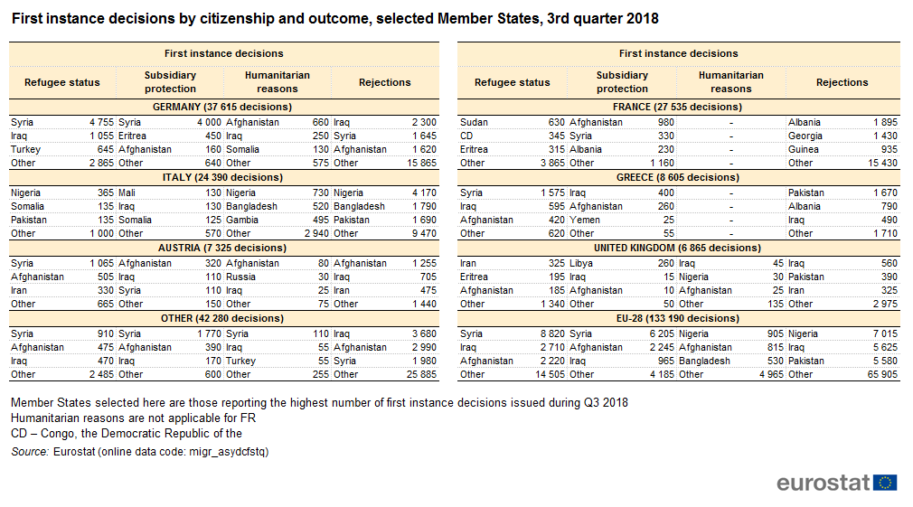
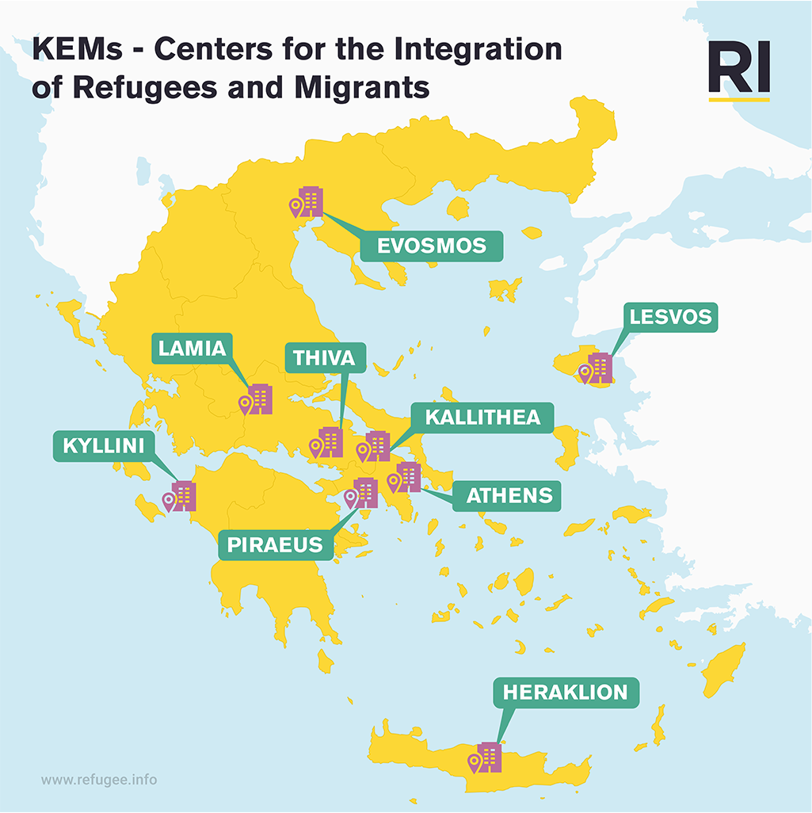
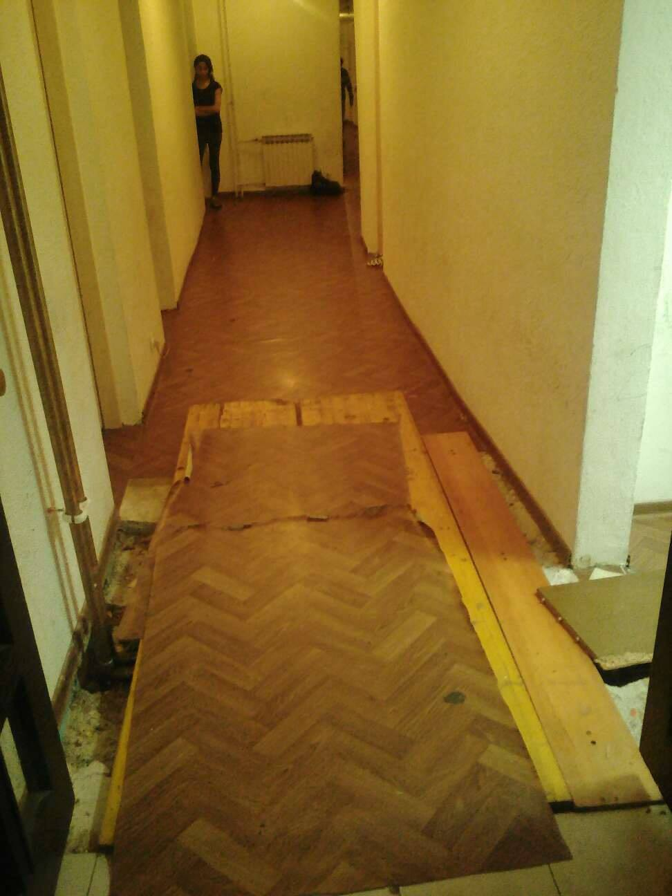
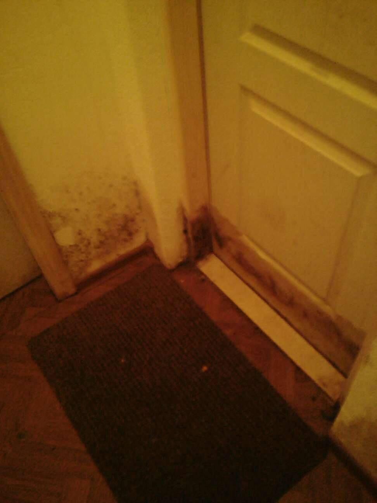

### **AYS Daily Digest 15/01/19: A nine\-year\-old girl died when a dinghy sank off the Turkish coast**
#### **Greek Coast Guard ‘tried to kill us’, her father says / Heavy rainfall in Syria makes conditions unbearable / UNICEF MENA: Children's life at risk / Morocco returns migrants trying to escape the country / Snow in Moria camp / People returning to Serbia from Bosnia / New initiative will help refugee entrepreneurs in Milan, Italy / Syrians, Afghans, and Iraqis the three top nationalities seeking refuge in the EU / And much more news…**

 ” Photo: [Salvamento Marítimo Humanitario](https://www.facebook.com/smhumanitario/?__tn__=kC-R&eid=ARB5y2j8VHM_oBkM4SkuSRBQP19xvfjoZhcXu_EPb8J9tbzR7TxhQO6tDAgJG6unScoGigE1U01pkU5h&hc_ref=ART4S7iHzVKYyJaSYaoEkrVTwe5EQqfYKevwUQW_ZYu93SoU63zDIrJW78_Ir17PZGc&__xts__%5B0%5D=68.ARB7VYJFA2ntwWOp0mCE8a30LR5_2_xkgmh2lDLSfdAUHey5sFGmLqPTGFT6T1wnREyL9BgKux576zkNJOmUo6zj_tITuQ0j-XwRAeiZGkIVFhvz3aADaTfBmMgxQ219obdsrpQvYcAnpTcGI_ohyCHicLGtO6iuR-2s_rkN3QA25Fm7u2vetS6Pb9Ejgj2OK2VObc1M-JbvBFZRgXI-pNQ1RakUfNY_oCslm1q-OJ8LNJmbyvL3vDAv9-Y35xp6iNSNmN-I_Y_dyys9ATcgU_4KPW4MVAGmJMgZjFx3H_BpWGdh8O-aZjj50vhf9ivosYvjiH7brKqXIwZ_rq77af6HKA)](assets/1fc42e8da61/1*4eG_MZECMjjW09rMBenlWg.jpeg)

“ [It was so inhumane\. They tried to kill us](https://www.dailysabah.com/turkey/2019/01/15/greek-coast-guard-tried-to-kill-us-father-of-drowned-migrant-girl-says?fbclid=iwar3k1ocotix_pcgpozkfwkqm_olvaljskqoutwke8r6yxmum8fzaanclpii) ” Photo: [Salvamento Marítimo Humanitario](https://www.facebook.com/smhumanitario/?__tn__=kC-R&eid=ARB5y2j8VHM_oBkM4SkuSRBQP19xvfjoZhcXu_EPb8J9tbzR7TxhQO6tDAgJG6unScoGigE1U01pkU5h&hc_ref=ART4S7iHzVKYyJaSYaoEkrVTwe5EQqfYKevwUQW_ZYu93SoU63zDIrJW78_Ir17PZGc&__xts__%5B0%5D=68.ARB7VYJFA2ntwWOp0mCE8a30LR5_2_xkgmh2lDLSfdAUHey5sFGmLqPTGFT6T1wnREyL9BgKux576zkNJOmUo6zj_tITuQ0j-XwRAeiZGkIVFhvz3aADaTfBmMgxQ219obdsrpQvYcAnpTcGI_ohyCHicLGtO6iuR-2s_rkN3QA25Fm7u2vetS6Pb9Ejgj2OK2VObc1M-JbvBFZRgXI-pNQ1RakUfNY_oCslm1q-OJ8LNJmbyvL3vDAv9-Y35xp6iNSNmN-I_Y_dyys9ATcgU_4KPW4MVAGmJMgZjFx3H_BpWGdh8O-aZjj50vhf9ivosYvjiH7brKqXIwZ_rq77af6HKA)
### FEATURE: Father accuses Greek Coast Guard of trying to ‘kill them’

_“There were strong waves\. We thought they came to save us\. They told us to cut the engine\. They tied our boat to theirs with a rope, and then they start to turn us in circles\.”_

_“I told them there were children aboard, but they wouldn’t listen \(…\) There was too much water in the boat when they left us\.”_

[The words are a nine\-year\-old girl’s\* fathers](https://www.dailysabah.com/turkey/2019/01/15/greek-coast-guard-tried-to-kill-us-father-of-drowned-migrant-girl-says?fbclid=iwar3k1ocotix_pcgpozkfwkqm_olvaljskqoutwke8r6yxmum8fzaanclpii) after he managed to pull his two other kids to safety, as he talked to journalists from The Daily Sabah\. But Zainab, his nine\-year\-old daughter, drowned before the Turkish Coast Guard found her body\. The young girl’s father says that the Greek naval officers tried to kill them, as they refused to listen to him while he said that it was children onboard and instead turned around the boat, back to Turkey again\.

The boat started to take in water not long after it left the western Turkish city of Kuşadası\. The family, consisting of the father Muhammad Fadel, the mother Kawsar and the three children, were traveling together with another 45 Iraqi migrants towards the Greek island of Samos\. The Greek officials did nothing to help them, rather the opposite\. As [The Daily Sabah reports](https://www.dailysabah.com/turkey/2019/01/15/greek-coast-guard-tried-to-kill-us-father-of-drowned-migrant-girl-says?fbclid=iwar3k1ocotix_pcgpozkfwkqm_olvaljskqoutwke8r6yxmum8fzaanclpii) , Greece is violently pushing back people to Turkey\. The family and the other migrants onboard were returned back to the very same place as they left\.

[In December HRW:s Bill Frelick wrote](https://www.hrw.org/news/2018/12/20/deja-vu-greek-turkey-border) that he experienced déjà vu in terms of police brutality and push backs on the Greek\-Turkey land border\. What he wrote in a report from 2008 echoed the words from the new report from 2018 too well\. [This](https://www.hrw.org/report/2008/11/26/stuck-revolving-door/iraqis-and-other-asylum-seekers-and-migrants-greece/turkey) is the report from 2008\. And [this is](https://www.hrw.org/news/2018/12/18/greece-violent-pushbacks-turkey-border) the new one, for those who wish to compare scenarios\.

[In 2019](https://missingmigrants.iom.int/) , already 21 migrants have died worldwide\. 16 of them died of presumed drowning in the Mediterranean, according to IOM’s Missing Migrants project\.

People’s stories, their hopes, and unfinished dreams are ending too soon: if the European Union and other actors could get their shit together the deaths at sea would decrease\. And if, as mentioned below the headline SEA in today’s digest, NGOs were allowed to save lives at sea fewer lives would be lost in the meantime\.

But young Zainab’s life will never be recovered\. She was nine years old\* and forced to travel in a leaking dinghy, in early January 2019\.

**\* Correction: the first info said the girl was nine, but [other sources](https://ozgurmanset.net/kusadasinda-multeci-botu-batti-1-cocuk-yasamini-yitirdi/) say that her age was as young as four\. \***
### **GENERAL**

[Syrians, Afghans, and Iraqis](https://www.facebook.com/1426949984189284/posts/2158464524371156/) were the top 3 nationalities who sought asylum in the EU in 2018, with 21\.200, 11\.200 and 10\.000 applications respectively\. Compared to previous years — this is low numbers, caused by deals with various third countries and increased border surveillance, to mention some contributing reasons\. For more details on first\-time asylum applications country by country, and some other stats, have a look at the images\.

](assets/1fc42e8da61/1*at2a_VGLn6jBs1OEW3mleQ.png)

Photos: [Rusmpi UG\- Institute on Migration Policy](https://www.facebook.com/Rusmpi-UG-Institute-on-Migration-Policy-1426949984189284/?__tn__=kC-R&eid=ARAMMC3SNLuVAZTCbsbdH4W74kfDlyWPxz-GI7GKPsI7FpVsARAFE9Vxl-aQofjrcosUXFDjcagSpY5j&hc_ref=ARSq6Fc6d5kCHdKoUarsk6LtCBH9tvmCMUoFWjodtnBBD63bu1XzSra_OI6IZ0G6rTg&fref=nf&__xts__%5B0%5D=68.ARDIA-a8SB0XO9rAFxFqg0GCkyMPdni-fN-_qyXzLqTpb7r00mU5QKlquE0pml1Mr30EqdNGHAuQDedNTkyPAXZk6np6T7OkcBV8CAKTIxV2-ooG0aJXu7lO3_CC46ZwUSQBJtrN_lxR5yJvwhVhlyE9Pd8t-YPHcLmLOM9hkTHR10HdSRwvWcaRnjB-gVHUNSmst-BtwR5VE-IyQ6LB1coayXxqYhJZblGam19KEwY-XP-wf61md48zoz9q0OwEA15ic89gbcB8lfGsGvRNwK1mh2iNNCV2sMs9irYg5S9wjxA44z8cNaXp3Y4sdKN0He-IOkF2vHpVo5SKh8NJC35tF2Dx)
### SYRIA

On the Syrian — Jordanian border, in Rokban camp, the situation is deteriorating due to the weather\. It is estimated that 60\.000 people live here\. As seen in the photos, heavy rain is falling on the desert camp and the wind is strong\. The Syrian Observatory for Human Rights reported that the living conditions for those seeking refuge from the raging war is getting worse, as the lack of food continues\. The Syrian regime has effectively been preventing food supplies to reach the camp, which has led to more and more expensive prices\. The lack of medical care is another big issue, as Jordan doesn’t allow people to enter its territory even for medical treatment\. The recent cold has also accelerated prices on heating supplies such as firewood\. [More info here](http://www.syriahr.com/en/?p=112610&fbclid=IwAR1bdPGRNP0LA4ON0UPIImNrfncQjeKM0qgRI12kQXA8McE-SN-gTz5jwg0) \.

[In the Latakia countryside](https://www.facebook.com/SyriaCivilDef/posts/2265623483762047?hc_location=ufi) , water levels are also rising due to rainfall\. It is blocking many of the roads leading to the thousands of tents in AL\-Ansar and Al\-Jabal, [Syria Civil Defence — The White Helmets](https://www.facebook.com/SyriaCivilDef/?__tn__=kC-R&eid=ARBJlRlZA7N-MFdkhgP3HnvmxogJVVyjnWWSya0yWmxIEsUhajks_A42EK_KRXDcY4c52NKTPRYYkZkZ&hc_ref=ARR5mAnUIUjeSQeswb-32KTfaFYp-O1259gahKEAG_-7kEsMxdGkpIhYkkC-a-r4i8A&fref=nf&__xts__%5B0%5D=68.ARDyqIoJO2_v373CVwT42q8LPRPr0Otrv6b-IspuHO7lVGHdaWhyhevX7-nvWQAGU-pjjqAVBaxoNq0blqUyT3tLFhmiZ38xtwgCCvSYfOdApxIpRDXd_T1ZWs6iuKq3RhPYOVgBlaXLIzCPwxUZn5404cn4PcQ8q9s_Ykat8A6j-x10WcUFGjPMpS5JRXA3S1fr_uIF5YTJnmzRypwb_TyFETmtDWuBXnjGf7gOGpJASq3UyEWmShC6jFNfcgoT4mHhx4J6BHTJyNMkcb9JRiALQgSo6QWXu-mW5GG_9FocZB3xbnunZSyoqtUji5PwPe0HuqNYtkw7eIaxlaDKRQf87jCa) , wrote in an update\.

](assets/1fc42e8da61/1*hWwbLfO4MAoDPEX6TtIMWg.jpeg)

Photo: [Syria Civil Defence — The White Helmets](https://www.facebook.com/SyriaCivilDef/?__tn__=kC-R&eid=ARA5Q6E8vdNzo1qDbC9x68JMovqhkJWcok238-0_rcAbssrj8lbXpRiP1jBKx2ior9z9hT3XBaSXjbqO&hc_ref=ARSADM-DbMS3XQssy_Ri8skU4_K_AT0Q3D3GioQQWahekqYxncO8sdlbHHhvClipwjE&fref=nf&__xts__%5B0%5D=68.ARCGqS4_K9hBCSomnp8xtZ_v0yckCfoMySHbj1dM-Y5ii9jCAsF4wBtaVu1IeVryOveaZPevzB5XCsB-Kmr_DajvSsroVXO0F_Q9w6Re__5RHM7uMR15b3UW9BySWaOcfqKWOer7Kk_lmKo7M_mGasuSne_mMWiwI0yC1m1vvg1dMS7G1Uz94JzunwebeZ8pWyOSKhLeTwwPqrHXLkessZTcRB4_rELy-R7maROLYsfim3uwpXCAIjPRuUCE-3ejWgGlUPhXSPj_BvDmUT8fixOD08v5mArJ09wlVllw7gJE9Z0e-d96K9ufFVRJFXpiCThHCCvqEU1_3_lyZdWg56jmluAV)
#### Lack of healthcare puts children’s life at risk, UNICEF sais

Amid the reasons are freezing temperatures and squalid conditions\. Many have been forced to flee the past year, the war is not over for those trapped in the country\. Among those fleeing from Rukban 8 children died, and of those fleeing from Hajin, 7 children died\. 13 of the children were under 1 years\-old\.

[Read more here](https://www.unicef.org/mena/press-releases/lack-access-medical-care-syria-putting-childrens-lives-risk?fbclid=IwAR3a4KWAyLnhyQ4VOXvEHYP9ARz_PeXC_r6lsKrcPsQnrZ1SnMLvTleVAlo) \.
### MOROCCO

Another eviction in the forest camps outside of Nador today\. AYS have been told that the police squads are coming almost every day except for Sundays\. The residents have to rebuild their homes — time after time\. [Association Marocaine des Droits Humains — Section Nador](https://www.facebook.com/AmdhNador/?__tn__=kC-R&eid=ARC8AQdFRX_MTNZBDxvC5Thy01nBeTcGeSHhhEsFb0OvV4obWwyuUNf6F2UHV3Y30bsbKM38o1SwW16J&hc_ref=ARQS-5J034yx-ERwTaLy6GwXUa500NB2501TwFcKpFiGQKbpDzYEgiQlo_6pjHKnD70&fref=nf&__xts__%5B0%5D=68.ARDDFhj6a0KuU49CmBvqzAfcqChOZKL8oF2dYcfarHTsrk7QwYfa_nnE4f1jwbPckPMS-G40xPh26CMQLwEIeCkF55JTpxrjvIetCN1cm3yWw-Cg8EYWoD-MYLaJ1-U7XvNR_IBSQiswYMhCz5E7_LxVRapvSfbjdz5Ehgwm7DYt2uwe1ld-UjeaYFaK1d8BCc-iglUsrsNxRDQ_dDzxkbpAKYJ8jfHawqL2sRqS7fCb5BkBxBcXgdYTljrWvtmntmdg5yMySNYBD_2PEMEtDJ_6fndTA_DJCJZUiFQ6UOcYBvCM6b5J3wFnAIxaxnv8wGKnShLIol5i237ZZkMicbbwSPA5) reported that following the eviction two deportation buses left Nador during the afternoon\. According to the same organization, it is the Moroccan Ministry of Interior that is responsible for the incidents\.

](assets/1fc42e8da61/1*N8K8tggw4kO5bsn9Dt7SpA.jpeg)

Photo: [Association Marocaine des Droits Humains — Section Nador](https://www.facebook.com/AmdhNador/?__tn__=kC-R&eid=ARC8AQdFRX_MTNZBDxvC5Thy01nBeTcGeSHhhEsFb0OvV4obWwyuUNf6F2UHV3Y30bsbKM38o1SwW16J&hc_ref=ARQS-5J034yx-ERwTaLy6GwXUa500NB2501TwFcKpFiGQKbpDzYEgiQlo_6pjHKnD70&fref=nf&__xts__%5B0%5D=68.ARDDFhj6a0KuU49CmBvqzAfcqChOZKL8oF2dYcfarHTsrk7QwYfa_nnE4f1jwbPckPMS-G40xPh26CMQLwEIeCkF55JTpxrjvIetCN1cm3yWw-Cg8EYWoD-MYLaJ1-U7XvNR_IBSQiswYMhCz5E7_LxVRapvSfbjdz5Ehgwm7DYt2uwe1ld-UjeaYFaK1d8BCc-iglUsrsNxRDQ_dDzxkbpAKYJ8jfHawqL2sRqS7fCb5BkBxBcXgdYTljrWvtmntmdg5yMySNYBD_2PEMEtDJ_6fndTA_DJCJZUiFQ6UOcYBvCM6b5J3wFnAIxaxnv8wGKnShLIol5i237ZZkMicbbwSPA5)
### SEA

With Open Arms stuck in Barcelona — the Western Mediterranean is also getting more and more dangerous to cross, MSF Sea tweeted today\.

■■■■■■■■■■■■■■ 
> **[MSF Sea](https://twitter.com/MSF_Sea) @ Twitter Says:** 

> > The capacity in the Central #Mediterranean to rescue people in distress was already extremely low. With @[openarms_fund](https://twitter.com/openarms_fund) blocked from providing #humanitarian assistance, this gap has become even more deadly. 

> **Tweeted at [2019-01-15 12:57:33](https://twitter.com/msf_sea/status/1085159048289366016).** 

■■■■■■■■■■■■■■ 

[Watch The Med — Alarmphone](https://www.facebook.com/watchthemed.alarmphone/?__tn__=kC-R&eid=ARCQ_guV8j1xFkqp2UA5FAEqTgZH2uwuwNy1NoDnJD6-0xvLjnIl_9TSSWAanhrGjeOTi76pWh40_HjY&hc_ref=ARSjEsMp4PX29vwDP5I5jAZIswaQDQXyJV5ql2rsPTn4Tdc78P60D6wpvu4Oigzo6VQ&fref=nf&__xts__%5B0%5D=68.ARDgPFJnRHYS2OwhGZBinAjR0ZHDvH4B2C0NUM1X666p-6vlSgsiicKGwD16J_Ruqxw8n1_ybU1xyPVv1kj6BKTi5OeHArXDBHsbwQuZC6gOLBI0VSp9Ip2rS0BxyeTByuusLq6zsavED2TSGQ_MNxlRScTLBBrUw-arC9tJSQ3iT5-Ov2PGEEuRBonrluX00Adzmwbau-JDdHhTI4udHBLyYM91eU3JnPR5O4MoyiOCtyh7sNY7BoR0Fu1pHYSTVbZ_Z_Af9nMhDoDT_UGPTycPGqHQ70UNW2rFArGjM5pqA_akr1NRyGGjWI8i-THE0jgzWr2uLM5cw2PljEa92ponW_dn) said that [between the 7th and 13th of January they alerted 5 boats](https://www.facebook.com/watchthemed.alarmphone/photos/a.1526182797655958/2294428357498061/?type=3&theater) in the Western Mediterranean\. One example is on the 8th of January when one boat with 49 people left Charrana near Nador, Morocco and was returned back by the Moroccan Navy\. As [AYS wrote in a recent special](ays-special-from-nador-we-know-that-what-we-do-here-is-dangerous-d16c0f587957) , Morocco has received 148 million euro from the EU in 2018 in order to deal with the emerging migration trends from and through the country\. Returning people seeking safety is one way of using them\. On the 9th of January, another boat was returned, including six women and one child\.

](assets/1fc42e8da61/1*vRNC8ai648LVthT9QGPRKA.png)

Photo: [Watch The Med — Alarmphone](https://www.facebook.com/watchthemed.alarmphone/?__tn__=kC-R&eid=ARCQ_guV8j1xFkqp2UA5FAEqTgZH2uwuwNy1NoDnJD6-0xvLjnIl_9TSSWAanhrGjeOTi76pWh40_HjY&hc_ref=ARSjEsMp4PX29vwDP5I5jAZIswaQDQXyJV5ql2rsPTn4Tdc78P60D6wpvu4Oigzo6VQ&fref=nf&__xts__%5B0%5D=68.ARDgPFJnRHYS2OwhGZBinAjR0ZHDvH4B2C0NUM1X666p-6vlSgsiicKGwD16J_Ruqxw8n1_ybU1xyPVv1kj6BKTi5OeHArXDBHsbwQuZC6gOLBI0VSp9Ip2rS0BxyeTByuusLq6zsavED2TSGQ_MNxlRScTLBBrUw-arC9tJSQ3iT5-Ov2PGEEuRBonrluX00Adzmwbau-JDdHhTI4udHBLyYM91eU3JnPR5O4MoyiOCtyh7sNY7BoR0Fu1pHYSTVbZ_Z_Af9nMhDoDT_UGPTycPGqHQ70UNW2rFArGjM5pqA_akr1NRyGGjWI8i-THE0jgzWr2uLM5cw2PljEa92ponW_dn)
#### 6 people missing\!

_“ [At 7\.30am](https://www.facebook.com/watchthemed.alarmphone/posts/2294387617502135?hc_location=ufi) we were alerted to a boat in distress with 6ppl who left from [\#Tangier](https://www.facebook.com/hashtag/tangier?source=feed_text&epa=HASHTAG&__xts__%5B0%5D=68.ARAG-vlfXmn16FuabyllBtVri7OATeDNwZIwVJhm8trk9LF4RuNm-GqyJ70CAc6wLgzmX5jb-up2bQI5ImgOlJCEtU5tsQuscLbbokUw0qfiyB4WTjS4DfpphWgoKuggXr_q2-De6STRT69r3xoLedDUuO9Om8iwm0g9osQuDpLhOI5BHieLNqnIefuie91R7zdMMreoMGiSlUix9fPitPjYalJPTvG4pnyGCjoZY3mjd5nU0Qyn55JZ92H3COmToYTxdz3yJ2WSBa2i5W-kd1aaeUgV_8dBTeVR5NnFfIiuFmcXEDKb0cHjfzsZCup51xPwuFI8mDlNE4KdRX5KILWDpvLy&__tn__=%2ANK-R) [\#Morocco](https://www.facebook.com/hashtag/morocco?source=feed_text&epa=HASHTAG&__xts__%5B0%5D=68.ARAG-vlfXmn16FuabyllBtVri7OATeDNwZIwVJhm8trk9LF4RuNm-GqyJ70CAc6wLgzmX5jb-up2bQI5ImgOlJCEtU5tsQuscLbbokUw0qfiyB4WTjS4DfpphWgoKuggXr_q2-De6STRT69r3xoLedDUuO9Om8iwm0g9osQuDpLhOI5BHieLNqnIefuie91R7zdMMreoMGiSlUix9fPitPjYalJPTvG4pnyGCjoZY3mjd5nU0Qyn55JZ92H3COmToYTxdz3yJ2WSBa2i5W-kd1aaeUgV_8dBTeVR5NnFfIiuFmcXEDKb0cHjfzsZCup51xPwuFI8mDlNE4KdRX5KILWDpvLy&__tn__=%2ANK-R) ”_ , [Watch The Med — Alarmphone](https://www.facebook.com/watchthemed.alarmphone/?__tn__=kC-R&eid=ARCQ_guV8j1xFkqp2UA5FAEqTgZH2uwuwNy1NoDnJD6-0xvLjnIl_9TSSWAanhrGjeOTi76pWh40_HjY&hc_ref=ARSjEsMp4PX29vwDP5I5jAZIswaQDQXyJV5ql2rsPTn4Tdc78P60D6wpvu4Oigzo6VQ&fref=nf&__xts__%5B0%5D=68.ARDgPFJnRHYS2OwhGZBinAjR0ZHDvH4B2C0NUM1X666p-6vlSgsiicKGwD16J_Ruqxw8n1_ybU1xyPVv1kj6BKTi5OeHArXDBHsbwQuZC6gOLBI0VSp9Ip2rS0BxyeTByuusLq6zsavED2TSGQ_MNxlRScTLBBrUw-arC9tJSQ3iT5-Ov2PGEEuRBonrluX00Adzmwbau-JDdHhTI4udHBLyYM91eU3JnPR5O4MoyiOCtyh7sNY7BoR0Fu1pHYSTVbZ_Z_Af9nMhDoDT_UGPTycPGqHQ70UNW2rFArGjM5pqA_akr1NRyGGjWI8i-THE0jgzWr2uLM5cw2PljEa92ponW_dn) wrote\. Later on, Salvamento Maritimo supposedly rescued them\.
### GREECE
#### New statistics available

[Greek Asylum Service — Υπηρεσία Ασύλου/Υπ\. Μεταναστευτικής Πολιτικής](https://www.facebook.com/Greek-Asylum-Service-%CE%A5%CF%80%CE%B7%CF%81%CE%B5%CF%83%CE%AF%CE%B1-%CE%91%CF%83%CF%8D%CE%BB%CE%BF%CF%85%CE%A5%CF%80-%CE%9C%CE%B5%CF%84%CE%B1%CE%BD%CE%B1%CF%83%CF%84%CE%B5%CF%85%CF%84%CE%B9%CE%BA%CE%AE%CF%82-%CE%A0%CE%BF%CE%BB%CE%B9%CF%84%CE%B9%CE%BA%CE%AE%CF%82-481351218685655/?__xts__%5B0%5D=68.ARAtySwXKKCU0C2xEPYqccDJraxpPX4JDL8LLhXXNOohFXpngzmx_JjWV_7i7rkcdKomCj3HRAbw6IIbmusY2wYzUmF0rTJXUNmK2_zc4LspCJzOAYS1OJGs4O7jUyNVImOcjOy5hkUbH9JWZnMYDKyEbGzTI9aDX4BbEnJhVkKBVDGDukXObE5o1W-WdA0JBizUovw79fQhgKydGECWbGYDVboYriLitJpAJA3a5RLUAnRt0wKORlGY_P1eN07D1fZod0t6_zSY6RwK9Gy_qaDz1csI33N_hAecNNItA1PxgpJurscoWhRWkYiiDe0IiUzdDuO5SHBMvf-QIJOD22Hdsw) released the following fact\-sheet\.

](assets/1fc42e8da61/1*PeYzkkmO62mWuUY2_YBfVw.png)

Photo: [GAS](http://Greek Asylum Service - Υπηρεσία Ασύλου/Υπ. Μεταναστευτικής Πολιτικής)
#### Integration centers for those who need help

[In several locations](https://www.facebook.com/refugee.info/photos/a.1063678090359004/2100067610053375/?type=3&theater&hc_location=ufi) in Greece [راهنمای پناهندگان Refugee\.Info دليل اللاجئ](https://www.facebook.com/refugee.info/?__tn__=kC-R&eid=ARARog30ldpYuKWO2Afch_P6ADZrK-J-DUZUqcpy42_iDkKPXLz3TUxtIhLS5e7I-ic_oy7zYgm_1Nk6&hc_ref=ARRe1FsO77wLkyfhGkFlUgWei3KNXr9pvjQGSZHv6vXn690MyTlBZ8wOi1AiImEpIg8&fref=nf&__xts__%5B0%5D=68.ARArps6CXD1yHlOrmOjflkx2lhgbbtfUhA7_zZCGVNP_Wb4AA6I0XK9wEAZnyLKhjinGGuIEP7_XfQiKCNOE_-uoEOZYHnx318nV4ZC313aLX1fHreq6wfxRvtynAaiReH4cz6sHa6lryrXqMvdpo-Wf6tAISMOQT38AatwKyj2Y5u4qLTTepA7iiAY184_WaRbEjIowJJBIku0QHCuW2J8_iViHsRgx2qS0vAh5sCoaoklytDv_BjSPWe8JAwdLNS0U1bJ21FnmdexNVRDubJwghyYJ_C8GViWuQ4OXWfjVtv35IRKbt__LloQejmfbIVcqgmwpy63giphoUyuBaU-ivA) posted about, those who need help with anything of the following can go:

🏛️ Public services

🏥 Public healthcare

💳 Social support

🏫 Education

💼 Employment counseling

#### Mainland

In Athens, [Amurtel Greece for Refugee Mothers and Babies](https://www.facebook.com/AmurtelHellasforRefugeeMothersandBabies/?__tn__=kC-R&eid=ARA_vZZ20CvMxOQokAM7fzCyYmZJEpdoZ-mRPFmqc98MwCdo4GoE_X4eO7bnOs-yTZL7CYvpD5T34T-p&hc_ref=ARTcTHqQoJN8CdfSy_m5z_uwC7gZWYjC3_kFAPiQ-ZasQt7nhzEF1IxpkVzyiw2fec0&fref=nf&__xts__%5B0%5D=68.ARAcjiwljCbUlIPtxrDuAEPcviuUP-ILbxiP6eloqjEuktpvM6Vuj7arQzaJQDZmHiOIyCXhPeCdpeAFiJrcR5tkI6I3fhrtUNOuJVeMJmPVb-M1PMtN6iW0eSCzO1i9EH6wQJJRExnsEGgTc_wUUf3KP2n1NnegeS8Nn1ONdML_g1dwyw4dSTUr7-aePFp1mHUZNJP3SuGdzBcFBcLIhcfZMNs0OP-Anik4fOWbSzwIfG5ZSgl8SwzsWDufpoQPgYFNJSXU1YUIjOBJkmCNugAuisq1bwVwq9AFExTd6XoL6wQ8rAVeao30kHv3bik-DqM0DDfsA0uR-wmdjeWIIJQ) , [released a new needs list](https://www.facebook.com/AmurtelHellasforRefugeeMothersandBabies/posts/784301568591721) as 2019 is starting off\. They support pregnant, lactating and postpartum women and much more that has to do with sexual and reproductive health and childcare\.

[Here](https://needslist.co/amurtel) is the list\.
#### Islands

[Aegean Boat Report](https://www.facebook.com/AegeanBoatReport/?__tn__=kC-R&eid=ARA_mnPBpepKGZyXuagvx3Y1XsRx2YcGnTcm15qbId2azIO-MkGgpJhxUDhprZcCWuU5iG1sFWzNnVip&hc_ref=ARQfzu0xSBuXtWwHx02sve9m05SVu83ZAxLZ8ZNfTzYxNjUfsCL5sZX99JsZE0a-3nI&fref=nf&__xts__%5B0%5D=68.ARAadm_mLdiT1t3xAyd4ktPrsGW9ztWvATiAL-Y_bXrui4aseLZEaDgfv0P7a-0HIWDjXZoumglzRjezsKsFbyQFhBompUMkMDt9NOE6dLlyfr3eJT-bECqrA20zJ8RNOLo4hzyP9-6bBexSshL-v_yOxwcLEtsYIoi28MKZqxC0MT9i0UipCp_MgJCLtjf3E4gkedPdzz1ultrwlg-yPpGwsFaamT5xWN68Mu5qRIOiq-cMBnPFWNVyunP05P8cfhhCZAMnlvWRkuoYeKIxiFi7qJB2gp28EK2leIzliySB2vaqIuFxUf6S26XvgHtq1hQr92BlCMMkjL8OmFjAD5E) released newly updated statistics, as they will do every day\. According to their numbers, 16\.075 people are living on the islands right now\. But, depending on source the details can shift\.

[In 2019 16 boats](https://www.facebook.com/AegeanBoatReport/photos/a.285312485325196/508404386349337/?type=3&theater&hc_location=ufi) have been stopped by police or the Turkish Coast Guard from reaching the islands, carrying a total of 616 people\.

](assets/1fc42e8da61/1*iPECZLdb0YuAsy98ZWIdgA.jpeg)

Photo: [Aegean Boat Report](https://www.facebook.com/AegeanBoatReport/?__tn__=kC-R&eid=ARA_mnPBpepKGZyXuagvx3Y1XsRx2YcGnTcm15qbId2azIO-MkGgpJhxUDhprZcCWuU5iG1sFWzNnVip&hc_ref=ARQfzu0xSBuXtWwHx02sve9m05SVu83ZAxLZ8ZNfTzYxNjUfsCL5sZX99JsZE0a-3nI&fref=nf&__xts__%5B0%5D=68.ARAadm_mLdiT1t3xAyd4ktPrsGW9ztWvATiAL-Y_bXrui4aseLZEaDgfv0P7a-0HIWDjXZoumglzRjezsKsFbyQFhBompUMkMDt9NOE6dLlyfr3eJT-bECqrA20zJ8RNOLo4hzyP9-6bBexSshL-v_yOxwcLEtsYIoi28MKZqxC0MT9i0UipCp_MgJCLtjf3E4gkedPdzz1ultrwlg-yPpGwsFaamT5xWN68Mu5qRIOiq-cMBnPFWNVyunP05P8cfhhCZAMnlvWRkuoYeKIxiFi7qJB2gp28EK2leIzliySB2vaqIuFxUf6S26XvgHtq1hQr92BlCMMkjL8OmFjAD5E)
#### Lesvos

[Snow is](https://www.facebook.com/sol2refugeesen/posts/2015114462114220?hc_location=ufi) covering Moria, [Refugee Accommodation and Solidarity Space City Plaza](https://www.facebook.com/sol2refugeesen/?__tn__=kC-R&eid=ARC5lwTWb5u2Ig_HJN2Rj6s2gyfWcJ8Z3wsC_8SvlFXidey_KahZghUEFqysXdCbLUnabrcxT91lDfWy&hc_ref=ART_RQ1biZFh_XGXUwEjZgBtksT-6csyMGcmBQmi99ZE0Y829MGuKFfoo06vybRQhPk&fref=nf&__xts__%5B0%5D=68.ARBGTCzUR2KH3Z-NSx3wGLWeNuJxkAVKLg_DSbaT9YS7qWlar0uGWk-o-s17ZjEpm-jyFCzBULT1DMxZWUY3Dm6bpXena7SEHqJooy0Zjdz1e9oX04L7pazeaFqYS-Z57JG8pBhdm4IkKo-eKm9zFwMcrSatvnGbtVIowHRvIBixXAp3gHfzvDa0IgT_o4F7-yB3iBMXrNbQz3LQJYqIXjPagHuE93XPcCsDEfKW5k4VrE-E2MlYbXsw56Vj7YB4SaFhEkHDaPPsoaOT8ksZdALz9eF2OufUB8Bg0LmQDb5qF0D7BMmFiUho7R6utDlcbEZ6rWA653vOKUNaAFXbHeEWCV2x) updated on\. The conditions are horrible\. Open the islands, stop trapping people in these situations\.

](assets/1fc42e8da61/1*GB-sfbZ737nMQlZM-sWViA.jpeg)

Photo: [Refugee Accommodation and Solidarity Space City Plaza](https://www.facebook.com/sol2refugeesen/?__tn__=kC-R&eid=ARC5lwTWb5u2Ig_HJN2Rj6s2gyfWcJ8Z3wsC_8SvlFXidey_KahZghUEFqysXdCbLUnabrcxT91lDfWy&hc_ref=ART_RQ1biZFh_XGXUwEjZgBtksT-6csyMGcmBQmi99ZE0Y829MGuKFfoo06vybRQhPk&fref=nf&__xts__%5B0%5D=68.ARBGTCzUR2KH3Z-NSx3wGLWeNuJxkAVKLg_DSbaT9YS7qWlar0uGWk-o-s17ZjEpm-jyFCzBULT1DMxZWUY3Dm6bpXena7SEHqJooy0Zjdz1e9oX04L7pazeaFqYS-Z57JG8pBhdm4IkKo-eKm9zFwMcrSatvnGbtVIowHRvIBixXAp3gHfzvDa0IgT_o4F7-yB3iBMXrNbQz3LQJYqIXjPagHuE93XPcCsDEfKW5k4VrE-E2MlYbXsw56Vj7YB4SaFhEkHDaPPsoaOT8ksZdALz9eF2OufUB8Bg0LmQDb5qF0D7BMmFiUho7R6utDlcbEZ6rWA653vOKUNaAFXbHeEWCV2x)
#### Samos

There is an ongoing crisis in Samos, [Mare Liberum](https://www.facebook.com/MareLiberumOfficial/?__tn__=kC-R&eid=ARBd11bdsLCZEQhgrAf6VN0sLRPu4_CNR2QNJYZxKKkN7LS01c8JCoP5PKQQKtSHVC4QMa1LpCeGD0qi&hc_ref=ARQa7Fd-siCRlIE0M9k0Mm0rY8FRM16iltFe-4IaDXL38QYdclisnq6eCLk0X2rHxr0&fref=nf&__xts__%5B0%5D=68.ARCm6McHQlW87JiIUQdHgKSMryUVWzz8KVQLVDvQyBLM7P8vb0R7MZaU2vWGhC2DgEa5WsoUKMZUf-42yUyhsy8oluOHy92g-P81N3oFyrn_x3_YNHw1iayU8sdQiSVOHiAwUSVLYITpfp9tfSaocZdUhtbiNc94e3cZ9BFyUklUQ7MFZGtDpMDQOz8s3f7eDzjNLA9k_ZJL7-VCF-hw_IBxkLI7NjBSZ-FVnm81OfVDBwX0yQsCfDOuPh0H9-bpD6W7Lys7AMFXJ4hbM7nZqkL31PVy7SKfxfLz0Ujiv-G5oyXkv5pGX0KB1ui-mVkw9X_svS2txxrIQJ3ub-oLxnI) reports:

_“ [The EU needs](https://www.facebook.com/MareLiberumOfficial/posts/343685579693685?hc_location=ufi) to guarantee safety from cold weather, medical and psychological support, the right of free movement and social security\!”_

It is cold, rainy, and miserable, with insufficient medical and food supplies\. AYS had a special about the conditions on islands recently, [read it here\.](ays-special-prison-island-surviving-another-winter-on-samos-72ead10d5096)

](assets/1fc42e8da61/1*JYdFiR_jEeBh8sMTQEl5Fg.jpeg)

Photo: [Mare Liberum](https://www.facebook.com/MareLiberumOfficial/?__tn__=kC-R&eid=ARBd11bdsLCZEQhgrAf6VN0sLRPu4_CNR2QNJYZxKKkN7LS01c8JCoP5PKQQKtSHVC4QMa1LpCeGD0qi&hc_ref=ARQa7Fd-siCRlIE0M9k0Mm0rY8FRM16iltFe-4IaDXL38QYdclisnq6eCLk0X2rHxr0&fref=nf&__xts__%5B0%5D=68.ARCm6McHQlW87JiIUQdHgKSMryUVWzz8KVQLVDvQyBLM7P8vb0R7MZaU2vWGhC2DgEa5WsoUKMZUf-42yUyhsy8oluOHy92g-P81N3oFyrn_x3_YNHw1iayU8sdQiSVOHiAwUSVLYITpfp9tfSaocZdUhtbiNc94e3cZ9BFyUklUQ7MFZGtDpMDQOz8s3f7eDzjNLA9k_ZJL7-VCF-hw_IBxkLI7NjBSZ-FVnm81OfVDBwX0yQsCfDOuPh0H9-bpD6W7Lys7AMFXJ4hbM7nZqkL31PVy7SKfxfLz0Ujiv-G5oyXkv5pGX0KB1ui-mVkw9X_svS2txxrIQJ3ub-oLxnI)
#### Chios

One boat arrived today, no breakdown and 21 men on board, according to [Aegean Boat Report](https://www.facebook.com/AegeanBoatReport/?__tn__=kC-R&eid=ARDb1FFa-InR1ZxlU5CZMpJv2sLiHv3mOe3_V84jNVi580KNUhBKXo5HSMSLujJL4UE-YE68oqcclY8g&hc_ref=ARSG1Tl5h-McAfTk_GgK6zjzSSQLfptByv-znKOv5p4-Jue5dclezwE4PK3DrayQXQA&fref=nf&__xts__%5B0%5D=68.ARBMwbVZl881cnh6ypzom0YwPIOzvyrFm2_oWxh7bI3RWumi4ZozvhimjNF2Cc8d02wQw2uMiIq2F73lM95NZMrpfJ9aGmYVffPWMNA9PexFqRuizFkIeG-qOHBOmkAPOaCoOu0kU8oFbJo8lhuauEB18AEFkZFPwOU05G7JoKrFxCMdxOcYVqlh2f5L04yr9xyfzOT17rKQ5IVKTx2xsMJlE_1w3_kn-VZAqcUA2o8Ud2FbmRadEV3Emma8Z1egJ2RlDNRucIJHmhZTzXNP-MIhD4PBqJG6Uy0vK30bqsyALpB71U5rJlJSw-0fMMP4lVJ62y2P1ospq3vztNKPnC4) \. [Salvamento Marítimo](https://www.facebook.com/smhumanitario/?__tn__=kC-R&eid=ARBb70ArL6MUNfpyTOUE6PlSh5EvKYtRPQtDEHfZfG-dONVAAlhUBOr8zj8yVeXN1QTx94brJ7-U6DjW&hc_ref=ARRhO1NbEjQEKFifieethRS3sRVRwQgMdc30LymJz3HbzO7CJxm46wOFGzDPF7oZ7B0&fref=nf&__xts__%5B0%5D=68.ARDrmdB827E9WSpeBsi-5cwXfjPATOaJYDukZllJmLBc9ahFB3dyGoAbrQ1FRamfUBNgDJPVqCDAnjeXT5IZ1wHRyQxS4Y__fS6Xfwh0sSXrAa_O9IbbkQdlikQIzjWci6PTuPKkWuRlMf3MDymnLa1fWueZ-2y8BRbLqbTWh-Ia-XRFIXhJCcT45rDgLptrohbg_zHK4ZcYvhhAHInIHCeabXXyflM653KGwk8JbP0OBNUmCwZD2gg4ZXXSQ1WZbsNr_Jn-OilHHB1a3cHB9K_XgUJqaxPZ8bWKoNKyCEM6VQpyPEnrgFOAMtnXSib6nSEpFGN6abBX5GJvc9fkD3pDZg) [Humanitario](https://www.facebook.com/smhumanitario/?__tn__=kC-R&eid=ARBb70ArL6MUNfpyTOUE6PlSh5EvKYtRPQtDEHfZfG-dONVAAlhUBOr8zj8yVeXN1QTx94brJ7-U6DjW&hc_ref=ARRhO1NbEjQEKFifieethRS3sRVRwQgMdc30LymJz3HbzO7CJxm46wOFGzDPF7oZ7B0&fref=nf&__xts__%5B0%5D=68.ARDrmdB827E9WSpeBsi-5cwXfjPATOaJYDukZllJmLBc9ahFB3dyGoAbrQ1FRamfUBNgDJPVqCDAnjeXT5IZ1wHRyQxS4Y__fS6Xfwh0sSXrAa_O9IbbkQdlikQIzjWci6PTuPKkWuRlMf3MDymnLa1fWueZ-2y8BRbLqbTWh-Ia-XRFIXhJCcT45rDgLptrohbg_zHK4ZcYvhhAHInIHCeabXXyflM653KGwk8JbP0OBNUmCwZD2gg4ZXXSQ1WZbsNr_Jn-OilHHB1a3cHB9K_XgUJqaxPZ8bWKoNKyCEM6VQpyPEnrgFOAMtnXSib6nSEpFGN6abBX5GJvc9fkD3pDZg) [said the men were](https://www.facebook.com/smhumanitario/photos/a.921278434630674/2057811344310705/?type=3&theater) from Egypt, Kuwait, Palestina, Iraq, Yemen, and Iran\.

](assets/1fc42e8da61/1*tGWA1DLkXrQ1EL6lZ32nQQ.jpeg)

Photo: [Salvamento Marítimo Humanitario](https://www.facebook.com/smhumanitario/?__tn__=kC-R&eid=ARDst8Uej5wjLuoQ6N3dekvdtGk2TN9Fg2SK-PR1uDwZjTsb7HssApe30yc4Twy27Si0nk4Ab7AMfN_H&hc_ref=ARS-mEplicW2FV4-64K80gjeKxdu3_2D0a_EovD92b-P3NhPDQP_jyqmoA2x7idIb7o&fref=nf&__xts__%5B0%5D=68.ARDTr2mHA3vUpiP1i3rHMdSMuHIZwM4a1iOiGk7yTApsm5tLXj9D72_CPFZ-jvoAEXqS0jnJfEwB9nr7JChr4ZdKo5nfXq9IiJfqsTZra54zaZGC_ZgyalNAyQSTtSzI6laIpo57azlUz1lw5VirmEvB-n2XR4l7xZFX9G54IXeg6fEnBthe4DKzAj680xvU3sKYk9VsuUlY_8uNMcoh3MG9Djn03t2opv_fXXxrqZdiQYHQi2mU8f3Y67fq7omF3Q2SPegiLN-Krhon2Ig8EkAgbSsnfuIaWd2jnWYMWymqAqqkE2rgz-jwXe8XB_sasbjJG5Eh55LakFZUGZ2yohX3VA)
### **BALKAN WEATHER REPORT FOR WEDNESDAY**
#### MONTENEGRO

Predominately sunny\. In the morning weak, inland moderate to strong frost and possibly for or low clouds in the north\. Wind weak to moderate from changeable directions\. The lowest temperatures from \-14 to 0 and the highest daily from \-1 to 11 degrees\.
#### SERBIA

Predominately sunny for the most part of the day, in the east and north cloudy\. Snow of short duration during the morning and during the afternoon rain\. Wind weak to moderate from the west and southwest\. The lowest temperatures from \-8 to 1 and the highest daily from 3 to 9 degrees\.
#### BiH

In the center, east and north\-east fo Bosnia predominately cloudy in the morning and gradually clearing up as the day goes on\. Predominately sunny in the rest of the country\. Wind weak to moderate mostly southwestern\. Lowest temperatures from \-12 to 0 and highest daily from \-2 to 11 degrees\.
#### CROATIA

Predominately sunny, locally moderately cloudy\. Wind moderate to strong from time to time locally and alongside the coast a southern\. Kiwis temperatures from \-4 to 8 and highest daily from 8 to 13\.
### BOSNIA
#### Sarajevo

It has been below freezing throughout January and snow is covering the ground\. Volunteers in Sarajevo told AYS that they recently opened a community center, an indoor space where people living on the streets and in squats can get hot food in a warm place\. They can also charge their phones here\. For now, the numbers are quite stable and low: approximately 70 young men are living outside of camps and other accommodations for now\. Usivak camp near Sarajevo has 200 spare places, but for now, no one else wants to go there and prefer other, often squalid places instead of going to a camp\.

In case of new arrivals or other urgent needs, [BASIS Bosnia](https://www.facebook.com/BASIS-Bosnia-1487914718006023/?__tn__=kC-R&eid=ARATlNN_SldCML5aFs1mqjZY8Rcqh5UFYZMPH-bCSaCTv5UoY-TwLPXcKDNvwOY1NspLKTXNTlJIqMbV&hc_ref=ARRgWqKfDrZJs3TOqxzeRmAxp9zmLKoYas6PUyJ0TQlLbC3rKhkIRAAboNbsKpeAB_o&fref=nf&__xts__%5B0%5D=68.ARAWG4h1g9hjyBpOo788ZeonF9wQeRkwfG0fkr3fM9TkAb55tcrfcm9Y1Co0LAG6rlNh8IiJBt13ldzlUA5cKZ_DFv5__Ojyjlm0g3a91M7VDGNEt0LbWSh7VFqUP2chasL3pBsmo028I1sDcIGfA5-5KabRpjERE9f_iXdtcSPYxP7jlAr3V2LInCN9CLejfXXccJRuKW2pv06lOa24k-y_1-19G_iXXLgO6NyBRl4124RFH7Dzyy45KYR9PdkOGqGvpnEP7add0nRLys55AfI4K0FJzVXtxqNsOBUhAj52DWwi6rg2vZYe0f5oOOtjO2QmQlRd2Seh4QnhmUlFEDGhF-q1) has an emergency phone number\. The number is accessible in several locations and languages, in the areas where people arrive and hang out\.
#### Velecevo, Una\-Sana Canton

Borders are closed not only in the EU but also inside of Bosnia\. Una\-Sana canton, where Bihac and Velika Kladusa are located is closed\. In an abandoned garage on the edge of Republica Srpska, [a group of Algerian men](https://www.facebook.com/IvaZimovaPhotographer/photos/a.254904284668539/1252099088282382/?type=3&theater) is trying to keep the heat up\.

](assets/1fc42e8da61/1*vXyez2f4HsKaXCT_6Sy9lQ.jpeg)

Photo and info: [Iva Zimova](https://www.facebook.com/IvaZimovaPhotographer/?__tn__=kC-R&eid=ARBeGdqKFCk-n1y3VVD-VL2ii1_eMRVQ40IBoPFQkAOBq5o8PYcYoF77kc4RuWhev6pYucrdckGz5KJb&hc_ref=ARSHnLAP2BQMhHeRQe0F2l1FgD4qU_-K8A9gqBAr7fPQP8frYrkgH4sjqnXBdssnCH0&fref=nf&__xts__%5B0%5D=68.ARC4vKeqU-DzPeA6H9V9i03ols2xmNxiwoJcRzhI55fALWYBO02DJtuwRwivOuwqHL9HYR3uOpVjgnfF4XO1DX6UjT3AUggMjoqA_0jCSDJbfXC9f1MrNBKb61ngmLy-5OpWi6v4oVKbypOjMdhs2wrg8Yg6gajqQyTQdG1HuLkDZCCUKIgAlulEUcMw0DXN48eeqVGo3in2zMa3pG7Wn9fi3CQs7rGkb13TnLjdU336vuprMKCigpqSudO7-uT6-wX7W9efhA6Jo_aZdo52j-yeDXKgGb9jx2m9m68e_j_JRlYdqxsaVbBz5s8sl5KRj1CGwT-xAShQdxz7WcW0tHQnvA)
#### Velika Kladusa

Meanwhile, [SOS Team Kladuša](https://www.facebook.com/SOSTeamKladusa/?__tn__=kC-R&eid=ARA9rOEhBCk7TO6alDFkwtHxdb4qHFZfgZW0O8dPULYwrK_l6G6-SvWQotFcA4n-S2TBrkwB35PWe9H_&hc_ref=ARQAwheIRRfc-RRsyAnlabjWs6M_TUEcx8FBrbYTFrPTk3xlSYAz05XGK8KZDuZSsag&__xts__%5B0%5D=68.ARCRZwtzoQ-CEJ-oD4OIKo-IT8XBDLnSSyHYNs5U41EkNdh5U9o4AkU2is0W15IYvb4J9B-uPML8oXjxZbxB86LwzGBqrk3M-BlTL78m8fYBvDrZbxZlKkG352s_cqgv8rF_zXpo5EwXX09Tpj_Ti9fvN6NG8qRR8t7nR2Tt_D09DCikvdQYtgOZxo-6N2loCd8FgjwF9OBDWg6_GnHw4X9AJYE9UfkZXWxKNl1396EptRMs27zAoC614hxPHIDJiktcixWP3bIZ5tukfeMmQQyVZof-PBqlSD7LcV7mk7Y_GKfXJzJo20TQj7TIjcTaCau7huaFq8HwnRJIewEbOdv4FMjN) [continues their work](https://www.facebook.com/SOSTeamKladusa/posts/2206807086249960?hc_location=ufi) further up north in Bosnia\. They report that people are still living outside of official camps, of several reasons: lack of spaces as well as they want to stay free\. Follow the link for an extensive update on the schedule, conditions and everyday activities\.

They also have [a fundraiser](https://www.gofundme.com/wx3ydx-feed-the-people?) \.
#### Sedra family camp

Photo: AYS

In the former hotel Sedra, about 450 families are living in this old hotel that was rented by IOM and turn into a temporary reception center in August 2018\. Before the IOM turned it into a family camp, the hotel was supposed to go to the public auction and be sold due to the debs the owner has\. The building was \(still is\) in very bad shape and the plan was to destroy the old one and build new hotel at the same place or to do a complete renovation\. IOM did none of this, but rented the place and placed inside families\. This is how it looks like in the corridors of Sedra

At the same time, the head of UNHCR, Filippo Grandi, told The Guardian that [_“I would risk death to escape a squalid migrant camp\.”_](https://www.theguardian.com/global-development/2019/jan/15/un-refugee-chief-risk-death-escape-squalid-camp-filippo-grandi?CMP=share_btn_fb&fbclid=IwAR1-NYD3X6895W3Asr4bBrlNweUUSxKcyxnR50SzWZmfPFVF-OHBsxuSvfY) Ironic considering that it is his own agency that is failing\.
### SERBIA

There has been an increase of people on the move who voluntarily returned from Bosnia to Serbia the past three days, [**Info Park**](https://www.facebook.com/infoparkserbia/?__tn__=kC-R&eid=ARDeWyNXkx_YRex-6a4lRFz7IBpHeoRTOYY29he5P_hSd_Z4cfY5Nh6QS4MnZN-ADv43VWXa9ddSzFw2&hc_ref=ARSWTutv1GHobrzxciE6-WM3bLOI1pTXkEBaKecrPoZlrvPGi-Nq-gvGqTQ2q_yUwAM&__xts__%5B0%5D=68.ARDe8Pw7oD34b0ewg3PVzReMem3PwRQo6AM5P_7Iy1ihDwAtLY4kDok1NhgJUZRTEq-vru2GRN9lU8Rnw4wCNELLgGBBKC9RLoGXc8PsT3NTWOPE13RKtqprZRnRmVrL3eF0VyeT4G4WPN3UpEB0jPsWSk1jYALnPUD3zyS8eGJLHaObnZtIKnIyEF1K6_EWBU0CKuA9b63PpO4TkuNC5Ej_W6knvSHh0UK0Nead6laicJQlW-QDyrCWluX67VOsG_1eZzwo1x9FVvRdjbCjWlqHxlSOEQz_G3FuTCDJ93CIp5sZzB6Trbg5IQLlpQzC8uoXLT8YJSnbKT5ejQ1LAgDt9Q) noted\. People have also been coming back from the Hungarian border\. 10 people who had returned from Bosnia, of whom 8 men, one child, and one woman, were interviewed by Info Park’s protection officer\. They said that the lack of accommodation and services, harsh weather conditions and experienced violence were among the main reasons for their return\. Info Park’s field team also met a group of 17 single men who stated that they had been violently pushed back from Croatia to Serbia, after reaching Zabreb\.

In January 2019 the numbers of attempts to cross the Hungarian border with Serbia has increased compared to late December\. 66 attempts were intercepted only this past weekend\. Reportedly this group of migrants wanted to continue their journey northwards but were stopped by Hungarian authorities, who did not use any violence while preventing the migrants from entering the country\.
### SERBIA — HUNGARY — CROATIA — ROMANIA — BiH
#### A list of collective expulsions, from UNHCR Serbia

Collective expulsions from Hungary — December: 55
Collective expulsions from Hungary — November: 80
Collective expulsion from Croatia — December: 370
Collective expulsions from Croatia — November: 660
Collective expulsions from Romania — December: 106
Collective expulsions from Romania — November: 108
Collective expulsions from BiH — December: 48
Collective expulsions from BiH — November: 153
### ITALY
#### Trento

A walk against racism and Salvinis politics will happen today\. More info [here\.](https://www.facebook.com/events/1198520376965147/)
#### Venice

[On Monday](https://www.facebook.com/OpificioTalkingHands/posts/957153241339764?hc_location=ufi) the 21st, another walk to remember a young man from Gambia who died will take place in Venice\. Initiated by [Talking Hands — Con le mani mi racconto](https://www.facebook.com/OpificioTalkingHands/?__tn__=kC-R&eid=ARDLPGcZ6wzFIIlD0D2k7ksPIAyUW8lTrbcctwnWocDYvRrM1WU04ev7-qqQf3ry4H9kZt6bxfZ0Fj7G&hc_ref=ARQw13ScdP3ckfHgXG4G7aOl7uJCTfzbWEhFUadd8Hrlr-XtNchjR8Tp8SHKl7NQmMM&__xts__%5B0%5D=68.ARAJD9SToyiAJwxnvQihYRF8U9jhutLVLv4a9bFyMWZKn6M0gQhgBB--abWAtjW7oOuRQO1N47k8G3n_sKLLBYbbNtZPSJTjxp3-y1cYqdrKkJIOxYEdSdfSZZQZzIeDIWYbAbluo3usuGs9T6xZCPew9IXg2_lf36yIDt82Y2WjwZuuGRiT3IKv2mm9bl4WJ9K33wTYZmsY4WloJRg7hhx54Snl4qXS8AI2cJm6k8I09tMe9k37kE0u7AfJDZHfTfESsQwh2HJhBPTEUfCYeVsAEsJjk_bM02XoWWaRFpYOo7cisjK36fYznXDVMFWmrQ7N0BO0Uk5owgZVG7QJlOc) \. More info and event [here\.](https://www.facebook.com/OpificioTalkingHands/posts/957153241339764?__xts__[0]=68.ARAEp1TidzsCZsh8ItkHEYkKwrzQgfWzqRPEVZrulf9_0kL_Kt22lcPywOGovqDdc5ROexvYWX_g_uZSQ3auXuxhCRyEwo4GQaz7G7qIDdU7yrUS-NKYlLDdC4Ccwvhd8El0pba8G003O7p7jiu-8BhJbGxAmbXpGxmqA34mJ5V2gNbh7XNrclLFNCqehuhSFpi7nspVruluOhyZlsSqIVuD1F192p9xP0dDfvL3cabCbpaeP3IoCU-p3TJ22VRcti_rhtwLIYFbTow80deecNfoo3agLVYyTR5pDkwQnBt4Vi4MX5pahyoYUCmtDWZI1Lc7eBFx5nDsWrWenXtdFok&__tn__=-R)
#### Milan

[Refugee\.Info\.Italy](https://www.facebook.com/Refugee.Info.Italy/?__tn__=%2CdkCH-R-R&eid=ARDtitFsI67xklRw8N4-xrirJXJaXlFnRW_yHMObr0C3NATqxQn9iITugSdKi16PDL9Bjf905yoBhCSU&hc_ref=ARQ3iU1uj8-Q6s33pjUrK1MfUskE0FtkmFtV3LNiKfpEQSqYuiy1Dtpmi4zKTKwx1IQ&fref=nf) informed about a new project to help refugee and migrant entrepreneurs\. [More on it here\.](https://www.facebook.com/.../a.156442.../277432226285277/...)
### BELGIUM

[Open Community Center](https://www.facebook.com/notes/open-cultural-center-occ/volunteers-needed/2507701935924876/) is looking for a young Spanish male interested in doing ESC in their center in Lommel, Belgium\.

If interested, send your CV and letter to [mariia@openculturalcenter\.org](mailto:mariia@openculturalcenter.org) \. More info here\.
### THE NETHERLANDS

Children in the Netherlands disappear to avoid being expelled or deported\. [In 2017, 330 asylum seekers disappeared, of whom 170 were minors](http://---  https://www.volkskrant.nl/.../meer-asielkinderen.../...   ---) \. Overall, fewer minors disappear now than in 2015 and 2016, which of course can be linked with the lower number of applications filed all over Europe\. At the height of the crisis 190 respectively 230 children disappeared\.

The neuropsychologist Erik Scherder of VU University Amsterdam has done research into the risk of damage in children who are deported after a long stay in the Netherlands:

_”The constant uncertainty, combined with the many removals, takes its toll on children\.”_

_“They suffer from chronic stress and have a higher risk of impulsive behavior, attachment problems and learning disabilities\.”_

Of the 1,400 underage asylum seekers who were rejected between 2013 and May 2018 because of the’ children’s pardon’, which is intended for children who have been living in the Netherlands for more than five years, 400 were later granted a residence permit\. That is five times as much as the number of children that actually left: 80\. Of the other children, the majority, 740, is staying without a residence permit in the Netherlands\. The rest is still in procedure or is at an unknown destination\.

The children disappearing is a problem on the EU level, which should be taken more seriously all over the union\. In Germany, Sweden, France, and the UK — the numbers of people, including children, living off the radar is constantly growing\. More limited chances of being granted protection are among the reasons\.
### DENMARK
#### DEPORTATION\!

An unconfirmed number of people were deported from Denmark to Afghanistan yesterday evening\. [More info here\.](https://www.facebook.com/AmasoAfg/photos/a.625584567471831/2300953026601635/?type=3&theater)

](assets/1fc42e8da61/1*n5agAhXJQM_lNP7HLPoWTA.jpeg)

Photo: [Afghanistan Migrants Advice & Support Org](https://www.facebook.com/AmasoAfg/?__tn__=kC-R&eid=ARAYffvKibpuEjZJ2i8bWYOBEY4muYdPv7_6iKWEIJRnJtjICLNECKi3LyJx-Dyo1e--OedqIfUTyAR_&hc_ref=ARQ_pZY51vzvHyEUKYUFlVFjOlWoKBZt1WkvDnzul7u8K_Z5EZlKCxu82BFuyXpuAyw&fref=nf&__xts__%5B0%5D=68.ARD2CF_ZKTXv5x1V_mg3q9UkY1QdjmIRcq7QRoDEocR2fJWoGYHG8GMiZpXRa0nmRc4o6htZAtwuiR8xWyWfhZ88iD5zcB5Jo6nX7cLRJl67X1hgqf0ADnrzIBw3rtTaY0jZ1imgfQoEmiW3dqeDEn8cjL2HeUAgITP2faH0F95MRpeRVAjpipiLQ6BpHvnBfPVwm-3L_30hAoCJ4W7CBqM8PvLU7JVqukwu_nk4gXo9JLr9cmpNkqeQ8yCbB29MQOV7Uwck1juDT5mdsCGKDcSkYjZDPK5yuys2Nq3Inn6E6JNLN0LMzWJUiGQIAMk0CygHie8wUJ3sxadHuMT8iq4ACA)
### SWEDEN

[In 2018, a total of 21\.502](https://www.migrationsverket.se/download/18.1ef19f6e163f45d340a412a/1547454612512/Veckostatistik_asyl.pdf) asylum requests were filed to the Migration Agency\. [So far in 2019, 744 applications](https://www.migrationsverket.se/Om-Migrationsverket/Statistik/Asyl.html) have been handed into the agency\. Syrians followed by Afghans are the most common nationals to reach the northern county\. Another surprisingly big group is people from Georgia\.

**We are an entirely volunteer\-run media team, and we rely on our supporters to share our news\. So please share, and never forget to ACT\!**

**We strive to echo correct news from the ground through collaboration and fairness\.**

**Every effort has been made to credit organizations and individuals with regard to the supply of information, video, and photo material \(in cases where the source wanted to be accredited\) \. Please notify us regarding corrections\.**

**If there’s anything you want to share or comment, contact us through Facebook or write to: areyousyrious@gmail\.com**

_Converted [Medium Post](https://medium.com/are-you-syrious/ays-daily-digest-15-01-19-a-nine-year-old-girl-died-when-a-dinghy-sank-off-the-turkish-coast-1fc42e8da61) by [ZMediumToMarkdown](https://github.com/ZhgChgLi/ZMediumToMarkdown)._
