### AYS SPECIAL FROM BOSNIA: Killing solidarity in Velika Kladuša
#### Over the last year, citizens of Velika Kladuša were teaching the rest of the region about solidarity, hospitality and humanity\. But since the IOM BiH came and opened the “reception center” Miral in the town, things began to change\. Now different types of lessons are being taught — mostly about carelessness, criminalization of solidarity, violence and dehumanization\.

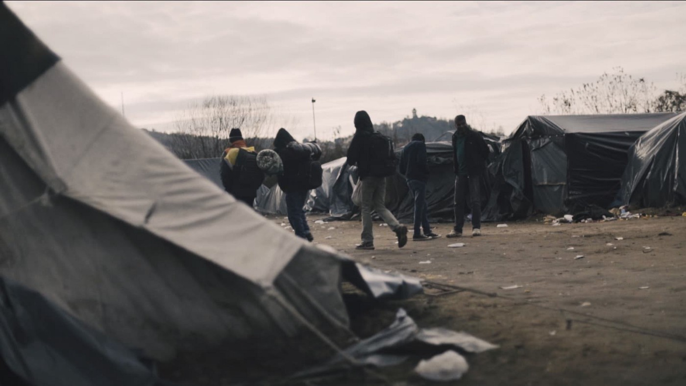

Camp Trnovi — At the Maljevac Border Crossing between Bosnia and Croatia\. A Group Prepares to go on ‘game’ — Photo By Luca Bonaventura

When late in November last year, the International Organisation for Migration \( [IOM — UN Migration](https://medium.com/u/664cb26312d4) \) took over the former factory Miral and turned it into temporary accommodation center \(financed by the [European Commission](https://medium.com/u/960f4c0ad987) \), it could not have been imagined that the living situation for people stuck in Bosnia and Herzegovina could further deescalate the way it has\.

■■■■■■■■■■■■■■ 
> **[Peter Van der Auweraert](https://twitter.com/PeterAuweraert) @ Twitter Says:** 

> > Less than 24 hours since @[UNmigration](https://twitter.com/UNmigration) #Bosnia got green light to support Miral location as humanitarian hub for #migrants in Velika Kladusa and team is already installing beds to receive migrants #proud https://t.co/4KU47ikbY4 

> **Tweeted at [2018-11-20 22:30:16](https://twitter.com/peterauweraert/status/1065009459708272640).** 

■■■■■■■■■■■■■■ 

When they turned the private factory into an accommodation center \(paying the rent to the owner\), the IOM called it a **“humanitarian hub”** and promised that the new facility would provide safety and security, as well as greater access to staff, information and services\.

However, much the opposite has been reported by residents\.

Some of the people who live in Miral described it as a “living hell”, telling us that they feel humiliated and stripped of all their dignity\. They complain that the center is managed poorly and that they must remain on high alert at all times due to tensions within the facility and theft\. They also report of bad sanitary conditions within the center, as well as lack of basic services such as hygiene and washing facilities for clothes, large ques for food which lacks nutrition, as well as a lack of psychological support or adequate medical care\. \.

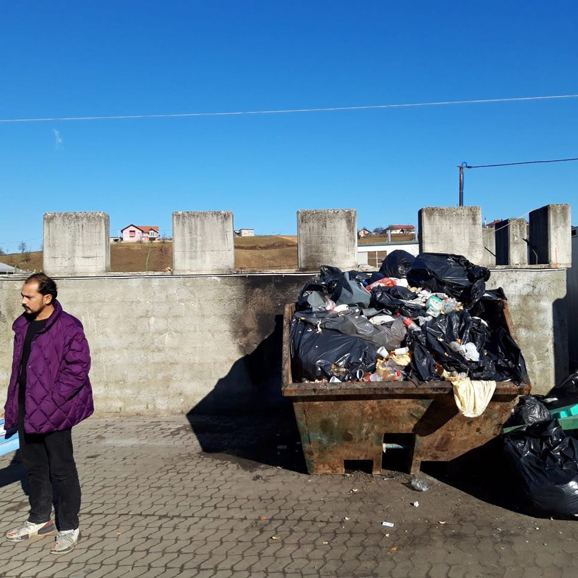

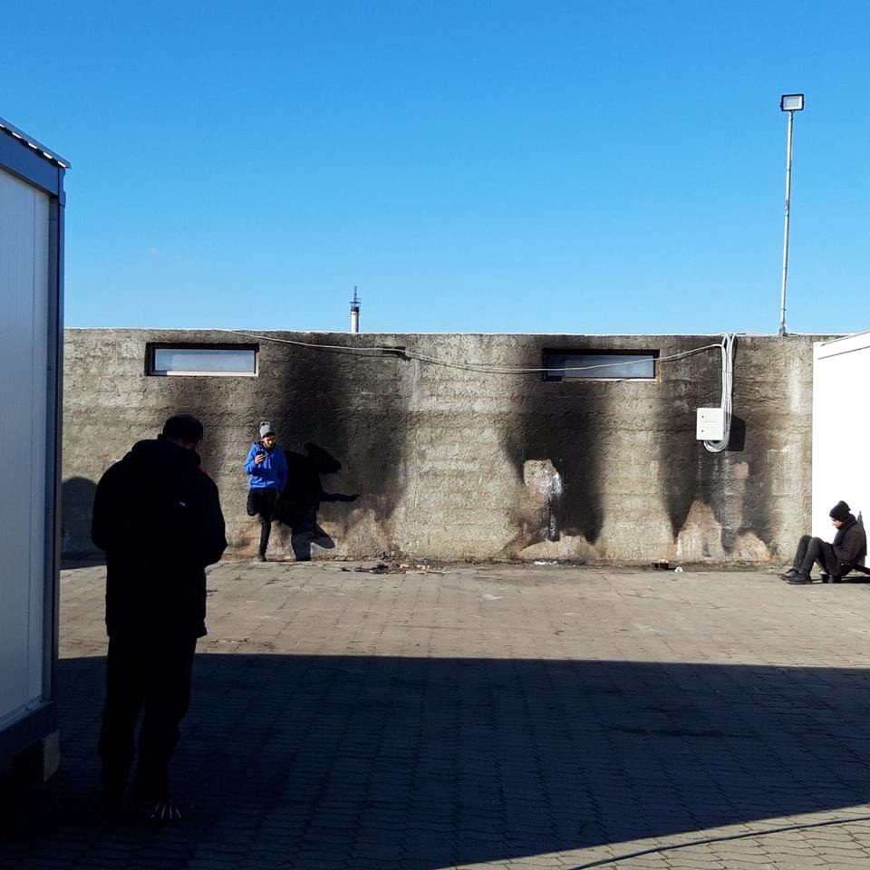

Unsanitary conditions inside and nothing to do\. Many people living inside Miral describe the facility as a prison you can leave\. Photos by Bostjan Videmsek

After Miral was officially open, the general atmosphere in Velika Kladuša — where at the moment around 1\.000 people on the move are waiting to continue their journey toward the EU — started changing\.

What was a nice and friendly atmosphere since January, slowly became hostile toward refugees and migrants, as well as [international volunteers](https://www.facebook.com/NoNameKitchenBelgrade/posts/656667311398223?__xts__%5B0%5D=68.ARBpgA75Nr0FHl9VM81ymb2FqcE90y2zB0AkyE_XYukK2-odh-8wxn74dNfK7NGyAw1qCNXqt_NGMrr5K8WvyxPyXZVjaQe93DsoScAgPgO5XejUwEDn4Wg0RBXBJA64dzA3NO7N256si5j4B9J1jGtzsGOWa3z0Mf5oFDvkfGaUGJR5KaXD6UZclF5pnBJxQZ6BLOafbdEp2PNQ0knqGZtt4RBtfJBrZIZ85lHeiAxHObflY753sVtDnbeJlHdDXDHt9o_e57-b0zeJG2lHB-CBMuGN1XjKvgz2MRSs3GqQJtJJMooGPFxi80Zw-8FiBojOn5FbvEp_YOAiyYIZE10&__tn__=K-R) \. Local people who are showing their solidarity, also became targeted by the police, and some even stopped or changed the ways how they provide support under the threat of being fined\.

It is especially interesting that police officers who are telling independent volunteer groups to leave or change their ways of working have been accompanied by IOM workers when visiting the field\.

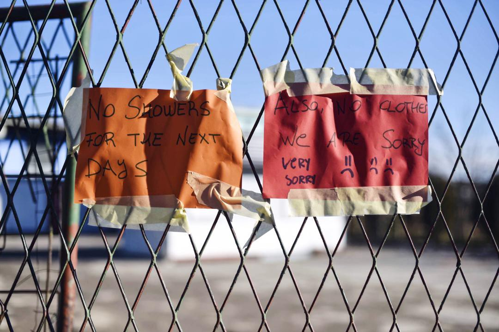

No Name Kitchen stopped its operations in Kladuša due to pressure from the police\.

Since the beginning of this year, police presence within the town and security measures within the facility have sharply increased, only to escalate at 6 AM on January 18th, when over one hundred special police forces, with full gear, aggressively stormed Miral, reportedly checking everyone inside for drugs and weapons\.

At the same time with the increase of the pressure, rumors spread through out Kladuša that Miral will soon be semi\-closed center, and that residents will be allowed to exit only a few hours per day\. AYS did not get confirmation about this so far, but many people are afraid\.

Independent volunteers in Kladuša warn that potential restrictions of movement would only work to increase the determination of people to make it out of Bosnia and into Europe\. They anticipate that many people would rather risk their lives walking for days through subzero temperatures and snow in Croatia and Slovenia, than remain trapped in Miral\.
#### Living Conditions within Miral

Miral center is guarded by local private security company, that has been employed by IOM to work 24 hours per day\. Private security agencies in Bosnia are not trained to work with vulnerable categories — which encompasses most of the people in Miral — or to work in a refugee accommodation centers\. They were not provided with any type of special training or anything that fits the [UN Refugee Agency](https://medium.com/u/75f2bdd89854) established standards for camps\. Nevertheless, private security agencies are present in this and several other centers IOM runs in Bosnia\. Recently there have been several unverified reports about violence between guards and refugees staying in IOM’s camps in Bosnia\.

Beside private security agency, local police is present at the entrance, as well as Service for Foreigners which is part of the Ministry of Security in Bosnia\.

The center’s capacity was increased by IOM within the first two weeks of it opening — from 300 to over 700 persons\. People are living in a two large communal spaces with bunk beds scattered throughout\. Recently, IOM brought forty new containers, but they remain empty so far\.

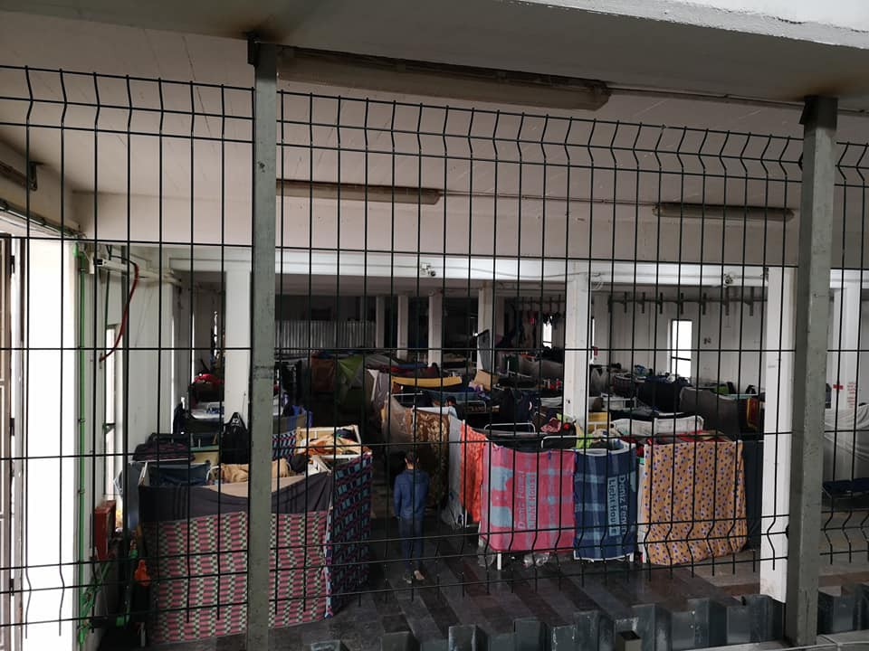

Miral is compromised of large communal spaces with dozens of bunk beds sprawled inside\. People line their beds with blankets to create a small sense of privacy\. Photo by Zarka Radoja\.

A man prays on top of his Bunk Bed\. Photo by Zarka Radoja\.

IOM reports that the facility is now full with 730 people currently inside, including 5 woman \(one is 6 months pregnant\), and several children\.

The primary concern of most residents remains the lack of private space within the facility, which only aggravates peoples’ tension, laying fertile ground for internal disputes and conflict\.

_“You can never feel safe in Miral,”_ a seventeen\-year\-old boy from Afghanistan reports\. ‘ _I sleep with my bag underneath me at night_ \.’

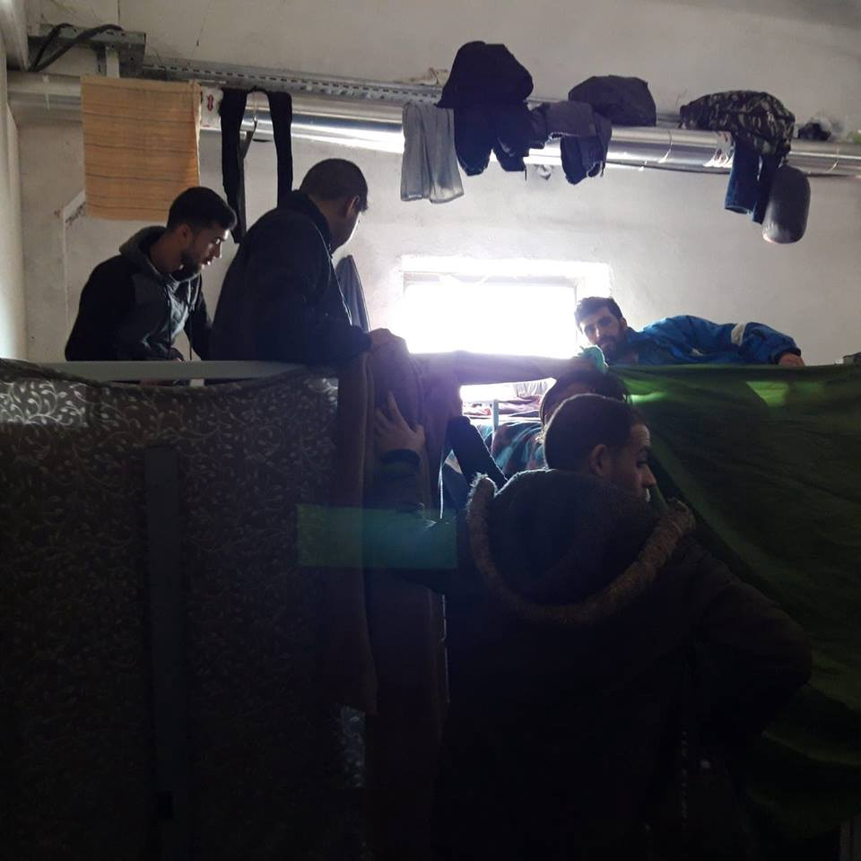

photo by Bostjan Videmsek

Others have reported that within their groups they take turns keeping watch at night, in fear of having their possessions stolen\.

_“There is no good management in Miral,”_ a man from Iran explains\.“Recently w _hen they distributed shoes, many people took more than one pair and many people were left without any\. We told IOM about this but they did nothing\. They \[people who took more shoes\] then sold those same shoes to us, it’s not good like this they should do something to stop it\.”_

The desperation within the facility is convincing many people who were planning to wait out the winter months in Velika Kladuša, to find other solutions\. Many look for alternative places to reside within the town, while others decide to move back to Sarajevo, or even back to Serbia or Greece\.

Recently, Croatia has increased border security measures and introduced new surveillance equipment\. Also, Croatian border police forces are turning even more violent, often forcing people to walk back to Bosnia without their shoes after the push back\. This is why people are looking for alternative ways to reach Europe, once again through Romania and Hungary\.

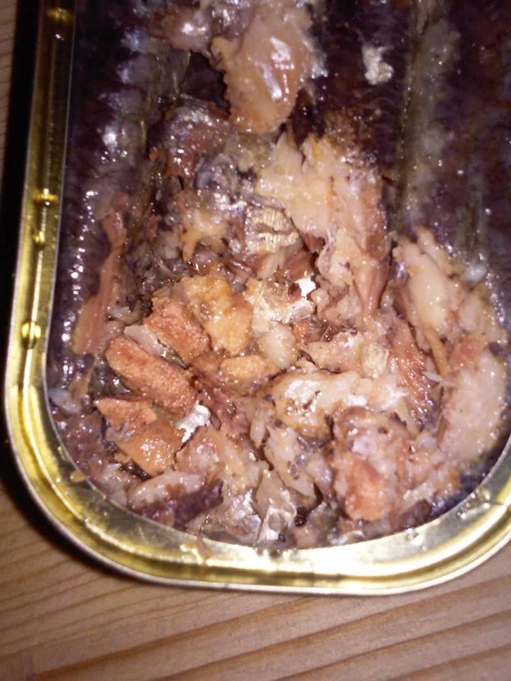

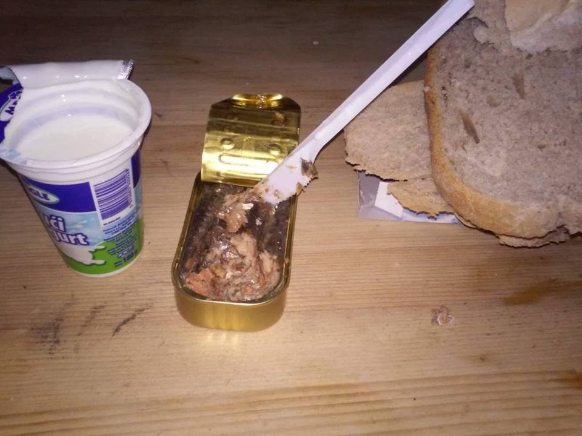

Sometimes meals provided compromise only of a can of sardines, a yoghurt and bread\. Photo By AYS

A man from Pakistan, who left Miral to move to Sarajevo, explained to us that living conditions in the field camp in Trnovi were more tolerable than those in Miral— a field where several hundred people lived at any moment from April until November when they were “voluntarily” transferred to the facility by IOM\.

_“It was cold in the field but we had our tents and our privacy and we felt safer there than we do in Miral\. The place makes people angry, we feel like we are in a prison, there are fights every day\. I don’t have an interest to fight, that’s why I will leave,”_ he told us\.

[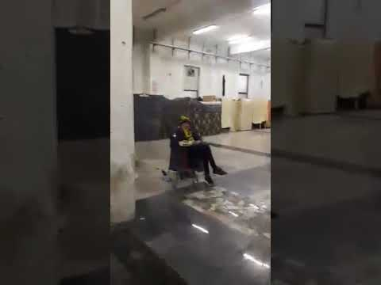](http://www.youtube.com/watch?v=ZUt75Wb63mI)

At the same time, the security personnel operating in the facility has been simultaneously denying the entry into the Miral of anyone who is not officially registered by IOM, including people who are coming and looking for the shelter\. Like a Syrian couple who arrived on the 17th of January only to be told that there is no space for them inside Miral, and that they should go elsewhere\.

Many other people arriving to the town during the night, who are in need of shelter, have also been denied entry into the facility, left to spend the night freezing outside in the cold\. Two separate reports allege that security personnel in Miral have used aggression and physical violence towards people who have attempted to enter the facility without a registration card\.

“ _For a week now the exits have been checked by security all throughout the day and night\. The situation has changed\. They do not let anyone enter anymore without a card\. The security are very bad to us\. They told me ‘we don’t have to accept them,”_ Ali, from Iran told us\.

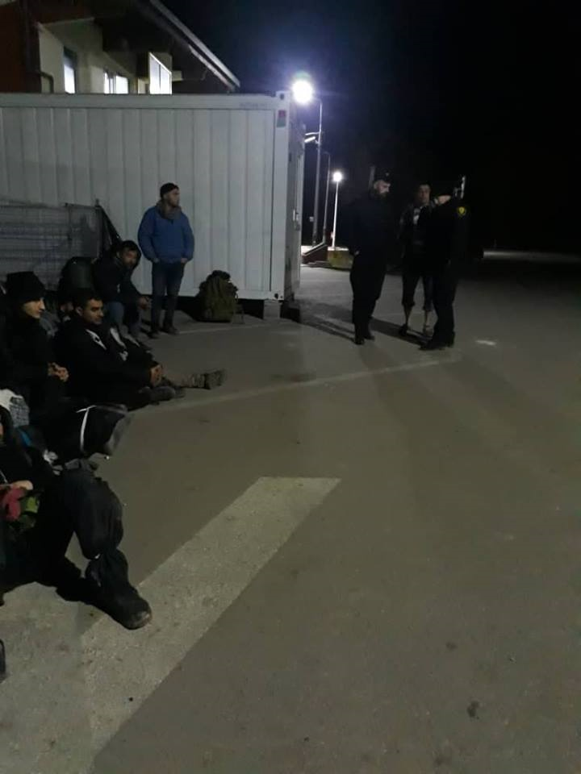

A group of 10 people who arrived late at night sits out the front of Miral\. They were denied entry into the camp by security personnel despite having valid registration cards\. Photo by AYS

Furthermore it appears that as of this week, even people with registration cards are prevented from entering the facility during the night\.

Just after midnight on the 18th of January, a group of ten people, all of which had registration cards for Miral were denied entry\. Forced to remain for hours outside in the cold, their beds empty inside\.

That same day, early in the morning, around one hundred armed police officers entered Miral\. The reasons for entry remain unclear\. Residents believe that police were searching for drugs and weapons\. No local media reported about this\.

On that day, from 6 until 8 AM, police officers proceeded to aggressively wake up all the residents, checking the bodies and beds \. Armed police men with big guns prevented people from using their phones or going to the toilet during this time\. It is alleged that some officers used violent measures during the operation\.
[video 1547828965](https://cdn.embedly.com/widgets/media.html?url=http%3A%2F%2Fwww.youtube.com%2Fwatch%3Fv%3Du2MoyBIT61I&src=https%3A%2F%2Fwww.youtube.com%2Fembed%2Fu2MoyBIT61I%3Ffeature%3Doembed&type=text%2Fhtml&key=a19fcc184b9711e1b4764040d3dc5c07&schema=youtube)

_“The police were too much angry and people were scared,”_ a 17 year\-old resident from Syria told us\.
#### Alternative to Miral

Instead of staying in Miral, many people have opted to reside in abandoned houses scattered throughout the town of Velika Kladuša and nearby villages\. Independent volunteers groups estimate that around thirty of these micro\-accommodations exist\.

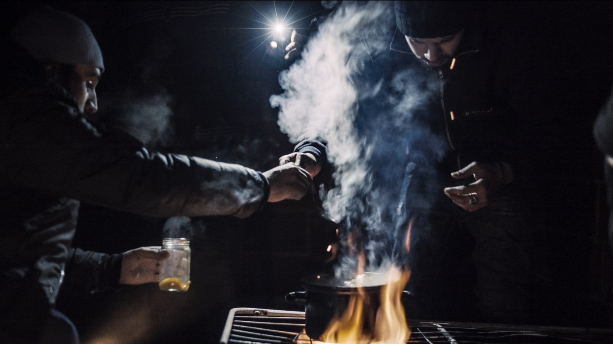

People sleeping in alternate accommodations must find the means to cook for themselves\. Photo by Luca Bonaventura

But these alternate self\-created living spaces come with problems of their own, primarily the dangers associated with attempting to warm up and insulate the spaces from the harsh weather conditions outside\.

A young man from Algeria, 22 years old, showed us the burnt remnants of a wooden shack where he stayed with two of his friends that caught alight in the early hours of the morning, from a candle they had forgotten to blow out during the night\. They were lucky to have escaped without harm\.

_“I spent one night in Miral and then left, anywhere is better than Miral,”_ he tells us\.

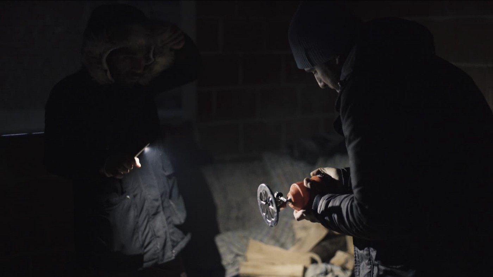

A man setting up a gas cooker in the squat he is sleeping in\. Photo by Luca Bonaventura

Another man showed us deep burns on his leg from when a small gas canister that he was using to warm up his room exploded\. But despite the risks associated with life in these alternate accommodations, both men still refuse to go to the IOM\-run camp\.

However Miral may soon become their only option\. In recent weeks, people living in alternate accommodations have reported police pressure to go to the camp\. In many instances police, allegedly with use of aggression, forced people out of their temporary accommodations\. They were then transported to Miral, but many returned to the places they were evicted from\.

A man from Afghanistan, who since the [eviction of the field camp Trnovi](ays-daily-digest-5-12-18-as-marrakesh-refugee-summit-approaches-chaos-in-countries-of-first-entry-d3f06a212040) on December 5, has been sleeping in an abandoned room inside a small warehouse with eight other people, tells us that the eviction by police and the prospect of having to stay in Miral has convinced the group to go on ‘game’\. _“Today I told the police, I will not stay in Miral, because you force me to move I will go to Croatia,”_ Farjaad from Afghanistan told us\.

Prior to the eviction, Farjaak’s group had intended to wait out the winter in Velika Kladuša before trying to continue their journey\.

[The game](ays-special-from-bosnia-the-game-5a56eb2e9a6e) is a colloquial term which indicates to cross the border into Croatia irregularly and travel through dangerous mountainous terrain in an attempt to reach Slovenia or Italy\. With the current sub\-zero temperatures and snow, going on game poses a serious threat to life\.

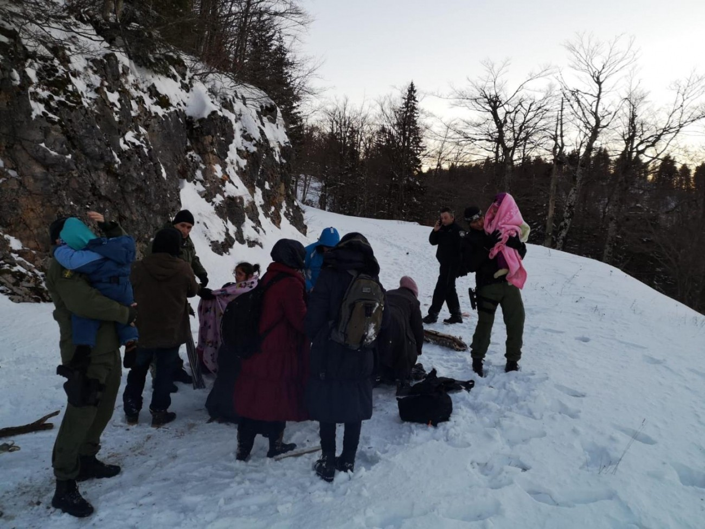

Croatian police and rescue services taking women and children from the mountain where they almost froze to death in a failed attempt to enter EU on foot\. Photo: MUP

Few days ago, Croatian police saved 15 people including very small children who [almost froze to death](https://dnevnik.hr/vijesti/hrvatska/djeca-migranti-na-pljesevici-kolabirali-od-zime-i-umora---545703.html) on such attempt to enter EU on foot\. A spokesperson from the Ministry of interior told media that they will be “returned to Bosnia” after medical treatment\. AYS asked on what what grounds will they be expelled from Croatia, instead of being offered the chance to ask for asylum, but the Ministry didn’t reply\.
#### Criminalizing solidarity

The increase of policing has also been felt within the town by locals and independent volunteers that have collaborated extensively to help the people stuck in Velika Kladuša\. Until recently the locals relationship to people on the move, as well as their hospitality towards them has been highly commendable\.

For a long time, cafes, supermarkets and public spaces were open to everyone and discrimination could hardly be felt within the town\. However, in the last weeks, this has changed\. Police have started enforcing numerous restrictions on people with migrant backgrounds, preventing their entry to public spaces and in some instances picking them up from the street and taking to Miral\.

All cafes, bars, supermarkets and petrol stations directly outside of Miral are closed to people on the move, and many others within the center of town have also shut their doors\.

**Ironically, the biggest supermarket, and closest to Miral, is Robot commerc, owned by the same private company which rents the factory Bira, in Bihać, where IOM runs another horror\-like facility with over 2000 people inside\. Nevertheless, people from Miral are forbidden from entering it\.**

This week the police in Kladuša prohibited a group of people from staying in the park directly outside of Miral, claiming it is government property\.

This sort of policing and unlawful criminalization of people is tactical, and used to create imaginary divides among local and migrant populations\. The UN agencies that are running camp, are not putting enough \(if any\) efforts to prevent police and the local authorities from acting in this way, even though they do have that possibility, having in mind that the IOM until now has largely controlled all aspects concerning people on the move in Bosnia\.

Independent international and local volunteers reported pressure in the form of surveillance and restrictions on their work over the last month\. Police have begun regularly checking international volunteer documents and forcing anyone they find without a “white card,” or visa to leave the country\. [No Name Kitchen reports](https://www.facebook.com/NoNameKitchenBelgrade/photos/pcb.656667311398223/656667154731572/?type=3&theater) that during some of these surveillance operations, police officers were accompanied by IOM employees\.

> It has to be noticed that many international volunteers disregarded the law in Bosnia according to which for the stay of over 90 days, they have to have visa \(the same rule is applied to Bosnian citizens if they go to the EU\) \. 

A long\-term volunteer who has spent the last four months in the town conducting border violence reports of people who have been pushed back from the Croatian Border into Bosnia, tells us that despite the dangerous weather conditions, the number of people attempting to cross into the EU remain much higher than anticipated throughout the winter months\. Many people attributing their determination to leave Bosnia to the unbearable living conditions inside Miral, but also other centers in the country\.

With the recent trend of increased police pressure in the town, the criminalization of people on the move, restricted access to public spaces, pressure on independent volunteers and the prohibition of vital aid, increased security within Miral, and restricted movement in and out of the facility, it can only be expected for this determination to further increase\.

As a man who was recently pushed back from Croatia, after spending 10 days walking through snowy mountainous landscapes towards Slovenia, told us, _“I would rather die in the snow than stay in Miral”\._

**_\(by AYS Info Team volunteers in Velika Kladuša\)_**

**We are an entirely volunteer\-run media team, and we rely on our supporters to share our news\. So please share, and never forget to ACT\!**

**We strive to echo correct news from the ground through collaboration and fairness\. Every effort has been made to credit organizations and individuals with regard to the supply of information, video, and photo material \(in cases where the source wanted to be accredited\) \. Please notify us regarding corrections\.**

**If there’s anything you want to share or comment, contact us through Facebook or write to: areyousyrious@gmail\.com**

_Converted [Medium Post](https://medium.com/are-you-syrious/ays-special-from-bosnia-killing-solidarity-in-velika-kladu%C5%A1a-be9045b1dfec) by [ZMediumToMarkdown](https://github.com/ZhgChgLi/ZMediumToMarkdown)._
