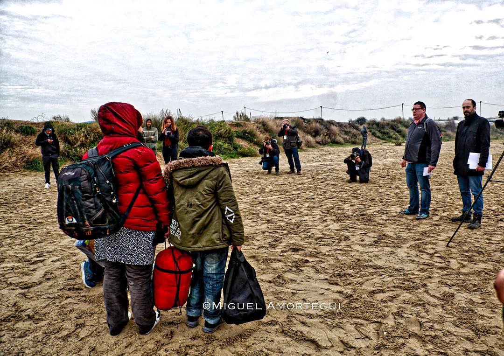
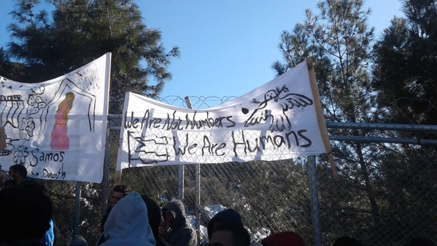

### AYS WEEKEND DIGEST 19–20/1/2019: A letter from Samos

A family of refugees being held by photographers and reporters while they were walking to the buses to get evicted from the refugee camp\. Portraits of a refugee camp\. Calais Jungle\. By Miguel Amortegui
#### Samos — the forgotten island

On the 17th and 18th of this month scores of asylum seekers in Samos’ Vathi camp demonstrated for long hours in front of the camp’s asylum service centre\. They are still making daily protests, carrying signs and chanting slogans demanding their basic rights\.

All they want is a warm place to shelter their bodies from the mice and rats that are infesting their small tents and to be released from this detention facility\.

They demand the acceleration of managing the asylum processes which wastes so much time, and offers only neglect\. It is obvious if you listen to the raised voices chanting for freedom, freedom, freedom, that Vathi is nothing more than a giant prison\.

They said, ‘we are not just numbers on a piece of paper to be treated in this shameful way; we are humans with feelings\.’

The protesters then continued into Vathi’s town centre, with this intention for their voices to reach the citizens of Greece and for the world to see the dire situation that faces them\.

It was not only adults that participated in the protests, even children played a part in the demonstrations, holding up some of the banners saying that Vathi is the worst camp on the Greek Islands, a camp whose capacity is 700 people but which currently contains more than 4500\. This number also includes some who live in tiny tents in the forest outside of the camp, who are vulnerable to dangerous illnesses within this humanitarian crisis\.

The camp severely lacks services, especially health services — there is just one doctor who is unable to treat such a high number of asylum seekers, people whose fears and illnesses have only increased since arriving in this camp\. \(By Taha Salim, resident of Vathi camp\)
#### Syria

SAMS medical team, which has its teams in Syria, [issued a report](https://www.sams-usa.net/.../2019/01/RH-report-04-1-1.pdf) stating that as the Syrian conflict enters its eighth year, it continues to decimate the country’s infrastructure and society\.

_“Essential civilian structures have not been spared\. For the healthcare system, the impact is staggering\. Medical facilities have been deliberately and systematically targeted\. Many physicians have fled the country and hundreds have been killed or arrested\. This has left a deeply depleted health sector in which the remaining medical staff are struggling to fill the gaps\.”_

Additionally, the fighting caused critical shortages of medical equipment and supplies, pushing medical personnel to seek alternative means of providing adequate treatment to patients in need, SAMS claims\.
#### Morocco

During 2018, [Moroccan authorities stopped 89,000](https://www.voanews.com/a/morocco-foils-89-000-illegal-migration-attempts-in-2018-interior-ministry-reports/4747825.html?fbclid=IwAR3HvIYq22ppFf-DGT2CbtVBQzYmlGjO66OjssS3l7dng1MiDMkguCtp0zM) people from leaving the country towards Europe, an increase of 37 percent in comparison to 2017\.

The authorities in this country are claiming that the country became “the main launchpad in the Mediterranean for Europe\-bound migrants”\.

Not only people from Morocco are using this route, but for many from other African countries this became a major gateway into Europe\. This was visible last year after Italy closed its borders, and when the EU started cooperating more with Libyan coast guards in an effort to decrease the number of people coming from this country\.

Moroccan authorities are claiming that during the last year they managed to dismantled 229 trafficking networks, which is not easy to verify\.

The EU will invest even more money to help Morocco stop people from leaving for Europe\. About 30 million euros is already donated, out of 140 million that has been promised to Morocco\.
#### Sea

117 human beings died at sea when a rubber dinghy, which left from Garabuli, Libya, sinked\. Three people survived\. Among the victims were ten women, including a pregnant girl, and two children, one of whom was only two months old\.

Sea\-Watch and other NGO rescue teams were there to help\. [Brendan Woodhouse](https://www.facebook.com/brendan.woodhouse.18?__tn__=%2CdCH-R-R&eid=ARDsjStaDt7WFUtszJJf2Jn1X6gn1yFK41ZUsZaHeu7vMDgyTRB4LxqqbqgbAaOr9DyVC7wCGVwCSDM-&hc_ref=ARSQc03IFngi-O5qq4XATRqjp1pHqK0Wk6KvD8HPqWTLqw_k8gkWsm2hFMJyiSxRAak&fref=nf) , who participated in the rescue operation, wrote about the rescue and day after:

_“Last night we went as fast as we could to the boat in distress\. A cargo ship got there first and then took the people back to Libya\. We await news of what happened\. Probably, the so called Libyan Coast Guard will say that they coordinated rescue operations and rescued some people\. They’ll not mention anything about the deaths\. So we won’t question them\. But the truth is, that they were uncontactable\. That the Italians coordinated the rescue\. And that it’s not really a rescue per se, as the people have been returned to whatever it is that they are running from\.”_

More coordination is agreed between Mediterranean states “to cooperate in addressing challenges like migration”\.

The [decision was made after the ministerial meeting](https://www.maltatoday.com.mt/news/national/92337/mediterranean_states_agree_to_more_cooperation_on_human_smuggling?fbclid=IwAR226Hj9WugUh1D46s3CjR3cp-YyVtbvXjtIFSFJUk4BAGVfEbYMNh36nGo#) in Malta\. Participants were the foreign ministers of Algeria, France, Italy, Libya, Malta, Mauritania, Morocco, Portugal, Spain and Tunisia\. The High Representative of the Union for Foreign Affairs and Security Policy/Vice\-President of the European Commission Federica Mogherini, Secretary\-General of the Arab Maghreb Union \(AMU\) Taieb Baccouche, President of the Anna Lindh Foundation \(ALF\) Elisabeth Guigou, Secretary\-General of the Union for the Mediterranean \(UfM\) Nasser Kamel, and President of the Parliamentary Assembly of the Mediterranean Pedro Roque also participated as partners\.

This was the 15th meeting of the Foreign Affairs Ministers of the 5\+5 Western Dialogue\.
#### Greece

[**Refugee Rescue / ‘Mo Chara’**](https://www.facebook.com/RefugeeRescueUK/?__tn__=%2CdkCH-R-R&eid=ARAEeOt-Yl9aXzMTY_ijdTdEnTyuz8Yn6_4A7v9cd-ZP086R15Tw1EHoZU_-VEoEng4w23dhkCiUeoDO&hc_ref=ARQWgc5DW6bQObGwuRwxhsI8tY3sGpJXt3jj6pZPyGY7Tup9hcP5w-p8OubjdmU_gdE&fref=nf) assisted 43 people who arrived on Sunday morning near Tsonia\.

_“The group were overjoyed at having made it to safe, dry land\. One can only imagine the terror at embarking in middle of the night on a trip of unknown danger and length\. Many of the people making this crossing do not know how to swim, nor have many ever been on a boat\.”_

Salvamento Marítimo Humanitario \(SMH\), released a video of a boat that landed on Karfas Beach, Chios with 22 people on board\.

#### WEATHER

MONTENEGRO

Moderately to predominately cloudy, during the day dry in most parts of the country\. Towards the end of the day and during the night local precipitation\. Wind weak to moderate, along the coast shortly amplified, mostly from the south and east\. Lowest temperatures from \-3 to 8 and highest daily from 1 to 13 degrees\.

SERBIA

Predominately cloudy and mostly dry, local snow in the mountains and in the east and southeast some rain of short duration\. Wind weak to moderate blowing from the east and southeast\. Lowest temperatures from \-1 to 2 and highest daily from 1 to 5 degrees\.

BOSNIA

Cloudy with sleet or snow in Bosnia and weak rain from time to time in Herzegovina\. Wind from the west and northwest\. Lowest temperatures from \-5 to 7 and highest daily from \-2 to 10 degrees\.

CROATIA

Moderately to entirely cloudy, locally some snow, rain in Dalmatia and alongside the rest of the coast no precipitation and longer periods of sun\. Wind mostly weak, along the coast moderate to strong Bura\. Lowest temperatures from \-6 to 6 and highest daily from \-1 to 12 degrees\.
#### Balkans

Human Rights Watch said in its [World Report 2019](https://www.hrw.org/…/world_repor…/hrw_world_report_2019.pdf) , that Balkan countries made only modest progress last year in the field of human rights\. When it comes to treatment of asylum seekers, “authorities did not provide even basic support to thousands of asylum seekers and migrants who arrived in 2018”\. In Croatia, HRW noted allegations that since January around 2,500 asylum seekers and migrants had been pushed back by Croatian police to Bosnia and Herzegovina, hundreds of cases of denied access to asylum procedures, and over 700 allegations of police violence and theft\.

In Serbia, HRW noticed that the asylum system remained flawed and conditions for asylum seekers had failed to improve\.
#### Bosnia

More than 520 people are living at the moment in Ušivak, a former military barrack near Sarajevo, turned into a temporary refugee center run by IOM\.

Among those living in Ušivak is 20 families with 18 kids\. Additionally, there is quite a big number of unaccompanied minors in this camp, and they are not separated from the others, and do not have any of the special attention that they need\.

People in the camp keep complaining about the cold, the lack of hot water and tents that are not heated enough\.

The situation is much worse in other camps, like Miral, in Velika Kladusa where over 600 people are living in a former factory\. Read our [latest special](ays-special-from-bosnia-killing-solidarity-in-velika-kladuša-be9045b1dfec) from the field\.
#### Serbia

Since the beginning of 2019 at least 65 boys from Afghanistan have reached Serbia \(most of them through Bulgaria\), with an almost equal number \(69\) of adult men from the same country, Info Park reports\.

While boys are coming from Bulgaria \(probably with the help of smugglers\), single men are coming alone through Macedonia \(more in the New Developments Appendix in the end of the daily report\) \.

A total of 167 refugees and other migrants were counted by the IP’s field team during the regular evening outreach activities in the area of Savamala\. According to the Info Park’s sources, Hungarian authorities prevented 23 attempts of irregular entry to the country during the night\.
#### Austria

Austrian daily newspaper Kronen published an interview with Interior Minister Herbert Kickl saying that he believes a readmission agreement with the Syrian regime will be very effective\.

He also said that it may take time for this readmission agreement, and in the meantime Austria could use the option to deport people to a third country\. He was talking about people who commit some type of crime\.

“We will keep asylum\-seekers who are convicted or prone to violence at transit zones such as airports where they will have only one option ahead, to go back to their countries,” he said\.

According to the UN Refugee Convention, host countries can only deport migrants who have been convicted of “a particularly serious crime” such as murder, rape or armed robbery, but not lesser crimes\.
#### Germany

Germany parliament’s lower house approved a law to limit asylum applications from three Maghreb countries Algeria, Morocco and Tunisia, as well as Georgia\.

Interior Minister Horst Seehofer has defended the government’s plan, saying that last year less than 3 percent of asylum applications from these four countries were found credible\.

The legislation still needs the approval of the upper house, the Bundesrat, where the opposition Greens and Left Party are planning to block it\.

The left\-leaning environmentalists joined the Left Party in emphatically rejecting Seehofer’s proposed legislative changes in the Bundestag\. They say the amended law would do nothing to improve Germany’s asylum procedures\.”
#### Europe

During the [Winter Session of the Parliamentary Assembly](https://www.coe.int/.../reports-in-preparation-on-crisis...) of the Council of Europe \(PACE\) in Strasbourg \(21–25 January 2019\), the Committee on Migration, Refugees and Displaced Persons will adopt reports “The Greek Islands: more must be done” and “Development cooperation: a tool for preventing migration crises”\. Reports are not yet available online\.

The Committee will discuss the findings of the visit to the Röszke transit zone in Hungary in the framework of the Campaign to End Migration Detention of Children and exchange views on rights and responsibilities of NGOs with the Hungarian Helsinki Committee, in preparation of Ms Daphné Dumery’s \(Belgium\) report “Rights and obligations of NGOs assisting refugees and migrants in Europe”\.

New reports will be initiated on pushbacks, the UN Global Compacts on migration and humanitarian action in the South Mediterranean\.

We also publish weekly summaries of some of the most important news reported during the past week in our Daily News Digest: here are the [Arabic](%D8%A7%D9%84%D9%85%D9%84%D8%AE%D8%B5-%D8%A7%D9%84%D8%A7%D8%B3%D8%A8%D9%88%D8%B9%D9%8A-%D9%A1%D9%A4-%D9%A1%D9%A9-%D9%A1-%D8%A7%D9%84%D9%82%D8%A7%D8%AF%D8%A9-%D8%A7%D9%84%D8%A3%D9%88%D8%B1%D9%88%D8%A8%D9%8A%D9%88%D9%86-%D9%84%D9%85-%D9%8A%D8%B9%D9%88%D8%AF%D9%88%D8%A7-%D9%82%D8%A7%D8%AF%D8%B1%D9%8A%D9%86-%D8%B9%D9%84%D9%89-%D8%A5%D8%AF%D8%A7%D8%B1%D8%A9-%D8%A7%D9%84%D9%88%D8%B6%D8%B9-%D8%AD%D9%88%D9%84-%D8%A7%D9%84%D8%A3%D8%B4%D8%AE%D8%A7%D8%B5-%D8%A7%D9%84%D8%B0%D9%8A%D9%86-%D8%AA%D9%82%D8%B7%D8%B9%D8%AA-64cd585ecd9) and [Persian](https://medium.com/are-you-syrious/%D8%B1%D9%87%D8%A8%D8%B1%D8%A7%D9%86-%D8%A7%D8%B1%D9%88%D9%BE%D8%A7%DB%8C%DB%8C-%D8%AF%DB%8C%DA%AF%D8%B1-%D9%86%D9%85%DB%8C-%D8%AA%D9%88%D8%A7%D9%86%D9%86%D8%AF-%D8%A8%D9%87-%D9%85%D8%B1%D8%AF%D9%85%DB%8C-%DA%A9%D9%87-%D8%AF%D8%B1-%D8%AF%D8%B1%DB%8C%D8%A7-%DA%AF%D8%B1%D9%81%D8%AA%D8%A7%D8%B1-%D8%B4%D8%AF%D9%87-%D8%A7%D9%86%D8%AF-%D9%BE%D8%B4%D8%AA-%DA%A9%D9%86%D9%86%D8%AF-d7ecfe360045?fbclid=IwAR2wJJVlFyjGmbmaBFujDLxxZiuJ8Jz71LZ0c8YbHzv_OtsrmpKZvCCYrbc) for the Week of January 14–20\. 
Please, share the information with your Arabic and Persian speaking contacts\.

**We are an entirely volunteer\-run media team, and we rely on our supporters to share our news\. So please share, and never forget to ACT\!**

**We strive to echo correct news from the ground through collaboration and fairness\. Every effort has been made to credit organizations and individuals with regard to the supply of information, video, and photo material \(in cases where the source wanted to be accredited\) \. Please notify us regarding corrections\.**

**If there’s anything you want to share or comment, contact us through Facebook or write to: areyousyrious@gmail\.com**

_Converted [Medium Post](https://medium.com/are-you-syrious/ays-weekend-digest-19-20-1-2019-a-letter-from-samos-3dffac09efc3) by [ZMediumToMarkdown](https://github.com/ZhgChgLi/ZMediumToMarkdown)._
