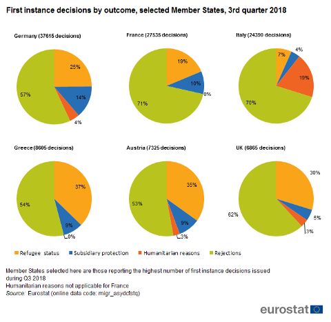
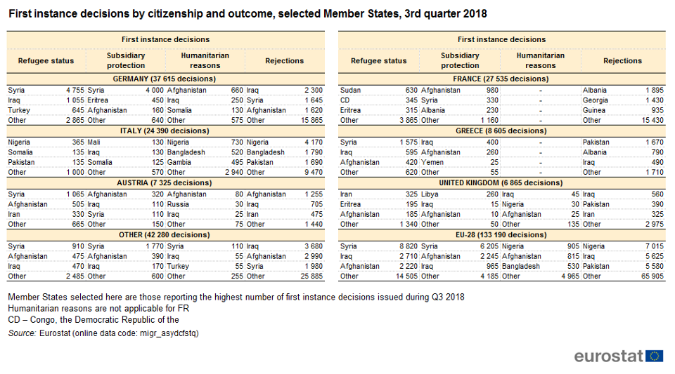
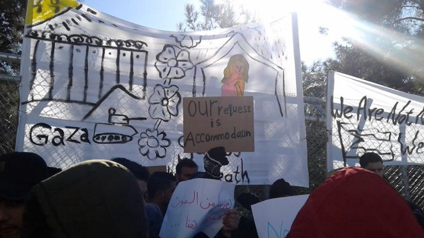

### **الملخص الاسبوعي ١٤\-١٩\-١ القادة الأوروبيون لم يعودوا قادرين على إدارة الوضع حول الأشخاص الذين تقطعت بهم السبل في البحر**
#### **AYS Weekly News Summary in Arabic, January 14–20**

 ‎](assets/64cd585ecd9/1*YVyh__hiIOU4ZBtEmrjyaQ.jpeg)

Photo: [Pothiti Kitromilidi](https://www.facebook.com/pothiti.kitromilidi?__tn__=%2Cd%2AF%2AF-R&eid=ARBd2y1L_pAbZCqMbMewBzYZ0uviGRN4aIlEQMyEWY638CTkDLpxiJX2iVZWGyCJJwTwsui3Lx7CbKUe&tn-str=%2AF) ‎

**يجب أن يتم نقل الأشخاص الذين يتم إنقاذهم في البحر إلى مكان آمن قريب // أكثر من ٥٧٠ مصابًا بالأمطار الغزيرة والثلوج في لبنان // ٥ عمال مهاجرون يموتون في أنقرة // وتقدر مجموعة المتطوعين حوالي ٢٤٥٠ شخصًا يعيشون في شوارع باريس // والمزيد من الأخبار من البلقان والاتحاد الأوروبي …**

> سيعاني المزيد من النساء والرجال والأطفال ما لم توافق الحكومات الأوروبية على سياسة إنزال سريعة ومتوقعة بما يتماشى مع القانون الدولي ونظام عادل لتقاسم المسؤولية بين دول الاتحاد الأوروبي\. — ماتيو دي بيليس ، باحث الهجرة في منظمة العفو الدولية 

وبموجب القانون الدولي ، يجب أن يتم نقل الأشخاص الذين يتم إنقاذهم في البحر إلى مكان آمن قريب ، أي بلد يعاملون فيه معاملة إنسانية ويتيح لهم فرصة حقيقية لطلب اللجوء\. تجنبًا للواجبات القانونية والأخلاقية ، ما فتئت دول الاتحاد الأوروبي تقدم دعمًا لخفر السواحل الليبي لاعتراض الناس في البحر وإعادتهم إلى ليبيا ، حيث ثبت مرارًا وتكرارًا أنهم يخضعون للاحتجاز التعسفي والتعذيب المحتمل

قالت منظمة العفو الدولية في تحليل نُ إن على القادة الأوروبيين العمل بإلحاح لإصلاح نظام يمنع الدول من مساعدة اللاجئين والمهاجرين في خطر في البحر\. [**توضح الخطوط المتدنية في البحر**](https://www.amnesty.org/en/latest/campaigns/2019/01/cut-adrift-in-the-med/) المتوسط ​​كيف أن التعاقد الخارجي للحدود مع السلطات الليبية على السلطات الليبية ، إلى جانب نظام يخفق في تقاسم المسؤولية عن طالبي اللجوء بشكل عادل في جميع أنحاء أوروبا ، قد أوجد حالة يكون فيها الناس عالقين في البحر المتوسط ​​والساحل\. يتم منع فرق من العمل من أجل إنقاذ الأرواح\. أحدث مثال على ذلك هو الترتيب الذي أصدرته السلطات البحرية الإسبانية الأسبوع الماضي ، مما منع منظمه وبن ارم من إنقاذ الناس في وسط البحر الأبيض المتوسط\. ويحدد تحليل الذكاء الاصطناعي أيضاً خطوات لضمان عدم حدوث حالات مثل تقطع سفن الإنقاذ في مراقبه البحر وعين البحر، وعرقلة اوبن ارم\.

[انظر تقريرهم ٢٠١٨هنا\.](https://www.amnesty.org/en/documents/eur30/8906/2018/en/)

> “لم يعد بوسع القادة الأوروبيين أن يديروا ظهورهم للناس الذين تقطعت بهم السبل في البحر ويستمرون في تشويه النقاش حول الهجرة لتحقيق مكاسبهم السياسية الخاصة\. ويجب أن يوافقوا بشكل عاجل على سياسة إنزال سريعة يمكن التنبؤ بها بما يتماشى مع القانون الدولي وعلى نظام عادل لمشاركة المسئولية عن طالبي اللجوء بين دول الاتحاد الأوروبي\. “ 

### **نظره عامة**

كان السوريون والأفغان والعراقيون هم أكبر ٣ جنسيات سعى للحصول على اللجوء في الاتحاد الأوروبي في عام ٢٠١٨، مع ٢١٢٠٠ و ١١٢٠٠و ١٠٠٠٠طلب على التوالي\. مقارنة بالأعوام السابقة — هذه الأرقام منخفضة ، بسبب الصفقات مع مختلف البلدان الثالثة وزيادة مراقبة الحدود ، على سبيل المثال بعض الأسباب المساهمة\. لمزيد من التفاصيل حول طلبات اللجوء لأول مرة ، كل بلد على حدة ، وبعض الإحصاءات الأخرى ، يمكنك إلقاء نظرة على الصور

### **لبنان**

إن العواصف الأخيرة التي ضربت لبنان في الأسابيع الأخيرة “تركت الأطفال الضعفاء الذين تم نقلهم وبحاجة إلى الحماية والدفء ، مع الأطفال اللاجئين بشكل خاص” ، حسب تقارير اليونيسيف\.

تأثر أكثر من ٥٧٠ من الأمطار الغزيرة والثلوج\. حدثت الفيضانات في ١١ مستوطنة غير رسمية على الأقل\. وفقا لوكالة الأمم المتحدة “أكثر من ١١٣٠٠شخص \[…\] قد تضرروا من العاصفة” ، نصفهم قاصرون\.

في وادي البقاع وحده ، اضطر ما لا يقل عن ٨٤٧ لاجئاً سورياً إلى الانتقال بسبب الفيضانات أو الأضرار الشديدة التي لحقت بملاجئهم\. في الشمال ، تم الإبلاغ عن أكثر من ٧٠٠ عملية انتقال إلى الآن\.
#### جزيرة ساموس

■■■■■■■■■■■■■■ 
> **[Gemma Bird 🧡](https://twitter.com/gemmakristina) @ Twitter Says:** 

> > Protest on #Samos #Greece today. ‘We are not numbers. We are humans’. Conditions on the islands are bad in winter with torrential rain/ cold. The Reception Centre has space for 700, estimates suggest 5000 #Refugees currently on the island. More needs to be done for human beings https://t.co/YaNjggBZS4 

> **Tweeted at [2019-01-17 11:06:13](https://twitter.com/gemmakristina/status/1085855807344918528).** 

■■■■■■■■■■■■■■ 

> _الجزيرة المنسية احتج عشرات من طالبي اللجوء في جزيرة ساموس مخيم فاثي يوما السابع عشر والثامن عشر لساعات طويلة أمام مركز خدمة اللجوء في المخيم ، ومازالت الاحتجاجات اليومية مستمرة ،يحملون لافتات ويرددون شعارات مطالبين بأبسط حقوقهم، يطالبون بمكان دافئ يحمي أجسادهم من الفئران والجرذان المنتشرة حول خيمهم الصغيرة ،يطالبون بإطلاق صراحهم من هذا المعتقل ،حيث يعتبرون مخيم فاثي سجن كبيرا ، ويطالبون بتعجيل معالجة إجراءات اللجواء التي تستغرق الكثير من الوقت مع كل هذا الإهمال ويمكن أن ندرك أن مخيم فاثي هو حقا سجن كبيرا لطالبي اللجوء من خلال الكلمات والشعارات التي رددوها بأعلى اصواتهم ،حرية، حرية ،حرية ،وقالوا أيضا أننا لسنا فقط أرقاما على ورق لكي نعامل بهذه الطريقة المزرية نحن أيضا بشر ولدينا مشاعر ، ثم استمر المحتجين بالزحف إلى مركز المدينة فاثي ،حتى تصل اصواتهم ويرى العالم والمواطنين اليونانيين الوضع المزري الراهن الذي يواجهونه ، لم تقتصر المشاركة على الكبار فقط حتى الصغار كانو ضمن الاحتجاجات، يحملون البراءة عوضا عن اللافتات ،ان مخيم فاثي هو أسوء مخيم موجود في الجزر اليونانية وان طاقته الاستيعابية تبلغ سبعة مائة أ طالب لجوء ويحتوي الان على اكثر من أربعة الف وخمسون طالب لجوء يعيشون في خيم صغيرة الحجم في الغابة خارج المخيم ،ويكتسبون امراضا خطيرة من هذا الوضع اللانساني ، والمخيم يفتقر إلى الكثير من الخدمات ، وخاصة الخدمات الصحية حيث يحتوي الكمب على طبيب واحد ،لايستطيع أن يعالج هذا العدد من طالبي اللجوء ،وان طالبي اللجوء زادت مخاوفهم وامراضهم في هذا الكمب \._ 

[انظر هنا\.](ays-daily-weekend-19-20-1-2019-the-letter-from-samos-89470c65f0fa)

### **تركيا**
#### ٥ عمال مهاجرين يموتون في أنقرة

أفادت وسائل الإعلام أن خمسة عمال من سوريا فقدوا أرواحهم في حريق اندلع في موقع مصنعي الأثاث في أنقرة\. طوال عام ٢٠١٨، فقد ما لا يقل عن ١٠٨ من المهاجرين واللاجئين حياتهم في جرائم القتل المهنية في تركيا
### **البحر**

> _دخل ٤٢١٦ مهاجرًا و لاجئًا إلى أوروبا عن طريق البحر خلال أول ١٦ يومًا من السنة ، وفق ما ورد في تقارير الهجرة\._ 

ويبلغ هذا العدد ضعف ما كان عليه خلال الفترة نفسها من عام ٢٠١٨ \(٢٣٦٥\) \.

في الأيام العشرة الماضية ، فإن عدد الذين فقدوا أرواحهم في البحر مضروبًا في ١٠، يقول سالفامنتو ماريتيمو إنبيتاريتو
### **إيطاليا**

[وتفيد تجربة باوباب أن](https://medium.com/are-you-syrious/ays-daily-digest-14-01-19-open-arms-rescue-ship-barred-from-leaving-port-once-again-dd1ceebe9654) عدداً من النساء والأطفال قد تقطعت بهم السبل في العراء بين ليلة وضحاها ، حتى مع انخفاض درجات الحرارة\. “في الوقت الحالي ، هناك امرأة وأطفال في الشارع ، يتوسلون ليأخذوا” المنزل “لأنه يتجمد في الخارج ،” يكتبون\. كان هناك العديد من الوافدين الجدد منذ بداية فصل الشتاء ، والبلدية تقوم بالحد الأدنى لتقديمها لهم\. مرة أخرى ، يتم ترك المتطوعين

[هنا للمزيد من التقارير \.](https://www.facebook.com/BaobabExperience/posts/1997143213695754?hc_location=ufi)

](assets/64cd585ecd9/1*iyG0DyTYlCfDaMmi5OQFNg.jpeg)

T [alking Hands](https://www.facebook.com/OpificioTalkingHands/photos/pcb.956589888062766/956588078062947/?type=3&theater)
### **اليونان**
#### افتتاح مراكز جديدة في اليونان

من المقرر افتتاح مرفقين جديدين في وقت قريب في محاولة لتخفيف الضغط على مخيمات اللاجئين المكتظة في جزر ليسبوس ، خيوس ، ساموس ، كوس ولييروس في شمال شرق بحر إيجه ، حسب ما أفادته إنفوميغرنتس\. وسيفتح المركزان “في غضون الأسابيع المقبلة” في فايوتشوري بالقرب من سالونيك في الشمال ، وفي كيبيسلوخوري ، بالقرب من لاريسا في منطقة تساليا الوسطى ، وفقًا لمصادر حكومية\.
### البوسنة والهرسك
#### سراييفو

كان أقل من درجة التجمد طوال شهر يناير والثلوج تغطي الأرض\. وقال متطوعون في سراييفو لوكالة الأنباء الجزائرية إنهم افتتحوا مؤخرًا مركزًا اجتماعيًا ، وهو عبارة عن مساحة داخلية حيث يمكن للأشخاص الذين يعيشون في الشوارع وفي الأماكن العشوائية الحصول على الطعام الساخن في مكان دافئ\. يمكنهم أيضًا شحن هواتفهم هنا\. في الوقت الحالي ، أصبحت الأرقام ثابتة ومستطيلة إلى حد ما: حوالي ٧٠ شابًا يعيشون خارج المخيمات وأماكن الإقامة الأخرى في الوقت الحالي\.

في حالة الوافدين الجدد أو الاحتياجات العاجلة الأخرى ، لدى [باسيس البوسنة](https://www.facebook.com/BASIS-Bosnia-1487914718006023/?__tn__=kC-R&eid=ARATlNN_SldCML5aFs1mqjZY8Rcqh5UFYZMPH-bCSaCTv5UoY-TwLPXcKDNvwOY1NspLKTXNTlJIqMbV&hc_ref=ARRgWqKfDrZJs3TOqxzeRmAxp9zmLKoYas6PUyJ0TQlLbC3rKhkIRAAboNbsKpeAB_o&fref=nf&__xts__%5B0%5D=68.ARAWG4h1g9hjyBpOo788ZeonF9wQeRkwfG0fkr3fM9TkAb55tcrfcm9Y1Co0LAG6rlNh8IiJBt13ldzlUA5cKZ_DFv5__Ojyjlm0g3a91M7VDGNEt0LbWSh7VFqUP2chasL3pBsmo028I1sDcIGfA5-5KabRpjERE9f_iXdtcSPYxP7jlAr3V2LInCN9CLejfXXccJRuKW2pv06lOa24k-y_1-19G_iXXLgO6NyBRl4124RFH7Dzyy45KYR9PdkOGqGvpnEP7add0nRLys55AfI4K0FJzVXtxqNsOBUhAj52DWwi6rg2vZYe0f5oOOtjO2QmQlRd2Seh4QnhmUlFEDGhF-q1) رقم هاتف للطوارئ\. يمكن الوصول إلى هذا الرقم في عدة مواقع ولغات ، في المناطق التي يصل إليها الأشخاص ويتدفقون
### **كرواتيا**

نشر “ [رصد عنف الحدود](https://www.facebook.com/borderviolencemonitoring/?ref=br_rs) ” بيانا جماعيا ردا على ادعاءات وزارة الداخلية الكرواتية بأن توثيقات طالبي اللجوء الموثقة تشكل “رفضا للدخول” القانوني بدلا من عمليات الطرد غير القانونية:

“ندعو المفوضية الأوروبية لمتابعة هذا القلق ومعاملته باعتبارها مسألة ذات أولوية عالية\. نطالب كذلك بطلب من المفوضية الأوروبية لكرواتيا أن توقف وتحقق بشفافية في عمليات الطرد الجماعية \(التي يطلق عليها “التراجع”\) لطالبي اللجوء إلى البوسنة والهرسك ، وادعاءات العنف ضد طالبي اللجوء وعمليات التسلل من سلوفينيا إلى كرواتيا\. ثم إلى البوسنة والهرسك “\.

[اقرأ المقال كاملاً](ays-daily-digest-15-01-19-a-nine-year-old-girl-died-when-a-dinghy-sank-off-the-turkish-coast-1fc42e8da61) ، الذي يوثق وثائق منظمات غير حكومية وتضامنية مختلفة عن عمليات الدفع غير القانونية ، هنا ، والوثائق الأولية لرصد العنف الحدودي لرصد الدفعات هنا\.
### **كـــنــدا**
#### زعزعة الشائعات — هل صحيح أن كندا ستقبل أكثر من مليون مهاجر في السنوات القليلة القادمة؟

يشرح فريق معلومات الهاتف النقال في سالونيك أنه بينما أعلنت الحكومة الكندية بالفعل أنها ستقبل مليون مهاجر خلال السنوات الثلاث المقبلة ، سيتم حجز معظم هذه الشقوق “للعمال المهرة” وأفراد أسرهم\.

لدى كندا خطط لإعادة توطين حوالي ٣٠٠٠٠ لاجئ في السنة ، لكن هؤلاء جميع الأشخاص الذين تم تعيينهم رسميًا على هذا النحو من قبل المفوضية والذين خضعوا لعملية اختيار واسعة النطاق\. للأسف ، لا توجد طريقة لتقديم طلب لهذا البرنامج من قبل نفسك أو حتى بمساعدة محام ، ولا تقوم المفوضية بإحالة اللاجئين إلى اللاجئين الموجودين بالفعل في الاتحاد الأوروبي\.

اقرأ المشاركة كاملة ، في عدد من اللغات المختلفة ، [**هنا**](https://www.facebook.com/mobileinfoteam/posts/2356556764573039)

_Converted [Medium Post](https://medium.com/are-you-syrious/%D8%A7%D9%84%D9%85%D9%84%D8%AE%D8%B5-%D8%A7%D9%84%D8%A7%D8%B3%D8%A8%D9%88%D8%B9%D9%8A-%D9%A1%D9%A4-%D9%A1%D9%A9-%D9%A1-%D8%A7%D9%84%D9%82%D8%A7%D8%AF%D8%A9-%D8%A7%D9%84%D8%A3%D9%88%D8%B1%D9%88%D8%A8%D9%8A%D9%88%D9%86-%D9%84%D9%85-%D9%8A%D8%B9%D9%88%D8%AF%D9%88%D8%A7-%D9%82%D8%A7%D8%AF%D8%B1%D9%8A%D9%86-%D8%B9%D9%84%D9%89-%D8%A5%D8%AF%D8%A7%D8%B1%D8%A9-%D8%A7%D9%84%D9%88%D8%B6%D8%B9-%D8%AD%D9%88%D9%84-%D8%A7%D9%84%D8%A3%D8%B4%D8%AE%D8%A7%D8%B5-%D8%A7%D9%84%D8%B0%D9%8A%D9%86-%D8%AA%D9%82%D8%B7%D8%B9%D8%AA-64cd585ecd9) by [ZMediumToMarkdown](https://github.com/ZhgChgLi/ZMediumToMarkdown)._
