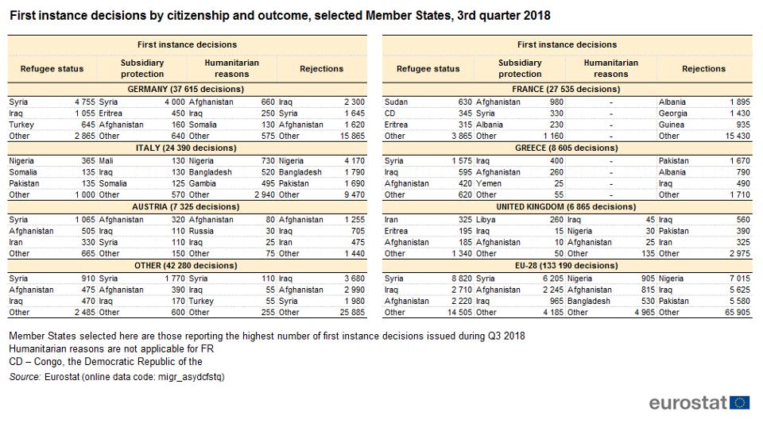

### **رهبران اروپایی دیگر نمی‌توانند به مردمی که در دریا گرفتار شده‌اند، پشت کنند**
#### **AYS Weekly News Summary in Persian, January 14–20**

 ‎](assets/d7ecfe360045/1*YVyh__hiIOU4ZBtEmrjyaQ.jpeg)

Photo: [Pothiti Kitromilidi](https://www.facebook.com/pothiti.kitromilidi?__tn__=%2Cd%2AF%2AF-R&eid=ARBd2y1L_pAbZCqMbMewBzYZ0uviGRN4aIlEQMyEWY638CTkDLpxiJX2iVZWGyCJJwTwsui3Lx7CbKUe&tn-str=%2AF) ‎
#### _افرادی که در دریا نجات یافتند باید به یک مکان امن منتقل شوند \. بیش از ۵۷۰ نفر تحت‌تاثیر باران شدید و برف در لبنان قرار گرفتند \. پنج کارگر مهاجر در آنکارا جان خود را از دست دادند\. گروه داوطلب تخمین می‌زند که حدود ۲۴۵۰ نفر در خیابان‌های پاریس زندگی می‌کنند\. و خبرهای بیشتری از بالکان و اتحادیه اروپا …_

**خاص**
### پدر، گارد ساحلیه یونان را به تلاش برای کشتن آن‌ها متهم کرد

> امواج زیاد و قویی در دریا وجود داشتند\. ما فکر می‌کردیم که گارد ساحلی برای نجات ما آمده‌ است\. آن‌ها به ما گفتند که موتور قایق را خاموش کنیم\. قایق ما را با یک طناب بستند و سپس شروع کردند به چرخاندن قایق ما به شکل دایره 

من به آن‌ها گفتم که چندین بچه در قایق هستند، اما آن‌ها گوش نمی کردند، آب زیادی در قایق وجود داشت، که آن‌ها ما را ترک کردند

این صحبت های پدر دختر نه ساله ای بود که موفق شد دو بچه دیگرش را به راحتی از مرگ نجات دهد\. او تمام صحبت هایش را با روزنامه نگاران دیلی صباح در میان گذاشت\. اما زینب ، دختر نه‌ ساله ی او، قبل از اینکه گارد ساحلی ترکیه او را پیدا کند، غرق شد \. پدر دختر بچه می‌گوید که افسران نیروی [دریایی یونان سعی کردند آن‌ها را بکشند ، چون گارد ساحلی از گوش دادن به او امتناع میکردند](ays-daily-digest-15-01-19-a-nine-year-old-girl-died-when-a-dinghy-sank-off-the-turkish-coast-1fc42e8da61)

قایق مدتی بعد از اینکه شهر غربی ترکیه، کوش آداسی را ترک کرد ، شروع به فرو رفتن در آب کرد\. این خانواده متشکل از پدر محمد فادل ، مادر کوثر و سه کودک با ۴۵ مهاجر عراقی دیگر به سمت جزیره یونانی ساموس سفر کردند\. مقامات یونانی هیچ کاری برای کمک به آن‌ها انجام ندادند ، بلکه مخالف آنها هم بودند\. همانطور که روزنامه دیلی صباح گزارش می‌دهد، یونان به شدت مردم را به سمت ترکیه به عقب میفرستد\. خانواده و سایر مهاجرانی که سوار بر این قایق بودند به همان جایی که از آن آمدند، دیپورت شدند

در ماه دسامبر ، بیل فرلیک از سازمان دیده ‌بان حقوق بشر، با توجه به خشونت پلیس و عقب ‌نشینی از مرز سرزمین یونان و ترکیه، با تجربه هایی روبرو شده ‌است، نوشت\. آنچه او در یک گزارش از سال ۲۰۰۸ نوشت، این کلمات را دوباره در سال ۲۰۱۸ تمدید کرد\. این گزارش از سال ۲۰۰۸ است و این گزینه ی جدیدی از آن است، برای کسانی که می‌خواهند سناریو یا داستان های خود را مقایسه کنند

**در سال ۲۰۱۹، بیش از ۲۱ مهاجر در سراسر جهان کشته شده‌اند\. براساس گزارش پروژه مهاجران گم‌ شده ی سازمان بین‌المللی مهاجرت ، ۱۶ تن از آن‌ها در اثر غرق شدن در دریای مدیترانه کشته شده‌اند**

داستان‌های مردم ، امیدها و رویاهای ناتمام خیلی زود به پایان می‌رسد : اگر اتحادیه اروپا و دیگر بازیگران، خراب کاری های خود را کنار بگذارند، مرگ هم در دریا کاهش خواهد یافت\. و اگر همانطور که ذکر شد، به سازمان‌های غیر دولتی اجازه داده شود تا زندگی مردم را در دریا نجات دهند، زندگی های کمتری از بین خواهد رفت

اما زندگی زینب هرگز التیام نخواهد یافت\. او نه ‌ساله بود و مجبور شد در اوایل ژانویه ۲۰۱۹ با یک قایق پارویی سفر کند

**عمومی**

سوری‌ها ، افغان‌ها و عراقی‌ها سه ملیتی بودند که در سال ۲۰۱۸ به دنبال پناهندگی در اتحادیه اروپا بودند و به ترتیب ۲۱۲۰۰ ، ۱۱۲۰۰ و ۱۰۰۰۰ درخواست پناهندگی کردند\. در مقایسه با سال‌های گذشته — این ارقام پایین آمده است که با معاملات با کشورهای مختلف سوم و افزایش نظارت مرزی ایجاد شده‌است\. برای کسب اطلاعات بیشتر در مورد کاربردهای پناهندگی در کشورها، و برخی از آمار دیگر ، نگاهی به تصاویر بیندازید

### **لبنان**

بر طبق گزارش‌ها [یونیسف](https://www.unicef.org.uk/press-releases/unicef-and-partners-providing-urgent-relief-to-protect-nearly-40000-children-at-risk-from-the-ongoing-winter-storms-in-lebanon/) ، آخرین طوفانی که در هفته‌های اخیر لبنان را هدف قرار داده‌است ، کودکان آسیب ‌دیده اند و نیاز به حفاظت و گرما دارند، به ویژه کودکان پناهنده را تحت ‌تاثیر قرار داده ‌است\.

بیش از ۵۷۰ نفر تحت‌ تاثیر باران شدید و برف قرار گرفتند؛ سیل در حداقل ۱۱ شهرک رخ داده است\. طبق گفته این سازمان بیش از ۱۱۳۰۰ نفرتحت ‌تاثیر این طوفان قرار گرفته‌اند ، نیمی از آن‌ها نوجوان هستند\.

در دره ی بقاع به تنهایی ، حداقل ۸۴۷ تن از پناهندگان سوری باید به خاطر سیل‌ها یا خسارات شدید به پناهگاه ‌ها جا به جا شوند\. در شمال، بیش از ۷۰۰ نفر درمحل جدید جا به جا شده تا کنون گزارش شده‌اند
### **ترکیه**
#### پنج کارگر مهاجر در آنکارا کشته شدند

رسانه‌ها گزارش دادند که پنج کارگر از سوریه جان خود را در آتش‌سوزی که در بخش تولید کنندگان مبلمان آنکارا منفجر شد، [از دست داده‌اند](https://bianet.org/english/migration/204542-5-workers-from-syria-lose-their-lives-in-fire?fbclid=IwAR0-2wjk-KQZk-HM4aILZAY5RUvTRXAS96FguVNivi7Vy1X6mKglL37SmMg) \. در سراسر سال ۲۰۱۸ حداقل ۱۰۸ کارگر مهاجر جانشان را در خودکشیه شغلی در ترکیه از دست دادند

**لیسووس**

برف در حال پوشاندن موریا، اقامت پناهندگان و میدان همبستگیه شهر است\. شرایط بسیار وحشتناک است\. **جزیره ها را باز کنید ، افراد را در این شرایط به دام نیندازید**

یک آتش‌سوزی در یکی از چادرهای بزرگ جنگل زیتون در اردوگاه موریا در حوالیه ی ظهراتفاق افتاد\. چادر تمام طول مسیر را سوزاند، اما خوشبختانه آتش توسط آتش‌نشان‌ها قبل از انتشار جدیه ی آن خاموش شد\. در حال حاضر هیچ گزارشی از آسیب‌های جدی گزارش داده نشده است\. داوطلبان در این جزیره برای کمک به مردمی که در این چادر زندگی می‌کردند، برای گرفتن سرپناه جدید در حال تلاش هستند
#### **ساموس**

[**یک بحران مداوم در ساموس ، مار\.لیب گذارش میدهد**](ays-daily-weekend-19-20-1-2019-the-letter-from-samos-89470c65f0fa)

اتحادیه اروپا باید امنیت مردم را در هوای سرد ، حمایت پزشکی و روانی و امنیت اجتماعی را تضمین کند

هوا، سرد ، بارانی و خیلی بد است و تجهیزات پزشکی و غذای کافی وجود ندارد

### بوسنی و هرزگوین
#### سارایوو

در طول ژانویه , سرما به زیر صفر رسیده و برف کاملا زمین را پوشانده است\. داوطلبان در سارایوو به آر\.یو\.س گفته ‌اند که آن‌ها اخیرا ً یک مرکز اجتماعی را باز کرده‌اند , فضایی که در آن افرادی که در خیابان‌ها زندگی می‌کنند و در سرما هستند , می‌توانند غذای گرم دریافت کنند و در جای گرم باشند\. هم چنین آن‌ها می‌توانند موبایل های خود را در آنجا شارژ کنند\. در حال حاضر, اعداد کاملا ً ثابت و پایین هستند : تقریبا ً هفتاد جوان در خارج از اردوگاه‌ها و مکان‌های دیگر زندگی می‌کنند

در صورت ورود تازه واردان یا نیازهای فوریه دیگر , [بوسنی](https://www.facebook.com/BASIS-Bosnia-1487914718006023/?ref=br_rs) دارای شماره ‌تلفن اضطراری است \. این شماره در بسیاری از مکان‌ها و چندین زبان‌ مختلف در دسترس است
### **کرواسی**

نظارت بر خشونت مرزی بیانیه‌ای جمعی را در پاسخ به ادعاهای وزارت کشور کرواسی منتشر کرد، مبنی بر اینکه جویندگان پناهندگی به صورت غیر قانونی، از ورودشان به پناهگاه ها امتناع میشود

ما از کمیسیون اروپا می‌خواهیم تا به این نگرانی کمک کند و آن را در اولویت قرار دهد\. ما خواستار درخواست کمیسیون اروپا در کرواسی برای توقف و بررسیه شفاف جمعی، به اصطلاح دیپورت پناهندگان به بوسنی و هرزگوین، اتهامات خشونت علیه پناهجویان و در بوسنی و هرزگوین است \.

[مقاله ی کامل را مطالعه کنید](https://www.borderviolence.eu/proof-of-push-backs/)
### **اسلوونی**
#### پلیس اسلوونی کمیسر اطلاعات را به دادگاه می‌برد

پلیس اسلوونی از تصمیم کمیسیونر اطلاعات برای افشای اسناد مورد استفاده در طی پردازش پناهجویان در مرز درخواست کرد\. اگرچه بخشی از این اسناد پلیس در سال گذشته به درخواست عفو بین‌الملل اسلوونی افشا شد, هنوز مقدار بحرانی و زیادی هنوز پنهان است\. کمیسر اطلاعات درخواست کرد که پلیس همه اسناد را برای تعیین قانونی بودن دستورها و روند پلیس افشا کن\.

این تصمیم برگرفته از شواهد متعدد از مهاجرانی است که پناهندگی در اسلوونی را ردکرده و به کرواسی بازگردانده شده‌اند\. هر چند که پلیس هر گونه اتهام خطاکاری را تکذیب می‌کند, آن‌ها از فاش کردن مدارک امتناع می‌ورزند و با استناد به دلایل امنیت اسلوونی واروپا, [علیه این تصمیم درخواست کرده‌اند](https://www.dnevnik.si/)
### **فرانسه**

مقامات شهرداری در پاریس، برنامه ی خود را برای بیرون راندن همه ی افرادی که در اردوگاه در امتداد خیابان سن ویل سن در سنت — دنی زندگی می‌کنند، اعلام کرده‌اند\. در این برنامه، پناهگاه اضطراری برای افرادی که با این اخراج مواجه هستند، هنوز تعبیه نشده است

](assets/d7ecfe360045/1*x-ywYgFba3-IQvCynp9F-Q.jpeg)

[Paris Refugee Ground Support](https://www.facebook.com/PRGS.team/?__xts__%5B0%5D=68.ARD0BpD2gaqwA3uw0lhUqkcHCM2j9-ROOmRNmzDgLrM85o_7CIYAIoePDaw31EXzKAR24FcZIkcER90bw73hTCjokmvqCl-aSxTlfAb68Wnwp1hI6RkYzf8piEvlm_O1UTx2F4kHsMy0o0_6HHWY36pqU1NfEe72Z3rPitJ1MtCHWyQ_HHo8c2t4Mv3WaXf25s4Y2u6d-HHq__0Y5Dn1p3TGzegH-pvLe7t_7bRVugyQE42AR2G-ZjRJc39t54jchIGEWth2g9dlRSQi08Ufw-bvjuP3HKcEZS-GMoge7BAK2DvVnAlV6BlHsDPxZEzFC7URBngH_eAxYXPjtaloyIgEx5Ym&__tn__=k%2AF&tn-str=k%2AF)
### **سوئد**
#### قرار است قانون حق الحاق خانواده در اواسط سال ۲۰۱۹ مورد تجدید نظر قرار گیرند

[رسانه‌های محلی](https://www.svt.se/nyheter/inrikes/1-000-fler-asylsokande-per-ar-nar-anhoriginvandring-aterinfors?fbclid=IwAR1aqxaT_26l-emN-M_LWto-Yk_chLUeD-JYyrPrPq3kF93weNYSUs7TUk4) گزارش دادند که قانون حق الحاق خانواده یکی از نقاط توافق بودجه است که به تازگی تصویب شده‌است\.

حق الحاق خانواده زمانی حذف شد که قانون پناهندگی موقت در نوامبر ۲۰۱۵ به تصویب رسید \.

طبق ارزیابی هیئت مهاجرت سوئد، حدود ۱۰۰۰ نفر از پناهندگان در هر سال از طریق این برنامه وارد خواهند شد \.

انتظار می‌رود که این تغییرات تا اواسط سال اجرا شوند

در سال ۲۰۱۸ ، مجموعا ً ۲۱۵۰۲ درخواست پناهندگی به اداره مهاجرت رد داده شده است \. تاکنون در سال‌های ۲۰۱۹، حدود ۷۴۴ پرونده به این آژانس تحویل داده شده ‌است\. در پی آن ، مردم سوریه مثل مردم افغان به دنبال آن هستند که به بخش شمالی کشور دسترسی داشته باشندو یک گروه بزرگتر دیگر، افرادی از گرجستان هستند

### **کانادا**
#### شایعاتی مبنی بر اینکه کانادا در طی چند سال آینده بیش از یک میلیون مهاجر را می‌پذیرد، حقیقت دارد

تیم اطلاعات تسالونیکی می‌گوید، در حالی که دولت کانادا در واقع اعلام کرده ‌است که طی سه سال آینده یک میلیون مهاجر را پذیرش خواهد کرد، اکثر این سهمیه برای کارگران ماهر و اعضای خانواده آن‌ها رزرو خواهد شد

کانادا طرح‌هایی برای اسکان مجدد حدود سی هزار تن از پناهندگان در هر سال دارد ، اما اینها همه افرادی هستند که رسما ً از سوی کمیساریای عالی پناهندگان سازمان ملل یا همان یو\.ان معرفی میشوند و روند انتخاب وسیعی را تجربه کرده‌اند\. متاسفانه هیچ راهی برای درخواست این برنامه توسط خودتان یا حتی با کمک یک وکیل وجود ندارد و کمیساریای عالی پناهندگان سازمان ملل به پناهندگان که در حال حاضر در اتحادیه اروپا حضور دارند ارجاع نمی‌دهد

[مقاله ی کامل را در زبان‌های مختلف بخوانید](https://www.facebook.com/mobileinfoteam/posts/2356556764573039)

_Converted [Medium Post](https://medium.com/are-you-syrious/%D8%B1%D9%87%D8%A8%D8%B1%D8%A7%D9%86-%D8%A7%D8%B1%D9%88%D9%BE%D8%A7%DB%8C%DB%8C-%D8%AF%DB%8C%DA%AF%D8%B1-%D9%86%D9%85%DB%8C-%D8%AA%D9%88%D8%A7%D9%86%D9%86%D8%AF-%D8%A8%D9%87-%D9%85%D8%B1%D8%AF%D9%85%DB%8C-%DA%A9%D9%87-%D8%AF%D8%B1-%D8%AF%D8%B1%DB%8C%D8%A7-%DA%AF%D8%B1%D9%81%D8%AA%D8%A7%D8%B1-%D8%B4%D8%AF%D9%87-%D8%A7%D9%86%D8%AF-%D9%BE%D8%B4%D8%AA-%DA%A9%D9%86%D9%86%D8%AF-d7ecfe360045) by [ZMediumToMarkdown](https://github.com/ZhgChgLi/ZMediumToMarkdown)._
