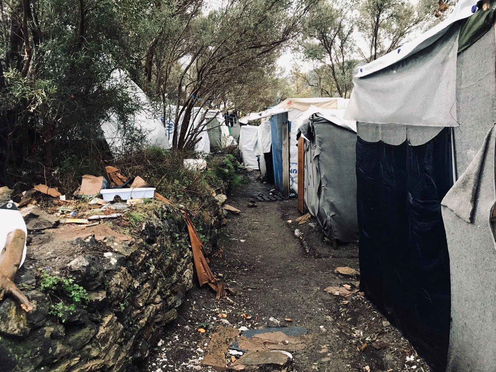
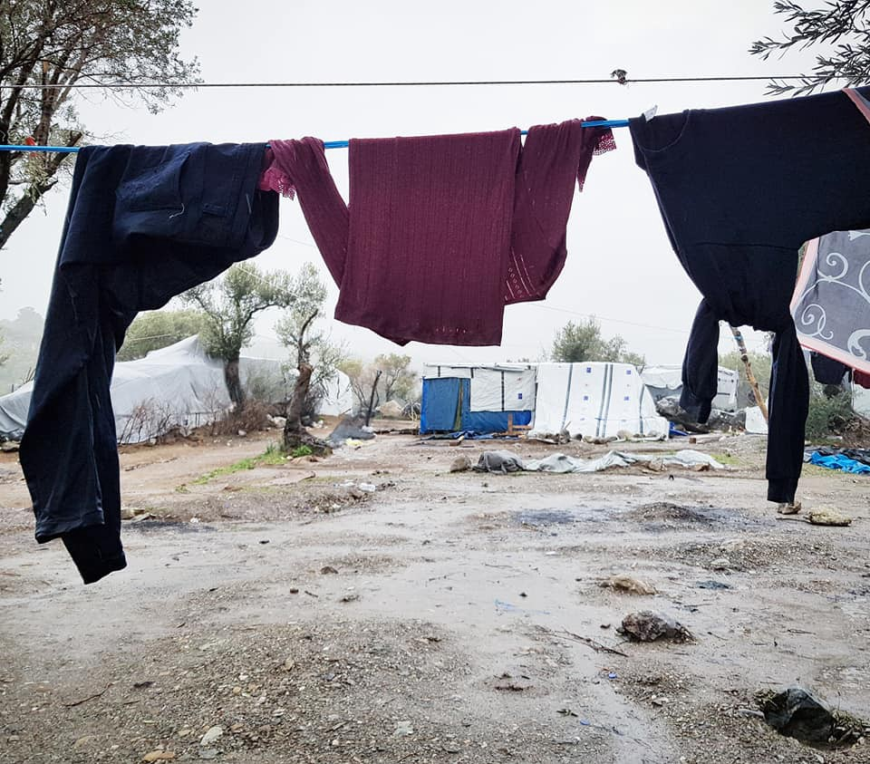
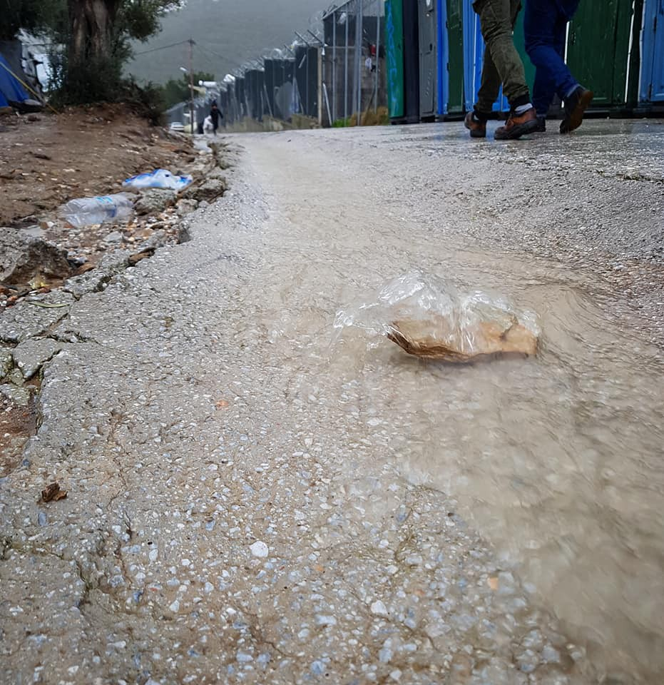

### AYS Daily Digest 26–27/1/18: EU\-funded misery on the Greek islands
#### Unbearable situation continues in the Aegean / Solidarity protests and international pressure over Italy / Spain proposes increase in deportations and detention / New deportations from Germany to Afghanistan announced / A legislative change in Iceland announces equal reception conditions for resettled refugees and asylum seekers / more news and updates

[Are You Syrious?](https://medium.com/@AreYouSyrious)

Jan 28

 \)](assets/fbac9e8d0ca2/1*7QdO4tT-keulGiXLBsfFjw.jpeg)

Samos, Greece \(Photo: [Nicoletta Novara](https://www.facebook.com/nicoletta.novara.3?__tn__=%2CdKH-R-R&eid=ARAWwAtfTUEkj7qPJeJH7ledbzRrTYCIaFOw5xYs7ljNI2SAwjLzQ5_LFMFjnM3NjInO6XoMcZXCU3-g&fref=mentions) \)
#### FEATURE

](assets/fbac9e8d0ca2/1*UsIlLWs-hBcpW7zC5kVugw.jpeg)

Photos: [Nicoletta Novara](https://www.facebook.com/nicoletta.novara.3?__tn__=%2CdKH-R-R&eid=ARAWwAtfTUEkj7qPJeJH7ledbzRrTYCIaFOw5xYs7ljNI2SAwjLzQ5_LFMFjnM3NjInO6XoMcZXCU3-g&fref=mentions)

> _Share the truth about Samos hot spot and hit the authorities hard:_ 

> _\- 4500 people live imprisoned in a structure built for 650\._ 
 

> _\- of these 4500, over 1500 are children\._ 
 

> _\- of these, 300 are unaccompanied minors\. They should be the most protected persons in the field, yet they live in numbers of 30 in a container built for 8, sometimes without doors and windows, without electricity or running water\. Some live even in camping tents_ 
 

> _\- to over 1500 children the right to education is denied: local schools do not accept them, despite being a constitutional right of every child on Greek soil\._ 
 

> _\- girls take many risks with families fearing assaults letting them come to our school\. Even when reported, the police don’t raise a finger regarding abuse cases\._ 
 

> _\- to over 1500 children the right to nutrition is denied: the tail for meals lasts up to 4 hours\. You often go to bed without dinner\. Food quality is inadequate to development\._ 
 

> _\- to over 1500 children the right to security is denied: police brutality on minors is on the agenda\._ 
 

> _\- over 1500 children the right to shelter is denied: dozens of families are forced to live in camping tents, exposed to the weather, in the woods adjacent to the field\._ 
 

> _\- there are only two doctors for 4500 people\._ 
 

> _\- it’s estimated there’s 1 shower for every 200 people\._ 
 

> _\- the bathrooms are broken and the sewage drains directly onto the curtains where people sleep\._ 
 

> _\- police hold and beat minors, sometimes without apparent reason, often asking them to sign statements in a language they do not understand, in order to be released\._ 
 

> _\- authorities separate families\._ 
 

> _\- the sanitation and waste disposal system is insufficient\. People collect trash, but a system is missing in order to remove it\._ 
 

> _\- Parasites and infections are common\._ 
 

> _\- thousands of human beings every year are forced to live for an average of six months in a place that worsens their psychological state, and this was confirmed and reported by the MSF \(Doctors without borders\) in 2018\._ 

](assets/fbac9e8d0ca2/1*z8lGsZdJOzW1A9qvQI_z0A.jpeg)

Photos: [Nicoletta Novara](https://www.facebook.com/nicoletta.novara.3?__tn__=%2CdKH-R-R&eid=ARAWwAtfTUEkj7qPJeJH7ledbzRrTYCIaFOw5xYs7ljNI2SAwjLzQ5_LFMFjnM3NjInO6XoMcZXCU3-g&fref=mentions)

> Greece has received over a billion and a half euros from Europe specifically to manage the refugee crisis\. Are the authorities ‘pocketing’ the money? 

> _If not us, who? If not now, when? — [Nicolò Govoni](https://www.facebook.com/govoninicolo/?__tn__=%2CdkCH-R-R&eid=ARB_0ACK05S5cnpPi_XZb9lPgx9PIeh-RXKQrY9vtjqW0tw6GRyR66Gzh-RqLEjtcGAaF3vMoWGmZ40f&hc_ref=ARTtki11Spnu9fmIbIBkfbQsbt_2Ho0zzXnA_botYTzpcx7G0s5CxQYh2dLmlxvHCOs&fref=nf) , team [Still I Rise](https://www.facebook.com/stilliriseNGO/?__tn__=%2CdKH-R-R&eid=ARBztKU24TudD9K_-BPkDCZS0U1_Q1xaQUyAlRTNQXkBoLUbUbqFQQWCTJItiHEjeqXIbeWvqaIM44ct&fref=mentions)_ 

](assets/fbac9e8d0ca2/1*bBCFv7RAqqGj2F1EFxs_HA.jpeg)

Photos: [Nicoletta Novara](https://www.facebook.com/nicoletta.novara.3?__tn__=%2CdKH-R-R&eid=ARAWwAtfTUEkj7qPJeJH7ledbzRrTYCIaFOw5xYs7ljNI2SAwjLzQ5_LFMFjnM3NjInO6XoMcZXCU3-g&fref=mentions)

[Refugee 4 Refugees](https://www.facebook.com/Refugee4Refugees/) team is also looking for volunteers willing to help on Samos, please contact them if you or anyone you know wants to join them\.

[10,000 pairs of Socks4Samos](https://www.facebook.com/donate/232075217735138/) 
[Dry and warm feet can make the world of difference to someone who is cold\. Our new \#SOCKS4SAMOS campaign aims to get…www\.facebook\.com](https://www.facebook.com/donate/232075217735138/)
#### GREECE
### Chios

Given the late surge of arrivals to the Aegean islands, the need for help in welcoming them only increases\. [Chios Eastern Shore Response Team — CESRT](https://www.facebook.com/chiosesrt/?__tn__=kC-R&eid=ARDKXm9vgNPWnere08XDoWtug53gZl1sbkaqyhk3x24XJMMCRzxIZUB0BSYGgM3Mfy3-_u5YCDGGZrjt&hc_ref=ARTf55xMFauzRRMo3-vS7VkUJnDVELYgT3oONMPALKDN80J1paP_U-yBJuzKX9D2Lnw&fref=nf&__xts__%5B0%5D=68.ARDbecWK-TvEYhKtYZYEurxhWFBMYl_nj6fxfniRV8xdgTvKKUZRtqFGSs3bnIee6GPRxzcvcuVcqAtCBS_nwS8qDuMGRKOHt7bqi3xYml-RU9yXn_8nmDmT3qRf2UEa8G1xRgAr6AZ5JIprmw39Ibo9CX2Fh9k0zL5x-A5eeZjkkIo0jV8ZNXXgRsN_mreugtm6ITbtA5HBcwxwpkWDXlnCTsNYAyAW_4VSoumYfe5SssE0YBJlbUvUJkr9cAmL2KrEh5AF1sGulYRRr-m9x-2E9HRPM6QblRiqeTp3OinxZZ7gW514Df_X-54HVUrSNYSUfEO0RY3xLltG1foqNT9g5bB5CnDM1NzA610lrsd1IaJHCNpVTBYfww) needs volunteers urgently:

> The landings have increased and we are only 9 volunteers,working 24/7 at the ground\.We need volunteers that can come minimum 14 days\! We cannot continue all our long term projects without your help\. Our projects are: Landings, Distributions to appartments, minors, Language center, Vial activities for children,Vial supplies, locals shop, Beach cleaning and emergency projects 

### Lesvos

As we reported yesterday, the power cuts in Moria continue and so does the ongoing lack of effort to change the living conditions for the thousands stuck there\.

Photo: Anna Alboth

Moria, Lesvos \(Photos: Anna Alboth\)
### Athens

After a week doing emergency coat distribution in Samos, the Pampiraiki team is back in Athens\. In their weekly report, the team reports a great number of actions needed to be able to face the harsh winter of this year\. They expanded the aid provided within the Attika area, as well as on the islands and mainland Greece\.

> We are currently in need of contributions, both monetary and in kind\. At present we are very low in funds needed in order to : 
 

> provide food to at least the 2,000–2,500 people living
 

> in squats and other residences in Athens and 
 

> for the transportation of goods and other operating 
 

> costs\. 

They also need volunteers to help, whether for a few days, or in a constant manner\.

[Azadi Squat Athens](https://www.facebook.com/AzadiSquatAthens/) , hosing about 50 people at the moment, reports also needing donations, particularly in food:

> We are around 50 people living peacefully together\. Most of us are woman and children\.
 

> We are on the way to set up the house in a good living standard for everyone who is having a room in the building\.
 

> Currently we are not able to take new people in the Squat\. But we are able to take care of those who are living inside\! 

> What we need:
 

> Blankets
 

> Pillows
 

> Lamps
 

> Fridge
 

> Soap 

> and urgently we need food donations\!
 

> We are happy to get dried food donations from Pamperaki \!
 

> But unfortunately this is not enough\! If you could help us with food donations we would appreciate to get in contact with you\! 

#### BALKAN WEATHER forecast for Monday 28th

**Montenegro**

Predominately cloudy and rainy\. In the south and centre possibility of showers and locally moderate to strong precipitation\. During the morning and night local sleet and snow\. Wind amplified to strong locally with strong gusts southern and southeastern and weakening during the night\. Lowest temperatures from 0 to 10 and highest daily from 3 to 14 degrees\.

**Serbia**

Predominately cloudy and colder, in the lower regions locally with rain and snow, in the mountains snow and local rain freezing in contact with the ground\. Wind weak to moderate blowing from the northwest\. Lowest temperatures from \-4 to 2 and highest daily from 1 to 6 degrees\.

**BiH** 
 
Moderately to predominately cloudy and rainy in most part of the country, in the higher parts sleet and snow\. More intense precipitation in western Bosnia and northern Herzegovina, in the east and northeast of Bosnia no precipitation\. In Herzegovina and west Bosnia moderate to strong, in the rest of the country weak to moderate with strong gusts from time to time, blowing from the west and southwest\. Lowest temperatures \-2 to 10 and highest daily from 3 to 13 degrees\.

**Croatia**

Mostly cloudy, rain \(in some places heavier, with strong winds\) in the Adriatic, in the mainland rain and occasional snow\. There will still be a lot of snow in some areas \(Lika, Gorski kotar and mountain area\) with ice on many roads due to low temperatures and rain\. Temperatures from \-1 to 4, 7 do 12 °C on the coast\.
#### BOSNIA AND HERZEGOVINA
### Sarajevo

_Converted [Medium Post](https://medium.com/are-you-syrious/ays-daily-digest-26-27-1-18-eu-funded-misery-on-the-greek-islands-fbac9e8d0ca2) by [ZMediumToMarkdown](https://github.com/ZhgChgLi/ZMediumToMarkdown)._
