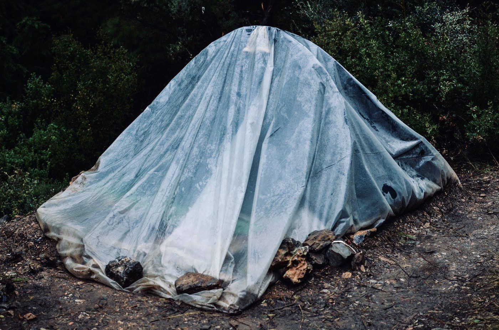
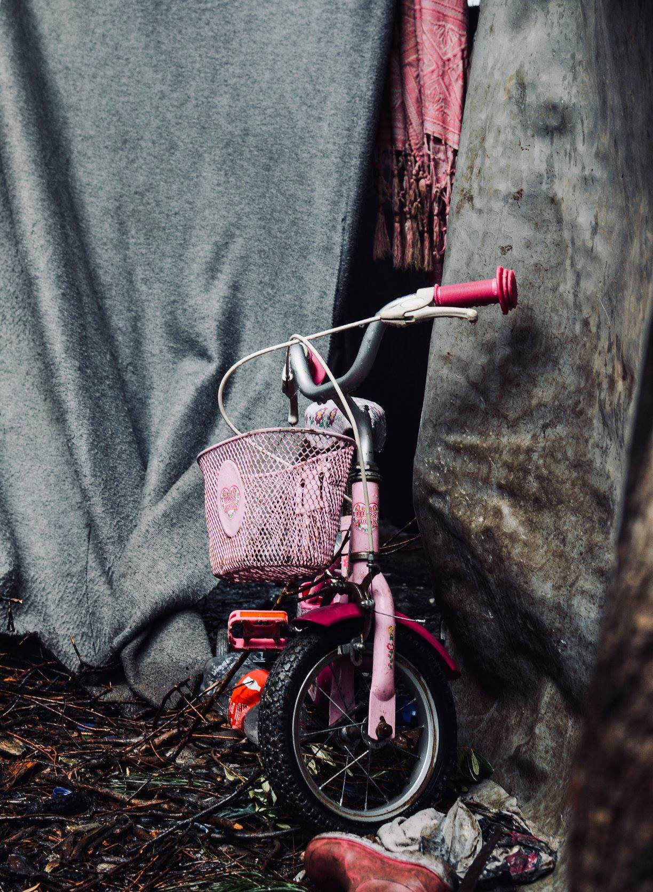
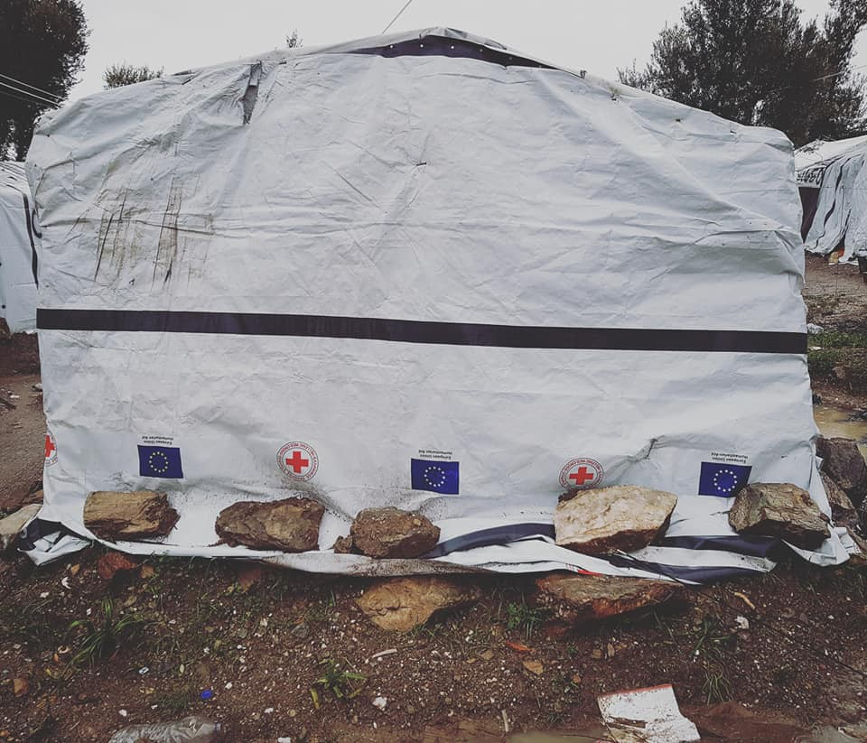
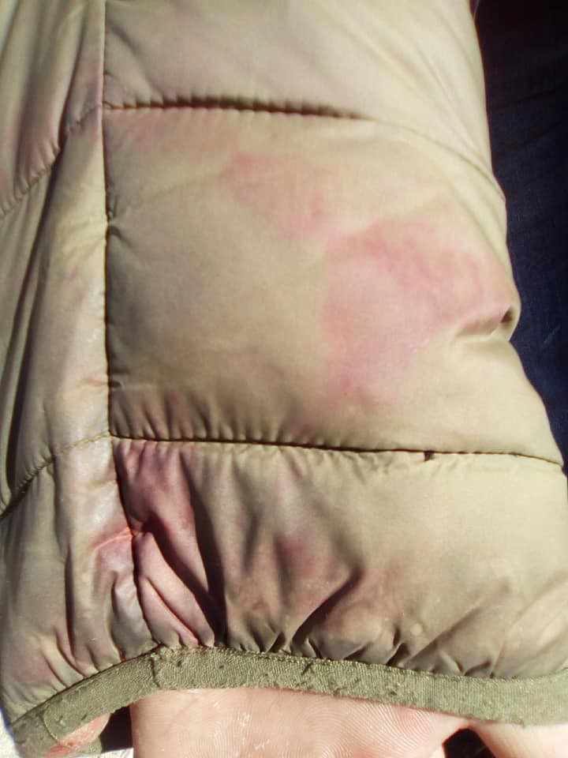

### AYS Daily Digest 26–27/1/18: EU\-funded misery on the Greek islands
#### Unbearable situation continues in the Aegean / Solidarity protests and international pressure over Italy / Spain proposes increase in deportations and detention / New deportations from Germany to Afghanistan announced / A legislative change in Iceland announces equal reception conditions for resettled refugees and asylum seekers / more news and updates

 \)](assets/ff6cfe68fae3/1*7QdO4tT-keulGiXLBsfFjw.jpeg)

Samos, Greece \(Photo: [Nicoletta Novara](https://www.facebook.com/nicoletta.novara.3?__tn__=%2CdKH-R-R&eid=ARAWwAtfTUEkj7qPJeJH7ledbzRrTYCIaFOw5xYs7ljNI2SAwjLzQ5_LFMFjnM3NjInO6XoMcZXCU3-g&fref=mentions) \)
#### FEATURE

](assets/ff6cfe68fae3/1*UsIlLWs-hBcpW7zC5kVugw.jpeg)

Photos: [Nicoletta Novara](https://www.facebook.com/nicoletta.novara.3?__tn__=%2CdKH-R-R&eid=ARAWwAtfTUEkj7qPJeJH7ledbzRrTYCIaFOw5xYs7ljNI2SAwjLzQ5_LFMFjnM3NjInO6XoMcZXCU3-g&fref=mentions)

> _Share the truth about Samos hot spot and hit the authorities hard:_ 

> _\- 4500 people live imprisoned in a structure built for 650\._ 
 

> _\- of these 4500, over 1500 are children\._ 
 

> _\- of these, 300 are unaccompanied minors\. They should be the most protected persons in the field, yet they live in numbers of 30 in a container built for 8, sometimes without doors and windows, without electricity or running water\. Some live even in camping tents_ 
 

> _\- to over 1500 children the right to education is denied: local schools do not accept them, despite being a constitutional right of every child on Greek soil\._ 
 

> _\- girls take many risks with families fearing assaults letting them come to our school\. Even when reported, the police don’t raise a finger regarding abuse cases\._ 
 

> _\- to over 1500 children the right to nutrition is denied: the tail for meals lasts up to 4 hours\. You often go to bed without dinner\. Food quality is inadequate to development\._ 
 

> _\- to over 1500 children the right to security is denied: police brutality on minors is on the agenda\._ 
 

> _\- over 1500 children the right to shelter is denied: dozens of families are forced to live in camping tents, exposed to the weather, in the woods adjacent to the field\._ 
 

> _\- there are only two doctors for 4500 people\._ 
 

> _\- it’s estimated there’s 1 shower for every 200 people\._ 
 

> _\- the bathrooms are broken and the sewage drains directly onto the curtains where people sleep\._ 
 

> _\- police hold and beat minors, sometimes without apparent reason, often asking them to sign statements in a language they do not understand, in order to be released\._ 
 

> _\- authorities separate families\._ 
 

> _\- the sanitation and waste disposal system is insufficient\. People collect trash, but a system is missing in order to remove it\._ 
 

> _\- Parasites and infections are common\._ 
 

> _\- thousands of human beings every year are forced to live for an average of six months in a place that worsens their psychological state, and this was confirmed and reported by the MSF \(Doctors without borders\) in 2018\._ 

](assets/ff6cfe68fae3/1*z8lGsZdJOzW1A9qvQI_z0A.jpeg)

Photos: [Nicoletta Novara](https://www.facebook.com/nicoletta.novara.3?__tn__=%2CdKH-R-R&eid=ARAWwAtfTUEkj7qPJeJH7ledbzRrTYCIaFOw5xYs7ljNI2SAwjLzQ5_LFMFjnM3NjInO6XoMcZXCU3-g&fref=mentions)

> _Greece has received over a billion and a half euros from Europe specifically to manage the refugee crisis\. Are the authorities ‘pocketing’ the money?_ 

> _If not us, who? If not now, when? — [Nicolò Govoni](https://www.facebook.com/govoninicolo/?__tn__=%2CdkCH-R-R&eid=ARB_0ACK05S5cnpPi_XZb9lPgx9PIeh-RXKQrY9vtjqW0tw6GRyR66Gzh-RqLEjtcGAaF3vMoWGmZ40f&hc_ref=ARTtki11Spnu9fmIbIBkfbQsbt_2Ho0zzXnA_botYTzpcx7G0s5CxQYh2dLmlxvHCOs&fref=nf) , team [Still I Rise](https://www.facebook.com/stilliriseNGO/?__tn__=%2CdKH-R-R&eid=ARBztKU24TudD9K_-BPkDCZS0U1_Q1xaQUyAlRTNQXkBoLUbUbqFQQWCTJItiHEjeqXIbeWvqaIM44ct&fref=mentions)_ 

](assets/ff6cfe68fae3/1*bBCFv7RAqqGj2F1EFxs_HA.jpeg)

Photos: [Nicoletta Novara](https://www.facebook.com/nicoletta.novara.3?__tn__=%2CdKH-R-R&eid=ARAWwAtfTUEkj7qPJeJH7ledbzRrTYCIaFOw5xYs7ljNI2SAwjLzQ5_LFMFjnM3NjInO6XoMcZXCU3-g&fref=mentions)

[Refugee 4 Refugees](https://www.facebook.com/Refugee4Refugees/) team is also looking for volunteers willing to help on Samos, please contact them if you or anyone you know wants to join them\.

#### GREECE
### Chios

Given the late surge of arrivals to the Aegean islands, the need for help in welcoming them only increases\. [Chios Eastern Shore Response Team — CESRT](https://www.facebook.com/chiosesrt/?__tn__=kC-R&eid=ARDKXm9vgNPWnere08XDoWtug53gZl1sbkaqyhk3x24XJMMCRzxIZUB0BSYGgM3Mfy3-_u5YCDGGZrjt&hc_ref=ARTf55xMFauzRRMo3-vS7VkUJnDVELYgT3oONMPALKDN80J1paP_U-yBJuzKX9D2Lnw&fref=nf&__xts__%5B0%5D=68.ARDbecWK-TvEYhKtYZYEurxhWFBMYl_nj6fxfniRV8xdgTvKKUZRtqFGSs3bnIee6GPRxzcvcuVcqAtCBS_nwS8qDuMGRKOHt7bqi3xYml-RU9yXn_8nmDmT3qRf2UEa8G1xRgAr6AZ5JIprmw39Ibo9CX2Fh9k0zL5x-A5eeZjkkIo0jV8ZNXXgRsN_mreugtm6ITbtA5HBcwxwpkWDXlnCTsNYAyAW_4VSoumYfe5SssE0YBJlbUvUJkr9cAmL2KrEh5AF1sGulYRRr-m9x-2E9HRPM6QblRiqeTp3OinxZZ7gW514Df_X-54HVUrSNYSUfEO0RY3xLltG1foqNT9g5bB5CnDM1NzA610lrsd1IaJHCNpVTBYfww) needs volunteers urgently:

> The landings have increased and we are only 9 volunteers,working 24/7 at the ground\.We need volunteers that can come minimum 14 days\! We cannot continue all our long term projects without your help\. Our projects are: Landings, Distributions to appartments, minors, Language center, Vial activities for children,Vial supplies, locals shop, Beach cleaning and emergency projects 

### Lesvos

As we reported yesterday, the power cuts in Moria continue and so does the ongoing lack of effort to change the living conditions for the thousands stuck there\.

Photo: Anna Alboth

Moria, Lesvos \(Photos: Anna Alboth\)
### Athens

After a week doing emergency coat distribution in Samos, the Pampiraiki team is back in Athens\. In their weekly report, the team reports a great number of actions needed to be able to face the harsh winter of this year\. They expanded the aid provided within the Attika area, as well as on the islands and mainland Greece\.

> We are currently in need of contributions, both monetary and in kind\. At present we are very low in funds needed in order to : 
 

> provide food to at least the 2,000–2,500 people living
 

> in squats and other residences in Athens and 
 

> for the transportation of goods and other operating 
 

> costs\. 

They also need volunteers to help, whether for a few days, or in a constant manner\.

[Azadi Squat Athens](https://www.facebook.com/AzadiSquatAthens/) , hosing about 50 people at the moment, reports also needing donations, particularly in food:

> We are around 50 people living peacefully together\. Most of us are woman and children\.
 

> We are on the way to set up the house in a good living standard for everyone who is having a room in the building\.
 

> Currently we are not able to take new people in the Squat\. But we are able to take care of those who are living inside\! 

> What we need:
 

> Blankets
 

> Pillows
 

> Lamps
 

> Fridge
 

> Soap 

> and urgently we need food donations\!
 

> We are happy to get dried food donations from Pamperaki \!
 

> But unfortunately this is not enough\! If you could help us with food donations we would appreciate to get in contact with you\! 

#### BALKAN WEATHER forecast for Monday 28th

**Montenegro**

Predominately cloudy and rainy\. In the south and centre possibility of showers and locally moderate to strong precipitation\. During the morning and night local sleet and snow\. Wind amplified to strong locally with strong gusts southern and southeastern and weakening during the night\. Lowest temperatures from 0 to 10 and highest daily from 3 to 14 degrees\.

**Serbia**

Predominately cloudy and colder, in the lower regions locally with rain and snow, in the mountains snow and local rain freezing in contact with the ground\. Wind weak to moderate blowing from the northwest\. Lowest temperatures from \-4 to 2 and highest daily from 1 to 6 degrees\.

**BiH** 
 
Moderately to predominately cloudy and rainy in most part of the country, in the higher parts sleet and snow\. More intense precipitation in western Bosnia and northern Herzegovina, in the east and northeast of Bosnia no precipitation\. In Herzegovina and west Bosnia moderate to strong, in the rest of the country weak to moderate with strong gusts from time to time, blowing from the west and southwest\. Lowest temperatures \-2 to 10 and highest daily from 3 to 13 degrees\.

**Croatia**

Mostly cloudy, rain \(in some places heavier, with strong winds\) in the Adriatic, in the mainland rain and occasional snow\. There will still be a lot of snow in some areas \(Lika, Gorski kotar and mountain area\) with ice on many roads due to low temperatures and rain\. Temperatures from \-1 to 4, 7 do 12 °C on the coast\.
#### BOSNIA AND HERZEGOVINA
### Sarajevo

![“Almost 30 stoves we installed in total over the last weeks together with AidBrigade\. As the fire wood is expensive and hard to store in the wet weather we were looking for a more effective and sustainable solution\. Two weeks ago we started with the support of Kunterbunter Handlungsspielraum — KbH to distribute fire briquettes together with the wood, which burns better and keep the warmth longer\. Another advantage is that the briquettes are creating less ash which makes it easier for the guys to clean the stoves\. The test run was very good to we are expecting a big delivery this week and will continue this mix for the next weeks\.” — BASIS](assets/ff6cfe68fae3/1*exJSvhFBffEzSHhja8NhkQ.jpeg)

“Almost 30 stoves we installed in total over the last weeks together with AidBrigade\. As the fire wood is expensive and hard to store in the wet weather we were looking for a more effective and sustainable solution\. Two weeks ago we started with the support of Kunterbunter Handlungsspielraum — KbH to distribute fire briquettes together with the wood, which burns better and keep the warmth longer\. Another advantage is that the briquettes are creating less ash which makes it easier for the guys to clean the stoves\. The test run was very good to we are expecting a big delivery this week and will continue this mix for the next weeks\.” — BASIS
#### ITALY
### Border area with France

“Dozens of people are kept inside these metal containers for up to 24 hours or more, without food, water, toilets, medical attention or a roof\. The floor is kept wet so no one can sit or lie down, making it an unbearable situation for the already exhausted, tired and sick people there\.”

](assets/ff6cfe68fae3/1*fiBpI1u9g7qz8LpmLc2I5g.jpeg)

Photos: [Kesha Niya](https://www.facebook.com/KeshaNiyaProject/?__tn__=%2CdkCH-R-R&eid=ARCBZVAZ0aEXY-tPdOjG59bzfV0fQgwZoq-BM5Jb4KR534urbIue7fuFgce1kj8jK0e7WGXfKERJ536v&hc_ref=ARTZ1Q2R7-YjQiI7q6pPEPQ2rMiq_UBADa4b2G7NPXE1mIbj2nJDs-XCa2omgq_lWZk&fref=nf&hc_location=group)

[Kesha Niya](https://www.facebook.com/KeshaNiyaProject/?__tn__=%2CdkCH-R-R&eid=ARCBZVAZ0aEXY-tPdOjG59bzfV0fQgwZoq-BM5Jb4KR534urbIue7fuFgce1kj8jK0e7WGXfKERJ536v&hc_ref=ARTZ1Q2R7-YjQiI7q6pPEPQ2rMiq_UBADa4b2G7NPXE1mIbj2nJDs-XCa2omgq_lWZk&fref=nf&hc_location=group) team helps on the Italian side and collects many stories throughout the week\. Here is what they wrote:

> Lately, the stories we collect have shown a huge increase in police violence and abuse of power: 

> French police take important documents away \(such as minors’ birth certificates\) and when they ask for them back, or ask for food or water, they get punched in the face \(…with a ring\) \. They hit minors for trying to declare themselves as minors\. They spray pepperspray into the closed container, sometimes straight into the eyes, and beat people without mercy\.
 

> A man came out day before yesterday with bruises and cuts, with blood on his jacket, and on the back of his hand he had a burn mark: French police had not only beaten him up and insulted him, but also extinguished a cigarette on his hand \(see pictures\) \. He told us of how they had slapped his face and punched him and one told him he would fuck his mother\. They took all his belongings\. 

> Hopefully this doesn’t need to be added, but we have no reason to doubt these accounts: people are all locked up together and confirm each other’s stories independently\.
 

> We are not surprised but outraged\. This is how far the French state will go to “discourage” migration\. 
 

> We will keep doing breakfast and try to provide all the encouragement, solidarity and coffee that we can\. 

#### SEARCH AND RESCUE — ITALY
### “Fateli scendere\!”

The UN is putting pressure on Italy to end their inhumane treatment of the people stranded in the sea close to Siracuse, Sicily\. In a joint statement, several [UN](http://www.spiegel.de/thema/uno/) organizations demanded that the migrants arrested on Sicily by the Sea\-Watch German aid organization be allowed to disembark “without delay” in Italy\. Save the Children and other aid agencies are urging Italy to allow minors rescued in the Mediterranean to land, amid the latest diplomatic row over the fate of migrants saved at sea\.

> “6\.3 A ship should not be subject to undue delay, financial burden or other related difficulties after assisting persons at sea; therefore coastal States should relieve the ship as soon as practicable\.” 

There are no legal grounds [reportedly](http://www.asgi.it/media/comunicati-stampa/chiusura-porti-accesso-civico/) for Italy not to allow disembarkation of refugee SAR ships, regardless of which flag they sail under\. However, those opposing claim that “the flag state, which has jurisdiction and responsibility on the ship, should asap declare that it accepts all the migrants\. Italy has nothing to do with this ship\. We can let them disembark only if they can be directly transferred to Amsterdam\.”

More than 10,000 people have gathered in Genova, protesting against the infamous Salvini decree, supporting the Sea Watch and other search and rescue crews who are and have been saving lives across the Mediterranean sea, only to be left to float, with people who need a safe port onboard their vessel\.

Demonstrating against current policies and those who spread hate across social media and in real life, a loud and willing majority of people wanted to [make it clear](https://video.repubblica.it/edizione/genova/a-genova-10mila-in-piazza-contro-il-decreto-salvini-liberate-i-47-migranti-della-sea-watch/325536/326152?fbclid=IwAR0cdV3wwgM6jqZ8jCXU6GoSxzTymNmFlwYXFvlguxHluR-mYpCz-RxtLzo&refresh_ce) they are “ready to face the phenomenon of migration with all seriousness and humanity\.”

■■■■■■■■■■■■■■ 
> **[Sea-Watch International](https://twitter.com/seawatch_intl) @ Twitter Says:** 

> > Thanks from all of us to the thousands of people who demonstrated yesterday in #Genova because they want a welcoming country, to the hundreds who asked in #Siracusa and #Bologna for the landing of the shipwrecked aboard the #SeaWatch.

We are not alone ❤️

[video.repubblica.it/edizione/genov…](https://video.repubblica.it/edizione/genova/a-genova-10mila-in-piazza-contro-il-decreto-salvini-liberate-i-47-migranti-della-sea-watch/325536/326152) https://t.co/ODZ5Qjx7fy 

> **Tweeted at [2019-01-27 10:19:27](https://twitter.com/seawatch_intl/status/1089467919342469120).** 

■■■■■■■■■■■■■■ 

Teams have collected important data, preparing documents that would prove the need and confirm the right to disembark in Italy as soon as possible:

> It is understandable why their testimonies on the atrocious sufferings suffered in the detention camps in Libya should not have come out of that ship and because no one had to see the signs of the violence and torture imprinted on their bodies forever\. 

> All that we have gathered today is now a fundamental material for the documents that, as a matter of urgency, we will present to various competent Authorities, at every level\. 

> We have promised it to the 47 survivors aboard the Sea\-Watch\-3: we will never leave you alone, we will do our best and the impossible so that your rights are respected\. — [_Mediterranea_](https://mediterranearescue.org/news/seawatch3documentazioneperporrefinealsequestro47naufraghi/) 

■■■■■■■■■■■■■■ 
> **[Oscar Camps](https://twitter.com/campsoscar) @ Twitter Says:** 

> > Algunos políticos recuerdan hoy la más cruel y vergonzosa página de la historia.Ocurrió una vez y no lo quisieron ver.Sucede de nuevo,con la complicidad de estos mismos líderes políticos que miran para otro lado.208 muertos en 20 días, 30.000 en 5 años. Se recordará. #Holocausto https://t.co/mV0StOgYMM 

> **Tweeted at [2019-01-27 10:05:34](https://twitter.com/campsoscar/status/1089464424304394241).** 

■■■■■■■■■■■■■■ 

#### SPAIN
### Tightening the legislative knot

Spain has become Europe’s main entry point for refugees and migrants, overtaking Greece and Italy\. More than 55,000 migrants arrived in Spain by sea in 2018, according to the UN refugee agency\.
A new proposal of the Spanish government brings forth a plan to expel 9000 illegal migrants currently in the country\. They also plan a construction of new detention centres \(CIEs\) in Madrid and in the cities of Malaga and Algeciras in Andalusia, which are the main arrival points for undocumented persons\. This proposal confirms the tightening on irregular migration, ECRE reports\.
#### GERMANY

There are indications, that the next collective deportation to Afghanistan will take place on February 18th\. Information against fear on [Bavarian Refugee Council’s website](https://www.fluechtlingsrat-bayern.de/abschiebungen-nach-afghanistan.html?fbclid=IwAR1mZImzOGFd5KjCc6w2l7iJbo1JyEB_QLTM3-MTLWeh5BJ0cjAKAv79nY0) \.
#### ICELAND

The Minister of Social Affairs and Equality, said of the proposal:

> “the biggest changes are that individuals who receive asylum status through the Directorate of Immigration and have, up until now, been on their own, will go into the same system that the \[resettled\] refugees do, in which they have support in learning Icelandic, getting themselves settled, and adapting to society\.” 

In May 2018, 55% of Iceland’s residents who voted in the municipal election poll supported Iceland welcoming more refugees\. In 2018 55 people arrived in Iceland via resettlement schemes\. In 2018, 800 people applied for asylum in Iceland which was a decrease from 1,096 applicants in 2017 and 1,132 in 2016, ECRE reports\.
#### GENERAL
### Disparities in the way European countries grant international protection persist\.

ECRI newsletter Asylum Statistics 2018 reports a steady drop in asylum applications in Germany, Sweden, Finland, Denmark, Norway and Bulgaria\. The reduction in Italy was drastic, going from 130,180 applications in 2017 to 53,500 in 2018\. However, the number of people seeking asylum continue to increase in other countries \(France, Turkey, Greece, Belgium and Slovenia\) \. Significant increases in the number of registered asylum applications are reported in Spain and in Cyprus\.

> _The chances of obtaining a form of protection vary dramatically from one country to another, even for asylum seekers coming from the same country\._ 

Recognition rates for Iraqis ranged from 94\.2% in Italy to 12% in Bulgaria\. In between lies a spectrum covering Sweden \(26%\), Belgium \(31\.2%\), Norway \(43\.3%\), Germany \(45\.9%\), Finland \(53%\), Slovenia \(60%\) and Greece \(69\.4%\) \. For Afghans recognition rates varied from 98\.4% in Italy to 24% in Bulgaria\. Slovenia \(77\.7%\), Finland \(73\.4%\) and Greece \(70\.9%\) had considerably high rates, contrasting with 33% in Sweden, 50\.6% in Belgium and 52\.2% in Germany\.

The persisting disparity in national policies on refugee status determination has prompted an increasing number of courts to suspend Dublin transfers of asylum seekers to countries where they would be at risk of onward deportation\. Find the whole report [here](https://www.asylumineurope.org/news/25-01-2019/asylum-statistics-2018-changing-arrivals-same-concerns?fbclid=IwAR1i5RnwMiD3wV6ynegFYMgeALd18o_vAPVBfzTI3HoE_fQNkEktPLeQzwg) \.

Young Arabs from everywhere can apply for Al Ghurair Foundation programmes and scholarships\. Find more information on the link below:

**We are an entirely volunteer\-run media team, and we rely on our supporters to share our news\. So please share, and never forget to ACT\!**

**We strive to echo correct news from the ground through collaboration and fairness\. Every effort has been made to credit organizations and individuals with regard to the supply of information, video, and photo material \(in cases where the source wanted to be accredited\) \. Please notify us regarding corrections\.**

**If there’s anything you want to share or comment, contact us through Facebook or write to: areyousyrious@gmail\.com**

_Converted [Medium Post](https://medium.com/are-you-syrious/ays-daily-digest-26-27-1-18-eu-funded-misery-on-the-greek-islands-ff6cfe68fae3) by [ZMediumToMarkdown](https://github.com/ZhgChgLi/ZMediumToMarkdown)._
