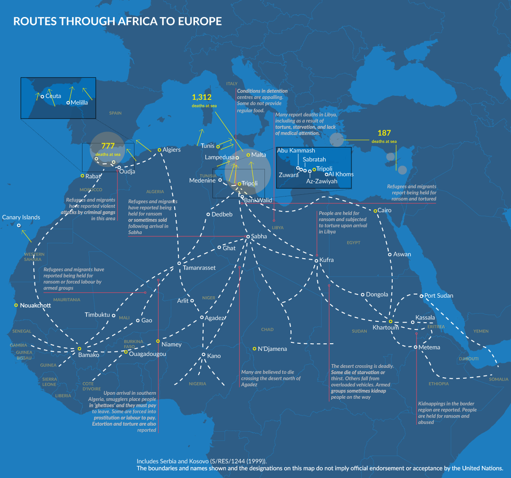
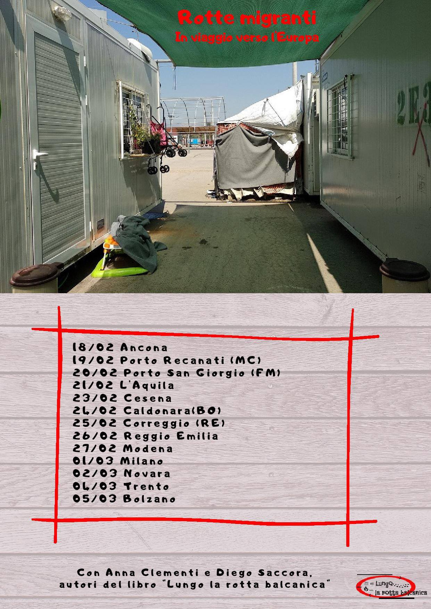
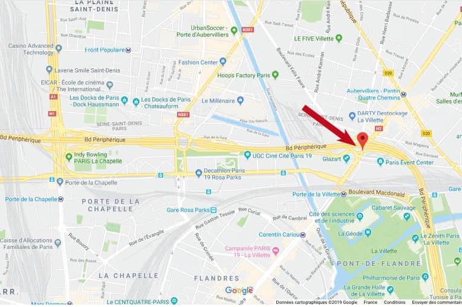
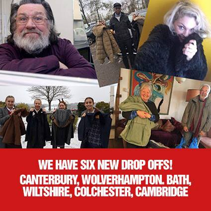

### AYS Daily Digest 31/01/2018: An average of six deaths every day in the sea in 2018

_Since 2015, 640 children died while trying to reach safety in the EU // Pushbacks and violence are what EU is made from in 2018 // The situation in Yemen is getting worse every day // People housed with the help of ESTIA program in Greece will have to leave their houses soon // Dutch Protestant church ended a non\-stop service for asylum seekers // And more news…_

2019 by Sherif Arafa
### FEATURE

The UNHCR has published their 2018 desperate journey report showing a very dark picture of Europe today\. Closed borders and hostile policies killed at least **2,275 people** in the sea last year, while at least 44 per cent of people who crossed the sea to arrive in Italy witnessed death on their journeys\.

At the same time, [Save the Children](https://medium.com/u/7f93f66b669c) issued a statement saying that among those who died since 2014, there are at least 640 children\. Only this year, **during the first 31 days, 64 children died not being able to reach the safety of the EU** \.

People were dying while trying to cross land routes, too\. **At least 136 deaths** were recorded in different parts of Europe\. Particularly risky are areas including the Evros River, at the Greek\-Turkish border, where **at least 27 people drowned,** the road between the Greek\-Turkish land border, and Thessaloniki, where **at least 29 people died in vehicle accidents** \.

**At least 57 people died** **after arriving in Europe and travelling onwards** from one state to another\. This included **32 deaths in the Western Balkans** , as well as seven deaths as people tried to move on from Italy and five as people tried to cross from France to England\.

At the borders between Morocco and the Spanish enclaves of Ceuta and Melilla, **at least six deaths** were reported of which four took place during or after attempts to cross the fence\.

Governments in Europe are increasingly using violence and pushbacks to prevent people from their journey, but also from seeking asylum\. Thousands of pushbacks were registered along the border of the EU: in Romania, Hungary, Croatia, Bulgaria, Greece, Slovenia, Italy… as well as in the Balkans countries like Bosnia, Serbia, Albania, or Montenegro\.

> “States have the right and duty to manage their borders\. However, this is subject to their obligations under national, European, and international law on the protection of asylum\-seekers and refugees\. Push\-backs may also expose people to extreme dangers, including putting lives at risk, depending on the use of violence by the authorities as well as weather conditions\.” 

Even more, victims are often children\. The UNHCR and its partners in Serbia received reports of **more than 400 unaccompanied children being pushed back from neighbouring countries** , and **over 270 reported having been denied access to asylum procedures** , while **90 reported having been subjected to physical violence** \.

However, the key problem — that the UNHCR does not give enough attention in this report — is that the practice of illegal pushbacks or even violence from the border police is not sanctioned or even acknowledged as a problem in Brussels\.

Unlike in 2017, 2016, or 2015, when people were arriving mostly to Italy and Greece, last year the highest number of new arrivals was registered in Spain\. According to the UNHCR analysis, those using this route were thought to do so for a variety of reasons, with some motivated by economic factors and others seeking asylum\.

> “Among those arriving in Spain seeking international protection were people fleeing gender\-related persecution such as forced marriage and female genital mutilation, persecution on account of sexual orientation or gender identity, and political persecution\. Others arriving in Spain via this route potentially in need of protection included victims of trafficking and unaccompanied children\.” 

The increase is noticed on the Balkan route, too\. In 2018, Bosnia and Herzegovina was in focus, and it will likely stay like that even in 2019\. Over 24,000 people were registered entering the country during the year, and the trend continued even in January\.

> “The increased numbers in Bosnia and Herzegovina prompted the international humanitarian community to work with government counterparts to strengthen capacity in order to respond more effectively to the needs of asylum\-seekers while addressing the situation of migrants, improve reception conditions \(especially in the most affected Una\-Sana Canton, in the north of the country\), as well as increase basic services, including health services, before the onset of winter\. However, conditions remain precarious,” the UNHCR concludes\. 

AYS reported throughout the year about the situation in Bosnia, focusing on precarious living conditions in centres that are run by the IOM and UNHCR and their partners\. The UNHCR report does not give enough attention to descriptions of these inhuman conditions, nor does it adequately focus on the problem\.

What remained an issue through the year, and will probably persist in 2019, is a problem with access to asylum in the Balkans\. In Bosnia, out of a total number of people who registered, only about sevent percent found a way to apply\. In Serbia, of the almost 8,500 people who expressed their intention to seek asylum, only four percent applied\. In Albania, of 4,000 people who applied for asylum in 2018, only one percent had not abandoned the asylum procedure and had expressed their interest in staying in that country\.

Additionally, in 2018, more arrivals were registered in Cyprus, where almost 7,800 new asylum applications were lodged during the year\. Among those who registered were several boats carrying Syrians arriving directly from Lebanon\.

In the second half of the year, an increase in attempts to reach England by boat was noticed, too\.

Finally, the UNHCR concludes that _“until the root causes and triggers of displacement and migration are addressed in many countries in nearby regions, people will continue to seek safety and protection, while others will try to escape poverty with the hope of finding work or educational opportunities\.”_

They predict that in 2019, Europe will see more migration from Mali, northern Nigeria, Cameroon, Burkina Faso, and western Niger\. They call for solidarity, which is often targeted by the government\. Unfortunately, so far, the UNHCR has not been that effective in protecting or even promoting solidarity, remaining instead an organization driven by politics\.

One of the conclusions of the report is that migrations cannot be stopped\. They did not put it like that, but history is teaching us this lesson that leaders in the EU for some reason do not want to acknowledge\. They want to create the conditons in which they will be able to pick and choose who can and who cannot migrate\. Or, to paraphrase the great George Orwell, some people are more equal than others\.
### YEMEN

The United Nations Food and Agriculture Organization [\(FAO\) estimates](http://www.fao.org/emergencies/resources/documents/resources-detail/en/c/1178664/) that some **67 percent \(20 million people\) of the country’s total population of 29\.9 million would be in need of urgent assistance to save their lives and livelihoods\.**

The conflict that is going on for over four years has led to a severe economic decline and collapsed essential services, taking an enormous toll on the population and exacerbating existing vulnerabilities\. _“Preventing the country from slipping into famine requires a significant political and economic engagement at all levels from all sides on finding peaceful solutions to end the conflict and an immediate cessation of hostilities,_ ” the FAO urges everybody\.

While somebody hears this appeal, thousands of people from Yemen are stuck in the Balkans, prevented from entering the EU and seeking asylum\.
### LIBYA

Despite all the criticism towards EU cooperation with Libya, it will not stop\. Foreign Minister Mohammed Sayala visited Austria announcing that by February 20th, Libya will provide the EU with a final policy that is needed to secure the southern borders in the country\. [He explained](https://www.libyaobserver.ly/news/foreign-minister-libyas-southern-borders-are-eus-borders) that “ _the true borders of the European Union are not in the Mediterranean but in the vast Libyan desert,”_ referring to the influx of migrants through Libya’s southern borders\.

Almost at the same time comes an open letter signed by 52 organizations, and accusing the EU governments of “ _being complicit in the tragedy of migrants crossing from Libya to Italy, saying more than 5,300 people had died in the Mediterranean in the past two years\.”_

The NGOs are called on European governments to support rescue operations and stop sending people back to Libya, stating that EU member states need to be _“prepared to suspend cooperation with the Libyan coastguard if issues like arbitrary detention are not dealt with\.”_ EU governments should also support search and rescue operations and ensure that people rescued at sea can arrive safely and without delay to Europe, they believe\.

### MOROCCO

[Association Marocaine des Droits Humains — Section Nador](https://www.facebook.com/AmdhNador/?__xts__%5B0%5D=68.ARA-mwTJIELGyE01Ax2wCNlxWR-nVbuykd9xroBZ_6UryTrRMFlI9MsMi37sMnkGQA8TWHckqts6WqiQQEUZvsuHSMjBhkwo2-Pm7tSgeTsgyT6sHiDa5rolJ9ZKmcRAbC3bAHSLaS-v5prDcY1_KtWQLwwFIJXZEXUPXZa1vbv-vJ4n3cIeA-9NLSWwZjmPYgXc4LIFLr5O0OQyo35axiGFtU8stisk5Lq2gQ5ZaQlaDPR-fhc89R5JKM4HlwkH0riaXvqVJxazyKBF4ySxCC_98KjxByM1HAhj5D9ZuauiT1QAvdF22zdqqvHK_bo_dW-MSB0Tw2JK37VvbbzonZ_0xoY1IzxYV079vfBDU9Vvy7uD&__tn__=%2CdkCH-R-R&eid=ARDwzfYImSdlZEIBxIVXtvoV7NZ1jS2bmUQNEHBmu8wl20C2iujhfsSobECcwO548IjJq_2uZqyJCHTe&hc_ref=ART9T6E7KUqci6j-HNjM0QvJakOjvycKx85N8MBFHRlPV_cPQ6_Amr236LKLCbA7Ut0&fref=nf&hc_location=group) received a list with the names of 52 people who have been missing since January 12th\. AMDH Nador cannot confirm the accuracy of this list, but simply publish it at the request of families looking for their loved ones\. Find the list on the FB page, and if you have any information, please contact this group\.
### SPAIN

[Aita Mark ship continues to be denied](https://amp.eitb.eus/es/noticias/sociedad/detalle/6168641/responsables-aita-mari-afirman-cuentan-todos-certificados/?fbclid=IwAR3sEh1IlgQd_kPJB5TVbSY-Nt6eAv0JgTYuVjPSSuqbg1f3L9nVDq3BKTo) permission to leave and carry out search and rescue missions\. According to officials, it is due to not passing sufficient safety checks, though the crew is arguing that it has just passed the necessary checks\.
### GREECE

Plans for a protest have been announced, to be held at the port of Mytilene on February 7th to demand the closing of Moria and the transfer of people to the mainland, as well as the improvement of living conditions at all refugee and migrant centres\. The rally will be held in Sapphous Square and should start at 6:30 pm\.

The announcement comes from the Workers’ Center\. The group hailed the support locals have provided to people arriving on the island since 2015 and welcomed an initiative on the island of Samos to hold a similar protest on the same day\. They also called on the islanders to isolate those who cultivate hatred toward migrants and refugees\.

In the meantime, with bad weather, life in Moria became even more difficult for the people trapped inside\.

■■■■■■■■■■■■■■ 
> **[RSA](https://twitter.com/rspaegean) @ Twitter Says:** 

> > Rain in Moria yesterday night:No electricity inside and outside the camp. After the torrential rainfalls of the previous days, reportedly the Municipality of Lesvos expected to submit a request to the Region of the North Aegean to declare the island in an emergency situation. https://t.co/rCKn1GAr9r 

> **Tweeted at [2019-01-31 14:20:59](https://twitter.com/rspaegean/status/1090978254075449346).** 

■■■■■■■■■■■■■■ 

While Moria is in focus \(rightly\), Samos has become the place of horror\. We reported about the living conditions, but we will do so, again, and again — as long as it is needed\.

Just to remind you, 4,400 people are living in a space built for 650\. Among them, there are at least 1,500 children, including about 300 unaccompanied minors\. All these kids do not go to school or have anything even close to a normal childhood\. Only a very small percentage of kids are allowed to go to school, but even for them it is very difficult\. This week, [Greek media reported](https://t.co/r6Rxt2OGfV) about an attack against teachers in Samos on Monday during a meeting of parents associations on the education of refugees\.

This is life in Samos \(in Italian\):

More news that should make all of us worry: the time has come when the UNHCR will request that organizations housing people in the ESTIA program — the [European Commission](https://medium.com/u/960f4c0ad987) \-funded programme managed by the Greek Ministry of Migration Policy, along with the UNHCR, and implemented by local authorities and national and international NGOs in Greece — “exit” the program\. The first evictions are to take place on the 31st of March\. Exceptions are to be made for highly vulnerable cases\.

In response to that, the FEANTSA and the Greek Network for the Right to Shelter and Housing have drafted a common statement saying that the national welfare system _“is not adequately equipped to host and support recognised refugees, with the lack of any social housing provision for both locals and newcomers being a fundamental gap\.”_

> _“We are concerned that the planned exits from the ESTIA programme, without appropriate accommodation provision in place, might result in a rising number of homeless families and individuals\. This is particularly worrisome as it might cause an interruption in their integration process, interrupting their children’s school education and potentially denying access to social services due to the lack of a legal address\.”_ 

FEANTSA and the Greek Network for the Right to Shelter and Housing urgently demand the European Commission ensures that housing continually is provided to all individuals who go through an asylum application\.

People who arrive in the EU to ask for asylum must be immediately provided with adequate accommodation and must not be left without a housing solution at the end of the asylum process\.

We urge the EC and the Greek government not to put an end to the eligibility of recognised refugees for the ESTIA programme until an operational accommodation and integration pathway is in place, so as to ensure the continuity of integration efforts\.

The [Campus Bus](https://www.facebook.com/campusbus/?__tn__=%2CdKH-R-R&eid=ARBbe95PTggcp6ekcw6ZfmDpTin8qqzx_hAhNsGPoeEo3vqRIRE1jSFzfGFTx9HSYNDG11AGGj3Kqw9g&fref=mentions) travels around Greece and offers free two day courses for unemployed refugees over 18 with basic computer and English skills\. Once a person has completed the course, he or she will receive a certificate, get a mentor, and start a first, small online job\.
### ITALY

[Along the Balkan Route](https://www.facebook.com/lungolarottabalcanica/?__tn__=%2CdkCH-R-R&eid=ARDQyi46UUk56Qp4EVRo44tTUWYmQ7y0RFh1vTvKKJJ7EI8k9FgZj57ld4qiNyapITLr-zDzws6ZbAmG&hc_ref=ARQjgJzlGDRiihxyQCDgwb7wH3rzUBzWCXxpjtYeck-kY_G32rJfi6Q8UO1bZNMR90M&fref=nf&hc_location=group) organizes a series of talks after eight months spent in Bosnia and Greece\.

They will visit different cities and organize open debates to talk about what is happening at the borders of Europe, from the conditions in which people in Lesbos, Athens, and Patras are living, to the rejections by the Croatian authorities, to the situation inside and outside the camps in Bosnia, until what is happening in Italy\.
### NETHERLANDS

After more than three months, a Dutch Protestant church ended a non\-stop service that it had started to protect the Tamrazyan family, Armenian asylum seekers, from deportation\. The announcement came after the Dutch government decided that it would review hundreds of asylum applications by children who were previously rejected, which will include the family they were protecting\.

The last service was held on Wednesday at 1:30 pm\. and was followed by a party\.

The Tamrazyan family fled Armenia after the father received death threats over his political activities\. They have been in the Netherlands for nine years\.
### GERMANY

A pregnant Palestinian woman is facing deportation to Latvia while her son has been put into an orphanage\.

It does not look like a humanitarian solution\. A 30\-year\-old pregnant Palestinian was arrested last week in Passau\. She is now in the deportation prison Eichstätt\. Her preschool\-aged son remained alone in Passau\. He was, as the Passauer Neue Presse and the Donaukurier report consistently, housed without his parents in an orphanage\. After all, he may continue to visit his old kindergarten\. The father has gone underground\. The family is scheduled to be deported to Latvia — an appointment is not clear\.

Activists and a support group plan a [demonstration next Wednesday](https://www.facebook.com/events/1085251238312325/) in Passau\.

_“A deportation would mean a further traumatic experience for the child as well as for mother and father,”_ the statement they issued said\.

With these arguments, a [petition was started](https://www.change.org/p/regierung-niederbayern-schwangere-….) by the Passau Asylum Café\. The addressees are the government of Lower Bavaria and the Bavarian Minister of the Interior Joachim Herrmann \(CSU\) \.

More demonstrations have been announced in Germany as well\. This time it is against the cooperation of the EU with Sudan, on Saturday, February 2nd in Hannover\.

In an open letter, [PRO ASYL and more than 30 other organizations are calling for binding rules on the disembarkation](https://www.proasyl.de/.../offene-haefen-und.../) of those seeking protection in Europe\.

In the letter co\-signed by PRO ASYL to Federal Minister of Justice Barley and Federal Interior Minister Seehofer, the organizations call for support for search and rescue operations and an end to the blockade of ships that have rescued people from distress\.
### FRANCE

[Solidarité migrants Wilson](https://www.facebook.com/Solidarit%C3%A9-migrants-Wilson-598228360377940/?__xts__%5B0%5D=68.ARA-mwTJIELGyE01Ax2wCNlxWR-nVbuykd9xroBZ_6UryTrRMFlI9MsMi37sMnkGQA8TWHckqts6WqiQQEUZvsuHSMjBhkwo2-Pm7tSgeTsgyT6sHiDa5rolJ9ZKmcRAbC3bAHSLaS-v5prDcY1_KtWQLwwFIJXZEXUPXZa1vbv-vJ4n3cIeA-9NLSWwZjmPYgXc4LIFLr5O0OQyo35axiGFtU8stisk5Lq2gQ5ZaQlaDPR-fhc89R5JKM4HlwkH0riaXvqVJxazyKBF4ySxCC_98KjxByM1HAhj5D9ZuauiT1QAvdF22zdqqvHK_bo_dW-MSB0Tw2JK37VvbbzonZ_0xoY1IzxYV079vfBDU9Vvy7uD&__tn__=%2CdkCH-R-R&eid=ARAdT1lmXW0iwqBHXcD50PLIrXqeqZJrDfWiyqKzTZmqrYAslWObIZ1AIdA0Yt2ygEDx92x-wrPf1hQU&hc_ref=ARQp-pbCt6gibqoEMj7nSRji63jdxBN1ZAv9D4zgMOdqeARsU8vka1n77domoPleqK0&fref=nf&hc_location=group) reports about more evictions in the camp Porte de la villette, Paris\.

Follow their Facebook page to get more information, and help if you can\.
### UK

New drop off points for France:

**We also publish weekly summaries of some of the most important news reported during the past week in our Daily News Digest: here are the [Arabic](%D8%AA%D9%85%D9%88%D9%8A%D9%84-%D8%A7%D9%84%D8%A7%D8%AA%D8%AD%D8%A7%D8%AF-%D8%A7%D9%84%D8%A3%D9%88%D8%B1%D9%88%D8%A8%D9%8A-%D9%8A%D9%85%D9%86%D8%B9-%D8%A5%D9%86%D9%82%D8%A7%D8%B0-%D8%A7%D9%84%D8%A3%D8%B1%D9%88%D8%A7%D8%AD-%D9%81%D9%8A-%D8%A7%D9%84%D8%A8%D8%AD%D8%B1-%D8%A8%D9%8A%D9%86%D9%85%D8%A7-%D9%8A%D8%AF%D8%B9%D9%85-%D8%A7%D9%84%D9%85%D8%AE%D9%8A%D9%85%D8%A7%D8%AA-%D8%A7%D9%84%D9%84%D8%A7%D8%A5%D9%86%D8%B3%D8%A7%D9%86%D9%8A%D8%A9-%D9%81%D9%8A-%D8%AF%D9%88%D9%84-%D8%A7%D9%84%D8%A8%D9%84%D9%82%D8%A7%D9%86-a7dc22e7bf7f) and [Persian](%D8%A7%D8%B1%D9%88%D9%BE%D8%A7-%D8%A7%D8%B2-%D9%BE%D8%B1%D8%AF%D8%A7%D8%AE%D8%AA-%D9%87%D8%B2%DB%8C%D9%86%D9%87-%D8%A8%D8%B1%D8%A7%DB%8C-%D9%86%D8%AC%D8%A7%D8%AA-%D9%85%D8%B1%D8%AF%D9%85-%D8%AF%D8%B1-%D8%AF%D8%B1%DB%8C%D8%A7-%D8%AC%D9%84%D9%88%DA%AF%DB%8C%D8%B1%DB%8C-%D9%85%DB%8C-%DA%A9%D9%86%D8%AF-%D8%AF%D8%B1-%D8%AD%D8%A7%D9%84%DB%8C-%DA%A9%D9%87-%D8%A8%D8%B1%D8%A7%DB%8C-%DA%A9%D9%85%D9%BE-%D9%87%D8%A7%DB%8C-%D9%86%D8%A7%D9%85%D9%86%D8%A7%D8%B3%D8%A8-%D8%AF%D8%B1-586506d64ef8) editions for the week of January 21–28\.**

**We strive to echo correct news from the ground through collaboration and fairness\.**

**Every effort has been made to credit organizations and individuals with regard to the supply of information, video, and photo material \(in cases where the source wanted to be accredited\) \. Please notify us regarding corrections\.**

**If there’s anything you want to share or comment, contact us through Facebook or write to: areyousyrious@gmail\.com**

_Converted [Medium Post](https://medium.com/are-you-syrious/daily-digest-31-1-2018-an-average-of-six-deaths-every-day-in-the-sea-in-2018-6ac194d21f0a) by [ZMediumToMarkdown](https://github.com/ZhgChgLi/ZMediumToMarkdown)._
