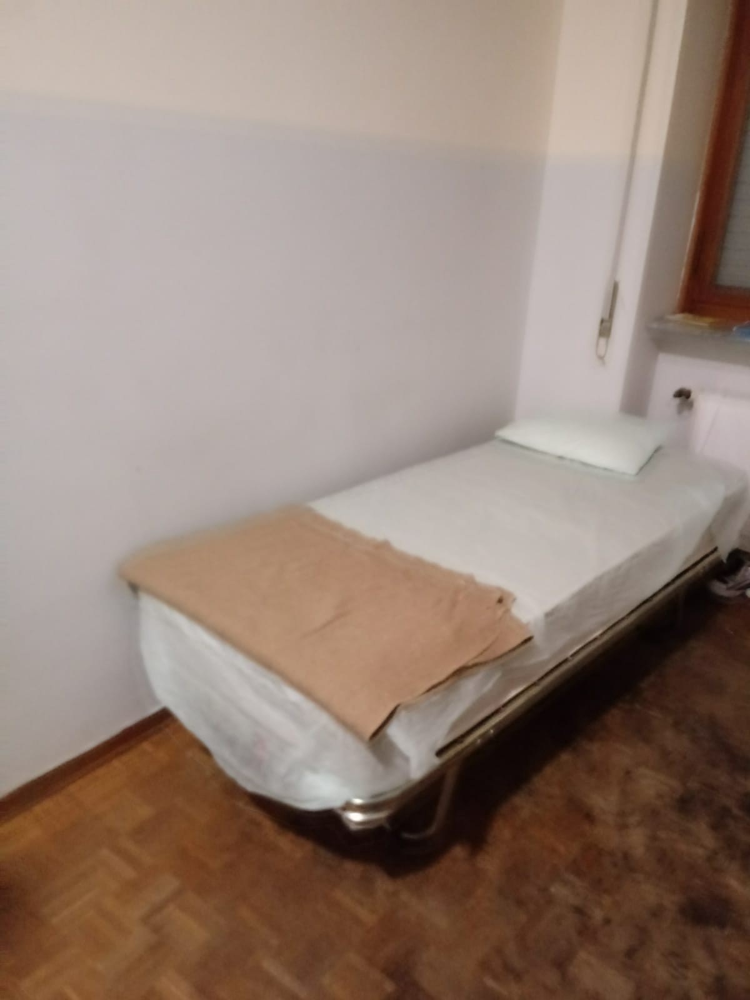
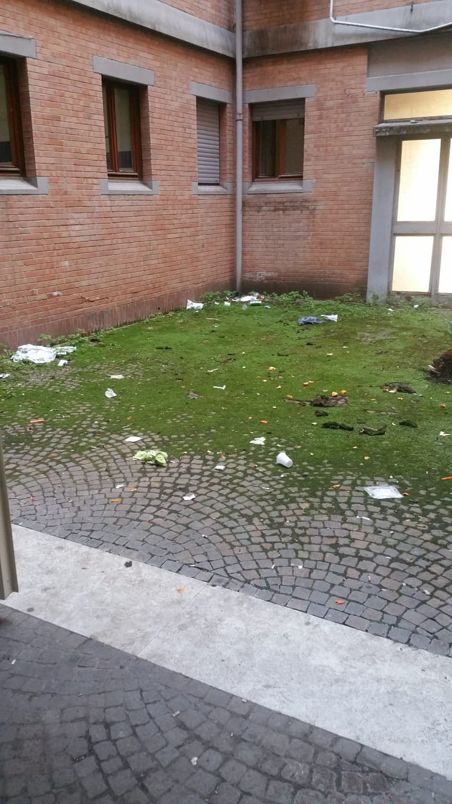

### AYS Daily Digest 01/02/2019: Young migrant kills himself after being denied humanitarian protection in Italy
#### Salvini Decree kills dreams and people// Refugee beaten and arrested by Turkish police is sentenced to 7 months in prison// Sea Watch 3 held in Catania for “technical irregularities” and for representing a “threat to navigation”// New immigration centre to open in Samos// Information on how to travel free of charge in Athens// Report published on living conditions in reception centre in Rome// Terra Giusta project by MEDU to re\-start their activities for the new season in Calabria, Italy// Donations needed in Paris and Calais to face harsh weather conditions\. \.

“Omar, have you seen those photos of white people coming to \(African country undisclosed\)? They are always happy\. You see them smiling with the locals and the kids at their feet\. They’re hands are held and walked from door to door\. They feel welcome because we treat them as our guests in our home… …by God, do we not deserve the same treatment in Europe?” — X\. \(paraphrased from Arabic\) \. Credit: @omarzakieh/Refugees Info Bus
### FEATURE

Prince Jerry, 25 years old, originally from Nigeria, had a bachelors degree in chemistry and was planning to continue his studies in Italy\. He had been living at the reception centre of Multedo, Genova, for the past two and a half years\.

Always active and involved in volunteering activities, he received a denial to his asylum application in mid December\. At the same time, he realised that his status would not guarantee him humanitarian protection either, due to the new criteria introduced with the Salvini Decree\.

On Monday 28th January, [he threw himself under a train](https://www.tpi.it/2019/01/31/prince-jerry-suicidio-migrante-asilo/) in Tortona, Piemonte\. His only guilt was to hope and work hard for a better future\.

Today the final goodbye was given by the same community that followed him and worked with him for the past years\.

Prince Jerry is only the last young man who saw himself with no future after the inhumane Decree was promulgated at the end of last year\.

Pathè Sabaly, 22 years old, threw himself into the Canal Grande in Venice and refused any help, letting himself drown, out of desperation\. What is even worse, in this case, is the indifference that surrounded his death, with people belittling him and his extreme gesture\.

Amadou Jawo, 22 years old, hanged himself from the terrace of his shared apartment in Taranto, after being denied asylum and facing the threat of being sent back to Gambia\.

Maslah Mohamed, 19 years old, from Somalia, hanged himself in a park in Pomezia, Rome\. Alone, with no friends or family, and his hopes for the future destroyed by a dull asylum system that did not allow him to foster his dreams\.

Adama Kanoutè, from Mali, living in Milan for 2 years, hanged himself in the Central Station of the busy city, so that people could finally notice him after years of indifference\.

Unfortunately, the list is too long to name every victim of this and previous inhumane policies, but we will do our best to keep their memory alive\.

### TURKEY

Esmaeil Fattahi, who was beaten and arrested by police at his home in Denizli in June of 2018, was sentenced on January 29, 2019 to a 7 month 15 day jail term\. The sentence given to the refugee was delayed\.

Interviewed by [this news outlet](https://www.evrensel.net/haber/372603/multeci-hem-darbedildi-hem-hapis-cezasi-aldi) , Fattahi said, “They handcuffed me\. How can I resist the police while handcuffed? How can I attack so many policemen? How can I resist? I did not offend\. I only said ‘I will seek answers for this injustice committed against me\.’ They gave me this sentence so that I remain silent\. They punished me to ensure my silence, and then they delayed the punishment\. I am not at fault\. I was sentenced out of no fault of my own\. They sentenced me to hide their own faults\.”
### MOROCCO

According to [Association Marocaine des Droits Humains](https://www.facebook.com/AmdhNador/photos/a.1693125780899690/2265609420317987/?type=3&theater) , “ _behind the decision of the Spanish authorities to remove the barriers of Melilla, there is a genuine willingness of these authorities to annex and occupy more Moroccan land_ ”\. In fact, according to the same source, 80 more hectares of Moroccan land will be annexed to Spain, after this last one, together with the EU, paid € 140 million to be able to gain more territory\.

Note that the decision was announced as one of the [Government’s priorities](https://www.france24.com/en/20180614-spain-wants-remove-barbed-wire-border-fences-ceuta-melilla) during the past summer by Interior Minister Fernando Grande\-Marlaska\.
### SEA

Solidarity from the Aegean to the NGOs operating in the Central and Western Mediterranean…

…after the news arrived this morning that Sea Watch 3, which disembarked 47 passengers in Catania yesterday, is being held in the port for “technical irregularities” and for representing a “threat to navigation”, according to the ICG\. This news arrived few days after the statement by the UN that “named criminalisation of sea rescue as the reason for a record death rate\.”

One of the reasons adopted by the authorities to stop the vessel is its registration as a yatch and not as a commercial ship; a reasoning that was used few months back to hold the boat and that was demonstrated to have no effect on the ship’s qualification as a rescue vessel\.

■■■■■■■■■■■■■■ 
> **[Sea-Watch International](https://twitter.com/seawatch_intl) @ Twitter Says:** 

> > . @[DaniloToninelli](https://twitter.com/DaniloToninelli), we admit: #SeaWatch 3 is STILL registered as a #yacht as it is still no commercial ship. Everyone knows that &amp; our flag state has made it clear, half a year ago, that this doesn't affect our ship's qualification as a rescue vessel. Come up with something new! https://t.co/NfPpPoEqVG 

> **Tweeted at [2019-02-01 13:38:51](https://twitter.com/seawatch_intl/status/1091330035955519491).** 

■■■■■■■■■■■■■■ 

> Sea\-Watch points to this as a clear and deliberate political move, designed to prevent us from conducting rescues\. “While the United Nations stress the importance of civil sea rescue missions, Italy, under the protection of other European governments, turns the Mediterranean into a deadly human rights\-free zone by hindering the last current active rescue vessel from its urgently needed rescue mission” says Johannes Bayer, Chairman of Sea\-Watch\. “With the delay of our ship in harbour, the responsibility for further death at sea is taken, deliberately and with impunity\. To hinder rescue workers is a criminal act itself”\. 

Read full press release [here](https://sea-watch.org/en/italy-blocks-sea-watch-3-in-catania-port/?fbclid=IwAR33vZ-41aq_ZH_rCKPhtPDgShEiTGg-8hIpAZ5HnMEhg3nz8UpUBDQunDE) \.

■■■■■■■■■■■■■■ 
> **[MSF Sea](https://twitter.com/MSF_Sea) @ Twitter Says:** 

> > Criminalizing the lifesaving work of NGOs does not prevent people from attempting to cross the #Mediterranean to seek safety. It does however lead to a greater loss of life and discourages all ships from rescuing those in distress at sea. Blocking #SeaWatch achieves nothing. 

> **Tweeted at [2019-02-01 16:27:41](https://twitter.com/msf_sea/status/1091372525756579841).** 

■■■■■■■■■■■■■■ 

For more updates, please follow [Sea Watch’s pages](https://www.facebook.com/seawatchprojekt/posts/2195743143977088?hc_location=ufi) \.
### GREECE

_Arrivals_

[50 people arrived](https://www.facebook.com/AegeanBoatReport/posts/518063762050066?hc_location=ufi) on Lesvos during the evening\.

_LESVOS_

A reminder of the horrible conditions for children in Moria\.

■■■■■■■■■■■■■■ 
> **[MSF Sea](https://twitter.com/MSF_Sea) @ Twitter Says:** 

> > Every day on our clinic in #Lesvos, #Moria we treat children for diseases that under normal circumstances are easily preventable. These children deserve much better than that. #letthemout https://t.co/EsM8yldaSE 

> **Tweeted at [2019-02-01 13:46:52](https://twitter.com/msf_sea/status/1091332056481701888).** 

■■■■■■■■■■■■■■ 

■■■■■■■■■■■■■■ 
> **[International Rescue Committee - UK](https://twitter.com/RESCUE_UK) @ Twitter Says:** 

> > At Moria, Lesvos, people living in tents are facing their eighth consecutive day of rain.
The Greek reception system is failing to protect vulnerable people seeking asylum. 
As people cannot stay dry &amp; conditions remain poor, the effect on mental health is extensive.
#RefugeesGr https://t.co/PRxhWYsFRp 

> **Tweeted at [2019-01-31 23:10:01](https://twitter.com/irceurope/status/1091111389228339200).** 

■■■■■■■■■■■■■■ 

_SAMOS_

A new immigration and reception centre is to be opened by the end of April, according to Minister of Immigration Policy, Dimitris Vitsas\.

> At the same time, he said, in the next few days, a second rapid response unit will be sent to speed up asylum procedures, while in a week, 250 minors will be transported from Samos to the hinterland\. \[…\] 

> “In the last eight months there has been a large number of refugees in the reception center of Samos\. It has a capacity limit of 800 people and 4,500 accommodated at the moment\. \[…\] Decongestion has to be done without further delays” \[…\] \. 

Original source [here](http://www.ana.gr/home/article/330527/Mechri-teli-Apriliou-tha-einai-etoimo-to-neo-Kentro-Ypodochis-sti-Samo-) \.

_ATHENS_

[Donations](https://www.facebook.com/KhoraAthens/posts/1081495478689726) needed for new kitchen space in Khora\!

[Information](https://www.refugee.info/greece/transportation--greece/free-transportation-in-athens-with-an-unemployment-card?fbclid=IwAR0WrW9isXKiW1XtpdJbLzNnNU4-_69sXo0n4_SeBS1KbeVBiLw-8j6iMrk&language=en) on how to travel around Athens for free, in case you own an unemployment card\.
### WEATHER REPORT for SATURDAY 02/02

_MONTENEGRO_

Changeably to entirely cloudy in the morning, in the southwest and west rain during the most part of the day\. Wind amplified and strong, with possible storm chances, blowing from the south\. Lowest temperatures from 3 to 14 and highest daily from 8 to 18 degrees\.

_SERBIA_

In most parts of the country moderately cloudy and dry, windy and warmer with snow melting below 1500m altitude\. In the southwest predominantly cloudy locally with rain\. Wind moderate to strong, with possible local storms, blowing from the southeast\. Lowest temperatures from \-1 to 10 and highest daily from 12 to 17 degrees\.

_BiH_

Cloudy with rain during the whole day in Herzegovina and western and southwestern Bosnia\. During the night the rain will spread to the other parts of the country too\. Wind will be strong blowing from the south and stormy guts are predicted\. The lowest temperatures from 5 to 11 and highest daily from 9 to 15 degrees\.

_CROATIA_

Moderately to predominantly cloudy with rain mostly in the coastal areas\. Wind weak to moderate from the southeast and south, towards the end of the day with strong gusts and chances of storm in the internal areas\. Alongside the coast wind will be moderate to strong, at places stormy, blowing from the south\. Highest temperatures from 5 to 10 and highest daily from 11 to 16 degrees\.
### ITALY

LasciateCIEntrare has published a new report about their recent visit to the CAS \(centre for extra\-ordinary reception\) of Enea in Rome, to monitor living conditions of asylum seekers hosted in the structure\.

In July 2018, the Red Cross took over the management of the centre, after 8 years of corruption and mafia collusion of the cooperative Tre Fontane, the previous responsible body\. The Red Cross should manage the centre for the next two years, depending on possible new directives by the actual Interior Minister, who would probably allow NGOs and cooperatives to renew their management contract on a monthly basis\.

The services offered to the migrants are, therefore, precarious and temporary, as are the possibilities to monitor the living conditions\. This is made harder and harder by policies and hostilities, and by the absence of members of Parliament who are willing to access such centres to denounce ill practices\.

Moreover, chaos seems to reign over the re\-distribution of migrants in the territory, dividing friends and families and randomly allocating them to different areas of the country, condemning small centres to close and Italian operators to lose their jobs and human contacts\.

In this CAS, 316 new people have arrived from other regions, according to these new policies\. 360 is the maximum capacity\.

Rubbish containers have been emptied out the same morning, following the announcement of the visit, after months\.

People from Armenia, Russia, Pakistan, Tunisia, Morocco, Peru, Senegal, Mali, Gambia, Nigeria and Syria are hosted in the same space, together with other people who have been “dublined”\. The operators are 50, 8 mediators, but with no one speaking Urdu at the moment, according to migrants at the centre\.

Doctors are present and report 15 vulnerable cases, whose conditions are getting worse by living in such crowded environment\.

The electricity and heating systems are not working properly and hot water is available for only 2 hours per day\.

Some rooms come with a bathroom and others don’t; in one floor, 20 people have to share 1 bathroom\!

Credit: LasciateCIEntrare

Families with minors are also present in the structure and their privacy and security is not protected at all, given that doors don’t close and are without keys\.

Some people hosted in the structure claim that they have not received their allowance for three months and do not possess a sim card at all, impeding their ability to communicate with their families\.

Only a small amount of clothes have been distributed and blankets are not helping to keep residents warm\.

Desperation and self harm are common for migrants at the centre, mainly due to bureaucratic reasons and the barriers to renewing their residence \(because of the move from one region to another\) \.

Italian classes are underfunded and the centre is situated in a very isolated location, right at the exit of a very trafficked highway\.

Read original report [here](https://www.lasciatecientrare.it/lasciatecientrare-in-visita-al-cas-enea-online-il-report-di-monitoraggio/?fbclid=IwAR3R4ncTEbHqOnxcdwVjZxET6y5A2kUZelO4KpXjrxSkSn7AYVSIYTteE9A) \.

The project [“Terra Giusta”](https://www.facebook.com/MEDUonlus/photos/a.10151424368349817/10156962571069817/?type=3&theater) by Medici per i Diritti Umani is now ready to start again in the area surrounding Piana di Gioia Tauro \(Calabria\), in order to offer medical and legal assistance to those seasonal migrant workers forced to live in horrible conditions\.

Between 2016 and 2018, 1,388 migrants mainly coming from the Sub\-Saharan region, were assisted; a total of 1,926 first, and second checks were guaranteed\.

In the same area, the most urgent actions to take are the ones to guarantee a house to the workers living in tents\. Today a meeting was held, between the local authorities and local NGOs, to underline the necessity of coordinating action to solve the issue of the lack of housing solutions\.

Let’s see if all these will remain empty words or if concrete actions will be taken\. Meanwhile, [Comitato Lavoratori delle Campagne](https://www.facebook.com/comitatolavoratoridellecampagne/posts/2315691051830340?hc_location=ufi) announces that police forces are keeping a regular track of those present in a makeshift camp, collecting names and openly lying to people\. They report that police are telling migrants in the camp that all the people owning any sort of protection can be accommodated in second level reception centres \(which is not true at all since the entering into force of the new Decree on Migration and Security\) \.

In a new [report](https://www.oxfamitalia.org/wp-content/uploads/2019/01/SCACCO_AI_DIRITTI_UMANI_IN_4_MOSSE_DEF..pdf) published by Oxfam and Borderline Sicilia Onlus, the two NGOs clearly explain why, after two years, the EU\-Libya deal keeps causing deaths and human rights violations, with 5,300 deaths in two years \(4,000 in the Central Med\) and 143 deaths on 500 arrivals just in the first month of 2019\. The NGOs also state that 15,000 people were brought back to the Libyan hell last year as a consequence of the agreement\.

Italy and the EU are violating international human rights law in 4 steps:
1. Considering the Libyan Coast Guard a legitimate actor in the picture, while considering the country itself not a safe third country;
2. News introduced by the new Frontex operation, Themis, where vessels are indicated to disembark migrants in the closest port and not in an Italian port anymore\. Moreover, European and Italian vessels are monitoring an area up until 24 nautical miles from the Italian coast and not up to 30, as it used to be within the Triton operation;
3. The policy of the “closed ports” and the forced re\-distribution of migrants;
4. Criminalisation of solidarity and of the NGOs operating in the Mediterranean\.

### FRANCE

_PARIS_

Collection of goods for unaccompanied minors on Saturday 9th February\.

After the evacuation\. \.

_CALAIS_

[Donations](https://www.facebook.com/care4calais/posts/2297658086933802?hc_location=ufi) of tents, thermals, waterproof boots are desperately needed to cope with the weather conditions and the heavy snow in Northern France\.

[Volunteers](https://www.facebook.com/BelgiumGent4Humanity/photos/a.1625929201058233/2212993425685138/?type=3&theater) are needed\!
### BELGIUM

This Saturday, 2nd February, there will be a NATIONAL MANIFESTATION FOR A HUMANE ASYLUM POLICY in Ghent\. People are organising to reach the location from different cities\. The train \(direction Oostende\) from Antwerpen Berchem will depart at 12:12pm and from Antwerpen Centraal at 12:06pm\.

**We also publish weekly summaries of some of the most important news reported during the past week in our Daily News Digest: here are the [Arabic](%D8%AA%D9%85%D9%88%D9%8A%D9%84-%D8%A7%D9%84%D8%A7%D8%AA%D8%AD%D8%A7%D8%AF-%D8%A7%D9%84%D8%A3%D9%88%D8%B1%D9%88%D8%A8%D9%8A-%D9%8A%D9%85%D9%86%D8%B9-%D8%A5%D9%86%D9%82%D8%A7%D8%B0-%D8%A7%D9%84%D8%A3%D8%B1%D9%88%D8%A7%D8%AD-%D9%81%D9%8A-%D8%A7%D9%84%D8%A8%D8%AD%D8%B1-%D8%A8%D9%8A%D9%86%D9%85%D8%A7-%D9%8A%D8%AF%D8%B9%D9%85-%D8%A7%D9%84%D9%85%D8%AE%D9%8A%D9%85%D8%A7%D8%AA-%D8%A7%D9%84%D9%84%D8%A7%D8%A5%D9%86%D8%B3%D8%A7%D9%86%D9%8A%D8%A9-%D9%81%D9%8A-%D8%AF%D9%88%D9%84-%D8%A7%D9%84%D8%A8%D9%84%D9%82%D8%A7%D9%86-a7dc22e7bf7f) and [Persian](%D8%A7%D8%B1%D9%88%D9%BE%D8%A7-%D8%A7%D8%B2-%D9%BE%D8%B1%D8%AF%D8%A7%D8%AE%D8%AA-%D9%87%D8%B2%DB%8C%D9%86%D9%87-%D8%A8%D8%B1%D8%A7%DB%8C-%D9%86%D8%AC%D8%A7%D8%AA-%D9%85%D8%B1%D8%AF%D9%85-%D8%AF%D8%B1-%D8%AF%D8%B1%DB%8C%D8%A7-%D8%AC%D9%84%D9%88%DA%AF%DB%8C%D8%B1%DB%8C-%D9%85%DB%8C-%DA%A9%D9%86%D8%AF-%D8%AF%D8%B1-%D8%AD%D8%A7%D9%84%DB%8C-%DA%A9%D9%87-%D8%A8%D8%B1%D8%A7%DB%8C-%DA%A9%D9%85%D9%BE-%D9%87%D8%A7%DB%8C-%D9%86%D8%A7%D9%85%D9%86%D8%A7%D8%B3%D8%A8-%D8%AF%D8%B1-586506d64ef8) editions for the week of January 21–28\.**

**We strive to echo correct news from the ground through collaboration and fairness\.**

**Every effort has been made to credit organizations and individuals with regard to the supply of information, video, and photo material \(in cases where the source wanted to be accredited\) \. Please notify us regarding corrections\.**

**If there’s anything you want to share or comment, contact us through Facebook or write to: areyousyrious@gmail\.com**

_Converted [Medium Post](https://medium.com/are-you-syrious/ays-daily-digest-01-02-2019-young-migrant-kills-himself-after-being-denied-humanitarian-d005068518e1) by [ZMediumToMarkdown](https://github.com/ZhgChgLi/ZMediumToMarkdown)._
