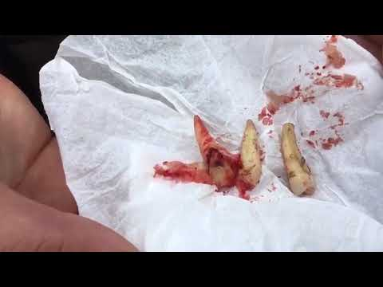
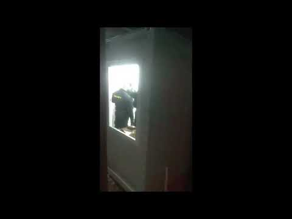
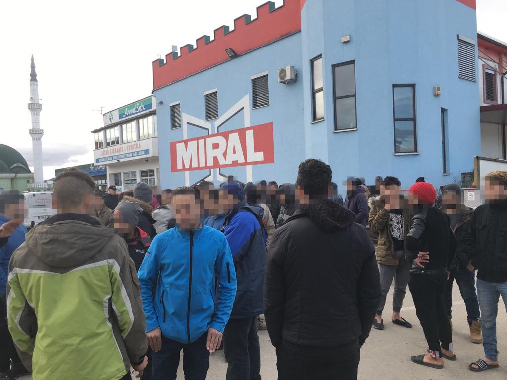
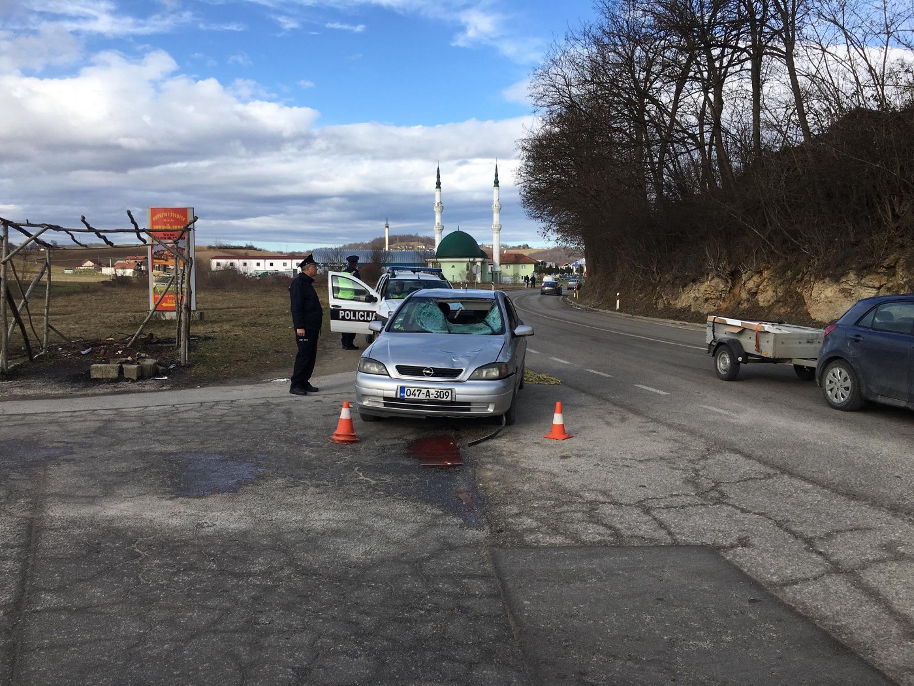

### AYS SPECIAL FROM BOSNIA: Nobody Calls an Ambulance for Dying Man Hit by Car Outside Camp Miral in Bosnia
#### Who is Responsible for his death?

Outside the camp, two of the deceased's friends who witnessed the accident and stayed with the man in the final hours of his life, grieve for the loss of their friend\.

> **We said please please call an ambulance, our friend has been hit by a car, please we need an ambulance\. He stayed like this on the ground for an hour, nobody helped him\. He was dying on the street in front of them and they did not call an ambulance\. This is racism, this is not human\.** 

> **Finally a police car came after an hour and they put Hamid inside it, like an animal, they told us no ambulance will come\. He was still alive, I held him in my arms, he could not talk but I could feel him breathing\. When we arrived in hospital they didn’t let me go inside with him and ten minutes later the police came and told me that he is dead\.** 

> **I was in shock\. What do you mean he is dead? I was completely in shock, moments ago he was alive, we thought thank god we made it to the hospital now everything will be OK, but they tell me he is dead\. We never spoke to a doctor and they didn’t let us see his body\.** 

> **I have been on this route for a long time, what we go through to reach Europe is dangerous, this is not the first friend I have seen die, but before did I see nobody call an ambulance for someone who they can see needs help\. If a dog was hit by a car and dying on this street, they would have done more for that dog than they did for Hamid\. We are human beings, just like them, we have hopes and dreams\. Hamid did not deserve to die like this, alone on the street with nobody to help him\.** 

\(Youssef, 25\)

**_Sunday, 3rd February, 2019\. Velika Kladuša, Bosnia and Herzegovina_**
#### 5\.00 AM,

Abdelhamid \(Hamid\), 34 from Algeria, is hit by a car while walking to a market across the road from the camp with two of his friends\. He suffered serious injuries to his head and is barely breathing\. The driver, a 28 year old Bosnian man escapes from the scene\. \[According to the media reports, he immediately surrenders himself to the police and was detained\] One of Hamid’s friends stays with him while the other runs back to the camp to call for help\.
#### **5\.00 AM — 6 AM**

The friend runs towards the camp which is patrolled by security guards from the private security agency who have been employed by IOM and remain inside the camp 24 hours a day\. \[According to a previously released [statement by the head of IOM BiH](https://bih.iom.int/pbn/iom-responds-security-incident-humanitarian-hub-%E2%80%9Cmiral%E2%80%9D-velika-kladusa-seen-video-footage?fbclid=IwAR2QSevqJT6C74BnBnQx_5IHqmvBkeuU4_3vssb4ubuX6O4VpT1Xr4oCKOs) , security guards are trained by the United Nations\. \] A friend of Hamid begs the guards to call an ambulance\. They refuse\. _‘Go_ ’ they tell him\. ‘ _Leave from here’_ \. The young man pleads with security, but they do not listen\. He then runs to the petrol station next to the camp and begs the lady who is working there to call the police, which she does\.

In the meantime, the other friend who remains with Hamid, attempts to stop traffic and ask people passing in vehicles to call an ambulance\.

> **I turned him onto his back and held him in my arms, I told Yasin, ‘Please go call help call somebody,’ but nobody helped him, nobody called an ambulance\. I then stood in the middle of the street and stopped the cars, I begged them to call an ambulance\. At least four or five cars drove past\.** 

During this commotion, an IOM employee remains inside the camp, but does not come outside to assist, despite security personnel, who are employed by IOM and are thus part of their team having been alerted about the incident\.
#### **6\.00 AM — 7\.00 AM**

At least 6 of his friends are now at the scene with Hamid\. Police arrive at the scene\. The young men beg them also to call an ambulance but the police do not\. They inspect the area and put Hamid into their police van\. Hamid was still breathing heavily at this time\.

> _“Why no ambulance, why don’t you call an ambulance we asked them,”_ explains a witness of the accident\. 

When Police arrived to the camp, numerous witnesses claim that the IOM worker on duty left the scene, a witness explains\.

> **_I saw the IOM employee go into the cafe next to the camp and then we couldn’t find him again\. Our friends in the camp told us that he left\. He never came to where the accident happened, he never spoke with us, he didn’t do anything to help us\._** 

The police take the men along with Hamid in a police car to the EMS facility in Velika Kladuša\. The six friends report that Hamid was still alive when they put him inside the van\. Hamid is taken into emergency, while his friends are forced to wait outside, unable to stay with him\. Ten minutes later, the police return and inform the men that Hamid has died\. ‘Kaput’ the police officer tells them\.

> **They didn’t let us go inside or see his body at the hospital and after 10 minutes a police man came outside and told us he is finished\. Kaput\. ‘What do you mean he is finished,’ I tell him, ‘let us see him, let us speak to a doctor’\. They did not let us\. They say ‘kaput’ and then told us ‘go, go camp go finish here, go, go’\. Like animals\. They didn’t care at all that our friend had died\. We never spoke to the doctor\.** 

No medical professionals helped the 5 witnesses who came to hospital with Hamid, they report, despite the fact they were all under shock\.
#### **7\.00 AM — 10\.00 AM**

The man’s friends are taken back to the camp by police, and news spreads to residents of Hamid’s death\. Police block off the road, and prevent people from going to the scene\.

No IOM staff members are present at the camp during this time\-frame\. Security guards remain at the entrance of the camp\. Two security guards that arrived at the scene are also distressed by the news\.

> **‘These security guards are good _,’ residents tell\. They refer to the older one as Papu\. ‘_ Papu is a good man\. These security guards are our friends\. Not all the security are bad\. IOM is the problem\.’** 

Recently a video emerged of a team of security guards physically assaulting migrant within the facility\.

Around 10 policeman patrol the area and attempt to maintain calm\. They insist that residents return inside the camp, but they refuse\. They explain that they do not wish to intervene, but their presence at the entrance of the camp is a breach of the peace, a criminal offence\. \[According to the law in Bosnia, this is not true\. \]

More and more people wake up and hear the news of Hamid’s death, they are shown his photo on Facebook\. Many people are in shock, many people cry when they understand who it was that died\. Some people explain that Hamid was an extremely kind person, very well liked by everyone in the camp\.

Over one hundred people move outside the entrance of the camp, distressed by the death of Hamid, but calm\. No incidents occur\.

Out the front of the camp, over one hundred people are devastated by the news of the accident and the death of Hamid\.

> **Even the security guards loved Hamid, just ask the security what they think about Hamid and you will see what they will say, he was nice with everyone** 

Police on the incident confirm that the Bosnian man who was driving the vehicle that hit Hamid has been caught and remains in the police station\.
#### **10\.00 AM — 12:00 PM**

The IOM Coordinator Razan Drocic finally arrives to the scene, and shortly after arrives the Head of Security of IOM\. They attempt to calm down the situation, with little success\. The head of security attempts to speak to witnesses and friends\.

The friends of Hamid explain that they would like to see his body, which has now been moved to Bihać, a town approximately one hour away\. He explains he will take them to Bihać to see it, but then follows up this promise with an explanation that this will not be possible\.

Red Cross arrives to deliver food however the people at the front of the camp sit in front of the entrance blocking their entry\. The IOM camp manager insists that people move, explaining that there are women and children inside who should not be denied food because of them, speaking rudely to the residents blocking the entry\. The people eventually create space for the food van to enter the camp\. \[In this camp, among over 600 men, there are couple of women and children\. \]

> **We do not eat this food, are we animals to be eating sardines every day? They think our problem is that we need to eat, they don’t even care that a man has died and this is why we are out here\.** 

Police permit access to the site of the accident\. The friends of Hamid go to the scene of the accident and pick up Hamid’s teeth from the ground\. They wrap 5 teeth in tissue paper\. A friend of Hamid explains

> **‘Why did the police not take the teeth, why did they leave them here, they took his telephone but not his teeth\.’** 

Police inform residents that they are allowed to stay outside of the entrance of the camp but that they should not travel in big groups to the center of town, instead in groups of two or three\. They inform people they do not wish to intervene, but that remaining in big groups amounts to disturbing of peace, which forces police intervention

The previous day police cars patrolled the center of town in Velika Kladuša, insisting everyone returns to the camp\. Police also patrolled the road leading into the town of Velika Kladuša and denied people to pass\. ‘Go Camp’ they said ‘No Kladuša\.’ \[This is against the law in Bosnia, as the residents of the camp, or as potential asylum seekers, have freedom of movement\. \] One man reports that local police broke his phone\.
#### **12\.00 PM — 2:00 PM**

As rain begins many people return inside the Miral facility\. [A local journalist arrives to report on the scene\.](https://l.facebook.com/l.php?u=http%3A%2F%2Fwww.federalna.ba%2Fbhs%2Fvijest%2F264429%2Fvideo-vozac-uhicen%3Ffbclid%3DIwAR3ftxO0Sf7CQV3k5Pk_bUHxhi3sOnfVMwntjjQ7qwM3dDFz6PlJcZPW5fI&h=AT3O26xoq0x_nLn0wgSVBUdYgEFRnGnHputAEd6zCjNT-u-Sn4UOiBht_NCqMn43OTuwnqOnrOjwQ0fOwb5yw2x9lQWiEfHx-ZvOAoAU9N_vopN_VWqlgqbjtrNdOk6Furs) Many people return inside the camp to seek shelter from the rain and most police personnel leave the scene\. IOM employees, as well as head of security, remain inside the camp, conducting interviews with people\.

The men who witnessed the incident and accompanied Hamid to the hospital are left with the unimaginable task of informing his family of his death\. They are in complete shock\. No health care professionals or psychologists are called by IOM to provide any support to the young men aged between 22 and 25\.

> **I still can’t believe it\. His mother and brother keep calling me but I don’t know what to say\. His mother, what am I meant to tell her? That Hamid is dead? I cannot do that\. I just tell them I don’t know what happened, I don’t know anything, I have not heard\. Maybe she has a problem with her heart, I can’t be the one to tell her\.** 

The night of the accident, two men are forced to sleep out the front of the camp by IOM staff, who instruct security not to let one of them inside\. They have slept for four nights at the camps entrance\. When they attempted to put up a tent to shelter from the rain, they were told they must take it down\. One of the men reports that moments before Hamid died, he came outside to ask them if they need anything ‘he was helping us, I am so sad that he died’ explains one of the men\.

Late in November last year, the International Organisation for Migration \( [IOM — UN Migration](https://medium.com/u/664cb26312d4) \) took over the former factory Miral and turned it into temporary accommodation center \(financed by the [European Commission](https://medium.com/u/960f4c0ad987) \) \. The IOM called it a “humanitarian hub”, seemingly proud of their efforts to provide shelter and increased ‘safety and security for the hundreds of people who until then were sleeping in an open field camp in the center of Velika Kladuša\. The field camp was assisted by locals and small independent volunteer organisations that acted efficiently during the time when hundred of people began arriving daily to the border towns of Bosnia\.

Camp Miral is located 5 kilometers away from the center of the town, in the village Polje\. Residents of the camp travel on a daily basis to access needed assistance and basic services in the center of Velika Kladuša\. The road between Miral and the center of Velika Kladuša is windy, at times without a footpath for pedestrians to safely walk along\. It is barely lit and in the night the road is dark and vehicles drive down it at high speeds\. Some residents of Miral have asked the small organisations present in town to provide services earlier as they are scared to walk from Velika Kladuša to camp Miral after sunset\.

We have received numerous reports from residents inside Miral of unbearable living conditions inside the camp, outlining of bad sanitary conditions within the center, as well as lack of basic services such as hygiene and washing facilities for clothes, which leads to the spread of skin diseases which are prevalent within the camp\. They also report of ques for food which lacks nutrition, as well as a lack of privacy, psychological support or adequate medical care\. The Danish Red Cross \(DRC\) recently replaced Doctors Without Borders \(MSF\) in Miral, they are present to provide medical assistance from Monday to Friday, between the hours of 11 AM — 3 PM\.

Miral center is guarded by local private security company, that has been employed by IOM to work 24 hours per day\. A recent video reveals four security guards assaulting one resident within the facility\. [IOM responded to the incident,](https://bih.iom.int/pbn/iom-responds-security-incident-humanitarian-hub-%E2%80%9Cmiral%E2%80%9D-velika-kladusa-seen-video-footage) saying that the guards are trained by the United Nations and that they would launch an investigation into the incident, as well as immediately employ more refugee Protection Officers to be present within the facility\. It is unconfirmed whether this happened\. The police and the prosecutions were informed, and they — apparently — started an investigation, too\.

The lack or response to the car accident by Security personnel who were alerted of what had happened, as well as the IOM staff member who was present inside the Miral facility during the time of the incident which occurred 200 meters from the entrance to the camp, is a violation of Bosnian law\. The Health Care Law of BiH says _“each person is obliged to help in situation of urgent medical need…”_ Furthermore, IOM is a humanitarian organization which thus far has received over 10 million euros of funding from the EU commission and other donors to help and care for refugees and migrants in Bosnia and Herzegovina\. In addition to this, a few days ago, Qatar Charity signed an agreement with IOM to provide a further USD 364,050 in support of the response to the refugee and migrant situation in the country\. IOM’s Mission statement for Bosnia and Herzegovina includes to ‘ _Uphold the human dignity and well\-being of migrants\.’_ Responding in a medical emergency and having a system in place to handle situations where a person is in need of urgent medical assistance is their basic duty\. Having no IOM personnel present from 6 AM — 10 AM is negligence of their responsibility towards the people under their care\.

When asked about the incident, IOM coordinator, Drazan Rozic responded

> **The Miral security guards were informed by the two friends about the accident\. IOM understands that the security guards called the police\. The ambulance was not available as it was assisting another person** — Drazan Rozic 

However, in the center of Velika Kladuša \(5 km from Miral Facility\) there is a medical clinic with a modern Emergency Medical Service \(EMS\) \. It is equipped with 5 ambulances and team of professionals, as well as a head nurse who is the coordinator of the Migrant response unit\. She explains in an interview that Velika Kladuša is a small town that does not have the facilities to care for the hundred of migrants stranded in the town, and that they are overwhelmed and nothing works as it should\. When asked what would have happened if it was a Bosnian man who was hit by a car and not a migrant, she explains that his neighbor would have picked him up and taken him immediately to hospital\.

When police arrived to the scene one hour after the accident, their obligation was to immediately call an ambulance to assist\. It is unclear why they insisted to move the injured man into the back of a police van without the presence of a paramedic, or why they did not immediately call an ambulance\.

Witnesses who accompanied Hamid to the hospital in the police van report that Hamid was still alive when they arrived to the EMS station, breathing heavily\.

**IOM are yet to publicly respond to the death of Hamid\.**

Hamid is the third Algerian man who has died in Bosnia and Herzegovina in the last 10 days\. Like most Algerians who spend years attempting to reach Europe, risking their lives, Hamid was classified as an ‘economic migrant’ — unworthy of the Europe’s help or protection\. Such categorization is harmful, unjust and propagated by politicians and by the media across Europe\.

Thousands of young Algerian men like Hamid, many of them unaccompanied minors, flee from the country every year, seeking the possibility to live a dignified life, which is denied to them in Algeria\. Algerians have suffered from colonial rule by France up until 1962, furthermore they later endured a civil war that claimed the lives of approximately 100,000 people between the years 1991–2002\. Today the government is highly corrupt and largely controlled by mafia, who frequently change laws to suit their interests\.

Human Rights Watch reports that freedom of assembly and freedom of speech are withheld from the public, and these ‘crimes’ are punished by prison sentences\. Thus the public is powerless against changes in the law, which often negatively impact them\. Furthermore, despite the rich resources of petroleum, crude oil and gas, salaries remain extremely low, somewhere between 150–250 euros per month — an impossible amount to support the needs of a family\.

> **I have a dream I have a goal, and I want to fix it\. I don’t have a father, it’s OK for me, I have a mother and two sisters\. I came here to work for them, because in my country I cannot support them\. In Algeria the government takes all the money and the people are left without anything\. If Algeria will change in the future, and if it was possible for me to care for my family from there, I will go back\. I didn’t come to Europe to eat and sleep, I came here to help my family —** _One of Hamid’s friends explains_ 

Hamid had a dream too, one that will unfortunately never be achieved\. Earlier in the year Hamid made an attempt to cross the Bosnian border to Europe and reached Slovenia, from where he was fined € 500 by the Slovenian Police and pushed back first to Croatia, and then to Bosnia\. Hamid leaves behind a wife and a five year old daughter who he hoped to support from Europe\. His immediate family, instead of grieving the loss of Hamid now face the enormous bureaucratic challenge of finding a way to bring his body home from Bosnia to Algeria\.

In Paris Hamid has a grandmother who he could not wait to see, she is an author who has published numerous books\. A close friend of Hamid who traveled with him from Greece to Bosnia explains

> **_One time in passing somewhere along our journey, Hamid told me, ‘you know what? When I arrive in Paris, I think I will tell my grandmother my whole story\. Maybe she will write a book about it\._** 

**\(All names of witnesses have been changed to protect anonymity of people on the move stranded in Bosnia\)**

**We strive to echo correct news from the ground through collaboration and fairness\.**

**Every effort has been made to credit organizations and individuals with regard to the supply of information, video, and photo material \(in cases where the source wanted to be accredited\) \. Please notify us regarding corrections\.**

**If there’s anything you want to share or comment, contact us through Facebook or write to: areyousyrious@gmail\.com**

_Converted [Medium Post](https://medium.com/are-you-syrious/ays-special-from-bosnia-nobody-calls-an-ambulance-for-dying-man-hit-by-car-outside-camp-miral-in-79ec01af415b) by [ZMediumToMarkdown](https://github.com/ZhgChgLi/ZMediumToMarkdown)._
