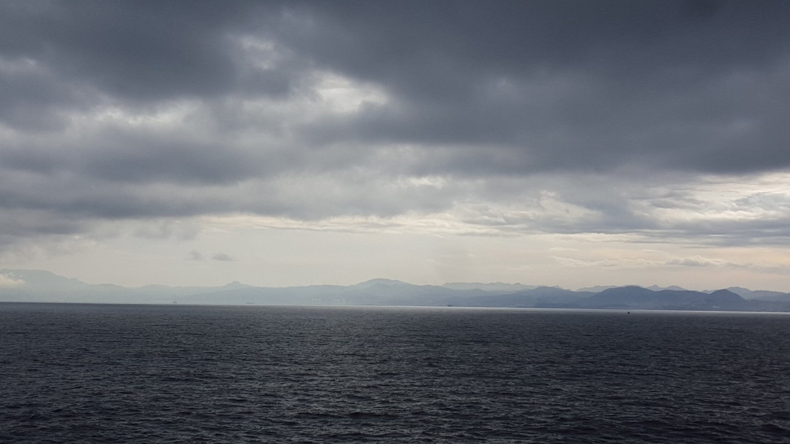
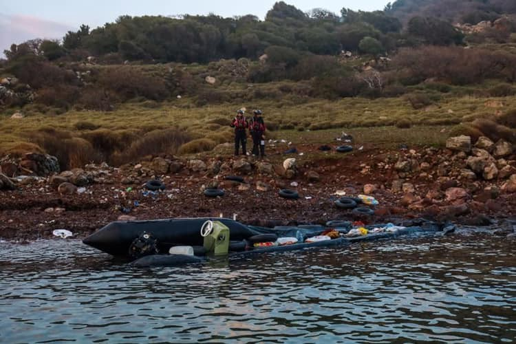
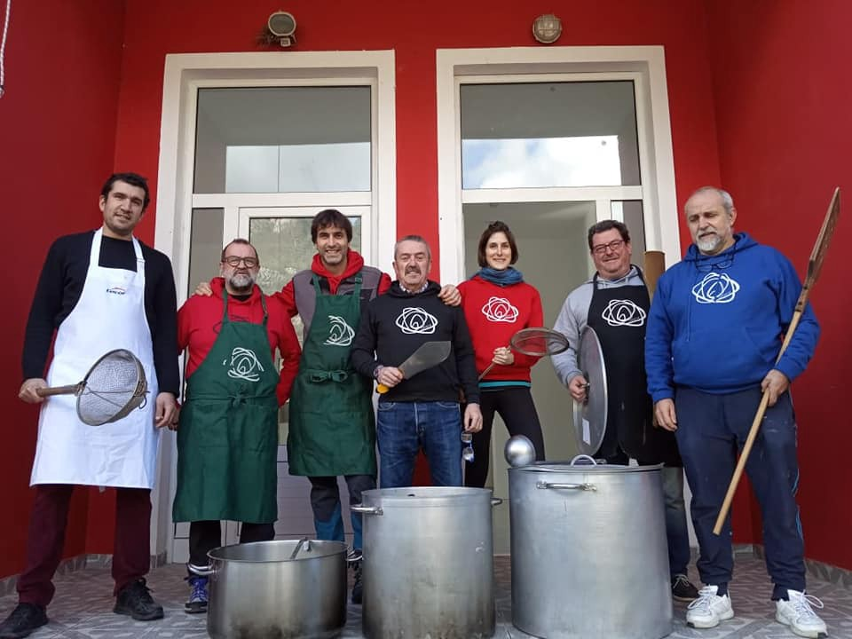

### AYS Daily News Digest 11/02/19: 150 people brought back to Libya

[Are You Syrious?](https://medium.com/@AreYouSyrious)

Feb 12

_150 people brought back to Libya — meanwhile, families resort to Facebook to collect donations and pay ransoms//Possible deportations from Austria to Afghanistan next week//Volunteers needed in Greece//_
### Sea

Photo by Alarm Phone

Alarm Phone says it was called by a boat coming from Libya with 150 people including 50–60 women and 30 children\. Their engine stopped working and no rescue was in sight\. The group has since then lost contact with the boat and as feared, they have been picked up by the Libyan Coastguard and taken back to Libya according to [Times of Malta](https://www.timesofmalta.com/articles/view/20190211/local/new-crisis-looms-as-150-people-drift-at-sea-in-the-central.701736) \.

A new [Time article](http://time.com/5510517/facebook-smuggling-libya-ransoms/?utm_source=emailshare&utm_medium=email&utm_campaign=email-share-article&utm_content=20190210) shows once again why bringing people back to Libya is not the solution\. The article shows how people are being tortured, sold between trafficking gangs and held for ransom, forcing their families back home to resort to Facebook to collect donations from friends and family\.

Alarm Phone also says that, with no rescue vessels operating in the Mediterranean, the current situation disproves the myth that rescue vessels are pushing people to try the route\.

Meanwhile, [Avvenire](https://www.avvenire.it/attualita/pagine/immigrazione-open-arms-e-i-sindaci-spagnoli-dal-papa-poi-il-patto?fbclid=IwAR1bdg2WUqK52waBVNHm952tzLQ-_7w5xpcg4Kaf9TcbrYBd3niteh6tixU) says the founder of Proactiva Open Arms has been received by the Pope, together with the mayors of Madrid and Barcelona, to discuss the situation at sea\. Representatives of Sea Watch, Proactiva Open Arms and Mediterranea also met with the mayors of Valencia, Zaragoza, Palermo, Milan, Bologna, Napoli, Siracuse and Latina\. Together they asked for support for NGOs involved in helping migrants in the Mediterranean and hope to challenge the current policy of blocking ports\.
### Greece
#### 87 people arrive on Lesvos and 15 on Chios

Photo by Refugee Rescue

Two boats landed on Lesvos in the early hours of this Monday, with a total of 87 people according to [Aegean Boat Report](https://www.facebook.com/AegeanBoatReport/?__tn__=%2CdkCH-R-R&eid=ARB8JYbW36ObaXSauKTHh7EPtwEXKVWfuM6Dbv14XHo5TLojHgcIUhEwtKi5-VzpuL3nEv5RMwsir6aF&hc_ref=ARRCLk08wxN0CQ81QoAkpQWjVhHFzg9E7I5Ux5h-_G-TtlEwMbcPas3AqUEmR7Kmauw&fref=nf) \. The first boat landed on northern Lesvos with 48 people\. Refugee Rescue describes it as a “close call” as the dinghy had started taking on water early in the journey and people were freezing by the time they arrived\. A second boat with 39 people also arrived on northern Lesvos a bit later\. 
The second boat landed in Kalo Limani, Lesvos north west 06\.20\.
39 people
20 children 
7 women

A total of 15 people arrived on Chios on Sunday night according to [Salvamento Marítimo Humanitario](https://www.facebook.com/smhumanitario/) \.
#### New project starts on Lesvos

The [Zaporeak Proiektua](https://www.facebook.com/zaporeakproiektua/?__tn__=K-R&eid=ARBoT_ybzUJrB3qpdvmjhuyh2KGtIxaJRf0GTARb3GWZNzY9ftJ7IFw_cTTQwgj_1WNoyCBufF_IZy8e&fref=mentions&__xts__%5B0%5D=68.ARCHEgmOxrDGT_lSzUFoSmjq-FfF3jBu8WpcUGuZVQByXZ1uz816AEnhdEqwKDdHejubXus1VcMpNPp3NCZt-TJb2QzZ4kKcjr8Ck4UziJwWJMFIa93hgOo0onf6rTFURUz6K0O3PapKJjqMIQkzrcD74bfhyyHy7GQlL9xmPBU6LduxYb-Y4N-V2cMWteadz59YbOcfNiYXkXh8Ki7jWW5UBiejqBA_n004nRCsSKI6-35FMQFhpUmHcJb0LIN70CYtIOncRqWgPqsc_cixalH8f3tsl-raG4VJwIGRfIshhC-H39LFHu__kFjUPTd1CEvvIQd2VkZLa0yllXgEmq-E3w) has started cooking for 1,200 people in Moria\. The group has been working in Greece, including in Chios and Athens, since 2016, distributing more than 700,000 food portions\. You can find out more on how to volunteer or donate directly on their [website](http://www.zaporeak.eus/) \.

Volunteer teachers and youth workers are needed on Chios for Action for Education, which provides the largest voluntary run education service on the island, as young people over 14 are denied public education there\. Volunteers are also needed on Samos were Action for Education set up a safe space for children and youth\. More information can be found [here](https://www.actionforeducation.co.uk/volunteer/?fbclid=IwAR1Gger8g4KdkCIvScEf5B59GiSq4qkBPob2sQJLlQkuqKLR3_MDA4M0tXI) \.
### Serbia
#### 320 people in downtown Belgrade

Info Park has counted 320 refugees in the parks and nearby streets of downtown Belgrade as part of its regular evening headcounts\. The group adds that Hungarian authorities recorded a total of 107 unsuccessful attempts of irregular entries into the country over the weekend, out of which 94 were intercepted within Hungarian territory\.

In Serbia, the lowest temperatures will hit 0 degrees\. The situation is worse in Bosnia and Croatia, where the lowest temperatures will hit \-4 degrees and in Montenegro, where the lowest temperatures will range from \-6 to 7\.
### Austria
#### Possible deportations to Afghanistan next week

Photo by European Citizens Against Deportation to Afghanistan

[Refugee Protest Camp Vienna](https://www.facebook.com/RefugeeCampVienna/) says around 19 of February, many Afghans will be deported from Austria, partly on chartered planes\. The group advises people who are possibly under a deportation threat not to go to a police station if you are informed to go there for “gelinderes Mittel”\. It also advises avoiding places were police controls are common, such as railway stations or underground stops\.

People at risk include those who are undocumented or had a second negative decision in their asylum case\. An [event](https://hdb.dibk.at/Termine/negativer-Bescheid-was-nun?fbclid=IwAR2MxudEyFguyrKUf-XgTj2dqU7vsnqdrW5OZv0zWJfs4pn5GQ8wjbKEeb0) will take place today in Innsbruck for volunteers, to discuss how they can help migrants after a negative decision\.
### We are an entirely volunteer\-run media team, and we rely on our supporters to share our news\. So please share, and never forget to ACT\!

**We also publish weekly summary digests in [Persian](https://medium.com/are-you-syrious/کشور-اسپانیا-تبدیل-شده-به-نقطه-ی-اصلیه-ورود-به-اروپا-7e36c6f4bdbe?fbclid=IwAR3aMZOEipwboDl7g6f2uB1ESsUGZmJFiOjLZR7LX1u8jT3ad4x3bBgt6kk) and [Arabic](https://medium.com/are-you-syrious/أصبحت-إسبانيا-نقطة-الدخول-الرئيسية-إلى-أوروبا-27939af2b662?fbclid=IwAR2xuFaPG7me5-6O3KLH6qYasBKix98oU4sML5DKaaBTZNr1ULAZyvXBiHo) \.** **Please, read and share the ones for the week January 28 — Febraury 3\.**

**We strive to echo correct news from the ground through collaboration and fairness\. Every effort has been made to credit organizations and individuals with regard to the supply of information, video, and photo material \(in cases where the source wanted to be accredited\) \. Please notify us regarding corrections\.**

**If there’s anything you want to share or comment, contact us through Facebook or write to: areyousyrious@gmail\.com**

_Converted [Medium Post](https://medium.com/are-you-syrious/ays-daily-news-digest-11-02-19-150-people-brought-back-to-libya-7f30de3cfeb9) by [ZMediumToMarkdown](https://github.com/ZhgChgLi/ZMediumToMarkdown)._
