### AYS Daily News Digest 13/2/19: Another child lost in the sea
#### A girl is presumably dead after trying to reach Greek shore, ongoing SAR / letter to the EU Commission documenting the appalling human rights abuses at Vial / starving in Hungary / deprived of the freedom of speech in Bosnia’s camp in Bihać / info for those recently receiving int\. protection in the UK / calls for help and volunteers / and more news

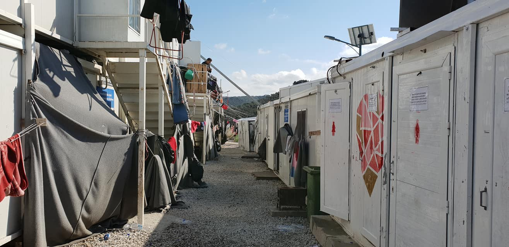

Moria, Photo by: Wassim Omar
#### FEATURE

A girl is missing, by now presumably deceased, after a boat carrying 52 people was approaching Greece — Tsonia, Lesvos north east\. In high waves and wind some of the passengers fell overboard when the boat crashed into some rocks\. When the passengers got on land, it was discovered that she was missing, as she was allegedly not wearing a life jacket\. 51 people arrived, [Aegean Boat Report](https://www.facebook.com/AegeanBoatReport/?__tn__=%2CdkCH-R-R&eid=ARAqiElmhAoU9ciubZqWAlik45-Biuj3tYB2ZG-Gak-pNhcyHRyoQKby9nbP-X7U2BZUNGfGJQei5cOH&hc_ref=ARREm3dhuGTuhwIbE6cE4b7MM9epCcozPNCKsMsIg_JWAGbvJYvkKBnk1eBvSO1x1dA&fref=nf) team writes\. Rescue was alerted, and a wide search was initiated from both sea and land, without any results\. Search and rescue was canceled due to bad weather conditions, but they were to continue searching when conditions improve\.

The nine\-year\-old girl from Afghanistan who is missing was traveling with her parents and four siblings\. Survivors have already been transferred to Moria camp\.

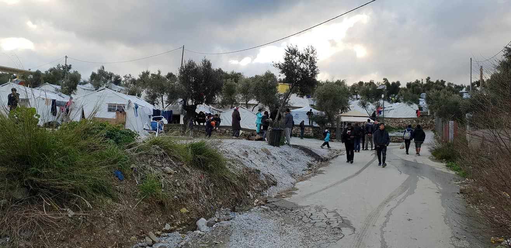

Moria, photo by Wassim Omar

> _Today was one of those days that we hoped never to see again on Lesvos, and one of those days that help us understand why we are still here\. In the early hours of this morning, our team responded to reports of a landing near Tsonia\. A boat carrying over 40 people had reached the island’s shores, despite the stormy conditions, but not all passengers were accounted for\. A girl of around 10 years old remains missing, after hours of searching by Refugee Rescue / ‘Mo Chara’ and authorities\._ 
 

> _More than three years after the death of Alan Kurdi shook the world, prompting empty promises of safe passage and humanitarian admission, those of us working in these border regions see that little has changed\. It is unacceptable and heartbreaking that we should still have to witness scenes like these played out on Europe’s doorstep\. —_ Lighthouse Relief 

#### LEBANON
### Volunteers wanted

> _We are a Spanish NGO based on Mar Elias St\. in Beirut, an educational center for children and teenagers who are in need of educational, vocational, or personal support or are having difficulties with adjusting to the regular Lebanese school system\. We help them by teaching them all these aspects and creating a safe place for personal development\. Did this grab your interest? Please contact us via our Facebook page or 26lettersschool\.humanresources@gmail\.com , and become part of the 26 letters family\!_ 

Another call for volunteers in Lebanon is aimed at those with dental or medical experience:

> _Dental Mavericks will be carrying out an outreach mission assisting Syrian and vulnerable Lebanese schoolchildren in Beirut between 4–6 March, and potentially 7–8 March in Beqaa\. The volunteers will support the mission by providing oral hygiene instructions and fluoride treatments\. Training will be given to the volunteers if they lack experience in these two areas, but medical background is a minimum criteria\. English fluency is required\. Arabic fluency is desired\._ 
 

> Get in touch now if interested:
 

> sebastian@dentalmavericks\.org
 

> \+961 70487203 \(WhatsApp\) 

#### LIBYA

Journalist Sally Hayden who has been reporting on the situation of refugees in Libya extensively for a while now, writes that the first group of refugees who’d been stranded in Libya has landed in Niger, where they’ll stay in a UNHCR centre until another country agrees to resettle them\.

■■■■■■■■■■■■■■ 
> **[Sally Hayden](https://twitter.com/sallyhayd) @ Twitter Says:** 

> > One of the refugees I’ve been in touch with for months says he’s finally going to be evacuated from Libya today through UNHCR. He says it’ll be his first time on a plane. They’ll go to Niger, &amp; then probably on to somewhere else. https://t.co/otDHJ7aMqL 

> **Tweeted at [2019-02-13 14:23:12](https://twitter.com/sallyhayd/status/1095689853528883201).** 

■■■■■■■■■■■■■■ 

#### TURKEY

As we reported yesterday, there was a fight involving Syrians in Istanbul and we shared some of the information reported about it in the Turkish media\. However, the Research Center on Asylum and Migration \(IGAM\) has recently released a study on the coverage of refugees in the Turkish media\.

As they concluded, the news about refugees are those associated with violence and crime\. That happens despite the fact that crime levels are relatively low among Syrian refugees\. Good news is no news and therefore success stories find limited space in the Turkish press\. While refugees are the main actors in the news, their views are rarely sought and their voices are rarely heard so that they can tell their side of the story\.

Read more from a very interesting text covering this topic: [here](http://www.hurriyetdailynews.com/opinion/barcin-yinanc/the-coverage-of-syrian-refugees-in-the-turkish-press-141221?fbclid=IwAR058NzakXQh2h9UNpXszaMI3JgcQxkSRLMIJ3yA4Xz20gpStT0wMbsibIo) \.
#### GREECE
### Chios

Most recent letter to the EU Commission documenting the appalling human rights abuses happening in plain sight at Vial camp on Chios:

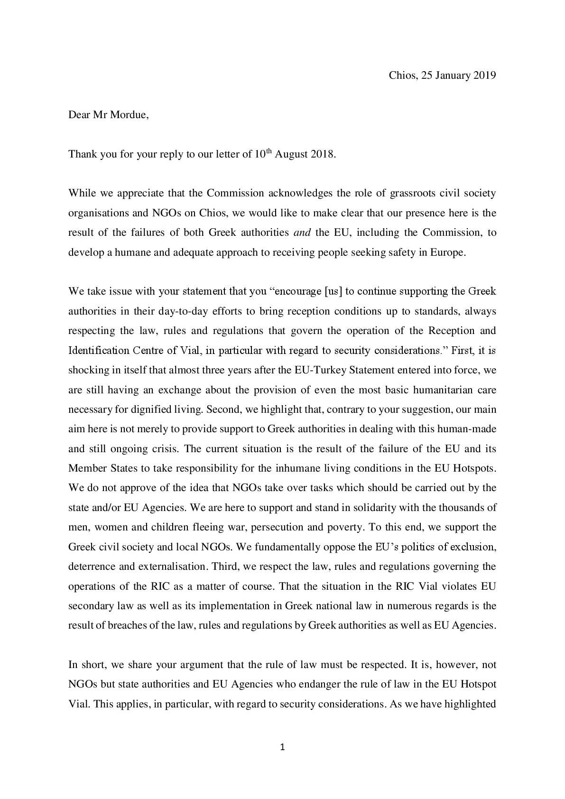

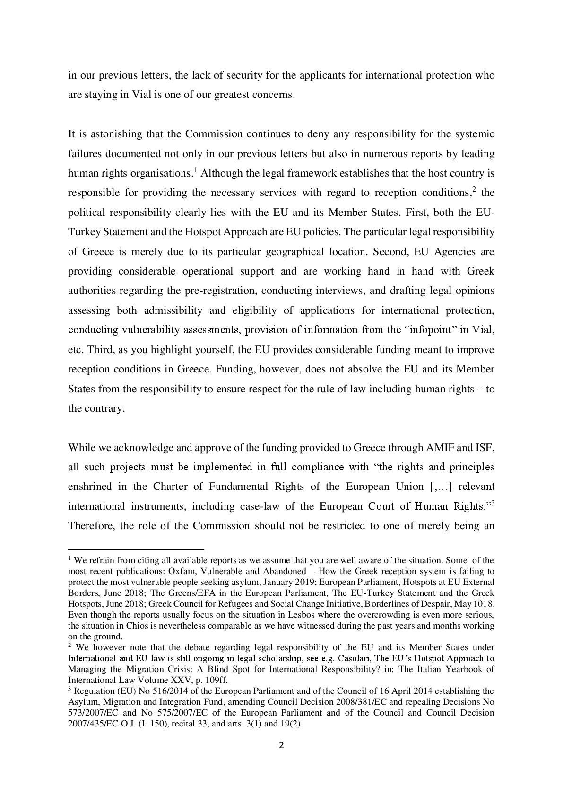

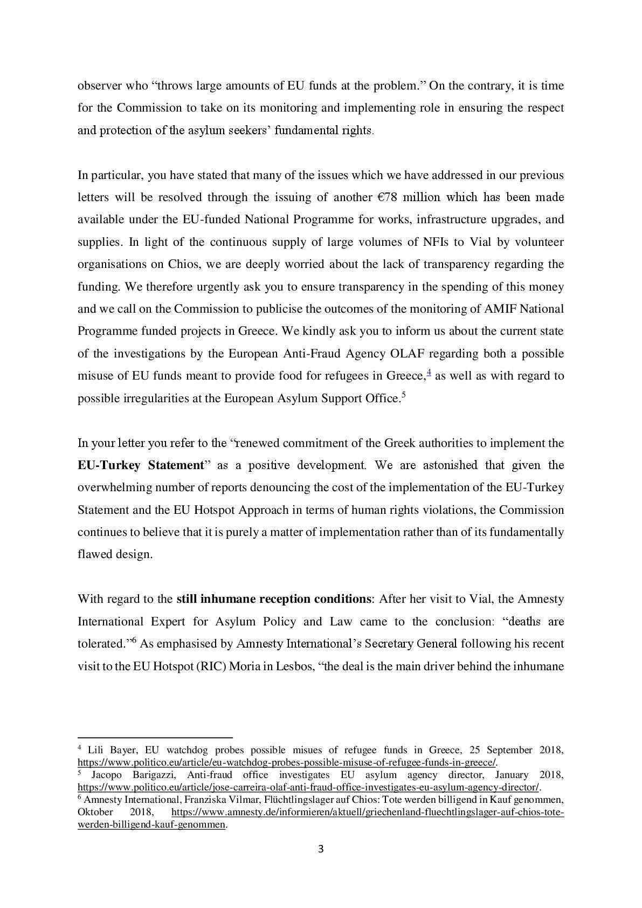

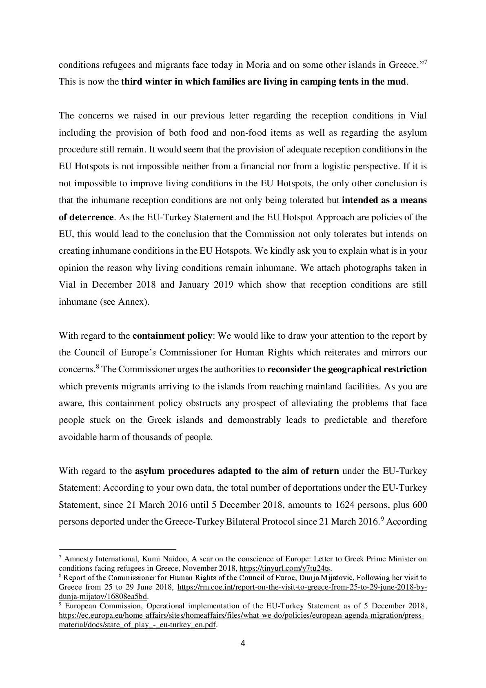

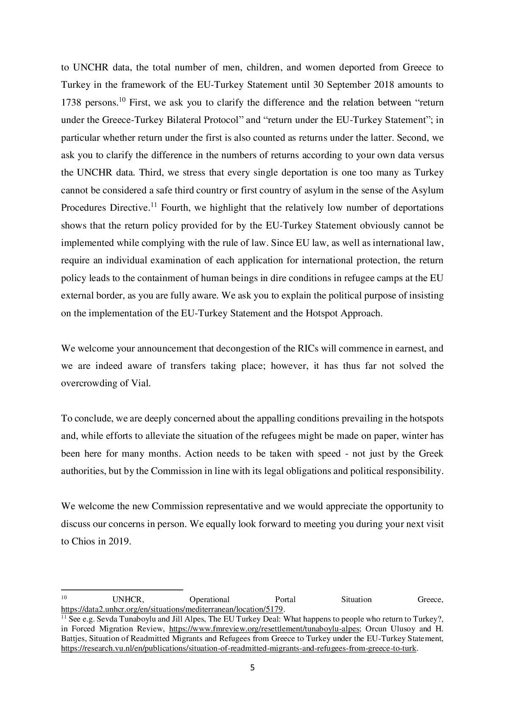

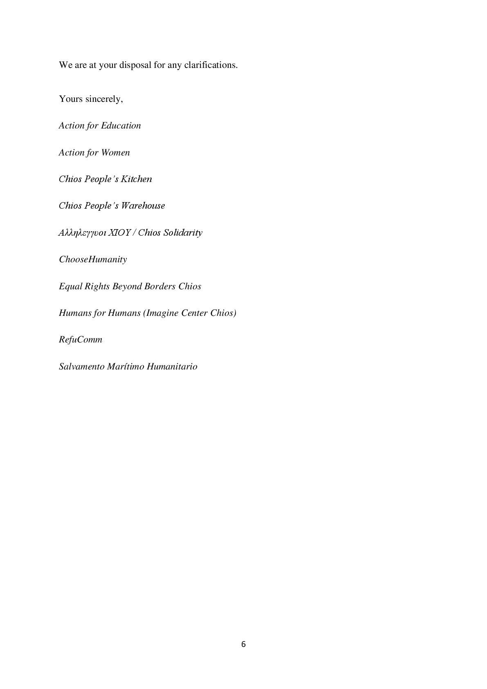

The letter was organized and co\-signed by a number of organizations on Chios and includes the following:

> Dear Mr\. Mordue, Deputy Director General for Migration and Home Affairs: 

> “… First, it is shocking in itself that almost three years after the EU\-Turkey Statement entered into force, we are still having an exchange about the provision of even the most basic humanitarian care necessary for dignified living… This is now the third winter in which families are living in camping tents in the mud\.” 

Signed by:

[Action for Education](https://www.facebook.com/ActionforEdu/?__tn__=%2CdKH-R-R&eid=ARBs1ztPliTXzAum_YwI4HkcDe6j3lnm35iQBwQ0jQqCDFZWjAViC_80_Vk-S6Wki1qURnLoXOTh_UVz&fref=mentions) 
[Action for Women](https://www.facebook.com/actionforwomenCH/?__tn__=%2CdKH-R-R&eid=ARAJr4KOi0zj2OeWk3MdTNHJ94zw_W7N5jhNaV8pecVtG3O4aOpjBw4WY4ycURuInllOGFQRPG-JUyLc&fref=mentions) 
[Chios People’s Kitchen](https://www.facebook.com/chiospeopleskitchen/?__tn__=%2CdKH-R-R&eid=ARCziScjb6QiwlvNVaJf4p8n0TaSRyXIX8NKeJByVBKeRlyT7JGjkuvp1Y7ucZbuK4kbYpR17NPT6neW&fref=mentions) 
[Chios People’s Warehouse](https://www.facebook.com/chiospeopleswarehouse/?__tn__=%2CdKH-R-R&eid=ARAIkzSeA1dWM0UJFcqy9sDFrKriLshLx-cXVHeUFLBblL0AfGB9cUjlMvRvFD92t0oDlOtber5oqP6X&fref=mentions) 
Αλληλεγγυοι ΧΙΟΥ / Chios Solidarity
[CHOOSEHUMANITY](https://www.facebook.com/choosehumanity.ch/?__tn__=%2CdKH-R-R&eid=ARAMmxl3d24cnQZ-nUBWEkWDOBIlzsAF8eoNU9HeBUO3D6XX3hcwc2VasXKV0IbuyK9LE6ubCw1xrPER&fref=mentions) 
[Equal Rights Beyond Borders](https://www.facebook.com/EqualRightsBB/?__tn__=%2CdKH-R-R&eid=ARD57wjDcIBNsI2jpZwKla3IxhpQBjdHud_dfJNeSQFNel_krJre_41xawWEknc1OotW0ScAtUmQE7rA&fref=mentions) 
[Imagine Center Chios](https://www.facebook.com/imaginecenterchios/?__tn__=%2CdKH-R-R&eid=ARDm8ifpiv1Z05PBFPG9bQPuG8T-I4JKJdbcC66PYeOAy_0_xeSMie_Ujk1x0idSxJ9fY0EKpLWyDvEz&fref=mentions) 
[RefuComm](https://www.facebook.com/refucomm/?__tn__=%2CdKH-R-R&eid=ARBFJipxDPWIml7dBM-PJTBEit4fML-u4tssieUyBD5HQAlcUEd34x7rA-ysm4coF57LFXY0wGfNOW8P&fref=mentions) 
[Salvamento Marítimo Humanitario](https://www.facebook.com/smhumanitario/?__tn__=%2CdKH-R-R&eid=ARAoFhbD-5uutXN4xn_5HuDsPvJO1_4upDD28Xp2grfCgfRX8LPp8r5dzKkeIVThG-t6PwFj0xPp4iNw&fref=mentions)

The Greek Immigration Ministry plans to remove the Vial camp on the island of Chios to another location on the island\. The ministry will [reportedly](https://l.facebook.com/l.php?u=http%3A%2F%2Fnewpost.gr%2Fpolitiki%2F5c6429a9fdfb5a2f0c592a23%2Fhios-ziteitai-akinito-gia-metegkatastasi-toy-prosfygikoy-kataylismoy%3Ffbclid%3DIwAR1EcLiZOgSCKI1MKwJ5dDgzpFftqhcV_ystKZDYjuXU0i11zRu987svx2w&h=AT3pvhO9p-2yAfbIPJO9IUxnvQFg883mUyNSOVLzhu8b-ORiqcXfOwigItsR9uPwgZtahjIpERut127aU1HfzG1NhU6UDzcfofyw-Ui4k15pqaoMbdi1-_T-V1qgOa5hIVvHDI5SGk145SHKWaCfqQ) build the new camp on an area of 40 acres with a capacity for 1500 refugees\.

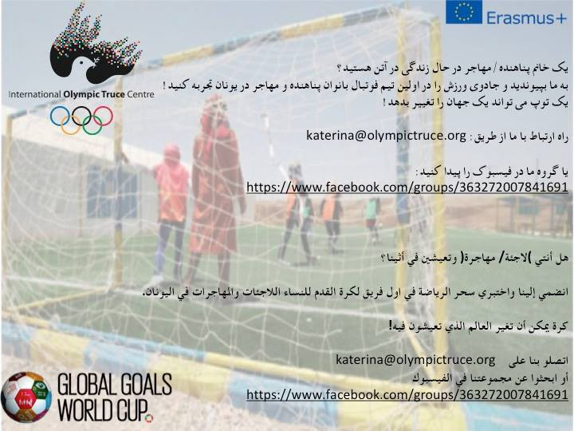

](assets/95402da168f5/1*dzxBAa7JX3Cqc-rYhDrf-g.jpeg)

infographic: [Salta Katerina](https://www.facebook.com/salta.katerina?__tn__=%2Cd%2AF%2AF-R&eid=ARCYLMdzxfheCmtEyHeXPiaWwFp73d7dIGgEFfZfqa0QHqSz91kU1LtLsjFl5AN_VW-tgkpEUCzltqpz&tn-str=%2AF)
### Athens

Two heated venues for the homeless to shelter from the cold temperatures have opened: in Kolonos and Ambelokipi\. The 1595 hotline provides information about shelters during extreme weather conditions\.

[English in Athens](https://www.facebook.com/English-in-Athens-515133632023297/?tn-str=k%2AF) are looking for English teachers to volunteer Monday\-Wednesday\-Friday from 5:00 to 6:20 pm\. Contact them for more info\.
#### HUNGARY

The European Court for Human Rights has sent an emergency order to Hungary which has been starving a family in detention:

■■■■■■■■■■■■■■ 
> **[HunHelsinkiCommittee](https://twitter.com/hhc_helsinki) @ Twitter Says:** 

> > Rejected asylum-seekers starved again in transit zone! Iraqi parents denied food for 5th day, their 3 kids are in inhuman detention. Strasbourg court #ECtHR just sent emergency order #Rule39 to #Hungary. 
Same rules, same outrageous situation as in August: [helsinki.hu/wp-content/upl…](https://www.helsinki.hu/wp-content/uploads/Denial-of-food-for-inadmissible-claims-HHC-info-update-17August2018.pdf) https://t.co/mqwv2oaFcn 

> **Tweeted at [2019-02-13 16:18:25](https://twitter.com/hhc_helsinki/status/1095718847074762753).** 

■■■■■■■■■■■■■■ 

#### Balkan weather forecast for February 14

Montenegro

Variable clouds with sunny intervals, moderate to fully overcast in the north with light snow during the day\. Wind locally moderate to strong from the north and northeast\. Low temperatures from \-11 to 3 C° and highs from 2\- to 14 C°\.

Serbia

Moderate to fully overcast and in most of the country dry, only in the east and south possible snow in the mountains\. Wind light to moderate, intermittently strong in the east and in the mountains from the north\. Low temperatures from \-4 to 1 C°and highs from 5 to 9 C°\.

BiH

Moderate to predominant cloud cover in Bosnia, a little cloudier in the north and some local snowfall in the center\. In Herzegovina light to moderate cloud cover\. Wind in Bosnia light to moderate from the north and in Herzegovina a moderate bura, gusting at times\. Low temperatures from \-3 to 4 C° and highs from 2 to 12 C°\.

Croatia

Partly sunny and variable cloudiness\. Fog in some places in the central regions during the morning\. Wind inland light, locally moderate, blowing from the northwest\. At sea moderate to strong north\-western wind and moderate to strong aura and northern wind along the coast toward the end of the day with stormy gusts\. Low temperatures from \-4 to 8 C° and highs from 8 to 16 C°\.
#### SERBIA

Info Park reports that one of the new arrivals in Belgrade is a national of India who had spent four years in Austria before he was detained by the Hungarian police and directed to Serbia\. “SCRM referred all the adult single men to the reception center \(RC\) in Bujanovac to be registered there upon the arrival\. Yet all of them were reluctant to depart to a distant RC\.”
#### BOSNIA AND HERZEGOVINA

On the night of 13 February at the Borići refugee camp in the city of Bihać, where vulnerable people and families are lodged, a fight reportedly broke out between the residents and the security guards\. The security allegedly used force against the people and several residents have slight injuries\. The IOM staff were present and were informed about this\. 
AYS received a video showing an argument, with some of the people explaining to IOM staff what had happened\. Some were recording this with their phones\. The video also shows a security officer stopping people from recording\. Over the last several weeks we have received more than one report from people living in IOM run camps in Bosnia who claim the security is forbidding them to take pictures and videos inside the camps\.
#### FRANCE
### Sleeping bags very much needed in the north of France

### Volunteering

You can volunteer with [VZWGent4Humanity refugee support](https://www.facebook.com/BelgiumGent4Humanity/?__tn__=%2CdkCH-R-R&eid=ARAOC7nxeo7FplLJ53to6VWYp1EaTJndBQwpeF225PcGSL1M18JyyEL_jxeFVeTdp9P1-eZuP0fQxaEi&hc_ref=ARRJUSx8fhMYxfaCc8MzA9-dPrhc6jE6LMug-vO2f58q04Pl1JDowAIH6L2iTBsnkF4&fref=nf) , who are looking for volunteers “who can give one day a month on a Saturday\.”

> We always depart from Ghent early in the morning and return late in the evening\. So, what are we looking for? Dedication, commitment, maturity, ability to work as part of a team and empathy towards refugees in dire circumstances in Dunkirk, Calais and Paris\. We ask that you speak good English, as this is an international organisation, and that you are legally able to cross borders\. Drivers with cars are always in demand\! \! To find out more about how you can join us and help make a difference please email gent4humanity15@gmail\.com for our information and application form\. 

Information for those who have recently been granted asylum in London:

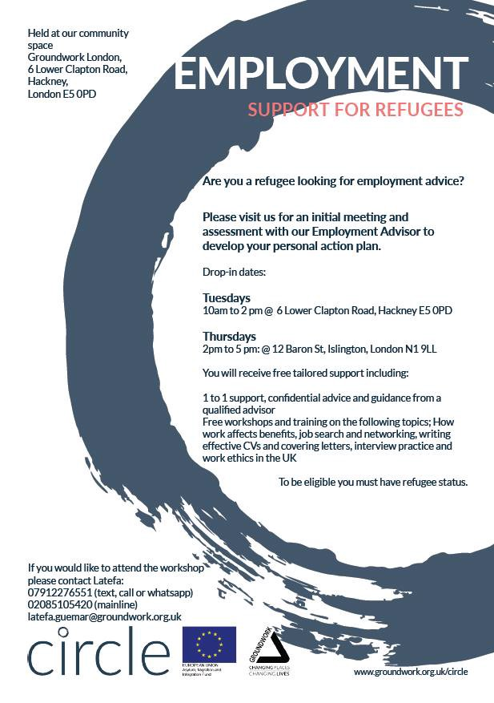

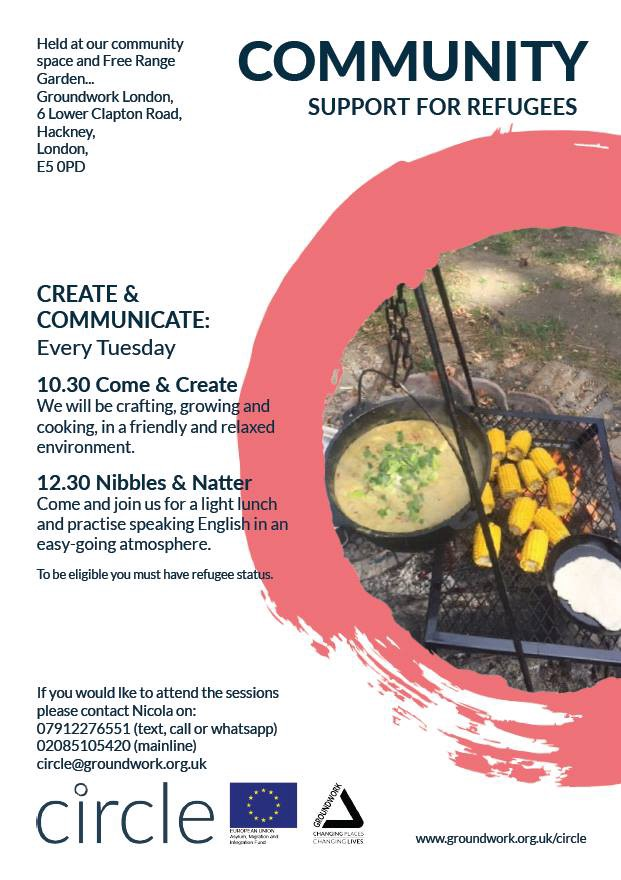

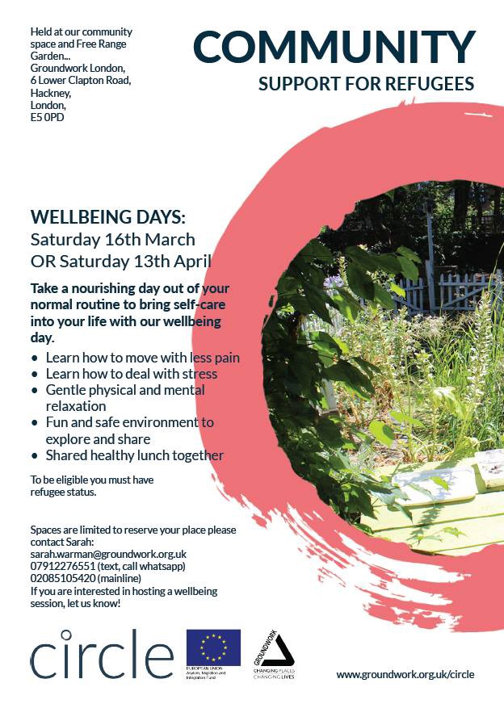

#### SYRIA

■■■■■■■■■■■■■■ 
> **[ECCHR](https://twitter.com/ECCHRBerlin) @ Twitter Says:** 

> > Groundbreaking! Firsts arrests of high-ranking #Syrian intelligence officers in #Germany &amp; #France 4 for alleged #CrimesAgainstHumanity. We R assisting 6 #torture survivors. Their testimonies &amp; our research contributed to the arrest warrant #justice4Syria
[ecchr.eu/nc/en/press-re…](https://www.ecchr.eu/nc/en/press-release/torture-in-syria-senior-ex-official-from-assad-government-arrested-in-germany/) 

> **Tweeted at [2019-02-13 13:06:47](https://twitter.com/ecchrberlin/status/1095670620724125696).** 

■■■■■■■■■■■■■■ 

**We are an entirely volunteer\-run media team, and we rely on our supporters to share our news\. So please share, and never forget to ACT\!**

**We also publish weekly summary digests in Persian and Arabic\.** 
**Please, read and share the ones for the week of February 4–10:** 
**in [Persian](%D8%AA%D8%B8%D8%A7%D9%87%D8%B1%D8%A7%D8%AA-%D8%A8%D8%B1%D8%A7%DB%8C-%D9%85%D8%AE%D8%A7%D9%84%D9%81%D8%AA-%D8%A8%D8%A7-%D8%B3%DB%8C%D8%A7%D8%B3%D8%AA-%D8%A8%D8%B3%D8%AA%D9%87-%D8%A8%D9%88%D8%AF%D9%86-%D9%85%D8%B1%D8%B2%D9%87%D8%A7-457758feea96) and in [Arabic](%D8%A7%D9%84%D8%A7%D9%92%D8%AD%D8%AA%D8%AC%D8%A7%D8%AC-%D8%B9%D9%84%D9%89-%D8%A7%D9%84%D8%B3%D9%8A%D8%A7%D8%B3%D8%A7%D8%AA-%D8%A7%D9%84%D8%A3%D9%88%D8%B1%D9%88%D8%A8%D9%8A%D8%A9-%D8%AD%D9%88%D9%84-%D8%A7%D9%84%D8%AD%D8%AF%D9%88%D8%AF-%D8%A7%D9%84%D9%85%D8%BA%D9%84%D9%82%D8%A9-a0dba044308) \.**

**We strive to echo correct news from the ground through collaboration and fairness\. Every effort has been made to credit organizations and individuals with regard to the supply of information, video, and photo material \(in cases where the source wanted to be accredited\) \. Please notify us regarding corrections\.**

**If there’s anything you want to share or comment, contact us through Facebook or write to: areyousyrious@gmail\.com**

_Converted [Medium Post](https://medium.com/are-you-syrious/ays-daily-news-digest-13-2-19-another-child-lost-in-the-sea-95402da168f5) by [ZMediumToMarkdown](https://github.com/ZhgChgLi/ZMediumToMarkdown)._
