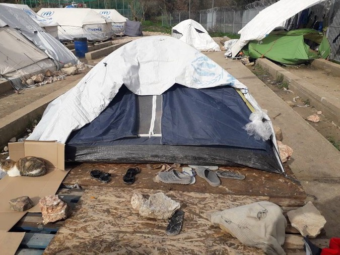
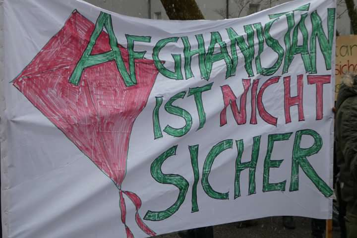

### الظروف تزداد سوءً على حدود الاتحاد الأوروبي
#### AYS Weekly News Summary in Arabic, February 11–17

](assets/9121e6961516/1*nmb5YIxZnKAuCK2U_a6gmw.jpeg)

San Fernandino, Italy \(Photo: [**Enzo Infantino**](https://www.facebook.com/enzo.infantino?__tn__=%2Cd%2AF%2AF-R&eid=ARAaHkZcl9XPScVeL5VSYcRTZEUaxUtuI-vPlgtq5T8J59DgZnZ1lAoBLIoZ8xOpIO-Qw2FlDI7q6Aun&tn-str=%2AF&hc_location=group_dialog)
### **تركيا**
#### اشتباكات بين المواطنين الأتراك واللاجئين السوريين في اسطنبول

ظهرت مقاطع فيديو تظهر اشتباكات بين اللاجئين السوريين المستقرين ومجموعة من الرجال الأتراك في إسنيورت ، اسطنبول\. وقد جُرح ما لا يقل عن ١٢ شخصاً\. أفادت سوتيري ديمبينوديس من مصادر محلية أن العنف اندلع بين اللاجئين ومجموعة من الرجال من جماعة الإخوان المسلمين التركية بعد مضايقة فتاة سورية شابة\. ثم قام الاتراك بالانتقام من أصحاب المتاجرالسوريين بكسر نوافذ متاجرهم وسرقة المحتويات وفي نهايه المطاف اعتقلو الرجال الاتراك من قبل شرطة مكافحة الشغب التركي

■■■■■■■■■■■■■■ 
> **[Sotiri Dimpinoudis](https://twitter.com/sotiridi) @ Twitter Says:** 

> > #Breaking: Clashes today between Syrian refugees and Turkish people in Esenyurt, Istanbul #Turkey, leaves at least 12 people wounded. https://t.co/9O9HTAdq6C 

> **Tweeted at [2019-02-09 20:59:38](https://twitter.com/sotiridi/status/1094340065852043265).** 

■■■■■■■■■■■■■■ 

### **جزر اليونان**

> مرحبًا بك في أوروبا ٢٠١٩… 

> لا يزال الناس يسكنون في خيام في معسكر فيال في خيوس\. 

 \)](assets/9121e6961516/1*F27BzHdqzvbPC0d5gctcBg.png)

\(Photos by [Chios People’s warehouse](https://www.facebook.com/chiospeopleswarehouse/photos/pcb.546688135828926/546687702495636/?type=3&theater) \)

كما أوقفت المفوضية برنامج السفر المجاني من فيال ، مما ترك الناس يسيرون لمسافة ٧ كيلومترات إلى المدينة و ٨ كيلومترات إلى أقرب مستشفى\.

ولم يتحسن الوضع في ساموس في مخيم فاثي أيضا\.

](assets/9121e6961516/1*4t0xZ4jKDV-4IMUh0WDkYw.jpeg)

photos by [Donate4Refugees\.org\.uk](https://www.facebook.com/Donate4Refugees.org.uk/posts/2278373362452971?hc_location=ufi)

في كووس الناس تفتقر أيضا إلى الإمدادات الأساسية

■■■■■■■■■■■■■■ 
> **[RSA](https://twitter.com/rspaegean) @ Twitter Says:** 

> > Refugees in hotspot of Kos complain about the lack of medical and legal support but also the poor quality of the food. 
#opentheislands #stopthetoxicdeal https://t.co/bF19vZvZWz 

> **Tweeted at [2019-02-08 15:52:58](https://twitter.com/rspaegean/status/1093900501933002758).** 

■■■■■■■■■■■■■■ 

### **صربيا**

٣٢٠ شخصا في وسط مدينة بلغراد

قامت شركة انفو بارك بإحصاء ٣٢٠ لاجئًا في المنتزهات والشوارع القريبة من وسط مدينة بلغراد كجزء من ساعات المساء المنتظمة\. وتضيف المجموعة أن السلطات المجرية سجلت ١٠٧محاولات فاشلة من الدخول غير القانوني إلى البلاد خلال عطلة نهاية الأسبوع ، من بينها ٩٤ تم اعتراضها داخل الأراضي المجرية\.

في صربيا ، ستصل أدنى درجات الحرارة إلى الصفر \. ويزداد الوضع سوءاً في البوسنة وكرواتيا ، حيث ستصل أدنى درجات الحرارة إلى ٤ درجة وفي الجبل الأسود ، حيث تتراوح درجات الحرارة الأدنى من \-٦ إلى ٧\.

> **ملاحظة** 

> في أخبارنا اليومية باللغة الإنجليزية كل يوم يمكنك العثور على توقعات الطقس لمنطقة البلقان \(الجبل الأسود ، صربيا ، البوسنة والهرسك ، كرواتيا 

### **إيطاليا**

يحقق المدعي العام في إيطاليا في وفاة ١١٧شخصًا فقدوا حياتهم في ١٩يناير ، بعد أكثر من ٨ ساعات في البحر ، بسبب عدم استجابة ليبيا لمكالمات \(م ر س س \) في روما\.

ولم يكن حرس السواحل في البلدان ولا السفن التجارية في المنطقة يتفاعلون مع نداءات \(س وس\) ، وللأسف ، كانت مراقبه البحر ٣ بعيدًا جدًا عن الوصول إلى القارب في ضائقة في الوقت المناسب\.

نجا ثلاثة اشخاص فقط من اصل ١٢٠ شخصا\.

وقد أدرجت في قرار سالفيني الجديد العديد من التخفيضات لنفقات طالبي اللجوء والمشغلين في المراكز

في الواقع ، كما ذكرت من قبل ريداتوره سوسياله ، لكل مهاجر يستضيف في مراكز الاستقبال بسعة ٥٠\+ مكان ، سيتم منح ما مجموعه ٢١\.٣٥ يورو / يوميا \(بالإضافة إلى مصروف جيب بقيمة ٢\.٥٠ يورو\) من

قبل الدولة ، مقابل٣٥\.٠٠ € / اليوم الذي تم منحه في السنوات السابقة\.

علاوة على ذلك ، سيعمل مشغل واحد مع ٥٠ شخصًا ، مما يعني أن شخصًا واحدًا سيحتاج إلى متابعة ٥٠ شخصًا بشأن توزيع السلع ، ومصروف الجيب ، والمساعدة القانونية والوساطة الثقافية ، وكل ذلك مع قدر محدود للغاية من الوقت والميزانية\!

هناك أيضا تخفيضات عندما يتعلق الأمر بوسائل النقل\. يحق للأشخاص الآن ١٢ رحلة سنوية بحد أقصى ٣٠ كم لكل منهم\. هذا يعني أن طالبي اللجوء الذين يعيشون في البلدات الصغيرة لن يكونوا قادرين على حضور دروس إيطالية في مراكز أكبر ؛ كما يمنع المرسوم الجديد المراكز الأصغر من إنشاء وإدارة دروس اللغة من تلقاء نفسها ، داخل الهيكل\.

لا يتم تضمين أي تمييز للفئات الضعيفة في المرسوم الجديد ؛ لن يكون علماء النفس حاضرين في مرافق الاستقبال ، ولكن الغريب أنه سيتم الاحتفاظ بهم كأرقام دعم في مراكز ما قبل الترحيل ، حيث يكون لدى نصف الأشخاص الحاضرين فرص كبيرة في إعادتهم إلى بلدهم الأصلي بسرعة كبيرة\!

لم يتم تأسيس فصل محدد للعائلات والتعليم ومكانات لترفيه الأطفال ، كما لو أنهم غير موجودين\.

“هؤلاء هم الأشخاص الذين ماتوا لأن إيطاليا لن تسمح لهم بالهبوط في الموانئ الإيطالية ولم ترد ليبيا حتى على المكالمات الهاتفية

### **النمسا**
#### عمليات ترحيل محتملة إلى أفغانستان

صورة للمواطنين الأوروبيين ضد الترحيل إلى أفغانستان

يقول المحتجين في مخيم فيينا في حوالي ١٩ فبراير ، سيتم ترحيل العديد من الأفغان من النمسا ، جزئياً على الطائرات المستأجرة\. تنصح المجموعة الأشخاص الذين يُحتمل أن يكونوا تحت تهديد الترحيل بعدم الذهاب إلى مركز الشرطة إذا تم إبلاغكم بالذهاب إلى هناك من أجل “جليندر ميتيل”\. كما تنصح بتجنب الأماكن التي تكون فيها ضوابط الشرطة شائعة ، مثل محطات السكك الحديدية أو محطات مترو الأنفاق\.

ويشمل الأشخاص المعرضون للخطر أولئك الذين لا يحملون وثائق أو كان لديهم قرار سلبي ثان في قضية اللجوء\. الاسبوع الماضي كان يجري حدث في إنسبروك للمتطوعين ، لمناقشة كيفية مساعدة المهاجرين بعد اتخاذ قرار سلبي\.

نحن فريق إعلامي يتألف من متطوّعين بالكامل ، ونحن نعتمد على أنصارنا لمشاركة أخبارنا\. لذا يرجى المشاركة ، وألا ننسى أبدا\( ا س ت\! \)
### **ألمانيا**

قامت انفو ميكرانت بنشر قائمة شاملة بالخدمات المتاحة وغير المتصلة بملتمسي اللجوء الواصلين حديثًا في ألمانيا ، وذلك لتوفير معلومات حول كيفية التنقل في النظام المعقد\.

تتضمن القائمة روابط للمنظمات التي تعمل في مجال الهجرة ، وخدمات الوصول والتكامل ، بما في ذلك الدعم المحدد للأشخاص الذين يتنقلون والذين هم جزء من مجتمع\(ل ج ب ت ك ا\) \+ والقاصرين\. كما يتم سرد دورات اللغة والقواميس ودورات الدراسة الذاتية في المقالة ، ولكن فقط في شكل الدعم والتطبيقات عبر الإنترنت ؛ كما تشمل هذه المادة العمل والمشورة القانونية وإمكانيات السكن والخدمات الصحية \(العقلية\) والموارد ، بما في ذلك خدمات الصحة الجنسية والحمل والولادة\.

من فضلك ، اطلع على المصدر الأصلي هنا

يوم الإثنين ١٨ ، سيتم الترحيل الجماعي ٢١ إلى أفغانستان\. سيتم ترحيل الناس من فرانكفورت\.

لا توجد حدود في فرانكفورت وحركة اللاجئين الأفغان تدعو إلى الاحتجاج في اليوم نفسه الساعة ١٨\.٣٠ للتضامن مع الناس الذين يتم إعادتهم ووقف جميع عمليات الترحيل\!

أوقفت المنظمة الدولية للهجرة الترويج لعمليات العودة إلى سوريا وكذلك إلى ليبيا وإريتريا واليمن بسبب الوضع الأمني ​​في البلدان — تواصل ٠\(ب ا م ف\) تشجيع العودة الطوعية لهذه الدول مع برنامج \( ر ي ك ا\) / \(ك ا ر ب\) مع بدلات السفر و ما يسمى مساعدات البدء\.

وتقول \(ب ا م ف\) أن الأشخاص الذين اختاروا العودة طوعًا لا يجب أن يكونوا في وضع أسوأ من الأشخاص الذين تدعمهم المنظمة الدولية للهجرة\. وستحدث العودة في هذه الحالات على مسؤوليتها الخاصة وبدون “تشجيع” الأشخاص المتضررين بأي شكل من الأشكال من قبل السلطات الألمانية
### **أيرلندا**
#### هجوم عنصري على فندق مخصص للاجئين

حدثت حالة ثانية من الحرائق العمد في أحد الفنادق المخصصة لاستخدامها كمركز استقبال للاجئين في أيرلندا ، وفقًا لوسائل الإعلام المحلية\. على الرغم من أن السكان المحليين في روسكي لا يتغاضون عن هذا السلوك ، إلا أنه يعتقد أن الهجمات هي محاولة لمنع اللاجئين من الانتقال إلى المؤسسة

_Converted [Medium Post](https://medium.com/are-you-syrious/%D8%A7%D9%84%D8%B8%D8%B1%D9%88%D9%81-%D8%AA%D8%B2%D8%AF%D8%A7%D8%AF-%D8%B3%D9%88%D8%A1%D9%8B-%D8%B9%D9%84%D9%89-%D8%AD%D8%AF%D9%88%D8%AF-%D8%A7%D9%84%D8%A7%D8%AA%D8%AD%D8%A7%D8%AF-%D8%A7%D9%84%D8%A3%D9%88%D8%B1%D9%88%D8%A8%D9%8A-9121e6961516) by [ZMediumToMarkdown](https://github.com/ZhgChgLi/ZMediumToMarkdown)._
