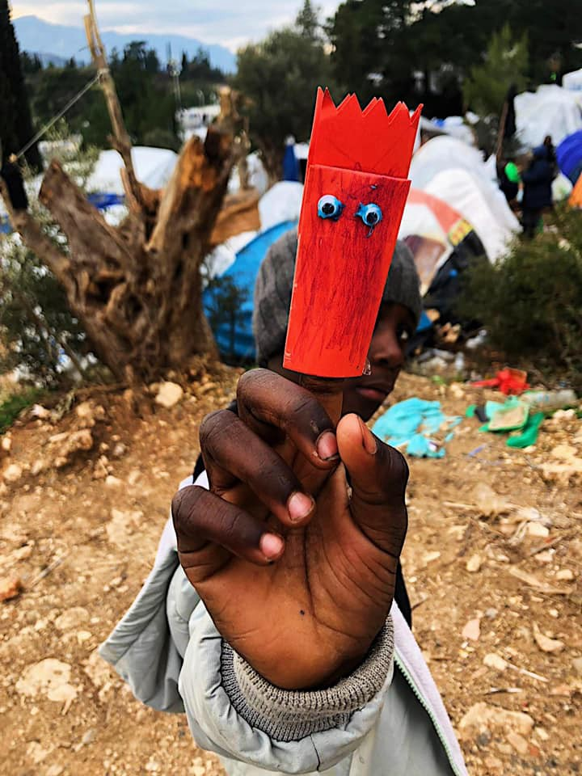
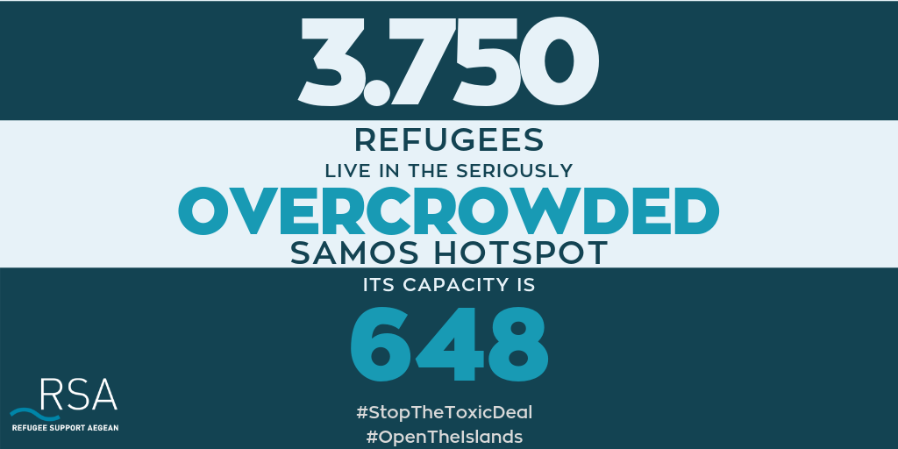

### AYS Daily Digest 19/02/2019: Anti\-torture committee criticises situation of patients in detention facilities in Greece
#### Unaccompanied minor pushed back from Melilla wins case against Spain//Report on horrible living conditions in Samos//Four trials against asylum seekers in Lesvos//Suspicious death in police custody in Athens//Greek government to end cash support within few months//EU Commissioner on Human Rights concerned over new Salvini Decree//34 new arrivals in the UK through the Channel//More news from France, Germany…

Credit: Samos Volunteers
#### FEATURE

The Council of Europe’s Committee for the Prevention of Torture and Inhuman or Degrading Treatment or Punishment \(CPT\) has released a [report](https://www.coe.int/en/web/cpt/-/greece-council-of-europe-anti-torture-committee-calls-for-the-situation-of-psychiatric-patients-to-be-improved-while-criticising-once-again-the-poor-t?fbclid=IwAR3_1hFBExlv7iUnv5efjLv1hEHXj4Yce8lED64-orFjFyhj527rwjHbKXo) on its most recent visit to Greece from 10 to 19 April 2018\.

The report underlines a severe overcrowding in 3 out of 5 psychiatric facilities \(Evangelismos, Gennimatas and Sotiria\), with patients sleeping in corridors\.

Lack of staff and huge reliance on pharmacotherapy, combined with a lack of activities proposed to patients is what the Committee denounced mostly in all the facilities visited\. Excessive use of “mechanical restraints” and physical and verbal abuse was also reported as an additional fact that hinders people’s mental health\.

> Further, at Korydallos Prison Psychiatric Hospital, it found that the use of the basement protection cells for the seclusion of patients without supervision and for extended periods could easily be considered inhuman and degrading\. Moreover, safeguards surrounding involuntary placement procedures were found to be insufficient in law and practice\. 

The Greek government has taken into consideration all the above mentioned issues and is working towards finding alternative solutions and supervision, in order to improve the conditions of the patients held in the facilities\.

The report stresses the need for a European response to the number of arrivals in Greece and, at the same time, underlines the duty for Greece to guarantee human and dignified treatment to migrants \(in detention\), especially in Moria and in the Evros region\.

> In the course of the visit, the CPT received a number of credible allegations of police ill\-treatment \(slaps, punches, kicks, baton blows and verbal abuse\) from foreign nationals held in detention in the Evros region and at Moria Pre\-removal Centre on Lesvos\. It also received several credible allegations about the occurrence of “push\-back” operations, whereby foreign nationals were returned from Greece to Turkey by boat across the Evros River; some of the persons met alleged that they had been ill\-treated \(including baton blows to the head\) by police and border guard officers or \(para\- \) military commandos during such operations\. \[…\] Conditions of detention were found to be grossly sub\-standard in some of the police and border guard stations visited, such as at Isaakio, where foreign nationals were detained overnight in two filthy cells with less than 1\.5 m² of living space each\. The Pre\-removal Centre in Fylakio was so severely overcrowded, that single men, families, children and pregnant women were crammed together for several weeks or months with little more than 1 m² of living space per person, a situation that can easily be considered as amounting to inhuman and degrading treatment\. The provision of health care services also remained inadequate, with a chronic lack of health care staff and an absence of even the most basic medical equipment and medication\. 

Additionally, the Committee denounced the detention of minors \(unaccompanied and accompanied\) in pre\-deportation facilities under “protective custody”\.

■■■■■■■■■■■■■■ 
> **[MSF Sea](https://twitter.com/MSF_Sea) @ Twitter Says:** 

> > ~1/3 of asylum seekers arriving in Greece in 2018 were kids. This is the 3rd year children are indefinitely contained in inhumane conditions on the islands. It's the 3rd year we treat kids with diseases linked to these conditions. How long will this last? Unacceptable #letthemout https://t.co/rV9pTXjP7r 

> **Tweeted at [2019-02-19 15:42:31](https://twitter.com/msf_sea/status/1097884139137708032).** 

■■■■■■■■■■■■■■ 

> In their response, the Greek authorities deny that the practice of “push\-backs” exists and point out that investigations into alleged unofficial removals and police ill\-treatment found no disciplinary liability by the Hellenic Police\. Further, the authorities explain that the poor conditions of detention in the Evros region were due to the increased migratory pressure at the time of the CPT’s visit\. 

Not that we expect the situation to change, and change any time soon, but this additional denounce might put more pressure on the Greek government to actively find solutions to several human rights violations occurring on the territory\.

Additional information can be found [here](https://neoskosmos.com/en/129796/council-of-europe-denounces-greece/?fbclid=IwAR0LuhAZy4iSxP0GV387t9sN1zo3byH2GauaVAhC4yMXoGVSUM_f91BqWEs) \.
#### MOROCCO

Good news\!

An unaccompanied minor from Mali, who filled out a complaint to the UN Committee for the Rights of the Child, denouncing his pushback from Melilla to Morocco in December 2014, has [won the case](https://www.facebook.com/AmdhNador/photos/a.1693125780899690/2276932129185716/?type=3&theater) \!

The illegal actions of the Spanish authorities have been condemned under all aspects\.

> “The State Party will have to grant the author an adequate repair, including financial compensation and rehabilitation for the damage suffered\. The State Party is also responsible to prevent such violations in the future, especially by the revision of law no\. 4/2015 on the protection of public security, adopted on 1 April 2015\. The State Party will have to also review the tenth additional provision of this law on the “special regime of Ceuta and Melilla”, which would allow the blind practice on the state part of automatic evictions at its border\.” 

See press release [here](https://176903.seu2.cleverreach.com/m/11243592/0-b54f3936719a4326d7eb26d56084704f?fbclid=IwAR3S2cflDTELLw8zqZ-VEWU7Sg11A4s-3YpLbuOUGn6CJME_SFQghMw4Cbk) \.
#### GREECE

_Arrivals_

7 women and a child were left [abandoned](https://www.facebook.com/AegeanBoatReport/posts/528006634389112?hc_location=ufi) on a cliff in Chios, in need of several medical attention\.

Another 14 people \(number to be confirmed\) have been [rescued](https://www.facebook.com/AegeanBoatReport/posts/528071371049305?hc_location=ufi) off shore of Chios\.

_Samos_

Credit: RSA — Refugee Support Aegean

> \[…\] Of particular concern is the situation of unaccompanied children who reside in the hotspot\. According to the [UN Refugee Agency,](https://data2.unhcr.org/en/documents/download/67755) in December 2018 unaccompanied children in Vathi hotspot were forced to take turns to sleep due to lack of mattresses\. In the informal camp next to the hotspot, tens of refugees including families with small children are forced to live in tents and are exposed to the adverse weather conditions\. 

> According to [reports](http://www.skai.gr/news/greece/article/396650/apostoli-skai-stin-samo-eikones-tragodias-kai-ponou-gia-hiliades-prosfuges/) , there is no doctor in the hotspot from the Greek Centre for Disease Control and Prevention \(H\.C\.D\.C\.P\) since the last and only one resigned earlier this February\. As a result, it has fallen upon the understaffed Samos hospital to provide essential healthcare to the thousands of refugees living in the hotspot and the island\. The lack of medical staff in the hotspot impacts not only the healthcare of refugees but also the vulnerability assessment procedure\. This leads to delays of transfers of those vulnerable to the mainland\. 

Protests of refugees in the centre are going, as well as general strikes to demand better living conditions\.

Please, read the full report of living conditions in Samos [here](https://rsaegean.org/en/situation-on-samos-has-reached-the-edge/) \.

_Lesvos_

In the upcoming weeks, numerous trials will take place against refugees who were protesting in the public square in Mytilene, between 2017 and 2018\.

The _Moria 35_ is the most notorious trial, representing the image of criminalisation of peaceful protests and sit\-in strikes\. 32 of the people arrested were convicted without clear evidence\.

Between the end of February and May 2019, four more trials will take place for events that took place in Sappho Square\.

> November 2017: 13 adults and 4 minors are charged\. The first trial will take place on 21st of February and the defendants are charged for camping on a communal space\. The second trial is scheduled for the 28th of February with the charge of attempt to occupy a public space\. In addition, some of the defendants are accused for disobedience and others for resistance against the police\. 

> The third trial addresses **protests in the Syrian family section in Moria camp on March 14th, 2018\.** Eight people have been arrested, and five of them have been held in pre\-trial detention since\. Their court case will take place on the 22nd of February on Chios Island\. 

> **A fourth trial against refugees who have been protesting on the central square of Mytilene will follow\. The hearing date is the 9th of May 2019\.** The group has been arrested on the night of 22/23rd of April 2018\. They were peacefully protesting against the situation on Lesvos, when they were attacked by a group of about 300 right wing nationalist with Molotov Cocktails, rocks, sticks, and bottles\. \[…\] the police did not follow the aggressors but instead turned to the refugees who had been targeted by fascists for hours and took them to the police station\. The public prosecutor’s office presses charges against them for the occupation of public space, disobedience and resistance\. 

For more information, please refer to this [link](https://dm-aegean.bordermonitoring.eu/2019/02/19/ongoing-criminalization-of-refugee-protests-upcoming-trials-against-migrants-on-lesvos/?fbclid=IwAR1monxcjwsct9oOK8fm0D7rn7SDOzZcLSbtbXAHkYeGsHb9atinz5OaI08) \.

This represents yet another attempt by the hand of the Greek government to criminalise refugees who peacefully demand their rights, while turning a blind eye on the criminal attacks that they suffer on a daily basis and refusing to take actions to change the inhumane living conditions they are forced to comply with everyday\.

_Athens_

Embuka, a 35\-year\-old migrant from Nigeria, [died in police custody](https://www.facebook.com/pikpalesvos/posts/2280808045527947?hc_location=ufi) on February 8th, in suspicious circumstances\. Even though the report states that the man died because of pulmonary oedema, when the wife tried to get in touch with him, calling the authorities, police officers denied having knowledge of him\.

Investigation is ongoing\.

List of [needs](https://www.facebook.com/ourhousegr/videos/vb.2128439984074503/558258791324660/?type=2&theater) for Our House:
- Clothes and shoes
Blankets
Sleeping bags
Financial donations for those emergency needs of shelter, medicine, food, travel, especially to reach those further out of the city, barber, cooking items\.

_Mainland_

The Greek government will officially end cash assistance to people with refugee status or subsidiary protection and ask them to leave UNHCR camps and accommodations, starting with those who had received their status before August 2017\.

Refugee\.Info has compiled some useful information for refugees: depending on the date the asylum decision was issued, the procedure and timing will change; please, have a look at this [link](https://blog.refugee.info/exit-accommodation-cash/?fbclid=IwAR1Mgi-UsPcfCrFipuiJTBLXjUtvuTqdg7Ez913QVBBpgrltWt84RsR-E08#anchor3) to find more information\.

As arrivals are still numerous, reception centres on the islands overcrowded and the number of facilities managed by UNHCR are limited, the Greek government has made the decision to enforce the policy now\.

> Under the policy, people lose access to camps and UNHCR accommodation and cash **6 months** after they get refugee status or subsidiary protection\. 

> That policy was made to meet the requirements of the European Union, which funds both the cash program and the UNHCR accommodation scheme\. Under the European Union’s rules, cash and accommodation are meant for asylum\-seekers — people who don’t yet have a decision on their asylum application\. 

> Up to now the government hasn’t enforced the 6\-months policy strictly, recognizing that for many refugees in Greece, it is very difficult to find a place to stay and a way to support themselves financially\. 

#### BALKAN WEATHER REPORT for WEDNESDAY 20/02

_MONTENEGRO_

Predominately sunny with slight to moderate development of clouds during the afternoon\. Locally in the basins there will be fog\. Wind weak to moderate from changing directions\. Lowest temperatures from \-6 to 7 and highest daily 6 to 18 degrees\.

_SERBIA_

Weak frost and locally fog during the morning\. Predominantly sunny before noon and impermanently cloudy but dry during the afternoon\. Wind weak to moderate, in the east at times strong, blowing from the northwest\. Lowest temperatures from \-5 to 4 and highest daily from 12 to 15 degrees\.

_BIH_

Sunny and slightly to moderately cloudy\. During the morning in the basins and alongside the rivers fog or low clouds\. As the day progresses cloudiness will gradually increase\. Wind weak, changing directions to the east an northeast\. Lowest temperatures from \-3 to 5 and highest daily from 6 to 15 degrees\.

_CROATIA_

Predominately sunny, during the night and in the morning locally fog\. Inland moderately cloudy after noon\. Wind mostly weak, alongside the coast moderate, blowing from the northwest\. Lowest temperatures from \-4 to 7 and highest daily from 2 to 16 degrees\.
#### BOSNIA

Help is needed for a small restaurant in Kladusa to continue working\. About 500 people eat there daily; the restaurant is run by locals with the help of volunteers\.

#### ITALY

> The Council of Europe’s Commissioner for Human Rights, Dunja Mijatovic, has expressed deep concern over the consequences that the so\-called Salvini Security Decree may have on the reception of asylum seekers and beneficiaries of protection in Italy\. In a [letter](https://rm.coe.int/letter-to-giuseppe-conte-prime-minister-of-italy-by-dunja-mijatovic-co/1680921853?fbclid=IwAR3-u32MZwK1ex6UnFdoismRl4gfkaYDZRXccjM1eRerD42CjPXudg1drek) addressed to the Prime Minister, Giuseppe Conte, the Commissioner requested the Italian government to clarify the measures it intends to take to ensure the continuity of essential services for asylum seekers and beneficiaries of protection\. 

In the letter, the Commissioner expresses her concern over the closure of CARAs with no alternative housing solutions for migrants that will hinder not only the integration process and their human rights, but also their access to education and health facilities\.

Worth reminding is also the fact that the new Decree includes the abolition of humanitarian protection as a possible protection for those seeking asylum, a measure that has locally been “challenged” by authorities and asylum commissions, setting precedents for similar cases in the future\.

The [Court of Appeal of Trieste](https://ec.europa.eu/migrant-integration/index.cfm?action=furl.go&go=%2Fnews%2Fitalian-court-recognises-humanitarian-protection-grant-citing-positive-integration&fbclid=IwAR0yWiRcSgyJsk1maAdM__qGAI6X6uar0iOsMn39RVjUbJDAic94bj_30yI) granted, on December 27th 2018, the humanitarian protection status to a Bangladeshi citizen, due to the “applicant’s young age, the absence of family members in the country of origin, and his positive socioeconomic integration”\.

In fact, also the Corte di Cassazione, the Court of Appeal, has [sentenced](https://www.repubblica.it/cronaca/2019/02/19/news/migranti_le_nuove_norme_sulla_protezione_umanitaria_non_sono_retroattive_-219552255/) that the restrictive rules on humanitarian protection will not be retroactive, meaning that all the applications lodged before October 5th 2019 \(when the Decree was approved\) will be examined with the previous criteria and not with the elements foreseen in the Decree itself\.

The Senate voted today in order to [stop an investigation](https://uk.reuters.com/article/uk-italy-politics/italy-senate-blocks-investigation-into-salvini-for-holding-migrants-on-ship-idUKKCN1Q81ZU) on Salvini and protect him from facing legal consequences about the kidnapping charges pending on him\. The Interior Minister was charged with kidnapping, when he decided to hold Diciotti at sea with 150 people last August\.

_Piana di Gioia Tauro \(Calabria\)_

This weekend has been marked by another death in the makeshift camp of San Ferdinando, where Moussa Ba \(29 years old from Senegal\) lost his life due to a fire that spread out in the area\.

Moussa is the last victim we can count, after Suruwa Jaiteh, 18 years old from the Gambia, on December 2nd 2018 and Becky Moses, 26 years old, from Nigeria, on January 27th 2018\. Soumayla Sacko, from Mali, was shot dead in June 2018, while he was trying to recover some materials to build a shelter in a private property nearby\.

Every year, around 2\.000 people are coming to the area in order to earn some money from picking fruit, living in despicable conditions and with no protection or insurance to cover them while on the fields\. No contracts\. Exploitation\. Absence of authorities or, better, active denial of human rights violations occurring in the area\.

In Bagheria \(Palermo, Sicily\), a new office had opened, called [Terraferma](https://www.borderlinesicilia.org/bagheria-nasce-terraferma-lo-sportello-per-i-migranti/?fbclid=IwAR1xwXKtsHagLJ32ClKGsJG14uVGGLw6cAGF_XfhUOQ4ZypAdci5QTp_xK0) , in order to fill up the gaps left by the bureaucratic procedure and provide asylum seekers with information on legal procedures, orientation and cultural mediation, as well as a counselling service\.

The project is run by volunteers and aims at supporting migrants in gaining access to services that is their right to receive\.
#### FRANCE

_Paris_

> A couple of days ago I bumped into a middle aged man that I met last year, in that very same camp\. 

> He was standing in front of a hospital, apparently looking/waiting for something\. 

> We started to talk and I could see he was very stressed, anxious\. After a couple of minutes, he asked me if I knew where he could sell his organs on the ‘black market’\. 

#### GERMANY

Unclear number of asylum seekers has been [brought back to Afghanistan](https://www.facebook.com/AmasoAfg/photos/a.1419588361404777/2355245351172402/?type=3&theater&ifg=1) on Monday from Bavaria, landing today in Kabul\.

At least 4 people have been apparently freed before deportation\.

PRO ASYL has created a map with an overview on deportation figures \(excluding the most recent one\), according to the different regions where the people were detained before their flight back\.

Find the map [here](https://www.proasyl.de/news/achtung-diese-mitteilung-koennte-kuenftig-strafrechtliche-konsequenzen-haben/?fbclid=IwAR3GyQ9nQ1Ki2415jgRbvvMLSoGzIxA-rGIt4hAbBdiIgv4O8D58JS2ojjA) \.
#### UK

34 migrants, including men, women and children, were rescued by the Border Force while trying to make their way to the UK through the Channel\.

Nationalities are yet unknown, but their medical situation has been assessed and the whole group is believed to be well\.

The boat was intercepted around 6\.30 AM and brought to Dover, where migrants received assistance\.

Weather conditions and temperatures are still winter ones; activists are warning people to NOT attempt to cross with these conditions\.

> “The number of individuals attempting to cross the Channel decreased from around 250 in December to around 90 in January, with roughly half of the January attempts being intercepted by partners in France before they could make it to British waters\." 

Find more [here](https://www-bbc-com.cdn.ampproject.org/v/s/www.bbc.com/news/amp/uk-england-kent-47282916?usqp=mq331AQCCAE%3D&fbclid=IwAR2r0lM2Iwso2LdM_ppvBEpcOvXHLD9U8umOWJ3PUykrAOsP2WEmrLKn4MQ&amp_js_v=0.1#referrer=https%3A%2F%2Fwww.google.com&ampshare=https%3A%2F%2Fwww.bbc.com%2Fnews%2Fuk-england-kent-47282916) \.

**We are an entirely volunteer\-run media team, and we rely on our supporters to share our news\. So please share, and never forget to ACT\!**

**We also publish weekly summary digests in Persian and Arabic\.** 
**Please, read and share the ones for the week of February 11–17:** 
**in [Persian](%D8%A8%D8%AF%D8%AA%D8%B1-%D8%B4%D8%AF%D9%86-%D8%B4%D8%B1%D8%A7%DB%8C%D8%B7-%D8%AF%D8%B1-%D9%85%D8%B1%D8%B2%D9%87%D8%A7%DB%8C-%D8%A7%D8%B1%D9%88%D9%BE%D8%A7-c1dbe5f6479c) and in [Arabic](%D8%A7%D9%84%D8%B8%D8%B1%D9%88%D9%81-%D8%AA%D8%B2%D8%AF%D8%A7%D8%AF-%D8%B3%D9%88%D8%A1%D9%8B-%D8%B9%D9%84%D9%89-%D8%AD%D8%AF%D9%88%D8%AF-%D8%A7%D9%84%D8%A7%D8%AA%D8%AD%D8%A7%D8%AF-%D8%A7%D9%84%D8%A3%D9%88%D8%B1%D9%88%D8%A8%D9%8A-9121e6961516) \.**

**We strive to echo correct news from the ground through collaboration and fairness\.**

**Every effort has been made to credit organizations and individuals with regard to the supply of information, video, and photo material \(in cases where the source wanted to be accredited\) \. Please notify us regarding corrections\.**

**If there’s anything you want to share or comment, contact us through Facebook or write to: areyousyrious@gmail\.com**

_Converted [Medium Post](https://medium.com/are-you-syrious/ays-daily-digest-19-02-2019-anti-torture-committee-criticises-situation-of-patients-in-detention-24c7be432075) by [ZMediumToMarkdown](https://github.com/ZhgChgLi/ZMediumToMarkdown)._
