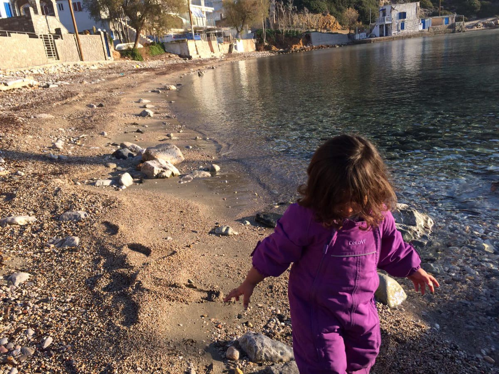

### AYS SPECIAL from Chios: A place of encounters
#### _Three\-year\-old Zina arrived on Chios early morning on the 24th of December 2018\. Together with her family and 15 more people she crossed the Aegean Sea between Turkey and the Greek island of Chios in a small rubber boat\. She remembered her crossing very well, and told a volunteer who participared in the rescue about it\._

The call came around 5:15 in the morning\. After only five hours of sleep the first response team on Chios rushed out of bed and headed towards the warehouse\. “It was the second landing that night,” a volunteer who participated in rescue remembered\. They loaded the cars with clothes, blankets, food and water and drove 30\-minutes south to a beach near the village Emporios\.

At that time the new arrivals including Zina and her family had already reached the shore and departed from the small boat\. They sought shelter against the rain under the roof of a near by terrace\. Residents from Emporios detected the newly arrived refugees and notified the local authorities\. The appropriate authorities called the Basque medical team \(SMH\) who then notified the CESRT volunteers\.

The volunteers arrived at the beach shortly after the medical team\. “The people were in shock,” a volunteer remembered and reported further :

> “they crossed the sea in total darkness, afraid of being detected by the Turkish Coastguards\. During the crossing water was leaking into the boat\.” 

The refugees arrived wet and cold on the island\.

The medical team examined the people whilst the volunteers distributed blankets and water\. Zina’s family was one of the most vulnerable ones at that landing\. At the time of the crossing Zarah, Zina’s mother, was nine months pregnant\. She was sitting on the ground with three year old Zina and 15 month old Abdu on her lap\. Ahmad, Zina’s father, who was also on the boat, is disabled\. He has only one leg and walks with crutches and he urgently needed a wheelchair\.

Nobody knew how long the people were on the water, without directions, trying to reach European territory\. What the volunteer in Chios learned over the time is that usually the smugglers just put the refugees in the boat without explaining them to them properly how to drive it\. 
Sometimes they spent over 10 hours on the sea\.

After having spent hours on the Aegean Sea in total darkness, Zina and the other new arrivals had to wait for a long time until the police bus arrived which brought them to Vial Camp\. As the sun slowly rose, everybody was asleep except for three\-year\-old Zina\. “She was very agitated,” one of the volunteers who played with Zina at the beach remembered\.

At first everything seemed alright\. She was a three\-year\-old who wanted to play instead of sleeping\. But suddenly, she started pointing at the black rubber boat, that was 10 meters away from her and started yelling:

> “Get down, get down\. Children shut up, be quiet\.” 

“To me it seemed like she repeated the words of the smugglers\. Over and over she said ‘shut up, get down, be quiet’ in Arabic\. She gesticulated nervously\. Her face expression was tense and angry,” the volunteer remembered“ with her hands she showed me the movement of the boat\- up and down, up and down\.”

> Three\-year\-old Zina re\-enacted her crossing from the Turkish west coast to Chios in a small rubber dinghy\. 

While talking, Zina was pointing at her trousers and feet and then towards the boat\. Seconds later, Zina was back in child mode, playing with stones at the beach next to the black rubber boat that brought her to Chios as if nothing had happened\. Eventually the bus arrived to take her and all the other new arrivals to the Camp\.

The volunteers thought this to be the first and last time they had met little Zina and her family\. But two weeks later the team received a message from Zina’s father Ahmad\. He was asking if they could provide clothes, blankets, toys, and a baby bed for the family\.

The first response team also carries out distributions to vulnerable people who don’t have to stay in the Camp but are accommodated in apartments on the island\. They packed the clothes and went to see Ahmad and his family\. Ahmad greeted them at the door and invited them in\. Happily, he presented Nour, his 13 day old daughter who was born two days after the family had arrived on Chios\. “I don’t want to imagine what would have happened if Zarah’s waters had broken on sea,” he said\.

Zina came out from their bedroom and recognised volunteer who helped her\. Who knows what the future holds for Zina; children all process trauma in different ways\. But it is clear it was an experience she will never forget\. Without the right to safe passage, hundreds of children this year have already been forced to embark on dangerous journeys that put their lives at risk\.

4 young girls have already died in 2019 attempting to cross to Europe\. 
This has to stop\.

Text and photos by an volunteer

_Converted [Medium Post](https://medium.com/are-you-syrious/ays-special-from-chios-a-place-of-encounters-8bb6ab325d74) by [ZMediumToMarkdown](https://github.com/ZhgChgLi/ZMediumToMarkdown)._
