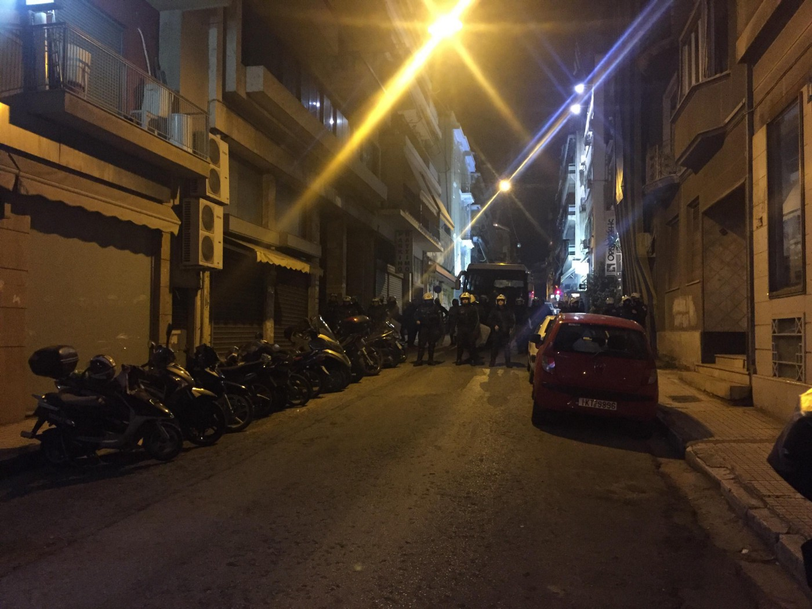
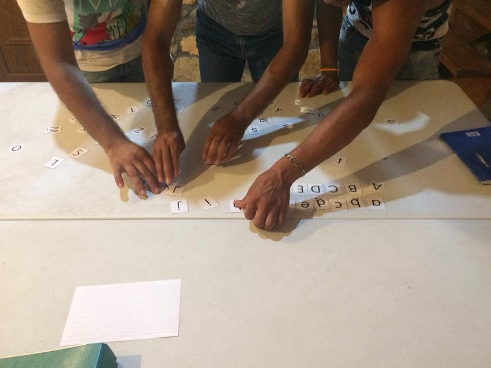
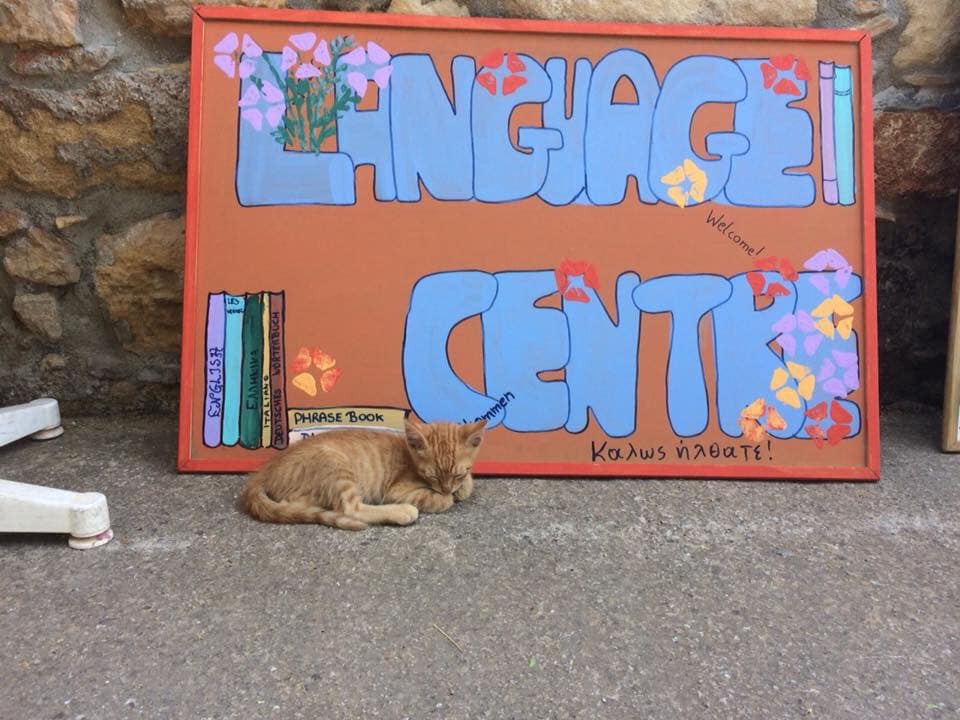
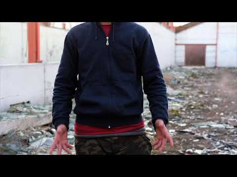

### AYS Daily Digest 28/2/19: European Court indictment against the practice of detaining children
#### ECHR rules against Greece and France / Evictions, protests and attempts of suicide in Greece / Organizations in France against the new minors’ Law / UK offered protection — info and stats / Volunteers wanted in Greece and France / More news

](assets/b03884d4fd02/1*yE975Fy0ep1f8ydRqf81yA.jpeg)

Photo: [**EDAL‏**](https://twitter.com/EDAL_EU)
#### FEATURE — ECtHR judgment in H\.A\.&Others v Greece

> Respect for the double vulnerability of child asylum seekers, qua child and qua asylum seeker, must be a primary consideration and not their irregular status\. 

A number of violations are found in the practice of unaccompanied alien minors detained in degrading conditions in Greek police stations\. Here are several outlined aspects stated in the ruling:

The principle that the best interests of the child shall be a primary consideration in all actions concerning children is a fundamental principle, substantive right and a rule of procedure under international law on the rights of the child\.

\(…\) A comprehensive assessment of the best interests of the child will presumptively exclude any resort to detention for children when the detaining measures are being contemplated not in the context of furthering the child’s best interests but in the context of immigration control\.

Before any administrative measure is taken concerning unaccompanied children, the State must appoint a guardian and provide the unaccompanied children with access to appropriate information in a language they understand\. If the State fails to appoint a competent guardian for an unaccompanied child and/or access to information is not adequately guaranteed, the State has failed to meet the procedural safeguards designed to assess and determine the child’s best interests\. \(…\) Otherwise, it is in violation of the right to liberty under Article 5\(1\) of the ECHR\.

EU Member States are obliged to provide conditions, procedures, and information to children in order for them to have effective access to their rights under the Charter of Fundamental Rights of the EU \(CFR\), which includes Article 24 and guarantees their best interests as a primary consideration\. The fundamental rights under the CFR must be secured for unaccompanied migrant children through, inter alia, the appointment of a guardian, the provision of understandable information on accessing the asylum procedure and information on their family rights under the Dublin Regulation\. Where such safeguards are not present, nullified, or impaired by unacceptable conditions of detention, the child’s rights under primary and secondary EU law are not observed\.

The document further states that:

For unaccompanied and separated children, it relies, as an initial step, on children’s prioritised identification and their prompt registration in a specific child\-sensitive procedure\. It additionally depends on the appointment of a competent guardian or adviser as soon as the unaccompanied or separated child is identified, and at the very latest, prior to administrative or judicial proceedings\. The principle further hinges on the child’s free of charge access to a qualified legal representative\.

\(…\) An inappropriate deprivation of liberty without adequate procedural safeguards can hamper the effectiveness of the prominence to be given to family unity\[;\] \(…\) the imposition of detention without taking the appropriate steps towards children’s right to be reunited with their family is in breach of the State’s obligations under the CRC, as well as the procedural guarantees under Article 5\(1\) and 8 of the ECHR\.

\(…\) not only must the placement in a detention centre be brief and temporary itself, but it must be linked to the proposed supervised education, which must follow promptly\. This requires that a place, complying with the standards described above, is actually available for the individual\. Any interim deprivation of liberty which does not comply with these requirements will consequently go beyond the detention permitted under 5\(1\) \(d\) \.

Where children are in fact detained, then the UNHCR Guidelines — as well as other international law and standards — require that it should be in places and conditions appropriate to their age, that it is a measure of last resort and for the shortest appropriate period of time\.
Detention must be ordered in writing stating the reasons in fact and in law on which it is based\.
In the context of detention orders, in decisions or rulings addressed to migrant children, there is **an obligation of the State to ensure that the child fully comprehends the reasons for detention, which will necessarily require the appointment of a competent guardian, assistance from a legal representative, and translation\.**

Therefore, in short, all the laws regarding \(unaccompanied\) refugee children must be obeyed whilst applying the conditions stressed in the case document of the here partially quoted [ruling](https://www.asylumlawdatabase.eu/sites/default/files/aldfiles/HA%20v%20Greece%20online%20TPI.pdf) and stipulated elsewhere, in the extremely rare cases the children are exceptionally detained when no less coercive measures are available\.

■■■■■■■■■■■■■■ 
> **[ECHR CEDH](https://twitter.com/ECHR_CEDH) @ Twitter Says:** 

> > Judgment H.A. and Others v. Greece - unaccompanied alien minors detained in Greek police stations
[hudoc.echr.coe.int/app/conversion…](http://hudoc.echr.coe.int/app/conversion/pdf/?library=ECHR&id=003-6342411-8297160&filename=Judgment%20H.A.%20and%20Others%20v.%20Greece%20-%20unaccompanied%20alien%20minors%20detained%20in%20Greek%20police%20stations.pdf)
#ECHR #CEDH 

> **Tweeted at [2019-02-28 09:05:04](https://twitter.com/echr_press/status/1101045610155790337).** 

■■■■■■■■■■■■■■ 

#### TURKEY

Syrian Scholars Initiative is offering two full scholarships for undergraduate study at ICU in Japan to Syrians living in Turkey who speak strong English\. 
Find more info here: [https://www\.jicuf\.org/ssi/](https://l.facebook.com/l.php?u=https%3A%2F%2Fwww.jicuf.org%2Fssi%2F%3Ffbclid%3DIwAR2HALinU4QHWJ2zW0D6ndnixHxzCKyzQtYjOy5PA-sAhAPUGeM-CGo_I3M&h=AT0XtgsdDLkpiU_k6__mHELINT56SQxRamIW8iIRU5bBrq3RtNLZ4Z9sosGQ-oslGpuX4Yr9DG9tyqL3kMbzZHyFQTuSFyN28fDZFzXr1qC6-eDMqasdYHcRuE9WTQo3BKEqTxCLKoViaWqCvSBp) and here: [https://www\.facebook\.com/JICUFssi](https://www.facebook.com/JICUFssi/?ref=gs&__tn__=%2CdKH-R-R&eid=ARBzMOW1BGVYTF3a0Sai8PoRqtDqtE-i_Bfo7Q90e5ZYI37nsH3bGrOMOZAIYW6kkxvWgoM4SaBJU90o&fref=gs&dti=893837690724053&hc_location=group)
#### GREECE
### Desperate steps by those detained on the islands

The [NoBorders](https://www.facebook.com/nobordersnetwork/?__tn__=kC-R&eid=ARBYUUbu-sZFUATabxlJWRR8Cgtqdz0R7ek73SQhz4HbmtzDqVAtbAByiWXGSpWE4nE9KarERoBC4QsK&hc_ref=ARQUUfXsRjhnd6n-9VqbEoiMGWa_z4oL13x5sESeBpuL0bLYsrAeFeY4Ca2grlQDe-Q&fref=nf&__xts__%5B0%5D=68.ARAdJocANiyJp50cJ3DZDMQ2maDCYjlz0zMFp9rRSxKjJ8oIbUpFFueOeiwndF4x8l7YCIFMBIijoPKKjgNN0GloiihhiYedfTk87K4bFPSDiFpeV7ILiDAMBVhnb5CruONFpFgnsBi7NWoS_HAgnQByeiBzZCCoOBuAQ5jtUMBa4RuOIVlUxCs2k2d1sTsI8IB09flBjYFgDFRJkemVnaeLCUYGB7B_7aUrOtOSqzth8KnYTXaPOR1yxRqsQkCtQSKIp_Gtum7ToyOZGM_jIBlVqiqjZduObZyijiYvT98SM6TFgB0vJMlsbBd4UifxxHRgLeYWcjnL4_6LL53kLc3kGw) team shared a video sent by detained refugees in Leros island\.

[عاجل : محاولة انتحار شابيين في جزيرة ليروس بسبب سوء الاوضاع](http://www.youtube.com/watch?v=zS2MXgGqVhI)
### Athens — Protests in Exarcheia

Single men’s squat in Exarcheia was evicted on Wednesday\. Protests in Exarcheia and outside Kipseli Police station where some of the men are being held were ongoing throughout Thursday\.

A statement from one of the people present:

> I was outside the police station in Kypseli where I believe the men arrested from the single men’s squat are being held\. There were about 250 people outside shouting in solidarity, and the police station is being guarded by about 50 riot police\. Now everyone outside \[has\] left\. Apparently the men are not being released tonight, but this is unconfirmed\. 

Reportedly, 70 people were arrested; most of them were at Kipseli police station\.

According to our sources, the news on Thursday was the people would be held for an extra night\. Also, there were many riot police ‘guarding’ the station\.

Solidarity presence was outside the police station on Thursday\. Another group will go there the next day, on Friday, at 6 pm

Protest comprised of refugees and Κεερφα outside ministry of Migration, demanding integration not isolation:

■■■■■■■■■■■■■■ 
> **[ΑΠΕ-ΜΠΕ](https://twitter.com/amna_news) @ Twitter Says:** 

> > Συγκέντρωση διαμαρτυρίας #ΚΕΕΡΦΑ και προσφύγων, νωρίτερα, έξω από το υπουργείο Μεταναστευτικής Πολιτικής

Σύνθημα «Ένταξη στον ιστό της πόλης. Όχι στην απομόνωση»
[ana.gr/home/article/3…](http://www.ana.gr/home/article/338945/Sugkentrosi-diamarturias-KEERFA-kai-prosfugon-exo-apo-to-upourgeio-Metanasteutikis-Politikis)

#Refugeesgr https://t.co/PCMWxQgY2m 

> **Tweeted at [2019-02-28 13:43:33](https://twitter.com/amna_news/status/1101115690998730752).** 

■■■■■■■■■■■■■■ 

On March 16 there will be a big protest against the EU’s faulty deals and current policies\.
### Volunteering

Rowing Together NGO is urgently seeking for an admin and Volunteer Coordinator for their Women’s Healthcare Project in Moria Hotspot/RIC that can commit for a long term position to start ASAP\. They are also in need of someone willing to assist with bureaucratic work relating to the NGO\. If interested check their Facebook
[https://www\.facebook\.com/RowingTogetherNGO/](https://www.facebook.com/RowingTogetherNGO/?__tn__=%2CdKH-R-R&eid=ARCned_bhbWK8yxNpUygUSI361KVb3E3ICsveqdldM1HTCX7LjntcfgIOU6keEwCICeR9gH3HJPT0tOh&fref=mentions) 
or send an email to rowingtogethervoluntarios@gmail\.com\.

The Language Centre on Chios needs English teachers to join the team:

> Are you an experienced teacher? Do have experience in the classroom? We need one teacher for the beginning of March and two teachers at the end of March\.
 

> We ask for a minimum stay of two months, providing free accommodation\.
 

> This project is very special and important\. A calm, comfortable, and positive space away from the camp\. 

If you think you could help, please send your CV to chiosesrtlc@gmail\.com\.

 ‎](assets/b03884d4fd02/1*DIh9ybz-e6-FDQDQsSSxvw.jpeg)

Photos from Chios Language Centre: [Emma Vagabond Roberts](https://www.facebook.com/emma.nomad?__tn__=%2Cd%2AF%2AF-R&eid=ARAJYALy18ZO-fFcUK64WHqLXZlNR2OKNPy-KtYXd8sLPXV6RImYuRDZwI9vJQZo1EfGDglSp-a-pqKC&tn-str=%2AF) ‎

Lifting Hands International, in Serres near Thessaloniki, is looking for a yoga/fitness/dance teacher to join their team approximately at the end of March, in addition to seeking a guitar teacher\.
#### SERBIA

No Name Kitchen team has published a video with statements of people on the move in the area of the city of Šid in Serbia, testimonies of violent encounters with the police:

“This video is a report about what happened the 20th of February, 2019, when police entered to the squat in Šid and destroyed most of the tents, sleeping bags, blankets, and documents of the refugees that are living there and trying to cross the Croatian border\.”

#### ITALY
### Eviction in Rome

At dawn, before the breakfast volunteers arrived, another raid took place at Piazzale Spadolini, [Baobab Experience](https://www.facebook.com/BaobabExperience/?__tn__=%2CdkCH-R-R&eid=ARDctIHK_hq7iMYkrB2rjk_KfXTqmtgg0NSkuas_r8rOFXxvVYXaQZk7EDDceAgp_WV2nQRDkYlR6JRK&hc_ref=ARRq4fD_biAd_QzgyRQeic1L7HstBN7xZ2iYOScPCfad-0ThaLux2wTob0dTs5MIsCk&fref=nf&hc_location=group) reports\.

> In fact when the first volunteers stood at 8 am it was already all over\. No trace of officers\. No trace of the blankets meticulously folded in the morning by the boys\. 
 

> It’s 8, volunteers start breakfast but 5 boys are missing after being called\. 
 

> At this point we know that we would only see them later in the evening\. 

> We are tired, tired of these \[vain\] operations that we have been experiencing since 2015 and suffering migrants in this city, unable to implement any valid immigration policy\. But now we are especially angry, deeply outraged and worried\. A police operation that involved many forces for 5 boys taken to Via Patini for identification\. 

Hours, hours, and hours of waiting\. More than 10 long hours\. 
In a closed room, without eating\.
In the end, the five guys were not checked for documents, as they were previously taken in the same manner, too\. Two of them suffer from significant mental and physical problems\. The first one was in shirt, slippers, and with a single sock and a foot, unable to stand on the ground\. The second one is an older gentleman with similar physical disabilities\.

> Have they seen offering any accommodation, a grip? No, they were just released after a day of hunger with a complaint because they didn’t follow previous orders to leave the territory\.
 

> Will we stop here? No\. Two asylum seekers, boys, a Senegalese waiting for commission and a Eritrean waiting for an outcome, had their cards seized\. 
 

> It is now a practice we often find happening\. 

> We strongly denounce these repressive practices that do nothing but violate rights and dignity and endanger human beings already fragile and isolated\.
 

> We strongly denounce the overkill of a system that instead of protecting, produces marginalisation and insecurity\. 

> … The 5 guys came back after 20h\. We redistributed them blankets\. In the face of those who think that evacuating means annihilate, alienating, destroying\. 

> This game has lasted far too long, and it is us as Italian citizens, European citizens, losing our humanity whenever these acts of violence and persecution are carried out towards the weakest\. 

### Italian pre\-deportation centres: An administrative hell

Italian CPRs \(Centri di Permanenza per il Rimpatrio\) are the renovated version of detention centres for undocumented migrants\. They have had several different names \(CPT, Centri di Permanenza Temporanea, CIE, Centri di Identificazione ed Espulsione\) and opened for the first time in 1998\.

The detention of people who did not commit any crime, and whose only fault is trying to find better living conditions in Italy or in the rest of Europe, is strictly connected with “free movement,” as it was thought of by European politicians at the time of the Schengen agreements\.

> T\., a man in hunger strike in the CPR \(Italian pre\-deportation centre\) of Turin, contacted Radio Blackout \(1, 2\), an activist radio based in the same city\. By Monday 25th of February, T\. was at his 16th day of hunger strike to demand his freedom and to enlighten the public about the brutal conditions people are forced to suffer in the centre\. 

Read our recent [A **YS SPECIAL ABOUT CPR — Italian pre\-deportation centres: An administrative hell\.**](ays-special-about-cpr-italian-pre-deportation-centres-an-administrative-hell-c7ce07502561)
#### FRANCE
### European Court for Human Rights rules against France

The 12 year old boy had spent six months in the “jungle” of Calais without being supported by social services\. 
The European Court of Human Rights has condemned France this Thursday, February 28, for degrading treatment against a 12\-year old Afghan who had spent six months in the “jungle” of Calais without being supported by social services\. 
France is ordered to pay 15,000 euros to the child, who has become a teenager, in respect of non\-pecuniary damage … The jurisdiction of the Council of Europe considers that France has respected neither the national law or international law relating to the protection of children, leaving this minor to live, “for several months \(…\),” in an environment totally unsuited to this child, whether in terms of security, housing, hygiene or access to food and care\.

The Court decision states they are “not convinced that the authorities \(…\),” have done all that could reasonably be expected of them to meet the obligation of care and protection that weighed on the Respondent State in the case of a 12\-year\-old unaccompanied refugee minor, that is, an individual in the category of the most vulnerable persons in society\.

> “The judgment was rendered unanimously by the judges\. France can still appeal\. After the dismantling of the northern area of ​​the “jungle” of Calais in October 2016, just over 1,600 unaccompanied minors were evacuated by the services of the prefecture of Pas\-de\-Calais\. They were placed in reception and orientation centers\.” 

Find the text of the ruling [**here**](http://www.infomie.net/IMG/pdf/affaire_khan_c._france.pdf) \.
### Organizations against the newest article of the Law

19 organisations and associations have directed their criticism against the recent article in the Law on asylum and migration regarding the age tests of the refugee minors, which conflicts with the children’s rights\. With the intention to ultimately disregard and exclude this article, they have posed their objection to the State Council, forming it as a priority question and questioning its legitimacy with the Constitution\.

Human Rights defenders, National Council for the Protection of Children, associations, NGOs, etc\., have all expressed their scepticism and opposition prior to the adoption of the text of the article and called for the abandoning of the law proposal and the suggested decree\.
[Here](http://www.infomie.net/IMG/pdf/cp_depot_recours_fichier_mna_vfinale_28-02.pdf) is the short announcement\.
### Persona non grata, Consequences of security and migration policies at the France–Italy border — Observation report 2017–2018

An important and timely report is a detailed account of the current situation, based on observations from 2017–2018, denouncing the continued human rights violations, lack of access to the asylum procedure, and the criminilisation of those working in solidarity with refugees and displaced people at the border\.

In 2017 and 2018, working with local, national, French and Italian partner non\-profits and NGOs, Anafé monitored the border and collected testimonies in order to condemn the illegal practices of the French administration against foreigners arriving there\.

From Menton to Ventimiglia, in the Roya Valley, from Briançon to the Col de Fréjus and Modane, via the Col de Montgenèvre and the Col de l’Échelle, the conclusions are the same: discriminatory controls; hasty procedures; human rights violations; endangered people; irregularities in entry denials; hindrances to the access to asylum; failure to look after unaccompanied minors; irregular push backs; irregular detention; police chases; violence; injuries; and deaths\. Persona non grata is structured around three main points: the militarisation of the border \(history, re\-establishment of internal border controls, militarisation, and their consequences\); human rights violations \(police checks and questionings, denied access to human rights, detention and push back\); and solidarity \(endangering foreigners, pressure against human right defenders, and resistance, particularly with non\-profits\) \.

Links to the report: [in English](http://www.anafe.org/IMG/pdf/anafe_-_summary_-_persona_non_grata_-_en.pdf) , [in French](http://www.anafe.org/IMG/pdf/anafe_-_resume_-_persona_non_grata.pdf) , [in Italian](http://www.anafe.org/IMG/pdf/anafe_-_sintesi_-_persona_non_grata_-_it.pdf)
### Trying to claim asylum in France

OFII’s number is the one newcomers are supposed to call to get an appointment to give their fingerprints & start their asylum procedure in France\. Here’s the experience by [Faces Before Numbers](https://www.facebook.com/FacesBeforeNumbers/?tn-str=k%2AF) that we forwarded in one of our news digests earlier on, Part II:

> Last week, I tried to reach OFII to get an appointment for a young man wanting to claim asylum in France\. I waited over the phone for 45 minutes before being told that due to the amount of calls, we had to call back later\. Before people get an appointment, they cannot claim asylum in France and so are considered to be in an ‘irregular’ situation\. It also means they are completely out of the system, meaning they cannot be put on the waiting list to get an accommodation \(so sleep in tents\) and cannot be granted the financial support asylum seekers are entitled to\.
 

> To sum things up, it means they are completely ignored, invisible, and cannot use their fundamental right of claiming asylum\.
 

> All this when the vast majority is extremely vulnerable and exhausted, after having crossed half of the world by foot and living the unbearable\. 

](assets/b03884d4fd02/1*vElv2hquhYOayV2mOPlC4g.jpeg)

[Faces Before Numbers](https://www.facebook.com/FacesBeforeNumbers/?tn-str=k%2AF)
### Volunteers wanted in Calais

Refugee Info Bus writes: “We are looking for a volunteer to commit to a minimum three month period to serve as a French legal support worker\. They will assist refugees and displaced people to access legal information on their rights, and support them in making asylum claims or accessing appropriate legal representation\.”
Please, make sure you [**read this**](https://www.refugeeinfobus.com/calais-legal-support-volunteer?fbclid=IwAR26Vb5ABMHrvVUAPgv2t9ai2VYdC3vtH37n7lefakEdL4wQbaMBm7WWTck) before contacting Refugee Info Bus\.
#### UK
### **“How many people do we grant asylum or protection to?”**

The UK offered protection — in the form of grants of asylum, alternative forms of protection, and resettlement — to 15,891 people in 2018 \(up 8% compared with the previous year\) \. Of these, 42% \(or 6,628\) were children\.

Data published in the report relate to the year ending December 2018 and all comparisons are with the year ending December 2017, unless indicated otherwise\.

[This section](https://www.gov.uk/government/publications/immigration-statistics-year-ending-december-2018/how-many-people-do-we-grant-asylum-or-protection-to?fbclid=IwAR0fuqWBQBso19o7NJ-CQ8AnBbzgOWHh4-DGQ_Lz9Hw2v6ZQOxp2U1Ggd8s) contains data on:
- asylum applications and initial decisions, including unaccompanied asylum\-seeking children \(UASC\)
- resettlement
- Family reunion visas granted
- asylum support
- Dublin Regulation

The long waiting times for a decision are leaving people in limbo, unable to plan for the future, and not knowing if they will be safe\. On top of this, they are not allowed to work and at the same time asked to pay international fees at universities, if they are fortunate enough to attend university\.

**We are an entirely volunteer\-run media team, and we rely on our supporters to share our news\. So please share, and never forget to ACT\!**

**We also publish weekly summary digests in Persian and [Arabic](%D8%A7%D9%84%D9%8A%D9%88%D9%86%D8%A7%D9%86-%D8%AA%D8%AE%D8%B7%D8%B7-%D9%84%D8%A5%D9%86%D9%87%D8%A7%D8%A1-%D8%A7%D9%84%D8%AF%D8%B9%D9%85-%D8%A7%D9%84%D9%85%D8%A7%D9%84%D9%8A-%D9%88%D8%A7%D9%84%D8%B3%D9%83%D9%86%D9%8A-%D9%84%D9%84%D8%A7%D8%AC%D8%A6%D9%8A%D9%86-%D8%A8%D8%B4%D9%83%D9%84-%D8%AA%D8%AF%D8%B1%D9%8A%D8%AC%D9%8A-85c17518d316) \.** 
**Please, read and share the ones for the week of February 18–24\.**

**We strive to echo correct news from the ground through collaboration and fairness\.**

**Every effort has been made to credit organisations and individuals with regard to the supply of information, video, and photo material \(in cases where the source wanted to be accredited\) \. Please notify us regarding corrections\.**

**If there’s anything you want to share or comment, contact us through Facebook or write to: areyousyrious@gmail\.com**

_Converted [Medium Post](https://medium.com/are-you-syrious/ays-daily-digest-28-2-19-european-court-indictment-against-the-practice-of-detaining-children-b03884d4fd02) by [ZMediumToMarkdown](https://github.com/ZhgChgLi/ZMediumToMarkdown)._
