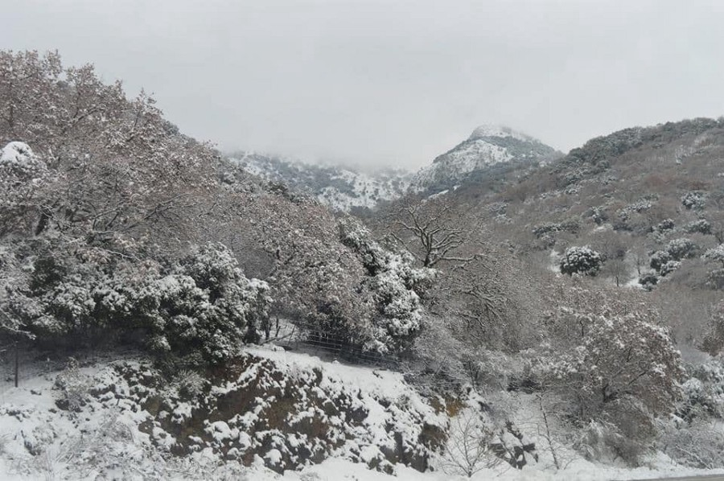
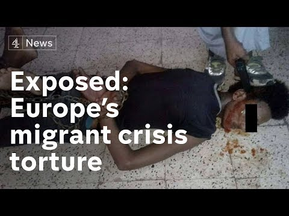

### المخيمات المكتظة والعديد من مراكز الاحتجاز
#### AYS Weekly News Summary in Arabic, February 25–March 3

Aegean Boat Report :صور
### **المحكمة الأوروبية**
#### [إدانة المحكمة الأوروبية ضد ممارسة احتجاز الأطفال](ays-daily-digest-28-2-19-european-court-indictment-against-the-practice-of-detaining-children-b03884d4fd02)

ويوجد عدد من انتهاكات حقوق الإنسان وحقوق الطفل في ممارسة اللاجئ الذي لا يُعزى إلى القصر الذين يُحتجزون في ظروف مهينة في مراكز الشرطة اليونانية\. حكم المحكمة الأوروبية لحقوق الإنسان في قضية \( \(هـ ا\) \) \. وآخرون ضد اليونان ، من بين أمور أخرى ، ذكر أن:

> _تلتزم الدول الأعضاء في الاتحاد الأوروبي بتوفير الشروط والإجراءات والمعلومات للأطفال حتى يتمكنوا من الوصول إلى حقوقهم\._ 

> _يكون للأطفال غير المصحوبين والمنفصلين عن ذويهم أولوية في تحديد الهوية والتسجيل الفوري في إجراء محدد مراعي للطفل_ 

> _يجب على الأطفال والقاصرين الحصول مجانًا على ممثل قانوني مؤهل_ 

> _في حالات نادرة للغاية من التنسيب في مركز الاحتجاز \(كملاذ أخير ولأقصر فترة زمنية مناسبة\) ، يجب أن يكون مرتبطًا أيضًا بالتعليم الخاضع للإشراف والذي يجب أن يتبع على الفور_ 

> _يجب على الدولة التأكد من أن الطفل يفهم بشكل كامل أسباب الاحتجاز ، والتي تتطلب بالضرورة تعيين وصي مختص ، ومساعدة من ممثل قانوني ، وترجمة\._ 

 :صور](assets/9f7b7169811b/1*yE975Fy0ep1f8ydRqf81yA.jpeg)

[**EDAL‏**](https://twitter.com/EDAL_EU) :صور

كما أدانت المحكمة الأوروبية لحقوق الإنسان فرنسا هذا الأسبوع لمعاملة مهينة ضد أفغاني في الثانية عشرة من عمره قضى ستة أشهر في “غابة” كاليه دون دعم من قبل الخدمات الاجتماعية\. العثور على مزيد من المعلومات حول هذا \(باللغة الإنجليزية\) في ملخص الأخبار الأخيرة لدينا\.
### **المغرب**

السلطات توقف قوافل المهاجرين

 :صور](assets/9f7b7169811b/1*yvLPLPFuKTbozg3uwVHJIA.jpeg)

[AMDH\-Nador](https://www.facebook.com/AmdhNador/posts/2280989112113351) :صور

تم توقيف مجموعتين من سكان جنوب الصحراء الكبرى من قبل الشرطة أمس في مدينة أريكمان الساحلية\. وكانت مجموعة واحدة من ٣٠ شخصا ، وأخرى من ٤٠\.
### **الاتحاد الأوروبي**

ووفقًا للبيانات التي قدمتها المنظمة الدولية للهجرة ، فقد دخل ٩٤٥٠ شخصًا أوروبا عن طريق البحر اعتبارًا من٢٤ فبراير\. مائتان وثلاثون شخصا لم يكملوا [هذه الرحلة وماتوا في البحر](https://www.middleeastmonitor.com/20190221-jordan-syrian-refugees-have-no-intention-to-repatriate/) \.

أصدرت نفس المنظمات تقريرا عن النزوح خلصت إلى أن ١٤٤١٦٦ وافدا جديدا تم تسجيلهم في أوروبا بين يناير وديسمبر ٢٠١٨\. من هذا العدد ، ٩٦ ٪ كانوا فرارا من الحروب في سوريا ، أفغانستان ، العراق ، أو الأوضاع الرهيبة في تونس والمغرب \.

ويبين نفس التقرير أنه في العام الماضي ، تم إيواء أكثر من٢٠٠٠٠ شخص في إيطاليا واليونان وجمهورية مقدونيا الشمالية وصربيا وكرواتيا وسلوفينيا والبوسنة والهرسك وبلغاريا وقبرص وكوسوفو ورومانيا ، في حين أن الزيادات الكبيرة في الدخول غير النظامية في البوسنة والهرسك \(١١٦٦ مقابل ٢٣٨٤٨\) والجبل الأسود \(٨٠٧ مقابل ٤٤٤٥\) في ٢٠١٧ و ٢٠١٨على التوالي\.
### **الجزر اليونانية**
#### لا شيء تغير على الجزر اليونانية

على الرغم من الإدعاءات المستمرة من قبل الحكومة اليونانية وسلطات الاتحاد الأوروبي ، وبينما لا يزالون يتذكرون التصريحات المحرجة لرئيس الوزراء اليوناني أليكسيس تسيبراس يفتخرون بالظروف المعيشية للاجئين في الجزر ، لا يبدو أن هناك شيئًا تغير …

ووفقاً للإحصاءات الوطنية ، لا يزال هناك ١٥٤٩٣ شخصاً في المرافق في الجزر: ٧٢٥٢ في جزيرة لسبوس ، و ١٧٤١ في جزيرة خيوس ، و ٤٢٩٤ في ساموس ، و ١١٧٣في جزيرة ليروس ، و ٩٩٥ في كوس ، و٢٧ في جزيرة أخرى\.

Aegean Boat Report :صور

تعلمنا أن نثق في هذه الإحصائيات ، خاصةً وأنهم — في ٢٥ فبراير / شباط — ما زالوا يقولون إن لا أحد يعيش في مخيمات مؤقتة\.

Aegean Boat Report :صور

يوم الأحد كان الثلج يتساقط على ليسفوس ولا يزال حوالي ٧٠٠٠ شخص يعيشون في ظروف غير إنسانية\.

في حين أن الأرقام الحكومية تحسب ٤٢٩٤شخصاً في ساموس ، فإن \(ا ب ر\) تبلغ أنه من المرجح أن أكثر من ٥٠٠٠شخص يعيشون في الجزيرة ، مع أكثر من ١٠٠٠طفل لا يحصلون على التعليم الرسمي أو الخدمات الأساسية
### **فرنسا**

لا تزال باريس مكانًا صعبًا للكثير من الناس الذين ينامون بصعوبه \. ليس فقط على الرجال أن يناموا في الشوارع في المخيمات ، بل حتى يتم هجر العائلات من قبل الحكومة الفرنسية في العاصمة\. وجوه قبل “تقارير أرقام” على عائلة مع طفل يبلغ من العمر خمس سنوات وطفل يبلغ من العمر ١٥ شهرا: “هذه النفوس الثلاثة الجميلة قضت ٣ سنوات في ليبيا ووصلت إلى شواطئنا قبل أسبوعين ، بعد ٣٦ شهرا من الجحيم\.” في الوقت الذي ترفض فيه فرنسا

مساعدة المحتاجين ، أعلنت وزارة الدفاع في الوقت نفسه أنها ستقدم ستة قوارب مجهزة لما يسمى بخفر السواحل الليبي ، الذي يشتهر بالانسحاب ، وكذلك المعاملة غير الإنسانية للناس\. الركض\. سترسل إيطاليا أربعة قوارب أيضًا\.

### **ألمانيا**

نقل امرأة من أفغانستان كانت في احتجاز الترحيل إلى مستشفى وتعاملت معاملة لا إنسانية للغاية\. وأثناء إقامتها في المستشفى لمدة أسبوع واحد في غروسبرغويدل ، كانت المرأة الأفغانية المريضة البالغة من العمر ٢٤ عاماً تخضع لحراسة دائمة من قبل اثنين من ضباط الأمن\.

بالإضافة إلى ذلك ، ووفقًا لمحاميها بيتر فالكوبش ، فقد “ربطت بقسيمة طعام واحدة إلى سرير المستشفى لمدة ثلاثة أيام وليالي\.” يتحدث فلهوبش عن “ظروف القرون الوسطى”\.

وعلاوة على ذلك ، حكمت محكمة محلية الآن بأن احتجاز الترحيل غير قانوني على أي حال

_Converted [Medium Post](https://medium.com/are-you-syrious/%D8%A7%D9%84%D9%85%D8%AE%D9%8A%D9%85%D8%A7%D8%AA-%D8%A7%D9%84%D9%85%D9%83%D8%AA%D8%B8%D8%A9-%D9%88%D8%A7%D9%84%D8%B9%D8%AF%D9%8A%D8%AF-%D9%85%D9%86-%D9%85%D8%B1%D8%A7%D9%83%D8%B2-%D8%A7%D9%84%D8%A7%D8%AD%D8%AA%D8%AC%D8%A7%D8%B2-9f7b7169811b) by [ZMediumToMarkdown](https://github.com/ZhgChgLi/ZMediumToMarkdown)._
