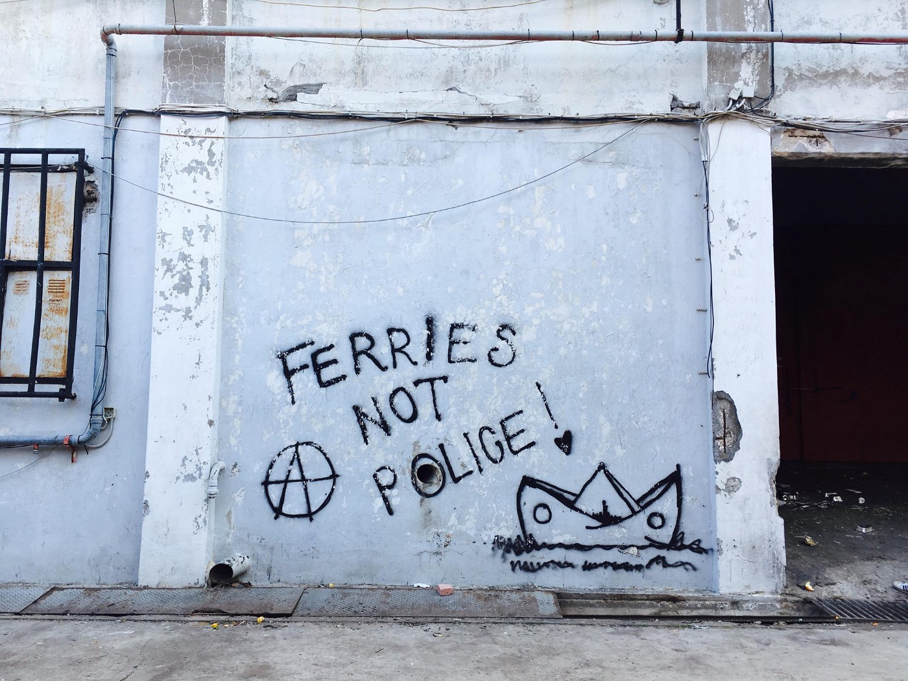

### AYS Daily Digest 4/3/19 New children’s book for children refugees published

[Are You Syrious?](https://medium.com/@AreYouSyrious)

Mar 5

_New arrivals on Lesvos // more detainees in Libya possibly tortured // suicide attempts in Iceland // protests in UK // and more…_

](assets/1024b790aa51/1*aM0haoNrfFPZ1p4KmGvszg.jpeg)

Photo By [Refugee Accommodation and Solidarity Space City Plaza](https://www.facebook.com/sol2refugeesen/posts/2041811776111155?__xts__[0]=68.ARBMFNJf7DNRieYCIU1Y3C2IMZUKiHPKM2vMncr6U-ceMAiB1R1DXszUQjzdgWuLMSrXaRSf6DScgD16z4VGdNhnR7KcMryl6Qe2i5z5QNzkR5LXdZlwcCWH4AyRb7TTByYzJtudtr15lG7fhdR8P7dTsqB-ko2Np_kQTguD9h-yF1v-Y2LVvaulWb6kXp6wMjkM-47iTf0uJOBZDhqOlwLg0DLI5BgmyUgLGsUkxjW9l-vWVyH-Y__XMG7NbYQd7C4eM1sISeA-R2ZhGlVRtUGkLtbtXCtc1aTB1ERvBADCKtvSPEqVjCC9QXGe4TPenaVox2j2QJ0DAtSLc_pfWEgOgRxw&__tn__=-R)
### Feature

Starting with some inspiration, a book is for sale that is specifically written for refugee children:

> “A fairytale that is different from the rest\. It concerns the children who are losing their homeland because of the war\. The children who are looking for a better life somewhere else\. The ‘children — refugees’” 

As anyone who has worked with children refugees can relate to, finding material designed to understand and relate to the refugee experience for children suffering through migrating and living in dehumanizing conditions is very difficult\.

The author Emilia Plati was inspired to write this book while performing story\-telling in City Plaza squat\. The book is in Greek, English, Arabic and Farsi and exhibits art from a teenager from Syria on the cover\. The teen is deaf and paints as a way to express his experiences\.

All book sales are donated to City Plaza to cover their distribution of basic needs\. Find out how to purchase or support [here](https://www.facebook.com/sol2refugeesen/posts/2041811776111155) \.

](assets/1024b790aa51/1*dJFDz3hyORcmZHOE71g7RQ.jpeg)

Photo By [Refugee Accommodation and Solidarity Space City Plaza](https://www.facebook.com/sol2refugeesen/posts/2041811776111155?__xts__[0]=68.ARBMFNJf7DNRieYCIU1Y3C2IMZUKiHPKM2vMncr6U-ceMAiB1R1DXszUQjzdgWuLMSrXaRSf6DScgD16z4VGdNhnR7KcMryl6Qe2i5z5QNzkR5LXdZlwcCWH4AyRb7TTByYzJtudtr15lG7fhdR8P7dTsqB-ko2Np_kQTguD9h-yF1v-Y2LVvaulWb6kXp6wMjkM-47iTf0uJOBZDhqOlwLg0DLI5BgmyUgLGsUkxjW9l-vWVyH-Y__XMG7NbYQd7C4eM1sISeA-R2ZhGlVRtUGkLtbtXCtc1aTB1ERvBADCKtvSPEqVjCC9QXGe4TPenaVox2j2QJ0DAtSLc_pfWEgOgRxw&__tn__=-R)
### Libya

[In an update](https://twitter.com/sallyhayd/status/1102670955334303744) on Monday concerning the urgent situation at Libya’s Triq al Sikka detention centre, where 30 refugees might be tortured as punishment for protesting, they are believed to be in underground cells\. UNHCR and human rights organizations have not gained access to the detainees\. UNHCR is calling this a “riot” rather than a protest, while refugees say otherwise\.
### Greece

_Islands_

Lighthouse Relief reported that on Monday they spotted two ships around Lesvos, the first with [59 people](https://twitter.com/LighthouseRR/status/1102422313839005697?fbclid=IwAR1nO-3oCDO12vueHh6JvOH19NVDnsxSuSvtrwk8iiubMQK2-xdEH3oEa8c) and the second with [50 people](https://twitter.com/LighthouseRR/status/1102450145692708864?fbclid=IwAR3W9IeZPb2yZuuatPG2WmSGF4EJjcku_k0F2eIjce4QbdyefCVPq40K1XM) \. Their landing teams were able to assist both times\. [Aegean Boat Report](https://www.facebook.com/AegeanBoatReport/posts/534609730395469?__xts__[0]=68.ARAmvDgKH4N10btgYmJHDYRJ7c_wvloaaupcJYC9QhrH-9xvSMZPatt-1ojrLsGkH01yDirUJmw0BhMZdHml6V8TCLFl4i8W1vCyaBUQq7nIFwEmOdYYB68wzNhD1CUuWl3RX1AMRH47A7lAOErdr7jvxJrdDDIBX8wYZm8WHjv50AaILUwLhcpwXMpQS3xZ8SmVRaeQZMjWlZrM51_UAEBtUtekBjYMz8b-z4S_q9PBQ7a-PEv21MF9PT7thqP6RH1BQd78nUV431gdvVwAzrCvno5txehRzMMgAeDvdeXvEgbZIoHi7ukPuiXHPy1Bz-NgNxSy38opusFMDumaAHQ&__tn__=-R) included the breakdowns: _\(65 children in all\)_

→ The first boat with 59 people: 36 children,13 women, and 10 men

→ The second boat with 50 people: 29 children,10 women, and 11 men

Aegean Boat Report also came out with their latest monthly statistics for the Greek Islands on Monday\. AYS includes the number of arrivals in March and the total refugees on the island, but for more statistics on transfers, boat totals, etc\. look [here](https://www.facebook.com/AegeanBoatReport/photos/a.285312485325196/535100883679687/?type=3&theater) \.

**March 2019 total number of refugees on the islands: 16,296\.**

LESVOS:
Arrival March 242
Total refugees on the island: 7,439

CHIOS:
Arrivals March 0
Total refugees on the island: 1,613

SAMOS:
Arrivals March 55
Total refugees on the island: 5,051

KOS:
Arrivals March 0
Total refugees on the island: 875

LEROS:
Arrivals March 0
Total refugees on the island: 1,157

OTHER ISLANDS:
Arrivals March 0
Total refugees on the other islands: 161

BOATS STOPPED BY TCG/POLICE:
Refugees March 378
Total Refugees this year 4,869

For ABR’s weekly statistics for 25th Feb — 3rd March you can find them [here\.](https://www.facebook.com/AegeanBoatReport/photos/a.285312485325196/535163507006758/?type=3&theater)

**Yoga and Sport for Refugees** **is coming to Samos and Chios\!** They are looking for a coordinator to start the program on both islands\. The ideal candidate loves sports and yoga as well as having previous work experience with refugees\. Other volunteers are also needed\. Find out more [here](https://www.facebook.com/sportforrefugees/posts/865084410498644?__xts__[0]=68.ARBS8UKwZWaXqShZpeJvUgyekXlNWGAXL19smZo5LJZjTB3OmcNF6BAUdRAHa1jSqudIG0f4ScSH7xjOs9zp7sqTxnlFksGowKglc5lIDeP-iKUX66_gGOb8TOOhEldbO46gaeeBEOjHC9Hqb5dDSATpMEimCzVaKC1l3qO9pD_0S4NWNg_e_0uxBALwuwY7pGkz3CKI52f8oKO6MVIggB0O-jCk10RjbeqYH0h9s-YY-b8RqU1Qpxt-qA3V9oe30eV2Gk_G53pCeqqIMWlD8dAJSgouZ2rXQZgCPI_MOtC3NSquv6A9O_puf3ORpNJugGnUaznDM8863x9pLRw&__tn__=-R) \.

_Mainland_

 in Petras: “ The situation is complicated, many of the guys who live in the factories are unaccompanied minors\. They are here to do ‘the game\.’ Every day we see them jump the fences of the port to try to get between the tyres of a truck\. When they do, they hide there for hours\. The trucks are getting ready to enter a ferry and cross the Ionian Sea and the Adriatic Sea to reach an Italian port\. The Patras game is dangerous and exhausting\. We’re here to make each one of those people in transit feel more human\.”](assets/1024b790aa51/1*Dm8Sb0I7Kws6XqB0i4a3zQ.jpeg)

Photos by [No Name Kitchen](https://www.facebook.com/NoNameKitchenBelgrade/posts/680374869027467?__xts__[0]=68.ARBv6iDd04Bcgb_rAiCiALw8B_tkUkjPai-VVwS9pE3hM2hRkOHFcQHzluVantSR8y9ZyKztOB0K1FjIsnEPADBe8_OD6Ue8wa7XpHaVzMVfXPQVGS1oYM2hoKEsKHSoybcUGhVq_aZNJALdO2DfbGgX-kxG3KDZlg3X3jbVx63FuruBCKNE0u4E3sWAkQqyybmaLWdrdPoQoK5Mm0mxNBI6XmWI34LTIvafP-Q_8u8BiDb0o2Fd3NeaK3QEVekgWQifjouDGfrvb8OSoI_7LCBioIRdc3mEEa_OWMBAS8d_XaHMLbkCZ2vRRcMB9IB8LkbzTxNo94mG0fYtFNgSRzM&__tn__=-R) in Petras: “ The situation is complicated, many of the guys who live in the factories are unaccompanied minors\. They are here to do ‘the game\.’ Every day we see them jump the fences of the port to try to get between the tyres of a truck\. When they do, they hide there for hours\. The trucks are getting ready to enter a ferry and cross the Ionian Sea and the Adriatic Sea to reach an Italian port\. The Patras game is dangerous and exhausting\. We’re here to make each one of those people in transit feel more human\.”

Our House in Athens needs support to help four families newly arrived in Athens and in need of shelter\. They all have small children, including two newborn babies\. Find out more [here](https://www.facebook.com/ourhousegr/posts/2249770638608103?__xts__[0]=68.ARB7Ze3CCtrOWRQCXMDUBTUr9Y0u_wARXlXNt2pwOo6BGCw5a7CXC9slWWCzZJS_TDeUwJhzqgISOEIVw7DPlCPhEVXNKXxVLDgnyPjYrjw16hQfVyfNhNlskEftHbfa3ztyFplbyv2Q1PAXPnbLy5ERcRrMm2sydDGeMeBSM70yZ9xTHYKkHiQmYbLUj2VrnjvOXmuSb5QkQcqG3IxHNhHKl503DLebrWw_WLoi1G1ahYrXhRHRZXBKLn0Xolqco_o77nH_uib5LnSLJybK56-ciCDtGC_9Ud0IU4FeRJaOK4YqAvEumLoM10pLBDLZbfT1tdQpF29Of_h9xOTVcG7lRBMi&__tn__=-R) \.
### Balkan Weather

MONTENEGRO

Moderately to predominately cloudy, some rain and at some places in the south short showers with thunder\. Weak to moderate wind in the south, moderate wind in the north\. Lowest temperatures from 1 to 9 and highest during the day from 5 to 17 degrees\.

SERBIA

Moderately to entirely cloudy, a little cold, some rain and in the mountains some snow\. In the afternoon and evening it will gradually clear up\. Weak to moderate wind from the west and southwest, strong from time to time in the mountains\. Lowest temperatures from 0 to 8 and highest during the day from 12 to 16 degrees\.

BiH

Predominantly cloudy with rain, but precipitation will mostly be weak and in the mountaintops it will snow\. Moderate wind in Bosnia from the east and northeast, in Herzegovina weak wind from the south\. Lowest temperatures from 2 to 8 and highest during the day from 8 to 14 degrees\.

CROATIA

Moderately to predominantly cloudy, rain and along the coast showers with thunder\. In the second part of the day it will start clearing up in the Northwest\. Weak to moderate wind from the southwest, in Dalmatia from the south\. Lowest temperatures from 3 to 11 and highest during the day from 13 to 17 degrees\.
### Iceland

[Refugees in Iceland](https://www.facebook.com/refugeesiniceland/videos/339339716711114/?__xts__[0]=68.ARDUl57hGKDCfRsmeIsqeCOD543ReAlWxh2pDUtnAkDSw9w7h0K_dTj1dkEHCpce0jp_wQ2yd64t5n4Wqj2ki66pHHE4qTIX01PIKMwyikMV8zmDipjEeL0XV-A9fBpRcgGrdg6EEd-sux-Ixhy-gdDlX_79I_4e3BmXWa8cUG_ITNwhG8NHrhjC3pq55ixAyGFNm8RUa6apdNPJTh3TBUYuTCPqy6Irf8OQzxUpuB_6Z2SAHavEjPfQ8jlRuONMA9OEtC4UUvfwJr-KWHhktMciJ4csEVtdT_36KaGL95eYL-EG5qs0ZEJnchgPOVz2opz3sDzDOR5i96uBPRVxb9d9pW09kzjg5II&__tn__=-R) are reporting another suicide attempt in the camp\. Instead of providing this person with proper psychological support, the police came to arrest him\. When will we stop treating people with severe trauma as criminals?
### UK

On March 16th in London there will be a “Refugees Welcome Bloc at UN Anti\-Racism Day Demonstration”\. Find out more about how you can make your voice heard and say that the UK can do more for refugees [here](https://www.facebook.com/groups/PeopletoPeopleSmallCamps/permalink/1030971977073424/) \.

](assets/1024b790aa51/1*rEmNU_ymVBnWPXx-bCIbKQ.jpeg)

\#NoBorders, art by [Kamiran Shemdin](https://www.facebook.com/artagainstproject/photos/a.639651369417634/2095699987146091/?type=3&theater)

**We strive to echo correct news from the ground through collaboration and fairness\.**

**Every effort has been made to credit organizations and individuals with regard to the supply of information, video, and photo material \(in cases where the source wanted to be accredited\) \. Please notify us regarding corrections\.**

**If there’s anything you want to share or comment, contact us through Facebook or write to: areyousyrious@gmail\.com**

_Converted [Medium Post](https://medium.com/are-you-syrious/ays-daily-digest-4-3-19-new-childrens-book-for-children-refugees-published-1024b790aa51) by [ZMediumToMarkdown](https://github.com/ZhgChgLi/ZMediumToMarkdown)._
