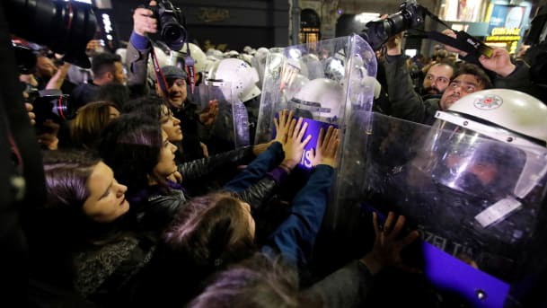

### AYS Daily Digest 08/03/2019: 54 persons granted refugee status and 74 subsidiary protection in Serbia since 2008

> 24 asylum applications were upheld in Serbia in 2018 // Under 10,000 people on the move arrived in Europe via sea this year // Hate speech and fear mongering in Bosnia // One person found dead in France … 

Istanbul, March 8th\. Photo by Reuters\.
### Feature

In the period 1 January — 30 November 2018, 7,651 persons expressed in\- tention to seek asylum and to submit an asylum application, according to the official number obtained by the Belgrade Centre for Human Rights \(BCHR\) for their annual [report](http://azil.rs/en/wp-content/uploads/2019/02/Right-to-Asylum-2018.pdf) on the right to asylum in the Republic of Serbia\.

This represents an increase compared to 2017, when 5,702 persons were registered as potential asylum seekers\.

“Of the number of persons who expressed intention to seek asylum and to submit an asylum application in Serbia in 2018, 6,776 were men and 875 were women\. According to the age structure, 2,200 were children of whom 666 unaccompanied and separated children,” the reports claims\.

The BCHR noticed that the figure of 7,651 issued certificates “does not reflect a realistic number of persons who genuinely wish to start an asylum pro\- cedure in Serbia”\. Out of this number, only 292 applied for asylum in Serbia, while the Asylum Office managed to conduct 151 interviews\.

> In all, 24 asylum applications were upheld, while 10 people were granted refugee status \(people from Afghanistan and Iran\), and 14 subsidiary protection \(Libya, Bangladesh, Pakistan, Syria and Somalia\) \. 

Based on these figures, the BCHR assumes that Serbia continues to be a country of transit for many people who formally express the intention to seek asylum\.

_“Often times, registration certificates are used for temporary regulation of legal status of these persons as well as for accommodation purposes\. In other words, the intention to seek asylum is also expressed by the foreigners who do not wish to seek asylum in Serbia, but legalise their stay pending departure to some other country\.”_

This practice, according to BCHR, _“puts an excessive burden on the asylum system and makes it impossible for the competent bodies to deal, without delay, with the cases of asylum\-seekers who perceive Serbia as a country where they wish to be granted asylum, take up residence and integrate in”\._

They call for the better system, stating that _“foreigners who do not see Serbia as a country of asylum certainly need to be assisted on humanitarian grounds, but need not necessarily be taken into the asylum procedure”\._

Additionally, 38 applications for 45 persons were dismissed on merits \(mostly for the people from Pakistan and Ghana\), and 20 asylum applications for 21 persons were rejected \(mostly for people from Afghanistan and Pakistan\) \.

The procedures were suspended in 126 cases for 176 persons, most often because the asylum\-seekers had left Serbia or the place of residence in that time\.

> _“The Asylum Office granted refugee status to 54 persons and subsidiary protection to 74 persons since establishment of the national asylum system in 2008 and until 30 November 2018\.”_ 

During 2018, an increase in the number of people coming from Iran and India was noticable in Serbia, as well as the rest of the Balkans\. The main reason for this is the decision by the government of Serbia to abolish visas for the nationals of these two countries, which came into effect in September 2017\. However, on 25 October 2018, the government abolished a visa\-free system with Iran, with the explanation that the visa\-free regime was violated\.

The report is based on information the BCHR team collected while providing advice to asylum\-seekers and has been published with the support of the UN Refugee Agency\. It summarizes relevant figures and offers analyses of access to asylum for children, the application of the ‘Safe Third Country’ concept and material reception conditions in Serbia\.

Sonja Tošković, Director of the BCHR, [points out](http://www.bgcentar.org.rs/bgcentar/eng-lat/presentation-reports-human-rights-serbia-2018-right-asylum-republic-serbia-2018/) that the most important development in 2018 was the adoption of new laws on Asylum and Temporary Protection, on Foreigners and on Border Control\. The endorsement of the Asylum and Temporary Protection law has given persons under subsidiary protection the same rights as those with refugee status, the report says\.

The BCHR, which made proposals for the drafting of the new legislation, finds that the new laws have achieved an improvement of the asylum system\. However, they note that most of the actions taken by the government in the field of refugee protection are focused on humanitarian aid and accommodation, whereas structural solutions and clear migration policies have not been implemented\.

According to the latest data from Serbia, in February, 819 people were registered as new arrivals in Serbia, includuing 153 unaccompanied/ separated children\. At the moment, 3,898 people are living in 19 centers, while it is estimated that the total number of refugees and migrants in Serbia at the end of February was 4,330\.
#### GENERAL

IOM reports that since the beginning of the year, just under 10,000 people on the move arrived in Europe via sea\. This is 13% less than the same time period last year\. 229 people have already lost their life attempting the journey

[ECRE reports](https://mailchi.mp/ecre/ecre-weekly-bulletin-08032019?e=c131869ccd&fbclid=IwAR3Qb3YkCxEtYcDKjxLqYUEjwBKJ26G-fn7ujXjoTMSNacmKkW_HC-8LFuY) on a discussion of the EU Turkey agreement at EU agenda on Migration\. It is believed that 322 people have been returned to Turkey from Greece since the deal was signed in March 2016\. It is believed approximately 5000 people were assisted to return ‘voluntarily’\. In agreement on the conditions of the deal, the EU has accepted 7000 Syrian refugees from Turkey\. Despite 1\.5 million Syrian refugees currently residing in turkey, only 143000 of them are living in camps\.

The EU is supporting 1\.5 million Syrian refugees who reside outside of camps with ‘a social safety net’ of a mere 20 euros per month\.
#### SEA
#### **Sea Watch is in Search of an Air Liason Officer Intern to Join Their Team**

> Do you identify yourself with our goals and visions and would you like to join our diverse team of volunteers, full\-time staff and international activists? 

Please [follow this Link](https://sea-watch.org/mitmachen/sea-watch-is-looking-for-an-intern-as-air-liaison-officer-alo/amp/?fbclid=IwAR3m6Kti1jusv6UrBqL7N9-q6Gwk81M8NeYD-vS-ZW92eyzgOPdLRwiuS7I) to find out more\.

[Pilotes Volontaires](https://www.facebook.com/pilotesvolontaires/?tn-str=k*F) are launching a fun fundraising venture to raise 4000€ in order to finance the next 10 full tanks of gas for the missions of Colibri\.

To find out how you can participate please [follow this link\.](http://Via this link: http://www.alvarum.com/charity/2178/challenge/2069)

#### NIGER

Approximately 200 people on the move that have been stranded in detention in Libya have been transported to a new EU\-Funded facility in Hamdallaye, Niger\.

A man reports on the situation:

> Am happy because I am out from Libya, especially the place we are living is a new comp found 40 km far from the capital city Niamey\. Its not good for living because the infrustucture is not finished didn’t have any facility electricity is also not allowed\. The place is too hot we done have containors or something ike that the water that we are drinking directly from water pumpts that’s too hot\. And it’s plan also all the refugee that’s living in the capital city are coming to this place\. It’s very difficult especially for females\. They don’t have any facility for females\. — [Sally Hayden \(Twitter\)](https://twitter.com/sallyhayd/status/1104004994611757056?fbclid=IwAR0wZTLRWJN4mjCcof4tjkeJFX0qtnQFuMavFy_Edj-XUcJQHfVJIZ79lWU) 

■■■■■■■■■■■■■■ 
> **[Sally Hayden](https://twitter.com/sallyhayd) @ Twitter Says:** 

> > Now I’m hearing from refugees evacuated in the last few days to a new EU-funded camp in Hamdallaye. [twitter.com/unhcrniger/sta…](https://twitter.com/unhcrniger/status/1102881517049651200?s=21) 

> **Tweeted at [2019-03-08 13:18:55](https://twitter.com/sallyhayd/status/1104008595895652357).** 

■■■■■■■■■■■■■■ 

#### LIBYA

UNHCR has issued a concern over the violent assault against many people on the move in Libya during protests at the Sikkah shelter last week\.

> “Around 120 migrants were transferred from the Sikkah shelter to other centres in Ain Zara and Al\-Saba’a area after the protests,” UNHCR stated\. 

#### A Commercial Ship VosVitron has returned 54 migrants it rescued form the Sea back to Libya\.

Alarm phone claims that the ship violated International Law by doing so as Libya is not considered a safe port for disembarkation\.

■■■■■■■■■■■■■■ 
> **[Flavio Di Giacomo](https://twitter.com/fladig) @ Twitter Says:** 

> > Today 54 #migrants have been returned to #Libya by a Gibraltar-flagged commercial ship. They were in international waters.

Migrants rescued in international waters should never be sent back to Libya, which is NOT a safe port. 

> **Tweeted at [2019-03-08 15:33:59](https://twitter.com/fladig/status/1104042585859993605).** 

■■■■■■■■■■■■■■ 

#### TURKEY

**Womens’ Right Protesters were assaulted by Police who stopped the March from Progressing**

### GREECE

**Arrivals**

> On Friday, five boats have arrived on the Greek Aegean Islands, with a total of 167 people — [Aegean Boat Report](https://www.facebook.com/AegeanBoatReport/posts/536891620167280?hc_location=ufi) 

2 boats arrived on Chios, 1 on Samos, 1 on Lesvos and 1 on Leros\.

Greece’s migration ministry [announced on Friday](https://www.ethnos.gr/ellada/25778_metegkatastasi-1000-prosfygon-apo-tin-ellada-stin-portogalia) a bilateral agreement on the relocation of 1000 Asylum Seekers and / or beneficiaries of international protection from Greece to Portugal\.

**IHA is in search for an experienced Field Coordinator to join their Team**
- The field coordinator has the overall responsibility for IHA’s Lagadikia project, located in the small town of Lagadikia and serving the population of the nearby refugee camp\. For more information please [follow this link](https://www.facebook.com/groups/infopointfornortherngreecevolunteers/permalink/830015820678046/?hc_location=ufi)

**Attika Human Support \(Lesvos\) in Need of Shoes and Trousers for Men**

#### BALKAN
#### WEATHER REPORT

MONTENEGRO
Changeable but predominately cloudy, locally rain, at some places showers with thunder\. In the center and south more chance of precipitation\. Wind from the south, locally strong\. Lowest temperatures from 1 to 12 and highest daily from 6 to 18 degrees\.

**SERBIA** 
Before noon predominantly cloudy and in most parts of the country cold, locally with rain and showers, midday short period of showers with rain\. In the southeast changeably cloudy and warm\. In the afternoon a decrease in cloudiness starting from the north\. Lowest temperatures from 4 to 10 and highest daily from 15 to 20 degrees\.

**BiH** 
Cloudiness will first decrease starting in the morning and later gradually in the rest of Bosnia, transient rain in the morning and in the east in the afternoon\. In Herzegovina predominantly cloudy with rain in the morning which will gradually stop as the afternoon progresses\. Wind weak to moderate from the west and southwest\. Lowest temperatures from 5 to 10 and highest daily from 13 to 19 degrees\.

**CROATIA** 
Changeably cloudy and less warm\. Locally some rain or a shower accompanied with thunder is possible, mostly in Dalmatia during the morning\. More sunny and mostly dry in the afternoon\. Wind mostly weak, in the afternoon to moderate, bowing from the southwest and alongside the coast northwestern\. Lowest temperatures from 3 to 12 and highest daily from 14 to 18 degrees\.
#### BOSNIA

[A volunteer Doctor](https://zdravniki4azilante.blogspot.com/2019/03/european-union-or-saudi-arabia.html?fbclid=IwAR1KPsJO82MgGcOT0sFYIarMTARMnvP2BPlnzwuevj-Zu1GMib8AgUwxwmc) working in Bosnia describes a push back strategy employed over the winter by EU police which saw people on the move punished by the seizing of their shoes — which in particular cases resulted in horrible health consequences\.

> From the common education provided by IOM for doctors and police officers we know that many of police officers who guard the border of the “Fortress of Europe” with such and similar means are often psychically broken but they are supported by the team of doctors \(lead by psychiatrists\) \. Here we find interesting ethical dilemma as medical professionals\. One kind of doctors support refugees and human rights other doctors support system of repression\. Doctors supporting refugees and migrants are often volunteers; doctors supporting repression are properly awarded\. Even medical doctors are on the different ethical sides\. 

Bosnia’s Security Minister Dragan Mektic in [an interview](http://www.sarajevotimes.com/bihs-security-minister-we-expect-an-escalation-of-problems-with-migrants/?fbclid=IwAR2xp3ueM2TpyFy3_BCoCLfkT6ndxJ6qT1B3plkRLblij3iU6RC_zFDwnN8) has stated that “We expect an escalation of migrant problems, not just in BiH, but along that rout”\. Mektic, as well as most of the politicians in this country, incites fear from people on the move in the local population, and has been laying the ground work for hate speech, which has been increasing since people started arriving in Bosnia\. The impact of this approach is visible in Bosnia where local people are showing less and less solidarity every day\.

At the same time, many locals still try to provide support, but are running out of everything \(they rely almost entirerly on the citizens and small local bussnesses to help\) \. In Bihac local support networks hardly have anything to offer to people who are asking for help: very often this includes basics such as food\.

Last year, around 25,000 people entered BiH hoping to reach the EU through neighboring Croatia, a member of the EU\. On Thursday this week, Bosnia’s Ministry of Security announced its intention to “close completely” the 600\-kilometre \(400\-mile\) border with Serbia and Montenegro in the east by deploying more police\. The country is also considering an offer from Hungary to send some police to assist with border patrol, Mektic said\.
#### FRANCE

A young person was found dead in a HGV trailer parked in Calais port\. The man in his twenties could not be resuscitated by emergency services staff: an autopsy is pending\.

**We are an entirely volunteer\-run media team, and we rely on our supporters to share our news\. So please share, and never forget to ACT\!**

**Apart from daily news in English, we also publish weekly summaries in [Arabic](%D8%A7%D9%84%D9%85%D8%AE%D9%8A%D9%85%D8%A7%D8%AA-%D8%A7%D9%84%D9%85%D9%83%D8%AA%D8%B8%D8%A9-%D9%88%D8%A7%D9%84%D8%B9%D8%AF%D9%8A%D8%AF-%D9%85%D9%86-%D9%85%D8%B1%D8%A7%D9%83%D8%B2-%D8%A7%D9%84%D8%A7%D8%AD%D8%AA%D8%AC%D8%A7%D8%B2-9f7b7169811b) and [Persian](%D8%A7%D8%B2%D8%AF%D8%AD%D8%A7%D9%85-%D8%AC%D9%85%D8%B9%DB%8C%D8%AA-%D8%AF%D8%B1-%D9%85%D8%B1%DA%A9%D8%B2%D9%87%D8%A7-%D9%88-%D8%B2%D9%86%D8%AF%D8%A7%D9%86-%D9%87%D8%A7%DB%8C-%D9%BE%D9%86%D8%A7%D9%87%D9%86%D8%AF%DA%AF%DB%8C-f15b98efbd26) \. Click on those links to check out the ones from the week February 25 to March 3\.**

**We strive to echo correct news from the ground through collaboration and fairness\. Every effort has been made to credit organisations and individuals with regard to the supply of information, video, and photo material \(in cases where the source wanted to be accredited\) \. Please notify us regarding corrections\.**

**If there’s anything you want to share or comment, contact us through Facebook or write to: areyousyrious@gmail\.com**

_Converted [Medium Post](https://medium.com/are-you-syrious/ays-daily-digest-08-03-2019-54-persons-granted-refugee-status-and-74-subsidiary-protection-in-a21b41045592) by [ZMediumToMarkdown](https://github.com/ZhgChgLi/ZMediumToMarkdown)._
