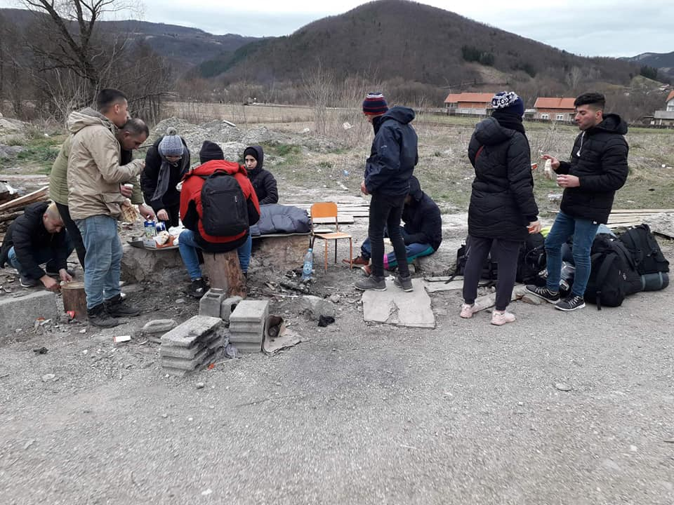
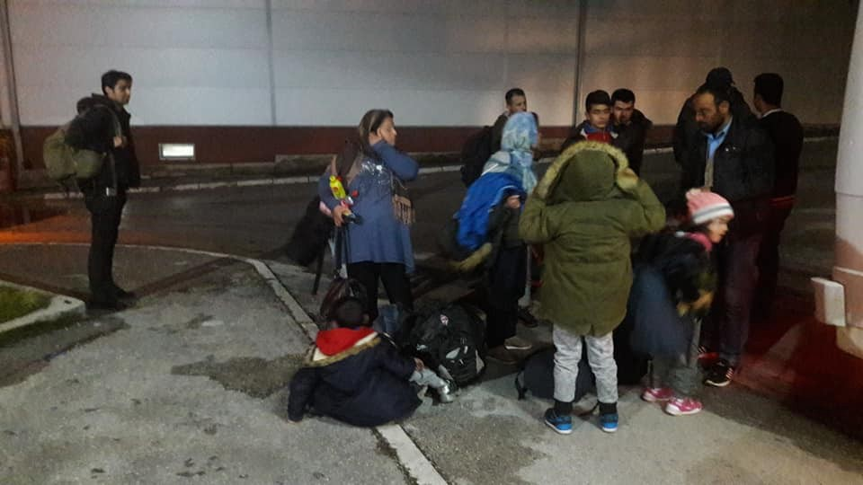

### AYS WEEKEND DIGEST 9–10/3/2019: Deadly weekend at the European frontiers, but looks like nobody really cares

_Death of people on the move, even children, no longer news in Europe // Pressure on the organization working in Morocco // Serbia, Montenegro and Bosnia — the Balkan route active, again // Help needed in France_

](assets/ef9588a621ec/1*gGWdOT6fispK5vL_vEBrLg.jpeg)

Patras \(Greece\), March 2018: Migrants wait on the outside of the port for the moment to be able to climb and try to hide inside trucks going to Italy\. From George Moutafis\. By [Fotovoimento 15M](https://www.facebook.com/Fotomovimiento.org/)
### Feature

OnSunday morning, a headless body of a child was found on the shore of Lesvos\. It is believed to belong to a 9\-year\-old girl who went missing on February 13th, when a boat carrying 51 people left Turkey heading toward Greece\. However, the boat sank outside Tsonia, Lesvos north\.

The same day in Bosnia, the body of a young boy from Morocco was found\. 
Hamza, his friends remembered, went to cross the border to Croatia from Bosnia, but got pushed back by the Croatian police into Serbia\. He wanted to cross back into Bosnia, tried to cross the \[border\] Drina river, but drowned\.

And more\.

Another body was found on Lesvos on Sunday in the rocky area of Aghios Theodoros Akra — Koraka, Lesvos\. The body is in a state of advanced sepsis and for this reason, it cannot be ascertained whether it belongs to a man or a woman\.

According to the informal source, a 30\-year\-old Algerian migrant was killed in Šid, Serbia, on Friday, during an attempt to embark a train to Croatia, Info Park Belgrade reports\. Apparently, the person was not provided with any emergency aid although he was still alive some two hours after the
accident\. There is no official information yet\.

Over 200 people, human beings, died this year while trying to reach a place where they will feel safe and get a chance for a normal life\. Any kind of life\. But, they did not make it due to closed borders\.

The death of people on the move has not been main news in the mainstream media for a long time\. It has become normality, almost\. Even when the victims are children\.

In the case of Bosnia, the children are not even counted into the official numbers of casualties\. [News portal BIRN](https://balkaninsight.com/2019/03/07/bosnia-records-12-migrant-deaths-in-2018/?fbclid=IwAR3AZUxB7oVWlF2R_8Az7jDZ0FP_x-qT4ayApPyMfGkZDU1-8GnyBFoQJHQ) collected the official data on the number of deaths in the country\. Apparently, only 12 died in Bosnia in 2018\.

In Bihać area, the official sources are claiming, four deaths are registered, in two cases natural deaths are confirmed, one case concerned drowning and one person was killed\. Nevertheless, they do not mention a child that died in the camp BIRA, run by the IOM, due to the lack of medical care \(UNHCR and DRC responsibility\) \. The boy died in the camp of pneumonia\.

They also do not mention that a man was killed in a car accident in front of the other camp run by the IOM, Miral in Velika Kladuša\.

The UN refugee agency, UNHCR, told BIRN it does not possess data on migrants and refugees who died in Bosnia\. Even when they died under their watch, like in the case of the boy in Bira or the man in the front of Miral\.
### Morocco

Apparently, the authorities in Nador are trying to [ban the work of AMDH](https://www.facebook.com/…/a.16931257808…/2288171268061802/…) , Morocco’s biggest human rights organization helping people on the move who live in precarious conditions while waiting to continue their journey\. \(Read more in our [special from Nador](ays-special-from-nador-we-know-that-what-we-do-here-is-dangerous-d16c0f587957) \)
### Tunisia

64people were rescued by the Tunisian Navy off the coast of Medenine, [Italian media are reporting](http://www.ansamed.info/ansamed/it/notizie/rubriche/cronaca/2019/03/08/migranti-tunisia-soccorre-64-su-barcone-partito-da-libia_a60e292f-31e3-4438-a6d0-cd8d67faed86.html?fbclid=IwAR2uVyK_Xot61eMxInskMxytssm7c0Wp_LM-KWGv0aeSaMD4gAQN_4EDMdQ) \. The boat was heading towards Italy, after leaving Libya\. Among those who were rescued were four women\.

The NGO Tunisian Forum for Economic and Social Rights \(Ftdes\) launched an appeal to urgently guarantee the necessary psychological, legal and social assistance to asylum seekers in order to be hosted in conditions respectful of their human dignity\.

_“The UN agencies present in the Medenine region must take responsibility for the protection of sub\-Saharan refugees hosted in poor and inhumane living conditions at the city’s reception centre,”_ the Ftdes writes in a press release\.
### Spain

During this weekend, 46 people have been rescued near the port of Almeria\. Among those rescued were one woman and a child\.
### Greece

The [Mobile Info Team published some useful tips](https://www.facebook.com/mobileinfoteam/photos/a.1800063030222418/2392643737631008/?type=3&theater) for an asylum hearing\. This time it is about the interpreters\.

More [useful info](https://www.refugee.info/greece/women-greece--greece/womens-rights-in-greece?language=en&fbclid=IwAR289KeQ5QTlpdFuxcrEAIe5Aqt3OjBdXV6_WZnF6zHHQtK0wVu7Rm34xvw) comes from RefugeeInfo\. They publish a guide for women on how to reporting a crime or harassment, info on marriage and family life, the asylum process, employment and health\.
### Bosnia

Anumber of people who are arriving in Bosnia on their way towards the EU are rising, again\. According to the official figures, over 2,500 people entered the country this year\. Many are coming from Greece via Albania and Montenegro, or via Kosovo, Macedonia and Serbia\.

At the same time, many people are leaving, and estimates are that about 3,900 people are in the country at the moment \(over 24,000 entered in 2018\) \. However, these numbers are not reliable even though coming from official sources\. The problem remains the registration process and access to asylum, as well as internal pushbacks\.

Checkpoint in Kljuc, on the way from Sarajevo to Bihac\. Local police stop buses on this route, taking people out and leaving them by the road\. The help is provided by the local Red Cross volunteers\. Photo Red Cross Kljuc\.

> Since the beginning of this year, AYS received several reports about police violence inside of Bosnia, including reports from Velika Kladusa and recently Mostar\. Apparently, local police randomly stop people in the streets and take them to the place where they beat them up, including police stations or just somehow hidden areas in the cities\. 

### Montenegro

The number of people who are passing through Montenegro is also on the rise, as well as hate speech and fear\-mongering in the local media\. As in the other countries, the media are accusing people on the move for almost everything bad that is happening, saying that people are afraid of refugees and migrants\. They often use the term “illegal migrants” which is discriminatory\.

Dozens of people are every day in Pljevlja, the border area in Montenegro, heading toward Bosnia\. Photo: Bona Fide Pljevlja\.

According to official numbers, during 2018 4,570 people were registered in the asylum centre at Spuž\. People who stay longer than a few days are entitled to material assistance from the state which included 55 euro for each single person, or 126 for a family of five every month\.

At the end of the last year, IOM started building another transit centre in Božaj, near to the border with Bosnia\.
### Serbia

Info Park Belgrade also counts more people in the city and many new arrivals\. Most of the new arrivals are boys travelling on their own, from Afghanistan and Pakistan\.

The same organization recorded that Hungarian authorities prevented 42 irregular entries to the country this weekend\. All the people were pushed back to Serbia\.

With the number of people who are arriving to the Balkans on the rise, we remind you again [of the letter](letter-to-citizens-of-the-eu-from-the-periphery-politics-of-the-closed-borders-are-bringing-us-5e0f7012436e) written and signed by a number of the local activists, expressing concerns for the current situation in which the rise of fascism and a deterioration in basic human rights, such as freedom of movement and the right to seek asylum is visible\.
### Slovenia

Slovenian [Philanthropy is looking for a volunteer](https://www.facebook.com/Slovenskafilantropija/posts/2149886685093162?__tn__=-R) :

“ _The gentleman from Pakistan has been driving a truck in the past, and now he wants to get the exam in Slovenia, so he has to pass the imp test \(road traffic exams\) \. The acquisition will increase his chances of employment\. He speaks Slovenian, but he has problems only with the understanding of the more difficult texts and professional terms, so we are looking for a volunteer at Slovenska filantropija to save the tests and help him understand the content of the tasks\.”_
### Belgium

T [he testimony](https://www.facebook.com/voixsp1/posts/2130618320354719?__xts__[0]=68.ARDkz5SeCmIySWI9Jg4uRDhYtlq9Gu7m4Z5MD7yiPunIgniMiuw6Jr4JLJlUTp3XOOjiLHNdGj22LjTAoNqBlCUrgoqHhq7xyjBxaptevsyAmy2WKv_wf5vXfhWEb_vWm4QEUCH-GQ8OflfIkFQzewc5JqsZ7jZeWRKtpBAmS-4dFI-bo9hZYyv6TSQoz2vNv5ToSuSxpUAetOv9YLZgNVQXmTiKrIgckeUPoeK8KdGgjYf_lG-O92gaRZ6aWw4ODV44l51k9fIjsAl-xq1LF9gLTOhwSk1wzhV2f5NwsluB_08SQV2nNB5b4BJQ3H4eSbTAo4cPwRm4ylnXLc3xlbn7&__tn__=-R) of a man in closed detention since late 2018:

“ _My name to me is Diallo Ahmad Bailo, member of the Voice of the without papers Brussels\. I have been closed since December 25, 2018, at the closed centre Votem, in Liège\. I have been in Belgium since January 2014, I have been undocumented since January 2014\. As I am without papers, they nicknamed me “illegal”\._

_Normally I was born in Mauritania but my parents are of Guinean origin, from Guinea\-Conakry\. But for me, I was born in Mauritania\. I had information yesterday with my lawyer, the office of foreigners wanted to contact the embassy of Guinea to deport me to Guinea, but I know nothing, almost nothing at all, from Guinea\. I wanted to be deported to Mauritania\._

_In relation to my health too: I’ve been sick for a very long time\. I did everything not to be expelled but I see there is no other solution\. \[it’s always without eating but\] I stopped doing the hunger strike, because at the level of my health, I’m sick of the times \(from the liver? \), I can’t make hunger strike for a long time\. As they didn’t release me, I stopped doing it \[the hunger strike\] \._

_Here in the closed centre it’s not like outside quite the medical services, it’s just giving you paracetamol for headaches\. It’s just that, there’s no medical service quite normal as if you’re free outside\. Inside, I’ve been here in isolation for 2 weeks, I’m all alone in a room\. I’m going out 30–40 minutes a day, I’m taking a shower a day\. There are 3 meals a day, there is television, but I have been in isolation for two weeks…\._

_Since 2 weeks I don’t sleep, I have a lot of stress, a lot of nightmares\._ 
_There’s only the security that comes every time, I don’t see other people\. I don’t communicate with any other person\. Ah, really the other workers, they are not quite open, only “ good morning “, “ good morning “ and finished\. They’re not quite open\. For me, it’s people, almost racists\. They don’t speak with anyone, not even “ good morning “, other people say “ good morning “, others they pass as if they don’t see anything\. \(…\) communication cut\!_

There is a [march next weekend](https://www.facebook.com/voixsp1/posts/2129886200427931?__xts__%5B0%5D=68.ARAylihatazZvCeOnusw8pUOd8rBqq-fqWCnl3hZ40dTCZNv9JoOp2Ia-wJiWUh8wCbxCkB9HoECC83vykELYUeMQwmx94XT25ap3L1LlrZcT_pBuBviXS91h0BZ90_WDHJ8OU_P2CN_WZF_FwIHeNX8y7JSlBKJCVXN7hH2pFZgj1SqSy5y-e0SNOg6KOw6gI6NapeLsun-wGTFZYJ8VxEp7M8TEyzrSKpIhTUHk8Fcr4cUOgUN2yH5s1DKG3i1u4RLMOYxY4hbaEZu4q9F5oA62ZhXvfwokqAHEUPNkbL6QXujsmvbEtuDixqPCuImaddWsgMH-xSzeZcNn6QyE49wlXR3&__tn__=-R) in support of regularizing the status of those without papers\.
### France

Itis estimated there are around 500 displaced people currently living in the Dunkirk area\. The emergency centre continues to be at maximum capacity, meaning the number of people camping outside its doors has continued to grow\.

Over 200 people currently reside in tents outside the centre, with nearly 100 more in smaller camps scattered throughout the surrounding woodland\.

If you would like to get involved, you can find out more [here](http://www.mobilerefugeesupport.org) , or, if you want to donate, use [this link](https://www.facebook.com/MobileRefugeeSupport/posts/932891666916445?__xts__%5B0%5D=68.ARBeDjNS8Z8XebGV9SzIkKu82jNIZoNjrw8W7nhcHTY0vOStpOhElTb0mcTtDcU0BgLewunRdFtSI3ocH_Snhixsne6NKJk5VInBoBBd-Sk4hbH4zM-CeO0qsNNQNNnQ3AD82U7AQhPDmktdwYJbMNtCuA07C1CKpY9vodG9t1ek6Q3Nsmt3MnNFJ1OnEbkylP1ZeMiZuceuGg7r3eqEuPyLP27vggTGC1a9-ophU_dANeKyidukaevO50yEnwbJvn5ohHyHlza-2pN6NsOV8-PbdHpWyTDJxFDqv150LEL-Lt4ws8ajqefjo4O6ZNCl-Oo1Fr-SCOVW1vJudoniNr4&__tn__=-R) \.

There will be a solidarity day with food and supply distribution next weekend\. [Read more for details\!](https://www.facebook.com/permalink.php?story_fbid=1091812894352815&id=598228360377940&__xts__%5B0%5D=68.ARBEmtg7mHozDHqc9OEG3Un6EVs2EOkBsNgcMRJ29YtqtMaoDUCtRggj6-1a3e7feS-2_t0rgq7rJEHp0wN2hQogJbpqtxg65dNHKt8gmTwwYRVs1CiN6FIHoA5_tBJYViYM_yyO77fL93MqNTOvq8S16KdgxKWK2ryEMkzXGWHi63VHqe5iRqrpYoUxX386W9u__3u5ablfNOtX-7NqFHFA7Wa5zuAgBZnYlauUtgLevw9L6-W8wfLNin9WDPBSppJr7p4Os0yMvQJA5LBrnHCqJVcPXeECpX-rBcW9Lv7zSZv0DiRqq8JT_TyKRocgB-o1KUyKyMVQw5BohkjxWzoiaw&__tn__=-R)
### General

On4 April 2019, the Council of Europe Special Representative on Migration, together with the Council of Europe Human Rights Policy and Co\-operation Department, the European Commission, and the European Migration Network, organise the international conference “Effective Alternatives to the Detention of Migrants”\.

The Special Representative has created a new web page for this purpose, where all information is gathered on the event, including the concept note and the programme\. Participants are invited to register online by 20 March 2019 at the latest\.

Another AYS Special, this time on the [feminist response to the struggles](https://medium.com/are-you-syrious/ays-special-does-your-feminism-intersect-with-females-on-the-move-in-europe-9161e90ba33b) of the people on the move\.

> “But, there is nothing that leaves me feeling more disillusioned than reading or reporting about the injustices faced by women, trans\-women and non binary individuals on the move hoping to reach Europe — where the darkest nightmare is not representative of the realities faced by these subgroups during their attempts to claim asylum\.” 

**Apart from daily news in English, we also publish weekly summaries in [Arabic](%D8%A7%D9%84%D8%AA%D8%BA%D9%8A%D9%8A%D8%B1%D8%A7%D8%AA-%D9%81%D9%8A-%D9%82%D8%A7%D9%86%D9%88%D9%86-%D8%A7%D9%84%D9%84%D8%AC%D9%88%D8%A1-%D9%81%D9%8A-%D8%A7%D9%84%D8%AF%D9%86%D9%85%D8%A7%D8%B1%D9%83-b99e429d54ad) and [Persian](%D8%B9%D9%88%D8%B6-%D8%B4%D8%AF%D9%86-%D9%82%D9%88%D8%A7%D9%86%DB%8C%D9%86-%D9%BE%D9%86%D8%A7%D9%87%D9%86%D8%AF%DA%AF%DB%8C-%D8%AF%D8%B1-%D8%AF%D8%A7%D9%86%D9%85%D8%A7%D8%B1%DA%A9-7b984cac7a86) \. Follow the links to read and share the ones from the week of March 4–10\.**

**We strive to echo correct news from the ground through collaboration and fairness\. Every effort has been made to credit organizations and individuals with regard to the supply of information, video, and photo material \(in cases where the source wanted to be accredited\) \. Please notify us regarding corrections\.**

**If there’s anything you want to share or comment, contact us through Facebook or write to: areyousyrious@gmail\.com**

_Converted [Medium Post](https://medium.com/are-you-syrious/ays-weekend-digest-9-10-3-2019-deadly-weekend-at-the-european-frontiers-but-looks-like-nobody-ef9588a621ec) by [ZMediumToMarkdown](https://github.com/ZhgChgLi/ZMediumToMarkdown)._
